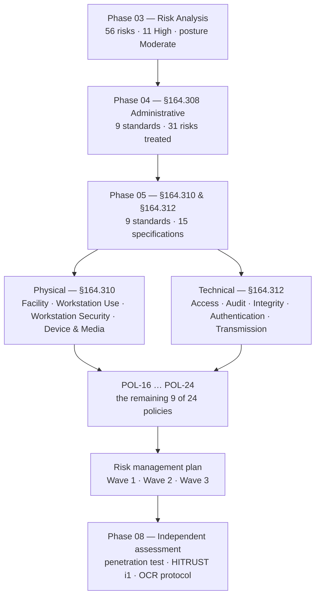

# 05.01 — Physical &amp; Technical Safeguards Overview

| Field | Value |
|---|---|
| Document ID | MBH-PTS-OVW-2026-501 |
| Version | 1.0 |
| Date | 2026-07-15 |
| Classification | Confidential — Electronic Protected Health Information (ePHI) // Illustrative Portfolio Sample |
| Owner | Daniel Cho, Chief Information Security Officer &amp; HIPAA Security Official |
| Co-Owner | Anthony Ruiz, Chief Information Officer |
| Author | Advisory Team (Healthcare GRC / HIPAA) |
| Status | Approved |

## Purpose

This document opens **Phase 05 — Physical &amp; Technical Safeguards** and establishes how MercyBridge Health Network implements the two remaining safeguard families of the HIPAA Security Rule: **45 CFR §164.310 (Physical Safeguards)** and **45 CFR §164.312 (Technical Safeguards)**. It enumerates the **four physical standards** and **five technical standards**, lists every implementation specification with its **required (R)** or **addressable (A)** designation, names the Phase 05 document that delivers each, and states the risk position the phase inherits from Phase 04.

Phase 04 built the management system — who decides, who is authorised, who is trained, who reviews, who recovers. Phase 05 builds the **mechanisms that enforce those decisions in the physical plant and in the technology estate**: the badge reader on the data-centre door, the sanitisation certificate for a decommissioned ultrasound, the unique account that makes an audit log meaningful, the encryption that turns a stolen laptop from a breach into a non-event.

> **Phase 05 scope: 9 standards · 15 implementation specifications (4 required, 11 addressable) · policies POL-16 … POL-24 · treats the 25 risks left open by Phase 04 plus R-24 — including all 6 remaining High risks.**

## 1. Where Phase 05 Sits

The three families are not interchangeable. A covered entity that installs encryption without an access-authorisation process has technology nobody governs; a covered entity that writes an access policy without unique user identification has governance nothing enforces. **§164.310 and §164.312 are where Phase 04's intent becomes observable in evidence.**

## 2. The Four Standards of §164.310 — Physical Safeguards

| # | Standard | Citation | Implementation specifications | R / A | Delivered by |
|---|---|---|---|---|---|
| 1 | Facility Access Controls | §164.310(a)(1) | Contingency operations · Facility security plan · Access control and validation procedures · Maintenance records | A · A · A · A | **05.02** |
| 2 | Workstation Use | §164.310(b) | *(no separate specifications — the standard is itself required)* | R | **05.03** |
| 3 | Workstation Security | §164.310(c) | *(no separate specifications — the standard is itself required)* | R | **05.03** |
| 4 | Device and Media Controls | §164.310(d)(1) | Disposal · Media re-use · Accountability · Data backup and storage | **R** · **R** · A · A | **05.04** |

**Counting note.** Four standards; **eight implementation specifications**, of which **two are required** (disposal, media re-use) and **six are addressable**. Two standards — Workstation Use and Workstation Security — carry no sub-specifications and are satisfied by the standard itself, which is nonetheless mandatory.

## 3. The Five Standards of §164.312 — Technical Safeguards

| # | Standard | Citation | Implementation specifications | R / A | Delivered by |
|---|---|---|---|---|---|
| 1 | Access Control | §164.312(a)(1) | Unique user identification · Emergency access procedure · Automatic logoff · Encryption and decryption | **R** · **R** · A · A | **05.05** |
| 2 | Audit Controls | §164.312(b) | *(no separate specifications — the standard is itself required)* | R | **05.06** |
| 3 | Integrity | §164.312(c)(1) | Mechanism to authenticate ePHI — §164.312(c)(2) | A | **05.07** |
| 4 | Person or Entity Authentication | §164.312(d) | *(no separate specifications — the standard is itself required)* | R | 05.08 |
| 5 | Transmission Security | §164.312(e)(1) | Integrity controls · Encryption | A · A | 05.09 |

**Counting note.** Five standards; **seven implementation specifications**, of which **two are required** and **five are addressable**.

**Running total across the rule.** §164.308 contributes 9 standards and 21 specifications (Phase 04); §164.310 and §164.312 contribute **9 standards and 15 specifications** here. Adding the organisational requirements of §164.314 and the documentation specifications of §164.316 brings the programme to the **18 standards and ~50 implementation specifications** baselined in 01.04.

## 4. The Physical / Technical Split — and Why It Blurs in a Hospital

| Question | Physical safeguard answer — §164.310 | Technical safeguard answer — §164.312 |
|---|---|---|
| Who may stand in front of the machine? | Badge, escort, mantrap, visitor management | — |
| Who may log into the machine? | — | Unique user ID, MFA, role-based entitlement |
| What happens when the user walks away? | Screen positioning, privacy filter, physical siting | Automatic logoff, proximity-badge session lock |
| What happens when the machine leaves the building? | Chain of custody, disposal, media re-use | Encryption at rest — the breach safe harbour |
| What happens when someone looks at the wrong chart? | — | Audit controls, behavioural monitoring |
| What happens when the data is wrong? | Environmental protection of storage | Integrity — mechanism to authenticate ePHI |

A hospital complicates the split in ways an office does not. MercyBridge's **4 hospitals** — Rivermont General (520 beds), Northgate Medical Center (280), Lakeshore Community (210) and Westfield Regional (190) — plus **~30 outpatient sites** are, by design and by law, **semi-public buildings**. Patients, families, contractors, students and emergency responders move through clinical space continuously and legitimately. The physical perimeter therefore cannot carry the security load it carries in a corporate campus, and the technical safeguards must be strong enough to survive an adversary who is already standing inside the building. This is stated once here and assumed throughout Phase 05.

## 5. The Environment Phase 05 Must Secure

| Dimension | Figure | Consequence for Phase 05 |
|---|---|---|
| Information systems enterprise-wide | 210 | Scoping discipline — only 68 are in ePHI scope |
| Systems creating, receiving, maintaining or transmitting ePHI | **68** | The denominator for every technical control metric |
| Facilities | 4 hospitals + ~30 outpatient sites; 2 data centres | Physical controls must scale to a distributed, semi-public estate |
| Workforce | ~6,500 | Unique user identification at scale; training dependency |
| Networked medical devices | **6,120** (3,170 ePHI-bearing; 1,300 unsupported OS) | The hardest population — device and media controls, §164.310(d) |
| MFA coverage at baseline | 44 of 68 systems | Wave 1 to 68 of 68 — 05.08 |
| Encryption at rest at baseline | 51 of 68 systems | Wave 2 to 68 of 68 — 05.05 |
| Encryption in transit at baseline | 60 of 68 systems | Wave 2 to 68 of 68 — 05.09 |
| SIEM log ingestion | 49 of 68 at baseline; **62 of 68** after Phase 04 | Wave 1–2 to 68 of 68 — 05.06 |
| Elevated EHR accounts | **214 reduced to 63** in Phase 04 | Technical enforcement and recertification — 05.05 |

## 6. "Addressable" in the Physical and Technical Families

**§164.306(d)(3)** applies here exactly as it did in Phase 04: implement the specification where reasonable and appropriate; otherwise document why not **and** implement an equivalent alternative measure where that is reasonable and appropriate. There is no branch that permits inaction.

**MercyBridge's determination (ADR-0010).** All **11 addressable specifications** in §164.310 and §164.312 were assessed as reasonable and appropriate for an organisation of this size and complexity. **All 11 are implemented.** One narrow exception is documented rather than hidden: **118 telemetry devices cannot negotiate TLS** under vendor firmware constraint, so the §164.312(e)(2)(ii) encryption specification is met for those devices by an **equivalent alternative measure** — dedicated isolated VLANs with default-deny egress — recorded under §164.306(d)(3)(ii)(B) and reviewed annually. That is the correct use of the addressable provision, and it is on file with a date and the Security Official's signature.

## 7. The 2025 NPRM — What Changes for This Phase

The **2025 HIPAA Security Rule NPRM** would rewrite the assumptions of Phase 05 more than any other phase. It proposes to **remove the addressable/required distinction entirely** and to make explicitly mandatory several controls that are addressable today.

| NPRM proposal | Status under the in-force rule | If finalised | MercyBridge position |
|---|---|---|---|
| **Encryption of ePHI at rest** | §164.312(a)(2)(iv) — **addressable** | **Required** | 51 of 68 at baseline → 68 of 68 by Wave 2 (2027-01-31); device exceptions documented |
| **Encryption of ePHI in transit** | §164.312(e)(2)(ii) — **addressable** | **Required** | 60 of 68 → 68 of 68; 118 telemetry devices isolated under a documented alternative |
| **Multi-factor authentication** | Not named; inferred under §164.312(d) | **Required** | 44 of 68 → 68 of 68 by Wave 1 (2026-10-31) |
| **Network segmentation** | Not named; supports §164.312(a)(1) and (e) | **Required** | Ten-zone model live; micro-segmentation 41 of 68 → all Tier 1–2 by Wave 2 |
| Asset inventory and network map | Implicit | Explicit, maintained | Delivered in Phase 02; maintained under 02.10 |
| Annual penetration test and vulnerability scanning | Implicit under §164.308(a)(8) | Explicit | Ironwood Security Labs engagement, Phase 08 |
| Automatic logoff / session termination | §164.312(a)(2)(iii) — addressable | Required | Enterprise standard set in 05.03 and 05.05 |

**Programme decision (ADR-0002, reaffirmed).** MercyBridge builds to the **in-force rule** for compliance and to the **NPRM** for design. Building to the stricter of the two costs nothing in defensibility and removes a future remediation project. Every addressable specification in this phase is therefore implemented as though it were required.

## 8. What Phase 05 Delivers

| Document | Standard(s) | Principal outputs |
|---|---|---|
| 05.00 | — | Phase README, scope, structure |
| **05.01** | All nine | This overview; standard-to-document map; NPRM readiness position |
| **05.02** | §164.310(a)(1) | Facility security plan; badge and visitor management; data-centre and IDF access; maintenance records |
| **05.03** | §164.310(b), (c) | Workstation use standard; WOW and shared-workstation controls; session timeout by clinical area; privacy filters |
| **05.04** | §164.310(d)(1) | Disposal and re-use to NIST SP 800-88; chain of custody; portable media; leased imaging equipment return |
| **05.05** | §164.312(a)(1) | Unique user ID; break-the-glass emergency access; automatic logoff; encryption at rest |
| **05.06** | §164.312(b) | Audit log coverage 49 → 68; SIEM; VIP and coworker-record monitoring; retention and proactive review |
| **05.07** | §164.312(c)(1) | HL7 and DICOM interface validation; database integrity; backup verification; amendment audit trail |
| 05.08 | §164.312(d) | Person or entity authentication; MFA to 68 of 68; device and vendor authentication |
| 05.09 | §164.312(e)(1) | Transmission security; TLS to 68 of 68; HIE, secure messaging and telemetry exceptions |
| 05.10 | §164.312(a)(2)(iv), (e)(2)(ii) | Encryption standards and key management |
| 05.11 | §164.310(d), §164.312 | Medical device and IoMT security controls |
| 05.12 | — | Control-to-risk traceability for Phase 05 |
| 05.13 | — | Phase summary and transition to Phase 06 |

## 9. Policies POL-16 … POL-24

| Policy | Title | Standard(s) | Owner |
|---|---|---|---|
| POL-16 | Facility Access Controls &amp; Physical Security | §164.310(a)(1)–(a)(2) | Anthony Ruiz |
| POL-17 | Workstation Use &amp; Workstation Security | §164.310(b); §164.310(c) | Marcus Reed |
| POL-18 | Device &amp; Media Controls, Disposal &amp; Re-use | §164.310(d)(1); NIST SP 800-88 | Anthony Ruiz |
| POL-19 | Technical Access Control &amp; Unique User Identification | §164.312(a)(1)–(a)(2) | Marcus Reed |
| POL-20 | Audit Controls &amp; Log Management | §164.312(b) | Marcus Reed |
| POL-21 | Data Integrity &amp; Person or Entity Authentication | §164.312(c)(1); §164.312(d) | Dr. Samuel Ortega |
| POL-22 | Transmission Security | §164.312(e)(1)–(e)(2) | Marcus Reed |
| POL-23 | Encryption &amp; Key Management | §164.312(a)(2)(iv); §164.312(e)(2)(ii) | Daniel Cho |
| POL-24 | Medical Device &amp; IoMT Security | §164.310(d); §164.312 | Anthony Ruiz |

With these nine approved on **2026-07-15**, the **24-policy suite is complete** and **R-54** (legacy policy suite) closes.

## 10. Risk Position Entering and Leaving Phase 05

| Standard | Risks principally treated | Of which High |
|---|---|---|
| §164.310(a)(1) Facility Access Controls | R-16, R-22, R-52, R-53 | — |
| §164.310(b)–(c) Workstation Use &amp; Security | R-07, R-27, R-35, R-51 | — |
| §164.310(d)(1) Device &amp; Media Controls | R-11, R-15, R-33, R-44, R-45 | **R-11** |
| §164.312(a)(1) Access Control | R-02, R-03, R-04, R-05, R-06, R-07, R-13, R-24, R-32, R-40 | **R-24, R-40** |
| §164.312(b) Audit Controls | R-03, R-05, R-13, R-36, R-46, R-55 | — |
| §164.312(c)(1) Integrity | R-14, R-42, R-43, R-46, R-47, R-48 | — |
| §164.312(d) Person or Entity Authentication | R-01, R-13, R-34, R-39 | **R-01** |
| §164.312(e)(1) Transmission Security | R-14, R-18, R-20, R-21, R-38, R-42 | — |
| Segmentation and device lifecycle (NPRM-forward, 05.11) | R-09, R-10, R-17, R-19, R-25 | **R-09, R-10, R-17** |

**All six High risks left open by Phase 04 — R-01, R-09, R-11, R-17, R-24, R-40 — are treated in this phase.** Full residual re-scoring is performed in **05.12**; posture moves to **Low-to-Moderate** on completion of Wave 2, as forecast in 03.08.

## Cross-References

| Reference | Relevance |
|---|---|
| 01.04 — HIPAA Security Rule Overview | The 18 standards and ~50 specifications in full |
| 02.02 — ePHI System Inventory | The 68 in-scope systems and their control baselines |
| 02.04 — Medical Devices &amp; IoMT | The 6,120-device fleet underpinning 05.04 and 05.11 |
| 02.05 — Network Architecture &amp; Segmentation | The ten-zone model and micro-segmentation position |
| 03.04 — Existing Controls Assessment | Baseline ratings C-P01 … C-P07 and C-T01 … C-T10 that Phase 05 improves |
| 03.07 — Risk Register | The 56 risks; the 26 addressed here |
| 03.08 — Risk Management Plan | Wave 1–3 sequencing, owners and board-approved exceptions |
| 04.01 — Administrative Safeguards Overview | The governing family and the addressable doctrine applied here |
| 04.12 — Control-to-Risk Traceability | The 25 untreated risks plus R-24 handed to this phase |
| 05.02 → 05.11 | The standard-by-standard implementation documents |
| 05.12 — Control-to-Risk Traceability | Residual re-scoring for Phase 05 |
| Phase 08 — HITRUST &amp; Independent Assessment | Where these safeguards are independently validated |

---
[⬅ Previous](05.00-README.md) · [🏠 Phase README](05.00-README.md) · [Next ➡](05.02-facility-access-controls.md)
