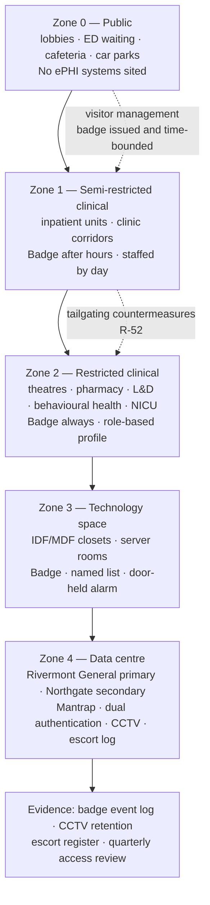

# 05.02 — Facility Access Controls

| Field | Value |
|---|---|
| Document ID | MBH-PTS-FAC-2026-502 |
| Version | 1.0 |
| Date | 2026-07-15 |
| Classification | Confidential — Electronic Protected Health Information (ePHI) // Illustrative Portfolio Sample |
| Owner | Anthony Ruiz, Chief Information Officer |
| Co-Owner | Karen Boyd, Chief Compliance Officer (facilities and security services liaison) |
| Author | Advisory Team (Healthcare GRC / HIPAA) |
| Status | Approved |

## Purpose

This document implements **45 CFR §164.310(a)(1) — Facility Access Controls**, the standard that requires a covered entity to *"implement policies and procedures to limit physical access to its electronic information systems and the facility or facilities in which they are housed, while ensuring that properly authorized access is allowed."*

That final clause is the whole problem in a hospital. MercyBridge operates **4 acute-care hospitals and approximately 30 outpatient and clinic sites** that are open to the public by design, by mission and in several respects by law. Emergency departments cannot be locked. Visitors, patients, families, students, clergy, vendors, contractors, couriers and emergency responders move through clinical space continuously and legitimately. A physical security model borrowed from a corporate campus does not survive contact with that reality.

MercyBridge's answer is **concentric zoning**: accept that the outer envelope is semi-public, and place progressively stronger, individually evidenced controls around the areas where ePHI and the systems that hold it actually live.

> **Standard: §164.310(a)(1) · four implementation specifications · all four addressable · all four implemented · governing policy POL-16.**

## 1. The Standard and Its Specifications

| Spec | Citation | Requirement | R / A | MercyBridge position |
|---|---|---|---|---|
| Contingency operations | §164.310(a)(2)(i) | Procedures allowing facility access to support data restoration under the disaster recovery and emergency mode operation plans | **Addressable** | Implemented — emergency access roster, override credentials, DR facility entry procedure |
| Facility security plan | §164.310(a)(2)(ii) | Policies and procedures to safeguard the facility and equipment from unauthorised physical access, tampering and theft | **Addressable** | Implemented — refreshed for all 34 sites (was partial; C-P02) |
| Access control and validation procedures | §164.310(a)(2)(iii) | Procedures to control and validate a person's access based on role or function, including visitor control and software-programme access control | **Addressable** | Implemented — role-based badge profiles, enterprise visitor management |
| Maintenance records | §164.310(a)(2)(iv) | Documentation of repairs and modifications to the physical components of a facility related to security | **Addressable** | Implemented — CMMS records for facilities and Clinical Engineering |

**All four specifications of this standard are addressable and all four are implemented.** No §164.306(d)(3)(ii) rationale is on file for §164.310(a)(1). Under the **2025 NPRM** all four would become mandatory; MercyBridge's position is unchanged either way.

## 2. The Concentric Zone Model

| Zone | Sites in scope | Control set | Evidence produced |
|---|---|---|---|
| 0 — Public | All 34 | CCTV at entrances; 24×7 security staffing at the 4 hospitals; wayfinding that keeps the public out of clinical corridors | CCTV retention 30 days; incident reports |
| 1 — Semi-restricted clinical | All 34 | Badge required outside published hours; staffed reception by day; workstation siting rules per 05.03 | Badge event log; observation rounds |
| 2 — Restricted clinical | 4 hospitals; 11 outpatient sites | Badge always; role-based profile; anti-passback in theatres and pharmacy | Badge log; quarterly profile recertification |
| 3 — Technology space | 34 sites — 96 IDF/MDF rooms | Named-list badge access; door-held-open alarm to Security Operations; no shared keys | Named list; alarm log; annual key audit |
| 4 — Data centre | 2 | Mantrap; badge plus PIN; CCTV covering all racks; escorted visitors only; equipment removal pass | Escort register; removal passes; CCTV 90 days |

**Design principle.** No ePHI system, server, IDF or unattended clinical workstation is sited in Zone 0. Where an outpatient site's floor plan made that unavoidable, the equipment was relocated during the 2026 Q2 site walkdowns — 7 relocations across 5 sites, logged in `trackers/facility-remediation.xlsx`.

## 3. Badge Access Across the Estate

MercyBridge operates a single enterprise physical access control system (PACS, distinct from the imaging PACS) across all 34 sites, integrated with the HR system of record so that the **joiner–mover–leaver lifecycle defined in 04.04 drives the badge as well as the account**.

| Control | Standard | Coverage | Owner |
|---|---|---|---|
| Badge issuance requires completed onboarding and manager authorisation | Same authorisation gate as logical access (§164.308(a)(3)(ii)(A)) | All workforce, students, contractors, credentialed providers | Security Services |
| Badge profile is role-based, not person-negotiated | Profiles map to job codes; exceptions require director approval | 41 defined profiles | Security Services / HR |
| Badge deactivation on termination | **Within 4 hours** of the HR termination event; same-day for involuntary | ~6,500 workforce | HR / Security Services |
| Contractor and vendor badges are time-bounded | Maximum 12 months; auto-expire; sponsor named | ~1,400 active | Sponsoring department |
| Quarterly access review for Zone 2–4 profiles | Named-list attestation by the area manager | 96 IDF rooms; 2 data centres; restricted clinical areas | Area managers |
| Lost or unreturned badge | Reported within 24 hours; immediate deactivation | Enterprise | All workforce |

**Termination alignment.** Phase 04 reduced logical access revocation latency to a 24-hour SLA (R-04, now Low). Physical badge deactivation is held to a **tighter 4-hour standard** because a badge cannot be revoked remotely once the holder is inside the building, and because badge reuse leaves no application-layer trace.

## 4. Data Centre and Technology Space Access

The **primary data centre sits on the Rivermont General campus** and the **secondary warm-standby and backup vault at Northgate Medical Center**. These two rooms hold the Tier 1 systems, the core firewalls, the interface engine and the backup repositories — the concentration of ePHI risk in the physical estate.

| Control | Implementation |
|---|---|
| Authentication | Badge **plus** PIN at the mantrap; no single-factor entry |
| Authorisation | Named list of 34 individuals (primary) and 22 (secondary), maintained by Marcus Reed, attested quarterly by Anthony Ruiz |
| Visitors | 100% escorted; purpose, sponsor, in/out times recorded in the escort register; vendors additionally sign the ePHI confidentiality acknowledgement |
| Surveillance | CCTV covering the mantrap, all rack rows and the loading path; 90-day retention |
| Equipment movement | No hardware leaves without a signed **equipment removal pass** cross-referenced to the asset register (02.10) and, where the device held ePHI, to a sanitisation record under 05.04 |
| Environmental | UPS, generator, dual-path cooling, water detection, VESDA, monitored 24×7 by Facilities with alerting to Security Operations — the §164.310(a)(2)(ii) equipment-protection element and treatment for **R-53** |
| Door-held-open | Alarms to Security Operations after 30 seconds; investigated and logged |

**IDF and MDF rooms** are the weaker half of this picture and were treated deliberately. The Phase 03 assessment found access drift on the 96 closets (V-30). Remediation in 2026 Q2: all mechanical-key-only closets converted to badge readers (**19 conversions**), master-key inventory reconciled, 6 unaccounted keys re-cored, and door-held alarms extended to all 96 rooms.

## 5. Visitor Management and the Semi-Public Problem

Visitor control is the specification most often waved through in hospital environments and the one OCR is most likely to test by walking in. Phase 03 recorded inconsistent visitor badging at outpatient sites and observed tailgating (**R-52**, Low but real).

| Measure | Hospitals (4) | Outpatient sites (~30) |
|---|---|---|
| Visitor registration at a staffed desk | Yes — 24×7 at the main entrance | Yes — during operating hours |
| Printed, dated, self-expiring visitor badge | Yes | **Extended in 2026 Q2** — previously inconsistent |
| Escort required beyond Zone 1 | Yes | Yes |
| Vendor check-in through the credentialing platform | Yes — immunisation, BAA and training status verified | Yes |
| After-hours entry | Single controlled entrance; security-staffed | Badge only; no visitor entry |
| Tailgating countermeasures | Signage, staff challenge training, anti-passback in Zone 2, quarterly observation rounds | Signage, staff challenge training, observation rounds |
| Patient and family access to their own care area | **Unrestricted by design** — the mission constraint that the model is built around | Unrestricted by design |

**The honest statement.** MercyBridge does not claim that an unauthorised person cannot reach a clinical corridor. It claims — and evidences — that an unauthorised person reaching a clinical corridor **cannot reach an ePHI system**, because Zone 2–4 controls, workstation security under 05.03, automatic logoff under 05.05 and unique user identification stand between the corridor and the record. This layering is the substantive answer to the semi-public facility, and it is why the physical and technical families are delivered in the same phase.

## 6. Contingency Operations — §164.310(a)(2)(i)

This specification links the physical estate to the contingency plan approved in 04.08. When the disaster recovery or emergency mode operation plan is invoked, **restoration staff must be able to get into the building** — including a building that has lost power, network and its badge system.

| Scenario | Facility access provision |
|---|---|
| Badge system offline | Security Services holds sealed mechanical override keys for Zone 3 and Zone 4; use is logged, seals are inventoried monthly |
| Data-centre evacuation | Failover to the Northgate secondary; named recovery team pre-authorised on both site access lists |
| Extended power loss | Generator supports Zone 3–4 access control and CCTV as a designated critical load |
| Ransomware clean-build recovery | Recovery team granted temporary Zone 4 access under a documented, time-bounded authorisation approved by the CISO |
| Outpatient site isolated | Downtime kits are stored in a badge-controlled room at each site; kit inspection logged quarterly |
| Emergency responder entry | Knox-box and fire-service override; every activation generates a reviewed alarm event |

Access granted under contingency operations is **reconciled within 5 business days** of plan deactivation: temporary authorisations revoked, override keys re-sealed, badge events reviewed against the recovery roster.

## 7. Maintenance Records — §164.310(a)(2)(iv)

| Record type | System of record | Retained | Example entries |
|---|---|---|---|
| Facility physical modifications affecting security | Facilities CMMS | 6 years | Door hardware replacement; badge reader install; wall or ceiling penetration into an IDF |
| Lock, core and key changes | Facilities CMMS + key register | 6 years | 19 IDF badge conversions; 6 re-cores, 2026 Q2 |
| CCTV camera installation, relocation or fault | Security Services register | 6 years | Rack-row camera added, Northgate, 2026-05 |
| Badge reader and PACS firmware maintenance | Security Services register | 6 years | Controller firmware update, all sites, 2026-06 |
| Clinical Engineering device servicing on site | Clinical Engineering CMMS | 6 years (device life + 6) | Vendor field service with removable media — control point for **R-16** |
| Environmental system service | Facilities CMMS | 6 years | Generator load test; UPS battery replacement |

**Vendor field service is a security event, not just a maintenance event.** Clinical Engineering's procedure requires that vendor-supplied removable media be scanned at a hardened kiosk before connection, that the engineer be escorted in Zone 2–4, and that the CMMS entry record the media serial and the scan result. This is the physical control that treats **R-16**.

## 8. Evidence Register

| Evidence | Produced by | Frequency | Retention |
|---|---|---|---|
| Facility security plan for each of the 34 sites | Facilities / Security Services | Annual review | 6 years |
| Badge event logs (all zones) | PACS | Continuous | 12 months online, 6 years archived |
| Zone 2–4 named-list attestations | Area managers | Quarterly | 6 years |
| Data-centre escort register and equipment removal passes | Security Services | Per event | 6 years |
| CCTV footage | Security Services | Continuous | 30 days general; 90 days data centre |
| Tailgating observation round reports | Compliance | Quarterly | 6 years |
| IDF key register and re-core records | Facilities | Continuous | 6 years |
| Contingency access reconciliation reports | Marcus Reed | Per invocation | 6 years |
| Maintenance records per §7 | CMMS | Continuous | 6 years |
| Annual physical security walkdown report | Beacon Assurance / Internal Audit | Annual | 6 years |

## 9. Risks Treated

| Risk | Rating at Phase 03 | How §164.310(a)(1) treats it | Residual at Phase 05 |
|---|---|---|---|
| **R-52** — Tailgating and badge-sharing into clinical space, IDFs and one data-centre mantrap | Low (6) | Anti-passback in Zone 2; 19 IDF badge conversions; door-held alarms on all 96 closets; quarterly observation rounds; challenge training under 04.06 | **Low (4)** |
| **R-53** — Flood, fire or extended power loss disables a data centre or clinic site | Low (4) | Environmental monitoring, generator and UPS as critical load, dual-site model, contingency access procedure | **Low (2)** |
| **R-22** — Rogue access points or untracked network taps at outpatient sites | Low (4) | Badge-controlled IDFs at all sites; quarterly physical walkdown of network space; port audit tied to NAC (C-S02) | **Low (2)** |
| **R-16** — Vendor field-service media introduce malware during on-site maintenance | Low (4) | Escort requirement, media scanning kiosk, CMMS record of media serial and scan result | **Low (2)** |
| R-51 — Unattended logged-in workstations (contributing) | Moderate (9) | Zone siting rules and workstation relocation; principally treated in **05.03** | See 05.03 |
| R-11 — Unencryptable ePHI on devices (contributing) | High (15) | Equipment removal pass discipline; principally treated in **05.04** and **05.11** | See 05.12 |

## Cross-References

| Reference | Relevance |
|---|---|
| 02.05 — Network Architecture &amp; Segmentation | The 96 IDF/MDF rooms and site topology |
| 02.10 — Asset Ownership &amp; Accountability | The asset register underpinning equipment removal passes |
| 03.04 — Existing Controls Assessment | Baseline ratings C-P01 to C-P04 improved here |
| 03.07 — Risk Register | R-16, R-22, R-52, R-53 |
| 04.04 — Workforce Security | Joiner–mover–leaver lifecycle driving badge issuance and deactivation |
| 04.06 — Security Awareness &amp; Training | Challenge culture and tailgating awareness campaign |
| 04.08 — Contingency Plan | The DR and emergency mode plans this standard supports |
| 05.01 — Physical &amp; Technical Safeguards Overview | Where this standard sits among the nine |
| 05.03 — Workstation Use &amp; Security | The controls that operate inside Zone 1 and Zone 2 |
| 05.04 — Device &amp; Media Controls | Equipment leaving the facility; sanitisation evidence |
| POL-16 | Facility Access Controls &amp; Physical Security |

---
[⬅ Previous](05.01-safeguards-overview.md) · [🏠 Phase README](05.00-README.md) · [Next ➡](05.03-workstation-use-and-security.md)
