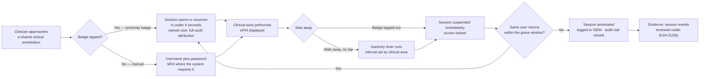

# 05.03 — Workstation Use &amp; Workstation Security

| Field | Value |
|---|---|
| Document ID | MBH-PTS-WKS-2026-503 |
| Version | 1.0 |
| Date | 2026-07-15 |
| Classification | Confidential — Electronic Protected Health Information (ePHI) // Illustrative Portfolio Sample |
| Owner | Marcus Reed, Information Security Manager |
| Co-Owner | Dr. Samuel Ortega, Chief Medical Information Officer (clinical workflow authority) |
| Author | Advisory Team (Healthcare GRC / HIPAA) |
| Status | Approved |

## Purpose

This document implements two standards together because they are two halves of one problem:

- **45 CFR §164.310(b) — Workstation Use:** *"Implement policies and procedures that specify the proper functions to be performed, the manner in which those functions are to be performed, and the physical attributes of the surroundings of a specific workstation or class of workstation that can access electronic protected health information."*
- **45 CFR §164.310(c) — Workstation Security:** *"Implement physical safeguards for all workstations that access electronic protected health information, to restrict access to authorized users."*

Both are **standards without implementation specifications**, and both are therefore **required in their own right** — there is no addressable analysis to perform and no rationale that excuses partial implementation.

This is the safeguard where HIPAA collides most directly with clinical care. Phase 03 registered **R-51 — unattended logged-in workstations in clinical areas** at Moderate (9), and it was the most consistently observed physical finding across all 34 sites. It is also the finding with the most dangerous naive remedy: a security team that responds by setting a 2-minute lock timeout on a code-cart workstation has not secured ePHI, it has created a patient-safety hazard and guaranteed that clinicians will defeat the control.

> **Standards: §164.310(b) and §164.310(c) · no implementation specifications · both required · both implemented · governing policy POL-17.**

## 1. The Workstation Estate

"Workstation" under §164.310 is broader than a desktop PC. HHS guidance treats it as any electronic computing device performing a function on ePHI, together with its immediate environment.

| Class | Count | Where | ePHI exposure | Primary control emphasis |
|---|---|---|---|---|
| Workstations on wheels (WOWs) / computers on wheels | 1,240 | Inpatient units, ED, peri-operative | High — mobile, shared, in corridors | Tap-and-go, short inactivity lock, screen orientation |
| Fixed clinical workstations in patient-care areas | 2,310 | Nurse stations, exam rooms, treatment bays | High — semi-public sightlines | Privacy filter, siting, tap-and-go |
| Provider offices and administrative desktops | 2,140 | Zone 1 offices, business services | Moderate — enclosed space | Standard timeout, clean-desk |
| Coding, HIM and revenue-cycle workstations | 380 | Back-office and approved home sites | High volume, low footfall | Standard timeout, no local storage, VDI |
| Remote / home workstations | 690 | Approved telework | Moderate | VDI-only, no local ePHI, encrypted endpoint |
| Kiosks and patient-facing check-in terminals | 210 | Lobbies, registration | Limited-scope ePHI | Kiosk lockdown, per-transaction session reset |
| Clinical tablets and mobile devices | 830 | Rounding, home health, imaging review | High — portable | MDM, encryption, remote wipe, app containerisation |
| Diagnostic review stations (PACS, cardiology) | 265 | Reading rooms, theatres | High-resolution imaging ePHI | Reading-room siting, extended timeout, badge lock |

Devices in the **6,120-unit medical device fleet** that present a user interface with ePHI — ultrasound consoles, physiological monitors, dialysis machines — are treated as workstations for the purposes of §164.310(b)–(c) and are additionally governed by **POL-24** and **05.11**.

## 2. Workstation Use — §164.310(b)

The Workstation Use standard asks three questions of every class of workstation: **what functions**, **performed how**, and **in what surroundings**.

| Workstation class | Permitted functions | Manner | Surroundings standard |
|---|---|---|---|
| WOW / clinical mobile cart | Clinical documentation, medication administration, order entry, results review | Named user session; tap-and-go; no local file storage; no personal use | Screen turned from corridor and from the visitor side of the bed; cart not left facing an open doorway |
| Fixed clinical workstation | Clinical documentation, results, scheduling, registration | Named user session; approved applications only | Privacy filter mandatory where the screen is visible from a public sightline; monitor angled away from waiting areas |
| Provider office desktop | Full clinical and administrative function | Named user session; door-closed convention for dictation | Enclosed or semi-enclosed; visitor chair placed off the screen axis |
| Coding / HIM / revenue cycle | Chart abstraction, coding, billing | VDI session; no local storage; print to secure release only | Restricted back-office area or approved home workspace under the telework attestation |
| Remote / home | VDI-delivered clinical and administrative function | No local ePHI; no personal device without MDM enrolment; no shared household account | Private room; screen not visible to household members; headset for dictation |
| Kiosk | Patient self check-in, limited demographic and insurance capture | No general browsing; per-transaction reset; no clinical record access | Public — deliberately scoped to the minimum necessary data set |
| Diagnostic review station | Image interpretation and reporting | Named user session; badge lock on step-away | Controlled reading room; door and low ambient light; not sited in a corridor |

**Prohibited on every class:** personal email and cloud storage, unsanctioned messaging applications (**R-38**), unapproved removable media (**R-27**), disabling of endpoint agents, disabling of privacy filters, and photography of a screen displaying ePHI. POL-17 states these explicitly rather than leaving them to inference; sanctions attach through POL-03.

## 3. Workstation Security — §164.310(c)

| Physical safeguard | Standard | Coverage |
|---|---|---|
| Privacy filters | Mandatory on every screen with a public sightline; validated at the annual walkdown | 3,190 screens fitted; 100% of assessed sightline positions |
| Screen positioning | Documented siting rule per area; monitors re-angled or repositioned during the 2026 Q2 walkdown | 412 repositions across 34 sites |
| Physical restraint | Cable locks on fixed clinical and office workstations; WOW carts secured or docked at shift end | 4,450 fixed units |
| Locked enclosures | Kiosk chassis and reading-room CPU enclosures | 475 units |
| Automatic screen lock | Enforced by policy at the operating-system and VDI layer; cannot be disabled by the user | Managed estate 100% |
| Proximity-badge tap-and-go | Same badge as the physical access control system; single credential for door and desktop | 3,550 clinical endpoints |
| Clean-desk / clear-screen | Printed ePHI secured; secure-release printing; shred bins in every clinical area | All 34 sites |
| Endpoint encryption | Full-disk encryption on the managed endpoint estate — see 05.05 and POL-23 | Managed estate 100% |
| Camera and screen-capture restriction | Screen photography prohibited; DLP screenshot control on VDI | VDI estate |

## 4. Automatic Logoff Versus Emergency Care — the Real Tension

Automatic logoff is an **addressable specification of §164.312(a)(2)(iii)**, implemented technically in 05.05; its *physical* consequences are governed here. Phase 03 found intervals inconsistent and absent in some clinical contexts (C-T03, **R-07**).

The tension is genuine and MercyBridge states it plainly: **in a resuscitation, a locked screen costs seconds that belong to the patient.** The resolution is not a single enterprise timeout. It is a **risk-tiered interval standard**, approved jointly by the CISO and the CMIO, that varies with the observed exposure of the area rather than with the convenience of a global group policy.

| Clinical area / workstation class | Inactivity lock | Full session termination | Rationale |
|---|---|---|---|
| Emergency department — resuscitation and trauma bays | **20 minutes** | 12 hours or shift end | Continuous staff presence; interruption cost is measured in patient outcomes; compensated by staffed line-of-sight and badge-out discipline |
| Emergency department — general treatment and triage | 10 minutes | 12 hours | High footfall, mixed public presence |
| Operating theatres, cath lab, interventional | **20 minutes** | End of case | Sterile field — a clinician cannot re-authenticate mid-procedure; area is Zone 2 restricted |
| Inpatient nurse stations and WOWs | 8 minutes | 12 hours | The R-51 population; balanced against documentation workflow |
| ICU / NICU bedside | 15 minutes | 12 hours | Continuous nursing presence; alarm-management workflow |
| Outpatient clinic exam rooms | 5 minutes | 8 hours | Patient left alone in the room with the workstation — the highest unattended exposure |
| Provider offices | 10 minutes | 8 hours | Enclosed space, single occupant |
| Coding, HIM, revenue cycle, administrative | 10 minutes | 8 hours | Back-office, low footfall |
| Remote / VDI | **5 minutes** | 4 hours | No physical control over the surroundings |
| Kiosks and patient-facing terminals | 90 seconds | Per transaction | Public placement; minimal data set |
| Diagnostic reading stations | 15 minutes | End of session | Controlled room; interpretation requires sustained uninterrupted viewing |

**Three principles govern every deviation.**
1. **A longer interval must be paid for with a compensating physical control** — Zone 2 restriction, continuous staffing, privacy filter, or line-of-sight siting. The ED resuscitation bay gets 20 minutes because it is never empty, not because it is busy.
2. **Tap-out beats time-out.** Badge tap-out suspends the session immediately and is the primary control; the inactivity timer is the backstop for when someone forgets.
3. **No interval is set by IT alone.** Every value in the table above is co-signed by the CMIO. Where clinicians request a change, it goes through the same joint review, and the decision — either way — is documented.

**Emergency override.** Where a workstation is locked and immediate clinical access is required, the clinician authenticates with their own credential and uses the **break-the-glass emergency access procedure** defined in POL-08 and 05.05. Break-the-glass is a *named-user* mechanism with 100% retrospective review; it is never a shared login.

## 5. Eliminating the Shared Clinical Login

**R-02 (High, 16)** — shared and generic clinical logins — is the single control failure that defeats both this standard and the audit controls standard at once. Phase 04 reduced it to Moderate through authorisation, clearance and sanction linkage. The physical remedy delivered here is **tap-and-go**, because the honest reason shared logins persist in hospitals is that logging in fifty times a shift with a 14-character password is intolerable.

| Position | Baseline (2026 Q1) | At Phase 05 approval | Wave 1 target (2026-10-31) |
|---|---|---|---|
| Clinical endpoints with proximity-badge tap-and-go | 1,880 | **3,550** | 3,920 (all clinical endpoints) |
| Identified shared or generic clinical accounts | 96 | 21 | **0** |
| Median clinician time to open a session | 38 seconds | **4 seconds** | ≤4 seconds |
| Departments with a documented shared-login exception | 11 | 2 | 0 |

The two remaining exceptions are legacy device consoles under vendor change control; both are on the Wave 3 device-lifecycle plan and are compensated by dedicated VLAN isolation and physical restriction to Zone 2. They are documented, dated and board-visible — not tolerated silently.

## 6. Monitoring and Assurance

| Activity | Method | Frequency | Owner |
|---|---|---|---|
| Unattended-session observation rounds | Unannounced walkthroughs of clinical areas; findings logged by unit | Quarterly, all 34 sites | Compliance / Security Services |
| Screen-sightline audit | Privacy filter presence and monitor angle verified against the siting rule | Annual walkdown | Facilities / Marcus Reed |
| Timeout configuration compliance | Automated configuration report against the §4 standard | Monthly | Marcus Reed |
| Shared-account detection | Directory and EHR analytics for concurrent-session and impossible-travel patterns | Continuous, reviewed weekly | Security Operations |
| Tap-and-go availability and failure rate | Service metric; badge reader faults raised to Clinical Engineering | Monthly | Service Desk |
| Removable-media events on clinical endpoints | Endpoint agent telemetry to SIEM | Continuous | Security Operations |
| Workstation relocation and new-build review | Security sign-off on clinical space design changes | Per project | Marcus Reed |

**2026 Q2 observation round result:** 47 unattended logged-in sessions found across 34 sites, against 214 in the Q1 baseline — a 78% reduction, attributable to tap-and-go plus the awareness campaign under 04.06. Each finding is fed back to the unit manager by name of unit, not name of individual, unless a pattern warrants escalation under POL-03.

## 7. Evidence Register

| Evidence | Produced by | Retention |
|---|---|---|
| POL-17 with the approved timeout standard table | Karen Boyd | 6 years |
| CISO / CMIO joint approval record for each interval and deviation | Daniel Cho, Dr. Samuel Ortega | 6 years |
| Monthly timeout configuration compliance reports | Marcus Reed | 6 years |
| Quarterly unattended-session round reports by site and unit | Compliance | 6 years |
| Privacy filter and siting walkdown records, including 412 repositions | Facilities | 6 years |
| Tap-and-go deployment register (3,550 endpoints) | IT Operations | 6 years |
| Shared-account elimination tracker and the 2 documented exceptions | Marcus Reed | 6 years |
| Telework workstation attestations | HR / Marcus Reed | 6 years |
| Workstation asset register extract with class and area | 02.10 asset register | 6 years |

## 8. Risks Treated

| Risk | Rating at Phase 03 | How §164.310(b)–(c) treats it | Residual at Phase 05 |
|---|---|---|---|
| **R-51** — Unattended logged-in workstations in clinical areas expose ePHI | Moderate (9) | Tiered inactivity lock standard; tap-and-go on 3,550 endpoints; privacy filters; 412 monitor repositions; quarterly observation rounds | **Low (6)** |
| **R-07** — Inconsistent automatic logoff leaves ePHI sessions exposed | Low (6) | Enterprise interval standard by clinical area, enforced by policy at OS and VDI layer, monitored monthly | **Low (2)** |
| **R-27** — Removable-media malware on non-clinical endpoints | Low (6) | Workstation use prohibition, endpoint media control, telemetry to SIEM; full media controls in 05.04 | **Low (4)** |
| **R-02** — Shared and generic clinical logins destroy audit attribution | High (16) → Moderate (12) after Phase 04 | Tap-and-go removes the workflow driver; 96 shared accounts reduced to 21, target 0 at Wave 1 | **Low (6)** at Wave 1 close — see 05.05 and 05.12 |
| **R-35** — Misdirected disclosure (contributing) | Moderate (12) | Clear-screen, secure-release printing, shred bins; principally treated by 04.06 and outbound DLP | Moderate (9) |
| **R-38** — Unsanctioned messaging applications (contributing) | Low (6) | Explicit prohibition in POL-17 with sanction linkage; transmission controls in 05.09 | Low (4) |

## Cross-References

| Reference | Relevance |
|---|---|
| 02.10 — Asset Ownership &amp; Accountability | Workstation asset register and area assignment |
| 03.04 — Existing Controls Assessment | Baseline C-P05 (workstation use and security) and C-T03 (automatic logoff) |
| 03.07 — Risk Register | R-02, R-07, R-27, R-35, R-38, R-51 |
| 04.05 — Information Access Management | Role-based entitlement that the named session enforces |
| 04.06 — Security Awareness &amp; Training | Clinical-area campaign behind the 78% reduction in unattended sessions |
| 05.02 — Facility Access Controls | The zone model that determines each workstation's surroundings |
| 05.05 — Technical Access Control | Automatic logoff as §164.312(a)(2)(iii); unique user ID; break-the-glass |
| 05.06 — Audit Controls | Session and access events these controls make attributable |
| 05.11 — Medical Device &amp; IoMT Security | Device consoles treated as workstations |
| POL-08, POL-17, POL-19 | Emergency access; workstation use and security; technical access control |

---
[⬅ Previous](05.02-facility-access-controls.md) · [🏠 Phase README](05.00-README.md) · [Next ➡](05.04-device-and-media-controls.md)
