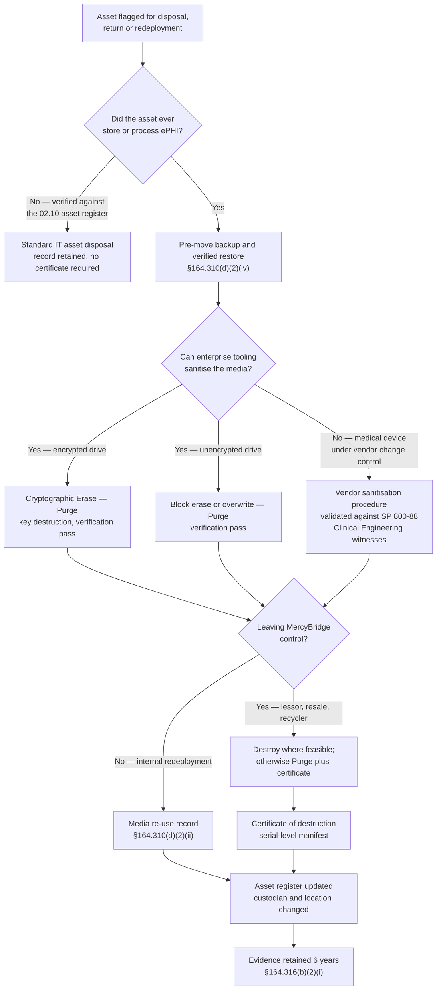

# 05.04 — Device &amp; Media Controls

| Field | Value |
|---|---|
| Document ID | MBH-PTS-MED-2026-504 |
| Version | 1.0 |
| Date | 2026-07-15 |
| Classification | Confidential — Electronic Protected Health Information (ePHI) // Illustrative Portfolio Sample |
| Owner | Anthony Ruiz, Chief Information Officer |
| Co-Owner | Marcus Reed, Information Security Manager |
| Author | Advisory Team (Healthcare GRC / HIPAA) |
| Status | Approved |

## Purpose

This document implements **45 CFR §164.310(d)(1) — Device and Media Controls**: *"Implement policies and procedures that govern the receipt and removal of hardware and electronic media that contain electronic protected health information into and out of a facility, and the movement of these items within the facility."*

This standard carries **the only two required implementation specifications in the entire physical safeguards family** — **disposal** and **media re-use**. That weighting is deliberate. Improper disposal is one of the most frequently penalised failures in OCR's enforcement history, because it is the failure that produces an unambiguous, documentable, often photographable disclosure: a hard drive in a skip, a copier returned to the lessor with a full image cache, an ultrasound sold at auction with a study archive intact.

For MercyBridge the standard is dominated by a single fact: a fleet of **6,120 networked medical devices**, of which **3,170 create, receive, maintain or transmit ePHI**, and **1,300 run unsupported or vendor-frozen operating systems**. Most of those devices hold ePHI on onboard storage that the enterprise cannot encrypt (**R-11, High 15**) and cannot always sanitise with enterprise tooling. Device and media controls are, for a hospital, the last line of defence between an asset disposal and a reportable breach.

> **Standard: §164.310(d)(1) · four implementation specifications · 2 required (disposal, media re-use) · 2 addressable (accountability, data backup and storage) · all four implemented · governing policies POL-18 and POL-24.**

## 1. The Standard and Its Specifications

| Spec | Citation | Requirement | R / A | MercyBridge position |
|---|---|---|---|---|
| Disposal | §164.310(d)(2)(i) | Address the final disposition of ePHI and of the hardware or electronic media on which it is stored | **Required** | Implemented — NIST SP 800-88 Rev. 1 sanitisation with certificates of destruction for 100% of ePHI-bearing assets |
| Media re-use | §164.310(d)(2)(ii) | Remove ePHI from electronic media before the media are made available for re-use | **Required** | Implemented — verified Clear or Purge before redeployment; no ePHI-bearing asset redeployed without a sanitisation record |
| Accountability | §164.310(d)(2)(iii) | Maintain a record of the movements of hardware and electronic media and any person responsible therefor | Addressable | Implemented — asset register (02.10) plus chain-of-custody records and equipment removal passes |
| Data backup and storage | §164.310(d)(2)(iv) | Create a retrievable, exact copy of ePHI, when needed, before movement of equipment | Addressable | Implemented — pre-move backup requirement with verified restore for Tier 1–2 systems |

**Both addressable specifications are implemented; no §164.306(d)(3)(ii) rationale is on file for this standard.** Under the 2025 NPRM both would become mandatory, with no change to MercyBridge's position.

## 2. The Population in Scope

| Asset class | Count | ePHI-bearing | Sanitisation route | Notes |
|---|---|---|---|---|
| Networked medical devices | **6,120** | **3,170** | Vendor-specified procedure validated against SP 800-88; physical destruction of removable drives where permitted | **1,300** on unsupported OS; FDA-cleared configuration limits enterprise tooling |
| Servers and storage arrays | 1,410 drives | 1,410 | Cryptographic Erase where self-encrypting; Purge otherwise; destruction for failed drives | Data-centre chain of custody, Zone 4 |
| Workstations, laptops and tablets | 8,065 | Assume all | Cryptographic Erase (full-disk encryption) with verification | Managed estate is 100% encrypted |
| Multifunction devices and copiers (leased) | 640 | Yes — image cache and internal drive | Contractual sanitisation plus MercyBridge-witnessed verification at return | Historic OCR failure mode; explicitly contracted |
| Imaging systems (CT, MR, US, IR) — leased or loaned | 118 units | Yes — study cache, worklists | Vendor sanitisation with certificate; MercyBridge verification before release | See §6 |
| Backup tape and removable archive media | 2,240 media | Yes | Degauss then physical destruction | Vaulted; barcoded chain of custody |
| Portable media (USB, SD, optical) | Controlled issue only | Where authorised | Encrypted-only issue; return-or-destroy | See §7 |
| Mobile phones (corporate and BYOD) | 2,910 enrolled | Containerised ePHI | MDM selective or full wipe with confirmation | BYOD holds no ePHI outside the container |

## 3. Disposal and Media Re-use — §164.310(d)(2)(i)–(ii)

MercyBridge applies **NIST SP 800-88 Rev. 1, *Guidelines for Media Sanitization***, and its three-level model. Selection is driven by the confidentiality of the data and by whether the media leaves organisational control.

| SP 800-88 level | Definition | MercyBridge use | Verification |
|---|---|---|---|
| **Clear** | Logical techniques that protect against non-invasive recovery | Media re-used **inside** the same security zone and remaining under MercyBridge control | Automated tool report; sampled read-back |
| **Purge** | Techniques that render recovery infeasible using state-of-the-art laboratory methods — Cryptographic Erase, block erase, degauss | Media re-used across zones, redeployed to a different department, or returned to a lessor | Tool certificate plus verification pass; recorded against the asset ID |
| **Destroy** | Disintegrate, shred, incinerate, pulverise, melt | End-of-life assets, failed drives, all backup tapes, any media where Purge cannot be verified | Certificate of destruction with serial-level manifest; witnessed for Tier 1 media |

**The safe-harbour argument.** Where a drive was encrypted to the standard in POL-23 and the key is destroyed, MercyBridge can assert that the ePHI is unusable, unreadable and indecipherable under the HHS breach-notification guidance — the same safe harbour that makes **R-40** (encryption at rest) the highest-leverage control in Phase 05. Where a device **could not** be encrypted (**R-11** — 3,170 ePHI-bearing devices, five platforms with no encryption capability at all), no such assertion is available, and disposal integrity is the *only* remaining protection. That asymmetry is why device disposal is escalated to a witnessed, certificated process rather than a service-desk ticket.

## 4. Accountability and Chain of Custody — §164.310(d)(2)(iii)

| Movement event | Record created | Responsible person captured | System of record |
|---|---|---|---|
| Receipt of new hardware into a facility | Asset created with owner, custodian, location, ePHI flag | Receiving technician | Asset register (02.10) |
| Movement within a facility | Location change with date and mover | Requesting department | Asset register / CMMS |
| Removal from a facility | **Equipment removal pass**, cross-referenced to the asset ID | Named signatory + approver | Security Services register |
| Transfer to a vendor or lessor | Bill of lading, serial manifest, BAA reference | Shipper + carrier + vendor receipt | Procurement + Security Services |
| Transfer to the sanitisation vendor | Sealed, barcoded container; two-person load-out for Tier 1 media | MercyBridge custodian + vendor driver | Chain-of-custody form |
| Sanitisation performed | Method, tool, operator, date, verification result | Operator | Sanitisation register |
| Destruction performed | Certificate of destruction with serial-level manifest | Vendor officer | Certificate archive |
| Loss or theft | Incident raised under 04.07 within 1 hour of discovery | Reporter | Incident register |

**The sanitisation vendor is a Business Associate.** A BAA is executed under POL-15 and the relationship is governed in Phase 06; MercyBridge additionally performs an **annual on-site witness audit** of the vendor's facility and reconciles a sample of certificates to serials in the asset register. Documentary assurance alone is not accepted for a vendor whose failure mode is a breach MercyBridge would be liable for.

**Reconciliation discipline.** Every quarter, assets marked disposed in the register are reconciled against certificates received. The 2026 Q2 reconciliation closed **31 assets** where a certificate had not been obtained under the legacy process (the substance of **R-44**); 27 were traced and certificated retrospectively, and 4 could not be — those 4 are recorded as an open finding with a completed **4-factor risk-of-compromise assessment** under 04.07 concluding low probability of compromise (encrypted at rest, no evidence of removal from the controlled recycling stream). Recording the four is the point; a reconciliation that always balances is not a reconciliation.

## 5. Data Backup and Storage Before Movement — §164.310(d)(2)(iv)

This specification is narrower than the contingency-plan backup standard at §164.308(a)(7)(ii)(A): it requires a **retrievable, exact copy before equipment is moved**, so that a clinician does not lose the only copy of a study or a monitoring record because a device was relocated or serviced.

| Asset tier | Pre-move requirement | Verification | Owner |
|---|---|---|---|
| Tier 1 clinical systems | Full backup plus **verified restore to a test target** before any physical move | Restore log signed off | IT Operations |
| Tier 2 systems | Full backup; restore verification within 30 days | Backup job report | IT Operations |
| Imaging modalities | Studies confirmed archived to PACS before the modality is moved, serviced or returned | PACS study-count reconciliation | Clinical Engineering / PACS admin |
| Physiological monitors and telemetry | Waveform and event data confirmed exported to the central station | Export confirmation | Clinical Engineering |
| Point-of-care and analyser devices | Results confirmed transmitted to the LIS | LIS receipt reconciliation | Laboratory |
| Workstations and laptops | No local ePHI storage permitted; profile backup only | Endpoint compliance report | Service Desk |

**Reconciliation before release is mandatory.** No imaging modality is released to a vendor or lessor until the PACS study count for that modality reconciles. This single control has prevented the classic disposal breach — a device leaving with the only copy of a study set still resident — and it doubles as an integrity control (see 05.07).

## 6. Leased and Returned Imaging Equipment

Leased imaging is a recurring HIPAA failure because the asset leaves under a **finance** process rather than an **IT** process, and finance processes do not ask about ePHI.

| Control | Implementation |
|---|---|
| Contract clause at procurement | Every lease and loan for ePHI-capable equipment carries a sanitisation-at-return clause, a certificate requirement and a BAA where the lessor may access ePHI |
| Pre-return notification | Procurement must notify Clinical Engineering and Security **20 business days** before any return; the return is blocked without security sign-off |
| Study reconciliation | PACS archive count reconciled to the modality before sanitisation |
| Sanitisation | Vendor procedure validated against SP 800-88; Clinical Engineering witnesses; removable drives destroyed where the vendor permits |
| Verification | Post-sanitisation inspection of study cache, worklist, patient database and service logs |
| Certificate | Serial-level certificate filed against the asset ID before the carrier collects |
| Copier and MFD returns | Identical treatment — internal drive purged or removed and destroyed; 640 leased units in scope |
| Loaner and demonstration equipment | Sanitised on **both** receipt and return; no patient data left on a demo unit |

## 7. Portable Media Controls

| Control | Standard |
|---|---|
| Default posture | **Removable media write is blocked by default** on the managed endpoint estate |
| Authorised issue | Encrypted, centrally managed USB devices only; issued against a named requester with a business justification and an expiry date |
| Encryption | AES-256 hardware encryption; unencrypted media cannot mount for write |
| Register | Serial, holder, issue date, return date; quarterly reconciliation |
| Prohibited | Personal USB devices, personal cloud sync clients, optical burning of ePHI, unmanaged external drives |
| Exceptions | 3 research and 2 device-service use cases, each documented, time-bounded and reviewed annually |
| Backup tape | Barcoded, vaulted, transported by a BA courier under chain of custody; degaussed then destroyed at end of life |
| Field-service media | Vendor media scanned at a hardened kiosk before connection; serial and scan result recorded in the CMMS (**R-16**) |
| Monitoring | All media insertion, mount and write events logged to the SIEM and reviewed weekly |

## 8. Evidence Register

| Evidence | Produced by | Retention |
|---|---|---|
| POL-18 and POL-24 with the SP 800-88 method matrix | Karen Boyd | 6 years |
| Sanitisation register — method, operator, verification result per asset ID | IT Operations / Clinical Engineering | 6 years |
| Certificates of destruction with serial-level manifests | Sanitisation vendor | 6 years |
| Quarterly disposal-to-certificate reconciliation, including exceptions | Marcus Reed | 6 years |
| Chain-of-custody forms and equipment removal passes | Security Services | 6 years |
| Pre-move backup and restore verification records | IT Operations | 6 years |
| PACS study reconciliation records for modality moves and returns | PACS administrator | 6 years |
| Lease return security sign-offs | Procurement / Marcus Reed | 6 years |
| Portable media issue register and quarterly reconciliation | Service Desk | 6 years |
| Annual on-site witness audit of the sanitisation vendor | Priya Anand | 6 years |
| MDM wipe confirmations for lost or retired mobile devices | IT Operations | 6 years |

## 9. Risks Treated

| Risk | Rating at Phase 03 | How §164.310(d)(1) treats it | Residual at Phase 05 |
|---|---|---|---|
| **R-44** — Media and device sanitisation not consistently certificated to NIST SP 800-88 | Moderate (8) | Mandatory certificates, serial-level manifests, quarterly reconciliation, annual vendor witness audit; 31 legacy gaps closed or documented | **Low (4)** |
| **R-11** — ePHI at rest on 3,170 devices cannot be encrypted; loss or disposal forfeits safe harbour (ESC-1) | **High (15)** | Witnessed, certificated disposal becomes the primary protection where encryption is impossible; pre-move backup; chain of custody; VLAN isolation in the interim | **Moderate (10)** — closes with Wave 3 device lifecycle |
| **R-27** — Removable-media malware on non-clinical endpoints | Low (6) | Default write-block, encrypted-only issue, media register, SIEM telemetry | **Low (2)** |
| **R-45** — Over-retention beyond the approved schedule enlarges the exposure surface | Low (6) | Disposal triggered by the 02.09 retention schedule; media destroyed rather than warehoused | **Low (4)** |
| **R-15** — 190 portable devices intermittently unprofiled by NAC | Low (6) | Movement accountability and custodian assignment improve profiling accuracy; NAC remediation in 05.11 | **Low (4)** |
| **R-33** — BA data return and certified deletion at contract exit is unevidenced | Low (4) | Certificate discipline extended contractually to BAs; exit evidence standard set here, executed in **Phase 06** | Low (4) — Phase 06 |
| **R-16** — Vendor field-service media introduce malware | Low (4) | Media scanning kiosk and CMMS record; escort under 05.02 | **Low (2)** |

## Cross-References

| Reference | Relevance |
|---|---|
| 02.04 — Medical Devices &amp; IoMT | The 6,120-device fleet; 3,170 ePHI-bearing; 1,300 unsupported OS |
| 02.09 — Data Retention &amp; Disposal | The retention schedule that triggers disposal |
| 02.10 — Asset Ownership &amp; Accountability | The asset register underpinning §164.310(d)(2)(iii) |
| 03.04 — Existing Controls Assessment | Baseline C-P06 (disposal and re-use) and C-P07 (accountability, backup) |
| 03.07 — Risk Register | R-11, R-15, R-16, R-27, R-33, R-44, R-45 |
| 04.07 — Security Incident Procedures | Lost or stolen media handling and the 4-factor assessment |
| 04.08 — Contingency Plan | The broader backup standard this specification narrows |
| 05.02 — Facility Access Controls | Equipment removal passes and Zone 4 load-out |
| 05.05 — Technical Access Control | Encryption at rest and the Cryptographic Erase dependency |
| 05.11 — Medical Device &amp; IoMT Security | Device lifecycle, Wave 3 replacement programme |
| Phase 06 — Business Associate &amp; Third-Party Risk | Sanitisation vendor and BA data-return obligations |
| POL-18, POL-23, POL-24 | Device and media controls; encryption and key management; medical device security |

---
[⬅ Previous](05.03-workstation-use-and-security.md) · [🏠 Phase README](05.00-README.md) · [Next ➡](05.05-technical-access-control.md)
