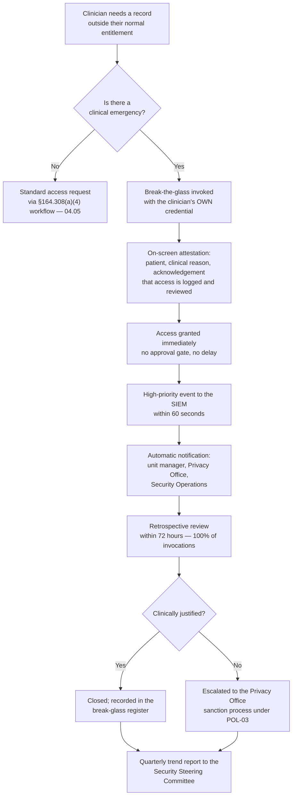

# 05.05 — Technical Access Control

| Field | Value |
|---|---|
| Document ID | MBH-PTS-ACC-2026-505 |
| Version | 1.0 |
| Date | 2026-07-15 |
| Classification | Confidential — Electronic Protected Health Information (ePHI) // Illustrative Portfolio Sample |
| Owner | Marcus Reed, Information Security Manager |
| Co-Owner | Daniel Cho, Chief Information Security Officer &amp; HIPAA Security Official |
| Author | Advisory Team (Healthcare GRC / HIPAA) |
| Status | Approved |

## Purpose

This document implements **45 CFR §164.312(a)(1) — Access Control**: *"Implement technical policies and procedures for electronic information systems that maintain electronic protected health information to allow access only to those persons or software programs that have been granted access rights as specified in §164.308(a)(4)."*

The citation is explicit about the relationship between the families. §164.308(a)(4) — delivered in **04.05** — decides *who should have access to what*. §164.312(a)(1) is the **technical enforcement of that decision**. A role-based access model that exists only in a policy document is not an access control; it is an intention.

This standard carries **two required specifications** — unique user identification and an emergency access procedure — and **two addressable** — automatic logoff and encryption and decryption. It is where three of MercyBridge's remaining High risks are engaged: **R-02** (shared clinical logins), **R-40** (encryption at rest) and **R-24** (pre-encryption exfiltration).

> **Standard: §164.312(a)(1) · four implementation specifications · 2 required · 2 addressable · all four implemented · governing policies POL-19, POL-08 and POL-23.**

## 1. The Standard and Its Specifications

| Spec | Citation | Requirement | R / A | MercyBridge position |
|---|---|---|---|---|
| Unique user identification | §164.312(a)(2)(i) | Assign a unique name and/or number for identifying and tracking user identity | **Required** | Implemented — enterprise directory identity for all ~6,500 workforce members; 96 shared clinical accounts reduced to 21, target 0 at Wave 1 |
| Emergency access procedure | §164.312(a)(2)(ii) | Establish (and implement as needed) procedures for obtaining necessary ePHI during an emergency | **Required** | Implemented — **break-the-glass** in the EHR and 9 other Tier 1 systems, with 100% retrospective review |
| Automatic logoff | §164.312(a)(2)(iii) | Electronic procedures that terminate an electronic session after a predetermined time of inactivity | Addressable | Implemented — tiered interval standard by clinical area, enforced at OS, VDI and application layer |
| Encryption and decryption | §164.312(a)(2)(iv) | A mechanism to encrypt and decrypt ePHI | Addressable | Implemented — **51 of 68 systems at baseline → 68 of 68 at Wave 2 (2027-01-31)** |

**Both addressable specifications are implemented.** No §164.306(d)(3)(ii) rationale is on file for §164.312(a)(1) other than the documented device-platform exceptions recorded in 05.11. Under the **2025 NPRM**, encryption and automatic logoff both become **mandatory** — MercyBridge is already building to that standard.

## 2. Unique User Identification — §164.312(a)(2)(i)

This is a **required** specification with no discretion, and Phase 03 rated MercyBridge only Partially Effective against it (C-T01) because of two populations: **shared and generic clinical logins** (**R-02**, High 16) and **~1,850 medical devices with shared or default credentials** (**R-13**, Moderate 8).

| Identity population | Baseline (2026 Q1) | At Phase 05 approval | Wave target |
|---|---|---|---|
| Workforce members with a unique directory identity | ~6,500 (100%) | ~6,500 (100%) | Maintained |
| Shared or generic **clinical** accounts | 96 | **21** | **0** — Wave 1, 2026-10-31 |
| Shared or generic **service and application** accounts | 340 | 118 (all vaulted and attributed to a named owner) | 0 unvaulted — Wave 1 |
| Medical devices with shared or default credentials | ~1,850 | 1,190 | ≤200 — Wave 3, 2027-06-30 |
| Standing elevated EHR accounts | **214** | **63** | 63 maintained, recertified quarterly |
| ePHI systems federated to enterprise SSO | 51 of 68 | 61 of 68 | 68 of 68 — Wave 1 |
| ePHI systems accepting local credentials outside SSO | 7 | 2 | 0 — Wave 1 |

**Why shared logins are fatal, not merely untidy.** Where a session is shared, the audit control at §164.312(b) records a session but cannot attribute it to a person. Prevention and detection therefore fail *together*: the entity cannot enforce minimum necessary, cannot investigate a snooping allegation, cannot sanction under POL-03, and cannot demonstrate to OCR who saw a record. The technical remedy delivered here is the elimination programme above; the workflow remedy that makes it survivable is **proximity-badge tap-and-go on 3,550 clinical endpoints** (05.03), because shared logins in hospitals are a symptom of authentication friction, not of indifference.

**Privileged identity.** The reduction from **214 to 63 standing elevated EHR accounts** was achieved in Phase 04 through role redesign and recertification. Phase 05 enforces it technically: elevated entitlements are vaulted, checked out just-in-time against a ticket, session-recorded for Tier 1 systems, and automatically revoked on the joiner–mover–leaver events defined in 04.04. This closes the tooling gap recorded as **C-S07 (Not Implemented)** in Phase 03.

| Account type | Naming convention | Authentication | Review |
|---|---|---|---|
| Standard workforce | `firstname.lastname` | SSO + MFA | Annual recertification |
| Elevated / administrative | `adm-<userid>` — separate from the standard account | MFA at every check-out; vaulted credential | **Quarterly** recertification |
| Service and application | `svc-<system>-<function>` with a named human owner | Vaulted secret, automated rotation | Quarterly ownership attestation |
| Vendor / third-party | `ext-<vendor>-<userid>`, time-bounded | MFA + brokered session, recorded | Per engagement; expires automatically |
| Break-the-glass | The user's **own** identity with an elevated flag | Full authentication + attestation prompt | 100% retrospective review within 72 hours |
| Device / machine | Per-device certificate where the platform supports it | Certificate or unique credential | Annual; fleet-wide in Wave 3 |

## 3. Emergency Access Procedure — §164.312(a)(2)(ii)

This specification is **required**, and it is the one that healthcare organisations most often mistake for a nice-to-have. Its logic is the reverse of most security controls: the rule requires a covered entity to guarantee that **ePHI remains reachable in an emergency**, because a clinician locked out of a chart during a resuscitation is a patient-safety failure that the Security Rule refuses to cause.

MercyBridge's emergency access procedure is **break-the-glass**, governed by **POL-08** and designed in 04.05. It is deliberately *not* a shared emergency account, a generic "ED override" login, or a sealed envelope in a drawer — all of which would defeat §164.312(a)(2)(i) at the moment of greatest need.

| Design property | Rule | Why |
|---|---|---|
| Never blocks care | No approval step, no help-desk call, no waiting | The specification exists to guarantee availability, not to gate it |
| Always attributed | Uses the clinician's own identity with an elevated flag | Preserves §164.312(a)(2)(i) at the exact moment attribution matters most |
| Always declared | Mandatory attestation naming the patient and the clinical reason | Converts a silent override into a documented clinical decision |
| Always reviewed | **100%** of invocations reviewed within 72 hours | Phase 03 found review inconsistent (**R-05**); 100% is now the standard, not a sample |
| Scope-limited | Grants the minimum entitlement needed, time-bounded to the encounter | Minimum necessary under POL-07 |
| Measured | Invocation rate per 1,000 encounters tracked by unit | An unusual rate is itself a signal |

| Metric | Baseline (2026 Q1) | 2026 Q2 |
|---|---|---|
| Break-glass invocations | 1,412 per quarter | 1,208 per quarter |
| Systems with a defined break-glass procedure | EHR only | EHR + 9 Tier 1 systems |
| Invocations reviewed within 72 hours | ~40% (sampled) | **100%** |
| Invocations found not clinically justified | Not measured | 9 — all referred to the Privacy Office |
| Median review turnaround | Not measured | 31 hours |

**Downtime interaction.** Where the EHR itself is unavailable, emergency access is satisfied by the read-only downtime viewer and the paper downtime kits defined in **04.08** — the emergency access procedure and the emergency mode operation plan are designed as one control set, not two.

## 4. Automatic Logoff — §164.312(a)(2)(iii)

Automatic logoff is addressable; MercyBridge implements it, and would do so regardless of the NPRM. The **interval standard by clinical area** is set out in full in **05.03 §4** and is not repeated here; this section records the *technical* enforcement.

| Enforcement layer | Mechanism | Coverage | Bypassable by user? |
|---|---|---|---|
| Operating system | Managed screen-lock policy on the endpoint estate | 8,065 managed endpoints | No — policy-enforced |
| Virtual desktop | VDI idle-disconnect and session-termination timers | 4,100 VDI sessions | No |
| Application — EHR | Halcyon native inactivity timeout, configured per department context | All EHR access | No |
| Application — other ePHI systems | Native timeout configured to the area standard | 61 of 68; 7 remediating in Wave 1 | No |
| Network / remote | VPN and remote-access session timers | Remote estate | No |
| Proximity badge | Tap-out suspends the session immediately; tap-in resumes within the grace window | 3,550 clinical endpoints | User-initiated, always available |
| Kiosk | Per-transaction reset plus 90-second idle | 210 kiosks | No |

**Configuration drift is the real failure mode**, not the absence of a setting. An automated configuration report runs monthly against the approved interval table; exceptions are ticketed with a 10-business-day remediation SLA and reported to the Security Steering Committee if they age beyond that.

## 5. Encryption and Decryption at Rest — §164.312(a)(2)(iv)

**R-40 (High, 16)** is the risk that this specification exists to treat, and encryption at rest is the highest-leverage single control in the entire programme — not because it prevents the most incidents, but because it changes the **legal character** of the incidents it does not prevent. Under HHS guidance, ePHI encrypted to an approved standard with the key not compromised is *unusable, unreadable and indecipherable*, and its loss is **not a reportable breach**.

| Population | Baseline (2026 Q1) | At Phase 05 approval | Wave 2 target (2027-01-31) |
|---|---|---|---|
| ePHI systems fully encrypted at rest | **51 of 68** | 58 of 68 | **68 of 68** |
| ePHI systems partially encrypted | 12 | 8 | 0 |
| ePHI systems with no encryption at rest | 5 | 2 | 0 |
| Managed endpoints with full-disk encryption | 96% | **100%** | 100% |
| Backup repositories encrypted | Tier 1 only | All tiers | All tiers |
| Database-level encryption on Tier 1 clinical databases | Partial | All Tier 1 | All Tier 1–2 |
| ePHI-bearing medical devices capable of encryption at rest | ~1,900 of 3,170 | 2,240 of 3,170 | Wave 3 — platform-limited, documented |

| Layer | Standard | Notes |
|---|---|---|
| Endpoint full-disk | AES-256, TPM-bound, escrowed recovery key | Enables Cryptographic Erase at disposal (05.04) |
| Server and storage | Self-encrypting drives plus volume encryption | Key destruction is the disposal path |
| Database | Transparent data encryption on Tier 1 clinical databases | Halcyon EHR encryption confirmed contractually and in the SOC 2 Type II |
| Backup and archive | Encrypted at rest and in flight; immutable copies for Tier 1 | Interacts with the R-48 immutability remediation |
| Removable media | Hardware AES-256; unencrypted media cannot mount for write | 05.04 §7 |
| Cloud and hosted | Encryption at rest contractually required and evidenced in the BAA | Phase 06 verifies |
| Key management | Enterprise HSM-backed key hierarchy; separation of duties between key custodians and system administrators; annual key rotation; escrow tested | **POL-23** |

**The five platforms that cannot encrypt.** Five medical-device platforms within the 3,170 ePHI-bearing devices have **no encryption capability at all** under vendor OS constraint (V-03) — the substance of **R-11**. For these, MercyBridge documents a §164.306(d)(3)(ii)(B) alternative measure: dedicated isolated VLANs, default-deny egress, physical siting in Zone 2, and the witnessed disposal regime of 05.04. The exception is dated, signed by the Security Official, board-visible, and closes with the Wave 3 device-lifecycle replacement funded in the FY2027 capital plan. It is not presented as compliance; it is presented as a time-bounded gap with compensating controls, which is what §164.306(d)(3) actually asks for.

## 6. Access Control for Software Programs

§164.312(a)(1) covers *"persons **or software programs**"* — a clause routinely overlooked.

| Non-human identity | Control |
|---|---|
| Interface engine and HL7 feeds | Per-interface service identity; mutual TLS; entitlement limited to the message types required |
| API and FHIR consumers (patient portal, HIE, apps) | OAuth 2.0 client credentials, scoped tokens, per-consumer rate limiting and revocation |
| Reporting and analytics jobs | Read-only service accounts scoped to defined data sets; no ad-hoc production queries |
| Backup agents | Dedicated identities, vaulted secrets, network-restricted |
| Medical device integration | Per-device certificate where supported; VLAN restriction where not |
| Vendor remote support (742 devices) | Just-in-time brokered access, no standing VPN, session recorded — treats **R-06** |

## 7. Evidence Register

| Evidence | Produced by | Retention |
|---|---|---|
| POL-19, POL-08, POL-23 with signature pages | Karen Boyd | 6 years |
| Unique-identity reconciliation: shared-account elimination tracker | Marcus Reed | 6 years |
| Privileged account register; quarterly recertification attestations (63 elevated EHR accounts) | Marcus Reed | 6 years |
| Break-the-glass register with 100% review dispositions | Rebecca Stern / Marcus Reed | 6 years |
| Monthly automatic-logoff configuration compliance reports | Marcus Reed | 6 years |
| Encryption coverage report by system (68 systems) | Marcus Reed | 6 years |
| Key management procedures, custodian list, rotation and escrow test records | Daniel Cho | 6 years |
| Documented §164.306(d)(3)(ii)(B) alternative measure for the five unencryptable platforms | Daniel Cho | 6 years |
| Vendor brokered-session recordings and access logs | Security Operations | Per retention schedule |
| Penetration test results against access control | Ironwood Security Labs — Phase 08 | 6 years |

## 8. Risks Treated

| Risk | Rating at Phase 03 | How §164.312(a)(1) treats it | Residual at Phase 05 |
|---|---|---|---|
| **R-40** — ePHI at rest unencrypted or partially encrypted on 17 of 68 systems, forfeiting safe harbour | **High (16)** | Encryption to 68 of 68 by Wave 2; 100% endpoint FDE; HSM-backed key management under POL-23 | **Moderate (8)** at Wave 2 close |
| **R-24** — Double-extortion exfiltration of ePHI before encryption | **High (16)** | Encryption at rest, privileged access vaulting, scoped service identities; DLP and egress control in 05.09 | **Moderate (12)** at Wave 2 close |
| **R-02** — Shared and generic clinical logins destroy audit attribution | High (16) → Moderate (12) after Phase 04 | Shared clinical accounts 96 → 21 → 0; tap-and-go; SSO federation 51 → 68 | **Low (6)** at Wave 1 close |
| **R-03** — Standing excessive privilege (214 elevated EHR accounts) | Moderate (12) | 214 → 63; just-in-time vaulted check-out; session recording; quarterly recertification | **Low (6)** |
| **R-05** — Break-glass used without retrospective review | Moderate (9) | 100% review within 72 hours; attestation prompt; quarterly trend reporting | **Low (2)** |
| **R-07** — Inconsistent automatic logoff | Low (6) | Tiered interval standard enforced at four layers; monthly drift reporting | **Low (2)** |
| **R-04** — Access retained beyond 24 hours after departure | Moderate (12) → Low (6) after Phase 04 | Automated deprovisioning tied to JML across all 68 systems | **Low (2)** |
| **R-06** — Vendor remote-support entitlements across 742 devices under-reviewed | Moderate (8) | Just-in-time brokered access, no standing VPN, recorded sessions | **Low (6)** |
| **R-13** — Default and shared device credentials (~1,850 devices) | Moderate (8) | Credential remediation 1,850 → 1,190, target ≤200 at Wave 3; certificate-based identity where supported | **Moderate (8)** — Wave 3 |
| **R-32** — Offshore support access exceeds minimum necessary | Low (6) | Scoped, time-bounded external identities; data-set reduction enforced technically | Low (4) — Phase 06 |
| **R-11** — Unencryptable ePHI on 3,170 devices (ESC-1) | **High (15)** | Documented alternative measure; VLAN isolation; disposal regime in 05.04 | **Moderate (10)** — Wave 3 |

## Cross-References

| Reference | Relevance |
|---|---|
| 03.04 — Existing Controls Assessment | Baseline C-T01 to C-T04 and C-S07 improved here |
| 03.07 — Risk Register | R-02, R-03, R-04, R-05, R-06, R-07, R-11, R-13, R-24, R-32, R-40 |
| 03.08 — Risk Management Plan | Wave 1 identity assurance; Wave 2 encryption; Wave 3 device estate |
| 04.04 — Workforce Security | The joiner–mover–leaver events that drive provisioning and revocation |
| 04.05 — Information Access Management | The §164.308(a)(4) access rights this standard enforces technically |
| 04.08 — Contingency Plan | Downtime viewer and emergency mode operation alongside break-the-glass |
| 05.03 — Workstation Use &amp; Security | The interval standard and tap-and-go deployment |
| 05.06 — Audit Controls | What unique identity makes attributable |
| 05.08 — Person or Entity Authentication | MFA to 68 of 68 — the authentication half of access control |
| 05.10 — Encryption &amp; Key Management | Cryptographic standards and the key hierarchy |
| POL-07, POL-08, POL-19, POL-23 | Minimum necessary; emergency access; technical access control; encryption |

---
[⬅ Previous](05.04-device-and-media-controls.md) · [🏠 Phase README](05.00-README.md) · [Next ➡](05.06-audit-controls.md)
