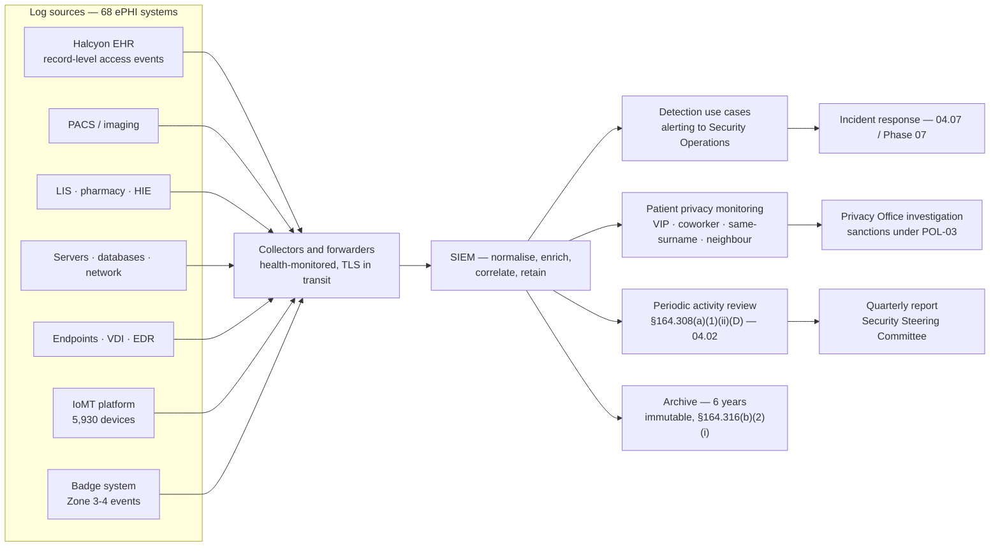

# 05.06 — Audit Controls

| Field | Value |
|---|---|
| Document ID | MBH-PTS-AUD-2026-506 |
| Version | 1.0 |
| Date | 2026-07-15 |
| Classification | Confidential — Electronic Protected Health Information (ePHI) // Illustrative Portfolio Sample |
| Owner | Marcus Reed, Information Security Manager |
| Co-Owner | Rebecca Stern, Chief Privacy Officer (patient privacy monitoring) |
| Author | Advisory Team (Healthcare GRC / HIPAA) |
| Status | Approved |

## Purpose

This document implements **45 CFR §164.312(b) — Audit Controls**: *"Implement hardware, software, and/or procedural mechanisms that record and examine activity in information systems that contain or use electronic protected health information."*

It is the **shortest standard in the Security Rule and one of the most consequential**. There are no implementation specifications, no addressable analysis and no discretion about whether to comply — only discretion about *how*. Two verbs carry the whole obligation: **record** and **examine**. A covered entity with perfect logging and no review has implemented half a standard, and it is the half that never detects anything.

Audit controls also do something no preventive control can. Preventive controls stop the unauthorised. Audit controls detect the **authorised user doing something improper** — the nurse who looks up a neighbour, the registrar who checks a celebrity admission, the coder who browses a coworker's chart. In a hospital that population is the largest realistic threat by volume, and it is invisible to every firewall MercyBridge owns.

> **Standard: §164.312(b) · a required standard with no separate implementation specifications · governing policies POL-20 and POL-04.**

## 1. The Standard, and Its Relationship to §164.308(a)(1)(ii)(D)

| Provision | Family | What it requires | Delivered by |
|---|---|---|---|
| **§164.312(b) Audit Controls** | Technical | The **mechanism** that records and examines activity | This document — logging, SIEM, analytics |
| **§164.308(a)(1)(ii)(D) Information System Activity Review** | Administrative | The **procedure and cadence** for regularly reviewing records of activity | 04.02 |
| §164.308(a)(5)(ii)(C) Log-in monitoring | Administrative | Monitoring of log-in attempts and reporting discrepancies | 04.06 |
| §164.316(b)(2)(i) Documentation retention | Documentation | Six-year retention of the required documentation | 04.11 |

The two principal provisions are frequently conflated. They are complementary: **§164.312(b) builds the instrument; §164.308(a)(1)(ii)(D) obliges you to look at it.** Phase 03 rated both Partially Effective — native logging on 64 of 68 systems, SIEM ingestion on only 49, and activity review unevidenced for 19 systems (**R-55**).

## 2. Coverage — the 68 ePHI Systems

| Position | Baseline (2026 Q1) | After Phase 04 | Wave 1–2 target |
|---|---|---|---|
| ePHI systems generating native audit logs | 64 of 68 | 66 of 68 | **68 of 68** |
| ePHI systems forwarding to the SIEM | **49 of 68** | **62 of 68** | **68 of 68** — 2027-01-31 |
| Systems with defined, tested detection use cases | 18 | 41 | 68 |
| Systems with evidenced periodic activity review | 49 | 68 | 68 |
| Log-source health monitoring (silent-source alerting) | None | All 62 forwarded sources | All 68 |
| Medical devices contributing telemetry via the IoMT platform | 5,930 of 6,120 | 5,930 | 6,000+ (Wave 3) |

The **six systems still outside SIEM ingestion** are two legacy departmental applications scheduled for replacement, three vendor-hosted services awaiting a log-export capability contracted under Phase 06, and one device management console pending a Wave 3 upgrade. Each has a named owner, a dated target and an interim compensating control (local log retention with monthly manual extract). They are listed in `trackers/log-coverage.xlsx` rather than rounded away.

**Log-source health is itself a control.** The most common way audit controls fail is not misconfiguration but **silence** — a forwarder stops and nobody notices for four months. Every source is monitored for expected event volume; a source silent beyond its threshold raises a ticket within one hour.

## 3. What Is Logged

| Event class | Recorded attributes | Applies to |
|---|---|---|
| Authentication | User ID, timestamp, source address, workstation, result, MFA method, failure reason | All 68 systems |
| Authorisation change | Actor, subject, entitlement added or removed, approval reference | All 68 systems |
| **ePHI record access** | User ID, patient MRN, encounter, record section, action (view / print / export), timestamp, workstation, department | EHR, PACS, LIS, pharmacy, HIE, portal, billing |
| ePHI modification | Prior value, new value, actor, timestamp, reason code | EHR, LIS, pharmacy |
| **Break-the-glass invocation** | Everything above plus the attestation text and clinical reason | EHR + 9 Tier 1 systems |
| Bulk export or report | Record count, filter criteria, destination, actor | EHR, billing, analytics, research |
| Print and fax of ePHI | Document type, patient, destination device or number, actor | EHR, HIM |
| Privileged action | Command or transaction, target, session recording reference | Servers, databases, network, EHR admin |
| Configuration change | Object, before/after, change record reference | All 68 systems |
| Security control state | Agent health, encryption status, log-source health | Endpoint and server estate |
| Physical access to Zone 3–4 | Badge ID, door, result, escort reference | Correlated from the PACS badge system (05.02) |
| Media insertion and write | Device serial, host, user, file counts | Managed endpoints |

**Minimum record content.** Every entry carries **who, what, when, where and outcome**, with time synchronised to a common NTP source across the estate. Clock skew is monitored; a source drifting beyond 200 milliseconds is remediated, because correlation across systems is only as good as the timestamps.

**Logs contain ePHI.** Audit records naming patients are themselves protected. The SIEM is treated as a Tier 1 ePHI system: encrypted at rest, access restricted to a named list of 14 analysts, administrator actions in the SIEM independently logged to a write-once store, and access to the SIEM subject to the same review as access to the EHR. This is the technical treatment of **R-46**.

## 4. Architecture

## 5. EHR Access Auditing — the Healthcare-Specific Control

Generic security monitoring looks for intruders. **Patient privacy monitoring looks for insiders with valid credentials and no treatment relationship**, and it is the control class that distinguishes a healthcare audit programme from a corporate one. Phase 03 registered **R-36 — workforce member browses records without a treatment, payment or operations purpose** at Moderate (12), and rated the supporting capability **C-S09 as Not Implemented** beyond simple VIP flagging.

Phase 05 implements a behavioural monitoring layer over the EHR access log with the following detection patterns.

| Pattern | Detection logic | Typical volume per quarter | Disposition route |
|---|---|---|---|
| **VIP / celebrity record access** | Access to a flagged record by any user without a documented care-team relationship | 60–90 alerts | Privacy Office, same business day |
| **Coworker record access** | Accessing the record of another workforce member; matched against the HR roster | 110–160 alerts | Privacy Office review; the highest-yield rule in practice |
| **Same-surname access** | User surname matches patient surname without a care relationship — family look-ups | 70–100 alerts | Privacy Office review |
| **Same-address / neighbour access** | Patient address matches the user's registered address or immediate locality | 20–40 alerts | Privacy Office review |
| **Self-access** | User accesses their own record outside the patient portal | 15–30 alerts | Redirected to the portal; educational letter |
| **High-profile event access** | Records associated with a publicised incident (trauma, public figure, media event) | Event-driven | Time-bounded enhanced monitoring |
| **Volume anomaly** | Records accessed materially above the user's role and unit peer baseline | 25–45 alerts | Manager review with security analysis |
| **Departure risk** | Access or export volume spike within 30 days of a resignation notice | 5–15 alerts | Security Operations + HR |
| **Bulk export** | Report or export exceeding a role-appropriate record threshold | 10–20 alerts | Justification required from the actor |
| **Off-hours / off-unit** | Access outside the user's scheduled shift or assigned unit without an on-call record | 40–70 alerts | Manager attestation |
| **Break-the-glass** | Every invocation, without exception | ~1,200 per quarter | 100% review within 72 hours (05.05) |

**Care-relationship suppression is what makes this usable.** Each rule is filtered against the scheduling, admission, order and care-team feeds so that a legitimate treatment relationship suppresses the alert before it reaches a human. Without that filter the coworker rule alone would generate thousands of alerts a quarter in a network employing ~6,500 people who also receive care in its own facilities — and an unusable alert queue is functionally the same as no monitoring at all.

**Outcome, 2026 Q2.** 412 privacy alerts after suppression; 389 closed as justified; **23 investigated**; **6 substantiated** and referred for sanction under POL-03; 1 escalated to a §164.402 four-factor risk-of-compromise assessment under 04.07, concluding **no reportable breach**. Every disposition is recorded with a rationale, because the review record — not the alert — is the evidence OCR asks for.

## 6. Proactive Review, Not Retrospective Reconstruction

| Review activity | Scope | Frequency | Owner |
|---|---|---|---|
| Real-time detection use cases | All SIEM-ingested sources | Continuous, 24×7 | Security Operations |
| Break-the-glass review | 100% of invocations | Within 72 hours | Unit manager + Privacy Office |
| Patient privacy alert triage | All rules in §5 | Daily | Privacy Office |
| Privileged session review | Sample of recorded Tier 1 administrative sessions | Weekly | Marcus Reed |
| Failed-authentication and lockout trend review | All 68 systems | Weekly | Security Operations |
| **Information system activity review** — §164.308(a)(1)(ii)(D) | All 68 systems against the 04.02 runbook | Monthly (Tier 1), quarterly (Tier 2–3) | Marcus Reed |
| Log-source health and coverage reconciliation | All sources against the 68-system inventory | Monthly | Security Operations |
| Rule tuning and false-positive review | Detection and privacy rule set | Quarterly | Marcus Reed / Rebecca Stern |
| Audit programme report to governance | Metrics, alerts, dispositions, sanctions | Quarterly | Daniel Cho |
| Independent testing of audit controls | Log completeness, tamper resistance, review evidence | Annual | Priya Anand; Beacon Assurance (Phase 08) |

**Patient-requested accounting.** The same access log supports the Privacy Rule right to an accounting of disclosures and, more commonly in practice, a patient's question *"who has looked at my record?"* The Privacy Office can produce a per-patient access report within **5 business days**. That capability is a direct by-product of unique user identification (05.05); where a shared login was used, the report cannot be produced, which is the clearest possible demonstration of why **R-02** had to be closed.

## 7. Retention and Protection of Audit Records

| Record | Online / searchable | Total retention | Basis |
|---|---|---|---|
| Security event data in the SIEM | 13 months | **6 years** in immutable archive | §164.316(b)(2)(i); forensic readiness |
| EHR record-access audit trail | Per Halcyon retention — 6 years minimum | 6 years, contractually assured in the BAA | §164.312(b); Privacy Rule accounting |
| Break-the-glass register and review dispositions | 6 years | 6 years | §164.312(a)(2)(ii); POL-08 |
| Privacy alert dispositions and investigations | 6 years | 6 years | POL-20; sanction evidence under POL-03 |
| Privileged session recordings | 12 months | 12 months, extended on legal hold | Operational |
| Physical badge events | 12 months | 6 years archived | §164.310(a)(1) |
| Activity review reports (§164.308(a)(1)(ii)(D)) | 6 years | 6 years | §164.316(b)(2)(i) |

**Tamper resistance.** Archived logs are written to immutable, WORM-backed storage with object lock. Administrators of a source system cannot alter or delete that system's archived logs; SIEM administrator actions are themselves logged to a separate store reviewed by a different individual. Legal hold suspends all deletion.

## 8. Evidence Register

| Evidence | Produced by | Retention |
|---|---|---|
| POL-20 (Audit Controls &amp; Log Management) and POL-04 | Karen Boyd | 6 years |
| Log coverage reconciliation — 68 systems, with the six documented exceptions | Marcus Reed | 6 years |
| Detection use-case catalogue with test results | Security Operations | 6 years |
| Patient privacy rule set with suppression logic and tuning history | Rebecca Stern | 6 years |
| Quarterly privacy alert disposition report (412 / 389 / 23 / 6) | Rebecca Stern | 6 years |
| Break-the-glass review register | Privacy Office | 6 years |
| Monthly and quarterly activity review reports | Marcus Reed | 6 years |
| Log-source health reports and silent-source tickets | Security Operations | 6 years |
| Immutability and legal-hold configuration evidence | IT Operations | 6 years |
| Per-patient access report samples (accounting capability) | Privacy Office | 6 years |
| Internal audit and HITRUST testing of §164.312(b) | Priya Anand / Beacon Assurance | 6 years |

## 9. Risks Treated

| Risk | Rating at Phase 03 | How §164.312(b) treats it | Residual at Phase 05 |
|---|---|---|---|
| **R-36** — Workforce browses records without a TPO purpose | Moderate (12) | Behavioural privacy monitoring with 11 rule families and care-relationship suppression; daily triage; sanction linkage | **Low (6)** |
| **R-55** — Activity review not evidenced for 19 systems | Low (6) | SIEM ingestion 49 → 62 → 68; evidenced review for all 68 under the 04.02 runbook | **Low (2)** |
| **R-05** — Break-glass used without retrospective review | Moderate (9) → Low (6) after Phase 04 | 100% review within 72 hours, with logged dispositions | **Low (2)** |
| **R-46** — Incidental ePHI in logs, SIEM and non-production | Low (4) | SIEM treated as a Tier 1 ePHI system: encrypted, named-list access, independently logged administration | **Low (2)** |
| **R-02** — Shared clinical logins destroy audit attribution | High (16) | Audit controls are worthless without attribution; the elimination programme in 05.05 is a precondition for this standard | **Low (6)** at Wave 1 close |
| **R-03** — Standing excessive privilege | Moderate (12) | Privileged session recording and weekly sampled review | **Low (6)** |
| **R-13** — Default and shared device credentials | Moderate (8) | IoMT platform telemetry from 5,930 devices provides behavioural detection where per-user attribution is impossible | Moderate (8) — Wave 3 |
| **R-24** — Pre-encryption exfiltration | **High (16)** | Bulk-export and volume-anomaly detection improve time-to-detect; determinative controls are encryption and DLP | Moderate (12) — Wave 2 |

## Cross-References

| Reference | Relevance |
|---|---|
| 03.04 — Existing Controls Assessment | Baseline C-T05 (audit controls), C-S01 (SIEM), C-S09 (privacy monitoring — Not Implemented) |
| 03.07 — Risk Register | R-02, R-03, R-05, R-13, R-24, R-36, R-46, R-55 |
| 04.02 — Security Management Process | The §164.308(a)(1)(ii)(D) activity review procedure and cadence this instrument feeds |
| 04.06 — Security Awareness &amp; Training | Log-in monitoring and the workforce expectation that access is reviewed |
| 04.07 — Security Incident Procedures | Where alerts become incidents and 4-factor assessments |
| 04.11 — Policies, Procedures &amp; Documentation | Six-year retention under §164.316(b)(2)(i) |
| 05.05 — Technical Access Control | Unique user identification — the precondition for attribution |
| 05.07 — Integrity Controls | Audit trails as evidence of improper alteration |
| Phase 07 — Incident Response &amp; Breach Notification | Forensic use of the six-year archive |
| Phase 08 — HITRUST &amp; Independent Assessment | Independent testing of log completeness and review evidence |
| POL-03, POL-04, POL-08, POL-20 | Sanctions; activity review; emergency access; audit controls and log management |

---
[⬅ Previous](05.05-technical-access-control.md) · [🏠 Phase README](05.00-README.md) · [Next ➡](05.07-integrity-controls.md)
