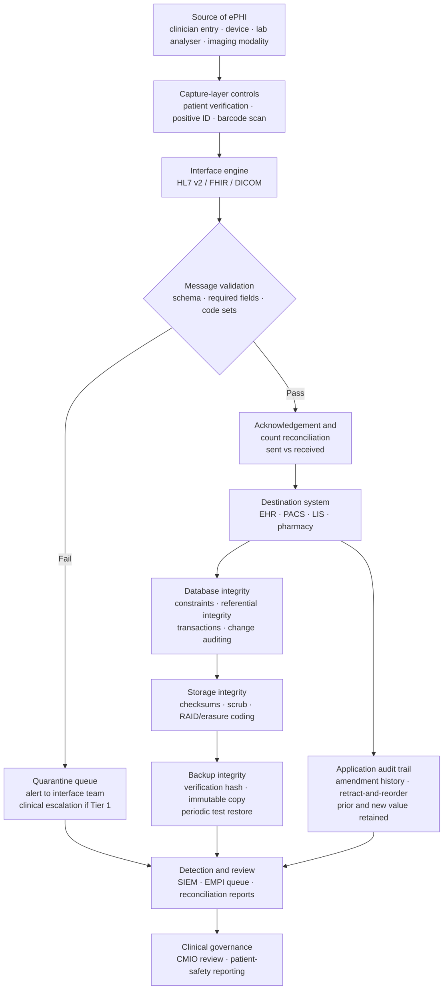

# 05.07 — Integrity Controls

| Field | Value |
|---|---|
| Document ID | MBH-PTS-INT-2026-507 |
| Version | 1.0 |
| Date | 2026-07-15 |
| Classification | Confidential — Electronic Protected Health Information (ePHI) // Illustrative Portfolio Sample |
| Owner | Marcus Reed, Information Security Manager |
| Co-Owner | Dr. Samuel Ortega, Chief Medical Information Officer (clinical data integrity authority) |
| Author | Advisory Team (Healthcare GRC / HIPAA) |
| Status | Approved |

## Purpose

This document implements **45 CFR §164.312(c)(1) — Integrity**: *"Implement policies and procedures to protect electronic protected health information from improper alteration or destruction,"* together with its single implementation specification, **§164.312(c)(2) — Mechanism to authenticate electronic protected health information**: *"Implement electronic mechanisms to corroborate that electronic protected health information has not been altered or destroyed in an unauthorized manner."*

Integrity is the forgotten leg of the CIA triad in most HIPAA programmes. Confidentiality attracts attention because its failures make the news; availability attracts attention because its failures stop the hospital. Integrity failures are quieter, and in a hospital they are **more dangerous than either**.

**A confidentiality breach harms a patient's privacy. An integrity failure harms the patient.** A potassium result delivered to the wrong chart, an allergy silently dropped by an interface upgrade, a medication order truncated in transit, a radiology report attached to the wrong accession number — each of these produces a clinical decision made on false data. That is why MercyBridge's Phase 03 methodology applies escalation rule **ESC-3** to clinical integrity risks (**R-43**), treating them as patient-safety events rather than as data-quality events. Integrity is the standard where the Security Rule and the patient-safety programme are the same programme.

> **Standard: §164.312(c)(1) · one implementation specification (§164.312(c)(2), addressable) · implemented · governing policy POL-21.**

## 1. The Standard and Its Specification

| Element | Citation | Requirement | R / A | MercyBridge position |
|---|---|---|---|---|
| Integrity (standard) | §164.312(c)(1) | Protect ePHI from improper alteration or destruction | Standard — mandatory | Implemented — layered controls across interface, database, storage, backup and application layers |
| Mechanism to authenticate ePHI | §164.312(c)(2) | Electronic mechanisms to corroborate that ePHI has not been altered or destroyed in an unauthorised manner | **Addressable** | Implemented — HL7 and DICOM message validation, checksums, database constraints, immutable audit trails, backup verification |

Phase 03 rated the supporting control **C-T06 Effective** for Tier 1 and Tier 2 systems — the strongest technical baseline MercyBridge carried into Phase 05. This document consolidates that baseline into a named, evidenced control set and extends it to Tier 3, rather than claiming a transformation that was not needed.

**Scope note.** §164.312(c)(1) governs ePHI **at rest and in processing**. The parallel obligation for ePHI **in motion** is the transmission-integrity specification at **§164.312(e)(2)(i)**, delivered in 05.09. The two are designed as one control set and are cross-referenced throughout.

## 2. The Threat Model — What Actually Corrupts Clinical Data

| Source | Mechanism | Realistic example at MercyBridge | Detected by |
|---|---|---|---|
| **Interface failure** | HL7 message dropped, duplicated, truncated or mis-routed between systems | LIS result posts to the wrong encounter after a mapping change | Interface engine validation, ACK reconciliation, count controls |
| **Wrong-patient entry** | Documentation or ordering in the wrong open chart | Two charts open on one WOW; note filed to the wrong patient | Patient-verification prompts; retract-and-reorder analytics |
| **Duplicate and overlaid records** | EMPI failure creating two records for one patient, or merging two patients into one | Overlay merges an allergy list from a different patient | EMPI reconciliation; overlay detection queue |
| **Software defect or upgrade regression** | A vendor release changes field mapping or truncates a value | Allergy free-text truncated at 40 characters after an upgrade | Pre-production validation; post-upgrade reconciliation |
| **Storage or media degradation** | Bit rot, silent corruption, failed drive | DICOM study unreadable in the deep archive | Checksums, scrub cycles, archive verification |
| **Backup and restore failure** | Backup completes but is not restorable | Tier 2 restore fails during a real recovery | Restore testing under 04.08; verification hashes |
| **Malicious alteration** | Insider or intruder modifies a record | Altered documentation after an adverse event | Immutable audit trail, database change auditing, SIEM correlation |
| **Ransomware** | Encryption destroys availability and integrity together | Tier 1 clinical databases encrypted (**R-23**) | Immutable backups, integrity verification of restored data |
| **Improper destruction** | Records deleted before the retention period expires | Departmental file share purged in error | Retention controls, deletion auditing, legal hold |

## 3. Layered Integrity Architecture

## 4. Interface Integrity — HL7, FHIR and DICOM

MercyBridge's interface engine is the single highest-volume integrity control point in the estate: clinical results, orders, ADT events, medication records and images all pass through it between the 68 ePHI systems.

| Control | Implementation | Applies to |
|---|---|---|
| Schema and structure validation | Every inbound and outbound message validated against the agreed message profile; malformed messages quarantined, never silently dropped | All HL7 v2 and FHIR interfaces |
| Required-field enforcement | Patient identifier, encounter, ordering provider, result status and units must be present and non-null | Results, orders, ADT |
| Code-set validation | LOINC, RxNorm, SNOMED CT and ICD values validated against the current terminology service | Results, problems, medications |
| Positive patient identification | MRN plus at least two demographic matchers before a result is filed | All result interfaces |
| Acknowledgement reconciliation | Every message expects an ACK; unacknowledged messages retry then alert | All interfaces |
| Sequence and duplicate detection | Control-ID sequencing detects gaps, replays and duplicates | All interfaces |
| **Daily count reconciliation** | Messages sent by the source vs filed by the destination, per interface, per day; variance investigated | 41 Tier 1–2 interfaces |
| DICOM integrity | Study Instance UID and accession-number validation; transfer-syntax checks; storage-commitment before the modality releases a study | PACS and 118 imaging modalities |
| Interface change control | Any mapping change requires a validation test set, CMIO-approved clinical sign-off and post-deployment reconciliation | All interfaces |
| Quarantine escalation | Tier 1 quarantine alerts to the on-call interface analyst within 15 minutes, 24×7 | Tier 1 interfaces |

**Why count reconciliation matters more than it sounds.** The interface failure that harms a patient is rarely the one that throws an error — it is the one that succeeds partially. A mapping change that files 998 of 1,000 results looks healthy on every dashboard. Daily count reconciliation is the only control that reliably catches it, and it is why MercyBridge runs it per interface rather than in aggregate.

## 5. Database, Storage and Application Integrity

| Layer | Control | Coverage |
|---|---|---|
| Database | Referential integrity constraints, typed columns, check constraints, ACID transactions | All Tier 1–2 clinical databases |
| Database | Native change auditing on clinical tables — actor, timestamp, prior and new value | EHR, LIS, pharmacy |
| Database | Direct production data modification prohibited; corrections made through the application or an approved, dual-authorised data-fix script with a change record | All 68 systems |
| Database | Privileged database sessions recorded and sampled weekly (05.05, 05.06) | Tier 1 |
| Storage | Block and object checksums; periodic scrub cycles; RAID or erasure coding | Primary and archive storage |
| Storage | DICOM archive verification pass comparing stored object hashes against the catalogue | PACS deep archive |
| Application | Immutable clinical audit trail — records are amended, never overwritten | EHR |
| Application | Retract-and-reorder and note-addendum workflows preserve the original entry and the reason | EHR |
| Application | Patient-verification prompts and limits on concurrently open charts | EHR |
| Application | Result-acknowledgement workflow so that no critical result is filed unseen | EHR, LIS |
| EMPI | Continuous duplicate and overlay detection with a managed reconciliation queue | Enterprise |
| Transit | TLS 1.2+ integrity protection; message integrity checks — §164.312(e)(2)(i) | 60 of 68 → 68 of 68 |

## 6. The Amendment and Audit Trail — Where Integrity Meets the Privacy Rule

The legal medical record must be **correctable but not rewritable**. A patient has a right under **§164.526** to request amendment of their designated record set; the Security Rule requires that ePHI not be improperly altered. Both are satisfied by the same mechanism: **append, never overwrite**.

| Event | What the record retains |
|---|---|
| Clinical note addendum | Original note intact, addendum appended, author and timestamp of both |
| Erroneous entry retraction | Entry marked in error with reason and actor; the original text remains retrievable and is excluded from the active clinical view |
| Wrong-patient documentation | Note moved with a permanent trail in **both** charts; incident raised through the patient-safety reporting system |
| Result correction from the LIS | Corrected result filed as a new version; the prior value, the correction reason and both timestamps retained; the ordering provider is notified |
| §164.526 patient-requested amendment | Amendment or the denial rationale linked to the original entry; the original is never deleted; disclosure of the amendment tracked |
| Record merge or unmerge (EMPI) | Full pre-merge state retained and reversible; both source identifiers preserved |
| Administrative data fix | Change record, dual authorisation, before-and-after values, CMIO awareness for clinical fields |

## 7. Backup Verification — Integrity of the Recovery Copy

A backup that cannot be restored is not a backup, and a backup restored with silent corruption is worse than none — it returns the hospital to service on data no clinician can trust. §164.312(c)(1) therefore reaches the recovery copy as well as the live record, and this section is the integrity counterpart to the contingency controls in 04.08.

| Control | Standard | Frequency | Evidence |
|---|---|---|---|
| Backup job verification hash | Every job produces and validates a content hash | Per job | Job report |
| Immutability | WORM or object-lock copy for Tier 1; extension to the nine Tier 2–3 systems remediating **R-48** | Continuous | Configuration evidence |
| Automated restore test | Random sample restored to an isolated target and integrity-checked | Weekly | Restore log |
| Application-level integrity check on restore | Database consistency check plus a clinical record spot-check by a named application owner | Per test restore | Signed check sheet |
| Full-scale Tier 1 restoration test | End-to-end recovery with clinical validation — the **R-47** remediation | Annual | After-action report (04.08) |
| Ransomware clean-build recovery | Restore into a clean environment, integrity-verified before reconnection | Tested annually | Tabletop and technical test (Phase 07) |
| Archive verification | Long-term archive objects re-hashed and compared to the catalogue | Quarterly | Verification report |
| Retention and legal hold | Deletion blocked while a hold is active; deletion events audited | Continuous | Deletion audit log |

## 8. Detection, Response and Clinical Escalation

| Signal | Threshold | First responder | Clinical escalation |
|---|---|---|---|
| Tier 1 interface quarantine | Any message | On-call interface analyst, 15 minutes | CMIO if results or orders are affected |
| Daily count variance | Any unexplained variance | Interface team, same day | CMIO if unresolved within 24 hours |
| EMPI overlay detected | Any | HIM identity team, same day | Immediate — an overlay is a patient-safety event |
| Wrong-patient documentation reported | Any | HIM + patient-safety reporting | CMIO; contributes to the R-43 trend |
| Storage checksum failure | Any | Storage team, 4 hours | CMIO if a clinical object is unrecoverable |
| Restore integrity check failure | Any | IT Operations, same day | Contingency plan owner |
| Unauthorised database modification detected in the SIEM | Any | Security Operations, 1 hour | Incident under 04.07; potential breach assessment |
| Post-upgrade reconciliation variance | Any | Application owner | CMIO sign-off required before the change is closed |

**Integrity incidents are dual-tracked.** Every confirmed integrity event is raised **both** as a security incident under 04.07 and as a patient-safety event through the clinical governance route to Dr. Samuel Ortega. Neither track is allowed to close the other. This dual-track discipline is what ESC-3 in the Phase 03 methodology was designed to enforce.

## 9. Evidence Register

| Evidence | Produced by | Retention |
|---|---|---|
| POL-21 (Data Integrity &amp; Person or Entity Authentication) | Karen Boyd | 6 years |
| Interface validation configuration and message-profile library | Interface team | 6 years |
| Daily count reconciliation reports for 41 Tier 1–2 interfaces | Interface team | 6 years |
| Interface quarantine and escalation log | Interface team | 6 years |
| Interface change-control records with CMIO clinical sign-off | Dr. Samuel Ortega | 6 years |
| EMPI duplicate and overlay reconciliation queue reports | HIM identity team | 6 years |
| Database change-audit extracts and approved data-fix records | DBA team | 6 years |
| Storage checksum, scrub and archive verification reports | Storage team | 6 years |
| Weekly restore test logs and annual full-scale restoration after-action report | IT Operations | 6 years |
| Amendment, retraction and correction audit trail samples | HIM | 6 years |
| Integrity incident register with dual-track dispositions | Marcus Reed / Dr. Samuel Ortega | 6 years |
| HITRUST and internal audit testing of §164.312(c) | Beacon Assurance / Priya Anand | 6 years |

## 10. Risks Treated

| Risk | Rating at Phase 03 | How §164.312(c)(1) treats it | Residual at Phase 05 |
|---|---|---|---|
| **R-43** — Clinical data integrity degraded by wrong-patient documentation, duplicates or interface corruption (ESC-3) | Moderate (9) | Interface validation and daily count reconciliation; EMPI overlay queue; patient-verification prompts; amendment audit trail; dual-track escalation to the CMIO | **Low (6)** |
| **R-47** — Tier 1 restoration time never validated at full scale | Moderate (12) → Moderate (8) after Phase 04 | Integrity verification added to the annual full-scale restoration test; weekly sampled restores with application-level checks | **Low (6)** |
| **R-48** — Backup immutability incomplete for nine Tier 2–3 systems | Moderate (8) | Verification hashes on every job; immutability extension tracked to Wave 2 (2027-01-31) | **Low (6)** at Wave 2 close |
| **R-46** — Incidental ePHI in logs, SIEM and non-production | Low (4) | Non-production data handling standard; production data-fix prohibition; deletion auditing | **Low (2)** |
| **R-14** — 118 telemetry devices transmit over legacy protocols that cannot negotiate TLS | Moderate (8) | Transmission integrity checks and isolated VLANs as the documented alternative measure; full treatment in 05.09 | Moderate (8) — Wave 3 |
| **R-42** — Eight systems transmit ePHI with partial or absent TLS | Moderate (9) | Message integrity controls pending full TLS coverage in 05.09 (60 → 68 of 68) | Moderate (8) — Wave 2 |
| **R-23** — Enterprise ransomware encrypts Tier 1 clinical systems (ESC-2) | **High (20)** → High (15) after Phase 04 | Integrity verification of restored data before clinical reconnection; clean-build recovery validation | High (15) — Wave 1/2, see 05.12 |
| **R-45** — Over-retention beyond the approved schedule | Low (6) | Retention enforcement and audited deletion with legal-hold protection | Low (4) |

## Cross-References

| Reference | Relevance |
|---|---|
| 02.03 — ePHI Data-Flow Mapping | The interface topology this standard protects |
| 02.08 — Designated Record Set &amp; PHI Scope | The record set subject to §164.526 amendment |
| 02.09 — Data Retention &amp; Disposal | Retention and protection from improper destruction |
| 03.05 — Likelihood, Impact &amp; Risk Determination | The ESC-3 patient-safety escalation applied to R-43 |
| 03.07 — Risk Register | R-14, R-23, R-42, R-43, R-45, R-46, R-47, R-48 |
| 04.07 — Security Incident Procedures | The security track of the dual-track integrity escalation |
| 04.08 — Contingency Plan | Backup, restoration testing and criticality analysis |
| 05.05 — Technical Access Control | Access control preventing unauthorised alteration |
| 05.06 — Audit Controls | The audit trail that evidences alteration and attributes it |
| 05.09 — Transmission Security | §164.312(e)(2)(i) transmission integrity — the in-motion counterpart |
| Phase 07 — Incident Response &amp; Breach Notification | Integrity events in the 4-factor risk-of-compromise assessment |
| POL-04, POL-13, POL-21 | Activity review; contingency planning; data integrity |

---
[⬅ Previous](05.06-audit-controls.md) · [🏠 Phase README](05.00-README.md) · [Next ➡](05.08-person-or-entity-authentication.md)
