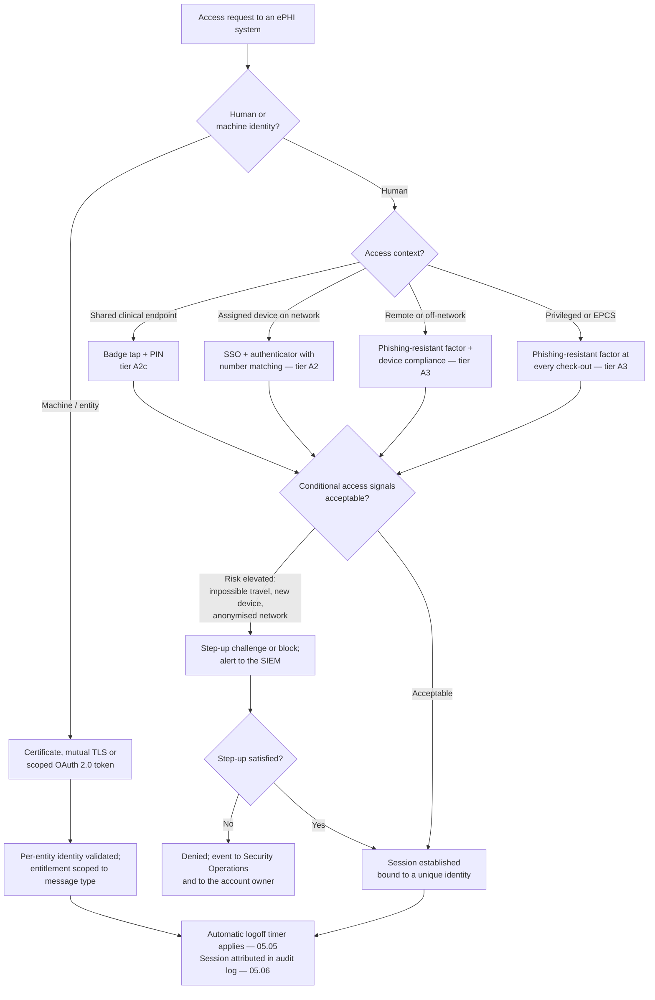

# 05.08 — Person or Entity Authentication

| Field | Value |
|---|---|
| Document ID | MBH-PTS-AUT-2026-508 |
| Version | 1.0 |
| Date | 2026-07-15 |
| Classification | Confidential — Electronic Protected Health Information (ePHI) // Illustrative Portfolio Sample |
| Owner | Marcus Reed, Information Security Manager |
| Co-Owner | Daniel Cho, Chief Information Security Officer &amp; HIPAA Security Official |
| Author | Advisory Team (Healthcare GRC / HIPAA) |
| Status | Approved |

## Purpose

This document implements **45 CFR §164.312(d) — Person or Entity Authentication**: *"Implement procedures to verify that a person or entity seeking access to electronic protected health information is the one claimed."*

The standard is **required** and carries **no separate implementation specifications**. That structure matters. There is no addressable branch to argue about, no §164.306(d)(3) alternative to document, and no partial position that satisfies the rule. A covered entity either verifies identity before granting access to ePHI or it does not. What the rule leaves open is *how strongly* identity must be verified — and it is in that gap that MercyBridge's principal High risk, **R-01**, lives: **multi-factor authentication is enforced on only 44 of the 68 ePHI systems**, so on 24 systems a stolen password is a complete authentication.

05.05 answered *who is this account entitled to be*. This document answers *is the human at the keyboard actually that account holder* — and it answers it for machines and vendors as well as people, because §164.312(d) says "person **or entity**."

> **Standard: §164.312(d) · required · no sub-specifications · MFA 44 of 68 → 68 of 68 at Wave 1 (2026-10-31) · governing policy POL-21, supported by POL-19 and POL-11.**

## 1. The Standard, Read Precisely

| Element of the citation | What it obliges | MercyBridge instrument |
|---|---|---|
| *"Implement procedures"* | A documented, operating process — not a product | POL-21; the enrolment, verification and recovery runbooks in `governance/` |
| *"to verify"* | An affirmative test, performed at access time | SSO with conditional access; MFA challenge; certificate validation |
| *"a person or entity"* | Humans, service accounts, devices, applications and business associates | §5 and §6 below |
| *"seeking access to ePHI"* | Scoped to the 68 in-scope systems, not the whole 210-system estate | 02.02 inventory defines the boundary |
| *"is the one claimed"* | Identity assurance, not merely credential possession | Identity proofing at enrolment; phishing-resistant factors where risk warrants |

**Why a password alone fails the test.** A password proves that *someone* knows a secret. Phishing, credential stuffing, infostealer malware and help-desk social engineering all transfer that secret without transferring identity. Phase 03 scored phishing likelihood at **5 — the only likelihood-5 entry in the register (R-34)** — which means MercyBridge must assume credentials are already in adversary hands and design authentication so that possession of a password is insufficient.

## 2. Authentication Coverage — Baseline to Target

| Population | Baseline (2026 Q1) | At Phase 05 approval | Wave 1 target (2026-10-31) |
|---|---|---|---|
| **ePHI systems enforcing MFA** | **44 of 68** | 57 of 68 | **68 of 68** |
| ePHI systems federated to enterprise SSO | 51 of 68 | 61 of 68 | 68 of 68 |
| ePHI systems accepting local credentials outside SSO | 7 | 2 | 0 |
| Remote / VPN access paths requiring MFA | All user VPN; 2 legacy split-tunnel exceptions | User VPN only; exceptions withdrawn | All paths, no exception |
| Privileged (`adm-`) sessions requiring MFA at check-out | Partial | 100% | 100% |
| Workforce holding a phishing-resistant factor | 0 | 640 | **1,450** — all privileged, remote-only, executive and finance roles |
| Internet-facing ePHI surfaces behind MFA (portal, FHIR gateway, webmail) | Partial | 100% | 100% |
| Service and application accounts using vaulted secrets | 0 of 340 | 222 of 340 | 340 of 340; 0 unvaulted |
| Vendor / third-party access paths brokered with MFA | Partial | 100% of 742 device support paths | 100% |
| Clinical endpoints with proximity badge tap-and-go | 0 | 3,550 | 3,550 maintained |

**The 24-system gap is not evenly distributed.** Nineteen of the 24 systems without MFA at baseline are Tier 2 and Tier 3 ancillary applications reached through SSO — the gap there is a missing second factor, closed by policy configuration. The remaining five are the hard cases: two legacy clinical applications that cannot consume SAML, one payer-facing portal owned by a business associate, and two device-management consoles. Each carries a dated remediation ticket and an interim compensating control (source-IP restriction plus session recording) recorded in `trackers/`.

## 3. The Factor Standard

| Assurance tier | Where it applies | Accepted factors | Not accepted |
|---|---|---|---|
| **A3 — Phishing-resistant** | Privileged accounts, remote-only workers, EPCS prescribers, executives, Security Operations, break-glass administration | FIDO2 / WebAuthn security key; platform authenticator bound to a managed device; PIV-class smart card | SMS, voice, email OTP, push |
| **A2 — Strong** | All routine workforce access to Tier 1 and Tier 2 ePHI systems | Authenticator app with **number matching**; hardware OTP token; smart card | SMS, voice, email OTP |
| **A2c — Clinical shared endpoint** | Shared workstations, WOWs and kiosks in clinical areas | Proximity badge tap **plus** PIN, with a session-bound re-authentication window | Badge tap alone |
| **A1 — Standard** | Non-ePHI enterprise systems (outside the 68) | SSO password plus device compliance signal | — |
| **E — Entity / non-human** | Interfaces, APIs, devices, backup agents, vendor connections | Mutual TLS with a per-entity certificate; OAuth 2.0 client credentials with scoped tokens; vaulted rotating secret | Shared static API key; embedded password |

**SMS and voice are withdrawn as ePHI factors** on the enterprise timetable of 2026-09-30. They remain available only as a *recovery* channel of last resort, and only after live verification by the service desk under the identity-verification protocol in 04.04 — the control that treats **R-39**.

**Number matching is mandatory** wherever push notification is used. MFA-fatigue push bombing is the dominant bypass technique against A2 and is defeated by requiring the user to enter a displayed number rather than tap "approve."

## 4. The Clinical Usability Tension — and How It Is Resolved

Authentication in a hospital is not an office problem with clinical decoration. A nurse authenticates to the EHR **dozens of times per shift**; an anaesthetist's hands are in a sterile field; an emergency physician is running a resuscitation. If the authentication design assumes a personal smartphone retrieved from a pocket, the workforce will defeat it — by sharing sessions, by propping doors, by writing PINs on badges. **Phase 03 recorded exactly that outcome as R-02: 96 shared and generic clinical logins.** Shared logins in hospitals are a symptom of authentication friction, not of indifference, and no amount of training corrects a control that makes care slower.

MercyBridge therefore treats **authentication strength and clinical throughput as a single design problem**, and resolves it with a factor that is already in the clinician's hand: the identity badge.

| Clinical setting | Authentication design | Rationale |
|---|---|---|
| Shared clinical workstation / WOW | **Badge tap + PIN**; tap-out suspends, tap-in resumes within the grace window | Two factors — something you have, something you know — with no phone, no pocket, no glove removal |
| Sterile field (OR, cath lab, IR) | Circulating-nurse workstation authenticated at case start; scrubbed clinician never authenticates mid-procedure | A phone in a sterile field is a contamination event, not a security control |
| Emergency department | Badge tap + PIN with a shortened re-authentication window; break-the-glass always available under 05.05 §3 | Speed preserved; attribution preserved |
| Personal / assigned device | Platform authenticator or security key | Highest assurance where the device is a single user's |
| Remote clinician (teleradiology, after-hours) | Phishing-resistant factor plus device compliance | No physical perimeter to rely on |
| e-Prescribing of controlled substances | Two factors, one of which is a hard token or biometric, per DEA rule | See §7 |

**A phone is not an acceptable universal second factor in a clinical environment.** That statement is a design commitment, and the badge-tap deployment on **3,550 clinical endpoints** delivered in 05.03 is what makes it affordable. Where the badge is the possession factor, the PIN is never displayed, never shared, and is reset only through the verified service-desk protocol.

## 5. Remote and Off-Network Access

| Path | Population | Authentication control |
|---|---|---|
| Enterprise user VPN | Remote coders, revenue cycle, IT, remote clinicians | Phishing-resistant factor plus device compliance; full-tunnel inspection; no split tunnel |
| Virtual desktop published externally | Clinical and administrative remote users | MFA at the gateway; ePHI never leaves the VDI session; clipboard and drive redirection disabled |
| Web portals (webmail, HR, patient portal administration) | Whole workforce | Conditional access; MFA; legacy authentication protocols blocked |
| Business associate and vendor connections | 742 device support paths; hosted-service integrations | Brokered just-in-time session, MFA at the broker, session recorded, no standing VPN |
| Teleradiology after-hours reads | Contracted radiologists | Named identities, phishing-resistant factor, DICOM TLS, studies purged from vendor cache at 30 days |
| Offshore support (two services) | Scoped support staff | Named, time-bounded identities; MFA; data-set reduction enforced technically — carried to Phase 06 |

**The two split-tunnel exceptions for legacy remote coding tools (R-20) are withdrawn, not compensated.** 03.08 records that risk as *avoided*: the tools were re-platformed onto the VDI estate rather than granted an inspection bypass. Avoidance is a legitimate treatment and is the cleanest one available here.

## 6. Entity Authentication — Machines, Interfaces and Business Associates

§164.312(d) is routinely implemented as a workforce control and then quietly ignored for the non-human identities that move the overwhelming majority of ePHI. At MercyBridge, **the interface engine handles more ePHI in an hour than any human sees in a year**.

| Entity class | Population | How identity is verified | Rotation / expiry |
|---|---|---|---|
| HL7 / MLLP interfaces | Interface engine to 31 endpoints | Mutual TLS; per-interface certificate; allow-listed source | Certificates 1 year |
| DICOM nodes | PACS, VNA, modalities, teleradiology | DICOM TLS with per-node certificate and AE-title allow-list | Certificates 1 year |
| FHIR / API consumers | Patient portal, HIE, registered third-party apps | OAuth 2.0 client credentials, scoped tokens, per-consumer revocation | Tokens short-lived; client secrets 180 days |
| Claims and payer file transfer | Clearinghouse, payers | SFTP with host-key pinning and per-partner key pair | Keys annually |
| Backup and management agents | Enterprise estate | Dedicated identities with vaulted secrets, network-restricted | Automated, 90 days |
| Medical devices | 5,930 of 6,120 visible to the IoMT gateway | Per-device certificate where the platform supports it; 802.1X or MAB with VLAN assignment where it does not | Per 05.11 |
| Business associate integrations | ~180 BAs; 24 critical | Named service identity, mutual TLS, contractual authentication terms | Verified in Phase 06 |

**Where a device cannot hold a credential at all**, the identity assertion is made by the network — 802.1X where supported, MAC authentication bypass with strict VLAN assignment where not — and the residual exposure is treated as a segmentation problem in **05.11**, not pretended away as an authentication success.

## 7. Provider Identity Proofing and EPCS

Prescribing identity is a distinct legal regime layered on top of §164.312(d), and MercyBridge treats it as part of the authentication programme rather than a pharmacy-only concern.

| Requirement | Source | MercyBridge implementation |
|---|---|---|
| Identity proofing of the prescriber before credential issue | DEA EPCS rule; NIST IAL2-equivalent | In-person or supervised remote proofing with two government identity documents, performed by Medical Staff Services and recorded |
| Two-factor authentication at signing, using two of: knowledge, hard token, biometric | DEA EPCS rule | Password plus hard token or biometric; **push and SMS are not permitted for signing** |
| Logical access control set by two individuals | DEA EPCS rule | Prescriptive authority granted only on dual approval — Medical Staff Services plus Pharmacy |
| Credential bound to the individual, never shared or delegated | DEA; §164.312(a)(2)(i) | Enforced technically; delegation of *entry* is permitted, delegation of *signing* is not |
| Audit trail of signing events | DEA; §164.312(b) | EPCS events ingested to the SIEM as a named use case (05.06) |
| Provider onboarding and offboarding | §164.308(a)(3)(ii)(C) | Prescriptive authority revoked on the same joiner–mover–leaver trigger as system access |

The same identity-proofing evidence supports credentialing, the state PDMP account, and the HIE provider directory entry — one proofing event, three downstream assurances, and a single revocation point.

## 8. Recovery, Enrolment and the Help-Desk Attack Surface

The strongest authenticator in the world is bypassed by a credential reset granted to a caller who sounds convincing. Phase 03 registered this as **R-39**.

| Control | Statement |
|---|---|
| Enrolment | Performed at onboarding against verified HR identity; self-service enrolment permitted only from a managed device on the internal network |
| Factor addition | Adding a new factor requires an existing factor; a lone remaining factor cannot self-approve a replacement |
| Reset | Service desk verifies identity through the 04.04 protocol — HR-held attributes plus manager confirmation; never a caller-supplied attribute alone |
| Privileged reset | Requires supervisor approval and is logged as a privileged event to the SIEM |
| Lockout | Progressive delay rather than hard lockout on clinical accounts, to avoid a denial-of-care condition |
| Break-glass | Uses the clinician's own credential with full authentication — never an unauthenticated bypass (05.05 §3) |
| Monitoring | Factor-change events, impossible travel, and legacy-protocol attempts are named SIEM use cases |

## 9. The 2025 NPRM and Authentication

| Proposal | Position under the in-force rule | MercyBridge position |
|---|---|---|
| **Mandatory multi-factor authentication** for all ePHI access | Not named; inferred from §164.312(d) "verify … is the one claimed" | **Already the design standard.** 44 of 68 → 68 of 68 by 2026-10-31; no addressable argument is being relied upon |
| Removal of the addressable/required distinction | §164.312(d) is already required | No change |
| Explicit anti-phishing expectations | Implicit | Phishing-resistant factors mandated for A3 populations; SMS withdrawn |
| Documented exceptions for technology that cannot support MFA | Not permitted today | The five hard-case systems and the device estate carry dated tickets and interim compensating controls, not permanent exemptions |

## 10. Evidence Register

| Evidence | Produced by | Retention |
|---|---|---|
| POL-21 and POL-19 with signature pages | Karen Boyd | 6 years |
| MFA coverage report by system across all 68 ePHI systems | Marcus Reed | 6 years |
| Conditional-access and factor-policy configuration exports | Marcus Reed | 6 years |
| Phishing-resistant factor issuance register (1,450 holders) | Marcus Reed | 6 years |
| Local-credential elimination tracker (7 → 0 systems) | Marcus Reed | 6 years |
| Badge tap-and-go deployment record (3,550 endpoints) | Anthony Ruiz | 6 years |
| EPCS identity-proofing records and dual-approval log | Medical Staff Services / Dr. Samuel Ortega | 6 years |
| Certificate and secret inventory with rotation evidence | Marcus Reed | 6 years |
| Service-desk identity-verification call sampling | Marcus Reed | 6 years |
| Penetration test of authentication paths | Ironwood Security Labs — Phase 08 | 6 years |

## 11. Risks Treated

| Risk | Rating at Phase 03 | How §164.312(d) treats it | Residual at Phase 05 |
|---|---|---|---|
| **R-01** — Credential compromise yields unauthorised ePHI access; MFA on only 44 of 68 systems | **High (16)** | MFA to 68 of 68 at Wave 1; 7 local-credential paths eliminated; phishing-resistant factors for 1,450 high-risk identities; conditional access with step-up | **Moderate (8)** at Wave 1 close (2026-10-31) |
| **R-34** — Phishing / BEC compromises mailboxes containing ePHI | High (15) → Moderate (9) after Phase 04 | MFA on webmail and all internet-facing surfaces; number matching; legacy authentication blocked; impossible-travel policy | **Low (6)** at Wave 1 close |
| **R-02** — Shared and generic clinical logins destroy audit attribution | High (16) → Moderate (12) after Phase 04 | Badge tap + PIN removes the friction that drives sharing; 96 shared accounts → 21 → 0 | **Low (6)** at Wave 1 close |
| **R-39** — Service desk social-engineered into a credential reset | Low (4) | Verified reset protocol; factor-addition requires an existing factor; privileged resets logged and approved | **Low (2)** |
| **R-13** — Default and shared device credentials (~1,850 devices) | Moderate (8) | Per-device certificates where supported; 802.1X / MAB identity assertion where not; full treatment in 05.11 | Moderate (8) — Wave 3 |
| **R-06** — Vendor remote-support entitlements across 742 devices under-reviewed | Moderate (8) | Brokered just-in-time sessions with MFA at the broker; no standing VPN; recorded sessions | **Low (6)** |
| **R-20** — Split-tunnel exception bypasses inspection | Moderate (8) | Exception withdrawn; legacy coding tools re-platformed onto VDI behind MFA | **Low (4)** — treatment is avoidance |

## Cross-References

| Reference | Relevance |
|---|---|
| 02.02 — ePHI System Inventory | The 68 systems that form the MFA denominator |
| 02.03 — ePHI Data-Flow Mapping | The interface, API and partner entities authenticated in §6 |
| 03.04 — Existing Controls Assessment | C-T02 baseline (MFA 44 of 68) improved here |
| 03.07 — Risk Register | R-01, R-02, R-06, R-13, R-20, R-34, R-39 |
| 03.08 — Risk Management Plan | Wave 1 identity assurance, target 2026-10-31 |
| 04.04 — Workforce Security | Identity verification protocol and joiner–mover–leaver triggers |
| 04.06 — Security Awareness &amp; Training | Phishing simulation and reporting culture supporting R-34 |
| 05.03 — Workstation Use &amp; Security | Badge tap-and-go on 3,550 clinical endpoints |
| 05.05 — Technical Access Control | Unique user identification, break-the-glass and automatic logoff |
| 05.06 — Audit Controls | What an authenticated, attributed session makes reviewable |
| 05.09 — Transmission Security | Mutual TLS as the entity-authentication mechanism in transit |
| 05.11 — Medical Device Security Controls | Device identity where a credential cannot be held |
| POL-11, POL-19, POL-21 | Awareness reminders; technical access control; integrity and authentication |

---
[⬅ Previous](05.07-integrity-controls.md) · [🏠 Phase README](05.00-README.md) · [Next ➡](05.09-transmission-security.md)
