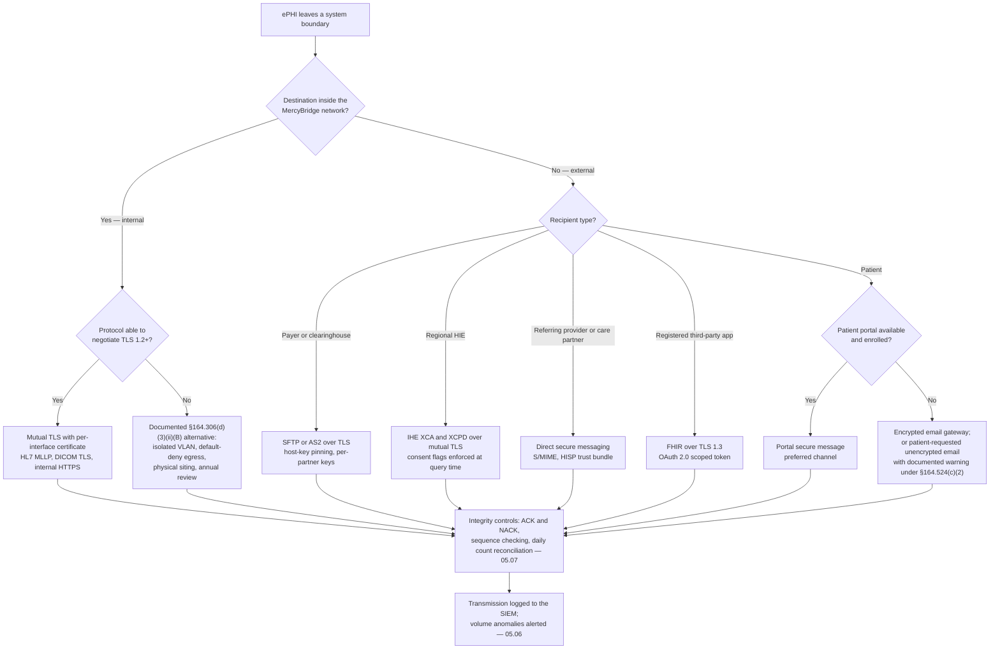

# 05.09 — Transmission Security

| Field | Value |
|---|---|
| Document ID | MBH-PTS-TRN-2026-509 |
| Version | 1.0 |
| Date | 2026-07-15 |
| Classification | Confidential — Electronic Protected Health Information (ePHI) // Illustrative Portfolio Sample |
| Owner | Marcus Reed, Information Security Manager |
| Co-Owner | Anthony Ruiz, Chief Information Officer |
| Author | Advisory Team (Healthcare GRC / HIPAA) |
| Status | Approved |

## Purpose

This document implements **45 CFR §164.312(e)(1) — Transmission Security**: *"Implement technical security measures to guard against unauthorized access to electronic protected health information that is being transmitted over an electronic communications network."*

The standard carries two **addressable** implementation specifications — **integrity controls, §164.312(e)(2)(i)** and **encryption, §164.312(e)(2)(ii)** — and MercyBridge implements both. Under the **2025 NPRM**, encryption in transit becomes **mandatory**, so the addressable analysis is preserved for the record rather than relied upon as a defence.

Transmission security is where a hospital differs most sharply from a corporate network. MercyBridge does not run a handful of well-behaved HTTPS applications; it runs **HL7 v2 over MLLP**, **DICOM**, **FHIR**, **X12 claims files**, **NCPDP e-prescribing**, **IHE cross-community queries to a regional HIE**, **Direct secure messaging**, **wireless telemetry on WMTS spectrum**, and a long tail of vendor protocols designed before transport encryption was assumed. **Eight of the 68 ePHI systems transmit over channels with partial or absent TLS (R-42)** and **118 telemetry devices cannot negotiate TLS at all (R-14)**.

> **Standard: §164.312(e)(1) · two specifications · both addressable · both implemented · encryption in transit 60 of 68 → 68 of 68 at Wave 2 (2027-01-31) · governing policy POL-22, with POL-23 for cryptographic standards.**

## 1. The Standard and Its Specifications

| Spec | Citation | Requirement | R / A | MercyBridge position |
|---|---|---|---|---|
| Integrity controls | §164.312(e)(2)(i) | Security measures to ensure that electronically transmitted ePHI is not improperly modified without detection | Addressable | **Implemented** — TLS record integrity, message-level acknowledgement and sequence checking, daily count reconciliation, checksums on batch files (see 05.07) |
| Encryption | §164.312(e)(2)(ii) | A mechanism to encrypt ePHI whenever deemed appropriate | Addressable | **Implemented** — TLS 1.2 minimum, TLS 1.3 preferred, on 60 of 68 systems rising to 68 of 68; one documented §164.306(d)(3)(ii)(B) alternative for 118 telemetry devices |

**"Whenever deemed appropriate" is not a discretion to skip encryption.** MercyBridge's determination, recorded in ADR-0010, is that encryption of ePHI in transit is appropriate on **every** network path, internal and external, wired and wireless. The single exception is the telemetry population that is physically incapable of it, and that exception is documented, compensated, dated and board-visible — the pattern §164.306(d)(3) actually requires.

## 2. Coverage — Baseline to Target

| Population | Baseline (2026 Q1) | At Phase 05 approval | Wave 2 target (2027-01-31) |
|---|---|---|---|
| **ePHI systems encrypting all ePHI in transit** | **60 of 68** | 64 of 68 | **68 of 68** |
| ePHI systems with partial or absent TLS | 8 | 4 | 0 |
| Internal HL7 / MLLP interfaces on TLS | 24 of 31 | 29 of 31 | 31 of 31 |
| DICOM nodes on DICOM TLS | Partial | 78% of nodes | All nodes; modality exceptions documented |
| Outbound partner file transfers on SFTP or AS2 over TLS | 100% | 100% | 100% maintained |
| Patient-facing email to external recipients | Portal-first; opportunistic TLS fallback | Portal-first; enforced TLS or secure-message fallback | Unchanged; no unencrypted fallback |
| Site-to-site links (4 hospitals, ~30 sites) | IPsec on all SD-WAN paths | IPsec maintained | IPsec maintained |
| Wireless — clinical SSIDs | WPA2-Enterprise with 802.1X | WPA3-Enterprise migration in progress | WPA3-Enterprise where hardware supports |
| Telemetry devices that cannot negotiate TLS | **118** | 118 — isolated VLANs, default-deny egress | Replacement in the FY2027 capital cycle |
| Deprecated protocols permitted anywhere in the ePHI estate | SSL 3.0 / TLS 1.0 / TLS 1.1 present on 6 endpoints | 0 | 0 |

## 3. The Cryptographic Transport Standard

The full cryptographic standard, including cipher-suite selection and certificate governance, is set in **05.10** and **POL-23**. This section records the transport-layer application of it.

| Control | Standard |
|---|---|
| Minimum protocol | **TLS 1.2**; TLS 1.3 preferred and default for all new deployments |
| Prohibited | SSL 2.0 / 3.0, TLS 1.0, TLS 1.1, anonymous or NULL cipher suites, export-grade ciphers, RC4, 3DES |
| Cipher suites | AEAD suites only — AES-GCM or ChaCha20-Poly1305; forward secrecy required (ECDHE) |
| Certificates | Issued from the enterprise PKI or a public CA; RSA 2048 minimum or ECDSA P-256; maximum 1-year validity; automated renewal |
| Validation | Full chain and hostname validation enforced; certificate pinning on partner SFTP and DICOM paths |
| Mutual TLS | Required for all HL7 interfaces, DICOM nodes, HIE queries and business associate integrations |
| VPN / site-to-site | IPsec with AES-256-GCM and IKEv2 |
| Wireless | WPA3-Enterprise preferred, WPA2-Enterprise minimum, 802.1X with EAP-TLS |
| Configuration assurance | Monthly automated TLS posture scan across the ePHI estate; findings ticketed with a 10-business-day SLA |

## 4. Clinical Interfaces — HL7, DICOM and FHIR

| Interface class | Volume / scale | Encryption in transit | Integrity control |
|---|---|---|---|
| HL7 v2 over MLLP — ADT, ORM, ORU, RDE, DFT | 31 internal interfaces, millions of messages daily | TLS 1.2+ with mutual authentication; 2 remaining endpoints in Wave 2 | MLLP acknowledgement, message-control-ID sequencing, daily send/receive count reconciliation |
| DICOM — store, query/retrieve, worklist | 310 modalities, PACS and VNA | DICOM TLS with per-node certificate and AE-title allow-list | Study instance and image-count reconciliation; PACS integrity verification (05.07) |
| FHIR / USCDI patient access | Registered third-party applications | TLS 1.3, OAuth 2.0 with granular scopes, per-app revocation | Token audience validation; disclosure logging |
| IHE XCA / XCPD to the regional HIE | Bidirectional C-CDA exchange | Mutual TLS; both endpoints certificate-validated | Document hash validation; consent flags enforced at query time |
| NCPDP SCRIPT e-prescribing | Prescriptions and medication history | Certified network over TLS | Transaction acknowledgement; PDMP query logged separately |
| X12 837 / 835 claims and remittance | 4.6M claims per year | AS2 or SFTP over TLS | 997/999 functional acknowledgement; file-level checksum and batch control totals |
| Device to interface engine | Monitors, pumps, ventilators, analysers | TLS where the platform supports it; **118 telemetry devices cannot** | Message sequence and gap detection; alarm on feed loss |
| Nightly batch to backup vault and HIM archive | All Tier 1 systems | Backup agent over TLS; AES-256 at rest | Job verification hash; restore sampling (05.07) |

**Two failure modes are specific to clinical interfaces and are engineered against explicitly.** First, an interface that fails *closed* stops results reaching clinicians — so TLS enforcement changes are staged in a test interface, then in a maintenance window, with a rollback plan and a downtime procedure from 04.08 on standby. Second, an interface that fails *silently* is worse than one that fails loudly — so the daily count reconciliation in 05.07 is what proves a TLS change did not quietly drop a feed.

## 5. Email, Direct Secure Messaging and Communication With Patients

Email is the channel where transmission security and the Privacy Rule meet, and where MercyBridge's most frequent low-severity incidents originate (**R-35**, misdirected disclosure).

| Channel | When used | Control |
|---|---|---|
| **Patient portal secure message** | Default and preferred channel for all clinical communication with patients | Authenticated session, TLS 1.3, ePHI never leaves the portal boundary |
| Encrypted email gateway to a patient | Patient not enrolled in the portal, or content unsuited to it | Policy-based encryption triggered by ePHI detection; recipient retrieves via a secure web pickup |
| Unencrypted email to a patient | **Only** where the individual has been warned of the risk and still requests it, under **45 CFR §164.524(c)(2)(ii)** | Warning delivered and the request documented in the record; ePHI limited to the minimum necessary; never used for sensitive categories |
| Encrypted email to an external provider or payer | Routine external clinical and administrative correspondence | Enforced TLS to the recipient domain where a TLS policy exists; secure pickup fallback where it does not; opportunistic TLS alone is not accepted for ePHI |
| **Direct secure messaging** | Provider-to-provider exchange, referrals, transitions of care, care summaries | S/MIME with certificates from an accredited HISP trust bundle; end-to-end encrypted and integrity-protected independently of the transport |
| Internal email between workforce members | Internal clinical and administrative correspondence | TLS internal; ePHI in mailboxes treated as a Tier 2 ePHI system; mailbox auto-forward to external domains blocked |
| Fax | Legacy channel still required by some partners and payers | Digital fax over TLS to the gateway; cover-sheet and confirmation discipline; migration to Direct where the partner supports it |
| Consumer messaging applications | **Prohibited** for any clinical information | Explicit prohibition in POL-17 and POL-22 with sanction linkage — treats **R-38** |

**Direct secure messaging deserves the emphasis it gets here.** It is the only external channel in which the encryption travels with the message rather than with the connection, which means an intermediate mail hop cannot see the content. Where a referring practice supports Direct, MercyBridge uses it in preference to encrypted email or fax, and the HISP trust-bundle relationship is reviewed annually alongside the business associate inventory.

## 6. Partner File Transfer, VPN and Wireless

| Path | Control | Risk treated |
|---|---|---|
| Claims and remittance to clearinghouse and payers | SFTP or AS2 over TLS; per-partner key pairs rotated annually; host-key pinning; minimum-necessary field filtering applied before export | R-42 |
| Extracts to business associates (transcription, collections, analytics) | SFTP over TLS with named service identities; landing zones encrypted at rest and purged on a schedule | R-29, R-42 |
| Teleradiology after-hours reads | DICOM TLS over a dedicated VPN; studies purged from the vendor cache at 30 days | R-42 |
| Site-to-site connectivity, 4 hospitals and ~30 sites | IPsec AES-256-GCM over SD-WAN; no ePHI traverses an uninspected internet path | R-18 |
| Remote user access | Full-tunnel VPN with MFA and device compliance; **split-tunnel exceptions withdrawn** | R-20 |
| Clinical wireless | WPA3-Enterprise where hardware permits, WPA2-Enterprise minimum; EAP-TLS with device certificates; clinical SSIDs on segregated VLANs | R-21 |
| Guest wireless | Fully isolated, internet-only, no route to any ePHI zone; captive portal with terms of use | R-21 |
| Medical device wireless and WMTS telemetry | Dedicated spectrum and VLANs; guest and clinical separation verified at every site survey | R-14, R-21 |
| Firewall and egress policy | Default-deny east–west and north–south; **74 unowned rules recertified or removed**; quarterly rule review with a named owner per rule | R-19 |
| Outbound data-loss prevention | Egress inspection for bulk ePHI movement; anomalous-volume alerting into the SIEM; full DLP delivered at Wave 2 | R-24, R-41 |

**Wireless drift at three sites is a real finding, not a theoretical one.** Phase 03 recorded guest/clinical separation drift (R-21) and three outpatient sites still on a legacy flat VLAN (R-18). Both are re-architected under the Wave 2 network programme, and the site survey checklist now includes an explicit SSID-to-VLAN-to-zone verification step signed off by the network owner.

## 7. The Telemetry Exception — §164.306(d)(3)(ii)(B) Applied Honestly

| Element | Statement |
|---|---|
| Population | **118 telemetry transmitters and receivers** carrying cardiac waveforms and patient association data |
| Specification not met | §164.312(e)(2)(ii) — encryption in transit |
| Why not | Vendor firmware on an FDA-cleared configuration has no TLS stack; no vendor-validated update exists; MercyBridge cannot modify the device without voiding clearance and support |
| Assessment recorded | Not reasonable and appropriate to implement the specification **on these devices** at this time — documented, dated, signed by the Security Official |
| Equivalent alternative measures | Dedicated isolated VLANs; default-deny egress limited to the named receiver and interface endpoints; no routing to corporate, guest or internet zones; physical siting in Zone 2 controlled space; passive IoMT monitoring with feed-loss and anomaly alerting; transmission integrity checks in 05.07 |
| Review | Annual, at the Medical Device Security Committee, and on any vendor firmware release |
| Exit | Replacement funded in the **FY2027 capital cycle**; encryption capability is a mandatory procurement clause for all replacements under POL-24 |
| Governance | Board Audit &amp; Compliance Committee visibility as a time-bounded exception, not an accepted permanent state |

This is the whole of the exception. There is no second, undocumented population, and no system-level "we use TLS where we can" formulation standing in for an analysis.

## 8. Evidence Register

| Evidence | Produced by | Retention |
|---|---|---|
| POL-22 and POL-23 with signature pages | Karen Boyd | 6 years |
| Encryption-in-transit coverage report by system (68 systems) | Marcus Reed | 6 years |
| Monthly TLS posture scan results and remediation tickets | Marcus Reed | 6 years |
| Interface certificate inventory and rotation records | Marcus Reed | 6 years |
| Firewall rule recertification records with named owners | Anthony Ruiz | 6 years |
| Wireless site-survey and SSID-to-zone verification records | Anthony Ruiz | 6 years |
| Partner SFTP / AS2 key exchange and rotation log | Marcus Reed | 6 years |
| HISP trust-bundle relationship review | Marcus Reed / Lisa Coleman | 6 years |
| Documented §164.306(d)(3)(ii)(B) alternative for 118 telemetry devices | Daniel Cho | 6 years |
| Patient requests for unencrypted email under §164.524(c)(2)(ii) | Rebecca Stern | 6 years |
| Penetration test of external and internal transmission paths | Ironwood Security Labs — Phase 08 | 6 years |

## 9. Risks Treated

| Risk | Rating at Phase 03 | How §164.312(e)(1) treats it | Residual at Phase 05 |
|---|---|---|---|
| **R-42** — Eight systems transmit ePHI over channels with partial or absent TLS | Moderate (9) | TLS 1.2+ enforced estate-wide, 60 → 68 of 68; deprecated protocols removed; monthly posture scanning | **Moderate (8)** at Wave 2 close, trending Low |
| **R-14** — 118 telemetry devices transmit over legacy protocols that cannot negotiate TLS | Moderate (8) | Documented alternative measure: isolated VLANs, default-deny egress, passive monitoring; replacement in FY2027 | Moderate (8) — Wave 3 |
| **R-18** — Three outpatient sites on a legacy flat VLAN | Moderate (12) | Site re-architecture onto the ten-zone model; device and workstation traffic separated; IPsec on all SD-WAN paths | **Moderate (8)** at Wave 2 close |
| **R-19** — 74 unowned firewall rules erode default-deny | Moderate (9) | Rule recertification with a named owner per rule; quarterly review; default-deny reasserted east–west | **Moderate (8)** |
| **R-20** — Split-tunnel exception bypasses inspection | Moderate (8) | Exception withdrawn; legacy coding tools re-platformed onto inspected VDI paths | **Low (4)** — treatment is avoidance |
| **R-21** — Wireless guest and clinical separation drifted at three sites | Low (6) | WPA3/WPA2-Enterprise with EAP-TLS; guest fully isolated; SSID-to-zone verification in every site survey | **Low (4)** |
| **R-38** — Unsanctioned messaging applications carry clinical information | Low (6) | Sanctioned-channel standard in POL-22; portal and Direct as the supported alternatives; prohibition with sanction linkage | **Low (4)** |
| **R-24** — Double-extortion exfiltration before encryption | **High (16)** | Egress control, outbound inspection and anomalous-volume alerting; full DLP at Wave 2 | Moderate (12) — Wave 2 |
| **R-41** — Unstructured ePHI sprawl with no reliable volume estimate | Moderate (12) | Egress visibility and automated ePHI discovery scoped with encryption work in 05.10 | Moderate (8) — Wave 2 |
| **R-35** — Misdirected fax, email or records release | Moderate (12) | Portal-first patient communication; enforced encryption gateway; Direct in place of fax; recipient verification | Moderate (9) |

## Cross-References

| Reference | Relevance |
|---|---|
| 02.03 — ePHI Data-Flow Mapping | DF-01 to DF-33; the transmission paths controlled here |
| 02.05 — Network Architecture &amp; Segmentation | Ten-zone model, 96 device VLANs, NW-04 telemetry finding |
| 03.04 — Existing Controls Assessment | C-T05 and C-T09 baselines improved here |
| 03.07 — Risk Register | R-14, R-18, R-19, R-20, R-21, R-24, R-35, R-38, R-41, R-42 |
| 03.08 — Risk Management Plan | Wave 2 segmentation and encryption, target 2027-01-31 |
| 05.05 — Technical Access Control | Access control for software programs and interface identities |
| 05.06 — Audit Controls | Transmission and egress telemetry into the SIEM |
| 05.07 — Integrity Controls | Message acknowledgement, sequencing and count reconciliation |
| 05.08 — Person or Entity Authentication | Mutual TLS as entity authentication |
| 05.10 — Encryption &amp; Key Management | Cryptographic standard, certificate and key governance |
| 05.11 — Medical Device Security Controls | The telemetry exception in its device context |
| Phase 06 — Business Associate Risk | Contractual transmission terms with ~180 business associates |
| POL-17, POL-22, POL-23, POL-24 | Workstation use; transmission security; encryption; medical device security |

---
[⬅ Previous](05.08-person-or-entity-authentication.md) · [🏠 Phase README](05.00-README.md) · [Next ➡](05.10-encryption-and-key-management.md)
