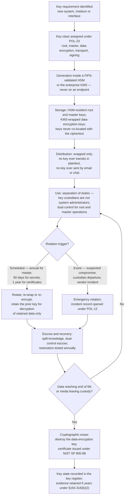
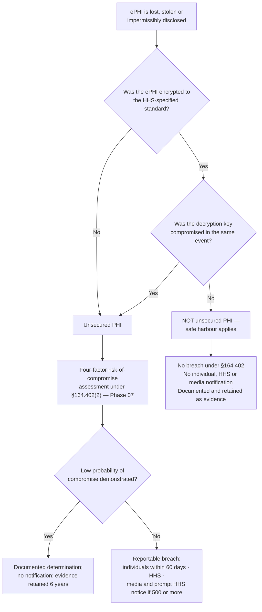

# 05.10 — Encryption &amp; Key Management

| Field | Value |
|---|---|
| Document ID | MBH-PTS-ENC-2026-510 |
| Version | 1.0 |
| Date | 2026-07-15 |
| Classification | Confidential — Electronic Protected Health Information (ePHI) // Illustrative Portfolio Sample |
| Owner | Daniel Cho, Chief Information Security Officer &amp; HIPAA Security Official |
| Co-Owner | Marcus Reed, Information Security Manager |
| Author | Advisory Team (Healthcare GRC / HIPAA) |
| Status | Approved |

## Purpose

Encryption is not a standard of the HIPAA Security Rule. It appears twice, both times as an **addressable implementation specification** — **§164.312(a)(2)(iv)** (a mechanism to encrypt and decrypt ePHI at rest) and **§164.312(e)(2)(ii)** (a mechanism to encrypt ePHI in transit). This document is the **cross-cutting control** that implements both, sets one enterprise cryptographic standard for the whole estate, and governs the key lifecycle that makes the cryptography meaningful.

It exists as its own document for one reason: **encryption is the only technical control in the programme that changes the legal consequence of a failure.** Every other safeguard reduces the probability that ePHI is lost. Encryption to the HHS standard means that when ePHI *is* lost, it is not "unsecured PHI" — and its loss is therefore **not a reportable breach** under 45 CFR §164.402. That is the **breach safe harbour**, and it is the single strongest business case any healthcare organisation can make for a security investment. It is also the reason **R-40** was scored **High (16)** despite MercyBridge already encrypting 51 of 68 systems: the 17 that were not encrypted were the ones that could turn a stolen laptop into a 2.1-million-record notification event.

> **Cross-cutting control · AES-256 at rest · TLS 1.2+ in transit · at rest 51 of 68 → 68 of 68 (Wave 2) · in transit 60 of 68 → 68 of 68 (Wave 2) · HSM-backed key hierarchy · governing policy POL-23.**

## 1. The Enterprise Cryptographic Standard

| Domain | Algorithm and parameters | Validation basis |
|---|---|---|
| Symmetric encryption at rest | **AES-256**, GCM or XTS mode as appropriate to the medium | FIPS 140-3 (or FIPS 140-2) validated modules; NIST SP 800-111 for end-user devices |
| Transport encryption | **TLS 1.2 minimum, TLS 1.3 preferred**; AEAD suites only; ECDHE forward secrecy | NIST SP 800-52 Rev. 2 |
| Site-to-site and remote access | IPsec, AES-256-GCM, IKEv2 | NIST SP 800-77 |
| Asymmetric / key exchange | RSA 3072 minimum for new issuance (2048 permitted on legacy paths pending rotation); ECDSA P-256 or P-384 | NIST SP 800-57 Part 1 |
| Hashing and integrity | SHA-256 minimum; HMAC-SHA-256 for message authentication | NIST FIPS 180-4, FIPS 198-1 |
| Random number generation | Hardware-backed DRBG in a validated module | NIST SP 800-90A |
| Password and secret storage | Memory-hard KDF with per-secret salt; secrets vaulted, never embedded | NIST SP 800-63B |
| Media sanitisation by cryptographic erase | Destruction of the data-encryption key, evidenced by certificate | NIST SP 800-88 Rev. 1 |
| **Prohibited** | DES, 3DES, RC4, MD5, SHA-1 for signatures, SSL 2.0/3.0, TLS 1.0/1.1, ECB mode, hard-coded or shared static keys | POL-23 §4 |

**One standard, one exception process.** Any deviation requires a written §164.306(d)(3)(ii)(B) determination signed by the Security Official, a named compensating control, a review date, and an exit plan. Two such determinations exist across the whole estate: the **five device platforms that cannot encrypt at rest** (05.05 §5, 05.11) and the **118 telemetry devices that cannot negotiate TLS** (05.09 §7).

## 2. Coverage Across the Estate

| Layer | Baseline (2026 Q1) | At Phase 05 approval | Wave 2 target (2027-01-31) | Mechanism |
|---|---|---|---|---|
| **ePHI systems encrypted at rest** | **51 of 68** | 58 of 68 | **68 of 68** | Volume, database and object-store encryption |
| **ePHI systems encrypting ePHI in transit** | **60 of 68** | 64 of 68 | **68 of 68** | TLS 1.2+ / mutual TLS / IPsec |
| Managed endpoints with full-disk encryption | 96% of 8,065 | **100%** | 100% | AES-256, TPM-bound, key escrowed |
| Tier 1 clinical databases | Partial | All Tier 1 | All Tier 1–2 | Transparent data encryption |
| Backup and archive repositories | Tier 1 only | All tiers | All tiers, plus immutable copies for Tier 1 | Encrypted at rest and in flight |
| Removable media | Not centrally controlled | Hardware AES-256 only; unencrypted media cannot mount for write | Maintained | 05.04 §7 |
| Vendor-hosted and cloud services | Contractual assertion only | Contractual **and** evidenced in SOC 2 Type II | Verified per BA in Phase 06 | §5 below |
| Mobile devices with ePHI access | MDM-enforced device encryption | 100% enrolled; containerised ePHI apps | Maintained | MDM attestation |
| ePHI-bearing medical devices capable of encryption at rest | ~1,900 of 3,170 | 2,240 of 3,170 | Wave 3 — platform-limited, documented | 05.11 |
| Unstructured ePHI on file shares | Volume unknown (R-41) | Discovery in progress | Discovered, classified, encrypted or removed | Automated ePHI discovery, Wave 2 |

**The endpoint estate reached 100% first, deliberately.** Endpoint loss is the highest-frequency ePHI loss event across ~6,500 workforce members, and full-disk encryption is the cheapest safe-harbour purchase available. Server, database and hosted coverage follows on the Wave 2 schedule because it carries change risk into 24×7 clinical operations and must move through change control with a rollback plan.

## 3. Key Management Lifecycle

Encryption without key management is theatre. A key that is generated on a workstation, stored beside the ciphertext, shared by email, never rotated and never destroyed provides no protection and — critically — **no safe harbour**, because HHS guidance conditions the safe harbour on the *decryption key not having been breached*.

| Lifecycle stage | Control | Evidence |
|---|---|---|
| **Generation** | Inside a FIPS-validated HSM or the enterprise KMS, using a hardware DRBG. No key material is generated on an endpoint, in a script, or by a vendor on MercyBridge's behalf | Key register entry with class, owner, algorithm, creation date |
| **Storage** | Root and master keys HSM-resident and non-exportable; data-encryption keys wrapped by a master key; **keys never stored on the same volume, host or backup set as the data they protect** | HSM configuration export; architecture record |
| **Distribution** | Wrapped transport only; mutual TLS; no plaintext key ever leaves a cryptographic boundary | Transfer log |
| **Use and separation of duties** | Key custodians are named individuals who are **not** administrators of the systems the keys protect; root and master operations require **dual control**; all key operations logged to the SIEM as privileged events | Custodian register; quarterly attestation; SIEM records |
| **Rotation** | Master keys annually; data-encryption keys on re-encryption or media replacement; application secrets every 90 days; TLS certificates at most every 12 months with automated renewal | Rotation calendar and completion records |
| **Escrow and recovery** | Split-knowledge, dual-control escrow for all keys whose loss would render clinical data unrecoverable; **recovery tested annually** as part of the contingency exercise in 04.08 | Escrow test report with witness signatures |
| **Revocation and compromise** | Defined emergency rotation runbook; certificate revocation through the enterprise PKI and CRL/OCSP; incident opened under POL-12 | Incident record; revocation log |
| **Destruction** | Cryptographic erase as the primary disposal path for encrypted media; key destruction certificated and reconciled to the asset record in 05.04 | Destruction certificate with serial-level manifest |
| **Inventory** | A single enterprise **key register** records every key class, owner, custodian, algorithm, creation date, rotation date and destruction date | Key register, reviewed quarterly |

**Availability is a key-management requirement, not just a security one.** A lost key in a hospital is a clinical-availability event: encrypted clinical data that cannot be decrypted is indistinguishable from destroyed data, and §164.312 protects availability as well as confidentiality. That is why escrow is mandatory and why escrow restoration is *tested*, not merely documented.

## 4. Who Holds the Key — and Why It Matters

| Scenario | Key custody | Safe-harbour consequence |
|---|---|---|
| Endpoint full-disk encryption | MercyBridge; recovery key escrowed in the enterprise directory | Stolen laptop is a non-event, provided the device was powered off or locked and the escrow was not compromised |
| On-premises server and storage | MercyBridge HSM | Decommissioned drive destroyed by cryptographic erase; no reportable exposure |
| Removable media | MercyBridge; hardware-encrypted device with managed key | Lost USB device is a non-event |
| Backup vault | MercyBridge KMS; backup keys separated from production keys | A stolen backup set is unusable; separation prevents one compromise unlocking both |
| **Vendor-hosted EHR (Halcyon)** | **See §5** | The determinative question of the whole programme |
| Cloud object storage for imaging archive | Customer-managed key in MercyBridge KMS | Provider cannot decrypt without MercyBridge's key |
| Business associate landing zones | BA-held keys under BAA obligation | Assurance is contractual and documentary; verified in Phase 06 |

## 5. The Vendor-Hosted EHR Key Question

MercyBridge's primary EHR — **Halcyon Health EHR**, holding the entire **2.1 million-record** clinical archive — is vendor-hosted. Halcyon encrypts the data at rest. **Halcyon also holds the keys.** This is the most consequential unresolved cryptographic question in the estate, and it is stated here rather than buried.

| Question | Position |
|---|---|
| Is ePHI encrypted at rest in the hosted environment? | Yes — AES-256, asserted contractually and evidenced in the **SOC 2 Type II** report, reviewed annually by MercyBridge |
| Who generates and holds the keys? | **Halcyon**, within its own HSM infrastructure. MercyBridge does not currently hold or escrow the keys |
| Does encryption at rest protect MercyBridge from a *Halcyon* compromise? | **Only partially.** Encryption at rest defeats theft of storage media and of cold data. It does **not** defeat an adversary who compromises a Halcyon application account or administrative plane, because that adversary is served decrypted data by the application itself |
| Does the safe harbour apply if Halcyon is breached? | Only if the ePHI was encrypted **and the keys were not compromised** in the same incident. Where the application layer is compromised, the safe harbour will generally **not** apply and a breach analysis under §164.402 is required |
| Who is liable? | MercyBridge remains fully liable to individuals and to OCR as the covered entity; Halcyon carries direct HITECH liability as a business associate. Liability is shared; MercyBridge's duty to notify is not delegable |
| What is MercyBridge doing about it? | Three actions: (1) **customer-managed / hold-your-own-key options are on the FY2027 contract agenda** and are a mandatory evaluation criterion at renewal; (2) the BAA is strengthened with key-management representations, breach-notification timing and audit rights in **04.10**, tested in **Phase 06**; (3) **R-28** is carried as a High risk with board visibility rather than closed by a vendor assertion |
| Interim compensating controls | Named-list administrative access with MFA; session recording of Halcyon administrative activity; ingestion of Halcyon audit logs into the MercyBridge SIEM; independent backup of the clinical archive to a MercyBridge-keyed vault; tested downtime and read-only continuity capability |

**The honest statement is this:** encryption at rest in a hosted EHR protects MercyBridge against a category of incidents that includes stolen disks and misconfigured storage, and does **not** protect it against a credential-based compromise of the vendor's application. Presenting hosted encryption as complete protection would be the kind of unexamined assurance OCR settlements are made of.

## 6. The Breach Safe Harbour — the Business Case in One Paragraph

Under **45 CFR §164.402**, a breach is an impermissible acquisition, access, use or disclosure of **"unsecured protected health information."** HHS guidance issued under **HITECH §13402(h)(2)** specifies that PHI is *secured* — and therefore outside the definition — when it is rendered **unusable, unreadable, or indecipherable to unauthorised persons** by encryption to a validated standard (NIST SP 800-111 for data at rest, NIST SP 800-52 / IPsec for data in transit), **provided the decryption key has not been breached**. The consequence is categorical, not probabilistic: if encrypted ePHI meeting that standard is lost or stolen, there is **no breach**, and therefore **no notification to individuals, no notification to HHS, no media notice, no OCR investigation, and no entry on the public breach portal**.

| Population before Wave 2 | Population after Wave 2 | What changes |
|---|---|---|
| 17 of 68 ePHI systems outside the safe harbour | 0 of 68 | A storage-media loss on any in-scope system stops being a notification event |
| 4% of 8,065 endpoints unencrypted | 0% | ~320 laptops move from "potential breach" to "non-event" |
| Backup repositories encrypted for Tier 1 only | All tiers | A stolen or misplaced backup set is unusable |
| Removable media uncontrolled | Hardware-encrypted only | Lost media stops generating notifications |
| 3,170 ePHI-bearing devices, ~1,270 unencryptable | ~930 unencryptable pending Wave 3 replacement | Residual exposure narrowed to a named, board-visible population |

**Quantified plainly for the Board:** at MercyBridge's scale, a single lost unencrypted device holding a departmental extract can cross the **500-individual** threshold that triggers media notification and prompt HHS notice. Encryption at rest converts that outcome to a documented non-event at a cost measured in configuration effort. No other control in Phase 05 has that leverage — which is why **R-40** is the risk whose closure is tracked most closely, and why the safe harbour, not "defence in depth," is the argument used to fund it.

**One caution, stated so nobody over-claims it.** The safe harbour protects against loss of *data at rest or in transit*. It does **not** protect against an authenticated adversary who is served decrypted data — the double-extortion scenario in **R-24** — and it does not protect against ransomware's *availability* impact in **R-23**. Encryption is necessary and it is not sufficient; that is precisely why it sits alongside authentication, segmentation, audit and contingency rather than in place of them.

## 7. Governance, Roles and Assurance

| Role | Responsibility |
|---|---|
| Daniel Cho, CISO | Owns POL-23; approves the cryptographic standard and every §164.306(d)(3)(ii)(B) deviation; approves key custodian appointments |
| Marcus Reed, Information Security Manager | Operates the KMS and HSM estate; maintains the key register; runs rotation and the monthly cryptographic posture report |
| Named key custodians (4, dual-control pairs) | Hold escrow shares; participate in dual-control operations; attest quarterly; may not administer the protected systems |
| Anthony Ruiz, CIO | Delivers encryption on infrastructure, endpoints and network paths |
| Dr. Samuel Ortega, CMIO | Approves any change with clinical availability implications |
| Lisa Coleman, General Counsel | Encryption and key-custody terms in BAAs and procurement |
| Priya Anand, Internal Audit | Tests key management against POL-23 in 2026 Q4 |
| Beacon Assurance / Ironwood Security Labs | Independent validation in Phase 08 |

| Assurance activity | Cadence |
|---|---|
| Cryptographic posture scan across the ePHI estate | Monthly |
| Key register reconciliation | Quarterly |
| Custodian attestation and separation-of-duties check | Quarterly |
| Escrow restoration test | Annual, with the contingency exercise |
| Cryptographic standard review against NIST guidance (including post-quantum readiness) | Annual |
| Encryption coverage reporting to the Security Steering Committee and the Board | Quarterly |

## 8. Evidence Register

| Evidence | Produced by | Retention |
|---|---|---|
| POL-23 Encryption &amp; Key Management with signature page | Karen Boyd | 6 years |
| Enterprise cryptographic standard and approved-algorithm list | Daniel Cho | 6 years |
| Encryption coverage report — at rest and in transit, by system (68 systems) | Marcus Reed | 6 years |
| Key register with class, owner, custodian, rotation and destruction dates | Marcus Reed | 6 years |
| HSM and KMS configuration exports; FIPS validation certificates | Marcus Reed | 6 years |
| Custodian appointment letters and quarterly attestations | Daniel Cho | 6 years |
| Rotation completion records; emergency rotation incident records | Marcus Reed | 6 years |
| Annual escrow restoration test report with witness signatures | Marcus Reed | 6 years |
| Cryptographic erase certificates reconciled to the asset register | Anthony Ruiz | 6 years |
| Halcyon SOC 2 Type II review notes on key custody | Daniel Cho / Lisa Coleman | 6 years |
| Documented §164.306(d)(3)(ii)(B) determinations (5 device platforms; 118 telemetry devices) | Daniel Cho | 6 years |
| Safe-harbour determinations recorded for any loss event | Rebecca Stern / Daniel Cho | 6 years |

## 9. Risks Treated

| Risk | Rating at Phase 03 | How encryption and key management treat it | Residual at Phase 05 |
|---|---|---|---|
| **R-40** — ePHI at rest unencrypted or partially encrypted on 17 of 68 systems, forfeiting safe harbour | **High (16)** | Encryption at rest 51 → 68 of 68; 100% endpoint FDE; all backup tiers encrypted; HSM-backed key hierarchy with tested escrow | **Moderate (8)** at Wave 2 close, trending to Low (6) on full-estate safe-harbour attestation |
| **R-11** — ePHI at rest on 3,170 devices cannot be encrypted (ESC-1) | **High (15)** | Encryption enabled on 2,240 devices; documented alternative measure for the remainder; cryptographic erase where keys exist, physical destruction where they do not | Moderate (10) — Wave 3 |
| **R-24** — Double-extortion exfiltration before encryption | **High (16)** | Encryption reduces the value of data at rest and enables cryptographic erase; DLP and egress control complete the treatment | Moderate (12) — Wave 2 |
| **R-42** — Eight systems transmit ePHI with partial or absent TLS | Moderate (9) | TLS 1.2+ standard, certificate governance, monthly posture scanning | Moderate (8) — Wave 2 |
| **R-14** — 118 telemetry devices cannot negotiate TLS | Moderate (8) | Documented alternative measure; replacement mandates encryption capability at procurement | Moderate (8) — Wave 3 |
| **R-44** — Sanitisation not consistently certificated to NIST SP 800-88 | Moderate (8) | Cryptographic erase as the primary disposal path with certificate and serial-level reconciliation | **Low (4)** |
| **R-41** — Unstructured ePHI sprawl with no reliable volume estimate | Moderate (12) | Automated ePHI discovery scoped alongside encryption; discovered repositories encrypted or removed | Moderate (8) — Wave 2 |
| **R-28** — Hosted-EHR compromise (2.1M records) | **High (15)** | Key-custody question surfaced, BAA representations strengthened, independent MercyBridge-keyed backup | High (15) — closes in **Phase 06** |

## Cross-References

| Reference | Relevance |
|---|---|
| 01.04 — HIPAA Security Rule Overview | Where §164.312(a)(2)(iv) and (e)(2)(ii) sit in the rule |
| 02.02 — ePHI System Inventory | The 68 systems that form the coverage denominator |
| 03.07 — Risk Register | R-11, R-14, R-24, R-28, R-40, R-41, R-42, R-44 |
| 03.08 — Risk Management Plan | Wave 2 encryption, target 2027-01-31 |
| 04.08 — Contingency Plan | Escrow restoration tested inside the contingency exercise |
| 04.10 — Business Associate Contracts | Encryption and key-custody terms in the Halcyon BAA |
| 05.04 — Device &amp; Media Controls | Cryptographic erase and NIST SP 800-88 disposal |
| 05.05 — Technical Access Control | §164.312(a)(2)(iv) in its access-control context |
| 05.09 — Transmission Security | §164.312(e)(2)(ii) in its transmission context |
| 05.11 — Medical Device Security Controls | The five platforms that cannot encrypt |
| Phase 06 — Business Associate Risk | Verification of BA and hosted-service key custody |
| Phase 07 — Incident Response &amp; Breach Notification | Where the safe harbour is applied to a real event |
| POL-12, POL-18, POL-22, POL-23 | Incident response; media controls; transmission; encryption |

---
[⬅ Previous](05.09-transmission-security.md) · [🏠 Phase README](05.00-README.md) · [Next ➡](05.11-medical-device-security-controls.md)
