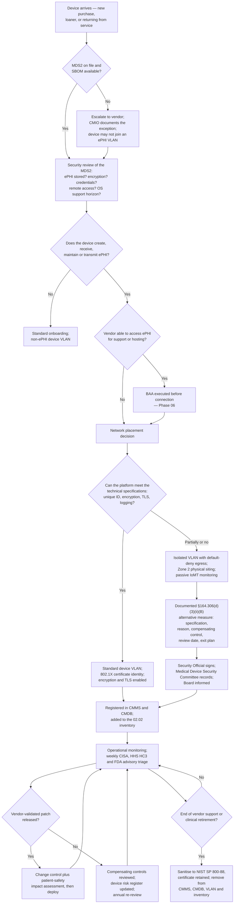

# 05.11 — Medical Device Security Controls

| Field | Value |
|---|---|
| Document ID | MBH-PTS-MDS-2026-511 |
| Version | 1.0 |
| Date | 2026-07-15 |
| Classification | Confidential — Electronic Protected Health Information (ePHI) // Illustrative Portfolio Sample |
| Owner | Dr. Samuel Ortega, Chief Medical Information Officer |
| Co-Owner | Anthony Ruiz, Chief Information Officer |
| Author | Advisory Team (Healthcare GRC / HIPAA) |
| Status | Approved |

## Purpose

This is the healthcare-specific chapter of Phase 05. It sets out how MercyBridge secures **6,120 networked medical devices** — of which **3,170 create, receive, maintain or transmit ePHI** and **1,300 run unsupported operating systems** — against the physical and technical safeguards of **§164.310** and **§164.312**, when the majority of those safeguards cannot be applied to the devices in the way the rule contemplates.

Medical devices break the assumptions of every general-purpose security standard. They are simultaneously **ePHI systems** and **patient-care instruments**. They are FDA-cleared configurations under vendor change control, so MercyBridge cannot patch them, cannot install an agent, cannot actively scan them without risking a clinical outage, and frequently cannot give them a unique credential or encrypt their storage. Yet they are unambiguously in scope: the risk analysis at §164.308(a)(1)(ii)(A) covers all ePHI, and §164.310(d)(1) governs the receipt, movement and disposal of the hardware that holds it.

The programme's answer is not to pretend the specifications are met. It is to implement what can be implemented, to make **network segmentation across 96 device VLANs** the primary compensating control, and to document every remaining gap as a **§164.306(d)(3)** determination with a named alternative measure, a review date and an exit plan. Three of the eleven High risks live here: **R-09**, **R-10** and **R-11**.

> **6,120 devices · 3,170 ePHI-bearing · 1,300 unsupported OS · 96 device VLANs · 742 vendor remote-support paths · governing policy POL-24, with POL-18 and POL-19 · joint CMIO / CIO / CISO ownership.**

## 1. The Fleet and Its Constraints

| Fleet attribute | Value | Consequence for the Security Rule |
|---|---|---|
| Networked medical devices | **6,120** | The largest single asset class in the estate |
| Devices creating, receiving, maintaining or transmitting ePHI | **3,170 (51.8%)** | Fully in §164.308(a)(1) and §164.310(d)(1) scope |
| Devices on unsupported or vendor-frozen operating systems | **1,300 (21.2%)** | Cannot be patched or hardened to the enterprise baseline — **R-09** |
| Device VLANs | **96**, across 10 device classes | The primary compensating control — **R-10, R-17** |
| Devices visible to the IoMT gateway | 5,930 (96.9%) | Passive detection substitutes for endpoint agents |
| Devices with an MDS2 form on file | 4,284 (70.0%); target 95% | Assessment quality gap — **R-12** |
| Devices with default or shared credentials | ~1,850 at baseline, 1,190 now | Unique user identification often unattainable — **R-13** |
| Devices with vendor remote-support connectivity | 742 | Third-party path into clinical networks — **R-06** |
| Devices that cannot encrypt ePHI at rest | 5 platforms within the ePHI-bearing population | No cryptographic safe harbour on loss — **R-11** |
| Telemetry devices that cannot negotiate TLS | 118 | Encryption in transit unattainable — **R-14** |
| Portable devices intermittently unprofiled by NAC | 190 | Risk of landing on an incorrect VLAN — **R-15** |
| Devices under an active vendor service agreement | 5,510 (90.0%) | Patch dependency; the remaining 10% are self-maintained or end-of-service |
| Manufacturers represented | 84; 11 account for 78% of the fleet | Concentration makes vendor escalation tractable |

## 2. Joint Ownership — Clinical Engineering and Information Security

Nothing in this document can be executed by the security function alone, and nothing in it can be executed by Clinical Engineering alone. **Every change to a device's configuration, network placement or availability requires joint approval and a documented patient-safety impact assessment.** This is recorded as a deliberate constraint (C3 in 01.08), not a governance weakness.

| Decision | Clinical Engineering | Information Security | IT Infrastructure | Clinical leadership | Decision forum |
|---|---|---|---|---|---|
| Device register accuracy and CMMS record | **Accountable** | Consulted | Consulted | Informed | Medical Device Security Committee |
| MDS2 review at procurement | Accountable | **Accountable** | Consulted | Consulted | Procurement security review |
| VLAN assignment and egress policy | Consulted | **Accountable** | **Accountable** | Informed | Network change board |
| Vendor patch acceptance and deployment | **Accountable** | Consulted | Consulted | **Consulted — safety assessment** | Change control |
| Credential and certificate remediation | Consulted | **Accountable** | Consulted | Informed | Wave 3 workstream |
| Vulnerability advisory triage (CISA / HHS HC3 / FDA) | Consulted | **Accountable** | Informed | Consulted | Weekly triage |
| Taking a device out of service for security reasons | Consulted | Consulted | Informed | **Accountable — clinical veto** | Medical Device Security Committee |
| Decommissioning and sanitisation | **Accountable** | Consulted | Informed | Informed | 05.04 disposal process |
| §164.306(d)(3) exception approval | Consulted | Consulted | Consulted | Consulted | **Security Official signs; Board is informed** |

The **Medical Device Security Committee** — chaired by the CMIO, with the CISO, Clinical Engineering, IT, Nursing and Supply Chain — meets monthly and owns the device risk register. Its clinical veto is real: **availability outranks confidentiality in a clinical emergency**, and no security control at MercyBridge may block clinical use of a device.

## 3. Specification-by-Specification: What Can and Cannot Be Met

| Safeguard specification | Attainable on the device fleet? | What is implemented | Compensating measure where unattainable |
|---|---|---|---|
| §164.312(a)(2)(i) Unique user identification | **Partially** — many devices have no user model at all | Per-device certificates where supported; named accounts on device management consoles; shared credentials reduced 1,850 → 1,190 | Physical access control (05.02), VLAN isolation, platform-level behavioural telemetry |
| §164.312(a)(2)(ii) Emergency access | **Yes** | Devices are designed for immediate clinical use; break-the-glass applies at the EHR and interface layer | — |
| §164.312(a)(2)(iii) Automatic logoff | **Partially** | Applied on device consoles and central stations | Clinically inappropriate on bedside monitors; physical siting and area controls substitute |
| §164.312(a)(2)(iv) Encryption at rest | **Partially** — 2,240 of 3,170 capable | Enabled wherever the platform supports it | **Documented alternative** for 5 platforms: isolated VLANs, default-deny egress, Zone 2 siting, witnessed disposal |
| §164.312(b) Audit controls | **Partially** | IoMT platform telemetry from 5,930 devices into the SIEM; interface-engine logging of every message | Network-level detection where the device cannot log |
| §164.312(c)(1) Integrity | **Yes** | Message sequencing, ORU gap detection, feed-loss alarms, DICOM study reconciliation (05.07) | — |
| §164.312(d) Person or entity authentication | **Partially** | 802.1X with EAP-TLS where supported; MAB with strict VLAN assignment where not; brokered MFA for vendor access | Network identity assertion substitutes for device credential |
| §164.312(e)(2)(ii) Encryption in transit | **Mostly** | TLS on device-to-interface paths where supported | **Documented alternative** for 118 telemetry devices (05.09 §7) |
| §164.310(a)(1) Facility access | **Yes** | Zone 2 siting for device closets and central stations; badge-controlled IDFs; escorted vendor field service | — |
| §164.310(d)(1) Disposal / media re-use | **Yes** | NIST SP 800-88 sanitisation with certificate and serial-level manifest; leased imaging equipment return process (05.04) | Physical destruction where cryptographic erase is impossible |
| §164.310(d)(2)(iii) Accountability | **Yes** | CMMS and CMDB movement records; custodian assignment for portables | — |
| Enterprise patching baseline | **No** for 1,300 devices | Vendor-validated releases only, through change control with a safety assessment | Segmentation, compensating monitoring, lifecycle replacement |
| Endpoint agents (EDR, DLP, configuration management) | **No** | Not installable on FDA-cleared configurations | Passive IoMT detection, network anomaly monitoring |
| Active vulnerability scanning | **No** — prohibited | Passive discovery only on device VLANs | Vendor advisory intelligence and SBOM review |

**This table is the honest heart of the document.** Nine of the fifteen specifications are met in full on the device estate; four are met partially with named substitutes; two carry formal documented alternatives. An assessor reading it can see exactly where the boundary is.

## 4. Segmentation — the Primary Compensating Control

Because the device population cannot be patched, hardened or agent-managed, **the network is the control surface.** The **2025 NPRM would make network segmentation an express requirement**; MercyBridge already treats it as the load-bearing safeguard for this asset class.

| Segmentation layer | Implementation | Coverage |
|---|---|---|
| Zone model | Zone 4 (medical device zones) separated from clinical workstation, corporate, guest, DMZ and management zones by default-deny policy | Enterprise-wide |
| Device VLANs | **96 VLANs across 10 device classes** — pumps, monitoring, telemetry, diagnostics, periop, imaging, respiratory, renal, general, management | 5,930 of 6,120 devices |
| Egress policy | Device VLANs may reach **only** named interface-engine, PACS and vendor endpoints. No internet, no corporate, no guest, no lateral device-to-device traffic | All 96 VLANs |
| Micro-segmentation | Host-based policy extended from 41 of 68 systems to all 68 at Wave 2; device-zone micro-segmentation at Wave 3 | Wave 2 / Wave 3 |
| NAC | 802.1X with EAP-TLS where supported; MAC authentication bypass with strict profiling and VLAN assignment where not; **190 intermittently unprofiled portables** remediated at Wave 3 | 96.9% profiling accuracy |
| Flat-VLAN remediation | Three outpatient sites on a legacy flat VLAN re-architected onto the zone model | Wave 2 |
| Wireless | WMTS telemetry spectrum and clinical device SSIDs on dedicated VLANs; guest fully isolated | All sites, verified at survey |
| Vendor remote support | Brokered, just-in-time, MFA at the broker, session recorded; **no standing VPN** for any of the 742 paths | 742 paths |
| Monitoring | IoMT gateway passive discovery; anomaly detection tuned to clinical baselines; feed-loss and unexpected-egress alerting to the SIEM | 5,930 devices |

## 5. Procurement — MDS2, FDA §524B and Contract Terms

The cheapest device security control is the one bought at procurement. A device with a ten-to-twenty-year service life that arrives without a patch commitment becomes a permanent exception.

| Requirement at purchase | Basis | MercyBridge standard |
|---|---|---|
| **MDS2 (HIMSS/NEMA HN 1-2019)** disclosure form | Industry standard | **Mandatory.** 4,284 of 6,120 on file (70%), target 95% by end of 2026. No new ePHI-bearing device is connected without one |
| **Software Bill of Materials (SBOM)** | **FD&amp;C Act §524B** for "cyber devices" | Mandatory for all new purchases; reconciled against advisory intelligence |
| Premarket cybersecurity plan | **FD&amp;C Act §524B(b)** — manufacturers must submit a plan to monitor, identify and address vulnerabilities | Requested and reviewed as part of the security review |
| Contractually backed patch cadence | FDA postmarket cybersecurity guidance | **Mandatory clause** in all new device contracts: defined vulnerability-response timeframes and validated-patch commitments — the structural fix for **R-09** |
| Encryption capability at rest and in transit | §164.312(a)(2)(iv), (e)(2)(ii); NPRM | Mandatory clause under POL-24; a device that cannot encrypt requires CMIO and CISO sign-off before purchase |
| Unique credential support; no hard-coded or shared default passwords | §164.312(a)(2)(i) | Mandatory clause; default credentials must be changeable and per-device |
| Audit logging and log export | §164.312(b) | Required where the platform supports it; syslog or API export to the SIEM |
| Named end-of-support date | Lifecycle planning | Required; entered in the end-of-support register and drives capital replacement planning |
| Business Associate Agreement | §164.308(b)(1), §164.314(a) | Executed **before connection** wherever the vendor can access ePHI |
| Remote-support terms | §164.312(a)(1), (d) | Brokered, just-in-time, session-recorded access only; no standing VPN |

**Postmarket expectations run both ways.** FDA postmarket guidance obliges manufacturers to monitor, assess and remediate device vulnerabilities. MercyBridge uses that obligation as leverage: weekly triage of **CISA ICS advisories, HHS HC3 alerts and FDA safety communications** feeds a formal vendor escalation path, and unanswered escalations are recorded in the device risk register and raised at contract review by General Counsel.

## 6. Vendor Patching Dependency — the Structural Problem

| Dependency | Effect | MercyBridge mitigation |
|---|---|---|
| Patches must be vendor-validated to preserve FDA clearance | MercyBridge cannot remediate on its own timetable | Vendor patch cadence written into contract; deferrals documented with a compensating control |
| 1,300 devices on operating systems the manufacturer no longer supports | No patch will ever exist | Segmentation plus funded replacement — Wave 3, FY2027 capital plan |
| 610 devices (10%) outside an active vendor service agreement | No support channel at all | Prioritised for replacement or removal from ePHI-bearing use |
| Long validation cycles between OS patch release and vendor approval | Known-exploited vulnerabilities remain live for months | Advisory-driven interim isolation; egress tightening on the affected VLAN |
| Vendor-supplied field-service media | Malware introduction path — **R-16** | Escorted service, media scanning kiosk, CMMS record of media serial and scan result |
| Manufacturer concentration — 11 vendors, 78% of the fleet | Concentration risk **and** negotiating leverage | Joint security requirements presented at contract renewal; escalation path named in the agreement |

## 7. Documented §164.306(d)(3) Alternatives on the Device Estate

Where a specification cannot be met on a device, MercyBridge records a determination with five mandatory elements: **the specification, the reason it is not reasonable and appropriate, the equivalent alternative measure, the review date, and the exit plan.** All are signed by the Security Official and visible to the Board Audit &amp; Compliance Committee.

| # | Specification | Population | Reason not implemented | Equivalent alternative measure | Review | Exit |
|---|---|---|---|---|---|---|
| ESC-D1 | §164.312(a)(2)(iv) Encryption at rest | 5 device platforms within the 3,170 ePHI-bearing devices | Vendor OS has no encryption capability (V-03); modification voids FDA clearance and vendor support | Dedicated isolated VLANs; default-deny egress; Zone 2 physical siting; witnessed, certificated disposal under 05.04; minimised local ePHI retention with enforced purge cycles | Annual; on any firmware release | Wave 3 lifecycle replacement, FY2027 capital plan |
| ESC-D2 | §164.312(e)(2)(ii) Encryption in transit | 118 telemetry transmitters and receivers | Vendor firmware has no TLS stack; no validated update exists | Isolated VLANs; egress limited to the named receiver and interface endpoints; passive IoMT monitoring with feed-loss alerting; transmission integrity checks in 05.07 | Annual | FY2027 capital cycle; encryption mandatory at procurement |
| ESC-D3 | §164.312(a)(2)(i) Unique user identification | 1,190 devices with shared or default credentials | Platform has no per-user model; credentials are device-level by design | Physical access control; VLAN isolation; per-device certificate where supported; IoMT behavioural telemetry; vendor access brokered and recorded | Quarterly during Wave 3 | Reduce to ≤200 by 2027-06-30 |
| ESC-D4 | §164.312(a)(2)(iii) Automatic logoff | Bedside monitors and infusion pumps | An inactivity lock on a bedside monitor is a patient-safety hazard | Physical siting, area access control, privacy screening, workstation controls at the central station | Annual | Permanent by clinical design; reaffirmed annually |
| ESC-D5 | Enterprise patch baseline (§164.308(a)(5)(ii)(B) supporting) | 1,300 unsupported-OS devices | No vendor patch exists for an unsupported OS | Segmentation; default-deny egress; advisory-driven isolation; anomaly monitoring; funded replacement schedule | Quarterly | Wave 3, 2027-06-30, then annual attrition |

**None of these is presented as compliance.** Each is a time-bounded gap with a named compensating control, which is exactly what §164.306(d)(3)(ii)(B) asks a covered entity to produce — and exactly what an OCR investigator looks for when a device-related incident occurs.

## 8. Monitoring, Detection and Incident Handling for Devices

| Capability | Implementation |
|---|---|
| Passive discovery | IoMT gateway profiles 5,930 devices continuously; new or changed devices raise a review task |
| Anomaly detection | Behavioural baselines per device class; alerts on unexpected egress, protocol change, off-VLAN appearance, credential-use anomalies |
| Advisory intelligence | Weekly CISA ICS, HHS HC3 and FDA safety communication triage into the device risk register |
| SIEM integration | Device telemetry, NAC events and interface-engine logs ingested; named use cases for device compromise (05.06) |
| Availability monitoring | Feed-loss and alarm-path monitoring, because loss of device availability is a **patient-safety** event under ESC-1, not only a data event |
| Incident response | Device-compromise playbook with a mandatory clinical-impact assessment before any containment action; Clinical Engineering on the response bridge — Phase 07 |
| Downtime interaction | Device downtime procedures and paper fallback defined in 04.08; exercised at site level |
| Recall and safety interaction | Security advisories routed alongside FDA recalls so a single register holds both safety and security actions |

## 9. Wave 3 Device Programme — What Closes and When

| Objective | Baseline | Target | Date |
|---|---|---|---|
| Unsupported-OS devices | 1,300 | Materially reduced through funded replacement; remainder isolated with contractual patch cadence in place | 2027-06-30 |
| Devices with shared or default credentials | 1,190 | ≤200 | 2027-06-30 |
| MDS2 coverage | 4,284 of 6,120 (70%) | 95% | 2026-12-31 |
| Devices capable of encryption at rest, enabled | 2,240 of 3,170 | All capable platforms enabled; incapable platforms replaced or documented | 2027-06-30 |
| Telemetry devices unable to negotiate TLS | 118 | Replacement funded and scheduled | FY2027 capital cycle |
| Device-zone micro-segmentation | Zone-level default-deny | Class-level micro-segmentation complete | 2027-06-30 |
| Flat-VLAN outpatient sites | 3 | 0 | Wave 2, 2027-01-31 |
| NAC profiling accuracy | 96.9% | ≥99%; 190 portables resolved | 2027-06-30 |
| Vendor contracts with a patch-cadence clause | New purchases only | All renewals plus the top 11 manufacturers | 2027-06-30 |

## 10. Evidence Register

| Evidence | Produced by | Retention |
|---|---|---|
| POL-24 Medical Device &amp; IoMT Security with signature page | Karen Boyd | 6 years |
| Device register reconciliation — CMMS to CMDB to 02.02 inventory | Clinical Engineering / Anthony Ruiz | 6 years |
| MDS2 library and procurement security review records | Clinical Engineering / Marcus Reed | 6 years |
| SBOM repository and advisory reconciliation records | Marcus Reed | 6 years |
| Device VLAN and egress policy configuration exports (96 VLANs) | Anthony Ruiz | 6 years |
| NAC profiling reports and exception list | Anthony Ruiz | 6 years |
| Credential remediation tracker (1,850 → 1,190 → ≤200) | Marcus Reed | 6 years |
| Vendor brokered-session recordings and access logs (742 paths) | Security Operations | Per retention schedule |
| Medical Device Security Committee minutes and device risk register | Dr. Samuel Ortega | 6 years |
| Signed §164.306(d)(3)(ii)(B) determinations ESC-D1 to ESC-D5 | Daniel Cho | 6 years |
| Patient-safety impact assessments for device security changes | Dr. Samuel Ortega | 6 years |
| Sanitisation certificates and serial-level disposal manifests | Anthony Ruiz | 6 years |
| Independent assessment of device controls | Ironwood Security Labs / Beacon Assurance — Phase 08 | 6 years |

## 11. Risks Treated

| Risk | Rating at Phase 03 | How device controls treat it | Residual at Phase 05 |
|---|---|---|---|
| **R-09** — Known exploited vulnerabilities on 1,300 unsupported-OS devices | **High (16)** | Funded lifecycle replacement; contractual patch cadence; advisory-driven isolation; segmentation and default-deny egress as the standing control | **Moderate (12)** at Wave 3 close (2027-06-30) |
| **R-10** — Malware propagation into device VLANs halts clinical devices (ESC-1) | **High (15)** | Device-zone micro-segmentation; three flat-VLAN sites re-architected; IoMT anomaly detection tuned to clinical baselines; device downtime procedures | **Moderate (10)** at Wave 3 close — impact floored at 5 by ESC-1 |
| **R-11** — ePHI at rest on 3,170 devices cannot be encrypted (ESC-1) | **High (15)** | Encryption enabled on 2,240 capable devices; ESC-D1 alternative for the remainder; minimised local retention; witnessed certificated disposal | **Moderate (10)** at Wave 3 close |
| **R-12** — 1,836 devices without an MDS2 cannot be assessed consistently | Moderate (9) | MDS2 mandatory at procurement; retrospective collection to 95%; SBOM requirement under §524B | **Moderate (8)**, trending Low as coverage reaches 95% |
| **R-13** — Default and shared credentials on ~1,850 devices | Moderate (8) | Remediation to 1,190, target ≤200; per-device certificates where supported; ESC-D3 alternative elsewhere | Moderate (8) — Wave 3 |
| **R-14** — 118 telemetry devices cannot negotiate TLS | Moderate (8) | ESC-D2 alternative: isolated VLANs, restricted egress, passive monitoring; replacement funded | Moderate (8) — Wave 3 |
| **R-15** — 190 portable devices intermittently unprofiled by NAC | Low (6) | Custodian assignment and movement accountability (05.04); NAC profiling remediation to ≥99% | **Low (4)** |
| **R-16** — Vendor field-service media introduce malware | Low (4) | Escort requirement, media scanning kiosk, CMMS record of media serial and scan result | **Low (2)** |
| **R-06** — Vendor remote-support entitlements across 742 devices | Moderate (8) | Brokered just-in-time access with MFA at the broker; no standing VPN; session recording | **Low (6)** |
| **R-17** — Lateral movement through incomplete micro-segmentation | **High (16)** | Device zones contribute the largest share of the segmentation estate; class-level micro-segmentation at Wave 3 | Moderate (8) at Wave 2 close — see 05.12 |
| **R-25** — EDR coverage gaps on device-adjacent endpoints | Moderate (12) | Agents cannot run on devices; passive IoMT detection and network anomaly monitoring substitute; EDR closed on all device-adjacent servers | **Moderate (8)** |

## Cross-References

| Reference | Relevance |
|---|---|
| 01.08 — Scope, Assumptions &amp; Constraints | Constraint C3 — joint clinical/security authority over device change |
| 02.04 — Medical Devices &amp; IoMT | The authoritative fleet inventory reproduced here |
| 02.05 — Network Architecture &amp; Segmentation | Zone 4, the 96 device VLANs and the NW-04 telemetry finding |
| 03.06 — Ransomware &amp; Healthcare Threat Profile | The device-pivot attack path behind R-10 and R-23 |
| 03.07 — Risk Register | R-06, R-09, R-10, R-11, R-12, R-13, R-14, R-15, R-16, R-17, R-25 |
| 03.08 — Risk Management Plan | Wave 3 medical-device estate, target 2027-06-30 |
| 04.08 — Contingency Plan | Device downtime procedures and emergency mode operation |
| 04.10 — Business Associate Contracts | BAAs with device manufacturers that can access ePHI |
| 05.02 — Facility Access Controls | Zone 2 siting, IDF control and vendor escort |
| 05.04 — Device &amp; Media Controls | NIST SP 800-88 sanitisation and leased-equipment return |
| 05.05 — Technical Access Control | Device identity, vendor brokering and the five unencryptable platforms |
| 05.09 — Transmission Security | The 118-device telemetry exception in transmission context |
| 05.10 — Encryption &amp; Key Management | Cryptographic standard and cryptographic erase at disposal |
| Phase 07 — Incident Response | Device-compromise playbook and clinical-impact assessment |
| POL-18, POL-19, POL-24 | Media controls; technical access control; medical device security |

---
[⬅ Previous](05.10-encryption-and-key-management.md) · [🏠 Phase README](05.00-README.md) · [Next ➡](05.12-control-to-risk-traceability.md)
