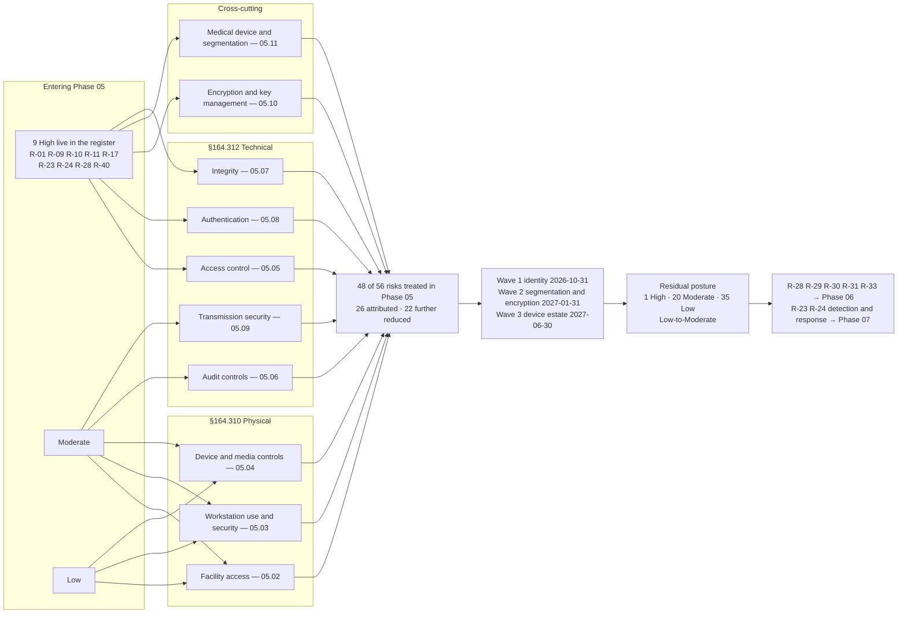

# 05.12 — Control-to-Risk Traceability

| Field | Value |
|---|---|
| Document ID | MBH-PTS-TRC-2026-512 |
| Version | 1.0 |
| Date | 2026-07-15 |
| Classification | Confidential — Electronic Protected Health Information (ePHI) // Illustrative Portfolio Sample |
| Owner | Daniel Cho, Chief Information Security Officer &amp; HIPAA Security Official |
| Co-Owner | Michelle Tran, VP Enterprise Risk (risk register custodian) |
| Author | Advisory Team (Healthcare GRC / HIPAA) |
| Status | Approved |

## Purpose

This is the **proof of work** for Phase 05. It traces every physical safeguard implemented under **45 CFR §164.310** and every technical safeguard implemented under **45 CFR §164.312** back to the specific risks it treats in the **56-risk register** from Phase 03, and forward to the residual rating each risk carries once the treating measure is delivered.

The obligation is **§164.308(a)(1)(ii)(B)**: *"implement security measures sufficient to reduce risks and vulnerabilities to a reasonable and appropriate level."* Sufficiency is a comparative test — measures against risks — and it cannot be argued from a control catalogue alone. This matrix is where MercyBridge shows that the badge readers, the encryption, the MFA, the audit pipeline and the 96 device VLANs were selected because of what the risk analysis found, and not because a vendor sold them.

Phase 04 handed this phase **25 untreated risks plus R-24**, including **all six remaining High risks — R-01, R-09, R-11, R-17, R-24 and R-40**. This document shows each of them closing.

> **Phase 05 traceability: 9 standards · 15 implementation specifications · policies POL-16 … POL-24 · 26 risks attributed to this phase · 22 further reduced from Phase 04 · 48 of 56 risks touched · all 6 handed-over High risks treated.**

## 1. How to Read the Matrix

| Column | Meaning |
|---|---|
| Risk / entering rating | The permanent identifier from 03.07 and the rating carried **into** Phase 05 — the Phase 03 score, or the Phase 04 residual where administrative treatment already moved it |
| Standard / specification | The §164.310 or §164.312 citation whose implementation reduces the risk |
| Control applied | The concrete measure, with the Phase 05 document that delivers it |
| Policy | The governing policy from the completed 24-policy suite |
| Wave | Delivery window from the 03.08 risk management plan |
| Residual | The rating the register will carry once the named wave delivers |

**Rating bands** (unchanged from 03.05): **High** 15–25 · **Moderate** 8–12 · **Low** 1–6.

**Honesty rules carried forward from 04.12.** *Treatment is not closure.* A residual is recorded against the wave that delivers the determinative control, not against the date this document is approved. Where a patient-safety escalation (**ESC-1**, **ESC-2**) floors the impact score at 5, the risk cannot fall below Moderate however well it is mitigated, and it is shown as permanently managed rather than closed. Where the determinative control sits in a later phase — business associate assurance in Phase 06, incident and breach handling in Phase 07 — the risk is passed on with its rating intact rather than discounted here.

## 2. Standard-to-Risk Coverage Summary

| # | Standard | Citation | Specs (R / A) | Doc | Risks treated | Of which entering High |
|---|---|---|---|---|---|---|
| 1 | Facility Access Controls | §164.310(a)(1) | 4 (4 A) | 05.02 | R-16, R-22, R-51, R-52, R-53 | — |
| 2 | Workstation Use | §164.310(b) | standard R | 05.03 | R-07, R-27, R-35, R-38, R-51 | — |
| 3 | Workstation Security | §164.310(c) | standard R | 05.03 | R-02, R-07, R-51 | — |
| 4 | Device and Media Controls | §164.310(d)(1) | 4 (2 R, 2 A) | 05.04 | R-11, R-15, R-16, R-27, R-33, R-44, R-45 | **R-11** |
| 5 | Access Control | §164.312(a)(1) | 4 (2 R, 2 A) | 05.05 | R-02, R-03, R-04, R-05, R-06, R-07, R-11, R-13, R-24, R-32, R-40 | **R-11, R-24, R-40** |
| 6 | Audit Controls | §164.312(b) | standard R | 05.06 | R-02, R-03, R-05, R-13, R-24, R-36, R-46, R-55 | **R-24** |
| 7 | Integrity | §164.312(c)(1) | 1 (1 A) | 05.07 | R-14, R-23, R-42, R-43, R-45, R-46, R-47, R-48 | **R-23** |
| 8 | Person or Entity Authentication | §164.312(d) | standard R | 05.08 | R-01, R-02, R-06, R-13, R-20, R-34, R-39 | **R-01** |
| 9 | Transmission Security | §164.312(e)(1) | 2 (2 A) | 05.09 | R-14, R-18, R-19, R-20, R-21, R-24, R-35, R-38, R-41, R-42 | **R-24** |
| — | Encryption &amp; key management (cross-cutting) | §164.312(a)(2)(iv), (e)(2)(ii) | — | 05.10 | R-11, R-14, R-24, R-28, R-40, R-41, R-42, R-44 | **R-11, R-24, R-28, R-40** |
| — | Medical device &amp; IoMT (NPRM-forward segmentation) | §164.310(d), §164.312 | — | 05.11 | R-06, R-09, R-10, R-11, R-12, R-13, R-14, R-15, R-16, R-17, R-25 | **R-09, R-10, R-11, R-17** |
| | **Distinct risks touched** | | **15 specs** | | **48 of 56** | **9 of 9 live High** |

**Counting notes.**
1. **48 distinct risks**, not the row sum — most risks are treated by more than one standard, which is the point of a defence-in-depth design.
2. **26 risks are *attributed* to Phase 05** (the 25 Phase 04 left untreated, plus R-24) — §3 below. A further **22 already treated in Phase 04 are reduced again here** by technical enforcement — §4 below.
3. **Eight risks are untouched by Phase 05**: R-08, R-26, R-28, R-31, R-37, R-49, R-50, R-56. Five are administratively complete; R-28 and R-31 are business associate risks belonging to **Phase 06**; R-26 and R-49 remain under Phase 04 measurement. **48 + 8 = 56.**

## 3. The Matrix — 26 Risks Attributed to Phase 05

| Risk | Entering rating | Standard / specification | Control applied (document) | Policy | Wave | Residual |
|---|---|---|---|---|---|---|
| **R-01** | **High (16)** | §164.312(d) | MFA extended 44 → **68 of 68** ePHI systems; 7 local-credential paths eliminated; 1,450 phishing-resistant factors; conditional access with step-up (05.08) | POL-21, POL-19 | 1 | **Moderate (8)** |
| **R-09** | **High (16)** | §164.312(a)(1); §164.310(d)(1) + segmentation | Funded lifecycle replacement of unsupported-OS devices; contractual patch cadence; advisory-driven isolation; default-deny egress on 96 device VLANs (05.11) | POL-24, POL-18 | 3 | **Moderate (12)** |
| **R-11** | **High (15)** ESC-1 | §164.312(a)(2)(iv); §164.310(d)(1) | Encryption enabled on 2,240 of 3,170 devices; **ESC-D1** documented alternative for 5 platforms; minimised local retention; witnessed certificated disposal (05.04, 05.10, 05.11) | POL-23, POL-18, POL-24 | 3 | **Moderate (10)** |
| **R-17** | **High (16)** | §164.312(a)(1), (e)(1) + segmentation | Host-based micro-segmentation 41 → **68 of 68**; default-deny east–west; firewall rule recertification; device-zone micro-segmentation (05.09, 05.11) | POL-19, POL-22, POL-24 | 2 | **Moderate (8)** |
| **R-24** | **High (16)** | §164.312(a)(2)(iv), (b), (e)(1) | Encryption at rest 68 of 68; privileged vaulting; scoped service identities; egress control and bulk-export anomaly detection; DLP at Wave 2 (05.05, 05.06, 05.09, 05.10) | POL-23, POL-19, POL-22 | 2 | **Moderate (12)** |
| **R-40** | **High (16)** | §164.312(a)(2)(iv) | Encryption at rest 51 → **68 of 68**; 100% endpoint full-disk encryption; all backup tiers encrypted; HSM-backed key hierarchy with tested escrow — **restores the breach safe harbour** (05.05, 05.10) | POL-23 | 2 | **Moderate (8)** → Low (6) on full-estate attestation |
| R-12 | Moderate (9) | §164.310(d)(1); procurement | MDS2 mandatory at purchase; retrospective collection to 95%; SBOM required under FD&amp;C §524B (05.11) | POL-24 | 3 | Moderate (8) |
| R-13 | Moderate (8) | §164.312(a)(2)(i), (d) | Shared/default device credentials 1,850 → 1,190, target ≤200; per-device certificates where supported; **ESC-D3** alternative elsewhere (05.05, 05.08, 05.11) | POL-19, POL-24 | 3 | Moderate (8) |
| R-14 | Moderate (8) | §164.312(e)(2)(i)–(ii) | **ESC-D2** documented alternative for 118 telemetry devices: isolated VLANs, restricted egress, passive monitoring, integrity checks; replacement funded (05.07, 05.09, 05.11) | POL-22, POL-24 | 3 | Moderate (8) |
| R-18 | Moderate (12) | §164.312(e)(1) | Three flat-VLAN outpatient sites re-architected onto the ten-zone model; IPsec on all SD-WAN paths (05.09) | POL-22 | 2 | Moderate (8) |
| R-19 | Moderate (9) | §164.312(e)(1) | 74 unowned firewall rules recertified or removed; named owner per rule; quarterly review; default-deny reasserted (05.09) | POL-22 | 2 | Moderate (8) |
| R-25 | Moderate (12) | §164.312(b) + endpoint controls | EDR coverage closed on legacy and device-adjacent servers; passive IoMT detection where agents cannot run; SIEM use cases (05.06, 05.11) | POL-20, POL-24 | 1 | Moderate (8) |
| R-29 | Moderate (12) | §164.312(a)(1), (e)(1) | Technical scoping of BA data flows, SFTP identities and landing-zone encryption; **contractual closure is Phase 06** (05.09, 05.10) | POL-22, POL-15 | — | Moderate (12) — **Phase 06** |
| R-30 | Moderate (9) | §164.312(d) | Named entity authentication for hosted integrations; subcontractor visibility is a **Phase 06** contractual matter (05.08) | POL-21, POL-15 | — | Moderate (9) — **Phase 06** |
| R-41 | Moderate (12) | §164.312(a)(2)(iv), (e)(1) | Automated ePHI discovery scoped with the encryption programme; discovered repositories encrypted or removed; egress visibility (05.09, 05.10) | POL-23, POL-22 | 2 | Moderate (8) |
| R-42 | Moderate (9) | §164.312(e)(2)(ii) | TLS 1.2+ enforced estate-wide, 60 → **68 of 68**; deprecated protocols removed; monthly posture scanning (05.09, 05.10) | POL-22, POL-23 | 2 | Moderate (8) |
| R-44 | Moderate (8) | §164.310(d)(2)(i)–(ii) | NIST SP 800-88 sanitisation with certificates and serial-level manifests; cryptographic erase as the primary path; annual vendor witness audit (05.04, 05.10) | POL-18, POL-23 | 2 | **Low (4)** |
| R-07 | Low (6) | §164.312(a)(2)(iii); §164.310(b)–(c) | Tiered inactivity standard by clinical area enforced at OS, VDI, application, network and kiosk layers; monthly drift reporting (05.03, 05.05) | POL-17, POL-19 | 1 | **Low (2)** |
| R-15 | Low (6) | §164.310(d)(2)(iii) | Custodian assignment and movement accountability; NAC profiling remediation to ≥99% (05.04, 05.11) | POL-18, POL-24 | 3 | **Low (4)** |
| R-16 | Low (4) | §164.310(a)(2)(iii), (d)(1) | Vendor escort, media scanning kiosk, CMMS record of media serial and scan result (05.02, 05.04, 05.11) | POL-16, POL-18 | 1 | **Low (2)** |
| R-20 | Moderate (8) | §164.312(d), (e)(1) | Split-tunnel exception **withdrawn**; legacy coding tools re-platformed onto inspected VDI behind MFA — treatment is avoidance (05.08, 05.09) | POL-22, POL-21 | 1 | **Low (4)** |
| R-21 | Low (6) | §164.312(e)(1) | WPA3/WPA2-Enterprise with EAP-TLS; guest fully isolated; SSID-to-VLAN-to-zone verification in every site survey (05.09) | POL-22 | 2 | **Low (4)** |
| R-22 | Low (4) | §164.310(a)(1) | Badge-controlled IDFs at all sites; quarterly physical walkdown; port audit tied to NAC (05.02) | POL-16 | 1 | **Low (2)** |
| R-27 | Low (6) | §164.310(b), (d)(1) | Default write-block; encrypted-only media issue; media register; SIEM telemetry (05.03, 05.04) | POL-17, POL-18 | 1 | **Low (2)** |
| R-33 | Low (4) | §164.310(d)(2)(i) | Certificate-of-destruction standard extended contractually to BAs; **exit evidence executed in Phase 06** (05.04) | POL-18, POL-15 | — | Low (4) — **Phase 06** |
| R-45 | Low (6) | §164.310(d)(1); §164.312(c)(1) | Disposal triggered by the 02.09 retention schedule; audited deletion with legal-hold protection (05.04, 05.07) | POL-18, POL-14 | 2 | **Low (4)** |

## 4. Risks Treated in Phase 04 and Further Reduced Here

Administrative treatment set the intent; technical and physical safeguards enforce it. These 22 risks carry a **new, lower residual** because of Phase 05.

| Risk | Rating entering Phase 05 | Phase 05 control | Residual |
|---|---|---|---|
| **R-23** | **High (15)** ESC-2 | Integrity verification of restored data before clinical reconnection; EDR closure; segmentation; immutable backup verification (05.06, 05.07, 05.09) | **Moderate (10)** at Wave 1/2 — impact floored at 5 by ESC-2 |
| **R-10** | **High (15)** ESC-1 | Device-zone micro-segmentation; flat-VLAN sites re-architected; IoMT anomaly detection tuned to clinical baselines (05.11) | **Moderate (10)** at Wave 3 |
| R-02 | Moderate (12) | Shared clinical accounts 96 → 21 → **0**; SSO federation 51 → 68; badge tap + PIN on 3,550 endpoints (05.03, 05.05, 05.08) | **Low (6)** |
| R-03 | Moderate (8) | 214 → 63 elevated EHR accounts enforced technically; just-in-time vaulted check-out; session recording; weekly sampled review (05.05, 05.06) | **Low (6)** |
| R-04 | Low (6) | Automated deprovisioning enforced across all 68 systems on the JML trigger (05.05) | **Low (2)** |
| R-05 | Low (6) | Break-the-glass with attestation; **100%** retrospective review within 72 hours, dispositions logged (05.05, 05.06) | **Low (2)** |
| R-06 | Moderate (8) | Brokered just-in-time vendor access with MFA at the broker; no standing VPN; recorded sessions across 742 paths (05.05, 05.08, 05.11) | **Low (6)** |
| R-32 | Low (6) | Scoped, time-bounded offshore identities; data-set reduction enforced technically (05.05, 05.08) | Low (4) — monitored in **Phase 06** |
| R-34 | Moderate (9) | MFA on webmail and all internet-facing surfaces; number matching; legacy authentication blocked; impossible-travel policy (05.08) | **Low (6)** |
| R-35 | Moderate (9) | Portal-first patient communication; enforced encryption gateway; Direct in place of fax; clear-screen and secure-release printing (05.03, 05.09) | Moderate (9) — outbound DLP at Wave 2 |
| R-36 | Moderate (8) | Behavioural privacy monitoring with 11 rule families and care-relationship suppression; daily triage; sanction linkage (05.06) | **Low (6)** |
| R-38 | Low (4) | Sanctioned-channel standard; portal and Direct as supported alternatives; prohibition with sanction linkage (05.03, 05.09) | **Low (4)** |
| R-39 | Low (2) | Factor addition requires an existing factor; privileged resets approved and logged (05.08) | **Low (2)** |
| R-43 | Moderate (9) ESC-3 | HL7 and DICOM interface validation; daily count reconciliation; EMPI overlay queue; amendment audit trail (05.07) | **Low (6)** |
| R-46 | Low (4) | SIEM treated as a Tier 1 ePHI system; non-production data handling standard; deletion auditing (05.06, 05.07) | **Low (2)** |
| R-47 | Moderate (8) | Integrity verification added to the annual full-scale restoration test; weekly sampled restores with application-level checks (05.07) | **Low (6)** |
| R-48 | Moderate (8) | Verification hashes on every backup job; immutability extension tracked to Wave 2 (05.07) | **Low (6)** at Wave 2 |
| R-51 | Moderate (9) | Tiered inactivity lock standard; tap-and-go; privacy filters; 412 monitor repositions; observation rounds (05.02, 05.03) | **Low (6)** |
| R-52 | Low (6) | Anti-passback in Zone 2; 19 IDF badge conversions; door-held alarms on 96 closets; quarterly observation rounds (05.02) | **Low (4)** |
| R-53 | Low (4) | Environmental monitoring; generator and UPS as critical load; dual-site model; contingency access procedure (05.02) | **Low (2)** |
| R-54 | Low (6) | **POL-16 … POL-24 approved 2026-07-15 — the 24-policy suite is complete** (all Phase 05 documents) | **Low (2)** — closed |
| R-55 | Low (4) | SIEM ingestion 49 → 62 → **68 of 68**; evidenced activity review for all 68 systems (05.06) | **Low (2)** |

## 5. The Six Handed-Over High Risks — Closing Statement

| Risk | Entering | Determinative control delivered in Phase 05 | Wave / date | Residual | Closed? |
|---|---|---|---|---|---|
| **R-01** MFA on only 44 of 68 systems | High (16) | Person or entity authentication §164.312(d): MFA on **68 of 68**, phishing-resistant factors, no local-credential path | Wave 1 — 2026-10-31 | **Moderate (8)** | Yes — technically closed |
| **R-40** ePHI at rest unencrypted on 17 of 68 systems | High (16) | Encryption at rest §164.312(a)(2)(iv): **68 of 68**, 100% endpoint FDE, HSM key hierarchy — **safe harbour restored** | Wave 2 — 2027-01-31 | **Moderate (8)** → Low (6) | Yes — technically closed |
| **R-24** Double-extortion exfiltration | High (16) | Encryption, privileged vaulting, egress control, bulk-export anomaly detection, DLP | Wave 2 — 2027-01-31 | **Moderate (12)** | Treated; detection and response mature in **Phase 07** |
| **R-17** Lateral movement, incomplete micro-segmentation | High (16) | Micro-segmentation 41 → **68 of 68**; default-deny east–west; firewall recertification | Wave 2 — 2027-01-31 | **Moderate (8)** | Yes — technically closed |
| **R-09** Unsupported-OS devices with known exploited vulnerabilities | High (16) | Lifecycle replacement, contractual patch cadence, segmentation across **96 device VLANs** | Wave 3 — 2027-06-30 | **Moderate (12)** | Structurally permanent; permanently managed |
| **R-11** Unencryptable ePHI on 3,170 devices (ESC-1) | High (15) | Encryption where capable; **ESC-D1** documented alternative; witnessed certificated disposal | Wave 3 — 2027-06-30 | **Moderate (10)** | ESC-1 floor; permanently managed |

**All six are treated, and none is left unaddressed.** Two — R-09 and R-11 — cannot fall below Moderate because their impact is floored by the patient-safety escalation rules and their root cause (an FDA-cleared, vendor-frozen device estate) is structural. Saying so is the correct answer, and it is the position MercyBridge will defend to an assessor rather than a claim of closure the evidence would not support.

## 6. Residual Posture Across All 56 Risks

| Band | Phase 03 baseline | After Phase 04 | **After Phase 05 waves deliver** | Movement across Phase 05 |
|---|---|---|---|---|
| **High** (15–25) | 11 | 9 | **1** | −8 |
| **Moderate** (8–12) | 27 | 26 | **20** | −6 |
| **Low** (1–6) | 18 | 21 | **35** | +14 |
| **Total** | 56 | 56 | 56 | Register size unchanged |
| **Overall posture** | Moderate | Moderate | **Low-to-Moderate** | As forecast in 03.08 |

**Zero High risks remain among those Phase 05 can technically close.** The nine High risks live in the register at the start of this phase — R-01, R-09, R-10, R-11, R-17, R-23, R-24, R-28, R-40 — reduce to **one**:

| Remaining High | Why it survives Phase 05 | Where it closes |
|---|---|---|
| **R-28 (15)** — compromise or extended outage of the vendor-hosted Halcyon EHR holding 2.1M records (ESC-2) | No technical control inside MercyBridge's perimeter can reduce it. Its determinative measures are contractual and assurance-based: tested BA obligations, independent restoration assurance, strengthened notification and audit rights, and the key-custody question raised in 05.10 §5 | **Phase 06** — Business Associate &amp; Third-Party Risk |

**Carried onward to Phases 06 and 07:**

| Risk | Residual entering the next phase | Owner | Closing phase |
|---|---|---|---|
| R-28 — hosted-EHR concentration | High (15) | Daniel Cho | Phase 06 |
| R-29 — three BAAs under remediation | Moderate (12) | Lisa Coleman | Phase 06 |
| R-30 — subcontractor chain unvisible for nine services | Moderate (9) | Lisa Coleman | Phase 06 |
| R-31 — BA breach notice too late for the 60-day duty | Moderate (8) | Lisa Coleman | Phase 06 → Phase 07 |
| R-32 — offshore support exceeds minimum necessary | Low (4) | Lisa Coleman | Phase 06 |
| R-33 — data return and certified deletion at exit unevidenced | Low (4) | Lisa Coleman | Phase 06 |
| R-23 — enterprise ransomware (ESC-2) | Moderate (10) | Daniel Cho | Detection, IR and tabletop — Phase 07 |
| R-24 — double-extortion exfiltration | Moderate (12) | Daniel Cho | Four-factor assessment and notification readiness — Phase 07 |

**Reconciliation.** 26 attributed + 22 further reduced = **48 touched**; plus **8 untouched** (R-08, R-26, R-28, R-31, R-37, R-49, R-50, R-56, carrying their Phase 04 residuals) = **56**. The post-Phase-05 profile of **1 High / 20 Moderate / 35 Low** converges on the 03.08 target profile of 0 / 23 / 33 once Phase 06 closes the business associate set; the band differences are timing, and are reconciled at the annual re-analysis under 03.10.

## 7. Policy Coverage Check — the 24-Policy Suite

| Policy | Title | Standards | Risks it governs |
|---|---|---|---|
| POL-16 | Facility Access Controls &amp; Physical Security | §164.310(a)(1)–(a)(2) | R-16, R-22, R-52, R-53 |
| POL-17 | Workstation Use &amp; Workstation Security | §164.310(b), (c) | R-07, R-27, R-35, R-38, R-51 |
| POL-18 | Device &amp; Media Controls, Disposal &amp; Re-use | §164.310(d)(1); NIST SP 800-88 | R-11, R-15, R-27, R-33, R-44, R-45 |
| POL-19 | Technical Access Control &amp; Unique User Identification | §164.312(a)(1)–(a)(2) | R-02, R-03, R-04, R-06, R-07, R-13, R-17, R-24, R-40 |
| POL-20 | Audit Controls &amp; Log Management | §164.312(b) | R-25, R-36, R-46, R-55 |
| POL-21 | Data Integrity &amp; Person or Entity Authentication | §164.312(c)(1); §164.312(d) | R-01, R-20, R-30, R-34, R-39, R-43, R-47, R-48 |
| POL-22 | Transmission Security | §164.312(e)(1)–(e)(2) | R-14, R-18, R-19, R-21, R-29, R-38, R-41, R-42 |
| POL-23 | Encryption &amp; Key Management | §164.312(a)(2)(iv); §164.312(e)(2)(ii) | R-11, R-24, R-40, R-41, R-42, R-44 |
| POL-24 | Medical Device &amp; IoMT Security | §164.310(d); §164.312 | R-06, R-09, R-10, R-11, R-12, R-13, R-14, R-15 |

**With POL-16 … POL-24 approved on 2026-07-15, the 24-policy suite is complete and R-54 closes.** Every risk in §3 and §4 has a named governing policy; no risk is treated by a control that no policy authorises.

## 8. Assurance Over the Matrix

| Assurance layer | Activity | Owner | Timing |
|---|---|---|---|
| First line | Control owners attest that the mapped measure is operating as described | Named owners in §3 and §4 | Quarterly |
| First line | Wave delivery tracking against 2026-10-31, 2027-01-31 and 2027-06-30 | Marcus Reed / Anthony Ruiz | Monthly |
| Second line | Register reconciliation — every treated risk has evidenced measures | Michelle Tran | Quarterly |
| Second line | Evaluation of the mapping against §164.310 and §164.312 | Daniel Cho / Marcus Reed | Annual — 04.09 |
| Second line | Medical Device Security Committee review of ESC-D1 to ESC-D5 | Dr. Samuel Ortega | Annual, and on any firmware release |
| Third line | Internal audit tests a sample of mappings to source evidence | Priya Anand | 2026 Q4 |
| Independent | Penetration test against access, authentication, transmission and segmentation | Ironwood Security Labs | 2026 Q3 — Phase 08 |
| Independent | HITRUST i1 validated assessment and OCR Audit Protocol walkthrough | Beacon Assurance | 2026 Q4 — Phase 08 |
| Board | Residual position, wave progress and every open §164.306(d)(3) exception | Robert Feldman | Quarterly |

## Cross-References

| Reference | Relevance |
|---|---|
| 03.05 — Likelihood, Impact &amp; Risk Determination | The scoring model and ESC-1 to ESC-3 escalations used for every residual |
| 03.07 — Risk Register | The authoritative 56-risk source for every row above |
| 03.08 — Risk Management Plan | Wave 1–3 sequencing, owners, target residuals and board-approved exceptions |
| 04.12 — Control-to-Risk Traceability | The 25 untreated risks plus R-24 handed to this phase, and the 31 treated administratively |
| 05.01 — Physical &amp; Technical Safeguards Overview | The 9 standards and 15 specifications traced here |
| 05.02 → 05.11 | The instruments named in every row of the matrix |
| 05.13 — Phase Summary &amp; Transition | Phase closure built on this traceability |
| Phase 06 — Business Associate &amp; Third-Party Risk | R-28, R-29, R-30, R-31, R-32, R-33 |
| Phase 07 — Incident Response &amp; Breach Notification | R-23 and R-24 detection, response and notification readiness |
| Phase 08 — HITRUST &amp; Independent Assessment | Independent testing of these mappings |
| Phase 09 — Executive Reporting &amp; Programme Maturity | The residual trajectory to Low-to-Moderate |

---
[⬅ Previous](05.11-medical-device-security-controls.md) · [🏠 Phase README](05.00-README.md) · [Next ➡](05.13-phase-summary-and-transition.md)
