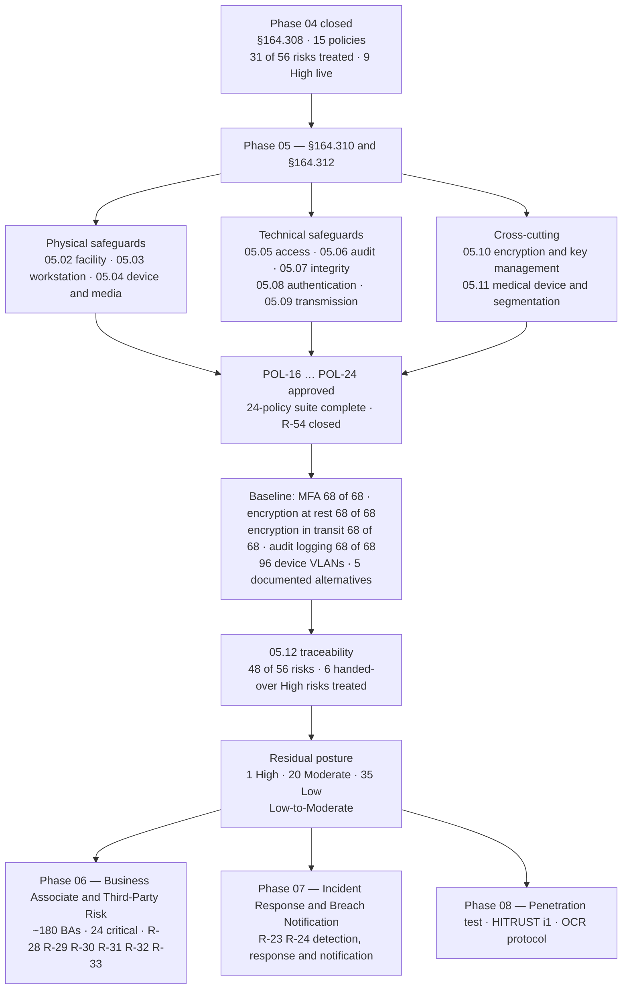

# 05.13 — Phase Summary &amp; Transition

| Field | Value |
|---|---|
| Document ID | MBH-PTS-SUM-2026-513 |
| Version | 1.0 |
| Date | 2026-07-15 |
| Classification | Confidential — Electronic Protected Health Information (ePHI) // Illustrative Portfolio Sample |
| Owner | Daniel Cho, Chief Information Security Officer &amp; HIPAA Security Official |
| Co-Owner | Anthony Ruiz, Chief Information Officer |
| Author | Advisory Team (Healthcare GRC / HIPAA) |
| Status | Approved |

## Purpose

This document closes **Phase 05 — Physical &amp; Technical Safeguards**. It records what was delivered against **45 CFR §164.310** and **§164.312**, confirms the control baseline the Network now operates, states the risk position leaving the phase, lists what remains open, and hands over formally to **Phase 06 — Business Associate &amp; Third-Party Risk**.

Phase 04 built the management system. Phase 05 built the mechanisms that make it observable: the badge reader, the sanitisation certificate, the unique account, the second factor, the TLS handshake, the encrypted volume, the isolated device VLAN. With this phase approved, **all 18 standards of the HIPAA Security Rule are implemented**, **all ~50 implementation specifications are addressed**, and the **24-policy suite is complete**.

> **Phase 05 closed 2026-07-15: 9 standards · 15 implementation specifications (4 required, 11 addressable — all 11 implemented) · 12 documents · policies POL-16 … POL-24 · 48 of 56 risks touched · all 6 handed-over High risks treated · residual posture Low-to-Moderate on wave completion.**

## 1. What Phase 05 Delivered

| Document | Standard(s) | Principal outputs |
|---|---|---|
| 05.00 | — | Phase README, scope and structure |
| 05.01 | All nine | Safeguards overview; standard-to-document map; NPRM readiness position; ADR-0010 addressable determination |
| 05.02 | §164.310(a)(1) | Facility security plan; badge and visitor management; anti-passback in Zone 2; 19 IDF badge conversions; door-held alarms on 96 closets; maintenance records |
| 05.03 | §164.310(b), (c) | Workstation use standard; tiered inactivity intervals by clinical area; tap-and-go on 3,550 clinical endpoints; privacy filters; 412 monitor repositions |
| 05.04 | §164.310(d)(1) | NIST SP 800-88 disposal and re-use; chain of custody; encrypted-only removable media; leased imaging equipment return |
| 05.05 | §164.312(a)(1) | Unique user identification; break-the-glass with 100% review; automatic logoff at five layers; encryption at rest; 214 → 63 elevated EHR accounts |
| 05.06 | §164.312(b) | Audit log coverage 49 → 62 → **68 of 68**; SIEM use cases; VIP and coworker-record monitoring; retention and proactive review |
| 05.07 | §164.312(c)(1) | HL7 and DICOM interface validation; daily count reconciliation; EMPI overlay queue; backup verification; amendment audit trail |
| 05.08 | §164.312(d) | **MFA 44 → 68 of 68**; phishing-resistant factors for 1,450 identities; badge tap + PIN clinical design; entity authentication; EPCS identity proofing |
| 05.09 | §164.312(e)(1) | **Encryption in transit 60 → 68 of 68**; HL7, DICOM and FHIR interface security; Direct secure messaging; patient email; SFTP and AS2 partner transfer; VPN and wireless |
| 05.10 | §164.312(a)(2)(iv), (e)(2)(ii) | Enterprise cryptographic standard; **encryption at rest 51 → 68 of 68**; HSM/KMS key lifecycle; vendor-hosted EHR key custody analysis; the **breach safe harbour** case |
| 05.11 | §164.310(d), §164.312 | 6,120-device fleet controls; **96 device VLANs**; MDS2 and FD&amp;C §524B procurement standard; vendor patch dependency; ESC-D1 to ESC-D5 documented alternatives |
| 05.12 | — | Control-to-risk traceability; 48 of 56 risks; all six handed-over High risks closing |
| **05.13** | — | This summary and the handover to Phase 06 |

## 2. Conformance Confirmation — All Nine Standards

| # | Standard | Citation | Specs | Position | Delivered by |
|---|---|---|---|---|---|
| 1 | Facility Access Controls | §164.310(a)(1) | 4 addressable | **Implemented** — all four | 05.02 |
| 2 | Workstation Use | §164.310(b) | standard required | **Implemented** | 05.03 |
| 3 | Workstation Security | §164.310(c) | standard required | **Implemented** | 05.03 |
| 4 | Device and Media Controls | §164.310(d)(1) | 2 required, 2 addressable | **Implemented** — all four | 05.04 |
| 5 | Access Control | §164.312(a)(1) | 2 required, 2 addressable | **Implemented** — all four | 05.05, 05.10 |
| 6 | Audit Controls | §164.312(b) | standard required | **Implemented** | 05.06 |
| 7 | Integrity | §164.312(c)(1) | 1 addressable | **Implemented** | 05.07 |
| 8 | Person or Entity Authentication | §164.312(d) | standard required | **Implemented** | 05.08 |
| 9 | Transmission Security | §164.312(e)(1) | 2 addressable | **Implemented** — both | 05.09, 05.10 |

**All 11 addressable specifications in the two families are implemented.** Five narrow, documented **§164.306(d)(3)(ii)(B)** determinations exist — ESC-D1 to ESC-D5 in 05.11 — each naming the specification, the reason, an equivalent alternative measure, a review date and an exit plan, each signed by the Security Official and visible to the Board. Nothing is addressed by silence.

**Rule-wide position.** §164.308 (9 standards, 21 specifications) closed in Phase 04; §164.310 and §164.312 (9 standards, 15 specifications) close here; §164.314 organisational requirements are executed in Phase 06 and §164.316 documentation closed in Phase 04. **The 18 standards and ~50 implementation specifications baselined in 01.04 are complete.**

## 3. Baseline Confirmed

| Control | Baseline (2026 Q1) | Standard set in Phase 05 | Delivery |
|---|---|---|---|
| **MFA on ePHI systems** | 44 of 68 | **68 of 68** | Wave 1 — 2026-10-31 |
| **Encryption at rest on ePHI systems** | 51 of 68 | **68 of 68** | Wave 2 — 2027-01-31 |
| **Encryption in transit on ePHI systems** | 60 of 68 | **68 of 68** | Wave 2 — 2027-01-31 |
| **Audit logging / SIEM ingestion** | 49 of 68 | **68 of 68** | Wave 1–2 (62 of 68 achieved in Phase 04) |
| Endpoint full-disk encryption | 96% of 8,065 | **100%** | Achieved |
| SSO federation of ePHI systems | 51 of 68 | 68 of 68; zero local-credential paths | Wave 1 |
| Shared / generic clinical accounts | 96 | **0** | Wave 1 |
| Standing elevated EHR accounts | 214 | **63**, recertified quarterly | Achieved |
| Micro-segmentation of ePHI systems | 41 of 68 | 68 of 68, default-deny east–west | Wave 2 |
| **Medical device VLANs** | **96** | **96** maintained, class-level micro-segmentation added | Wave 3 |
| Devices with shared / default credentials | ~1,850 | ≤200 | Wave 3 |
| MDS2 coverage of the 6,120-device fleet | 4,284 (70%) | 95% | 2026-12-31 |
| Break-glass invocations reviewed within 72 hours | ~40% sampled | **100%** | Achieved |
| Deprecated TLS versions in the ePHI estate | 6 endpoints | **0** | Achieved |
| Documented §164.306(d)(3) alternatives | Undocumented practice | **5**, signed and board-visible | Achieved |
| **HIPAA policy suite** | Legacy, incomplete | **24 of 24 approved** | Achieved 2026-07-15 |

**Policy suite complete.** POL-16 Facility Access Controls · POL-17 Workstation Use &amp; Security · POL-18 Device &amp; Media Controls · POL-19 Technical Access Control · POL-20 Audit Controls &amp; Log Management · POL-21 Data Integrity &amp; Authentication · POL-22 Transmission Security · POL-23 Encryption &amp; Key Management · POL-24 Medical Device &amp; IoMT Security — approved **2026-07-15**, completing the 24-policy suite and closing **R-54**.

**2025 NPRM readiness.** The four controls the proposed rule would make mandatory — **encryption at rest, encryption in transit, multi-factor authentication and network segmentation** — are each implemented to a 68-of-68 (or full-estate) standard on a dated schedule, with asset inventory and network map delivered in Phase 02 and annual penetration testing engaged for Phase 08. If the NPRM is finalised in its proposed form, MercyBridge has no remediation project to start.

## 4. Risk Position Leaving Phase 05

| Band | Phase 03 baseline | Leaving Phase 04 | **Leaving Phase 05 (on wave completion)** |
|---|---|---|---|
| High | 11 | 9 | **1** |
| Moderate | 27 | 26 | **20** |
| Low | 18 | 21 | **35** |
| Overall posture | Moderate | Moderate | **Low-to-Moderate** |

**The six High risks handed over by Phase 04 are all treated:** R-01 (MFA) → Moderate (8); R-40 (encryption at rest) → Moderate (8), trending Low; R-24 (exfiltration) → Moderate (12); R-17 (segmentation) → Moderate (8); R-09 (unsupported device OS) → Moderate (12); R-11 (unencryptable device ePHI) → Moderate (10). Two Phase 04 High risks also fall: R-23 (ransomware) → Moderate (10) and R-10 (device VLAN malware) → Moderate (10).

**One High risk remains: R-28** — compromise or extended outage of the vendor-hosted Halcyon EHR holding 2.1 million records. No technical control inside MercyBridge's perimeter reduces it, and Phase 05 says so rather than manufacturing a reduction. It is the opening item of Phase 06.

## 5. Open Items Leaving Phase 05

| # | Item | Nature | Owner | Due |
|---|---|---|---|---|
| O-1 | Wave 1 delivery: MFA to 68 of 68; shared clinical accounts to 0; SSO federation complete | Delivery in flight | Marcus Reed | 2026-10-31 |
| O-2 | Wave 2 delivery: encryption at rest and in transit to 68 of 68; micro-segmentation to 68 of 68; DLP and ePHI discovery | Board-approved time-bounded exception | Daniel Cho / Anthony Ruiz | 2027-01-31 |
| O-3 | Wave 3 delivery: device lifecycle replacement, credentials to ≤200, class-level device micro-segmentation, telemetry replacement | Board-approved time-bounded exception | Anthony Ruiz | 2027-06-30 |
| O-4 | MDS2 coverage from 70% to 95% across the 6,120-device fleet | Evidence gap | Dr. Samuel Ortega | 2026-12-31 |
| O-5 | Annual review of documented alternatives ESC-D1 to ESC-D5 | Standing obligation | Daniel Cho | Annual, and on firmware release |
| O-6 | Halcyon customer-managed key option evaluated at contract renewal | Contractual | Lisa Coleman / Daniel Cho | FY2027 renewal — **Phase 06** |
| O-7 | Three flat-VLAN outpatient sites re-architected | Delivery | Anthony Ruiz | Wave 2 |
| O-8 | Annual escrow restoration test integrated with the contingency exercise | Standing obligation | Marcus Reed | Annual |
| O-9 | Outbound DLP tuning to reduce R-35 misdirected disclosure | Delivery | Rebecca Stern / Marcus Reed | Wave 2 |
| O-10 | Independent validation of Phase 05 controls | Assurance | Priya Anand / Beacon Assurance / Ironwood Security Labs | **Phase 08**, 2026 Q3–Q4 |

Every open item has a named owner and a date. None is a blocker to Phase 06.

## 6. Handover to Phase 06 — Business Associate &amp; Third-Party Risk

Phase 05 secured what MercyBridge controls directly. **Phase 06 addresses what it does not.** The Network's single largest ePHI concentration — 2.1 million records — sits with a business associate, and roughly **180 business associates**, of which **24 are critical or high-risk**, create, receive, maintain or transmit ePHI on its behalf. Under **§164.308(b)(1)**, **§164.314(a)** and HITECH, MercyBridge remains liable to individuals and to OCR for that ePHI regardless of who holds it.

| Handover item | What Phase 05 provides | What Phase 06 must do |
|---|---|---|
| **R-28** — hosted-EHR concentration | Key-custody analysis (05.10 §5); independent MercyBridge-keyed backup; Halcyon audit log ingestion; tested downtime capability | Tested BA assurance, independent restoration evidence, strengthened notification and audit rights, board-visible concentration position |
| R-29, R-30, R-31, R-32, R-33 | Technical scoping of BA data flows, SFTP identities, landing-zone encryption, scoped external identities, destruction-certificate standard | BAA remediation, subcontractor chain visibility, 5-day notice clock, offshore access review, exit evidence |
| Encryption and key custody at BAs | The enterprise cryptographic standard (POL-23) as the contractual benchmark | Verify encryption and key custody per BA; require customer-managed keys where available |
| Transmission security with partners | TLS, mutual TLS, SFTP, AS2, Direct and HISP standards (05.09) | Contractual transmission terms; partner attestation; HISP trust-bundle review |
| Vendor remote access | Brokered, just-in-time, recorded access across 742 device paths (05.05, 05.08, 05.11) | Contractual access limits and monitoring obligations |
| Medical device vendors | MDS2, SBOM, §524B and patch-cadence procurement clauses (05.11) | Flow the clauses into renewals for the 11 manufacturers covering 78% of the fleet |
| Audit evidence | Encryption, MFA, logging and segmentation coverage reports as the internal benchmark | Compare BA control assertions against the internal baseline rather than accepting them in isolation |
| Documented alternatives | ESC-D1 to ESC-D5 | Ensure no BA relies on an undocumented equivalent |

**Phase 07** receives R-23 and R-24 for detection, response, four-factor breach assessment and notification readiness. **Phase 08** independently validates everything delivered here through penetration testing, internal audit and the HITRUST i1 validated assessment.

## 7. Phase Closure Statement

| Criterion | Evidence | Status |
|---|---|---|
| All four §164.310 standards implemented | 05.02, 05.03, 05.04 | **Met** |
| All five §164.312 standards implemented | 05.05 – 05.09, supported by 05.10 and 05.11 | **Met** |
| All 15 implementation specifications addressed; all 11 addressable implemented | 05.01 §6; ADR-0010 | **Met** |
| Every §164.306(d)(3) determination documented, dated and signed | ESC-D1 to ESC-D5; 05.11 §7 | **Met** |
| Policies POL-16 … POL-24 approved; 24-policy suite complete | 05.12 §7; signature pages held by Karen Boyd | **Met** |
| Every implemented control traced to a risk in the 56-risk register | 05.12 §3, §4 | **Met** |
| All six High risks handed over by Phase 04 treated | 05.12 §5 | **Met** |
| Residual posture re-scored and reconciled to 56 risks | 05.12 §6 | **Met** |
| Evidence retained for six years under §164.316(b)(2)(i) | Evidence registers in 05.02 – 05.11 | **Met** |
| Open items owned and dated | §5 above | **Met** |

**Phase 05 is closed.** The physical and technical safeguards of the HIPAA Security Rule are implemented at MercyBridge Health Network, the 24-policy suite is complete, the control baseline is documented and measurable, and the residual risk position is **Low-to-Moderate** on completion of the board-approved remediation waves. Approved by **Daniel Cho, Chief Information Security Officer and HIPAA Security Official**, on **2026-07-15**, and reported to the Board Audit &amp; Compliance Committee.

## Cross-References

| Reference | Relevance |
|---|---|
| 01.04 — HIPAA Security Rule Overview | The 18 standards and ~50 specifications now complete |
| 02.02 — ePHI System Inventory | The 68 systems that form every coverage denominator |
| 02.04 — Medical Devices &amp; IoMT | The 6,120-device fleet and 96 device VLANs |
| 03.07 — Risk Register | The 56 risks re-scored in 05.12 |
| 03.08 — Risk Management Plan | Wave 1–3 windows and board-approved exceptions |
| 04.13 — Phase Summary &amp; Transition | The administrative baseline this phase enforces technically |
| 05.01 — Physical &amp; Technical Safeguards Overview | The phase scope this document closes |
| 05.02 → 05.11 | The implementation documents summarised here |
| 05.12 — Control-to-Risk Traceability | The evidence base for the residual position |
| Phase 06 — Business Associate &amp; Third-Party Risk | The next phase; ~180 BAs, 24 critical, R-28 to R-33 |
| Phase 07 — Incident Response &amp; Breach Notification | R-23 and R-24; the safe harbour applied to real events |
| Phase 08 — HITRUST &amp; Independent Assessment | Independent validation of every control delivered here |
| Phase 09 — Executive Reporting &amp; Programme Maturity | The residual trajectory and board reporting line |

---
[⬅ Previous](05.12-control-to-risk-traceability.md) · [🏠 Phase README](05.00-README.md) · [Next ➡](../06-business-associate-third-party-risk/06.00-README.md)
