# Diagram — Technical Control Coverage

| Field | Value |
|---|---|
| Version | 1.0 |
| Date | 2026-07-15 |
| Classification | Confidential — Electronic Protected Health Information (ePHI) // Illustrative Portfolio Sample |
| Organization | MercyBridge Health Network (HIPAA covered entity) |
| Regulator | HHS Office for Civil Rights (OCR) |
| Phase | 05 — Physical & Technical Safeguards |
| Author | Advisory Team (Healthcare GRC / HIPAA) |
| Status | Approved |

```mermaid
xychart-beta
    title "Coverage across the 68 ePHI systems"
    x-axis ["MFA", "Encrypt at rest", "Encrypt in transit", "Audit logging"]
    y-axis "Systems" 0 --> 68
    bar [44, 51, 60, 49]
    bar [68, 68, 68, 68]
```

First series = baseline at Phase 03; second series = end of Phase 05.

## Cross-References
`05.13-phase-summary-and-transition.md`.
