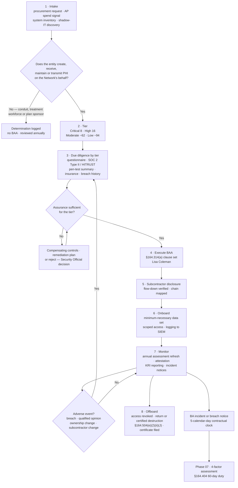

# 06.01 — Business Associate Program Overview

| Field | Value |
|---|---|
| Document ID | MBH-BAA-PGM-2026-601 |
| Version | 1.0 |
| Date | 2026-07-15 |
| Classification | Confidential — Electronic Protected Health Information (ePHI) // Illustrative Portfolio Sample |
| Owner | Karen Boyd, Chief Compliance Officer (programme owner) |
| Co-Owner | Lisa Coleman, General Counsel (Business Associate Agreements) · Daniel Cho, CISO &amp; HIPAA Security Official (security assessment) |
| Author | Advisory Team (Healthcare GRC / HIPAA) |
| Status | Approved |

## Purpose

This document establishes the MercyBridge Health Network **Business Associate and Third-Party Risk Programme** — the discipline by which the Network governs the approximately **180 business associates** that create, receive, maintain or transmit its electronic protected health information, of which **24 are classified critical or high-risk**.

Phase 04 delivered the *contract*. §164.308(b)(1) requires satisfactory assurances documented in writing, and 04.10 produced them. This phase delivers the *assurance itself*: who the business associates are, how they are tiered, what evidence is demanded of each tier, how the subcontractor chain below them is governed, how cloud providers are treated, and what happens when the evidence does not arrive. A signed agreement is a promise. A programme is what tests the promise.

This is also the phase in which the Network's **last remaining High risk** is treated. **R-28** — compromise or extended outage of the vendor-hosted **Halcyon Health EHR**, which holds the entire **2.1 million-record** clinical archive — scored **likelihood 3 × impact 5 = 15** and survived Phase 05 intact because, as 05.12 recorded, no technical control inside MercyBridge's own perimeter can reduce it. Its determinative measures are contractual and assurance-based, and they are built here.

## 1. Why Business Associate Management Is a HIPAA Discipline of Its Own

In most industries third-party risk is a procurement hygiene topic. In healthcare it is a **regulatory obligation with its own standard, its own required contract clauses, its own liability regime and its own enforcement history**.

| Feature | General vendor risk management | HIPAA business associate management |
|---|---|---|
| Legal trigger | Contractual and commercial | Statutory — §164.308(b)(1), §164.314(a), §164.502(e) |
| Written agreement | Optional, negotiated | **Mandatory**, with prescribed content |
| Vendor's own liability to the regulator | None | **Direct liability under HITECH** for the Security Rule and breach notification |
| Covered entity's residual liability | Reputational and contractual | **Retained** — the CE remains accountable for its own risk analysis and notification duties |
| Downstream parties | Usually out of contractual reach | **Subcontractors of a BA are themselves BAs** and require their own BAAs |
| Regulator's audit right | None | HHS may demand the BA's internal practices, books and records |
| Failure to hold an agreement | A commercial defect | An **independent violation**, enforceable even with no breach of data |

That last row is the one that makes this a distinct discipline. OCR has resolved matters where the only substantive failure was the **absence of a business associate agreement** — no ransomware, no exfiltration, no complaint about care. The document itself is the control.

## 2. The Regulatory Basis

| Citation | Requirement | What it obliges MercyBridge to do |
|---|---|---|
| **§164.308(b)(1)** | Business Associate Contracts and Other Arrangements — obtain satisfactory assurances, documented in writing, before permitting a BA to handle ePHI | Execute a conforming BAA before ePHI moves; no production data without one |
| §164.308(b)(2) | A business associate must obtain the same assurances from its subcontractors | Require and verify flow-down; obtain subcontractor disclosure (06.06) |
| §164.308(b)(3) | "Other arrangements" for government entities | Two MOUs — state public health, county EMS |
| **§164.314(a)(1)** | Organisational requirements; the contract must meet §164.314(a)(2); knowledge of a pattern of activity constituting a material breach obliges cure, termination or report to HHS | The escalation ladder in 06.04 §6 |
| **§164.314(a)(2)(i)** | The four required Security Rule contract elements | Clause map in 06.04 §2 |
| **§164.502(e)** | Privacy Rule counterpart — disclosure to a BA permitted only with satisfactory assurances | Rebecca Stern's determination authority over PHI scope |
| §164.504(e) | The full set of required BAA provisions | Combined clause map in 06.04 |
| §164.410 | A BA must notify the covered entity of a breach of unsecured PHI without unreasonable delay, and in no case later than 60 days | MercyBridge contracts to **5 calendar days**; interlock with Phase 07 |
| §164.308(a)(1)(ii)(A) | Risk analysis must cover ePHI wherever it lives, including at a BA | The 47 BA-involved systems are inside the Phase 03 analysis, not outside it |
| §164.316(b)(2)(i) | Six-year retention of documentation | Executed BAAs, diligence files and determinations retained six years past termination |

## 3. Direct Business Associate Liability Under HITECH

Before the HITECH Act, a business associate answered only to the covered entity, through the contract. Since the 2013 Omnibus Rule, a business associate is **directly liable to OCR** for:

- compliance with the **Security Rule** in its entirety (§164.302–318) as it applies to ePHI it creates, receives, maintains or transmits;
- **breach notification to the covered entity** under §164.410;
- **impermissible uses and disclosures** of PHI beyond what the BAA or law permits;
- failure to **provide PHI to HHS** for an investigation, or to the covered entity to satisfy individual rights;
- failure to obtain **BAAs from its own subcontractors**.

Two consequences follow, and MercyBridge states both plainly:

| Consequence | Implication for the programme |
|---|---|
| There are now **two accountable parties**, not one | A business associate cannot treat MercyBridge's diligence as optional courtesy; it has its own regulatory exposure, which is leverage in negotiation |
| Direct BA liability **does not reduce MercyBridge's own** | The Network remains liable for its risk analysis, its safeguards, its minimum-necessary decisions and its **60-day** notification duty to individuals under §164.404, regardless of who caused the incident |

**Indemnity is a commercial remedy, not a compliance defence.** MercyBridge negotiates indemnity and cost allocation (06.04 §4) because breach notification is expensive, not because it transfers HIPAA liability. It does not.

## 4. What OCR Enforcement Teaches

MercyBridge's programme design is shaped by the recurring fact patterns in OCR's public enforcement and audit work rather than by any single matter.

| Enforcement theme | Typical fact pattern | MercyBridge control |
|---|---|---|
| **Missing BAA** | PHI disclosed to a billing, storage, IT or marketing vendor with no agreement ever executed; discovered during a breach investigation | Contract-gated intake (06.02 §4); no ePHI without an executed BAA; AP spend reconciliation to catch off-contract vendors |
| **Stale or non-conforming BAA** | An agreement predating HITECH, missing subcontractor flow-down or incident notification | 2026 template with the full §164.314(a) clause set; **131 of 180** converted, remainder at renewal; three legacy defects closed this phase |
| **Unassessed vendor** | A BAA on file but no diligence ever performed; the vendor is later breached | Tiered diligence (06.05); **24** critical/high BAs require an independent assessment report |
| **Risk analysis excluding vendor-held ePHI** | The CE's analysis covers only its own data centre | All **47** BA-involved ePHI systems are inside the Phase 03 analysis |
| **Late breach notification** | The BA notifies the CE at day 55; the CE misses the 60-day duty | Contractual **5-calendar-day** notification clock; Phase 07 interlock |
| **Subcontractor with no agreement** | The BA outsources to an offshore or cloud provider without flow-down | Subcontractor disclosure obligation and chain mapping (06.06) |
| **No termination or exit evidence** | PHI left with a terminated vendor; no certificate of destruction | Return-or-destroy clause plus evidenced certificate (R-33) |

## 5. The MercyBridge Business Associate Population

| Segment | Count | Definition | Assurance standard |
|---|---|---|---|
| **Total business associates** | **~180** | Any entity with a BAA or MOU in force | Conforming BAA; attestation on cycle |
| **Critical** | **8** | Holds Tier 1 ePHI or >500,000 records, or is single-sourced for a care-critical function | Full diligence, independent assessment report, annual on-site or virtual review, named executive owner |
| **High** | **16** | Privileged access to a Tier 1/2 system, or 50,000–500,000 records | Full diligence, independent assessment report, annual review |
| Critical + high subtotal | **24** | The governed population of this phase | — |
| Moderate | ~62 | Scoped ePHI access below the high threshold | Questionnaire; biennial attestation |
| Low / limited | ~94 | Incidental or narrowly scoped PHI access | Attestation on renewal |
| Government "other arrangements" | 2 | State public health data service; county EMS exchange | MOU under §164.314(a)(2)(ii) |

| ePHI system coverage | Position |
|---|---|
| ePHI systems in scope (Phase 02) | 68 |
| Systems with business associate involvement | **47** |
| Conforming BAA executed and current at Phase 04 close | 44 |
| Under remediation at Phase 04 close | 3 — MBH-SYS-029, MBH-SYS-033, MBH-SYS-058 |
| **Coverage on completion of this phase** | **47 of 47 (44 + 3)** |
| Cloud or vendor-hosted services touching ePHI | **38** |
| Largest single concentration | **Halcyon Health EHR** — 2.1M records, MBH-SYS-001 to -005 |

## 6. The Programme Lifecycle

| Stage | Accountable | Cadence | Evidence produced |
|---|---|---|---|
| 1 Intake and determination | Karen Boyd / requesting department | On demand | BA determination log entry |
| 2 Tiering | Karen Boyd with Michelle Tran | On intake; re-scored annually | Tier scoring sheet (06.03) |
| 3 Due diligence | Daniel Cho / Marcus Reed | By tier — see 06.05 | Assessment file, SOC 2 review notes, CUEC mapping |
| 4 BAA execution | **Lisa Coleman** | Before ePHI moves | Executed agreement, clause-deviation record |
| 5 Subcontractor disclosure | Lisa Coleman | Annual for the 24 | Subcontractor register (06.06) |
| 6 Onboarding | System owner | Before production | Minimum-necessary data-set definition |
| 7 Monitoring | Daniel Cho | Continuous; annual refresh | Attestation, KRI pack, incident notices |
| 8 Offboarding | System owner / Lisa Coleman | At termination | Certificate of destruction (R-33) |

## 7. Governance and Roles

| Role | Holder | Accountability in this programme |
|---|---|---|
| Chief Compliance Officer | **Karen Boyd** | Owns the programme, the determination log, the tiering model and reporting to the Audit &amp; Compliance Committee |
| General Counsel | **Lisa Coleman** | Owns every BAA and MOU, clause deviations, flow-down enforcement, termination and exit obligations |
| CISO / HIPAA Security Official | **Daniel Cho** | Owns security due diligence, assessment-report review, technical assurance and the R-28 concentration treatment |
| Chief Privacy Officer | Rebecca Stern | Determines PHI scope and minimum necessary; owns §164.502(e) Privacy Rule aspects |
| VP, Enterprise Risk | Michelle Tran | Custodian of the risk register; validates tier scoring against risk impact |
| Information Security Manager | Marcus Reed | Executes questionnaires, evidence review and KRI production |
| CIO | Anthony Ruiz | Owns hosted-service architecture and exit feasibility |
| Director, Internal Audit | Priya Anand | Third-line testing of a sample of BA files in 2026 Q4 |
| Board Audit &amp; Compliance Committee | Robert Feldman | Quarterly review of the 24 critical/high BAs and the Halcyon concentration |
| **Business Associate Oversight Committee** | Chaired by Karen Boyd; Coleman, Cho, Stern, Tran, Ruiz | Monthly; approves tier changes, exceptions, terminations and escalations under §164.314(a)(1)(ii) |

## 8. Phase 06 Objectives and the Risks It Closes

| Objective | Measure of completion |
|---|---|
| Complete the BA inventory and determination record | ~180 entities registered; 11 negative determinations logged with reasoning |
| Tier the population and drive diligence depth from tier | 24 critical/high fully assessed; tier recorded for 100% of the register |
| Close the three remediating BAAs | **47 of 47** BA-involved ePHI systems under a conforming BAA |
| Obtain subcontractor disclosure from the 24 | Chain mapped for the 9 hosted services with unmapped chains at baseline |
| Reduce the Halcyon concentration risk | **R-28 High (15) → Moderate (10)** — impact floored at 5 by ESC-2 |
| Govern the 38 cloud/hosted services as business associates | BAA, shared-responsibility matrix and key-custody position for each |

| Risk | Entering | Treatment delivered in Phase 06 | Residual |
|---|---|---|---|
| **R-28** — Halcyon concentration (2.1M records) | **High (15)** | Tested restoration assurance, contractual RTO/RPO with remedies, escrow and exit rights, independent backup under MercyBridge-held keys, customer-managed-key negotiation, strengthened notification and audit rights | **Moderate (10)** |
| R-29 — three non-conforming BAAs | Moderate (12) | All three executed on the 2026 template | **Moderate (8)** |
| R-30 — subcontractor chain unvisible for 9 services | Moderate (9) | Disclosure obligation enforced; chain mapped; fourth-party register | **Low (6)** |
| R-31 — BA breach notice too late for the 60-day duty | Moderate (8) | 5-day clock, drill participation, escalation contacts | Moderate (8) → **Phase 07** |
| R-32 — offshore access exceeds minimum necessary | Low (4) | Named-individual offshore rosters, scoped data sets, session recording | **Low (2)** |
| R-33 — exit deletion unevidenced | Low (4) | Certificate-of-destruction standard enforced at every termination | **Low (2)** |

**Residual posture on completion: 0 High · 20 Moderate · 36 Low.** For the first time in the programme the register carries **no High risk**.

## 9. Evidence Produced by This Phase

| Artefact | Location | Owner |
|---|---|---|
| Business associate register (~180 entities, tiered) | `trackers/business-associate-register.xlsx` | Karen Boyd |
| BA determination log (BA / not a BA) | `logs/ba-determination-log.md` | Karen Boyd |
| Tier scoring model and scored population | `governance/ba-tiering-model.md` | Karen Boyd |
| 2026 BAA template and clause-deviation log | `templates/business-associate-agreement.md` | Lisa Coleman |
| Due-diligence questionnaire set by tier | `templates/ba-security-questionnaire.md` | Daniel Cho |
| Assessment evidence library (SOC 2, HITRUST, pen-test) | `trackers/ba-assurance-evidence.xlsx` | Daniel Cho |
| Subcontractor / fourth-party register | `trackers/subcontractor-register.xlsx` | Lisa Coleman |
| Halcyon concentration risk treatment plan (R-28) | `governance/halcyon-concentration-plan.md` | Daniel Cho |

## Cross-References

| Reference | Relevance |
|---|---|
| 01.03 — Covered Entity &amp; Business Associate Determination | Where the BA boundary was first fixed |
| 02.02 — ePHI System Inventory | The 68 systems and the 47 with BA involvement |
| 02.06 — Cloud &amp; Hosted Services | The 38 hosted services and the OCR CSP position |
| 03.07 — Risk Register | R-28 to R-33 as scored |
| 04.10 — Business Associate Contracts | The §164.308(b)(1) contractual half of the obligation |
| 05.10 — Encryption &amp; Key Management | The Halcyon vendor-held-key problem carried into 06.07 |
| 05.12 — Control-to-Risk Traceability | R-28 handed to this phase as the last High risk |
| 06.02 → 06.07 | Inventory, tiering, agreements, diligence, subcontractors, cloud |
| 06.08 — Ongoing Monitoring &amp; Oversight | Where the lifecycle becomes a steady-state cycle |
| Phase 07 — Incident Response &amp; Breach Notification | §164.410 BA notice into the 60-day duty |
| Phase 08 — HITRUST &amp; Independent Assessment | Independent validation of BA assurance |

---
[⬅ Previous](06.00-README.md) · [🏠 Phase README](06.00-README.md) · [Next ➡](06.02-business-associate-identification-and-inventory.md)
