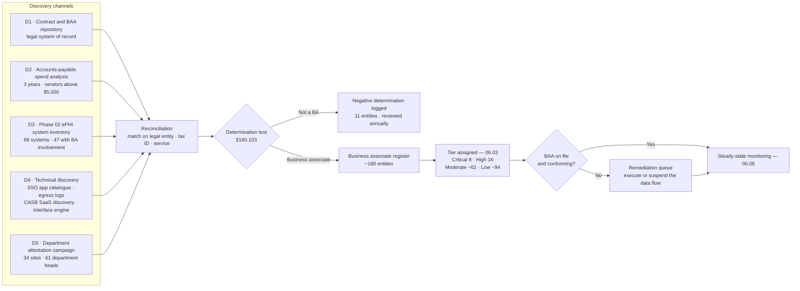

# 06.02 — Business Associate Identification &amp; Inventory

| Field | Value |
|---|---|
| Document ID | MBH-BAA-INV-2026-602 |
| Version | 1.0 |
| Date | 2026-07-15 |
| Classification | Confidential — Electronic Protected Health Information (ePHI) // Illustrative Portfolio Sample |
| Owner | Karen Boyd, Chief Compliance Officer (programme owner) |
| Co-Owner | Lisa Coleman, General Counsel (Business Associate Agreements) |
| Author | Advisory Team (Healthcare GRC / HIPAA) |
| Status | Approved |

## Purpose

A business associate programme is only as good as its population list. This document records **how MercyBridge decides whether an entity is a business associate**, **how the ~180 that are were found**, and **what the register contains**. It also records the eleven entities formally determined *not* to be business associates, because a defensible programme documents its negative determinations as carefully as its positive ones.

The failure mode this document exists to prevent is the one OCR encounters most often: PHI flowing to a vendor nobody registered, under no agreement, discovered only when that vendor is breached. An inventory built solely from the contract repository will always miss those vendors. MercyBridge therefore builds the register from **five independent discovery channels** and reconciles them.

## 1. The Determination Test

**§160.103** defines a business associate as a person or entity that, other than as a member of the covered entity's workforce, **creates, receives, maintains or transmits protected health information on behalf of** a covered entity to perform a function or activity regulated by HIPAA, or that **provides specified services** — legal, actuarial, accounting, consulting, data aggregation, management, administrative, accreditation or financial — involving disclosure of PHI.

MercyBridge applies the test as four sequential questions.

| # | Question | If yes | If no |
|---|---|---|---|
| 1 | Is PHI (in any form, including encrypted ePHI) involved? | Continue | Not a BA — record and close |
| 2 | Is the entity performing a **function or service on the Network's behalf**, rather than for its own purposes or as a provider treating the patient? | Continue | Likely a permitted disclosure — Privacy Officer confirms |
| 3 | Is the entity part of the **workforce** (employed, volunteer, trainee, or a contractor under MercyBridge's direct control)? | **Not a BA** — governed by §164.308(a)(3) | Continue |
| 4 | Is access limited to **transient transmission** with no storage and no more than random, incidental access? | Conduit exception may apply — narrow, evidenced, GC sign-off | **Business associate — BAA required** |

**The tie-breaker rule.** Where the answer is genuinely uncertain, MercyBridge executes a BAA. An unnecessary agreement costs a signature. A missing one is an independent regulatory violation.

## 2. Who Is a Business Associate — and Who Is Not

| Determination | Category | MercyBridge examples | Basis |
|---|---|---|---|
| **IS a BA** | Hosted clinical and business applications | Halcyon Health EHR, VNA imaging archive, revenue-cycle platform, patient portal host | Maintains ePHI on the Network's behalf |
| **IS a BA** | Cloud service providers, including "no-view" encrypted storage | Backup vault, cloud DR region, identity directory tier | OCR cloud guidance — BA status does not depend on the ability to read the data |
| **IS a BA** | Claims, clearinghouse and revenue-cycle outsourcers | Clearinghouse gateway, early-out self-pay servicing, collection agencies | Performs a HIPAA-regulated function |
| **IS a BA** | Transcription, coding, HIM and release-of-information | Transcription vendor, outsourced coding, ROI and digital fax gateway | Creates and receives PHI as a service |
| **IS a BA** | Imaging and teleradiology reading groups engaged by the Network | Overnight teleradiology reads under Network contract | Service on the Network's behalf, not independent treatment |
| **IS a BA** | Reference laboratories performing tests **on the Network's behalf under contract** | Send-out reference lab under a Network service agreement | Function performed for the Network |
| **IS a BA** | Medical device and IoMT vendors with remote access | Infusion pump fleet support, imaging modality remote service, monitoring vendors | Persistent or on-demand access to devices holding ePHI |
| **IS a BA** | Managed IT and security services | Managed detection and response, service-desk overflow, backup administration | Privileged access to systems containing ePHI |
| **IS a BA** | Shredding, media destruction and records storage | Certificated destruction vendor, off-site paper archive | Handles PHI as a service |
| **IS a BA** | Legal, accounting, actuarial and consulting with PHI access | External counsel on clinical matters, coding audit firm, external assessors | §160.103 enumerated services |
| **IS a BA** | Population health, registry and analytics vendors | Quality registry submission agent, risk-adjustment analytics | Data aggregation and analysis on the Network's behalf |
| **NOT a BA** | Mere conduits | Postal service, commercial courier, telecom carrier, ISP transporting encrypted traffic | Transient transmission only — narrow exception |
| **NOT a BA** | Disclosures to another provider for **treatment** | Specialist referral, SNF transfer, an independent lab billing the patient's plan | §164.502(a)(1)(ii); treatment is not a service on the Network's behalf |
| **NOT a BA** | Members of the **workforce** | Employed clinicians, credentialed volunteers, staffed contractors under Network direction | Governed by §164.308(a)(3) and sanctions |
| **NOT a BA** | Health plans receiving claims as covered entities in their own right | Commercial payers, Medicare/Medicaid | Permitted disclosure for payment |
| **NOT a BA** | **Plan sponsor** functions for the Network's own employee health plan | MercyBridge HR administering the self-insured plan under §164.504(f) | Plan-sponsor arrangement with certification and firewall, not a BAA |
| **NOT a BA** | Required-by-law and public health recipients | State immunisation registry, communicable disease reporting, FDA MedWatch | Permitted or required disclosure |
| **NOT a BA** | Researchers receiving PHI under IRB authorisation or a waiver | Academic study collaborators | Research disclosure, governed by §164.512(i) |
| **NOT a BA** | Financial institutions processing payment transactions | Card processor handling the payment instruction only | §1179 payment-processing exclusion |

### 2.1 The Eleven Negative Determinations

Eleven entities were formally assessed and recorded as **not** business associates in `logs/ba-determination-log.md`. Each entry names the requester, the analysis, the deciding officer and the review date.

| Determination category | Count | Example | Deciding officer |
|---|---|---|---|
| Conduit | 3 | Telecom carrier, two courier services carrying sealed encrypted media | Lisa Coleman |
| Treatment disclosure | 2 | Independent SNF, community physician practice | Rebecca Stern |
| Workforce / staffing under Network direction | 2 | Contracted hospitalist group under Network supervision and policies | Rebecca Stern |
| Plan sponsor | 1 | MercyBridge self-insured employee health plan administration | Lisa Coleman |
| Payment processing (§1179) | 1 | Card acquirer | Lisa Coleman |
| Required by law / public health | 2 | State cancer registry, county communicable disease reporting | Rebecca Stern |

Two of these — the courier arrangements — carry a **confidentiality and handling agreement** despite the conduit finding, because the tie-breaker rule favours documentation where a determination could reasonably be challenged.

## 3. How Business Associates Are Discovered

A contract repository lists the vendors legal knows about. It does not list the marketing SaaS a department bought on a corporate card, and it does not list the subcontractor that a registered BA quietly added. MercyBridge reconciles five channels.

| Channel | What it surfaced | Newly identified BAs | Why it matters |
|---|---|---|---|
| **D1** Contract and BAA repository | Baseline population held by General Counsel | 122 | System of record, but backward-looking |
| **D2** Accounts-payable spend analysis | Three years of spend screened against service keywords and vendor SIC codes; 214 vendors reviewed manually | **26** | The primary control against off-contract and departmentally procured vendors |
| **D3** Phase 02 ePHI system inventory | Each of the 68 ePHI systems traced to its supporting vendors and interfaces | 19 | Ties the register to the asset inventory, so a system cannot exist without an accountable BA |
| **D4** Technical discovery | SSO/IdP application catalogue, CASB SaaS discovery, firewall egress analysis, interface-engine endpoint list | 8 | Finds shadow SaaS that never touched procurement |
| **D5** Department attestation campaign | Signed attestation from 61 department heads across 34 sites confirming every external party receiving PHI | 5 | Catches paper and manual flows — faxes, mailed reports, on-site vendor staff |
| | **Total registered** | **~180** | — |

**Findings from D2.** Of the 26 vendors surfaced by spend analysis, 19 already had a BAA that had simply not been linked to the register, **5** were low-risk vendors requiring a new BAA (executed within the phase), and **2** were determined not to be business associates. No vendor was found receiving ePHI with no agreement at all — which is the result the control is designed to prove, not merely assert.

## 4. The Register — Content and Categories

Every entry in `trackers/business-associate-register.xlsx` carries 22 fields. The mandatory subset:

| Field | Purpose |
|---|---|
| BA identifier and legal entity name | Uniqueness; survives trading-name changes |
| Service description and HIPAA function | Basis of the determination |
| Linked ePHI system IDs (MBH-SYS-nnn) | Ties the register to Phase 02 |
| ePHI volume and data elements | Tier scoring input |
| Access type — direct system access, data transfer, physical media, on-site | Tier scoring input |
| Tier (Critical / High / Moderate / Low) | Drives diligence depth and cadence |
| BAA status, execution date, template version, expiry | Coverage evidence |
| Independent assessment held (SOC 2 Type II / HITRUST / other) and report date | Diligence evidence |
| Subcontractors disclosed | Feeds 06.06 |
| Offshore access permitted (Y/N) and locations | Minimum-necessary control |
| Relationship owner (business) and security owner | Accountability |
| Last review date and next review due | Cadence enforcement |

### 4.1 Population by Category

| # | Category | BAs | Typical ePHI exposure | Predominant tier |
|---|---|---|---|---|
| 1 | EHR and clinical applications | 14 | Full clinical record; orders; results | Critical / High |
| 2 | Revenue cycle, billing, claims, collections | 22 | Demographics, encounter, diagnosis, financial | Critical / High / Moderate |
| 3 | Imaging, teleradiology, VNA | 9 | Studies, reports, DICOM metadata | Critical / High |
| 4 | Laboratory and reference labs | 7 | Orders, specimens, results | High / Moderate |
| 5 | Pharmacy and e-prescribing | 6 | Medication history, prescriptions | High / Moderate |
| 6 | Transcription, coding, HIM, release-of-information | 11 | Narrative clinical documentation; full charts | High / Moderate |
| 7 | Cloud hosting, infrastructure, backup and DR | 16 | Full-copy archives; replicated environments | Critical / High |
| 8 | **Medical device and IoMT vendors with remote access** | 21 | Device-resident ePHI; privileged remote sessions | High / Moderate |
| 9 | Managed IT and security services | 8 | Privileged access across the estate | High / Moderate |
| 10 | Patient engagement — portal, telehealth, outreach, survey | 12 | Demographics, encounter, free-text comments | High / Moderate |
| 11 | Health information exchange and interoperability | 4 | Longitudinal records across the region | Critical / High |
| 12 | Legal, accounting, actuarial, consulting, external assessors | 13 | Case-scoped charts; sampled records | Moderate / Low |
| 13 | Shredding, media destruction, records storage | 5 | Paper and media in bulk | Moderate / Low |
| 14 | Contracted clinical and staffing services (not workforce) | 9 | Encounter-scoped records | Moderate / Low |
| 15 | Population health, registries, quality and analytics | 10 | De-identified and limited data sets; some identified | Moderate / Low |
| 16 | Utilisation review and care management partners | 6 | Authorisation and clinical review data | Moderate / Low |
| 17 | Government "other arrangements" (MOU) | 2 | Public health and EMS data exchange | Moderate |
| 18 | Limited / incidental PHI access | 5 | Translation, patient transport, incidental exposure | Low |
| | **Total** | **~180** | | |

### 4.2 Coverage and Data Quality Position at 2026-07-15

| Measure | Position | Target |
|---|---|---|
| Entities in the register | ~180 | Complete |
| Register entries with a linked ePHI system ID where applicable | 47 of 47 | 100% |
| Register entries with a tier assigned | 100% | 100% |
| Register entries with a named relationship owner | 100% | 100% |
| BAA executed and current | 177 of 180 at Phase 04 close; **180 of 180** on remediation closure | 100% |
| BA-involved ePHI systems with a conforming BAA | 44 → **47 of 47** | 47 |
| Critical/high BAs with a current independent assessment report | 21 of 24 → **24 of 24** (06.05) | 24 |
| BAAs on the 2026 template | 131 of 180; remainder at renewal | 100% by FY2028 |
| Subcontractor disclosure received from critical/high BAs | 15 of 24 → **24 of 24** (06.06) | 24 |
| Negative determinations documented | 11 | All |

## 5. Keeping the Inventory Accurate

| Trigger | Action | Owner | Timing |
|---|---|---|---|
| New vendor request touching PHI | Determination test before purchase order release | Karen Boyd | At intake |
| Quarterly AP spend re-screen | New payees matched against the register | Marcus Reed | Quarterly |
| New or changed ePHI system in Phase 02 inventory | Register entry created or amended | Anthony Ruiz | On change |
| CASB / SSO discovery alert on an unregistered SaaS app | Access blocked pending determination | Daniel Cho | Within 5 business days |
| BA merger, acquisition or name change | Novation or fresh execution; re-tier | Lisa Coleman | Within 30 days of notice |
| BA notifies a subcontractor change | Register and chain updated; diligence refreshed if material | Lisa Coleman | Within 30 days |
| Annual attestation campaign | Department heads re-confirm external PHI recipients | Karen Boyd | Annually, each Q1 |
| Contract termination | Offboarding checklist; register status set to terminated with exit evidence | System owner | At termination |

## Cross-References

| Reference | Relevance |
|---|---|
| 01.03 — Covered Entity &amp; Business Associate Determination | The original scoping determination for the Network itself |
| 02.01 — Inventory Methodology | Discovery method D4 (vendor and BAA register) reused here |
| 02.02 — ePHI System Inventory | The 68 systems; the 47 with BA involvement |
| 02.03 — ePHI Data-Flow Mapping | External flows that evidence which vendors receive PHI |
| 02.06 — Cloud &amp; Hosted Services | The 38 hosted services, all treated as BAs |
| 04.05 — Information Access Management | Minimum necessary applied to the data set each BA receives |
| 04.10 — Business Associate Contracts | The determination table this document expands |
| 06.01 — Business Associate Program Overview | Programme governance and lifecycle |
| 06.03 — Risk Tiering &amp; Criticality | How each registered entity is scored |
| 06.06 — Subcontractor &amp; Downstream Chain | Discovery of parties below the registered BA |
| 06.08 — Ongoing Monitoring &amp; Oversight | Steady-state maintenance of the register |

---
[⬅ Previous](06.01-business-associate-program-overview.md) · [🏠 Phase README](06.00-README.md) · [Next ➡](06.03-risk-tiering-and-criticality.md)
