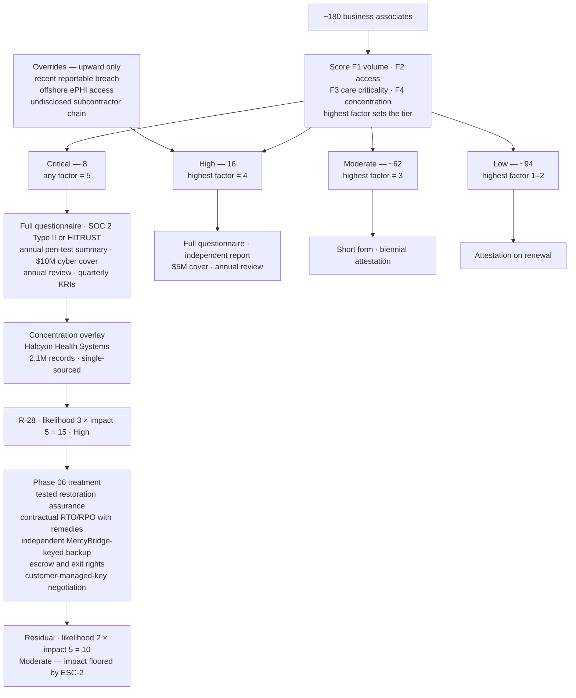

# 06.03 — Risk Tiering &amp; Criticality

| Field | Value |
|---|---|
| Document ID | MBH-BAA-TIR-2026-603 |
| Version | 1.0 |
| Date | 2026-07-15 |
| Classification | Confidential — Electronic Protected Health Information (ePHI) // Illustrative Portfolio Sample |
| Owner | Karen Boyd, Chief Compliance Officer (programme owner) |
| Co-Owner | Michelle Tran, VP Enterprise Risk (risk register custodian) · Daniel Cho, CISO |
| Author | Advisory Team (Healthcare GRC / HIPAA) |
| Status | Approved |

## Purpose

MercyBridge cannot assess **~180 business associates** to the same depth, and should not try. Uniform diligence spread thinly across the population would produce a thick evidence file and a thin understanding of where the real exposure sits. This document sets the **tiering model** that concentrates the programme's effort where the ePHI is: **24 critical or high-risk business associates**, of which one — **Halcyon Health Systems**, host of the entire **2.1 million-record** clinical archive — is a category of its own.

Tier is not a label. It is the variable that determines **what evidence is demanded, how often it is refreshed, who owns the relationship, what contract terms are non-negotiable, and what happens at exit**. Every downstream document in this phase reads its cadence from this one.

## 1. The Tiering Model

Four factors are scored 1–5. The tier is set by the **highest single factor**, not the average — a vendor holding 900,000 records is critical whether or not its other factors are benign. Concentration then acts as an **upward-only override**.

| Factor | 1 | 2 | 3 | 4 | 5 |
|---|---|---|---|---|---|
| **F1 · ePHI volume** | No stored ePHI; incidental only | <1,000 records | 1,000–50,000 | 50,001–500,000 | >500,000 records |
| **F2 · Access type** | Physical media only, escorted | One-way scheduled data transfer | Bidirectional interface / SFTP with a service account | Direct application access by vendor staff | **Privileged / administrative access** to a Tier 1 or 2 system, or vendor hosts the system |
| **F3 · Criticality to care delivery** | No clinical dependency | Administrative convenience | Degrades a workflow; manual workaround exists | Materially impairs a clinical service within 24 hours | **Halts clinical operations** — no viable workaround |
| **F4 · Concentration and substitutability** | Many equivalent suppliers; switch in days | Alternatives available; switch in weeks | Limited alternatives; switch in months | Effectively single-sourced; switch >12 months | **Single-sourced and holds the primary record**; exit requires data migration at scale |

| Tier | Assignment rule | Population | Share of governed ePHI |
|---|---|---|---|
| **Critical** | Any factor scores **5** | **8** | ~92% of stored record volume |
| **High** | Highest factor scores **4** | **16** | ~7% |
| **Moderate** | Highest factor scores **3** | ~62 | ~1% |
| **Low** | Highest factor scores **1–2** | ~94 | Incidental |
| | **Total** | **~180** | |

**Overrides.** Three conditions raise a tier regardless of factor scores: (a) a reportable breach involving MercyBridge ePHI in the last 24 months; (b) offshore access to identifiable ePHI; (c) a subcontractor chain that remains undisclosed after formal request. Two of the 16 High BAs sit at High rather than Moderate because of condition (b), and this is recorded on their register entries.

## 2. What Tier Drives

| Programme element | Critical (8) | High (16) | Moderate (~62) | Low (~94) |
|---|---|---|---|---|
| Pre-contract security questionnaire | Full — 214 questions | Full — 214 questions | Short form — 68 questions | Attestation — 14 questions |
| Independent assessment report | **Required** — SOC 2 Type II or HITRUST, current within 12 months | **Required** — SOC 2 Type II or HITRUST | Requested; alternatives accepted | Not required |
| Penetration test summary | Required annually | Required annually | On request | Not required |
| Cyber-liability insurance minimum | $10M | $5M | $2M | $1M |
| Evidence review depth | Full report read; CUECs extracted and mapped; exceptions tracked | Full report read; CUECs mapped | Opinion and scope reviewed | Certificate on file |
| Subcontractor disclosure | Named list, annually, with change notice | Named list, annually | Categories disclosed | Flow-down clause only |
| Named relationship owner | Executive sponsor + security owner | Business owner + security owner | Business owner | Contract manager |
| Review cadence | **Annual, with quarterly KRI review** | **Annual** | Biennial | On renewal |
| On-site or virtual assessment | Yes — annually for the top 3 by volume | On cause | No | No |
| Breach-notification clock | 24 hours initial, 5 calendar days full | 5 calendar days | 5 calendar days | 5 calendar days |
| Audit right | Right to audit, unqualified | Right to audit or accept equivalent report | Equivalent report accepted | Attestation accepted |
| Exit and continuity requirement | Tested restoration, escrow or data-export right, documented exit plan | Data-export right, exit plan | Return-or-destroy clause | Return-or-destroy clause |
| Board visibility | Named in the quarterly committee pack | Aggregate reporting | Aggregate | None |

## 3. The 24 Critical and High-Risk Business Associates

### 3.1 Critical (8)

| # | Business associate | Function | Linked systems | ePHI volume | F1 | F2 | F3 | F4 | Assurance held |
|---|---|---|---|---|---|---|---|---|---|
| C1 | **Halcyon Health Systems** | Vendor-hosted EHR — core, CPOE, eMAR, ADT, ambulatory | MBH-SYS-001 … -005 | **2,100,000 records** | 5 | 5 | 5 | **5** | SOC 2 Type II; HITRUST certified |
| C2 | Meridian Imaging Cloud | Vendor-neutral archive / enterprise imaging | MBH-SYS-011 | 2,410,000 studies | 5 | 5 | 4 | 4 | SOC 2 Type II |
| C3 | Cardinal Revenue Partners | Revenue cycle and patient accounting | MBH-SYS-030 | 2,100,000 | 5 | 5 | 3 | 4 | SOC 2 Type II |
| C4 | Vaultline Data Protection | Enterprise backup, immutable vault and cloud DR replication | MBH-SYS-055, -056 | 2,100,000 (full copies) | 5 | 5 | 5 | 4 | SOC 2 Type II |
| C5 | Northgate Clearing Services | Claims clearinghouse gateway | MBH-SYS-031 | 4,600,000 claims/yr | 5 | 4 | 3 | 4 | SOC 2 Type II; HITRUST certified |
| C6 | Rivermont Regional HIE | Health information exchange connector | MBH-SYS-040 | 1,660,000 | 5 | 4 | 4 | 4 | SOC 2 Type II; state participation agreement |
| C7 | AegisID Cloud Identity | Identity governance, SSO and MFA directory | MBH-SYS-062 | Workforce and patient identity attributes | 4 | **5** | **5** | 4 | SOC 2 Type II; ISO/IEC 27001 |
| C8 | Bridgeway Patient Engagement | MyBridge patient portal | MBH-SYS-023 | 1,142,000 enrolled patients | 5 | 4 | 3 | 3 | SOC 2 Type II; pen-test summary |

### 3.2 High (16)

| # | Business associate | Function | Linked systems | Driver of the High rating |
|---|---|---|---|---|
| H1 | Lumen Path Reference Laboratory | Send-out reference laboratory | LIS interface | 410,000 results/yr; bidirectional interface |
| H2 | NightArc Teleradiology | Overnight and subspecialty radiology reads | PACS / VNA | Direct PACS access by external radiologists |
| H3 | Verbatim Clinical Documentation | Medical transcription | **MBH-SYS-033** | 470,000 dictated documents; **offshore subcontractor** |
| H4 | CodeBridge HIM Services | Outsourced clinical coding | EHR direct access | Direct EHR access by external coders |
| H5 | Corva Health Information Services | Release-of-information and enterprise digital fax gateway | **MBH-SYS-058** | 1,900,000 pages/yr; outbound disclosure control |
| H6 | Sightline Secure Messaging | Secure clinical messaging | MBH-SYS-052 | 640,000; clinician-to-clinician PHI in transit and at rest |
| H7 | CareLink Virtual Visits | Telehealth platform | Telehealth | Live encounter capture; recording storage |
| H8 | ScriptRoute e-Prescribing Network | E-prescribing and medication history | Pharmacy interface | Controlled-substance workflow; medication safety |
| H9 | Helios Oncology Systems | Oncology treatment planning, hosted | Oncology planning | Treatment-plan integrity is a patient-safety dependency |
| H10 | Sentinel Ridge MDR | Managed detection and response | SIEM, EDR | Privileged visibility across the ePHI estate |
| H11 | Northwind Cloud Productivity | Enterprise email and collaboration | MBH-SYS-053 | Incidental but pervasive ePHI; large attack surface |
| H12 | Vitalis Medical Systems | Infusion pump fleet — remote service | IoMT fleet | Remote privileged access to 2,100+ networked pumps |
| H13 | Corvus Imaging Service | Imaging modality remote service | Modalities / PACS | Vendor-frozen platforms; remote support sessions |
| H14 | Insight Patient Voice | Patient experience survey platform | **MBH-SYS-029** | 295,000 patients; free-text comments frequently contain clinical detail |
| H15 | Ironclad Document Services | Media destruction and off-site records storage | Enterprise-wide | Bulk PHI in physical form; NIST SP 800-88 dependency |
| H16 | Halstead Receivables Group | Early-out self-pay servicing and collections | MBH-SYS-030 interface | 180,000 accounts; **offshore call-centre access** (tier override) |

**Two High ratings are override-driven.** H3 (offshore transcription subcontractor) and H16 (offshore servicing access) would score Moderate on factors alone; the offshore-access override raises them, and both are managed under the minimum-necessary controls that close R-32.

## 4. Concentration — Why Halcyon Is a Category of One

Tiering measures each relationship independently. **Concentration** measures what happens when one of them fails, and it is the reason R-28 exists.

| Concentration dimension | Halcyon position | Consequence |
|---|---|---|
| Share of the clinical record | **100%** of the 2.1M-record longitudinal archive | No parallel system holds the same data |
| Systems dependent on the relationship | MBH-SYS-001 to -005, plus 19 downstream interfaces | Failure propagates well beyond the EHR |
| Clinical dependency | CPOE, eMAR, ADT and ambulatory documentation | Extended outage forces full downtime procedures across 4 hospitals and ~30 sites |
| Substitutability | Effectively none within 12–24 months | Migration is a multi-year programme, not a contingency |
| Key custody | **Halcyon generates and holds the encryption keys** (05.10 §5) | The breach safe harbour may not apply if the application layer is compromised |
| Assurance basis | SOC 2 Type II and HITRUST certification | Strong, but it is *the vendor's* assurance over *the vendor's* controls |
| Risk record | **R-28 — likelihood 3 × impact 5 = 15, High**, ESC-2 patient-safety escalation | The last High risk in the 56-risk register |

## 5. Reducing R-28 — the Concentration Treatment Plan

Impact cannot be reduced. Under the ESC-2 patient-safety escalation the impact of losing the clinical record is fixed at **5**, and no contract changes that. The treatment therefore attacks **likelihood**, and the honest ceiling is **Moderate (10)**.

| # | Measure | Reduces | Owner | Status at 2026-07-15 |
|---|---|---|---|---|
| 1 | **Independently keyed backup** — full clinical archive replicated to the MercyBridge-controlled immutable vault under Network-held keys | Dependency on Halcyon for recovery | Daniel Cho | Operating; verified restore quarterly |
| 2 | **Tested restoration assurance** — Halcyon participates in an annual full-scale restoration test with MercyBridge observers, not a paper attestation | Extended-outage likelihood | Anthony Ruiz | First joint test scheduled 2026-09 |
| 3 | **Contractual RTO 4h / RPO 15min with service credits and a termination-for-repeated-failure right** | Vendor incentive alignment | Lisa Coleman | Executed in the FY2027 amendment |
| 4 | **Halcyon audit logs ingested into the MercyBridge SIEM**; administrative sessions recorded | Detection latency for insider or credential misuse | Marcus Reed | Operating |
| 5 | **Named-list vendor administrative access with MFA at the MercyBridge broker** | Credential compromise likelihood | Daniel Cho | Operating (Wave 1) |
| 6 | **Customer-managed encryption keys** requested at the FY2027 renewal; escrow of key material as the interim ask | Safe-harbour exposure (05.10 §5) | Lisa Coleman / Daniel Cho | Open item O-6 — negotiation live |
| 7 | **Source-code and configuration escrow plus a contractual bulk data-export right in an open format** | Exit and insolvency risk | Lisa Coleman | Executed |
| 8 | **24-hour initial breach notice** and joint participation in the Phase 07 tabletop | Notification-timing risk (R-31) | Karen Boyd | Tabletop 2026-08 |
| 9 | **Tested downtime and read-only continuity capability** across all four hospitals | Care-delivery impact duration | Dr. Samuel Ortega | Operating; exercised semi-annually |

**Result: R-28 moves from High (15) to Moderate (10)** and becomes a *permanently managed* risk rather than a closed one. MercyBridge will not claim closure of a structural concentration it has chosen to accept.

## 6. Re-Tiering and Governance of the Model

| Event | Action | Owner | Timing |
|---|---|---|---|
| Annual re-scoring of the full population | All four factors re-evaluated from register data | Karen Boyd | Each Q1 |
| Material change in ePHI volume (±25%) | Immediate re-score | Marcus Reed | Within 30 days |
| New system or interface granted to an existing BA | Re-score F2 and F3 | System owner | Before go-live |
| BA reportable breach affecting any customer | Override applied; diligence refreshed | Daniel Cho | Within 10 business days |
| Offshore access requested or discovered | Override applied; Privacy Officer review | Rebecca Stern | Before access |
| Tier change approved | Business Associate Oversight Committee ratifies; register updated | Karen Boyd | Monthly meeting |
| Model itself reviewed | Factors, thresholds and overrides validated against loss experience | Michelle Tran | Annually, with the risk re-analysis |

**Downgrades require committee approval; upgrades take effect immediately.** The asymmetry is deliberate — the cost of over-assessing a vendor is effort, and the cost of under-assessing one is a breach.

## Cross-References

| Reference | Relevance |
|---|---|
| 02.02 — ePHI System Inventory | Volume and tier data behind F1 |
| 02.06 — Cloud &amp; Hosted Services | Hosting model behind F2 and F4 |
| 03.05 — Likelihood, Impact &amp; Risk Determination | The 5×5 model and the ESC-2 escalation that floors R-28's impact |
| 03.07 — Risk Register | R-28 as scored: likelihood 3 × impact 5 = 15 |
| 05.10 — Encryption &amp; Key Management | The Halcyon vendor-held-key analysis feeding measure 6 |
| 05.12 — Control-to-Risk Traceability | R-28 handed to this phase as the last remaining High risk |
| 06.02 — BA Identification &amp; Inventory | The register fields that supply the scoring inputs |
| 06.05 — Due Diligence &amp; Assessment | The tiered evidence requirements set out in §2 |
| 06.06 — Subcontractor &amp; Downstream Chain | The undisclosed-chain override |
| 06.07 — Cloud Service Providers | Tiering applied across the 38 hosted services |
| 06.08 — Ongoing Monitoring &amp; Oversight | Cadence and KRIs driven by tier |

---
[⬅ Previous](06.02-business-associate-identification-and-inventory.md) · [🏠 Phase README](06.00-README.md) · [Next ➡](06.04-business-associate-agreements.md)
