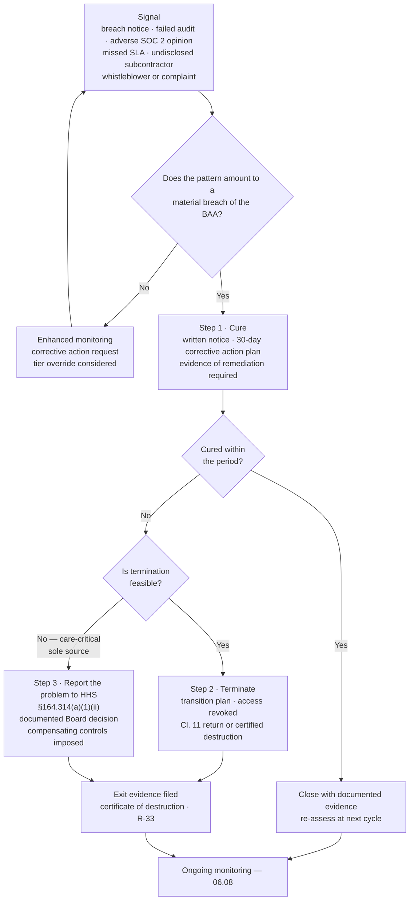

# 06.04 — Business Associate Agreements

| Field | Value |
|---|---|
| Document ID | MBH-BAA-AGR-2026-604 |
| Version | 1.0 |
| Date | 2026-07-15 |
| Classification | Confidential — Electronic Protected Health Information (ePHI) // Illustrative Portfolio Sample |
| Owner | Lisa Coleman, General Counsel (owner of Business Associate Agreements) |
| Co-Owner | Daniel Cho, CISO &amp; HIPAA Security Official (security terms) |
| Author | Advisory Team (Healthcare GRC / HIPAA) |
| Status | Approved |

## Purpose

This document is the contractual instrument of the programme. It sets out the **required content of a business associate agreement** under §164.314(a)(2) and §164.504(e), the **MercyBridge 2026 standard template**, the positions the Network will and will not negotiate, the governance of clause deviations, and the escalation ladder when a business associate materially breaches.

It also records the **closure of the three BAA remediations** carried since Phase 02 — MBH-SYS-029, MBH-SYS-033 and MBH-SYS-058 — which brings coverage to **47 of 47** business-associate-involved ePHI systems and reduces **R-29** from Moderate (12) to Moderate (8).

A BAA is the minimum, not the programme. It is nonetheless the element OCR can verify from a document request alone, and the element whose absence is itself a violation.

## 1. The Legal Architecture

§164.308(b)(1) requires satisfactory assurances. §164.314(a) states what the contract must contain for the **Security Rule**. §164.502(e) and §164.504(e) state what it must contain for the **Privacy Rule**. A conforming MercyBridge BAA satisfies all three in a single instrument.

| Layer | Citation | What it contributes |
|---|---|---|
| Security Rule standard | §164.308(b)(1) | The obligation to obtain written assurances before disclosure |
| Organisational requirement | §164.314(a)(1)–(2) | The four Security Rule contract elements; the pattern-of-activity duty |
| Privacy Rule standard | §164.502(e)(1) | The parallel obligation for PHI in any form |
| Privacy Rule contract content | §164.504(e)(2) | Permitted uses, safeguards, individual rights, HHS access, return/destroy, termination |
| Subcontractors | §164.308(b)(2), §164.314(a)(2)(iii) | The same terms must flow down |
| Government arrangements | §164.308(b)(3), §164.314(a)(2)(ii) | MOU as an alternative instrument |
| Documentation retention | §164.316(b)(2)(i) | Six years from creation or last effective date |

## 2. Required BAA Elements — the Clause Map

| # | Required element | Citation | MercyBridge 2026 template | Negotiable? |
|---|---|---|---|---|
| 1 | **Permitted uses and disclosures** — the BA may use or disclose PHI only as the contract permits or law requires | §164.504(e)(2)(i)–(ii)(A) | Cl. 2 — enumerated purposes; minimum necessary; **no de-identification, marketing, sale or secondary use without written consent** | Purpose list only |
| 2 | **Appropriate safeguards** — prevent use or disclosure other than as provided | §164.504(e)(2)(ii)(B) | Cl. 3 — administrative, physical and technical safeguards mapped to §164.308/310/312 | No |
| 3 | **Security Rule compliance** for ePHI | §164.314(a)(2)(i)(A) | Cl. 4 — express undertaking to comply with Subpart C in full, including risk analysis and documentation | No |
| 4 | **Report security incidents and breaches** of unsecured PHI | §164.314(a)(2)(i)(C); §164.504(e)(2)(ii)(C); §164.410 | Cl. 6 — **24-hour initial notice (Critical), 5 calendar days full notice**; content requirements; cooperation duty | Timing at Moderate/Low only |
| 5 | **Ensure subcontractors agree to the same restrictions and conditions** | §164.314(a)(2)(i)(B); §164.308(b)(2); §164.502(e)(1)(ii) | Cl. 5 — written flow-down; **named subcontractor disclosure**; 30-day change notice; MercyBridge objection right | Disclosure format only |
| 6 | **Individual rights support** — access, amendment, accounting of disclosures | §164.504(e)(2)(ii)(E)–(G) | Cl. 8 — 10-business-day response SLA to Network requests | SLA at Low tier |
| 7 | **Make internal practices, books and records available to HHS** | §164.504(e)(2)(ii)(H) | Cl. 9 — regulator access; notice to MercyBridge where lawful | No |
| 8 | **Return or destroy PHI at termination**, or extend protections if infeasible | §164.504(e)(2)(ii)(J) | Cl. 11 — return or **NIST SP 800-88 destruction with a signed certificate within 30 days**; infeasibility must be evidenced and approved | Method only |
| 9 | **Termination for material breach** | §164.504(e)(2)(iii); §164.314(a)(1)(ii) | Cl. 12 — 30-day cure; immediate termination where cure is not possible; transition assistance | Cure period |
| 10 | **Privacy Rule obligations** carried out on the Network's behalf | §164.504(e)(2)(ii)(I) | Cl. 10 — BA complies with Subpart E to the extent it performs a Network obligation | No |
| 11 | Duty to **mitigate** known harmful effects | §164.530(f) applied contractually | Cl. 7 — mitigation at the BA's cost | No |

### 2.1 MercyBridge Additions Beyond the Regulatory Minimum

Required by POL-15, not by rule. These are where the negotiation actually happens.

| # | Addition | Rationale | Standard position |
|---|---|---|---|
| A1 | **Encryption of ePHI at rest and in transit** to the POL-23 standard (AES-256 / TLS 1.2+) | Preserves the §164.402 breach safe harbour | Non-negotiable for Critical/High |
| A2 | **Annual independent assessment evidence** — SOC 2 Type II or HITRUST — delivered without request | Converts diligence from a favour into an obligation | Non-negotiable for Critical/High |
| A3 | **Right to audit**, or to accept an equivalent third-party report at MercyBridge's election | §164.314 gives HHS an audit right, not the covered entity | Retained for Critical; report-substitution accepted for High |
| A4 | **Cyber-liability insurance** — $10M Critical, $5M High, $2M Moderate, $1M Low; certificate annually | Funds notification and remediation | Amount negotiable, existence not |
| A5 | **Breach cost allocation** — notification, call centre, credit monitoring and regulatory response costs borne by the party at fault | Notification of 500,000 individuals is a material expense | Frequently negotiated; carve-outs recorded |
| A6 | **Indemnity** for third-party claims arising from the BA's impermissible use or disclosure, uncapped for wilful misconduct | Commercial remedy only — **does not transfer HIPAA liability** | Cap negotiable above a floor of 2× annual contract value |
| A7 | **Data residency** — ePHI stored and processed in the United States; offshore access only with prior written consent | Controls R-32 | Non-negotiable for storage; access consented case by case |
| A8 | **No subcontracting to a new jurisdiction** without 60 days' notice and MercyBridge consent | Fourth-party control (06.06) | Non-negotiable for Critical/High |
| A9 | **Availability commitments** — RTO/RPO with service credits for hosted systems | Treats availability as an ePHI property, per §164.306(a)(1) | Levels negotiable |
| A10 | **Exit assistance and bulk data export** in a documented open format at no incremental charge | Prevents hostage-data exit conditions; supports R-28 | Non-negotiable for Critical |
| A11 | **Cooperation in incident response**, including participation in one tabletop exercise per year for Critical BAs | Tests the notification chain before it is needed | Critical only |
| A12 | Six-year record retention aligned to §164.316(b)(2)(i) | Regulator evidence availability | Non-negotiable |

## 3. Template Governance and Deviation Control

| Control | Position |
|---|---|
| Template of record | MercyBridge 2026 BAA, `templates/business-associate-agreement.md`, approved by Lisa Coleman 2026-05-20 |
| Population on the 2026 template | **131 of 180**; the remainder convert at renewal, all by FY2028 |
| Vendor-paper BAAs accepted? | Only where the vendor paper contains all 11 required elements **and** A1, A2, A7 and A12; reviewed clause by clause and recorded as a deviation file |
| Who may approve a deviation | Lisa Coleman for commercial terms; **Daniel Cho must approve any deviation from A1, A2, A3 or A7**; Business Associate Oversight Committee for Critical BAs |
| Who may approve an omission of a *required* element | **Nobody.** A missing §164.314(a) or §164.504(e) element is a bar to execution |
| Deviation log | `logs/baa-clause-deviation-log.md` — 23 open deviations, all Moderate/Low tier, each with rationale and review date |
| Signature authority | General Counsel or delegate; no departmental signature authority for BAAs |
| Retention | Six years beyond termination, per §164.316(b)(2)(i) |
| "Other arrangements" | 2 government MOUs under §164.314(a)(2)(ii) — state public health data service, county EMS exchange |

### 3.1 Most Commonly Negotiated Positions and MercyBridge's Response

| Vendor position | Frequency | MercyBridge response |
|---|---|---|
| "Notification within 60 days, per the regulation" | Very common | Rejected. §164.410's outer limit is not a target; the Network needs the time to meet its own §164.404 duty. 5 days, or 24 hours for Critical |
| "Security incident" narrowed to exclude unsuccessful attempts | Common | **Accepted** with a defined carve-out for routine pings and blocked scans — reporting noise degrades signal |
| "No audit right; SOC 2 only" | Common | Accepted for High and below; retained for Critical |
| "Indemnity capped at 12 months' fees" | Common | Countered to 2× annual value with an uncapped carve-out for wilful misconduct and impermissible disclosure |
| "Data may be processed offshore for support" | Occasional | Only with named-individual rosters, session recording, minimum-necessary data sets and Privacy Officer consent |
| "Provider-managed keys only" | Occasional | Accepted with compensating controls; customer-managed keys pursued at renewal (Halcyon, open item O-6) |
| "We will not disclose our subcontractors" | Occasional | Rejected for Critical/High. §164.308(b)(2) obligations cannot be verified against an undisclosed chain; tier override applies pending disclosure |

## 4. The Escalation Ladder — §164.314(a)(1)(ii)

**The third rung is the uncomfortable one, and it is real.** Where a business associate is care-critical and cannot be replaced, MercyBridge cannot simply keep quiet and keep paying. §164.314(a)(1)(ii) requires that if cure and termination are both infeasible, the problem is reported to the Secretary. The Business Associate Oversight Committee holds that decision, with Board notification. No such report has been required in the period.

## 5. Coverage Position and Closure of the Three Remediations

| Measure | Phase 04 close | **Phase 06 close** |
|---|---|---|
| ePHI systems in scope | 68 | 68 |
| Systems with business associate involvement | 47 | 47 |
| Systems with a conforming, executed BAA | 44 | **47** |
| Systems with a BAA under remediation | 3 | **0** |
| **BAA coverage of BA-involved systems** | 44 of 47 (93.6%) | **47 of 47 (100%)** |
| Business associates with a current BAA or MOU | 177 of ~180 | **~180 of ~180** |
| BAAs on the 2026 template | 131 | 131, remainder at renewal |
| Cloud/hosted services with a current BAA | 35 of 38 | **38 of 38** |

### 5.1 The Three Remediations — Closed

| System | Business associate / service | Tier | Deficiency carried from Phase 02 | Remediation executed | Interim control while open | Closed |
|---|---|---|---|---|---|---|
| **MBH-SYS-033** | Verbatim Clinical Documentation — medical transcription (470,000 documents) | High | Pre-HITECH template: **no subcontractor flow-down** and no defined incident-notification window — the vendor uses an offshore transcription partner | Re-papered onto the 2026 template in full; Cl. 5 flow-down with named subcontractor disclosure; Cl. 6 5-day clock; A7 residency and A8 jurisdiction consent added | Offshore access suspended pending execution; volumes throttled; SFTP identity scoped and logged | **2026-07-09** |
| **MBH-SYS-029** | Insight Patient Voice — patient experience survey platform (295,000 patients) | High | BAA executed with a **predecessor entity**; novation never completed after the vendor was acquired | Novation executed plus fresh execution with the acquiring entity on the 2026 template; corporate-change notice obligation added | Read-only interface; enhanced logging; free-text field set reduced | **2026-07-11** |
| **MBH-SYS-058** | Corva Health Information Services — release-of-information and enterprise digital fax gateway (1,900,000 pages/yr) | High | **Incident-notification clause silent**; no return-or-destroy obligation at termination | Amendment adding Cl. 6 (notification), Cl. 11 (return or NIST SP 800-88 destruction with certificate) and A12 retention | ePHI field set reduced to minimum necessary; outbound disclosure logging to SIEM | **2026-07-14** |

**Evidence.** Each closure is supported by a countersigned agreement, a clause-conformance checklist signed by General Counsel, a dated entry in `trackers/baa-remediation.xlsx`, and removal of the interim compensating control with the Security Official's approval. All three were re-tiered at closure and confirmed as High.

### 5.2 Risk Movement

| Risk | Entering | Contractual treatment | Residual |
|---|---|---|---|
| **R-29** — ePHI disclosed under three non-conforming BAAs | Moderate (12) — likelihood 3 × impact 4 | All three executed on the 2026 template; interim controls retired; **0 non-conforming BAAs on BA-involved ePHI systems** | **Moderate (8)** — likelihood 2 × impact 4 |
| **R-31** — BA breach notice too late for the §164.404 60-day duty | Moderate (8) | 24-hour/5-day clock in every Critical and High BAA; escalation contacts tested; joint tabletop participation | Moderate (8) → closes in **Phase 07** |
| **R-32** — offshore support access exceeds minimum necessary | Low (4) | A7 residency, A8 jurisdiction consent, named-roster requirement in the transcription and receivables agreements | **Low (2)** |
| **R-33** — data return and certified deletion at exit unevidenced | Low (4) | Cl. 11 with a 30-day certificate requirement in all Critical/High agreements | **Low (2)** |
| **R-28** — Halcyon concentration | High (15) | Contractual measures 3, 6, 7, 8 in 06.03 §5 — RTO/RPO with remedies, key-custody negotiation, escrow and export rights, 24-hour notice | **Moderate (10)** with 06.03 §5 in full |

## 6. Agreement Lifecycle Controls

| Control | Frequency | Owner |
|---|---|---|
| No ePHI released before a countersigned BAA is on file — enforced at access provisioning | Every engagement | System owner / Daniel Cho |
| Clause-conformance checklist completed for every executed agreement | Every execution | Lisa Coleman |
| Expiry and renewal monitoring with 120-day advance notice | Continuous | Lisa Coleman |
| Corporate-change screening (M&amp;A, name change, insolvency) across the register | Quarterly | Lisa Coleman |
| Insurance certificate collection for Critical/High | Annual | Lisa Coleman |
| Deviation log review | Quarterly | Business Associate Oversight Committee |
| Template review against regulatory change, including the 2025 Security Rule NPRM | Annual | Lisa Coleman / Daniel Cho |
| Internal audit sample of 15 executed agreements against the clause map | 2026 Q4 | Priya Anand |

## Cross-References

| Reference | Relevance |
|---|---|
| 03.07 — Risk Register | R-28, R-29, R-31, R-32, R-33 |
| 04.10 — Business Associate Contracts | The §164.308(b)(1) standard and the original clause map |
| 04.11 — Policies, Procedures &amp; Documentation | POL-15 and six-year retention of executed agreements |
| 05.10 — Encryption &amp; Key Management | POL-23 standard incorporated as contract term A1 |
| 06.01 — BA Program Overview | Governance and the direct-liability position |
| 06.03 — Risk Tiering &amp; Criticality | Tier-driven contract positions and the R-28 treatment plan |
| 06.05 — Due Diligence &amp; Assessment | The evidence obligations that terms A2 and A3 make contractual |
| 06.06 — Subcontractor &amp; Downstream Chain | Clause 5 flow-down in operation |
| 06.07 — Cloud Service Providers | CSP-specific contract requirements |
| Phase 07 — Incident Response &amp; Breach Notification | Clause 6 notice into the §164.404 60-day duty |
| Phase 08 — HITRUST &amp; Independent Assessment | Contract evidence tested by Beacon Assurance |

---
[⬅ Previous](06.03-risk-tiering-and-criticality.md) · [🏠 Phase README](06.00-README.md) · [Next ➡](06.05-due-diligence-and-assessment.md)
