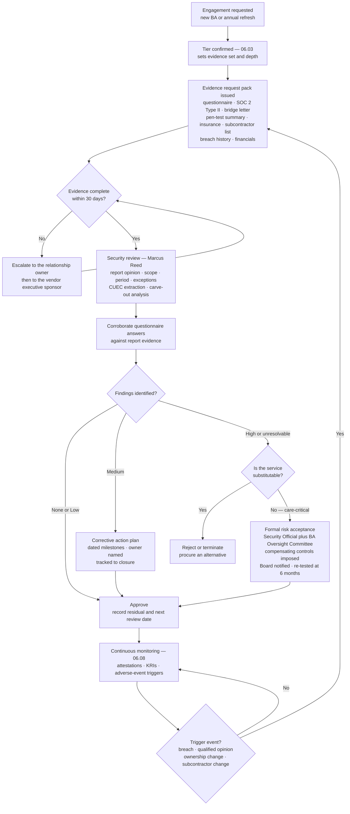

# 06.05 — Due Diligence &amp; Assessment

| Field | Value |
|---|---|
| Document ID | MBH-BAA-DDA-2026-605 |
| Version | 1.0 |
| Date | 2026-07-15 |
| Classification | Confidential — Electronic Protected Health Information (ePHI) // Illustrative Portfolio Sample |
| Owner | Daniel Cho, Chief Information Security Officer &amp; HIPAA Security Official (security assessment) |
| Co-Owner | Karen Boyd, Chief Compliance Officer · Lisa Coleman, General Counsel |
| Author | Advisory Team (Healthcare GRC / HIPAA) |
| Status | Approved |

## Purpose

A business associate agreement records what a vendor **promises**. Due diligence establishes what a vendor **does**. This document sets the MercyBridge method for pre-contract and periodic assessment of business associates: what is asked, what evidence is required at each tier, how third-party assurance reports are actually read, and — the question every programme eventually faces — **what happens when a critical business associate cannot produce a SOC 2**.

The obligation this satisfies is not decorative. §164.308(a)(1)(ii)(A) requires MercyBridge's risk analysis to cover ePHI wherever it is created, received, maintained or transmitted, including in a vendor's environment. A covered entity that has never assessed the vendor holding **2.1 million records** has not performed an accurate and thorough risk analysis, whatever its internal documentation says.

## 1. Diligence Requirements by Tier

| Requirement | Critical (8) | High (16) | Moderate (~62) | Low (~94) |
|---|---|---|---|---|
| Security questionnaire | Full — 214 questions, mapped to §164.308/310/312 and HITRUST i1 | Full — 214 questions | Short form — 68 questions | Attestation — 14 questions |
| **SOC 2 Type II** (or HITRUST r2/i1) current within 12 months | **Required** | **Required** | Requested; alternatives accepted | Not required |
| Bridge letter covering the gap since the report period | Required | Required | Not required | Not required |
| CUEC extraction and mapping to MercyBridge controls | Required | Required | Sample only | No |
| Independent penetration test summary | Required annually | Required annually | On request | No |
| Vulnerability management evidence (SLA and metrics) | Required | Required | Questionnaire response only | No |
| Cyber-liability insurance certificate | $10M | $5M | $2M | $1M |
| Breach and enforcement history — 5 years | Required, with root-cause and remediation narrative | Required | Screening only | Screening only |
| Financial viability review | Required — audited statements or credit report | Required — credit report | Screening | No |
| **Subcontractor disclosure** — named entities | Required annually with 30-day change notice | Required annually | Categories | Flow-down clause only |
| Data residency and offshore-access declaration | Required | Required | Required | Required |
| BCDR evidence — tested plan, RTO/RPO, restoration test results | Required, with MercyBridge observation for the top 3 | Required | Requested | No |
| Workforce controls — background checks, sanctions screening, HIPAA training | Required | Required | Attested | Attested |
| On-site or virtual assessment | Annual for the top 3 by ePHI volume; on cause for the rest | On cause | No | No |
| Reassessment cadence | **Annual** | **Annual** | Biennial | On renewal |
| Approval authority | Security Official + BA Oversight Committee | Security Official | Information Security Manager | Contract manager |

## 2. The Security Questionnaire

The 214-question instrument is organised to the Security Rule so that answers map directly onto MercyBridge's own control set and onto the HITRUST i1 assessment in Phase 08.

| Domain | Questions | Focus | Illustrative disqualifier |
|---|---|---|---|
| Governance, risk analysis and policy | 22 | Does the BA perform its own §164.308(a)(1)(ii)(A) risk analysis? Named Security Official? | No documented risk analysis in the last 24 months |
| Workforce security and training | 18 | Background checks, sanctions, termination procedures, annual HIPAA training | No termination-day access revocation process |
| Access management and authentication | 31 | Unique IDs, least privilege, recertification, **MFA on all remote and privileged access** | No MFA on remote administrative access |
| Audit controls and monitoring | 19 | Log generation, retention, review, SIEM, alerting | Logs retained under 90 days |
| Encryption and key management | 17 | At rest and in transit standards; **key custody**; escrow | ePHI at rest unencrypted |
| Vulnerability and patch management | 21 | Scanning cadence, remediation SLAs, penetration testing | No remediation SLA for critical vulnerabilities |
| Network and infrastructure security | 24 | Segmentation, egress control, EDR, secure configuration | Flat network with ePHI reachable from general corporate |
| Incident response and breach notification | 20 | Plan, testing, 4-factor familiarity, notification process to the CE | No documented notification process to covered entities |
| Business continuity and disaster recovery | 16 | Tested plan, RTO/RPO, backup immutability and restoration testing | Backups never restore-tested |
| Physical and environmental | 12 | Data-centre controls, media handling, disposal | No NIST SP 800-88 disposal standard |
| **Subcontractor management** | 14 | Downstream BAAs, diligence over subcontractors, disclosure | Subcontractors used with no BAAs in place |
| **Total** | **214** | | |

Answers are not taken at face value. **Every "yes" at Critical and High tier must be corroborated** by a control description in the SOC 2 report, a policy extract, a screenshot, or a statement in the penetration test summary. Uncorroborated affirmative answers are recorded as unverified and treated as findings.

## 3. How Assurance Reports Are Actually Read

A SOC 2 Type II report is evidence about a **defined scope over a defined period against criteria the service organisation selected**. Filing it is not diligence. MercyBridge reads seven things.

| # | What is examined | Why | Common problem found |
|---|---|---|---|
| 1 | **Opinion type** | A qualified or adverse opinion changes the reliance decision entirely | Qualification buried in Section 1 |
| 2 | **Trust services criteria in scope** | Security alone is common; Availability and Confidentiality matter for ePHI | Availability out of scope for a hosted clinical system |
| 3 | **System scope** | The report may cover a different product, region or data centre than the one MercyBridge uses | Report covers the vendor's flagship platform, not the module in use |
| 4 | **Period covered and gap to today** | A report ending 8 months ago says nothing about today | No bridge letter offered |
| 5 | **Exceptions and deviations in Section 4** | The tested failures are the most informative pages in the report | Access-recertification exceptions with no management response |
| 6 | **Complementary user entity controls (CUECs)** | The report *assumes* MercyBridge performs certain controls; reliance is invalid if it does not | CUECs never mapped by the customer |
| 7 | **Subservice organisations and the carve-out method** | Carved-out subservice organisations are outside the opinion — and are usually the subcontractors of 06.06 | Hosting provider carved out entirely |

### 3.1 Assurance Position Across the Population

| Assurance artefact | Critical (8) | High (16) | Across the 38 hosted services |
|---|---|---|---|
| SOC 2 Type II current within 12 months | 8 | 13 | 33 |
| SOC 2 Type I only | 0 | 1 | 2 |
| HITRUST CSF certification | 3 | 8 | 11 |
| ISO/IEC 27001 (supplementary, not substitutive) | 4 | 4 | 8 |
| No SOC 2 — alternative assurance pathway | 0 | 2 | 3 |
| Penetration test summary provided | 8 | 12 | 24 |
| Subcontractor list disclosed (start of phase → end) | 6 → 8 | 9 → 16 | 29 → 38 |
| Cyber-liability certificate current | 8 | 16 | 38 |
| US-only data residency committed | 8 | 14 | 36 |
| Customer-managed encryption keys in use | 2 | 7 | 9 |

**Movement in this phase.** Critical/high BAs with a current independent assessment report rose from **21 of 24 to 24 of 24**: one High BA delivered a first Type II report, one moved from Type I with a supplementary evidence pack, and one was carried through the alternative pathway in §5 below. Subcontractor disclosure rose from 15 of 24 to **24 of 24**, closing the visibility gap behind R-30.

## 4. The Assessment Workflow

| Stage | Owner | Target duration |
|---|---|---|
| Tier confirmation | Karen Boyd | 2 business days |
| Evidence pack issued and received | Marcus Reed | 30 calendar days |
| Security review and corroboration | Marcus Reed | 10 business days (Critical: 15) |
| Findings and corrective action plan agreed | Daniel Cho | 15 business days |
| Approval or escalation | Daniel Cho / BA Oversight Committee | Monthly committee cycle |
| BAA execution (parallel from tier confirmation) | Lisa Coleman | Before any ePHI release |

## 5. When a Critical Business Associate Cannot Produce a SOC 2

This is the situation every third-party programme claims will not arise and every mature one has a written answer for. MercyBridge's answer is a **substitution ladder**, not a waiver.

| Step | Action | Applied to |
|---|---|---|
| 1 | **Ask precisely.** Is there a SOC 2 Type II for a different scope, a SOC 1, a HITRUST r2/i1, an ISO/IEC 27001 certificate with a Statement of Applicability, or a recent customer-led audit report? | All |
| 2 | **Accept a HITRUST certification** as a full substitute; accept ISO/IEC 27001 as partial, requiring supplementary questions on ePHI-specific controls | 11 BAs hold HITRUST |
| 3 | **Commission a MercyBridge-led assessment** at the vendor's cost or shared cost — documentary review plus a virtual control walkthrough with evidence sampling, performed by Information Security | 2 High BAs in this period |
| 4 | **Require a targeted independent test** — an external penetration test of the service by a qualified firm, with the summary delivered to MercyBridge | 1 High BA |
| 5 | **Impose compensating controls** — reduced data set, encryption under MercyBridge-held keys, brokered just-in-time access with session recording, restricted egress, enhanced logging into the Network SIEM, shortened notification clock | All step-3 and step-4 cases |
| 6 | **Contract for a report by a fixed date** — a milestone in the BAA with a termination right if unmet | 1 High BA, milestone 2027-03-31 |
| 7 | **Formal risk acceptance** by the Security Official and the BA Oversight Committee, with Board notification, a re-test date and a documented substitutability analysis | 1 open acceptance |
| 8 | **Reject or terminate** where the service is substitutable and the assurance gap is material | 2 candidate vendors rejected at intake in the period |

**No Critical (Tier 1) business associate is operating without an independent assessment report.** All eight hold a current SOC 2 Type II, three of them additionally HITRUST-certified. The alternative pathway has been used only at High tier, and every instance carries compensating controls and a dated closure milestone.

### 5.1 Open Diligence Findings

| # | Business associate | Finding | Severity | Corrective action | Due |
|---|---|---|---|---|---|
| DD-01 | Halcyon Health Systems (C1) | **Vendor generates and holds the encryption keys**; no customer-managed key option in the current release | Medium | Escrow of key material as interim; customer-managed keys pursued at FY2027 renewal (open item O-6) | 2027-03-31 |
| DD-02 | Corvus Imaging Service (H13) | Remote support historically via a vendor-managed VPN with a shared account | Medium | Migrated to brokered just-in-time access with MFA and session recording; shared account retired | Closed 2026-06-30 |
| DD-03 | Verbatim Clinical Documentation (H3) | Offshore transcription subcontractor previously undisclosed | High | Disclosed and contracted under Cl. 5; named-individual roster; minimum-necessary data set; session recording | Closed 2026-07-09 |
| DD-04 | Northwind Cloud Productivity (H11) | Audit-log retention of 90 days, below the Network's 6-year documentation requirement | Low | Continuous export to the MercyBridge SIEM; contractual retention minimum added at renewal | 2026-12-31 |
| DD-05 | Halstead Receivables Group (H16) | Offshore call-centre access to account-level PHI | Medium | Data set reduced to demographics and balance; screen-scrape and download blocked; recorded sessions | 2026-09-30 |
| DD-06 | Unnamed High-tier BA (alternative pathway) | No SOC 2 Type II | Medium | MercyBridge-led virtual assessment completed; independent penetration test delivered; Type II contracted | 2027-03-31 |

## 6. Diligence Metrics

| Metric | Position at 2026-07-15 | Target |
|---|---|---|
| Critical/high BAs with a completed current assessment | **24 of 24** | 24 |
| Assessments completed within the 30-day evidence window | 19 of 24 (79%) | ≥90% |
| Critical BAs with a current SOC 2 Type II or HITRUST | **8 of 8** | 8 |
| CUECs extracted and mapped across the hosted estate | 147 mapped; 139 implemented, 6 remediated, 2 accepted | 100% mapped |
| Open diligence findings, High severity | **0** (DD-03 closed) | 0 |
| Open diligence findings, Medium severity | 4 | ≤5, all with dated plans |
| BAs onboarded with ePHI before diligence completion | **0** | 0 |
| Vendors rejected at intake on assurance grounds | 2 | — |

## Cross-References

| Reference | Relevance |
|---|---|
| 02.06 — Cloud &amp; Hosted Services | The 38 hosted services and the CUEC baseline |
| 03.01 — Risk Analysis Methodology | Why vendor-held ePHI is inside the risk analysis |
| 03.04 — Existing Controls Assessment | Baseline C-A15 rating for BA assurance |
| 04.10 — Business Associate Contracts | The contractual right to demand this evidence |
| 05.10 — Encryption &amp; Key Management | Key-custody questions asked of every hosted BA (DD-01) |
| 06.03 — Risk Tiering &amp; Criticality | The tier that sets the evidence set |
| 06.04 — Business Associate Agreements | Terms A2 and A3 that make evidence contractual |
| 06.06 — Subcontractor &amp; Downstream Chain | Carve-out analysis and subcontractor disclosure |
| 06.07 — Cloud Service Providers | Shared-responsibility testing for hosted services |
| 06.08 — Ongoing Monitoring &amp; Oversight | Where assessment becomes a continuous cycle |
| Phase 08 — HITRUST &amp; Independent Assessment | Beacon Assurance tests this diligence evidence |

---
[⬅ Previous](06.04-business-associate-agreements.md) · [🏠 Phase README](06.00-README.md) · [Next ➡](06.06-subcontractor-and-downstream-chain.md)
