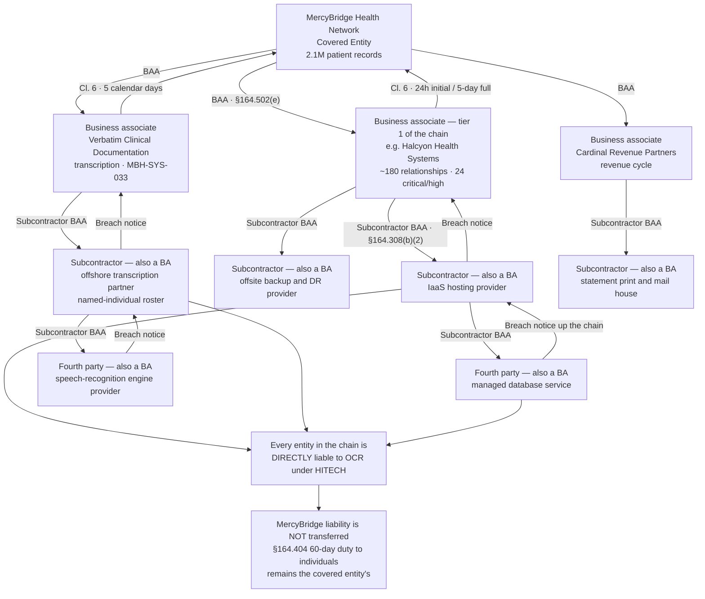

# 06.06 — Subcontractor &amp; Downstream Chain

| Field | Value |
|---|---|
| Document ID | MBH-BAA-SUB-2026-606 |
| Version | 1.0 |
| Date | 2026-07-15 |
| Classification | Confidential — Electronic Protected Health Information (ePHI) // Illustrative Portfolio Sample |
| Owner | Lisa Coleman, General Counsel (owner of Business Associate Agreements) |
| Co-Owner | Daniel Cho, CISO &amp; HIPAA Security Official · Karen Boyd, Chief Compliance Officer |
| Author | Advisory Team (Healthcare GRC / HIPAA) |
| Status | Approved |

## Purpose

HITECH and the 2013 Omnibus Rule settled a question that had been ambiguous: **a subcontractor that creates, receives, maintains or transmits protected health information on behalf of a business associate is itself a business associate**. It is directly liable to OCR. It must have its own business associate agreement — with the business associate above it, not with MercyBridge. And the obligation repeats: a subcontractor's subcontractor is a business associate too. The chain has no defined end.

This document maps that chain for MercyBridge's **24 critical and high-risk business associates**, records how subcontractor disclosure was obtained where it had never been asked for, and closes the visibility gap behind **R-30** — nine hosted services whose downstream chains were unmapped at baseline.

The practical point is uncomfortable and worth stating plainly: **MercyBridge has no privity of contract with a fourth party.** It cannot sue the offshore transcription partner, cannot audit it directly by right, and cannot terminate it. What MercyBridge can do is refuse to accept an undisclosed chain, contract for flow-down and disclosure, verify that flow-down exists, and hold the business associate above accountable for the whole of what sits below it.

## 1. The Rule and Its Consequences

| Proposition | Citation | Consequence for MercyBridge |
|---|---|---|
| A subcontractor of a business associate **is** a business associate | §160.103, definition of "business associate", para. (3)(iii) | The chain is inside HIPAA, not outside it |
| The BA must obtain **satisfactory assurances** from its subcontractors, in writing | §164.308(b)(2), §164.502(e)(1)(ii) | The BAA between BA and subcontractor is the BA's obligation, not MercyBridge's |
| The subcontractor BAA must contain the same **§164.314(a)(2)** elements | §164.314(a)(2)(iii) | Terms cannot be diluted as they flow down |
| The subcontractor is **directly liable** to OCR | HITECH; 2013 Omnibus Rule | Regulatory exposure exists at every link |
| MercyBridge's own **risk analysis** must cover ePHI wherever it is maintained | §164.308(a)(1)(ii)(A) | Downstream storage is inside the analysis; it cannot be excluded because it is remote |
| A subcontractor breach is a **breach of unsecured PHI** that must travel back up the chain | §164.410, §164.404 | The Network's 60-day clock is exposed to a notification path it does not control directly |
| MercyBridge has **no contractual relationship** with the subcontractor | Contract law | Enforcement is indirect — via the BA, via disclosure obligations, via termination rights |

**Fourth-party risk is real exposure with indirect control.** MercyBridge closes that gap contractually rather than pretending it does not exist: A8 in the 2026 template requires 60 days' notice and Network consent before ePHI moves to a new subcontractor or a new jurisdiction, and an undisclosed chain triggers a tier override under 06.03 §1.

## 2. The Chain in Practice

**Read the notification path, not just the contract path.** A fourth-party breach must traverse three notification hops before it reaches MercyBridge, and the Network's own 60-day duty under §164.404 begins when the breach is **discovered** — which includes discovery by an agent. Compressing each hop is the reason Clause 6 requires flow-down of the notification timing, not merely of the notification duty.

## 3. Obtaining Disclosure from the 24 Critical and High-Risk BAs

Subcontractor disclosure had never been systematically requested before this phase. Fifteen of the 24 had disclosed voluntarily or in a SOC 2 subservice section. Nine had not — the same nine hosted services recorded as R-30 at baseline.

| Step | Method | Outcome |
|---|---|---|
| 1 | **Contractual demand** — Cl. 5 of the 2026 template requires a named subcontractor list annually, with 30-day change notice | 131 agreements already carried the clause; the remainder demanded by side letter |
| 2 | **Formal disclosure request** to all 24 critical/high BAs, with a 45-day response window and the tier-override consequence stated | 21 responded within the window |
| 3 | **SOC 2 subservice organisation analysis** — carved-out subservice organisations identified from Section 3 of each report and cross-checked against the disclosure | Identified 6 entities not volunteered in the disclosure response |
| 4 | **Technical corroboration** — DNS, IP allocation, TLS certificate issuers and data-residency evidence for hosted services | Confirmed hosting providers for 4 services where disclosure was vague |
| 5 | **Escalation** to vendor executive sponsors for the 3 non-responders, with the tier override applied | All 3 disclosed within a further 30 days |
| 6 | **Verification of flow-down** — attestation that a conforming BAA exists with each named subcontractor, with the execution date and confirmation of the §164.314(a)(2) clause set | 68 of 71 confirmed with dates; 3 remediated by the BA during the phase |
| 7 | **Register and re-assess** — chain recorded in `trackers/subcontractor-register.xlsx`; material subcontractors folded into the BA's assessment scope | 71 downstream entities registered |

| Disclosure measure | Start of phase | **End of phase** |
|---|---|---|
| Critical/high BAs disclosing a named subcontractor list | 15 of 24 | **24 of 24** |
| Hosted services with an unmapped downstream chain (R-30) | **9** | **0** |
| Downstream entities registered (third and fourth party) | 22 | **71** |
| Downstream entities confirmed under a conforming BAA with the BA above | 18 of 22 | **71 of 71** |
| Subcontractors with access to identifiable ePHI | Unknown | 34 of 71 (37 hold de-identified, limited or encrypted-only data) |
| Subcontractors located outside the United States | Unknown | **4** — all under A7/A8 consent with compensating controls |
| Fourth-party (BA-of-BA-of-BA) entities identified | 0 | **9** |

## 4. The Downstream Map for the Critical Eight

| Critical BA | Disclosed subcontractors | Nature of downstream ePHI | Flow-down verified | Notable |
|---|---|---|---|---|
| C1 Halcyon Health Systems | 6 — IaaS hosting, offsite backup, managed database service, interface engine vendor, tier-2 support partner, secure destruction | Full clinical archive replicated to hosting and backup providers | Yes — all 6, dates on file | Hosting provider is **carved out** of Halcyon's SOC 2; MercyBridge reviews the hosting provider's own SOC 2 separately |
| C2 Meridian Imaging Cloud | 4 — object storage provider, CDN for study delivery, DR region operator, media destruction | DICOM studies at rest; metadata in transit | Yes | CDN reviewed for conduit-versus-BA status; treated as a BA because studies are cached |
| C3 Cardinal Revenue Partners | 5 — statement print and mail house, payment processor, analytics platform, offshore data-entry partner, records storage | Statements contain demographics, service dates and balances | Yes | Offshore partner restricted to a de-identified queue; identified access removed 2026-05 |
| C4 Vaultline Data Protection | 3 — colocation operator, tape vaulting, hardware disposal | Full-copy encrypted archives | Yes | MercyBridge holds the keys for its own vault tier — the fourth-party exposure is to ciphertext only |
| C5 Northgate Clearing Services | 4 — network transport partner, payer-connectivity aggregator, hosting provider, archival storage | Claims with diagnosis and procedure detail | Yes | Aggregator is itself a clearinghouse and a covered entity in its own right for some functions; dual-status documented |
| C6 Rivermont Regional HIE | 3 — hosting provider, master patient index vendor, secure messaging gateway | Longitudinal records across participants | Yes | Governed additionally by the state HIE participation agreement |
| C7 AegisID Cloud Identity | 3 — IaaS provider, SMS/voice delivery aggregator for legacy factors, log analytics service | Identity attributes; authentication telemetry | Yes | SMS aggregator retired as phishing-resistant factors replaced legacy OTP (Wave 1) |
| C8 Bridgeway Patient Engagement | 4 — hosting provider, email/SMS delivery service, content delivery, analytics | Patient demographics, appointment and message content | Yes | Web analytics **restricted to non-PHI pages**; tracking removed from authenticated portal pages |

**Two structural findings.** First, **carve-outs matter more than any other feature of a SOC 2** in chain analysis: the entity actually running the infrastructure is frequently outside the opinion MercyBridge is relying on. Second, **analytics and delivery services are the most common source of unintended downstream disclosure**, which is why C8's tracking configuration was changed rather than merely documented.

## 5. The Offshore Transcription Example

The clearest illustration in the estate, and the one that closes R-32.

| Element | Position |
|---|---|
| Business associate | **Verbatim Clinical Documentation** (H3), MBH-SYS-033, 470,000 dictated documents |
| Subcontractor | Offshore transcription partner performing overnight turnaround |
| Fourth party | Speech-recognition engine provider used by the subcontractor |
| Status of each | **All three are business associates.** The subcontractor and the engine provider are directly liable to OCR |
| What was wrong at baseline | Pre-HITECH BAA with **no flow-down clause**; subcontractor undisclosed; no defined notification window; full narrative clinical documentation reaching offshore staff with no named roster |
| Discovery | Disclosure request plus AP and workflow analysis; confirmed during the D2/D3 reconciliation in 06.02 |
| Interim control | **Offshore access suspended**; volumes throttled; SFTP identity scoped and logged |
| Contractual remedy | Re-papered onto the 2026 template — Cl. 5 flow-down and named disclosure, Cl. 6 5-day clock, A7 residency, A8 jurisdiction consent, A11 cooperation |
| Verified flow-down | Conforming subcontractor BAA executed by Verbatim with the offshore partner, and by the offshore partner with the engine provider; execution dates on file |
| Operational controls | Named-individual roster (37 individuals) reviewed monthly; minimum-necessary field set; virtual desktop with no local storage, clipboard or print; session recording; download blocked |
| Assurance | Verbatim's SOC 2 Type II now covers the offshore delivery centre in scope; MercyBridge-led virtual walkthrough performed 2026-06 |
| Closure | BAA executed **2026-07-09**; R-32 residual **Low (2)**; contributes to R-30 closure |

## 6. Flow-Down Obligations — What Must Travel Down the Chain

| Obligation | Flows down? | Basis | MercyBridge verification |
|---|---|---|---|
| Security Rule compliance for ePHI | **Yes** | §164.314(a)(2)(iii) | Attestation with the subcontractor BAA execution date |
| Permitted uses and disclosures, minimum necessary | **Yes** | §164.504(e)(2)(ii)(A) | Data-set definition reviewed for each material subcontractor |
| Incident and breach notification | **Yes**, and MercyBridge requires the **timing** to flow down, not just the duty | §164.410; Cl. 6 | Notification chain tested in the Phase 07 tabletop |
| Further subcontracting requires the same assurances | **Yes** — recursively | §164.308(b)(2) | Fourth-party disclosure; 9 identified |
| Return or destruction at termination | **Yes** | §164.504(e)(2)(ii)(J) | Certificate required from the BA covering its subcontractors |
| HHS access to books and records | **Yes** | §164.504(e)(2)(ii)(H) | Clause presence confirmed in attestation |
| Encryption to the POL-23 standard | **Yes** by MercyBridge contract (A1), not by rule | Cl. 5 plus A1 | Questionnaire and SOC 2 corroboration |
| Data residency and jurisdiction consent | **Yes** by contract (A7, A8) | Cl. 5 plus A7/A8 | 4 offshore entities consented and controlled |
| Cyber-liability insurance | **No** — held at the BA level, sized to cover downstream failure | A4 | Certificate from the BA |
| MercyBridge's direct audit right | **No** — no privity | — | Exercised indirectly through the BA's own audit right over its subcontractors |

## 7. Risk Movement and Ongoing Governance

| Risk | Entering | Treatment in this document | Residual |
|---|---|---|---|
| **R-30** — subcontractor chain unvisible for nine hosted services | Moderate (9) — likelihood 3 × impact 3 | Disclosure obtained from 24 of 24; 71 downstream entities registered; flow-down verified for all; 9 fourth parties identified | **Low (6)** — likelihood 2 × impact 3 |
| **R-32** — offshore support access exceeds minimum necessary | Low (4) | Named rosters, de-identified queues, VDI with no local storage, session recording, jurisdiction consent | **Low (2)** |
| **R-31** — BA breach notice too late for the 60-day duty | Moderate (8) | Notification timing flowed down through the chain; hops compressed; tested in the Phase 07 tabletop | Moderate (8) → **Phase 07** |
| **R-28** — Halcyon concentration | High (15) | Hosting-provider carve-out addressed by separate review of the hosting provider's SOC 2; independent Network-keyed backup removes single-chain recovery dependency | Contributes to **Moderate (10)** |

| Ongoing control | Frequency | Owner |
|---|---|---|
| Annual subcontractor disclosure refresh from all 24 critical/high BAs | Annual, each Q1 | Lisa Coleman |
| 30-day change notice processed; material changes trigger reassessment | On notice | Marcus Reed |
| SOC 2 carve-out analysis at every report refresh | Annual per BA | Marcus Reed |
| Fourth-party register reconciliation | Semi-annual | Karen Boyd |
| Offshore roster review for the 4 non-US entities | Monthly | Rebecca Stern |
| Notification-chain test as part of the IR exercise | Annual | Daniel Cho |
| Tier override applied where disclosure lapses | On lapse | Karen Boyd |

## Cross-References

| Reference | Relevance |
|---|---|
| 02.03 — ePHI Data-Flow Mapping | External flows, including DF-24a transcription |
| 02.06 — Cloud &amp; Hosted Services | CL-04 and CL-08 — the nine unmapped chains and offshore access |
| 03.07 — Risk Register | R-30, R-31, R-32 |
| 04.05 — Information Access Management | Minimum necessary applied to offshore data sets |
| 04.10 — Business Associate Contracts | The §164.308(b)(2) flow-down obligation as first stated |
| 05.05 / 05.08 — Access Control &amp; Authentication | Brokered just-in-time vendor access and scoped offshore identities |
| 06.03 — Risk Tiering &amp; Criticality | The undisclosed-chain tier override |
| 06.04 — Business Associate Agreements | Clause 5 flow-down and terms A7, A8 |
| 06.05 — Due Diligence &amp; Assessment | Carve-out and subservice organisation analysis |
| 06.07 — Cloud Service Providers | Hosting providers as the most common subcontractor |
| Phase 07 — Incident Response &amp; Breach Notification | The multi-hop notification path and the 60-day duty |

---
[⬅ Previous](06.05-due-diligence-and-assessment.md) · [🏠 Phase README](06.00-README.md) · [Next ➡](06.07-cloud-service-providers.md)
