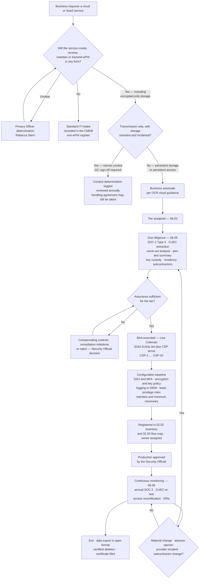

# 06.07 — Cloud Service Providers

| Field | Value |
|---|---|
| Document ID | MBH-BAA-CSP-2026-607 |
| Version | 1.0 |
| Date | 2026-07-15 |
| Classification | Confidential — Electronic Protected Health Information (ePHI) // Illustrative Portfolio Sample |
| Owner | Daniel Cho, Chief Information Security Officer &amp; HIPAA Security Official (security assessment) |
| Co-Owner | Lisa Coleman, General Counsel (CSP agreements) · Anthony Ruiz, CIO |
| Author | Advisory Team (Healthcare GRC / HIPAA) |
| Status | Approved |

## Purpose

**38 of MercyBridge's 68 ePHI systems** have a cloud or vendor-hosted component — 30 fully hosted or SaaS and 8 hybrid. Among them is the single most consequential relationship the Network has: the vendor-hosted **Halcyon Health EHR**, holding the entire **2.1 million-record** clinical archive.

This document applies the business associate programme to that estate. It records OCR's position that a cloud service provider maintaining ePHI **is a business associate even where it cannot view the data**, the narrow limits of the conduit exception, the shared-responsibility model that determines who must do what, the CSP-specific contract requirements, and the **vendor-held encryption key problem** carried forward from 05.10 §5 — the most consequential unresolved cryptographic question in the estate.

Outsourcing infrastructure does not outsource obligation. MercyBridge remains liable for a risk analysis covering ePHI held on its behalf and for notifying individuals within 60 days of a breach, wherever that breach occurred.

## 1. The OCR Position on Cloud Service Providers

| OCR position | Consequence for MercyBridge |
|---|---|
| A CSP that creates, receives, maintains or transmits ePHI on behalf of a covered entity **is a business associate**; a BAA is required | All 38 hosted services hold a BAA. No exception has ever been granted |
| **BA status does not depend on the CSP's ability to view the data.** "No-view services" — where the CSP stores only ciphertext and holds no decryption key — are still business associate relationships | Encryption reduces risk; it does not remove regulatory status. The Network's encrypted backup vault provider is a BA |
| Lack of a key is **not** a defence to Security Rule obligations; the CSP must still protect availability and integrity, and must still have a risk analysis, access controls and audit controls | Availability failures at a no-view CSP are still HIPAA failures |
| The **conduit exception is narrow**: transmission-only, with storage that is transient and incidental — the postal-service analogy. Persistent storage defeats it | A CDN that caches imaging studies is a BA; a carrier moving encrypted packets is not |
| A CSP is **directly liable under HITECH** for its own Security Rule failures and for breach notification to the covered entity | Two accountable parties, not one |
| The covered entity must perform **its own** risk analysis covering ePHI in the CSP environment; it cannot inherit the CSP's | The 38 services are inside the Phase 03 analysis |
| If a CSP suffers a breach of unsecured ePHI, notification duties flow back to the covered entity under §164.410 and §164.404 | The 5-calendar-day contractual clock exists to protect the 60-day duty |
| A CSP that becomes aware it is maintaining ePHI without a BAA is exposed regardless of what its customer told it | Reinforces the tie-breaker rule in 06.02 §1 |

**MercyBridge's single operating rule: if a service touches ePHI in any form, encrypted or not, a BAA is executed before production use.**

## 2. The Hosted Estate

| Service model | Systems | What MercyBridge retains | Predominant tier |
|---|---|---|---|
| SaaS — multi-tenant | 26 | Configuration, identity, roles, data governance, log review | High / Moderate |
| Vendor-managed dedicated hosting | 4 | Application configuration, identity, data governance | **Critical** |
| PaaS | 3 | Application code and configuration, identity, encryption choices | High |
| IaaS | 5 | Guest OS, patching, application, encryption, identity — nearly everything above the hypervisor | **Critical** / High |
| **Total** | **38** | 30 fully hosted plus 8 hybrid | |

| Assurance measure across the 38 | Position |
|---|---|
| BAA executed and current | **38 of 38** (35 at Phase 04 close; MBH-SYS-029, -033, -058 closed in 06.04) |
| SOC 2 Type II current within 12 months | 33 |
| SOC 2 Type I only, with supplementary evidence | 2 |
| No SOC 2 — alternative assurance pathway (06.05 §5) | 3, all Tier 3 or 4 |
| HITRUST CSF certification | 11 |
| ISO/IEC 27001 (supplementary) | 8 |
| Independent penetration test summary provided | 24 |
| Subcontractor list disclosed | 29 → **38** (closed in 06.06) |
| US-only data residency committed | 36; 2 permit offshore support access under A7/A8 consent |
| **Customer-managed encryption keys available and in use** | **9** |
| Encrypted at rest | 35 fully, 3 partial (Wave 2) |
| TLS 1.2+ enforced in transit | 38 of 38 |
| Audit logs exported to the MercyBridge SIEM | 34; 4 remediating |
| MFA enforced on all administrative and remote access | 34; 4 remediating (Wave 1) |

## 3. Shared Responsibility — Who Must Do What

A shared-responsibility model is not a division of liability. It is a division of **execution**, and MercyBridge's liability spans the whole of it.

| Control domain | SaaS | PaaS | IaaS | Dedicated hosting |
|---|---|---|---|---|
| Physical and environmental security | Provider | Provider | Provider | Provider |
| Host, hypervisor and network infrastructure | Provider | Provider | Provider | Provider |
| Guest OS patching | Provider | Provider | **MercyBridge** | Provider |
| Application patching and version currency | Provider | Shared | **MercyBridge** | Shared |
| Application security configuration | **MercyBridge** | **MercyBridge** | **MercyBridge** | **MercyBridge** |
| Identity, authentication, MFA enforcement | **MercyBridge** | **MercyBridge** | **MercyBridge** | **MercyBridge** |
| Role design, least privilege, access recertification | **MercyBridge** | **MercyBridge** | **MercyBridge** | **MercyBridge** |
| Encryption at rest — enablement and **key policy** | Shared | Shared | **MercyBridge** | Shared |
| Encryption in transit | Provider | Shared | **MercyBridge** | Shared |
| Audit log generation | Provider | Shared | **MercyBridge** | Provider |
| Audit log review and SIEM ingestion | **MercyBridge** | **MercyBridge** | **MercyBridge** | **MercyBridge** |
| Data classification, minimum necessary, retention | **MercyBridge** | **MercyBridge** | **MercyBridge** | **MercyBridge** |
| Backup, restoration testing, RTO/RPO validation | Shared | Shared | **MercyBridge** | Shared |
| Incident detection inside the service | Provider | Shared | **MercyBridge** | Provider |
| **Breach determination and notification to individuals** | **MercyBridge** | **MercyBridge** | **MercyBridge** | **MercyBridge** |
| Subcontractor governance below the provider | Provider, with flow-down | Provider | Provider | Provider |

**The recurring pattern: configuration, identity and data governance are MercyBridge's in every model.** Most reported healthcare cloud incidents originate in customer-side misconfiguration or credential compromise, not provider infrastructure failure — which is why the Phase 04 and Phase 05 control weighting sits where it does, and why CUEC mapping (06.05 §3) is treated as a control rather than paperwork.

## 4. The Halcyon Vendor-Held-Key Problem

Carried forward from **05.10 §5** and open item **O-6**. This is the most consequential unresolved cryptographic question in the estate, and it is stated rather than buried.

| Question | Position |
|---|---|
| Is the ePHI encrypted at rest? | **Yes** — Halcyon encrypts the full 2.1M-record archive |
| Who generates and holds the keys? | **Halcyon**, inside its own HSM infrastructure. MercyBridge neither holds nor escrows them |
| Does BA status depend on key custody? | **No.** Halcyon is a business associate irrespective of who holds keys — and would remain one even in a no-view configuration |
| Does the §164.402 breach **safe harbour** apply if Halcyon is breached? | Only if the ePHI was encrypted **and the keys were not compromised in the same incident**. Where the application layer is compromised, the safe harbour will generally **not** apply and a §164.402 breach analysis is required |
| Can MercyBridge recover its data without Halcyon? | **Yes, for the archive** — an independent full copy is replicated to the Network's immutable vault under **MercyBridge-held keys**. Not for the running application |
| What is being pursued? | **Customer-managed keys** at the FY2027 renewal; escrow of key material as the interim ask; contractual notice of any key-management architecture change |
| Interim compensating controls | Named-list vendor administrative access with MFA at the MercyBridge broker; session recording of Halcyon administrative activity; Halcyon audit logs ingested into the Network SIEM; independent Network-keyed backup; tested downtime and read-only continuity capability |
| Residual position | Accepted and monitored; re-tested at renewal; reported to the Board in the quarterly pack |

### 4.1 Key Custody Across the Hosted Estate

| Custody model | Services | Safe-harbour posture | MercyBridge action |
|---|---|---|---|
| MercyBridge-held keys (customer-managed, Network HSM/KMS) | 9 | Strongest — provider compromise alone exposes ciphertext | Preferred model; required for all new Critical engagements |
| Provider-managed keys with contractual controls and change notice | 26 | Dependent on the provider's own key protection | Compensating controls; CMK pursued at renewal |
| Provider-managed with a documented "no-view" architecture | 3 | Provider cannot read plaintext, but remains a BA | Verified in the SOC 2; BAA in force regardless |
| **Halcyon — provider-managed, no CMK option in the current release** | 5 systems (MBH-SYS-001 … -005) | **Weakest for the highest volume** — the concentration inside the concentration | Open item O-6; the reason R-28 cannot fall below Moderate |

## 5. CSP Onboarding and BAA Requirements

### 5.1 CSP-Specific Contract Requirements

Additional to the §164.314(a) clause set in 06.04.

| # | Requirement | Rationale | Tier applicability |
|---|---|---|---|
| CSP-1 | Encryption at rest to POL-23 (AES-256) and TLS 1.2+ in transit, with **disclosure of the key custody model** and notice of any change | Safe harbour and key risk | All |
| CSP-2 | **Customer-managed keys** where the platform supports them; escrow where it does not | 05.10 position; the R-28 lever | Critical / High |
| CSP-3 | **US-only storage and processing**; offshore support access only with prior written consent, named rosters and session recording | R-32 | All |
| CSP-4 | Named **subservice organisation / subcontractor disclosure** with 60-day notice before ePHI reaches a new provider or jurisdiction | R-30; 06.06 | Critical / High |
| CSP-5 | **Audit log export** to the MercyBridge SIEM in near real time, with retention aligned to the Network's six-year documentation requirement | §164.312(b); §164.316(b)(2)(i) | Critical / High |
| CSP-6 | **MFA enforced** on all administrative and remote access to the service, provider-side included | NPRM-forward; R-01 | All |
| CSP-7 | **Availability commitments** — RTO/RPO with service credits, plus participation in an annual restoration test for Critical services | Availability is a Security Rule property; R-28 | Critical |
| CSP-8 | **Bulk data export** in a documented open format at no incremental charge, plus source/configuration escrow for Critical hosted platforms | Exit and insolvency risk | Critical |
| CSP-9 | **Certified deletion** at termination within 30 days, covering backups and subcontractor copies, with a signed certificate | R-33; §164.504(e)(2)(ii)(J) | All |
| CSP-10 | **Tenant isolation evidence** in multi-tenant services, and notice of any architecture change affecting isolation | Multi-tenancy is the distinctive cloud risk | All SaaS/PaaS |

## 6. Cloud Risk Themes and Their Treatment

| # | Theme | Services | Treatment | Risk |
|---|---|---|---|---|
| CL-01 | Vendor-hosted EHR concentration | MBH-SYS-001 … -005 | 06.03 §5 nine-measure plan; Network-keyed independent backup; tested restoration; escrow and export rights | **R-28 High (15) → Moderate (10)** |
| CL-02 | Customer-side misconfiguration exposing ePHI | All 38 | Hardened baselines, configuration monitoring, quarterly review, CUEC mapping | R-41 |
| CL-03 | Privileged cloud administrator credential compromise | All 38 | MFA on all administrative access, PAW-only administration, brokered just-in-time access, session logging | R-24, R-34 |
| CL-04 | Incomplete subcontractor visibility | 9 → **0** | Disclosure obtained from 24 of 24 BAs; 71 downstream entities registered (06.06) | **R-30 → Low (6)** |
| CL-05 | Provider breach triggering Network notification duties | All 38 | 24-hour/5-day contractual clock; escalation contacts; Phase 07 tabletop participation | R-31 → Phase 07 |
| CL-06 | Log retention shorter than the six-year requirement | 12 → 4 | SIEM export; contractual retention minimums at renewal | R-55 |
| CL-07 | Data return and certified deletion at exit | All 38 | CSP-9 with a 30-day certificate covering backups and subcontractor copies | **R-33 → Low (2)** |
| CL-08 | Offshore support access to ePHI | 2 | A7/A8 consent, named rosters, de-identified queues, VDI with no local storage, session recording | **R-32 → Low (2)** |
| CL-09 | Cloud outage halting clinical workflow | Tier 1 and 2 hosted | Downtime procedures, read-only cache, tested contingency, CSP-7 commitments | R-50; §164.308(a)(7) |
| CL-10 | Multi-tenant isolation failure | 26 SaaS + 3 PaaS | CSP-10 isolation evidence; penetration test summaries; architecture change notice | R-24 |

## 7. NPRM Readiness Across the Hosted Estate

| 2025 NPRM proposed requirement | Position across the 38 services |
|---|---|
| Mandatory asset inventory | Complete — all 38 in 02.02 with hosting model, tier and owner |
| Mandatory network map | Complete — egress paths and boundaries in 02.05 |
| Mandatory encryption at rest and in transit | 35 encrypted at rest, 3 partial (Wave 2); 38 of 38 enforce TLS 1.2+ |
| Mandatory MFA | 34 enforce MFA on all administrative and remote access; 4 remediating in Wave 1 |
| Annual vulnerability scanning and penetration testing | Provider-performed for SaaS with summaries obtained; Ironwood Security Labs for the IaaS tiers |
| Removal of the addressable/required distinction | All cloud controls treated as required; no addressable deferrals recorded |
| **Written verification of BA technical safeguards** | Delivered by the annual SOC 2 refresh, CUEC re-testing and the tiered attestation cycle in 06.08 |
| Network segmentation | Hosted services terminate into defined zones; default-deny egress; 68 of 68 micro-segmented at Wave 2 |

## Cross-References

| Reference | Relevance |
|---|---|
| 02.02 — ePHI System Inventory | The 68 systems and the 38 with a hosted component |
| 02.05 — Network Architecture &amp; Segmentation | Egress paths and DMZ boundaries for hosted services |
| 02.06 — Cloud &amp; Hosted Services | The inventory and shared-responsibility baseline this document governs |
| 03.07 — Risk Register | R-28, R-30, R-31, R-32, R-33, R-41 |
| 04.08 — Contingency Plan | Downtime procedures and hosted-service continuity |
| **05.10 — Encryption &amp; Key Management** | The Halcyon vendor-held-key analysis and open item O-6 |
| 05.12 — Control-to-Risk Traceability | R-28 as the last High risk, handed to this phase |
| 06.03 — Risk Tiering &amp; Criticality | Tiering applied to the hosted estate; the R-28 treatment plan |
| 06.04 — Business Associate Agreements | The §164.314(a) clause set these CSP terms extend |
| 06.05 — Due Diligence &amp; Assessment | SOC 2 reading method, CUECs and carve-outs |
| 06.06 — Subcontractor &amp; Downstream Chain | Hosting providers as the most common carved-out subcontractor |
| 06.08 — Ongoing Monitoring &amp; Oversight | Steady-state monitoring of the hosted estate |
| Phase 07 — Incident Response &amp; Breach Notification | Provider breach pathway into the §164.404 60-day duty |
| Phase 08 — HITRUST &amp; Independent Assessment | Independent validation of hosted-service assurance |

---
[⬅ Previous](06.06-subcontractor-and-downstream-chain.md) · [🏠 Phase README](06.00-README.md) · [Next ➡](06.08-ongoing-monitoring-and-oversight.md)
