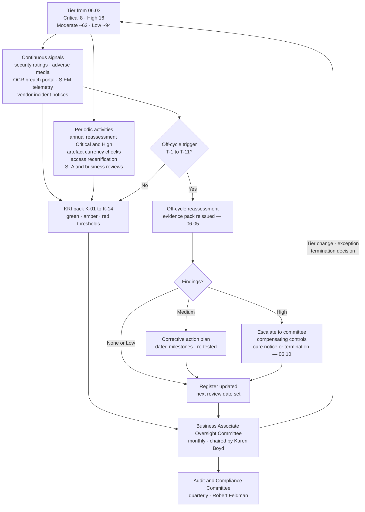

# 06.08 — Ongoing Monitoring &amp; Oversight

| Field | Value |
|---|---|
| Document ID | MBH-BAA-MON-2026-608 |
| Version | 1.0 |
| Date | 2026-07-15 |
| Classification | Confidential — Electronic Protected Health Information (ePHI) // Illustrative Portfolio Sample |
| Owner | Karen Boyd, Chief Compliance Officer (programme owner) |
| Co-Owner | Daniel Cho, CISO &amp; HIPAA Security Official · Marcus Reed, Information Security Manager (KRI production) |
| Author | Advisory Team (Healthcare GRC / HIPAA) |
| Status | Approved |

## Purpose

Due diligence is a photograph. It records the state of a business associate on the day the evidence was read, and it begins ageing immediately. A SOC 2 Type II covering the year to 2025-12-31 says nothing about the layoff in March, the acquisition in April, the new offshore subcontractor in May, or the credential-stuffing campaign in June. **~180 business associates** assessed once and then filed is a programme that will be surprised.

This document defines how MercyBridge keeps the assessment current between assessments: what is monitored continuously, what is monitored periodically, how assurance artefacts are tracked so they never silently expire, which external signals are watched, the **key risk indicators and their thresholds**, and — the operative question — **what forces a reassessment out of cycle**.

Monitoring intensity is not uniform. It reads its cadence from the tier set in 06.03, because the point of tiering is to make the difference in effort real rather than rhetorical.

## 1. The Monitoring Model — Continuous vs Periodic by Tier

| Monitoring activity | Critical (8) | High (16) | Moderate (~62) | Low (~94) |
|---|---|---|---|---|
| **Security-rating service score** | Continuous, daily refresh | Continuous, daily refresh | Continuous, monthly review | Not monitored |
| **Adverse media and breach screening** | Continuous, automated alerting | Continuous, automated alerting | Monthly batch screen | Annual batch screen |
| **HHS OCR breach portal screening** | Continuous | Continuous | Monthly | Annual |
| **Audit-log telemetry into the MercyBridge SIEM** | Required and operating (8 of 8) | Required where technically feasible (11 of 16) | Not required | Not required |
| **Vendor administrative-access recertification** | Quarterly | Semi-annual | Annual | On renewal |
| **SLA and performance review with the vendor** | Quarterly business review | Semi-annual | Annual | None |
| **Assurance artefact currency check** (SOC 2, bridge letter, insurance, pen test) | Monthly automated check | Monthly automated check | Quarterly | Annual |
| **Subcontractor change notice processing** | On receipt; 30-day notice contractual | On receipt | On receipt | Flow-down clause only |
| **Full reassessment** | **Annual** | **Annual** | Biennial | On renewal |
| **On-site or virtual control walkthrough** | Annual for the top 3 by volume; on cause otherwise | On cause | No | No |
| **KRI pack** | Named individually in the quarterly pack | Named individually | Aggregate | Aggregate |
| **Committee visibility** | Standing agenda item, monthly | By exception | Aggregate, quarterly | Annual roll-up |

**Continuous does not mean automated-and-forgotten.** Every continuous signal has a named human owner and a defined disposition path; an alert that no one is accountable for closing is not monitoring, it is noise with a subscription fee.

## 2. Annual Reassessment for Critical and High Business Associates

All **24 critical and high-risk business associates** are reassessed annually against the full 214-question instrument and the tiered evidence set in 06.05 §1. Reassessment is scheduled by anniversary of the last completed assessment, not by calendar quarter, so the population is levelled across the year rather than compressed into Q1.

| Reassessment element | Requirement | Evidence retained |
|---|---|---|
| Questionnaire refresh | Full 214 questions; deltas against the prior year highlighted and explained | Completed instrument with variance commentary |
| Independent assessment report | Current SOC 2 Type II or HITRUST, period ending within 12 months | Report PDF, opinion page extract, exception log |
| **Bridge letter** | Covering the gap from report period end to the assessment date | Signed letter on vendor letterhead |
| CUEC re-mapping | Complementary user entity controls re-extracted; MercyBridge-side implementation re-confirmed | Updated CUEC mapping sheet |
| Penetration test summary | Dated within 12 months, with remediation status of prior findings | Executive summary and remediation attestation |
| Subcontractor list | Named entities re-confirmed; additions and removals reconciled against the 71 registered downstream entities | Signed disclosure and reconciliation note |
| Insurance certificate | Cyber-liability at tier minimum, current | Certificate of insurance |
| Breach and enforcement history | Refreshed 12-month look-back | Screening record with disposition |
| Prior-year finding closure | Every open corrective action re-tested, not merely re-asserted | Test evidence per finding |
| Tier re-score | All four factors re-evaluated; overrides re-applied | Updated register entry |

| Reassessment status at 2026-07-15 | Count |
|---|---|
| Critical/high BAs with a completed current assessment | **24 of 24** |
| Reassessments completed within the scheduled month | 21 of 24 |
| Reassessments resulting in a tier change | 2 (both upward, override-driven) |
| Reassessments producing at least one new finding | 9 |
| Reassessments escalated to the Oversight Committee | 3 |

## 3. Assurance Artefact Refresh Tracking

The most common failure in third-party programmes is not a bad report — it is a **good report that quietly expired**. MercyBridge tracks every artefact by expiry date in `trackers/assurance-currency.xlsx`, with automated 90/60/30-day reminders to the relationship owner and escalation to the Oversight Committee at 0 days.

| Critical BA | Report type | Period covered | Bridge letter through | Next report expected | Currency status |
|---|---|---|---|---|---|
| C1 Halcyon Health Systems | SOC 2 Type II + HITRUST r2 | 2025-10-01 → 2026-03-31 | 2026-06-30 | 2026-10 (next Type II) | Current |
| C2 Meridian Imaging Cloud | SOC 2 Type II | 2025-07-01 → 2026-06-30 | n/a — report current | 2027-07 | Current |
| C3 Cardinal Revenue Partners | SOC 2 Type II | 2025-01-01 → 2025-12-31 | 2026-06-30 | 2026-12 | Current — bridge letter on file |
| C4 Vaultline Data Protection | SOC 2 Type II | 2025-06-01 → 2026-05-31 | n/a | 2027-06 | Current |
| C5 Northgate Clearing Services | SOC 2 Type II + HITRUST i1 | 2025-04-01 → 2026-03-31 | 2026-06-30 | 2027-04 | Current |
| C6 Rivermont Regional HIE | SOC 2 Type II | 2025-01-01 → 2025-12-31 | 2026-06-30 | 2026-12 | Current — bridge letter on file |
| C7 AegisID Cloud Identity | SOC 2 Type II + ISO/IEC 27001 | 2025-09-01 → 2026-02-28 | 2026-06-30 | 2026-09 | Current |
| C8 Bridgeway Patient Engagement | SOC 2 Type II | 2025-05-01 → 2026-04-30 | n/a | 2027-05 | Current |

**A bridge letter is not a substitute for a report.** MercyBridge accepts one only where it (a) names the report it bridges, (b) covers a gap of no more than nine months, (c) affirms no material change to the control environment, and (d) discloses any known control failure in the gap period. A bridge letter offered in place of an overdue report is refused and the relationship is escalated.

| Artefact currency across the estate | Current | Expiring ≤90 days | Lapsed |
|---|---|---|---|
| SOC 2 Type II / HITRUST (Critical + High) | 24 | 4 | **0** |
| Bridge letters where required | 5 | 1 | 0 |
| Penetration test summaries (Critical + High) | 20 | 3 | 1 — H14, due 2026-08-31 |
| Cyber-liability certificates (all tiers assessed) | 178 | 6 | 2 — Low tier, chased |
| Subcontractor disclosures (Critical + High) | 24 | — | **0** |

## 4. External Signal Monitoring

| Signal source | What it detects | Frequency | Disposition owner | Action on a hit |
|---|---|---|---|---|
| **Security-rating service** (externally observable posture: certificates, exposed services, patching cadence, leaked credentials) | Deterioration in a vendor's internet-facing hygiene | Daily for Critical/High | Marcus Reed | Score drop below threshold opens a query to the vendor within 5 business days |
| **Adverse media screening** (litigation, enforcement, financial distress, executive departure, layoffs) | Instability that precedes control failure | Continuous for Critical/High | Karen Boyd | Material hit triggers an off-cycle review under §6 |
| **HHS OCR breach portal** (500+ individual breaches) | A vendor's reportable breach at any customer, not only MercyBridge | Continuous | Karen Boyd | Tier override applied; diligence refreshed within 10 business days (06.03 §6) |
| **State attorney-general breach notices** | Sub-500 breaches not on the federal portal | Monthly | Karen Boyd | Same as above |
| **Vendor security advisories and CVE feeds** for products in the ePHI estate | Exploitable defects in vendor-supplied software | Continuous | Marcus Reed | Routed to vulnerability management; vendor patch SLA enforced contractually |
| **Financial and ownership monitoring** (credit deterioration, acquisition, private-equity recapitalisation) | Change of control, which frequently changes the subcontractor chain | Quarterly for Critical/High | Michelle Tran | Change of control is a contractual notice event and an off-cycle trigger |
| **Vendor self-reported incident notices** (Clause 6) | Incidents at the vendor affecting MercyBridge ePHI | On receipt, 24/7 intake | Daniel Cho | Routed immediately to 06.09 |
| **Internal service and SLA telemetry** | Availability and performance degradation that may indicate control stress | Continuous | Anthony Ruiz | Quarterly business review; repeated breach triggers remedies |

**Why breach monitoring of other customers matters.** A vendor's breach at another covered entity is the single most informative external signal available, because it is a tested demonstration of control failure rather than an assertion about control design. MercyBridge treats it as a tier override, not as news.

## 5. Performance, SLA and Relationship Review

Security oversight and commercial oversight are run in the same forum, deliberately. A vendor missing its availability commitments and a vendor missing its patching commitments are usually the same vendor.

| Review | Participants | Cadence | Standing content |
|---|---|---|---|
| **Quarterly business review** (Critical) | Executive sponsor, business owner, security owner, vendor account and security leads | Quarterly | SLA attainment, incidents, open findings, roadmap, subcontractor changes, KRI dashboard |
| **Semi-annual review** (High) | Business owner, security owner, vendor account lead | Semi-annual | SLA attainment, open findings, artefact currency |
| **Annual review** (Moderate) | Contract manager | Annual | Attestation refresh, insurance, renewal decision |
| **Service credit and remedy review** | Lisa Coleman, Anthony Ruiz | Quarterly | RTO/RPO attainment against contract; credits claimed; repeated-failure termination rights |
| **Restoration test observation** (C1, C2, C4) | Daniel Cho, Anthony Ruiz, vendor engineering | Annual | Full-scale restore with MercyBridge observers — the measure-2 obligation in the R-28 plan |

## 6. Key Risk Indicators and Thresholds

Reported to the Business Associate Oversight Committee monthly and to the Audit &amp; Compliance Committee quarterly.

| # | Key risk indicator | Definition | Green | Amber | Red | At 2026-07-15 |
|---|---|---|---|---|---|---|
| K-01 | BAA coverage of BA-involved ePHI systems | Conforming executed BAAs ÷ 47 systems | 100% | 98–99% | <98% | **100% (47 of 47)** — Green |
| K-02 | Critical/high BAs with a current assessment | Completed within 12 months ÷ 24 | 24 | 22–23 | ≤21 | **24 of 24** — Green |
| K-03 | Lapsed assurance artefacts (Critical/High) | Count of expired SOC 2, bridge letter, pen test or insurance | 0 | 1–2 | ≥3 | **1** (H14 pen test) — Amber |
| K-04 | Open High-severity diligence findings | Count across all tiers | 0 | 1 | ≥2 | **0** — Green |
| K-05 | Open Medium findings past their due date | Count | 0 | 1–2 | ≥3 | **0** — Green |
| K-06 | Mean time from BA incident notice to MercyBridge triage decision | Hours | ≤4 | 4–12 | >12 | **2.6 h** — Green |
| K-07 | BA incident notices received within the contractual window | Notices on time ÷ notices received | 100% | 90–99% | <90% | **4 of 4 (100%)** — Green |
| K-08 | Vendors onboarded with ePHI before diligence completion | Count in the quarter | 0 | 1 | ≥2 | **0** — Green |
| K-09 | Security-rating score below the contractual floor | Count of Critical/High BAs | 0 | 1–2 | ≥3 | **1** (H13, improving) — Amber |
| K-10 | Subcontractor disclosures current | Critical/high BAs with a disclosure ≤12 months old | 24 | 22–23 | ≤21 | **24 of 24** — Green |
| K-11 | Downstream entities with verified flow-down BAAs | Verified ÷ 71 registered | 100% | 95–99% | <95% | **71 of 71** — Green |
| K-12 | Vendor privileged accounts failing recertification | Accounts not re-attested at the due date | 0 | 1–5 | >5 | **0** — Green |
| K-13 | Terminations closed with a certificate of destruction | Certificates ÷ terminations | 100% | 90–99% | <90% | **7 of 7** — Green |
| K-14 | Critical BA RTO/RPO commitments met in test | Tests passed ÷ tests run | 100% | — | <100% | 3 of 3 in-scope tests passed to date — Green |

**Amber and red are not informational.** An amber KRI requires a named remediation owner and a date at the next committee; a red KRI requires an off-cycle reassessment under §7 and is reported to the Audit &amp; Compliance Committee whether or not the quarter has closed.

## 7. What Triggers an Off-Cycle Reassessment

| # | Trigger | Evidence refresh required | Timescale | Authority |
|---|---|---|---|---|
| T-1 | **Reportable breach at the BA** — affecting MercyBridge or any other customer | Full reassessment; root-cause narrative; remediation evidence | Initiate within 10 business days | Daniel Cho |
| T-2 | **Qualified, adverse or disclaimed opinion** in a new assurance report | Full report review; compensating-control analysis | 15 business days | Marcus Reed |
| T-3 | **Change of control** — acquisition, merger, majority investment | Reassessment plus subcontractor and residency re-declaration | Before the effective date where notice permits | Lisa Coleman |
| T-4 | **New or changed subcontractor** touching identifiable ePHI, or a new jurisdiction | Chain re-mapping; flow-down verification; A8 consent decision | Within the 30/60-day notice window | Lisa Coleman |
| T-5 | **Material change in ePHI volume or access** — ±25% volume, or new privileged access granted | Tier re-score (F1/F2) and evidence set adjusted | 30 days | Marcus Reed |
| T-6 | **Security-rating score below the contractual floor** for 30 consecutive days | Targeted technical review and vendor remediation plan | 30 days | Marcus Reed |
| T-7 | **Sustained SLA failure** — two consecutive quarters below commitment | Joint review; service credits; continuity re-test | Next quarterly review | Anthony Ruiz |
| T-8 | **Adverse media of substance** — enforcement action, insolvency filing, mass layoff in the delivery organisation | Financial viability plus control-stability review | 20 business days | Michelle Tran |
| T-9 | **Lapsed assurance artefact** past the 0-day escalation | Currency restored or compensating controls imposed | Immediate | Karen Boyd |
| T-10 | **Regulatory change** — e.g. the 2025 Security Rule NPRM finalising | Population-wide gap assessment against new requirements | Per the compliance date | Karen Boyd |
| T-11 | **Internal audit or HITRUST finding** naming the vendor | Scoped reassessment of the cited domain | 30 days | Priya Anand |

## 8. Oversight Governance and Calendar

| Forum | Chair | Cadence | Decisions held |
|---|---|---|---|
| **Business Associate Oversight Committee** | Karen Boyd (Coleman, Cho, Stern, Tran, Ruiz) | Monthly | Tier changes, risk acceptances, exception approvals, termination recommendations, escalations under §164.314(a)(1)(ii) |
| Vendor security review working group | Marcus Reed | Fortnightly | Evidence review disposition, finding severity, CAP acceptance |
| Quarterly business reviews (Critical) | Business owner | Quarterly | SLA, roadmap, incidents, credits |
| Audit &amp; Compliance Committee | Robert Feldman | Quarterly | KRI pack, named Critical BA status, R-28 position, Board reporting |
| Annual model review | Michelle Tran | Annual, with the risk re-analysis | Validity of tiering factors, thresholds and KRI calibration |

| Month | Standing oversight activity |
|---|---|
| Q1 | Population re-scoring; annual subcontractor disclosure request to all 24; model review |
| Q2 | Insurance certificate sweep; CUEC re-mapping for the hosted estate |
| Q3 | Restoration test observation (C1, C2, C4); notification-chain test with Phase 07 tabletop |
| Q4 | Renewal and exit-plan review; Board pack; forward-year assessment schedule published |
| Monthly | Committee; KRI pack; artefact currency check; change-notice processing |

## Cross-References

| Reference | Relevance |
|---|---|
| 03.07 — Risk Register | R-28, R-29, R-30, R-31, R-32, R-33 monitored here |
| 03.10 — Ongoing Risk Management | The annual re-analysis this cadence feeds |
| 04.09 — Evaluation &amp; Periodic Review | §164.308(a)(8) periodic evaluation, of which BA oversight is part |
| 04.10 — Business Associate Contracts | The contractual right to demand refreshed evidence |
| 06.03 — Risk Tiering &amp; Criticality | The tier that sets every cadence in §1 |
| 06.04 — Business Associate Agreements | Clause 6 notification and A2/A3 evidence rights |
| 06.05 — Due Diligence &amp; Assessment | The assessment this document keeps current |
| 06.06 — Subcontractor &amp; Downstream Chain | The 71 downstream entities and change-notice processing |
| 06.07 — Cloud Service Providers | CSP-5 log export and CSP-7 availability commitments |
| 06.09 — BA Incident &amp; Breach Coordination | Where a monitored signal becomes an incident |
| 06.11 — Control-to-Risk Traceability | Monitoring as a treatment measure for R-28 and R-30 |
| Phase 08 — HITRUST &amp; Independent Assessment | Beacon Assurance tests the monitoring evidence |

---
[⬅ Previous](06.07-cloud-service-providers.md) · [🏠 Phase README](06.00-README.md) · [Next ➡](06.09-business-associate-incident-and-breach-coordination.md)
