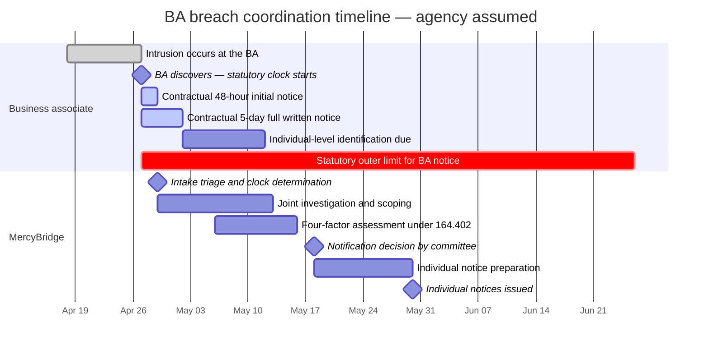

# 06.09 — Business Associate Incident &amp; Breach Coordination

| Field | Value |
|---|---|
| Document ID | MBH-BAA-INC-2026-609 |
| Version | 1.0 |
| Date | 2026-07-15 |
| Classification | Confidential — Electronic Protected Health Information (ePHI) // Illustrative Portfolio Sample |
| Owner | Karen Boyd, Chief Compliance Officer |
| Co-Owner | Lisa Coleman, General Counsel · Daniel Cho, CISO &amp; HIPAA Security Official · Rebecca Stern, Chief Privacy Officer |
| Author | Advisory Team (Healthcare GRC / HIPAA) |
| Status | Approved |

## Purpose

Most business associate breaches are discovered by the business associate, investigated by the business associate, and notified to the covered entity at the business associate's convenience — and then the **covered entity** has to tell 2.1 million people about it, on a clock it did not start and may not have known was running.

This document sets out how MercyBridge coordinates with a business associate when the vendor has an incident: the statutory timing under **§164.410**, the agency doctrine that makes the timing far more dangerous than it first appears, the contractual compression MercyBridge negotiates to survive it, the intake and triage of vendor-reported incidents, joint investigation and the four-factor assessment, who actually notifies individuals, and the handover into **Phase 07**.

This is the document that treats **R-31 — business associate breach notification arrives too late to meet the 60-day duty to individuals** (Moderate, 8). Phase 06 compresses the contractual path; Phase 07 tests it.

## 1. The Rule — and the Timing Trap

| Provision | What it says | Practical consequence |
|---|---|---|
| **§164.410(a)(1)** | Following discovery of a breach of unsecured PHI, a business associate **shall notify the covered entity** | The duty runs to MercyBridge, not to individuals |
| **§164.410(b)** | Notification **without unreasonable delay and in no case later than 60 calendar days** after discovery | 60 days is an outer limit, not an allowance — "without unreasonable delay" is the operative standard |
| **§164.410(a)(2)** | A breach is **treated as discovered** on the first day it is known, **or by exercising reasonable diligence would have been known**, to any person other than the person who committed it | Wilful ignorance does not stop the clock; poor logging does not stop the clock |
| **§164.410(c)** | The notice must identify **each individual** whose PHI was involved, and provide the other §164.404(c) content the BA has or later obtains | An incomplete first notice does not discharge the duty |
| **§164.404(a)(1)** | The **covered entity** must notify individuals without unreasonable delay and no later than **60 days after discovery** | This obligation is MercyBridge's and cannot be contracted away |
| **§164.404(a)(2)** | A breach is treated as discovered by the covered entity when known to any workforce member **or agent** of the covered entity, other than the person who committed the breach — **applying the federal common law of agency** | **This is the trap** |
| **§164.402** | Acquisition, access, use or disclosure of unsecured PHI not permitted by the Privacy Rule is **presumed a breach** unless a four-factor assessment shows a low probability of compromise | The presumption sits with the covered entity to rebut |
| **§164.414(b)** | The covered entity bears the **burden of proof** that all required notifications were made, or that the incident was not a breach | Evidence of the timeline, not just the conclusion |

### 1.1 Why Agency Changes the Arithmetic

If a business associate is an **agent** of MercyBridge under the federal common law of agency, the business associate's discovery is **imputed to MercyBridge**. MercyBridge's own 60-day clock to notify individuals then begins on the day the vendor discovered the breach — not on the day the vendor got around to telling anyone.

| Scenario | BA discovers | BA notifies MercyBridge | MercyBridge 60-day clock starts | Days left to notify individuals |
|---|---|---|---|---|
| BA is an **independent contractor**, notifies on day 5 | Day 0 | Day 5 | **Day 5** | 60 |
| BA is an **independent contractor**, notifies on day 58 | Day 0 | Day 58 | **Day 58** | 60 |
| BA is an **agent**, notifies on day 5 | Day 0 | Day 5 | **Day 0** | 55 |
| BA is an **agent**, notifies on day 55 | Day 0 | Day 55 | **Day 0** | **5** |
| BA is an **agent**, notifies on day 60 (statutorily compliant) | Day 0 | Day 60 | **Day 0** | **0 — MercyBridge is already late** |

**A business associate can comply perfectly with §164.410 and still make MercyBridge non-compliant with §164.404.** That is not a hypothetical edge case; it is the arithmetic of the rule as written. Agency is a fact-specific determination turning on the covered entity's right to control the manner and means of performance, and a contract label ("independent contractor") does not settle it.

MercyBridge's position is deliberately conservative: **it plans as though every business associate holding identifiable ePHI is an agent**, because planning on the other assumption means betting the notification programme on a legal argument made after the fact, under time pressure, to a regulator.

### 1.2 Agency Posture Across the Estate

| Agency indicator | Points toward agency | Population where present |
|---|---|---|
| MercyBridge directs the manner and means of the work, not just the deliverable | Yes | Coding, transcription, release-of-information, collections servicing |
| MercyBridge sets the operational procedures the vendor must follow | Yes | H4 CodeBridge, H3 Verbatim, H5 Corva, H16 Halstead |
| Vendor performs a function MercyBridge would otherwise perform itself with its own workforce | Yes | Coding, HIM, revenue cycle, transcription |
| Vendor supplies a productised service on its own terms, standard for all customers | Points away | C1 Halcyon, C2 Meridian, C7 AegisID, H11 Northwind |
| MercyBridge can direct the vendor to change how a task is performed mid-engagement | Yes | 9 of the 24 critical/high |
| **MercyBridge planning assumption** | **Agency assumed for all BAs holding identifiable ePHI** | **All 24 critical/high** |

## 2. The Contractual Answer — Compressing the Clock

MercyBridge does not rely on the statutory 60 days. Clause 6 of the 2026 business associate agreement template compresses it, and the compression is tiered.

| Requirement | Critical (8) | High (16) | Moderate / Low |
|---|---|---|---|
| **Initial notice of a suspected or confirmed security incident involving MercyBridge ePHI** | **24 hours** from discovery | 48 hours | 5 calendar days |
| **Full written notice** with §164.410(c) content available to date | **5 calendar days** | 5 calendar days | 5 calendar days |
| Rolling updates until closure | Every 24 hours | Every 48 hours | Weekly |
| Individual-level identification (names, identifiers, data elements) | 10 calendar days | 15 calendar days | 20 calendar days |
| Forensic report or executive summary | 30 calendar days | 30 calendar days | On request |
| **Preservation of evidence and logs** | Immediate; no remediation that destroys evidence without notice | Immediate | Immediate |
| Cooperation with MercyBridge-led or joint investigation | Unqualified (A11) | Unqualified | Reasonable cooperation |
| No unilateral notification to individuals, media or regulators without MercyBridge's written direction | Required | Required | Required |
| Reimbursement of notification, credit-monitoring and call-centre costs | Required; backed by $10M cyber cover | Required; $5M | Required; $2M / $1M |
| Escalation contacts named and tested | 24/7 duty contact plus executive escalation, tested annually | 24/7 contact | Business-hours contact |

**Coverage position at 2026-07-15:** all **24 critical/high BAAs** carry the compressed clock. Across the wider population, **47 of 47** BA-involved ePHI systems are governed by a conforming agreement containing a defined notification window — at baseline, MBH-SYS-033 had **no defined window at all**.

**Why 24 hours and not "promptly".** "Prompt" is unenforceable and unmeasurable. A stated hour count creates a measurable breach of contract, an auditable KRI (K-07), and — critically — an internal alarm inside the vendor's own incident process that fires long before its lawyers have finished deciding whether the event is a breach.

## 3. Intake and Triage of a Vendor-Reported Incident

A vendor notice arrives at a single published channel — `ba-incident@mercybridge.example` and a 24/7 duty line — both monitored by the Security Operations Centre, with automatic paging to the Security Official. It does not arrive in an account manager's mailbox.

| Stage | Action | Owner | Target |
|---|---|---|---|
| **Receipt** | Notice logged in the incident register with a timestamp; vendor's stated discovery date captured verbatim | SOC duty analyst | Immediate |
| **Acknowledge** | Written acknowledgement to the vendor confirming the clock MercyBridge is now running | SOC duty analyst | 1 hour |
| **Clock determination** | Discovery date established; **agency assumption applied**; the §164.404 outer date calculated and recorded | Karen Boyd / Lisa Coleman | **4 hours** |
| **Scope demand** | Formal request for systems, data elements, record counts, individual identifiers, encryption status | Marcus Reed | 4 hours |
| **Triage decision** | Severity assigned; incident commander named; Phase 07 IR plan invoked if Sev-1 or Sev-2 | Daniel Cho | **4 hours** (K-06) |
| **Privacy assessment opened** | Four-factor assessment file created under §164.402 | Rebecca Stern | 24 hours |
| **Containment demands** | Access suspension, credential rotation, data-flow interruption, evidence preservation | Daniel Cho | 24 hours |
| **Executive and legal notification** | CEO, General Counsel, Compliance; outside counsel and cyber insurer engaged if Sev-1 | Karen Boyd | 24 hours |
| **Board notification** | Audit &amp; Compliance Committee Chair informed for Sev-1 | Karen Boyd | 48 hours |

| Severity | Definition | Examples | Response |
|---|---|---|---|
| **Sev-1** | Confirmed or probable acquisition of identifiable ePHI at scale, or loss of a Critical service affecting care | Ransomware at a Critical BA; exfiltration from a hosted clinical system | Full IR activation; incident commander CISO; outside counsel; insurer; Board notified |
| **Sev-2** | Confirmed unauthorised access to identifiable ePHI, bounded scope | Misdirected bulk disclosure; rogue insider at a coding vendor | IR activation; four-factor assessment; executive notification |
| **Sev-3** | Security incident at the BA with no confirmed ePHI involvement | Vendor corporate-network intrusion outside the service boundary | Scope confirmation demanded; monitored to closure; documented |
| **Sev-4** | Control deviation or near-miss reported under Clause 6 | Failed access recertification; expired certificate; policy violation | Logged; folded into the next reassessment (06.08) |

## 4. Worked Timeline — Where the Days Actually Go

The illustrative case below is the timeline MercyBridge designs against: a Sev-2 incident at a High-tier business associate that is assumed to be an agent.

| Marker | Date | Note |
|---|---|---|
| Breach occurs at the BA | 2026-04-18 | Irrelevant to the clock — discovery governs |
| **BA discovery — day 0 for both parties** | **2026-04-27** | Under the agency assumption this is also MercyBridge's day 0 |
| Contractual initial notice (48h, High tier) | 2026-04-29 | Received on time — KRI K-07 |
| Contractual full written notice (5 days) | 2026-05-02 | Received |
| MercyBridge triage decision | 2026-04-29 | 2.6 hours from receipt |
| Four-factor assessment concluded | 2026-05-16 | Rebecca Stern, documented |
| Notification decision | 2026-05-18 | Day 21 |
| Individual notices issued | 2026-05-30 | **Day 33** — 27 days of margin |
| §164.404 outer date | **2026-06-26** | Day 60 from the **BA's** discovery |
| §164.410 outer date for the BA | 2026-06-26 | Identical — which is precisely the problem the contract solves |

**Read the two red bars.** They start on the same day and end on the same day. Every day the business associate spends deciding whether to tell MercyBridge is a day subtracted from MercyBridge's own notification programme, not added to the schedule. The contractual clock exists to convert a 60-day exposure into a 2-to-5-day exposure.

## 5. Joint Investigation and the Four-Factor Assessment

| Element | Business associate role | MercyBridge role |
|---|---|---|
| Forensic investigation of the vendor environment | Leads; engages qualified forensics; preserves evidence | Reviews scope and methodology; may require an independent firm at Critical tier |
| Log and telemetry provision | Provides raw logs, not summaries, for the affected period | Ingests into the SIEM where CSP-5 export exists (8 of 8 Critical) |
| Determining which individuals are affected | Provides record-level extract with identifiers and data elements | Reconciles against the MPI; resolves duplicates; determines the notifiable population |
| Determining whether PHI was **unsecured** | States encryption status and key custody at the time of the event | Applies the §164.402 safe-harbour analysis; key custody is the decisive fact (05.10 §5) |
| **Four-factor risk-of-compromise assessment** | Supplies facts | **Performs and documents the assessment — this is the covered entity's determination** |
| Notification decision | No authority | **MercyBridge decides**; Oversight Committee ratifies; Privacy Officer signs |
| Root cause and corrective action | Produces and evidences | Verifies; folds into off-cycle reassessment (06.08 T-1) and tier override (06.03 §1) |
| Cost of notification and remediation | Reimburses under A4/A5 | Claims; tracks against cyber cover |

| Four factor | Question | Typical BA-incident evidence |
|---|---|---|
| 1 · Nature and extent of the PHI | What identifiers and clinical detail were involved? | Field-level extract from the vendor's data model |
| 2 · Unauthorised person | Who acquired or accessed it? | Threat actor attribution; insider identity; recipient of a misdirected disclosure |
| 3 · Whether PHI was actually acquired or viewed | Access versus mere exposure | Access logs, egress volumes, exfiltration telemetry, ransom-site postings |
| 4 · Extent to which risk has been mitigated | Recovery, attestation of destruction, containment | Signed destruction attestation from the recipient; law-enforcement seizure; credible containment evidence |

**The four-factor assessment stays with MercyBridge.** A business associate that concludes "low probability of compromise" and closes the file has expressed an opinion, not discharged a covered entity's obligation. MercyBridge requests the vendor's analysis, reads it, and then performs its own — because under §164.414(b) it is MercyBridge that carries the burden of proof.

## 6. Who Notifies Individuals

| Notification | Default responsible party | Basis | MercyBridge position |
|---|---|---|---|
| Individuals (§164.404) | **MercyBridge** | The duty is the covered entity's | Retained in all cases; MercyBridge controls tone, content and channel |
| HHS Secretary (§164.408) | **MercyBridge** | Covered entity duty; 500+ contemporaneously, <500 in the annual log | Retained without exception |
| Prominent media (§164.406) | **MercyBridge** | 500+ residents of a State or jurisdiction | Retained; communications plan held by the CEO's office |
| State attorney-general / health department | **MercyBridge** | State law | Retained; General Counsel determines applicable states |
| Substitute notice where contact information is insufficient | **MercyBridge** | §164.404(d)(2) | Retained |
| Notice to the covered entity | **Business associate** | §164.410 | Compressed by Clause 6 |
| Notice to the BA's other customers | Business associate | Their own §164.410 duties | Monitored via the OCR portal (06.08 §4) |

**Delegation is possible and MercyBridge does not use it.** A covered entity may contract with a business associate to send individual notices on its behalf, and where the vendor holds the only current contact data this can be sensible. MercyBridge's decision is against it: the notice is a patient-relationship communication, the reputational consequence lands on the Network regardless of who signs the letter, and the burden of proof under §164.414(b) does not move. The BA reimburses; the Network notifies.

## 7. Coordination with Phase 07

| Handover element | Phase 06 provides | Phase 07 owns |
|---|---|---|
| Intake channel | 24/7 BA incident channel and duty paging | Integration with the enterprise IR intake |
| Clock determination | Agency assumption; discovery-date capture; outer-date calculation | The breach-notification decision workflow |
| Severity model | Sev-1 to Sev-4 for vendor-reported events | Mapping onto the enterprise severity scale and IR playbooks |
| Contractual leverage | 24-hour / 5-day clocks in 24 of 24 critical/high BAAs | Enforcement during a live event |
| Notification-chain testing | Multi-hop path mapped through 71 downstream entities (06.06) | **Tabletop 2026-08** — third-party breach scenario with Halcyon participating |
| Four-factor method | Evidence expectations placed on the vendor | The assessment procedure and documentation standard |
| R-31 | Contractual path compressed; residual **Moderate (8)** | Tested and reduced through exercise and playbook maturity |

| BA-reported incidents in the review period | Count | Outcome |
|---|---|---|
| Notices received under Clause 6 | 4 | All within the contractual window (K-07 100%) |
| Sev-1 | 0 | — |
| Sev-2 | 1 | Bounded misdirected disclosure at a High-tier BA; four-factor assessment concluded low probability of compromise; documented; recipient destruction attestation obtained |
| Sev-3 | 2 | Vendor corporate intrusions outside the service boundary; no MercyBridge ePHI involvement confirmed |
| Sev-4 | 1 | Control deviation self-reported; folded into reassessment |
| **Reportable breaches arising from a business associate** | **0** | Consistent with the programme-wide position of 0 reportable breaches |

## Cross-References

| Reference | Relevance |
|---|---|
| 03.07 — Risk Register | R-31 as scored: likelihood 2 × impact 4 = 8 |
| 04.06 — Security Incident Procedures | §164.308(a)(6) — the internal incident process this feeds |
| 04.10 — Business Associate Contracts | The §164.314(a)(2)(i)(C) obligation to report security incidents |
| 05.10 — Encryption &amp; Key Management | Key custody as the decisive fact in the safe-harbour analysis |
| 06.04 — Business Associate Agreements | Clause 6 and terms A4, A5, A11 |
| 06.06 — Subcontractor &amp; Downstream Chain | The multi-hop notification path from a fourth party |
| 06.07 — Cloud Service Providers | CSP-5 log export supporting joint investigation |
| 06.08 — Ongoing Monitoring &amp; Oversight | Trigger T-1 and KRIs K-06, K-07 |
| 06.11 — Control-to-Risk Traceability | R-31 carried to Phase 07 at Moderate (8) |
| Phase 07 — Incident Response &amp; Breach Notification | The tabletop, the four-factor procedure and the notification workflow |

---
[⬅ Previous](06.08-ongoing-monitoring-and-oversight.md) · [🏠 Phase README](06.00-README.md) · [Next ➡](06.10-termination-and-offboarding.md)
