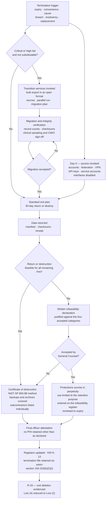

# 06.10 — Termination &amp; Offboarding

| Field | Value |
|---|---|
| Document ID | MBH-BAA-TRM-2026-610 |
| Version | 1.0 |
| Date | 2026-07-15 |
| Classification | Confidential — Electronic Protected Health Information (ePHI) // Illustrative Portfolio Sample |
| Owner | Lisa Coleman, General Counsel (owner of Business Associate Agreements) |
| Co-Owner | Karen Boyd, Chief Compliance Officer · Daniel Cho, CISO &amp; HIPAA Security Official |
| Author | Advisory Team (Healthcare GRC / HIPAA) |
| Status | Approved |

## Purpose

Third-party risk programmes are built almost entirely around onboarding. The questionnaires, the tiering, the assurance reports, the contract negotiation — all of it is front-loaded onto the moment a vendor arrives. Then the relationship ends, the invoices stop, the account is closed in the finance system, and **the ePHI stays where it is**, on a vendor's storage tier, inside a backup rotation nobody thought to ask about, for as long as that vendor's retention policy happens to run.

MercyBridge's own baseline said so: **R-33 — data return and certified deletion at exit unevidenced**, Low (4), because the Network could not produce a certificate of destruction for historical terminations. The risk was scored Low only because the volumes involved were modest. The control gap was not modest at all.

This document sets the termination and offboarding standard: the §164.504(e)(2)(ii)(J) return-or-destroy obligation and its infeasibility exception, the offboarding checklist and its evidence, the documented-infeasibility register, and the transition-services problem that arises when the vendor being replaced is one MercyBridge cannot switch off.

## 1. The Return-or-Destroy Obligation

| Provision | Requirement | MercyBridge implementation |
|---|---|---|
| **§164.504(e)(2)(ii)(J)** | At termination of the contract, if feasible, **return or destroy all protected health information** received from, or created or received by the business associate on behalf of, the covered entity, that the business associate still maintains in any form | Clause 11 of the 2026 template — return or destroy within **30 calendar days**, certificate required |
| §164.504(e)(2)(ii)(J) (second limb) | The BA must **retain no copies** of such information | Certificate must expressly cover backups, archives, derived data sets and subcontractor copies |
| §164.504(e)(2)(ii)(J) (infeasibility limb) | Where return or destruction is **not feasible**, the BA must extend the protections of the contract to the information and **limit further uses and disclosures to those purposes that make return or destruction infeasible**, for as long as the BA maintains it | Clause 11.4 — infeasibility must be **declared in writing, justified, and accepted** by MercyBridge; protections survive termination in perpetuity |
| §164.314(a)(2)(ii) | The same obligation flows down to **subcontractors** | Certificate from the BA must cover every named downstream entity holding MercyBridge PHI |
| §164.316(b)(2)(i) | Documentation retained **six years** from creation or last effective date | Termination file — BAA, certificate, attestations — retained six years from the termination date |
| §164.310(d)(2)(i) / NIST SP 800-88 | Media disposal to a defined sanitisation standard | Certificate must state the method: clear, purge or destroy, per POL-18 |

**"If feasible" is a narrow exception, not an escape hatch.** Feasibility is a question about the vendor's technical and legal ability to delete, not about the vendor's convenience, cost preference, or wish to retain a data set for product improvement. MercyBridge accepts an infeasibility declaration only against the criteria in §5 and records every accepted declaration on a standing register.

## 2. Termination Triggers and Their Consequences

| Trigger | Notice period | Data handling | Additional requirements |
|---|---|---|---|
| **Expiry without renewal** | Per contract, typically 90 days | Standard 30-day return or destroy | Exit plan activated at the renewal decision, not at expiry |
| **Termination for convenience** (MercyBridge) | Per contract, typically 60–90 days | Standard | Transition services invoked where the service is Critical or High |
| **Termination for cause — material breach of the BAA** | Cure period 30 days under Clause 12; immediate where cure is not possible | **Accelerated** — 15 days, with access revoked immediately | §164.314(a)(1)(ii) escalation path; Oversight Committee decision |
| **Termination following a reportable breach** | Immediate access suspension; termination on Committee decision | Accelerated, but **subject to evidence preservation and litigation hold** | Forensic images may be preserved under hold; deletion deferred and documented |
| **Vendor insolvency or administration** | None available in practice | **Data-export right and escrow invoked immediately** (CSP-8) | Insolvency practitioner engaged; PHI is not an asset of the estate to be sold |
| **Change of control to an unacceptable acquirer** | Contractual consent right | Standard, unless novated | Off-cycle reassessment T-3; consent may be withheld |
| **Service replacement** — the vendor is being swapped out | 6–18 months for Critical | Deferred until migration and parallel-run completion, then standard | The transition-services problem in §6 |
| **Vendor exit of the market or product sunset** | Vendor-driven | Standard, on an accelerated MercyBridge timetable | Bulk export in an open format under CSP-8 |
| **Loss of assurance** — sustained failure to produce required evidence | Cure then terminate | Standard | Where the service is care-critical, the §164.314(a)(1)(ii) report path applies instead |

## 3. The Offboarding Checklist

Every termination runs the same fifteen steps. The checklist is held in `trackers/ba-offboarding.xlsx`; a termination is not closed until every line carries evidence and a date.

| # | Step | Owner | Evidence required | SLA from termination effective date |
|---|---|---|---|---|
| 1 | **Termination notice served** and acknowledged in writing | Lisa Coleman | Countersigned notice | Day −90 to −15 depending on trigger |
| 2 | **Exit plan activated**; transition scope, dates and owners agreed | Business owner | Signed exit plan | Day −60 (Critical/High) |
| 3 | **Data-return specification agreed** — format, medium, encryption, integrity check, delivery channel | Marcus Reed | Specification document | Day −30 |
| 4 | **Data returned** to MercyBridge in the agreed open format, with a record count and checksum | Vendor / Marcus Reed | Manifest, checksums, receipt confirmation | Day 0 to +15 |
| 5 | **Integrity and completeness verification** — returned record counts reconciled against the MercyBridge source of truth | System owner | Reconciliation sheet with variance explanation | +15 |
| 6 | **Interactive access revoked** — vendor accounts, federated identities, VPN, jump hosts, brokered access, API keys and service accounts disabled then deleted | Daniel Cho | Access-revocation report from AegisID and the PAM broker | **Day 0 — same day** |
| 7 | **Interfaces and data flows terminated** — HL7/FHIR feeds, SFTP drops, integration engine routes disabled; firewall and egress rules removed | Anthony Ruiz | Change records; interface engine configuration diff | +5 |
| 8 | **Physical media and assets recovered** — badges, tokens, devices, paper records, off-site cartons | Facilities / business owner | Asset return log | +10 |
| 9 | **Destruction of remaining PHI** to the NIST SP 800-88 method stated in the contract, covering production, archives, backups and derived data sets | Vendor | **Certificate of destruction** — see §4 | **+30** |
| 10 | **Subcontractor confirmation** — written confirmation that every named downstream entity has returned or destroyed MercyBridge PHI | Vendor / Lisa Coleman | Per-entity attestation against the 06.06 register | +30 |
| 11 | **Infeasibility declarations** reviewed, challenged and either rejected or accepted onto the register | Lisa Coleman | Declaration, justification, acceptance memo | +30 |
| 12 | **Final officer attestation** — signed by an officer of the vendor confirming no MercyBridge PHI is retained other than as declared | Vendor | Signed attestation | +30 |
| 13 | **Register updates** — BA inventory, tier register, subcontractor register, BAA coverage and system inventory marked terminated | Karen Boyd | Updated tracker entries | +35 |
| 14 | **Risk and KRI update** — BAA coverage recalculated; K-13 updated; residual noted where infeasibility was accepted | Michelle Tran | Register entry | +35 |
| 15 | **Termination file closed** and retained six years under §164.316(b)(2)(i) | Karen Boyd | Complete file index | +45 |

**Step 6 is the one that is most often late and matters most.** Access revocation is not a 30-day activity. A terminated vendor with live credentials is an unmanaged privileged user, and every day of delay is a day of exposure with no contractual counterparty motivated to behave. MercyBridge revokes on the effective date, before the data-return exercise, and provides any residual access needed for transition through a time-boxed, brokered, session-recorded path approved individually.

## 4. The Certificate of Destruction

| Certificate element | Requirement |
|---|---|
| Identification of the covered entity and the agreement | MercyBridge Health Network; BAA reference and effective dates |
| Scope of data destroyed | Systems, data sets, record counts, date ranges |
| **Locations covered** | Production, disaster-recovery replicas, **backups and archives**, test and development copies, analytics and derived data sets, endpoint and removable media |
| **Subcontractors covered** | Each named downstream entity, individually listed, with its own confirmation date |
| **Method** | NIST SP 800-88 category — clear, purge or destroy — and the technique used (cryptographic erase, overwrite, degauss, physical destruction) |
| Date or date range of destruction | Actual dates, not "on or about" |
| Verification performed | How the vendor confirmed destruction succeeded |
| Residual retention declared | Any PHI retained, with the §164.504(e)(2)(ii)(J) infeasibility basis |
| Signature | Officer of the vendor with authority to bind, named and titled |

**Cryptographic erase is accepted only where MercyBridge can verify the key custody model.** Where the vendor generated and held the keys, destruction of the key is destruction of the data — provided no key escrow, backup key or recovery mechanism survives. That question is asked explicitly, because a "cryptographic erase" performed against a key that is still in a vault is not a destruction at all.

## 5. Documented Infeasibility

Where return or destruction is genuinely not feasible, the contract's protections continue and use is confined to the purpose that makes destruction infeasible. MercyBridge accepts declarations in only four categories, and each is time-bounded and reviewed.

| Category | Example | Acceptable? | Conditions imposed | Review |
|---|---|---|---|---|
| **Immutable backup rotation** | PHI within write-once backup sets that cannot be selectively deleted before the rotation expires | **Yes**, time-bounded | Encryption maintained; no restore into production; deletion certified at rotation expiry; expiry date recorded | At rotation expiry |
| **Legal hold or active litigation** | Records subject to a preservation obligation | **Yes** | Scope limited to the held data set; access restricted to named counsel; destruction on hold release | Quarterly |
| **Regulatory retention obligation on the vendor** | A clearinghouse required to retain claim records | **Yes** | Use limited to the retention purpose; no secondary use; no analytics | Annual |
| **Forensic evidence preservation** after an incident | Images retained for investigation or law enforcement | **Yes** | Chain of custody documented; destruction on case closure | On case closure |
| Cost or engineering effort | "Deletion would require a custom job" | **No** | Rejected; contractual obligation enforced | — |
| Commercial value to the vendor | Retention for benchmarking, model training or product analytics | **No** | Rejected categorically; treated as an impermissible use | — |
| Vague architectural assertion | "Data cannot be deleted from our platform" | **No** | Rejected pending a written technical explanation; escalated to the Oversight Committee | — |

| Infeasibility register at 2026-07-15 | Entries |
|---|---|
| Accepted declarations, currently live | **2** |
| — Immutable backup rotation at a terminated Moderate-tier BA | Encrypted; deletion certified due 2026-11-30 |
| — Regulatory retention at a former clearinghouse relationship | Use restricted to the retention purpose; reviewed annually |
| Declarations rejected in the period | **1** — retention for product analytics; data destroyed 2026-06-12 |
| Terminations closed with no residual retention | 5 of 7 |

**An accepted infeasibility declaration is not the end of the relationship.** The business associate agreement's confidentiality, safeguard, notification and audit obligations survive termination and continue to apply to the retained data for as long as it exists. The register exists so that nobody later assumes the vendor is gone when the data is not.

## 6. The Transition-Services Problem

The offboarding checklist assumes the vendor can be switched off. For a Critical business associate, it cannot — and the moment of highest risk in the whole relationship is the migration, not the steady state.

| Difficulty | Why it bites | MercyBridge control |
|---|---|---|
| **The outgoing vendor has no incentive to help** | It is losing the revenue and being asked to fund the exit | Transition-services obligation priced and contracted **at signature**, not negotiated at exit; rates fixed |
| **Two vendors hold the same ePHI simultaneously** | Parallel running doubles the attack surface for months | Both under conforming BAAs for the full overlap; both monitored at Critical cadence; overlap period explicitly bounded |
| **Historical data may not be exportable in usable form** | Proprietary schemas; clinical context lost in translation | CSP-8 bulk export in a documented open format at no incremental charge, plus schema documentation |
| **Migration integrity** | Silent record loss during transfer is a §164.312(c)(1) integrity failure and a patient-safety issue | Record-count reconciliation, checksums, clinical sampling by the CMIO's team, sign-off before decommission |
| **The legacy record must remain accessible** | Clinicians and release-of-information need years of history | Read-only archive under MercyBridge control, or a defined legacy-access service with its own BAA |
| **Insolvency removes the negotiation entirely** | No counterparty to transition with | Source and configuration escrow plus the standing export right (CSP-8) for Critical platforms |
| **Deletion cannot occur until migration is proven** | Premature destruction destroys the record | Destruction clock starts at **migration acceptance**, not at contract end; both dates recorded |

| Critical BA | Exit posture | Realistic transition period | Evidence held |
|---|---|---|---|
| C1 Halcyon Health Systems | Bulk export right in an open format; source and configuration escrow executed; Network-keyed independent backup of the full archive | **12–24 months** | Escrow agreement; quarterly verified restore from the Network vault |
| C2 Meridian Imaging Cloud | DICOM is a portable standard; export right and migration assistance contracted | 6–9 months | Export test performed on a 10,000-study sample |
| C3 Cardinal Revenue Partners | Data export plus a defined run-off period for open accounts | 6–12 months | Exit plan on file |
| C4 Vaultline Data Protection | MercyBridge holds the keys for its own vault tier; portability is a key-management question, not a data question | 3–6 months | Restore tested quarterly |
| C5 Northgate Clearing Services | Payer connectivity is the constraint, not the data | 6–9 months | Alternative clearinghouse identified |
| C6 Rivermont Regional HIE | Governed by the state participation agreement; exit is a governance process | 9–12 months | Participation agreement terms mapped |
| C7 AegisID Cloud Identity | Identity migration is high-blast-radius; staged cutover required | 9–12 months | Staged plan; break-glass path documented |
| C8 Bridgeway Patient Engagement | Portal content and enrolment data exportable; patient re-enrolment is the friction | 4–6 months | Export format confirmed |

## 7. Terminations in the Review Period

| # | Business associate | Tier | Trigger | Data outcome | Certificate | Closed |
|---|---|---|---|---|---|---|
| X-1 | Regional print and mail supplier | Moderate | Expiry | Destroyed | Yes — 2026-03-18 | Yes |
| X-2 | Legacy patient-survey vendor (predecessor to H14) | Moderate | Service replacement | Returned then destroyed | Yes — 2026-04-02 | Yes |
| X-3 | Departmental analytics tool holding a shadow ePHI extract | Low | Cause — undisclosed ePHI copy | Destroyed; product-analytics retention **rejected** | Yes — 2026-06-12 | Yes |
| X-4 | Off-site paper storage overflow contract | Low | Convenience | Physical destruction, witnessed | Yes — 2026-05-09 | Yes |
| X-5 | Former transcription overflow supplier | Moderate | Expiry | Destroyed | Yes — 2026-02-27 | Yes |
| X-6 | Legacy secure-fax gateway (predecessor to H5) | Moderate | Service replacement | Migrated then destroyed | Yes — 2026-06-30 | Yes |
| X-7 | Small billing sub-supplier | Low | Convenience | Destroyed, with an accepted immutable-backup infeasibility to 2026-11-30 | Yes, with declaration | Open on the register |
| | **Totals** | | | | **7 of 7 (K-13 100%)** | 6 closed, 1 on register |

| Risk | Entering | Treatment in this document | Residual |
|---|---|---|---|
| **R-33** — data return and certified deletion at exit unevidenced | Low (4) — likelihood 2 × impact 2 | Clause 11 30-day certificate in all Critical/High agreements; 15-step checklist; certificate content standard; infeasibility register; subcontractor confirmation across 71 downstream entities | **Low (2)** — likelihood 1 × impact 2 |
| R-30 contribution | Moderate (9) | Subcontractor destruction confirmation closes the last visibility gap at exit | Supports **Low (6)** |
| R-28 contribution | High (15) | Escrow, bulk export right and tested restoration make a Halcyon exit a plan rather than an aspiration | Supports **Moderate (10)** |

## Cross-References

| Reference | Relevance |
|---|---|
| 02.02 — ePHI System Inventory | Systems marked terminated on offboarding |
| 03.07 — Risk Register | R-33, and the R-28 exit dependency |
| 04.10 — Business Associate Contracts | The §164.504(e)(2)(ii)(J) obligation as first stated |
| 05.04 — Device &amp; Media Controls | POL-18 and the NIST SP 800-88 sanitisation standard |
| 05.05 / 05.08 — Access Control &amp; Authentication | Day-0 revocation of vendor identities and brokered access |
| 06.03 — Risk Tiering &amp; Criticality | Exit and continuity requirements by tier |
| 06.04 — Business Associate Agreements | Clause 11 return-or-destroy and Clause 12 termination |
| 06.06 — Subcontractor &amp; Downstream Chain | Destruction confirmation across the 71 registered entities |
| 06.07 — Cloud Service Providers | CSP-8 bulk export and CSP-9 certified deletion |
| 06.08 — Ongoing Monitoring &amp; Oversight | KRI K-13 and the renewal/exit review each Q4 |
| 06.11 — Control-to-Risk Traceability | R-33 residual position |

---
[⬅ Previous](06.09-business-associate-incident-and-breach-coordination.md) · [🏠 Phase README](06.00-README.md) · [Next ➡](06.11-control-to-risk-traceability.md)
