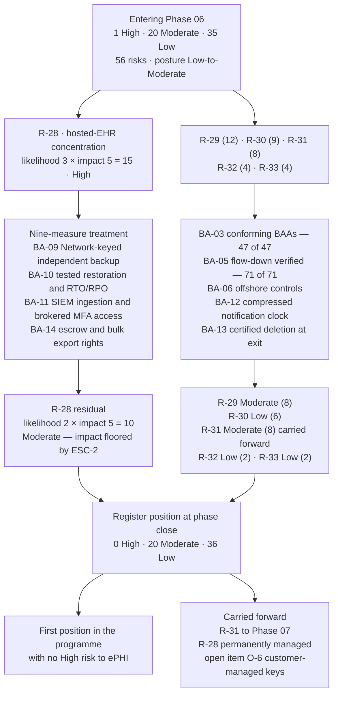

# 06.11 — Control-to-Risk Traceability

| Field | Value |
|---|---|
| Document ID | MBH-BAA-TRC-2026-611 |
| Version | 1.0 |
| Date | 2026-07-15 |
| Classification | Confidential — Electronic Protected Health Information (ePHI) // Illustrative Portfolio Sample |
| Owner | Daniel Cho, Chief Information Security Officer &amp; HIPAA Security Official |
| Co-Owner | Karen Boyd, Chief Compliance Officer · Michelle Tran, VP Enterprise Risk (register custodian) · Lisa Coleman, General Counsel |
| Author | Advisory Team (Healthcare GRC / HIPAA) |
| Status | Approved |

## Purpose

A phase that produces documents has produced documents. A phase that moves risk has done work. This is the accounting document for Phase 06: it traces every business associate control back to the risks it was built to treat, states the evidence that the control operates, and records the resulting movement in the **56-risk register** established in Phase 03.

The headline is a single line in the matrix below. **R-28 — the concentration of 2.1 million patient records in a single vendor-hosted EHR — closes from High (15) to Moderate (10)**, and with it the register reaches a position it has not held since the risk analysis was completed in April: **0 High / 20 Moderate / 36 Low**. This is the first point in the programme with no High risk to ePHI.

The claim is bounded, and the boundary is stated in §5. R-28 is *reduced and permanently managed*, not eliminated. MercyBridge has not closed a structural concentration it has consciously chosen to accept.

## 1. Method

Scoring is unchanged from 03.05: **likelihood × impact on a 5×5 scale**, with rating bands **High 15–25 · Moderate 8–12 · Low 1–6**, and the **ESC-2 patient-safety escalation** that floors the impact of losing the clinical record at 5.

| Rule | Statement |
|---|---|
| Attribution | A risk is attributed to Phase 06 only where the **determinative** treatment is a business associate control. Contributory effects are recorded separately in §4 |
| Evidence | Every residual claim cites an artefact that an assessor can pull — a countersigned agreement, a dated tracker entry, a certificate, a test result |
| Impact reduction | Impact is reduced only where the **data set itself** changes (fewer records, de-identified, encrypted under Network-held keys). Contractual measures reduce **likelihood** |
| Floors | ESC-2 fixes impact at 5 for the clinical record. No contract lowers it |
| Honesty rule | Where a treatment is contracted but not yet proven in operation, the residual reflects the contracted state only if an interim compensating control is operating; otherwise the entering score stands |

## 2. The Phase 06 Control Set

| Control | Name | Where defined | Security Rule anchor | Risks treated |
|---|---|---|---|---|
| **BA-01** | Business associate identification and inventory — ~180 relationships, 47 BA-involved ePHI systems | 06.02 | §164.308(a)(1)(ii)(A); §164.502(e) | R-29, R-30, R-41 |
| **BA-02** | Four-factor tiering with upward-only overrides — 8 Critical, 16 High | 06.03 | §164.308(a)(1)(ii)(B) | R-28, R-30, R-32 |
| **BA-03** | Conforming BAA on the 2026 template — Clauses 1–12 and terms A1–A11 | 06.04 | §164.314(a)(2); §164.502(e) | **R-29**, R-31, R-33 |
| **BA-04** | Tiered due diligence — 214-question instrument, SOC 2 Type II / HITRUST, CUEC mapping, substitution ladder | 06.05 | §164.308(a)(1)(ii)(A); §164.308(b)(1) | R-28, R-29, R-30 |
| **BA-05** | Subcontractor disclosure and flow-down verification — 71 downstream entities registered | 06.06 | §164.308(b)(2); §164.314(a)(2)(iii) | **R-30**, R-32 |
| **BA-06** | Offshore access control — named rosters, de-identified queues, VDI with no local storage, session recording | 06.06 §5 | §164.502(b); §164.312(a)(1) | **R-32** |
| **BA-07** | Cloud shared-responsibility model and CSP contract requirements CSP-1 to CSP-10 | 06.07 | §164.308(a)(1); §164.312 | R-28, R-30, R-33, R-41 |
| **BA-08** | Key custody position — customer-managed keys where supported, escrow where not | 06.07 §4; 05.10 | §164.312(a)(2)(iv), (e)(2)(ii) | R-28, R-40 |
| **BA-09** | Independent recovery — Network-keyed immutable replica of the full clinical archive, restore-verified quarterly | 06.03 §5 measure 1 | §164.308(a)(7); §164.312(c)(1) | **R-28** |
| **BA-10** | Tested restoration assurance with contractual RTO 4h / RPO 15min and service credits | 06.03 §5 measures 2–3 | §164.308(a)(7)(ii)(B)–(D) | **R-28** |
| **BA-11** | Continuous and periodic monitoring — KRIs K-01 to K-14, artefact currency, external signals, off-cycle triggers T-1 to T-11 | 06.08 | §164.308(a)(8); §164.308(a)(1)(ii)(D) | R-28, R-29, R-30, R-31 |
| **BA-12** | Compressed breach-notification clock — 24h initial / 5-day full at Critical tier, with the agency assumption applied | 06.09 | §164.410; §164.404 | **R-31** |
| **BA-13** | Termination and offboarding — day-0 revocation, 30-day certificate of destruction, infeasibility register | 06.10 | §164.504(e)(2)(ii)(J); §164.310(d)(2)(i) | **R-33**, R-30 |
| **BA-14** | Exit viability — bulk export in an open format, source and configuration escrow, tested transition plans | 06.07 CSP-8; 06.10 §6 | §164.308(a)(7)(ii)(E) | **R-28** |

## 3. Keystone Traceability Matrix

| Risk | Description | Entering (L × I) | Band | Controls applied | Evidence | Residual (L × I) | **Band movement** | Onward owner |
|---|---|---|---|---|---|---|---|---|
| **R-28** | Compromise or extended outage of the vendor-hosted Halcyon EHR holding 2.1M records (ESC-2) | **3 × 5 = 15** | **High** | BA-02, BA-04, BA-08, BA-09, BA-10, BA-11, BA-14 — the nine-measure plan in 06.03 §5 | Quarterly verified restore from the Network-keyed vault; FY2027 amendment with RTO/RPO and credits; escrow agreement; Halcyon logs in the SIEM; joint restoration test scheduled 2026-09; downtime capability exercised semi-annually | **2 × 5 = 10** | **High → Moderate** | Daniel Cho — permanently managed |
| **R-29** | ePHI disclosed under three non-conforming BAAs (MBH-SYS-029, -033, -058) | 3 × 4 = 12 | Moderate | BA-01, BA-03, BA-04 | Three countersigned 2026-template agreements; clause-conformance checklists signed by General Counsel; `trackers/baa-remediation.xlsx`; **47 of 47** BA-involved systems covered | **2 × 4 = 8** | Moderate → Moderate (reduced) | Lisa Coleman |
| **R-30** | Subcontractor chain unvisible for nine hosted services | 3 × 3 = 9 | Moderate | BA-01, BA-04, BA-05, BA-07, BA-13 | Disclosure from **24 of 24**; **71 downstream entities** registered with flow-down verified 71 of 71; 9 fourth parties identified; SOC 2 carve-out analysis per report | **2 × 3 = 6** | **Moderate → Low** | Lisa Coleman |
| **R-31** | BA breach notification arrives too late for the 60-day duty to individuals | 2 × 4 = 8 | Moderate | BA-03, BA-05, BA-11, BA-12 | Clause 6 clocks in 24 of 24 critical/high BAAs; agency assumption documented; 24/7 intake channel; 4 of 4 notices received on time (K-07); notification chain mapped through the downstream register | **2 × 4 = 8** | Moderate — **carried to Phase 07** | Lisa Coleman → Phase 07 |
| **R-32** | Offshore support access exceeds the minimum necessary | 2 × 2 = 4 | Low | BA-02, BA-05, BA-06 | Verbatim BAA executed 2026-07-09; 37-name roster reviewed monthly; VDI with no local storage, clipboard or print; session recording; A7/A8 consent for 4 non-US entities | **1 × 2 = 2** | Low → Low (reduced) | Rebecca Stern |
| **R-33** | Data return and certified deletion at exit unevidenced | 2 × 2 = 4 | Low | BA-03, BA-07, BA-13 | Clause 11 30-day certificate in all Critical/High agreements; 7 of 7 terminations closed with a certificate (K-13); infeasibility register with 2 live entries and 1 rejection | **1 × 2 = 2** | Low → Low (reduced) | Lisa Coleman |

### 3.1 R-28 — Measure-by-Measure Traceability

The single risk that moves the register's High count to zero is traced measure by measure, because a one-line claim about the programme's most significant risk reduction is not evidence.

| # | Measure (06.03 §5) | What it reduces | Control | Status at 2026-07-15 | Likelihood effect |
|---|---|---|---|---|---|
| 1 | Independently keyed backup of the full clinical archive to the MercyBridge immutable vault | Recovery dependency on Halcyon | BA-09 | **Operating** — restore verified quarterly | Material |
| 2 | Annual full-scale restoration test with MercyBridge observers | Extended-outage duration | BA-10 | First joint test scheduled **2026-09** | Material on completion |
| 3 | Contractual RTO 4h / RPO 15min with service credits and a repeated-failure termination right | Vendor incentive alignment | BA-10 | **Executed** in the FY2027 amendment | Moderate |
| 4 | Halcyon audit logs ingested into the MercyBridge SIEM; administrative sessions recorded | Detection latency for insider or credential misuse | BA-11 | **Operating** | Material |
| 5 | Named-list vendor administrative access with MFA at the MercyBridge broker | Credential-compromise likelihood | BA-11 | **Operating** (Wave 1) | Material |
| 6 | Customer-managed encryption keys; escrow of key material as the interim ask | Safe-harbour exposure | BA-08 | **Open item O-6** — negotiation live to 2027-03-31 | Not yet claimed |
| 7 | Source and configuration escrow plus a bulk open-format export right | Exit and insolvency risk | BA-14 | **Executed** | Moderate |
| 8 | 24-hour initial breach notice and joint tabletop participation | Notification-timing risk | BA-12 | Clock executed; tabletop **2026-08** | Credited to R-31 |
| 9 | Tested downtime and read-only continuity across all four hospitals | Care-delivery impact duration | BA-10 | **Operating** — exercised semi-annually | Duration, not impact score |

**Seven of nine measures are operating or executed.** Measure 2 is scheduled and measure 6 remains open, and neither is claimed in the residual: the reduction from likelihood 3 to likelihood 2 rests on the seven that are in place. **Impact remains 5** and always will — ESC-2 floors it, because losing the longitudinal record for 2.1 million patients is a patient-safety event regardless of contract terms.

## 4. Contributory Effects — Risks Phase 06 Supports but Does Not Own

| Risk | Owned by | Phase 06 contribution | Effect |
|---|---|---|---|
| R-01 — incomplete MFA on remote and privileged access | Phase 05 | CSP-6 requires provider-side MFA on all administrative access to hosted services; brokered vendor access with MFA at the MercyBridge edge | Extends the Phase 05 control across the vendor boundary |
| R-24 — double-extortion exfiltration before encryption | Phase 05 / 07 | CSP-5 log export from 8 of 8 Critical BAs into the SIEM; egress and download controls on vendor access paths | Improves detection where the data actually sits |
| R-34 — phishing / BEC compromising mailboxes containing ePHI | Phase 05 | H11 Northwind log export to the SIEM; contractual retention minimum at renewal (DD-04) | Supports the Phase 05 residual of Low (6) |
| R-40 — ePHI at rest unencrypted | Phase 05 | CSP-1 encryption at rest with key-custody disclosure across the 38 hosted services | Supports the safe-harbour restoration claim |
| R-41 — unstructured ePHI sprawl | Phase 05 | BA-01 identification surfaced a departmental analytics tool holding a shadow extract; terminated and destroyed (X-3 in 06.10 §7) | One repository removed |
| R-11 — media and device disposal | Phase 05 | H15 Ironclad governed under BA-13 with NIST SP 800-88 certificates | Extends disposal assurance to the vendor estate |

## 5. Register Position After Phase 06

| Band | Entering Phase 06 | Movements in Phase 06 | **At phase close** |
|---|---|---|---|
| **High** (15–25) | 1 — R-28 | R-28 leaves the band (15 → 10) | **0** |
| **Moderate** (8–12) | 20 | R-28 enters (+1); R-30 leaves to Low (−1); R-29 reduced within band; R-31 unchanged | **20** |
| **Low** (1–6) | 35 | R-30 enters (+1); R-32 and R-33 reduced within band | **36** |
| **Total** | **56** | — | **56** |

| Statement | Position |
|---|---|
| Risks whose determinative treatment sits in Phase 06 | 6 — R-28, R-29, R-30, R-31, R-32, R-33 |
| Risks reduced in score | 5 of 6 (R-31 unchanged, carried) |
| Risks changing band | 2 — R-28 (High → Moderate), R-30 (Moderate → Low) |
| **High risks remaining in the register** | **0** |
| Overall posture | **Low-to-Moderate**, unchanged in label, materially improved in composition |
| Convergence with the 03.08 target profile of 0 / 23 / 33 | High count now matches the target; the Moderate/Low split differs by timing and reconciles at the annual re-analysis under 03.10 |

**What "0 High" does and does not mean.** It means no risk to ePHI currently scores 15 or above under the 03.05 model. It does not mean the concentration risk has gone away: R-28 sits at the top of the Moderate band at 10, with an impact score of 5 that cannot be reduced, and it is reported by name in the quarterly Board pack for exactly that reason. A register with no High risks and one immovable impact-5 exposure is a register that requires *more* attention to a single line item, not less.

## 6. Residual Ownership and Onward Testing

| Residual | Score | Owner | How it is kept honest | Next test |
|---|---|---|---|---|
| R-28 — hosted-EHR concentration | Moderate (10) | Daniel Cho | Quarterly verified restore; annual joint restoration test; quarterly KRI review; named in the Board pack | Joint restoration test **2026-09**; O-6 closure by 2027-03-31 |
| R-29 — BAA conformance | Moderate (8) | Lisa Coleman | K-01 coverage at 100%; conformance re-checked at every renewal; deviation log reviewed quarterly | Annual template review Q1 2027 |
| R-30 — downstream visibility | Low (6) | Lisa Coleman | Annual disclosure refresh; 30-day change notices; semi-annual fourth-party reconciliation | Q1 2027 disclosure cycle |
| R-31 — notification timing | Moderate (8) | Lisa Coleman → Phase 07 | Contractual clocks; K-06 and K-07; multi-hop chain test | **Tabletop 2026-08** |
| R-32 — offshore minimum necessary | Low (2) | Rebecca Stern | Monthly roster review for the 4 non-US entities; session-recording sampling | Monthly |
| R-33 — exit deletion evidence | Low (2) | Lisa Coleman | K-13 at 100%; infeasibility register reviewed at each entry's expiry | X-7 expiry 2026-11-30 |
| Open item **O-6** — customer-managed keys at Halcyon | Not a separate register entry; the ceiling on R-28 | Lisa Coleman / Daniel Cho | FY2027 renewal negotiation; escrow of key material as the interim | 2027-03-31 |

## Cross-References

| Reference | Relevance |
|---|---|
| 03.05 — Likelihood, Impact &amp; Risk Determination | The 5×5 model, the bands and the ESC-2 escalation |
| 03.07 — Risk Register | R-28 to R-33 as originally scored |
| 03.08 — Risk Treatment Plan | The 0 / 23 / 33 target profile this position converges on |
| 03.10 — Ongoing Risk Management | Where the band reconciliation is performed annually |
| 04.10 — Business Associate Contracts | The administrative safeguard this phase operationalises |
| 05.12 — Control-to-Risk Traceability | The handover position of 1 High / 20 Moderate / 35 Low |
| 06.03 — Risk Tiering &amp; Criticality | The nine-measure R-28 treatment plan traced in §3.1 |
| 06.04 — Business Associate Agreements | R-29 closure evidence — 47 of 47 |
| 06.06 — Subcontractor &amp; Downstream Chain | R-30 and R-32 closure evidence — 71 of 71 |
| 06.09 — BA Incident &amp; Breach Coordination | R-31 as handed to Phase 07 |
| 06.10 — Termination &amp; Offboarding | R-33 closure evidence |
| Phase 08 — HITRUST &amp; Independent Assessment | Where these residuals are independently tested |

---
[⬅ Previous](06.10-termination-and-offboarding.md) · [🏠 Phase README](06.00-README.md) · [Next ➡](06.12-phase-summary-and-transition.md)
