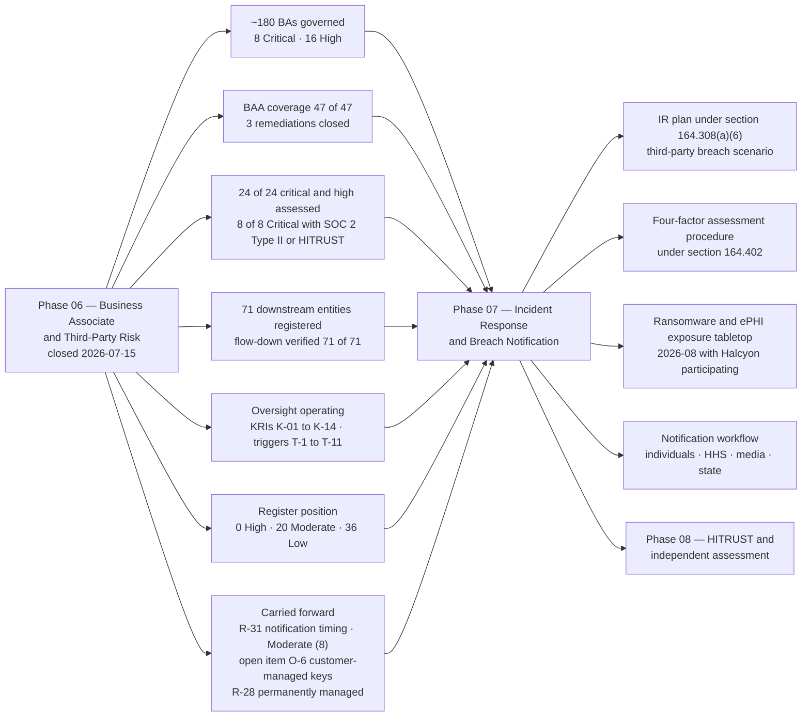

# 06.12 — Phase Summary &amp; Transition

| Field | Value |
|---|---|
| Document ID | MBH-BAA-SUM-2026-612 |
| Version | 1.0 |
| Date | 2026-07-15 |
| Classification | Confidential — Electronic Protected Health Information (ePHI) // Illustrative Portfolio Sample |
| Owner | Daniel Cho, Chief Information Security Officer &amp; HIPAA Security Official |
| Co-Owner | Karen Boyd, Chief Compliance Officer · Lisa Coleman, General Counsel |
| Author | Advisory Team (Healthcare GRC / HIPAA) |
| Status | Approved |

## Purpose

Phase 06 began with an uncomfortable asymmetry. MercyBridge had spent Phases 04 and 05 building safeguards inside a perimeter that **2.1 million patient records had already left**. The primary clinical record lives on a vendor's infrastructure, under a vendor's keys. Imaging, claims, backups, identity, the patient portal and the health information exchange are all somebody else's data centre. The Security Rule does not care where the ePHI sits; the covered entity's obligations follow the data.

This document closes the phase. It records what was delivered against what was committed, confirms the business associate baseline, states the risk outcome, lists the open items that travel forward, and hands over to **Phase 07 — Incident Response &amp; Breach Notification**, which inherits the one business associate risk Phase 06 deliberately did not close.

## 1. What the Phase Committed To, and What It Delivered

| Commitment made at phase opening (06.01) | Delivered at 2026-07-15 | Evidence |
|---|---|---|
| Identify and inventory the full business associate population | **~180 relationships** inventoried; 47 BA-involved ePHI systems mapped; 3 shadow relationships surfaced and resolved | `trackers/ba-inventory.xlsx`; 06.02 |
| Tier the population so effort follows exposure | Four-factor model; **8 Critical, 16 High**, ~62 Moderate, ~94 Low; upward-only overrides | 06.03 |
| Close the three BAA remediations carried since Phase 02 | **MBH-SYS-029, MBH-SYS-033, MBH-SYS-058 executed** on the 2026 template — coverage **47 of 47 (100%)** | `trackers/baa-remediation.xlsx`; 06.04 |
| Assess every critical and high-risk business associate | **24 of 24** assessed; **8 of 8** Critical hold a current SOC 2 Type II or HITRUST; substitution ladder used only at High tier | 06.05 |
| Obtain and verify the subcontractor chain | Disclosure from **24 of 24**; **71 downstream entities** registered; flow-down verified **71 of 71**; 9 fourth parties identified | `trackers/subcontractor-register.xlsx`; 06.06 |
| Govern the hosted estate under a shared-responsibility model | 38 hosted services mapped; CSP-1 to CSP-10 contract requirements; key custody documented for every service | 06.07 |
| Stand up continuous and periodic oversight | KRIs **K-01 to K-14** with thresholds; artefact currency tracking; **11 off-cycle triggers**; monthly Oversight Committee | 06.08 |
| Compress the breach-notification path | **24-hour / 5-day** clocks in all 24 critical/high BAAs; agency assumption adopted; 24/7 intake channel | 06.09 |
| Make exit evidenced rather than assumed | 15-step offboarding checklist; **7 of 7** terminations closed with a certificate of destruction; infeasibility register live | 06.10 |
| Move the risk register | **R-28 High (15) → Moderate (10)**; R-30 Moderate → Low; **0 High risks remain** | 06.11 |

## 2. Deliverables Register

| # | Document | Owner | Status |
|---|---|---|---|
| 06.01 | Business Associate Program Overview | Karen Boyd | Approved |
| 06.02 | Business Associate Identification &amp; Inventory | Karen Boyd | Approved |
| 06.03 | Risk Tiering &amp; Criticality | Karen Boyd | Approved |
| 06.04 | Business Associate Agreements | Lisa Coleman | Approved |
| 06.05 | Due Diligence &amp; Assessment | Daniel Cho | Approved |
| 06.06 | Subcontractor &amp; Downstream Chain | Lisa Coleman | Approved |
| 06.07 | Cloud Service Providers | Daniel Cho | Approved |
| 06.08 | Ongoing Monitoring &amp; Oversight | Karen Boyd | Approved |
| 06.09 | BA Incident &amp; Breach Coordination | Karen Boyd | Approved |
| 06.10 | Termination &amp; Offboarding | Lisa Coleman | Approved |
| 06.11 | Control-to-Risk Traceability | Daniel Cho | Approved |
| 06.12 | Phase Summary &amp; Transition | Daniel Cho | Approved |

| Supporting artefact | Location |
|---|---|
| Business associate inventory and tier register | `trackers/ba-inventory.xlsx` |
| BAA remediation tracker | `trackers/baa-remediation.xlsx` |
| Subcontractor and fourth-party register (71 entities) | `trackers/subcontractor-register.xlsx` |
| Assurance artefact currency tracker | `trackers/assurance-currency.xlsx` |
| Offboarding and certificate-of-destruction log | `trackers/ba-offboarding.xlsx` |
| 2026 business associate agreement template and clause-conformance checklist | `templates/` |
| Oversight Committee minutes and decision log | `governance/` |
| BA incident notice log | `logs/` |

## 3. Quantified Outcomes

| Measure | Baseline (phase opening) | **At phase close** |
|---|---|---|
| Business associate relationships governed | Partially inventoried | **~180** |
| Critical and high-risk BAs assessed | 21 of 24 with current assurance | **24 of 24** |
| Critical BAs with a current SOC 2 Type II or HITRUST | 8 of 8 | **8 of 8** |
| BA-involved ePHI systems under a conforming BAA | 44 of 47 (93.6%) | **47 of 47 (100%)** |
| BAAs under remediation | 3 | **0** |
| Downstream entities registered | 22 | **71** |
| Downstream entities with verified flow-down BAAs | 18 of 22 | **71 of 71** |
| Fourth-party (BA-of-BA-of-BA) entities identified | 0 | **9** |
| Hosted services with an unmapped downstream chain | 9 | **0** |
| Critical/high BAs disclosing a named subcontractor list | 15 of 24 | **24 of 24** |
| Open High-severity diligence findings | 1 (DD-03) | **0** |
| Open Medium-severity diligence findings | 5 | 4, all with dated plans |
| BAs onboarded with ePHI before diligence completion | Not measured | **0** |
| Terminations closed with a certificate of destruction | Not evidenced historically | **7 of 7 (100%)** |
| BA incident notices received within the contractual window | Not measured | **4 of 4 (100%)** |
| Reportable breaches arising from a business associate | 0 | **0** |
| **High risks in the 56-risk register** | **1** | **0** |

## 4. Risk Outcome

| Risk | Entering | **Residual** | Band movement | Disposition |
|---|---|---|---|---|
| **R-28** — hosted-EHR concentration (Halcyon, 2.1M records, ESC-2) | High (15) | **Moderate (10)** | **High → Moderate** | Permanently managed; named in the quarterly Board pack |
| **R-29** — three non-conforming BAAs | Moderate (12) | **Moderate (8)** | Reduced within band | Closed operationally; monitored via K-01 |
| **R-30** — subcontractor chain unvisible | Moderate (9) | **Low (6)** | **Moderate → Low** | Sustained by annual disclosure refresh |
| **R-31** — BA breach notice too late for the 60-day duty | Moderate (8) | Moderate (8) | Unchanged | **Carried to Phase 07** — tested in the 2026-08 tabletop |
| **R-32** — offshore access exceeds minimum necessary | Low (4) | **Low (2)** | Reduced within band | Monthly roster review |
| **R-33** — exit deletion unevidenced | Low (4) | **Low (2)** | Reduced within band | Sustained by K-13 |

| Register position | High | Moderate | Low | Total |
|---|---|---|---|---|
| Entering Phase 06 | 1 | 20 | 35 | 56 |
| **At Phase 06 close** | **0** | **20** | **36** | **56** |

**This is the first position in the programme with no High risk to ePHI**, and it should be read with its caveat attached: R-28 sits at the top of the Moderate band with an impact score of 5 that no contract can lower. Zero High is a milestone, not a resting state.

## 5. Baseline Confirmation

The Business Associate and Third-Party Risk baseline is **confirmed as of 2026-07-15**. The following are the fixed reference points against which future change is measured; any variance is a finding, not a drift.

| Baseline element | Confirmed position | Custodian | Re-baselined |
|---|---|---|---|
| Governed population | ~180 relationships; 8 Critical, 16 High | Karen Boyd | Annually, each Q1 |
| BAA coverage | 47 of 47 BA-involved ePHI systems, all on the 2026 template | Lisa Coleman | On execution of any new agreement |
| Assurance position | 24 of 24 critical/high assessed; 8 of 8 Critical with SOC 2 Type II or HITRUST | Daniel Cho | On each report refresh |
| Downstream chain | 71 registered entities; 9 fourth parties; 4 offshore, all consented | Lisa Coleman | Annual refresh; 30-day change notice |
| Hosted estate | 38 services under the shared-responsibility model with documented key custody | Daniel Cho | On any architecture change |
| Notification path | 24h/5-day clocks; agency assumption; 24/7 intake | Karen Boyd | Tested annually in the IR exercise |
| Exit posture | Certificate-of-destruction standard; escrow and export rights for Critical | Lisa Coleman | On each termination |
| Risk position | 0 High / 20 Moderate / 36 Low | Michelle Tran | Annual re-analysis under 03.10 |

## 6. Open Items Carried Forward

| # | Open item | Why it remains open | Owner | Due |
|---|---|---|---|---|
| **O-6** | Customer-managed encryption keys at Halcyon; escrow of key material as the interim ask | No CMK option in the current product release; the negotiation runs to the FY2027 renewal. This is the ceiling on R-28 and the open question behind the breach safe harbour | Lisa Coleman / Daniel Cho | 2027-03-31 |
| DD-04 | Northwind Cloud Productivity audit-log retention below the six-year documentation requirement | Continuous SIEM export operating as the compensating control; contractual minimum added at renewal | Marcus Reed | 2026-12-31 |
| DD-05 | Halstead Receivables Group offshore call-centre access | Data set already reduced; download and screen-scrape blocked; final attestation pending | Rebecca Stern | 2026-09-30 |
| DD-06 | One High-tier BA on the alternative assurance pathway | SOC 2 Type II contracted to a fixed milestone with a termination right | Daniel Cho | 2027-03-31 |
| M-2 | First joint full-scale restoration test with Halcyon | Scheduled; measure 2 of the R-28 plan is not claimed in the residual until it completes | Anthony Ruiz | 2026-09 |
| K-03 | One lapsed penetration test summary (H14) | Vendor test in progress | Marcus Reed | 2026-08-31 |
| K-09 | One Critical/High BA below the security-rating floor (H13) | Remediation under way and improving; monitored under T-6 | Marcus Reed | 2026-10-31 |
| X-7 | Accepted immutable-backup infeasibility at a terminated Low-tier BA | Encrypted; deletion certified at rotation expiry | Lisa Coleman | 2026-11-30 |

## 7. Transition to Phase 07

| What Phase 07 inherits | From | Why it matters to incident response |
|---|---|---|
| **R-31 at Moderate (8)** | 06.09, 06.11 | The one BA risk deliberately left open — it can only be reduced by exercising the path, not by contracting it |
| The **agency assumption** and the discovery-date arithmetic | 06.09 §1 | Determines when the §164.404 clock actually starts for a vendor-originated breach |
| Compressed contractual clocks — 24h/5-day in 24 of 24 critical/high BAAs | 06.04, 06.09 | Converts a 60-day statutory exposure into a days-long one; must be enforced live |
| The Sev-1 to Sev-4 triage model and the 24/7 intake channel | 06.09 §3 | Plugs into the enterprise IR intake |
| The **multi-hop notification path** through 71 downstream entities | 06.06, 06.09 | A fourth-party breach traverses three hops before it reaches the Network |
| Halcyon's contractual obligation to participate in the tabletop | 06.03 §5 measure 8 | Tests the notification chain with the vendor that matters most |
| Key custody position per hosted service (open item O-6) | 06.07 §4, 05.10 | The decisive fact in every safe-harbour determination |
| CSP-5 log export from 8 of 8 Critical BAs into the SIEM | 06.07, 06.08 | Supplies the forensic telemetry a joint investigation depends on |
| Evidence-preservation and cooperation obligations (A11) | 06.04 | Prevents a vendor from remediating away the evidence |
| Cyber-liability cover and cost-reimbursement terms | 06.04 A4/A5 | Funds notification, credit monitoring and call-centre capacity |

| Phase 07 scope, as handed over | Owner |
|---|---|
| Incident response plan under §164.308(a)(6), including a third-party breach playbook | Daniel Cho |
| Four-factor risk-of-compromise procedure under §164.402 | Rebecca Stern |
| Breach notification workflow — individuals, HHS, media, state regulators | Karen Boyd / Lisa Coleman |
| Ransomware and ePHI exposure tabletop, **2026-08**, with Halcyon participating | Daniel Cho |
| The 3 security incidents investigated in the review period, with 4-factor assessments and **0 reportable breaches** | Rebecca Stern |
| R-31 reduction through tested exercise | Lisa Coleman → Daniel Cho |

## 8. Assurance Statement

The Business Associate and Third-Party Risk programme is **established, documented and operating** at 2026-07-15. Every ePHI system with business associate involvement is governed by a conforming agreement; every critical and high-risk business associate has been assessed against current independent assurance; the downstream chain is mapped and contractually verified to the fourth party; oversight is continuous and thresholded; exit is evidenced; and the concentration risk that survived the technical safeguards has been reduced as far as an honest reading of the model allows.

The programme's largest residual exposure remains **structural and accepted**: MercyBridge depends on a single vendor for the entire clinical record of 2.1 million patients, and will continue to. What has changed is that the dependency is now measured, contracted, independently recoverable, monitored against thresholds, exit-planned and reported by name to the Board — rather than assumed to be somebody else's problem because the servers are somebody else's.

## Cross-References

| Reference | Relevance |
|---|---|
| 01.03 — Roles &amp; Responsibilities | The accountability model this phase operates under |
| 02.02 — ePHI System Inventory | The 68 systems and the 47 with BA involvement |
| 03.07 — Risk Register | R-28 to R-33 as originally scored |
| 03.08 — Risk Treatment Plan | The 0 / 23 / 33 target profile |
| 04.10 — Business Associate Contracts | The §164.308(b)(1) safeguard this phase operationalises |
| 05.12 — Control-to-Risk Traceability | The handover position of 1 High / 20 Moderate / 35 Low |
| 06.01 — Business Associate Program Overview | The commitments assessed in §1 |
| 06.09 — BA Incident &amp; Breach Coordination | R-31 and the notification path handed forward |
| 06.11 — Control-to-Risk Traceability | The keystone matrix behind §4 |
| Phase 07 — Incident Response &amp; Breach Notification | The receiving phase |
| Phase 08 — HITRUST &amp; Independent Assessment | Where this baseline is independently tested |
| Phase 09 — Executive Reporting &amp; Program Maturity | Board reporting of the 0-High position |

---
[⬅ Previous](06.11-control-to-risk-traceability.md) · [🏠 Phase README](06.00-README.md) · [Next ➡](../07-incident-response-breach-notification/07.00-README.md)
