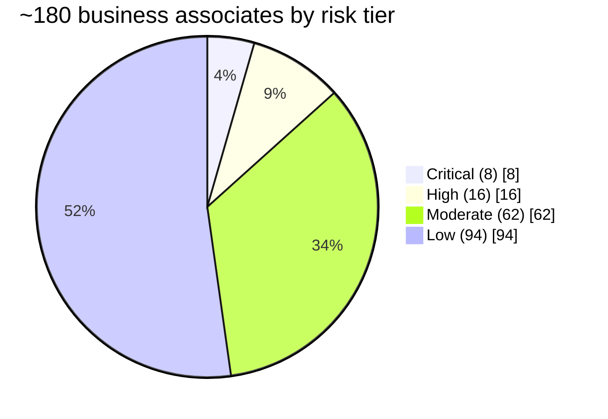

# Diagram — Business Associate Population

| Field | Value |
|---|---|
| Version | 1.0 |
| Date | 2026-07-15 |
| Classification | Confidential — Electronic Protected Health Information (ePHI) // Illustrative Portfolio Sample |
| Organization | MercyBridge Health Network (HIPAA covered entity) |
| Regulator | HHS Office for Civil Rights (OCR) |
| Phase | 06 — Business Associate & Third-Party Risk |
| Author | Advisory Team (Healthcare GRC / HIPAA) |
| Status | Approved |

The 24 Critical and High associates receive annual reassessment with evidence-backed assurance.

## Cross-References
`06.03-risk-tiering-and-criticality.md`.
