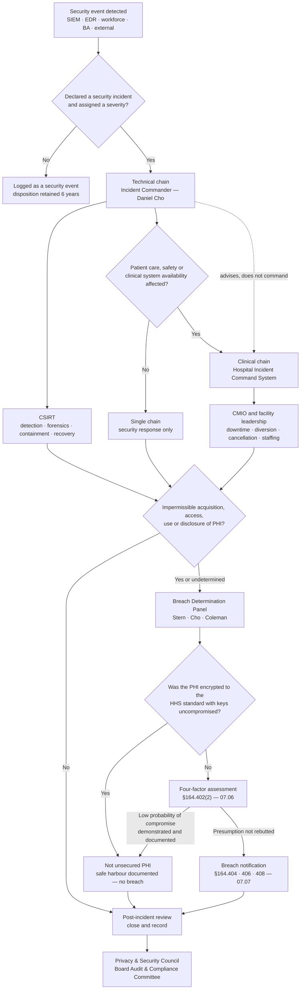

# 07.01 — Incident Response Program Overview

| Field | Value |
|---|---|
| Document ID | MBH-IRB-PGM-2026-701 |
| Version | 1.0 |
| Date | 2026-07-15 |
| Classification | Confidential — Electronic Protected Health Information (ePHI) // Illustrative Portfolio Sample |
| Owner | Daniel Cho, Chief Information Security Officer &amp; HIPAA Security Official |
| Co-Owner | Rebecca Stern, Chief Privacy Officer (breach determination and notification) |
| Author | Advisory Team (Healthcare GRC / HIPAA) |
| Status | Approved |

## Purpose

Phase 04 wrote the standing procedure required by **45 CFR §164.308(a)(6)**. Phase 07 turns it into a programme: a plan that can be activated at 03:00 on a Sunday, a triage capability that decides in minutes whether ePHI is in play, a four-factor assessment discipline that can survive an OCR document request, and a notification apparatus that runs to a **60-day** statutory clock the covered entity does not control the start of.

This document is the phase's frame. It states the regulatory basis, sets out the roles that make the programme work, establishes the **security incident versus breach** distinction as the keystone on which every later document depends, describes the interface to clinical operations — the feature that makes healthcare incident response different from every other sector's — and records the phase objectives.

Two risks are carried into this phase for treatment: **R-23 (enterprise ransomware, Moderate 10)** and **R-24 (double-extortion ePHI exfiltration, Moderate 12)**. Phases 04 and 05 reduced both from High by building safeguards. Phase 07 reduces them further by maturing **detection and response** — the two capabilities that determine not whether an attack happens, but how much of MercyBridge it reaches.

## 1. Regulatory Basis

| Authority | Provision | What it obliges MercyBridge to do | Where it is discharged |
|---|---|---|---|
| HIPAA Security Rule | **§164.308(a)(6)(i)** — Security Incident Procedures (Standard) | Implement policies and procedures to address security incidents | POL-12; 04.07; this phase |
| HIPAA Security Rule | **§164.308(a)(6)(ii)** — Response and Reporting (**Required**) | Identify and respond to suspected or known incidents; mitigate known harmful effects to the extent practicable; document incidents and outcomes | 07.02 – 07.05 |
| HIPAA Security Rule | **§164.308(a)(7)** — Contingency Plan | Data backup, disaster recovery, emergency mode operation, testing, criticality analysis | 04.08; invoked by 07.04 and 07.05 |
| HIPAA Security Rule | **§164.308(a)(1)(ii)(D)** — Information System Activity Review | Regularly review audit logs, access reports and incident tracking reports | 04.02; feeds 07.03 |
| HIPAA Security Rule | **§164.312(b)** — Audit Controls | Record and examine activity in systems containing ePHI | 05.06; the evidentiary base for Factor 3 |
| HIPAA Security Rule | **§164.316(b)** — Documentation | Retain required documentation **six years** from creation or last effective date | All incident and breach records |
| Breach Notification Rule | **§164.400–414** (Subpart D) | Definition of breach, four-factor assessment, notice to individuals, HHS, media; BA notice to CE; law-enforcement delay; burden of proof | 07.06, 07.07, 07.08 |
| HITECH Act | §13400 *et seq.* | Statutory basis for breach notification; direct business associate liability | 06.09; 07.07 |
| NIST SP 800-61 Rev. 3 | Incident handling lifecycle | Methodology reference for the six-phase lifecycle | 07.02 |
| NIST SP 800-66 Rev. 2 | §164.308(a)(6) implementation guidance | The methodology spine for the whole programme | 07.02 – 07.04 |
| 2025 HIPAA Security Rule NPRM | Proposed §164.308 | Written IR procedures, **24-hour** restoration procedures for critical systems, defined-interval testing | Built to voluntarily; 07.02 §7 |

## 2. The Keystone Distinction — Security Incident vs Breach

Every failure of judgement in healthcare incident handling traces back to treating these two words as synonyms. They are not. One is an operational category with a broad definition and no notification consequence of its own; the other is a legal determination with a statutory clock, a presumption running against the entity, and a regulator that will ask for the paperwork.

| Dimension | **Security Incident** | **Breach** |
|---|---|---|
| Source | **§164.304** (Security Rule definitions) | **§164.402** (Breach Notification Rule) |
| Definition | "The attempted or successful unauthorized access, use, disclosure, modification, or destruction of information or interference with system operations in an information system" | Acquisition, access, use or disclosure of **protected health information** in a manner not permitted by the Privacy Rule which compromises the security or privacy of the PHI |
| Counts attempts? | **Yes** — a blocked intrusion attempt is a security incident | **No** — an attempt that reaches no PHI is not a breach |
| Requires PHI? | **No** — interference with system operations suffices | **Yes**, and it must be **unsecured** PHI |
| Requires impermissibility under the Privacy Rule? | No | **Yes** — a permitted disclosure is never a breach, however alarming it looks |
| Default position | Neutral — investigate and classify | **Presumed to be a breach** |
| How the default is displaced | n/a | Documented **four-factor risk assessment** under §164.402(2) showing a **low probability that the PHI has been compromised**, or an applicable §164.402(1) exception |
| Who bears the burden | n/a | **The covered entity** — §164.414(b) |
| Encryption effect | None — an encrypted system can still be attacked | **Decisive** — PHI encrypted to HHS-specified standards is not "unsecured PHI," so its loss is not a breach at all |
| Clock | Respond, mitigate, document | **60 calendar days from discovery** to notify individuals; 500+ adds media and contemporaneous HHS notice |
| Accountable owner | Daniel Cho (Security Official) | Rebecca Stern (Privacy Officer), with Daniel Cho and Lisa Coleman |
| Record | Incident register entry | Four-factor assessment, determination memo, breach log |
| Review-period count | **3 declared security incidents** | **0 reportable breaches** |

Three consequences follow, and they are load-bearing for the rest of the phase.

1. **Every breach begins as a security incident; very few security incidents become breaches.** The funnel is real, but it must be *documented* at each narrowing, not asserted at the end.
2. **The presumption runs against MercyBridge.** "We found no evidence of access" is not a finding of low probability of compromise; it is an absence of evidence. Factor 3 in 07.06 turns on what the audit logs can actually prove — which is why **§164.312(b)** coverage delivered in Phase 05 is a breach-notification control, not merely a technical one.
3. **The encryption safe harbour removes the question rather than answering it.** Phase 05 took encryption at rest from 51 to **68 of 68** ePHI systems and 100% endpoint full-disk encryption, with an HSM-backed key hierarchy. Where ePHI is encrypted to the HHS standard *and the decryption key was not compromised in the same event*, there is no unsecured PHI, no presumption, and no four-factor assessment required. It is the only control in the programme that changes the legal character of a failure.

> **Stated so nobody over-claims it:** the safe harbour protects data at rest and in transit. It does **not** protect against an authenticated adversary who is served decrypted data — the **R-24** double-extortion case — and it does nothing for the **availability** loss in **R-23**. Ransomware involving ePHI remains, per OCR guidance, **presumptively a breach**.

## 3. Programme Scope

| In scope | Out of scope (handled elsewhere) |
|---|---|
| Any security incident affecting the **68 ePHI systems**, including the 12 Tier 1 clinical systems | Clinical adverse events with no information-system nexus — patient safety / risk management |
| The **6,120 networked medical devices** and IoMT estate | HR investigations without an ePHI dimension — Human Resources |
| All **~6,500 workforce members**, plus students, volunteers and contractors | General facilities emergencies — Emergency Management, unless ePHI or systems are affected |
| Incidents at or reported by any of the **~180 business associates** touching MercyBridge ePHI | Vendor commercial disputes — Supply Chain |
| Paper and verbal PHI incidents where the Privacy Office refers them for joint handling | Payment card incidents with no PHI — PCI DSS process, unless PHI is co-resident |
| All **34 locations** — 4 hospitals, ~30 outpatient and clinic sites | Non-MercyBridge systems on the health information exchange, except as a notified party |

## 4. Roles and Responsibilities

| Role | Held by | Authority in an incident | Cannot |
|---|---|---|---|
| **HIPAA Security Official / Incident Commander** | Daniel Cho | Declares an incident; assigns severity; activates the CSIRT; authorises containment actions including disconnection; owns the §164.308(a)(6) record | Determine breach alone; direct clinical operations |
| **Deputy Incident Commander / technical lead** | Marcus Reed | Runs the technical response; owns detection, triage, forensics and recovery validation | Approve external communications |
| **Chief Privacy Officer** | Rebecca Stern | Owns the **§164.402 breach determination** and all §164.404–408 notification; convenes the Breach Determination Panel | Suppress a determination for reputational reasons |
| **General Counsel** | Lisa Coleman | Legal privilege, external counsel and forensic retainers, law-enforcement liaison, regulator correspondence, BAA enforcement | Overrule the Privacy Officer's factual findings |
| **Chief Compliance Officer** | Karen Boyd | Ensures the determination is made and documented; reports to the Audit &amp; Compliance Committee | Serve as incident commander |
| **CIO** | Anthony Ruiz | Provides infrastructure, recovery and vendor escalation; owns restoration sequencing with the CMIO | Reconnect a system before recovery validation |
| **CMIO** | Dr. Samuel Ortega | Clinical impact assessment; owns EHR downtime declaration and the safety trade-off in containment | Be bypassed on any action affecting patient care |
| **Hospital Incident Command (HICS)** | Facility Incident Commander per site | Commands the *clinical* event: diversion, cancellation, staffing, surge | Direct technical containment |
| **VP Enterprise Risk** | Michelle Tran | Cyber insurance notification; enterprise risk register update | — |
| **Communications** | Corporate Communications lead | Drafts patient, workforce, media statements for GC and CPO approval | Release before determination sign-off |
| **CEO / Board** | Dr. Helen Marsh; Robert Feldman (Audit &amp; Compliance Chair) | Ransom-payment decision; enterprise-level judgement calls; oversight | Act as operational commander |
| **CSIRT analysts** | 14 named SIEM-authorised analysts | 24×7 triage, containment execution, evidence handling | Close a declared incident without a documented disposition |

### 4.1 The Two Chains of Command

A cyber incident in a hospital runs **two** command structures at once. Confusing them is how ambulance diversion gets decided by a network engineer.

**The dotted line is the governance point.** Security advises the clinical chain; it does not command it. A decision to isolate the PACS network is a security recommendation and a clinical decision, and the record shows who made it.

## 5. Interface to Clinical Operations

| Clinical interface | Trigger | Who decides | Security's role |
|---|---|---|---|
| EHR downtime declaration | Halcyon unavailable or untrustworthy | CMIO with facility Incident Commander | Advise on integrity and expected duration |
| Ambulance diversion | ED tracking, LIS or PACS loss degrading throughput | Facility Incident Commander with ED medical director | Advise; never decide |
| Elective procedure cancellation | Perioperative, imaging or lab dependency lost | Perioperative leadership with CMIO | Provide restoration forecast |
| Paper charting / downtime forms | EHR downtime declared | Nursing and HIM leadership | Confirm when e-documentation may resume |
| Medical device quarantine | IoMT anomaly on any of 6,120 devices | Clinical Engineering with the treating unit | Identify the device and the safe containment option |
| Blood bank, pharmacy, dialysis fallback | Tier 1 dependency lost | Department leadership | Prioritise restoration sequence |
| Care reconciliation after recovery | Return to normal operations | HIM with CMIO | Provide the downtime window and gap list |

The reconciliation step is not administrative housekeeping. Re-entering manually captured care creates an **integrity** exposure of its own (**R-43**) — retrospective documentation, duplicate records, lost interface messages — which is why the 2026-08 tabletop exercises re-entry and reconciliation, not just restoration.

## 6. Phase Objectives

| # | Objective | Deliverable | Owner | Status at 2026-07-15 |
|---|---|---|---|---|
| 1 | Publish an activatable Incident Response Plan with a defined lifecycle, severity model and activation authority | 07.02 | Daniel Cho | ✅ Approved |
| 2 | Make detection and triage evidenced rather than intuitive, including the discovery / clock-start determination | 07.03 | Marcus Reed | ✅ Approved |
| 3 | Define containment, eradication and recovery with the clinical trade-off made explicit | 07.04 | Daniel Cho | ✅ Approved |
| 4 | Produce a ransomware playbook covering the OCR presumption, double extortion, clinical continuity and immutable-backup recovery | 07.05 | Daniel Cho | ✅ Approved |
| 5 | Operationalise the §164.402(2) four-factor assessment with worked examples and a defensible record | 07.06 | Rebecca Stern | ✅ Approved |
| 6 | Document the full §164.404–414 notification apparatus and its timing arithmetic | 07.07 | Rebecca Stern | ✅ Approved |
| 7 | Provide ready-to-use notification templates and communications | 07.08 | Rebecca Stern | ✅ Approved |
| 8 | Exercise the plan against a ransomware / ePHI exposure scenario | TTX-2026-01, scheduled **2026-08-13**; after-action report due 2026-08-27 | Daniel Cho | ▶ Scheduled |

## 7. The Review Period in Numbers

| Measure | Value | Note |
|---|---|---|
| Security **events** triaged | 4,118 | Automated and human-reported |
| Escalated to analyst investigation | 138 | Of which 11 closed under a §164.402(1) exception |
| **Declared security incidents** | **3** | SEV-1: 0 · SEV-2: 1 · SEV-3: 2 · SEV-4: 0 |
| **Four-factor assessments performed** | **3** | One in every declared incident, including where safe harbour was available |
| **Reportable breaches** | **0** | No individual, HHS or media notification triggered |
| Business associate notifications received | 2 | One became INC-2026-0058; one involved no MercyBridge ePHI |
| Median detection → containment (SEV-2/3) | 2.6 hours | Target ≤ 4 hours |
| Post-incident reviews within 15 business days | 3 of 3 | 100% |
| ePHI systems forwarding to the SIEM | 62 of 68 | 6 on compensating controls; 68 of 68 by 2027-01-31 |
| ePHI systems encrypted at rest | **68 of 68** | Safe harbour available estate-wide |

## 8. Risks Treated in This Phase

| Risk | Entering Phase 07 | Treatment in this phase | Target residual |
|---|---|---|---|
| **R-23** — enterprise ransomware disabling Tier 1 clinical systems | **Moderate (10)** | Ransomware playbook (07.05); SEV-1 activation; immutable-backup recovery path; HICS integration; tabletop TTX-2026-01 | **Moderate (8)** at phase close, validated in Phase 08 |
| **R-24** — double-extortion exfiltration of ePHI | **Moderate (12)** | Exfiltration detection use cases (07.03); evidence preservation (07.04); mandatory four-factor path (07.06); notification readiness at scale (07.07) | **Moderate (9)** at phase close |
| **R-31** — BA breach notice arrives too late for the 60-day duty | Moderate (8) | 24-hour / 5-day contractual clocks exercised; agency assumption embedded in clock-start logic (07.03) | Low (4) on tabletop validation |
| **R-34** — clinician mailbox compromise exposing ePHI | Moderate | BEC playbook; MailItemsAccessed evidence standard for Factor 3 | Low |
| **R-43** — integrity loss on post-downtime reconciliation | Moderate (9) | Reconciliation built into recovery (07.04) and exercised | Moderate (6) |
| **R-47** — Tier 1 restoration time unvalidated at scale | Moderate (12) | Recovery validation gates; interface to §164.308(a)(7) | Moderate (8) |
| **R-49** — downtime procedures untested at outpatient sites | Moderate | Clinic downtime module in TTX-2026-01 | Low |

## Cross-References

| Reference | Relevance |
|---|---|
| 03.06 — Ransomware &amp; Healthcare Threat Profile | The R-23 / R-24 threat model this programme answers |
| 03.07 — Risk Register | Registered entries and scores |
| 04.02 — Security Management Process | Activity review as a detection source; sanctions as an outcome |
| 04.07 — Security Incident Procedures (§164.308(a)(6)) | The parent policy; POL-12 |
| 04.08 — Contingency Plan | Emergency mode operation invoked during SEV-1 |
| 05.06 — Audit Controls | The §164.312(b) evidence base that makes Factor 3 provable |
| 05.10 — Encryption &amp; Key Management | The safe harbour, achieved across 68 of 68 systems |
| 06.09 — Business Associate Incident &amp; Breach Coordination | The 24-hour / 5-day clocks and the agency doctrine |
| 07.02 — Incident Response Plan | The lifecycle, severity model and activation authority |
| 07.06 — Breach Risk Assessment — Four Factor | The statutory determination |
| 07.07 — Breach Notification Requirements | §164.404–414 obligations and timing |
| Phase 08 — Independent Assessment | External validation of detection and response |

---
[⬅ Previous](07.00-README.md) · [🏠 Phase README](07.00-README.md) · [Next ➡](07.02-incident-response-plan.md)
