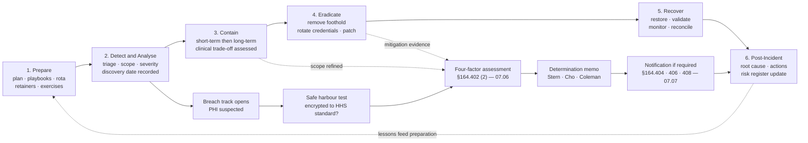
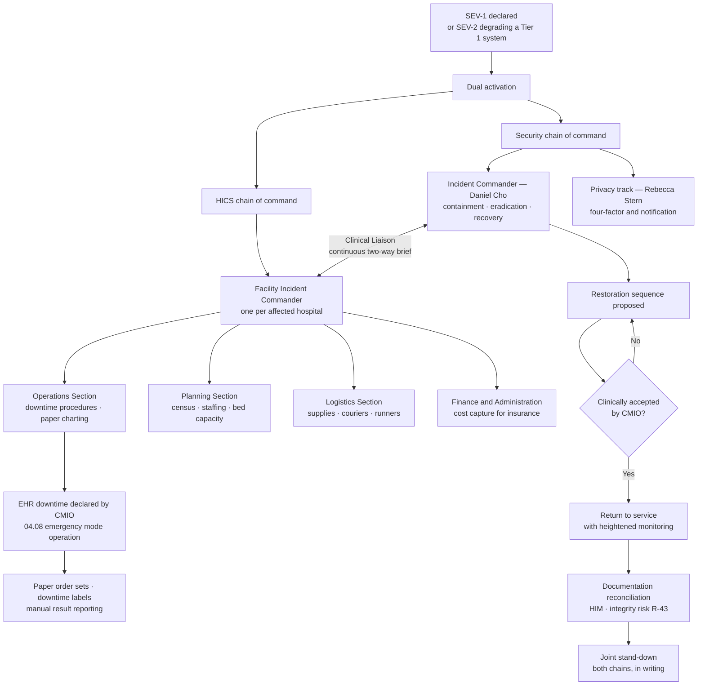

# 07.02 — Incident Response Plan

| Field | Value |
|---|---|
| Document ID | MBH-IRB-PLN-2026-702 |
| Version | 1.0 |
| Date | 2026-07-15 |
| Classification | Confidential — Electronic Protected Health Information (ePHI) // Illustrative Portfolio Sample |
| Owner | Daniel Cho, Chief Information Security Officer &amp; HIPAA Security Official |
| Co-Owner | Marcus Reed, Information Security Manager (Deputy Incident Commander) |
| Author | Advisory Team (Healthcare GRC / HIPAA) |
| Status | Approved |

## Purpose

This is the plan itself — the document a duty analyst opens at 03:00 when the EDR console lights up across three hospitals. It defines the **six-phase lifecycle**, the **SEV-1 to SEV-4 severity model with clinical-impact criteria**, who may declare and activate, how escalation runs, how the war room and command structure are constituted, how the security response integrates with the **Hospital Incident Command System (HICS)**, and what must be written down.

It discharges the operative wording of **§164.308(a)(6)(ii)**: *identify and respond* to suspected or known security incidents; *mitigate, to the extent practicable, harmful effects*; and *document* the incidents and their outcomes. It is written to be used under pressure, which means it is prescriptive about authority and deliberately unambiguous about who decides what.

The plan is not a substitute for judgement. It exists so that judgement is spent on the incident rather than on the process.

## 1. Scope, Activation Triggers and Standing Assumptions

| Element | Position |
|---|---|
| Applies to | All security incidents affecting the 68 ePHI systems, 6,120 medical devices, ~6,500 workforce, 34 locations and ~180 business associates |
| Activated by | Declaration of a **SEV-1** or **SEV-2** incident; any suspected impermissible disclosure of PHI affecting 500 or more individuals; any ransomware indication; any incident with a patient-safety dimension |
| Standing assumption 1 | **Assume ePHI is in scope until proven otherwise.** Scoping proceeds from the presumption, not to it |
| Standing assumption 2 | **Assume the adversary is present and watching.** Out-of-band communications are used from declaration until the environment is assessed |
| Standing assumption 3 | **Assume the clock has already started.** Discovery under §164.404(a)(2) may precede the declaration — see 07.03 §6 |
| Standing assumption 4 | **Assume the business associate is an agent.** Their discovery date is treated as MercyBridge's until Legal determines otherwise (06.09) |
| Suspension | The plan is stood down only by the Incident Commander, in writing, in the incident record |

## 2. The Six-Phase Lifecycle

Aligned to NIST SP 800-61 Rev. 3 and NIST SP 800-66 Rev. 2, mapped to the HIPAA duties it discharges.

| # | Phase | Objective | Primary owner | Exit criterion | HIPAA duty discharged |
|---|---|---|---|---|---|
| 1 | **Prepare** | Capability exists before it is needed: plan, playbooks, rota, tooling, retainers, training, exercises | Daniel Cho | Plan approved, rota staffed, tabletop scheduled, retainers executed | §164.308(a)(6)(i); §164.308(a)(5) |
| 2 | **Detect &amp; Analyse** | Determine that something happened, what it is, what it touched, and whether ePHI is involved | Marcus Reed | Severity assigned, scope statement issued, discovery date recorded | §164.308(a)(6)(ii) *identify*; §164.312(b) |
| 3 | **Contain** | Stop the spread without stopping care | Daniel Cho with CMIO | Containment verified; no further lateral movement observed | §164.308(a)(6)(ii) *respond and mitigate* |
| 4 | **Eradicate** | Remove the adversary, the malware and the access path | Marcus Reed | Root cause identified; all footholds removed; credentials rotated | §164.308(a)(6)(ii) *mitigate* |
| 5 | **Recover** | Restore trustworthy service and validate it | Anthony Ruiz with CMIO | Systems validated, monitored, and clinically accepted; data reconciled | §164.308(a)(7) |
| 6 | **Post-Incident** | Learn, correct, report, and update the risk analysis | Daniel Cho | PIR complete within 15 business days; actions assigned; register updated | §164.308(a)(8); §164.316(b) |

The breach determination track runs **in parallel** from the moment PHI is suspected — it does not wait for recovery. A covered entity that waits until the systems are back before starting the four-factor assessment has spent a large fraction of its 60 days on restoration.

## 3. Severity Model

Severity drives activation, commander, timers and notification. MercyBridge's model is deliberately **clinically weighted**: a small incident in the blood bank outranks a large one in the print estate.

| | **SEV-1 — Critical** | **SEV-2 — High** | **SEV-3 — Moderate** | **SEV-4 — Low** |
|---|---|---|---|---|
| **Definition** | Enterprise ePHI compromise, ransomware affecting Tier 1 clinical systems, or any incident with a patient-safety consequence | Confirmed unauthorised ePHI access or material system compromise without immediate patient-safety impact | Localised or suspected incident, limited scope, no confirmed ePHI compromise | Minor policy violation or near-miss, no ePHI exposure |
| **Clinical criteria** | Any Tier 1 system unavailable or untrustworthy; diversion or cancellation likely; device safety implicated | A Tier 1 system degraded; a single clinical department affected; workaround available | No clinical system affected, or a Tier 3 system only | None |
| **ePHI criteria** | Enterprise-scale exposure, or exfiltration evidenced, or 500+ individuals plausible | Confirmed impermissible access to ePHI, fewer than 500 individuals plausible | Suspected access; scope unresolved; single record or account | No ePHI |
| **Examples** | Ransomware across the EHR estate (**R-23**); mass exfiltration (**R-24**); PACS unavailable network-wide; infusion-pump fleet anomaly | Compromised clinician mailbox with ePHI (**R-34**); BA breach notice (**R-31**); ransomware contained to one department | Single-user credential compromise; endpoint malware; misdirected email to a known recipient | Unattended workstation; unapproved application install |
| **Incident Commander** | Daniel Cho | Daniel Cho or Marcus Reed | Marcus Reed | Duty analyst |
| **Acknowledge** | 15 minutes | 30 minutes | 4 hours | 1 business day |
| **Initial containment target** | 1 hour | 4 hours | 24 hours | 5 business days |
| **War room** | Immediate, physical + virtual, 24×7 | Virtual, business hours extended | Not required | Not required |
| **HICS** | **Activated** | Activated if a Tier 1 system is degraded | No | No |
| **Executive notification** | CEO, CIO, CMIO, CPO, GC immediately; Board Chair within 4 hours | Executive team within 4 hours; Board at next meeting, or sooner if 500+ plausible | Security Official daily summary | Weekly summary |
| **External counsel / forensics** | Engaged at declaration | Engaged on GC judgement | No | No |
| **Cyber insurer** | Notified within 4 hours | Notified within 24 hours | On GC judgement | No |
| **Breach track** | Opens automatically | Opens automatically | Opens if PHI suspected | No |
| **Status cadence** | Every 2 hours, then every 4 | Twice daily | Daily | Weekly |

**Severity is provisional and is re-evaluated at every status point.** Escalation is expected and carries no penalty; the failure mode this model guards against is a SEV-3 that was a SEV-1 for eleven hours.

## 4. Activation Authority and Escalation

| Action | Who may authorise | Who may **not** be bypassed | Record required |
|---|---|---|---|
| Declare a security incident | Any duty analyst | — | Register entry within 30 minutes |
| Assign or change severity | Duty analyst (SEV-3/4); Marcus Reed (SEV-2); Daniel Cho (SEV-1) | — | Timeline entry with rationale |
| **Activate this plan** | Daniel Cho, or Marcus Reed in his absence, or the on-call CSIRT lead if neither is reachable within 15 minutes | — | Activation notice with timestamp |
| Isolate a non-clinical host or account | Duty analyst | — | Timeline entry |
| Isolate a **clinical** system or device | Daniel Cho **with** CMIO or delegate | **CMIO** | Joint decision record — 07.04 §2 |
| Declare EHR downtime | CMIO with facility Incident Commander | CMIO | HICS log and incident timeline |
| Divert ambulances / cancel electives | Facility Incident Commander with clinical leadership | Facility Incident Commander | HICS log |
| Engage external forensics / counsel | Lisa Coleman | GC | Engagement letter; privilege instruction |
| Engage law enforcement (FBI / HHS) | Lisa Coleman with Daniel Cho | GC | Contact log — 07.05 §6 |
| Notify the cyber insurer | Michelle Tran | — | Notification record |
| **Determine breach / no breach** | Breach Determination Panel: Rebecca Stern (chair), Daniel Cho, Lisa Coleman | **CPO** | Signed determination memo |
| Approve individual / media notification content | Rebecca Stern with Lisa Coleman | CPO and GC | Approved copy, version-controlled |
| Consider ransom payment | Board-informed decision by the CEO on GC and insurer advice | CEO, GC, Board Chair | Decision memo — 07.05 §4 |
| Stand down the plan | Daniel Cho, in writing | — | Stand-down notice |

### 4.1 Escalation Ladder

| Tier | Trigger | Notified | Within |
|---|---|---|---|
| T0 | Event escalated by triage | Duty analyst, Security Operations lead | Immediate |
| T1 | SEV-3 declared | Marcus Reed | 4 hours |
| T2 | SEV-2 declared, or PHI confirmed involved | Daniel Cho, Rebecca Stern, Lisa Coleman | 30 minutes |
| T3 | SEV-1 declared, or ransomware indication, or 500+ individuals plausible | CEO, CIO, CMIO, CCO, VP Enterprise Risk | Immediate |
| T4 | SEV-1 confirmed, or notification appears probable | Board Audit &amp; Compliance Committee Chair (Robert Feldman) | 4 hours |
| T5 | Notification determined, or law enforcement engaged, or care materially disrupted | Full Board; regulators per 07.07; state agencies | Per statute |

## 5. Command Structure and the War Room

| Function | Role in the war room | Filled by |
|---|---|---|
| Incident Commander | Owns the response; single decision point; sets battle rhythm | Daniel Cho |
| Deputy / Technical Lead | Runs the technical workstreams | Marcus Reed |
| Scribe | Contemporaneous timeline; every decision, actor, timestamp | Rotating CSIRT analyst — **never** a responder |
| Forensics Lead | Evidence acquisition, chain of custody, analysis | CSIRT senior analyst or retained firm |
| Infrastructure Lead | Networks, servers, identity, backup | IT Operations manager |
| Clinical Liaison | Two-way channel to HICS; translates technical to clinical | CMIO delegate |
| Privacy Lead | Runs the breach track in parallel | Rebecca Stern |
| Legal Lead | Privilege, retainers, law enforcement, regulators | Lisa Coleman |
| Communications Lead | Internal, patient, media, portal messaging | Corporate Communications |
| BA / Vendor Liaison | Halcyon and other BA escalation under 06.09 clocks | Vendor Management with Karen Boyd |
| Logistics | Rota, relief, food, physical space, badge access | Security Operations coordinator |

**Battle rhythm for SEV-1:** stand-up at declaration; situation report every 2 hours for the first 12 hours, then every 4; formal executive brief twice daily; scribe log reconciled at every shift change; **12-hour maximum shifts with mandated relief** — fatigue is a containment risk.

**Out-of-band communications.** On declaration of SEV-1, or any incident where identity or messaging infrastructure may be compromised, the response moves to the pre-provisioned out-of-band channel: a separately tenanted conferencing and messaging service, a printed call tree held at each hospital's administrative office, and a roster of personal mobile numbers held under a documented business purpose. The assumption is that the adversary reads the corporate mailbox.

## 6. Integration with the Hospital Incident Command System

| HICS principle | How security response conforms |
|---|---|
| Single Facility Incident Commander per site | Security does not create a competing commander for the clinical event |
| Common terminology | Severity translated into clinical language at every brief — "imaging unavailable for 8 hours," not "PACS VLAN quarantined" |
| Manageable span of control | CSIRT workstreams capped at five per lead |
| Integrated communications | One shared situation report, published to both chains |
| Written incident action plan per operational period | Security workstreams appear as objectives in the HICS action plan |
| Demobilisation is a decision, not a drift | Joint written stand-down required |

## 7. Documentation Requirements

Documentation is a **requirement of the specification**, not an artefact of good manners, and it is the first thing OCR asks for. Every item below is retained **six years** under §164.316(b)(2)(i).

| Record | Created by | When | Notes |
|---|---|---|---|
| Incident register entry | Duty analyst | Within 30 minutes of declaration | ID, discovery date/time, discoverer, channel, severity, systems, data, owner |
| **Discovery determination** | Marcus Reed | At triage | The §164.404(a)(2) date and its reasoning — the clock-start record |
| Contemporaneous timeline | Scribe | Continuously | Action, decision, actor, timestamp; no retrospective reconstruction |
| Scope statement | Marcus Reed | On analysis, revised as needed | Systems, accounts, records, individuals, method used |
| Evidence log | Forensics Lead | On each acquisition | Chain of custody, hashes, storage location, handler |
| Containment decision record | Incident Commander | Per clinical containment action | Options considered, clinical input, decision, rationale |
| Mitigation record | Workstream leads | As performed | The §164.308(a)(6)(ii) *mitigate* evidence |
| **Four-factor assessment** | Rebecca Stern | Before determination | 07.06 template |
| Determination memo | Breach Determination Panel | Before notification deadline | Signed by Stern, Cho, Coleman |
| Notification record | Privacy Office | On each notification | Individuals, HHS, media, state; dates, methods, counts |
| Post-incident review | Daniel Cho | Within 15 business days | Root cause, contributing factors, actions, owners, dates |
| Risk register update | Michelle Tran | On PIR close | Whether the event changes a Phase 03 score — a §164.308(a)(8) trigger |
| Cost capture | Finance section | Throughout | Insurance claim and Board reporting |

**Privilege.** Where external counsel is engaged, forensic work performed at counsel's direction may be privileged. Privilege is asserted deliberately by the General Counsel and never used as a reason to avoid creating the records HIPAA requires. The regulatory record and the privileged workstream are maintained as **separate** artefacts.

## 8. Plan Maintenance, Testing and NPRM Readiness

| Requirement | MercyBridge commitment | Frequency | Owner |
|---|---|---|---|
| Plan review and reapproval | Full review against the register and lessons learned | Annually, and after any SEV-1 | Daniel Cho |
| **Tabletop exercise** | **TTX-2026-01 — ransomware with ePHI exfiltration**, scheduled **2026-08-13**; includes four-factor determination and outpatient downtime modules; after-action report due 2026-08-27 | At least annually | Daniel Cho |
| Functional / technical exercise | Restoration of one Tier 1 system from immutable backup | Annually | Anthony Ruiz |
| Call-tree and out-of-band test | Unannounced, out of hours | Twice yearly | Marcus Reed |
| Playbook currency | Ransomware, BEC, medical device, BA, insider, lost-device | Reviewed semi-annually | Marcus Reed |
| Retainer currency | External counsel, forensics, notification vendor, crisis communications | Verified annually | Lisa Coleman |
| **NPRM readiness** — written IR procedures | Delivered by this plan | — | Daniel Cho |
| **NPRM readiness** — 24-hour restoration procedures for critical systems | Documented per Tier 1 system; validated for 7 of 12 to date | Programme of work to Q1 2027 | Anthony Ruiz |
| **NPRM readiness** — testing at defined intervals | Annual tabletop plus annual functional test, formally scheduled | — | Daniel Cho |

## Cross-References

| Reference | Relevance |
|---|---|
| 04.07 — Security Incident Procedures | POL-12, the parent policy this plan operationalises |
| 04.08 — Contingency Plan | Emergency mode operation and downtime procedures invoked at SEV-1 |
| 05.06 — Audit Controls | Evidence sources for scoping and Factor 3 |
| 06.09 — Business Associate Incident &amp; Breach Coordination | Vendor liaison role and the 24-hour / 5-day clocks |
| 07.01 — Incident Response Program Overview | Roles, regulatory basis, incident-vs-breach distinction |
| 07.03 — Detection &amp; Triage | How phase 2 of the lifecycle is executed |
| 07.04 — Containment, Eradication &amp; Recovery | How phases 3 to 5 are executed |
| 07.05 — Ransomware Response Playbook | The SEV-1 scenario this plan is built around |
| 07.06 — Breach Risk Assessment — Four Factor | The parallel breach track |
| 07.07 — Breach Notification Requirements | Notification obligations arising from a determination |

---
[⬅ Previous](07.01-incident-response-program-overview.md) · [🏠 Phase README](07.00-README.md) · [Next ➡](07.03-detection-and-triage.md)
