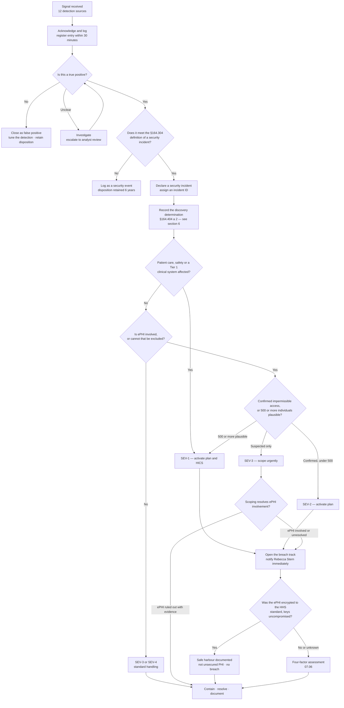

# 07.03 — Detection &amp; Triage

| Field | Value |
|---|---|
| Document ID | MBH-IRB-DET-2026-703 |
| Version | 1.0 |
| Date | 2026-07-15 |
| Classification | Confidential — Electronic Protected Health Information (ePHI) // Illustrative Portfolio Sample |
| Owner | Marcus Reed, Information Security Manager |
| Co-Owner | Daniel Cho, Chief Information Security Officer &amp; HIPAA Security Official |
| Author | Advisory Team (Healthcare GRC / HIPAA) |
| Status | Approved |

## Purpose

Detection determines everything downstream. An incident that is found in twenty minutes is a containment problem; the same incident found in twenty days is a notification event affecting 2.1 million people. This document defines how MercyBridge detects security incidents across **68 ePHI systems**, **6,120 medical devices**, **~6,500 workforce members** and **~180 business associates**; how the duty analyst triages what arrives; the scoping questions that must be answered before any severity is trusted; and — the provision most often mishandled in healthcare — **when "discovery" occurs for the purposes of §164.404(a)(2)**, because that is the moment the 60-day clock starts, whether or not anyone at MercyBridge has noticed.

It executes phase 2 of the lifecycle in 07.02 and feeds the breach track in 07.06.

## 1. Detection Sources

Under-reporting is the failure mode, so MercyBridge maintains many doors into one queue. No reporter is asked to decide whether something is "really" an incident.

| # | Source | Coverage | Typical signal | Median time to queue | Routing |
|---|---|---|---|---|---|
| 1 | **SIEM** | **62 of 68** ePHI systems forwarding; 68 of 68 by 2027-01-31 | Correlated authentication, access, egress and configuration anomalies | Real time | Duty analyst queue |
| 2 | **EDR** | Managed servers and endpoints | Mass file modification, credential dumping, living-off-the-land behaviour, shadow-copy deletion | Real time | Auto-isolate on high-confidence detections, then analyst |
| 3 | **DLP** | Email and endpoint (deployed under the Phase 05 workplan) | ePHI leaving by mail, upload or removable media | Real time | Analyst + Privacy Office |
| 4 | **Medical device / IoMT anomaly** | 5,930 of 6,120 devices profiled | Device deviating from its behavioural baseline; unexpected outbound connection; unauthorised firmware | Real time | Analyst + Clinical Engineering |
| 5 | **Identity and access analytics** | SSO estate and directory | Impossible travel, MFA fatigue, dormant-account use, privilege escalation | Real time | Analyst |
| 6 | **Privacy monitoring** | Halcyon EHR and ancillary access logs | Same-surname, VIP, co-worker, neighbour, break-glass, employee-record access | Weekly report; daily for flagged patients | Rebecca Stern → joint triage |
| 7 | **§164.308(a)(1)(ii)(D) activity review** | All 68 systems under the 04.02 runbook | Review exceptions escalated by system owners | Per review cycle | Analyst |
| 8 | **Workforce reporting** | All 6,500, 24×7 | Phishing button, hotline, service-desk ticket, intranet form, anonymous compliance line | 7-minute median first phishing report | Analyst queue |
| 9 | **Business associate notification** | ~180 BAs; 24 critical/high on compressed clocks | BA reports a suspected or confirmed incident involving MercyBridge ePHI | **24 hours** initial / **5 calendar days** full written notice (BAA term) | Vendor Liaison → Legal → joint triage |
| 10 | **External notification** | FBI, HHS OCR, HHS HC3, CISA, Health-ISAC, state agencies, researchers, patients, journalists | Victim notification, leak-site listing, sector advisory, responsible disclosure | On receipt | Daniel Cho + Lisa Coleman, immediately |
| 11 | **Vulnerability and attack-surface monitoring** | External perimeter, 38 cloud services | New exposure, credential appearing in a paste or broker market | Daily | Analyst |
| 12 | **Clinical and operational staff observation** | All sites | "The scanner is behaving oddly"; "these results look wrong"; a fax to the wrong number | Immediate to hours | Analyst + Clinical Engineering / Privacy |

**Two sources deserve special handling because they arrive with the clock already running.** A **business associate notification** may report a discovery that occurred days earlier — and if the BA is an agent under the federal common law of agency, that earlier date is MercyBridge's discovery date (06.09). An **external notification** — the FBI calling, or MercyBridge's name appearing on a leak site — means an outsider knew before MercyBridge did, and the discovery analysis in §6 must consider what reasonable diligence would have revealed and when.

### 1.1 Known Detection Gaps and Compensating Controls

| Gap | Population | Compensating control | Closure |
|---|---|---|---|
| Six ePHI systems not forwarding to the SIEM | 6 of 68 | Local log retention with monthly manual extract and review; named owner per system | 2027-01-31 |
| Seven systems using local credentials outside the SSO estate | 7 | Quarterly credential attestation; privileged-use review | Q4 2026 |
| EDR excluded on vendor-controlled device-adjacent hosts | Limited set under FDA change control | Network-level monitoring; device VLAN anomaly detection | Vendor-dependent |
| 190 unprofiled portable medical devices | 190 of 6,120 | Manual inventory reconciliation; NAC quarantine on unknown MAC | Q4 2026 |
| Intra-zone lateral movement where micro-segmentation is incomplete | 27 of 68 systems | Host-based firewall logging to SIEM; east-west flow sampling | Q4 2026 |

Gaps are listed rather than rounded away, because at determination time the question is not "did we detect it" but "**could we have**" — and that is a §164.404(a)(2) question with a 60-day consequence.

## 2. Intake and the Duty Analyst

| Step | Standard | Owner |
|---|---|---|
| Acknowledge an inbound report or alert | 15 minutes (automated), 30 minutes (human-reported) | Duty analyst |
| Create the register entry | **Within 30 minutes** of declaration | Duty analyst |
| Record the **discovery determination** | At triage, before severity | Duty analyst, reviewed by Marcus Reed |
| Assign provisional severity | At triage | Duty analyst (SEV-3/4); escalate for SEV-1/2 |
| Notify the Privacy Office | Immediately if PHI is suspected or unresolved | Duty analyst |
| Publish the first scope statement | SEV-1: 2 hours · SEV-2: 4 hours · SEV-3: 24 hours | Marcus Reed |

Rota: 24×7 coverage from a follow-the-sun duty roster of the **14 SIEM-authorised analysts**, with a named on-call CSIRT lead and documented escalation to Marcus Reed and Daniel Cho.

## 3. Triage Decision Tree

## 4. Initial Scoping Questions

The duty analyst works this list before trusting any severity. Answers are recorded with their **evidence source and confidence**, because an unsupported answer becomes an unsupported four-factor assessment.

| # | Question | Why it matters | Primary evidence |
|---|---|---|---|
| 1 | **Was ePHI involved at all?** | Determines whether the breach track opens | System classification (Phase 02 inventory), data-flow map, file inventory |
| 2 | **Which systems, accounts and data stores?** | Sets scope and containment options | SIEM, EDR, directory, asset register |
| 3 | **Was the ePHI encrypted to the HHS standard, and were the keys compromised?** | If yes and no respectively, there is **no unsecured PHI and no breach** | Encryption attestation (05.10), key-management records, HSM logs |
| 4 | **How many individuals are potentially affected?** | Drives SEV, media notice at 500+, and notification logistics | Database counts, file record counts, mailbox item counts |
| 5 | **What data elements and identifiers?** | Factor 1 — nature and extent; re-identification likelihood | Data dictionary, sample inspection under privacy supervision |
| 6 | **Were sensitive categories involved?** | Behavioural health, substance use (42 CFR Part 2), HIV, reproductive, genetic, minors, VIP | Source-system flags, department of origin |
| 7 | **Who is the unauthorised person?** | Factor 2 — a workforce member, another covered entity, a criminal group, unknown | Authentication logs, IP and geolocation, threat intelligence |
| 8 | **Was the ePHI actually acquired or viewed, or only exposed?** | Factor 3 — the factor that most often decides the outcome | `MailItemsAccessed` and equivalent access logs, web/SFTP transfer logs, EDR file telemetry, egress volume |
| 9 | **Is there evidence of exfiltration?** | Drives R-24 handling and effectively forecloses a low-probability finding | Egress logs, proxy, firewall, staging artefacts, attacker tooling |
| 10 | **Is the exposure ongoing?** | Containment urgency; the clock does not wait for it to stop | Live telemetry |
| 11 | **When did this begin, and when could MercyBridge first have known?** | The **discovery** determination — §6 | Log timeline, first-alert time, ticket history |
| 12 | **Is a business associate involved?** | Agency analysis and the 60-day arithmetic | BA inventory, BAA terms, vendor notice |
| 13 | **Is there a patient-safety dimension?** | Forces SEV-1 and HICS | Clinical Engineering, CMIO assessment |
| 14 | **Has any evidence already been destroyed or overwritten?** | Affects both forensics and the defensibility of Factor 3 | Log retention windows, snapshot availability |
| 15 | **Does anything suggest a claim of publication or extortion?** | Opens the R-24 double-extortion path | Ransom note, leak site, attacker contact |

**A recorded "unknown" is a valid and preferred answer.** The four-factor assessment must reflect what MercyBridge could prove, and an unknown that is later resolved is far better than a guess that is later contradicted.

## 5. Triage Outcomes in the Review Period

| Stage | Count | Notes |
|---|---|---|
| Security **events** triaged | 4,118 | 71% automated disposition |
| Escalated to analyst investigation | 138 | |
| Closed as false positive after investigation | 84 | Detection tuning applied in 22 cases |
| Closed as a security event, no ePHI nexus | 43 | Disposition retained 6 years |
| Closed under a **§164.402(1) exception** | 11 | See 07.06 §5 for the breakdown |
| **Declared security incidents** | **3** | SEV-1: 0 · SEV-2: 1 · SEV-3: 2 |
| Four-factor assessments performed | **3** | One per declared incident |
| Reportable breaches | **0** | |
| Median detection → containment (SEV-2/3) | 2.6 hours | |
| Median workforce phishing report | 7 minutes | From delivery to first report |

| ID | Discovered | SEV | Detection source | Summary | Outcome |
|---|---|---|---|---|---|
| **INC-2026-0031** | 2026-03-11 | SEV-3 | Workforce report (clinician) | Encrypted clinician laptop lost in transit between the Rivermont campus and an outpatient clinic | Safe harbour documented; four-factor assessment completed for one file of indeterminate provenance → low probability of compromise; **not a breach** |
| **INC-2026-0044** | 2026-05-06 | SEV-2 | SIEM (impossible travel) + workforce report | Business email compromise of a revenue-cycle mailbox reached through a legacy connector without MFA; 9 days of adversary access | Four-factor assessment → low probability of compromise on access-log evidence; **not a breach** |
| **INC-2026-0058** | 2026-06-22 notified; **discovery date adopted 2026-06-20** (BA discovery imputed under the agency assumption) | SEV-3 | Business associate notification (H4 CodeBridge, coding vendor) | Misconfigured vendor SFTP directory exposed a coding worklist containing MercyBridge ePHI | Four-factor assessment → low probability of compromise; attestation of deletion obtained; **not a breach** |

The second business associate notification received in the period (H3 Verbatim, transcription) was investigated and closed as an event: the affected records were determined not to contain MercyBridge ePHI. Both BA notices were assessed; only one produced a declared incident.

## 6. Discovery and the Clock Start — §164.404(a)(2)

This is the single most consequential determination the triage function makes, and it is made **at triage**, not at determination.

> **§164.404(a)(2):** a breach is treated as **discovered** by a covered entity as of the first day on which the breach is **known to the covered entity**, or, **by exercising reasonable diligence would have been known** to the covered entity — that is, to any person, other than the person committing the breach, who is a **workforce member or agent** of the covered entity.

| Principle | Consequence for MercyBridge |
|---|---|
| Discovery is **constructive as well as actual** | Not looking is not a defence. The clock can start on a day nobody read the alert |
| It attaches to **any** workforce member or agent | A ward clerk who sees a misdirected discharge summary starts the clock; it does not wait for the Privacy Office |
| It excludes only the person who committed the breach | An employee snooping does not start the clock by their own knowledge; their supervisor's knowledge does |
| **Agents** are included | A business associate that is an agent imputes its discovery to MercyBridge — the 06.09 arithmetic |
| Discovery is of the **breach**, not of the full scope | The clock runs while scoping continues. "We were still investigating" is not an extension |
| Reasonable diligence is a **business-associate-of-the-facts standard** | It is measured against what a prudent covered entity with MercyBridge's monitoring capability should have seen — which is why §1.1 gaps are documented |

### 6.1 The Discovery Determination Record

Every declared incident carries a completed discovery determination before severity is finalised.

| Field | Content | Example — INC-2026-0044 |
|---|---|---|
| Event start (adversary first access) | Earliest evidenced adversary activity | 2026-04-27 |
| First MercyBridge signal generated | Earliest alert, log entry or report, whether or not actioned | 2026-05-06, 07:12 — impossible-travel alert |
| First actual human knowledge | First workforce member or agent aware | 2026-05-06, 07:41 — duty analyst |
| **Reasonable-diligence date** | Date a prudent entity with this monitoring should have known | 2026-05-06 — the connector lacked MFA but produced no earlier ingestible signal; documented as a detection gap and remediated |
| **Discovery date adopted** | The earlier of actual knowledge and reasonable diligence | **2026-05-06** |
| 60-day outer limit if a breach were found | Discovery + 60 calendar days | 2026-07-05 |
| Agency consideration | Any BA involved and its agency status | None |
| Reasoning and dissent | Narrative; any disagreement recorded | Recorded; no dissent |
| Approved by | Marcus Reed, endorsed by Rebecca Stern | ✅ |

**The adopted date is the earlier of actual knowledge and constructive knowledge, and MercyBridge does not adopt a later date because it is more convenient.** Where the analysis is genuinely contestable, the earlier date is adopted and the reasoning recorded — the cost of notifying nine days early is trivial next to the cost of a §164.414(b) burden MercyBridge cannot discharge.

### 6.2 What Does *Not* Stop or Pause the Clock

| Argument sometimes made | Position |
|---|---|
| "We were still investigating scope" | Does not pause the clock; §164.404(a)(1) requires notice without unreasonable delay and in no case later than 60 days |
| "The forensic report is not final" | Does not pause the clock; notify on the best information available and supplement |
| "The business associate has not confirmed" | Does not pause the clock where the BA is an agent; escalate under the BAA |
| "We could not identify every individual" | Does not pause the clock; substitute notice exists precisely for this (07.07 §6) |
| "Law enforcement asked us to hold" | **Does** permit delay — but only under **§164.412**, only for the period specified, in writing, or 30 days if the request is oral and undocumented (07.07 §8) |
| "Our systems were down" | Does not pause the clock; contingency operations must include the notification function |

## 7. Detection Improvements Committed in This Phase

| # | Improvement | Addresses | Target | Owner |
|---|---|---|---|---|
| 1 | Ransomware-specific SIEM use cases: shadow-copy deletion, mass rename entropy, backup-policy change, dormant-admin use | R-23 | Q3 2026 | Marcus Reed |
| 2 | Exfiltration use cases: outbound volume baselining, rare-destination transfer, archive-staging detection, cloud-sync abuse | R-24 | Q4 2026 | Marcus Reed |
| 3 | Complete SIEM ingestion for the remaining 6 ePHI systems | Detection gap | 2027-01-31 | Marcus Reed |
| 4 | Extend DLP content inspection to email and endpoint across the managed estate | R-24, R-41 | Q4 2026 → 2027 capital cycle | Daniel Cho |
| 5 | Profile the 190 remaining portable medical devices; NAC quarantine for unknown devices | R-10 | Q4 2026 | Clinical Engineering with Marcus Reed |
| 6 | Automate the discovery-determination record inside the incident register | §164.404(a)(2) defensibility | Q3 2026 | Marcus Reed |
| 7 | Leak-site and credential-broker monitoring for MercyBridge identifiers | R-24 | Q3 2026 | Marcus Reed |
| 8 | Quarterly purple-team validation of the ransomware and exfiltration use cases | R-23, R-24 | From Q4 2026 | Daniel Cho with Ironwood Security Labs |

## Cross-References

| Reference | Relevance |
|---|---|
| 02.03 — ePHI System Inventory | System classification used in scoping question 1 |
| 03.06 — Ransomware &amp; Healthcare Threat Profile | Detection posture and early-warning indicators |
| 04.02 — Security Management Process | §164.308(a)(1)(ii)(D) activity review as a detection source |
| 04.07 — Security Incident Procedures | The reporting channels and the intake standard |
| 05.06 — Audit Controls | SIEM coverage, log retention and the Factor 3 evidence base |
| 05.11 — Medical Device Security Controls | IoMT anomaly detection across 6,120 devices |
| 06.09 — Business Associate Incident &amp; Breach Coordination | The 24-hour / 5-day clocks and the agency doctrine |
| 07.02 — Incident Response Plan | Severity model and escalation ladder |
| 07.04 — Containment, Eradication &amp; Recovery | What happens once triage hands over |
| 07.06 — Breach Risk Assessment — Four Factor | Where the scoping answers are used |
| 07.07 — Breach Notification Requirements | The clock this document starts |

---
[⬅ Previous](07.02-incident-response-plan.md) · [🏠 Phase README](07.00-README.md) · [Next ➡](07.04-containment-eradication-recovery.md)
