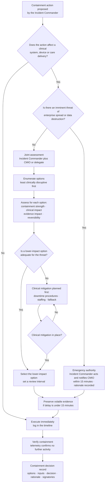
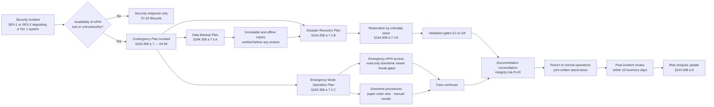

# 07.04 — Containment, Eradication &amp; Recovery

| Field | Value |
|---|---|
| Document ID | MBH-IRB-CER-2026-704 |
| Version | 1.0 |
| Date | 2026-07-15 |
| Classification | Confidential — Electronic Protected Health Information (ePHI) // Illustrative Portfolio Sample |
| Owner | Daniel Cho, Chief Information Security Officer &amp; HIPAA Security Official |
| Co-Owner | Marcus Reed, Information Security Manager (technical execution) · Anthony Ruiz, CIO (restoration) |
| Author | Advisory Team (Healthcare GRC / HIPAA) |
| Status | Approved |

## Purpose

This document covers lifecycle phases 3 to 5 — **contain, eradicate, recover** — and the return to normal operations. It exists as its own document because in a hospital these phases carry a trade-off that does not exist in other sectors: **the fastest way to contain a compromise is to disconnect the system, and the system may be keeping someone alive.**

It sets out the containment options and how the clinical trade-off is decided and recorded; evidence preservation, because containment routinely destroys the evidence the four-factor assessment later needs; eradication and its verification; recovery with validation gates; documentation reconciliation after downtime; and the interface to the **§164.308(a)(7)** contingency plan and emergency mode operation delivered in Phase 04.

It discharges the *respond* and *mitigate to the extent practicable* limbs of **§164.308(a)(6)(ii)** and produces the Factor 4 evidence used in 07.06.

## 1. Principles

| # | Principle | Meaning in practice |
|---|---|---|
| 1 | **Contain without harming patients** | Every containment action affecting a clinical system is a joint decision with the CMIO, and the alternative options considered are written down |
| 2 | **Preserve before you destroy** | Volatile evidence is captured before isolation or reimaging wherever the delay is measured in minutes, not hours |
| 3 | **Contain fully, not partially** | Half-containment tips the adversary and accelerates deployment; where possible, actions are staged and executed together |
| 4 | **Assume the adversary sees your response** | Out-of-band comms; no discussion of the response in potentially compromised channels |
| 5 | **Eradicate the access path, not just the artefact** | Removing malware without closing the entry vector guarantees a second event |
| 6 | **Recover to a validated state, not to a working state** | "It boots" is not recovery. Clinical acceptance and heightened monitoring are gates |
| 7 | **Mitigation is a regulatory obligation** | §164.308(a)(6)(ii) requires mitigation of known harmful effects; what was done becomes Factor 4 evidence |
| 8 | **Reconciliation is part of recovery** | Care delivered on paper must return to the record; that is an integrity risk (**R-43**) with its own controls |

## 2. Containment

### 2.1 Options and Their Clinical Cost

| Option | Speed | Containment strength | Clinical cost | Evidence cost | Typical use |
|---|---|---|---|---|---|
| Disable account / revoke sessions and tokens | Minutes | High for identity-based attacks | Low — user loses access, care continues | Low | Credential compromise, BEC |
| EDR host isolation (network quarantine, agent retained) | Minutes | High for a single host | Low to moderate | **Low — memory and disk preserved** | Endpoint malware, first ransomware indicators |
| Block egress destination at proxy / firewall | Minutes | Moderate — stops exfiltration channel | None | Low | Suspected exfiltration (**R-24**) |
| Disable a network interface / port | Minutes | High for one device | Moderate if the device is in use | Low | Rogue device, compromised appliance |
| VLAN or zone quarantine | 15–60 minutes | High across a segment | **High** if a clinical segment | Low | Lateral movement, device-VLAN spread |
| Suspend an integration or interface engine feed | 15–60 minutes | Moderate | **High** — results and orders stop flowing | Low | Compromised interface, poisoned feed |
| Disable remote access / VPN broadly | Under an hour | High | Moderate — remote clinicians and vendors lose access | Low | Active intrusion via remote access |
| Take a clinical application offline | Under an hour | Very high | **Very high** — downtime procedures invoked | Moderate | Ransomware in a Tier 1 system |
| Sever a business associate connection | Hours (contractual) | High | Varies — may stop transcription, coding, imaging exchange | Low | BA compromise under 06.09 |
| **Enterprise network isolation** | Hours | Maximum | **Extreme** — whole-system downtime, diversion likely | Moderate | Uncontrolled ransomware propagation only |
| Power off a host | Minutes | High | Varies | **High — volatile memory lost** | Last resort; only where imminent destruction outweighs evidence |

### 2.2 The Clinical Trade-Off Decision

No containment action affecting patient care is taken unilaterally by security. The decision is joint, time-boxed and recorded.

| Containment decision record — required fields |
|---|
| Incident ID, date and time, proposed action, proposing role |
| Threat being contained and evidence for it |
| Options enumerated, with clinical impact and containment strength for each |
| Clinical input: who was consulted, what they said, what mitigations were required first |
| Decision taken, by whom, jointly with whom |
| Evidence preservation performed before execution |
| Review interval and the condition for reversal |
| Signatories: Incident Commander and CMIO or delegate |

### 2.3 Short-Term versus Long-Term Containment

| Stage | Objective | Typical actions | Duration |
|---|---|---|---|
| **Short-term** | Stop the bleeding now, accept the ugliness | Isolate hosts, disable accounts, block destinations, quarantine segments | Minutes to hours |
| **Bridging** | Keep care running while the adversary is boxed in | Stand up clean temporary capability, restrict privileged access, enforce MFA on remaining paths, heighten monitoring | Hours to days |
| **Long-term** | A defensible posture that can hold through eradication and recovery | Rebuild identity trust, enterprise credential rotation, segmentation tightening, targeted patching | Days to weeks |

## 3. Evidence Preservation

Containment and forensics compete. This is the standing resolution of that conflict.

| Evidence type | Volatility | Capture standard | Owner |
|---|---|---|---|
| Memory image of a compromised host | **Highest** — lost on power-off | Capture before isolation where the delay is ≤ 15 minutes; always before power-off | Forensics Lead |
| Network flow and packet capture | High — rolls quickly | Preserve the current window immediately; extend retention for the incident | Infrastructure Lead |
| EDR telemetry | Moderate | Export and pin the affected hosts; suspend routine ageing | Marcus Reed |
| SIEM events and source logs | Moderate — 13-month hot, 6-year archive | Pin to the incident case; suspend deletion under legal hold | Marcus Reed |
| Disk image of a compromised host | Low once isolated | Forensic image with hash before reimaging; never reimage the first-identified patient-zero host | Forensics Lead |
| Mailbox contents and access logs | Moderate — tenant-dependent | Litigation hold applied at declaration; export `MailItemsAccessed`-class records | Marcus Reed with Legal |
| Ransom note, attacker communications, leak-site listing | Low | Capture verbatim with hash and timestamp; do **not** engage without GC authority | Lisa Coleman |
| Physical devices, media, badge and CCTV records | Low | Chain-of-custody form; secured evidence locker at Rivermont | Forensics Lead |
| Business associate evidence | Vendor-controlled | Demanded under the BAA within the 5-day window; failure to produce is a Factor 3 weakness | Vendor Liaison |

**Legal hold is issued by the General Counsel at declaration of any SEV-1 or SEV-2**, suspending all routine deletion across identified systems, mailboxes and backups. Chain of custody is maintained for every artefact: identifier, hash, acquiring analyst, time, storage location, and every subsequent transfer.

> **Why this is a breach-notification control.** Factor 3 asks whether PHI was **actually acquired or viewed**. That question is answered by logs and telemetry. Evidence destroyed during containment cannot later be used to demonstrate a low probability of compromise — and under **§164.414(b)** the burden is MercyBridge's. Losing the evidence loses the argument.

## 4. Eradication

| Step | Action | Verification | Owner |
|---|---|---|---|
| 1 | Establish root cause and the full intrusion timeline | Documented timeline with evidence citations | Forensics Lead |
| 2 | Enumerate every foothold: implants, scheduled tasks, services, web shells, rogue accounts, OAuth grants, forwarding rules, VPN profiles | Threat hunt across the estate, not just the known-affected hosts | Marcus Reed |
| 3 | Close the initial access vector | Patch, configuration change, MFA enforcement, or vendor fix confirmed | Infrastructure Lead |
| 4 | **Rebuild rather than clean** where an adversary had administrative access | Clean-build from known-good media; no restoration of a suspect OS image | Infrastructure Lead |
| 5 | Enterprise credential rotation, scoped to the compromise: user, service, application and machine credentials; twice for the directory `krbtgt`-class secret | Rotation record per credential class | Marcus Reed |
| 6 | Revoke and reissue certificates, API keys and tokens exposed in the compromise window | Inventory reconciled to issuance records | Infrastructure Lead |
| 7 | Remove or disable unnecessary exposure discovered en route | Attack-surface diff before and after | Marcus Reed |
| 8 | Medical device remediation via the vendor, under FDA change control | Vendor-signed remediation confirmation; interim network controls where no patch exists | Clinical Engineering |
| 9 | Business associate eradication evidence | Written confirmation with supporting artefacts under the BAA | Vendor Liaison |
| 10 | Independent verification before recovery is authorised | Threat-hunt sign-off by a responder not involved in the eradication | Daniel Cho |

**Eradication is not complete because the alerts stopped.** It is complete when root cause is established, every enumerated foothold is closed, credentials are rotated, and an independent hunt across the estate returns clean.

## 5. Recovery and Validation

| Gate | Question | Evidence | Approver |
|---|---|---|---|
| G1 — Eradication verified | Is the adversary out and the vector closed? | Threat-hunt sign-off | Daniel Cho |
| G2 — Restoration source trusted | Is the backup or build source known-good and free of the implant? | Immutable-copy verification; backup date predates first access; malware scan | Anthony Ruiz |
| G3 — Rebuild integrity | Was the system built clean and hardened to baseline? | Build record, configuration baseline check | Infrastructure Lead |
| G4 — Data integrity | Is the restored ePHI complete and correct? | Record counts, checksums, spot clinical validation | HIM with system owner |
| G5 — Security controls restored | Are logging, EDR, MFA, encryption and segmentation live **before** reconnection? | Control checklist per system | Marcus Reed |
| G6 — Clinical acceptance | Does the clinical owner accept the system as safe to use? | Signed acceptance | CMIO or department leadership |
| G7 — Heightened monitoring | Is enhanced detection in place for the defined watch period? | Monitoring plan, minimum 30 days | Marcus Reed |
| G8 — Reconnection sequence | Is the order of restoration correct for clinical dependency? | Restoration runbook per 04.08 criticality analysis | Anthony Ruiz with CMIO |

### 5.1 Restoration Sequence

Sequence follows the **§164.308(a)(7)(ii)(E) criticality analysis** from Phase 04, not the order in which systems happen to be ready.

| Wave | Systems | Rationale | Target |
|---|---|---|---|
| 0 | Identity, directory, DNS, network core, backup infrastructure, security tooling | Nothing can be trusted or restored without these | First |
| 1 | Halcyon EHR core, ADT, CPOE, eMAR, pharmacy | Ordering and medication administration are the acute safety path | ≤ 24 hours (NPRM readiness target) |
| 2 | LIS, PACS/RIS, blood bank, physiologic monitoring interfaces | Diagnostics and critical care | ≤ 48 hours |
| 3 | Perioperative, oncology, dialysis, ED tracking, clinical messaging | Scheduled and specialty care | ≤ 72 hours |
| 4 | HIE connector, patient portal, secure messaging | External exchange, restored only after integrity is confirmed | Days |
| 5 | Revenue cycle, billing, coding, analytics, reporting | No immediate clinical impact | Days to weeks |

### 5.2 Return to Normal Operations and Reconciliation

| Activity | Description | Owner | Integrity control |
|---|---|---|---|
| Downtime window definition | Exact start and end per system and per site | Marcus Reed | Published to HIM and all units |
| Backlog entry of paper documentation | Notes, orders, MAR entries, results captured on paper are entered into the record | HIM with clinical units | Entries flagged as retrospective with the true time of care |
| Interface message replay | Queued lab, imaging and ADT messages replayed in order | Integration team | Duplicate detection; reconciliation report |
| Duplicate patient record resolution | Registrations created during downtime merged | HIM / EMPI team | Merge audit trail; clinician notification on merge |
| Result and order gap analysis | Identify orders placed on paper with no electronic result | Clinical informatics | Gap list worked to zero, signed off by department |
| Clinical review of integrity-affected records | Where data may have been altered rather than merely unavailable | CMIO | Documented review; correction with audit trail |
| Patient-facing correction | Where a patient received care based on incomplete information | CMIO with Risk Management | Disclosure per organisational policy |
| Formal return to normal operations | Both chains stand down in writing | Daniel Cho with Facility Incident Commander | Stand-down notice in the incident record |

**This is where R-43 lives.** Reconciliation after a multi-day downtime across 4 hospitals and ~30 clinics is a large, boring, safety-critical exercise, and it is the part of recovery most likely to be under-resourced. TTX-2026-01 exercises it deliberately.

## 6. Interface to Contingency Planning and Emergency Mode Operation

| Contingency element (Phase 04) | How incident response uses it |
|---|---|
| Data Backup Plan — §164.308(a)(7)(ii)(A) | Immutable and offline copies are the only trusted restoration source after ransomware |
| Disaster Recovery Plan — §164.308(a)(7)(ii)(B) | Provides the restoration runbooks invoked at G2 to G8 |
| Emergency Mode Operation Plan — §164.308(a)(7)(ii)(C) | Keeps ePHI accessible for care while systems are contained — the downtime viewer, break-glass access and paper procedures |
| Testing and Revision — §164.308(a)(7)(ii)(D) | The functional restoration test and TTX-2026-01 |
| Applications and Data Criticality Analysis — §164.308(a)(7)(ii)(E) | Defines the restoration waves in §5.1 |

**One point of discipline:** emergency access mechanisms invoked during an incident — break-glass accounts, the downtime viewer, elevated HIM access — are themselves ePHI access paths. Every emergency access is logged and **reviewed within five business days of return to normal operations**, and that review is part of closing the incident, not a separate task that gets forgotten.

## 7. Mitigation Menu and Factor 4 Evidence

What was actually done to mitigate becomes **Factor 4** in the four-factor assessment. It is recorded as it happens, with proof.

| Harm | Standard mitigation | Factor 4 evidence produced |
|---|---|---|
| Credential compromise | Disable, force reset, revoke sessions and tokens, MFA re-enrol, review all activity in the exposure window | Rotation record; access review output |
| Malware / ransomware | Isolate, verify backup integrity, clean-build recovery, estate-wide threat hunt | Hunt report; rebuild records |
| Impermissible internal access | Access revoked, POL-03 sanction pathway, attestation of destruction, individual notice where required | Signed attestation; sanction record |
| Misdirected communication | Recall or retrieval, written confirmation of destruction, correction of the underlying address or fax record | Recipient attestation; corrected record |
| Lost or stolen device | Remote wipe confirmation, encryption-status determination, police report, asset register update | Wipe log; encryption attestation (**decisive**) |
| Exposed file share or SFTP | Permissions corrected, access logs reviewed for retrieval, exposure window bounded | Transfer logs; configuration diff |
| Exfiltration evidenced | Destination blocked, hosting takedown pursued, leak-site monitoring, credit and identity protection offered | Takedown correspondence; monitoring record |
| Business associate incident | Contractual notice invoked, evidence demanded, joint assessment, attestation of deletion, remediation tracked in Phase 06 | Vendor attestation; remediation plan |
| Data integrity compromise | Clinical review with CMIO, correction with audit trail, treating-clinician notification | Review record; corrected entries |
| Ongoing exposure | Interim compensating control approved by the Security Official and tracked to closure | Approval record; closure evidence |

## Cross-References

| Reference | Relevance |
|---|---|
| 03.06 — Ransomware &amp; Healthcare Threat Profile | Kill-chain stages the containment options are matched to |
| 04.08 — Contingency Plan | §164.308(a)(7) backup, DR, emergency mode operation and criticality analysis |
| 05.04 — Device &amp; Media Controls | Media handling and NIST SP 800-88 sanitisation during rebuild |
| 05.06 — Audit Controls | Log retention that makes evidence preservation possible |
| 05.11 — Medical Device Security Controls | Device containment limits under FDA change control |
| 06.09 — Business Associate Incident &amp; Breach Coordination | Vendor eradication and evidence obligations |
| 07.02 — Incident Response Plan | Lifecycle, authority and the war-room structure |
| 07.03 — Detection &amp; Triage | Scope statement that drives containment choice |
| 07.05 — Ransomware Response Playbook | The scenario in which every option here is exercised at once |
| 07.06 — Breach Risk Assessment — Four Factor | Where mitigation becomes Factor 4 evidence |

---
[⬅ Previous](07.03-detection-and-triage.md) · [🏠 Phase README](07.00-README.md) · [Next ➡](07.05-ransomware-response-playbook.md)
