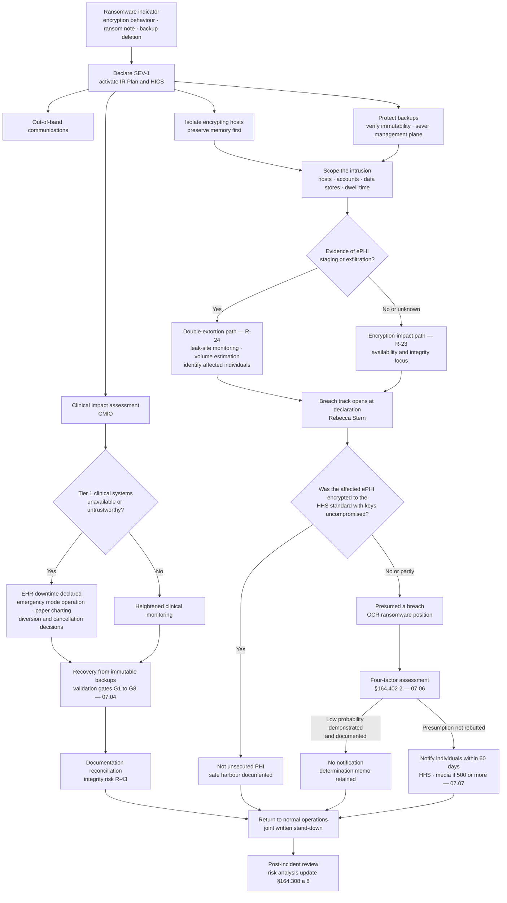

# 07.05 — Ransomware Response Playbook

| Field | Value |
|---|---|
| Document ID | MBH-IRB-RAN-2026-705 |
| Version | 1.0 |
| Date | 2026-07-15 |
| Classification | Confidential — Electronic Protected Health Information (ePHI) // Illustrative Portfolio Sample |
| Owner | Daniel Cho, Chief Information Security Officer &amp; HIPAA Security Official |
| Co-Owner | Marcus Reed, Information Security Manager · Dr. Samuel Ortega, CMIO (clinical continuity) |
| Author | Advisory Team (Healthcare GRC / HIPAA) |
| Status | Approved |

## Purpose

Ransomware is the sector-defining scenario. It is the only threat that attacks all three properties the Security Rule protects at once — destroying **availability**, corrupting **integrity**, and, in its double-extortion form, breaching **confidentiality** — and it is the only one whose realisation can plausibly contribute to a patient's death.

This playbook is the operational answer to the threat profiled in 03.06. It states the **OCR position that a ransomware attack involving ePHI is presumptively a breach**; sets out the first-hour actions; describes the payment decision framework and its legal and sanctions dimensions, stated neutrally; specifies clinical continuity across 4 hospitals and ~30 clinics; addresses the **double-extortion** dimension carried as **R-24 (Moderate 12)**; defines law-enforcement engagement; and prescribes recovery from **immutable backups**.

It treats **R-23 (enterprise ransomware, Moderate 10)** and **R-24 (double-extortion exfiltration, Moderate 12)** and is the scenario exercised in **TTX-2026-01 on 2026-08-13**.

## 1. The Regulatory Position — Presumptively a Breach

This is the point most often misunderstood inside health systems, and getting it wrong is the difference between a documented determination and an OCR enforcement matter.

| Question | Position |
|---|---|
| **Is ransomware a security incident?** | **Yes, always.** §164.304 covers "unauthorized access, use, disclosure, modification, or destruction of information or interference with system operations." Attacker encryption of ePHI is unauthorised modification and destruction. §164.308(a)(6) is triggered on detection |
| **Is it a breach?** | **Presumptively yes** where ePHI is involved. HHS guidance holds that when ePHI is encrypted by ransomware, an unauthorised individual has taken possession or control of the information — an impermissible **disclosure** under the Privacy Rule. §164.402 then **presumes** a breach |
| **How is the presumption rebutted?** | Only by a documented **four-factor assessment** under §164.402(2) demonstrating a **low probability that the PHI has been compromised** — see 07.06 |
| **Does "we restored from backup, nothing left the building" settle it?** | **No.** Restoration is Factor 4 mitigation evidence. It is not a substitute for the assessment, and it does not address whether the PHI was acquired or viewed |
| **Does absence of proven exfiltration create a defence?** | No. It helps, but **inability to prove data was not accessed weighs against** a low-probability finding. Evidence, not silence, rebuts the presumption |
| **Does exfiltration end the argument?** | Effectively, yes. Evidenced exfiltration of unsecured PHI makes a low-probability finding untenable in almost every case |
| **Does encryption at rest help?** | **Decisively — if the ePHI was encrypted to HHS-specified standards and the decryption key was not compromised.** Then it is not unsecured PHI and there is no breach. Phase 05 took MercyBridge from 51 to **68 of 68** systems encrypted at rest, with an HSM-backed key hierarchy |
| **Where does the safe harbour fail?** | Where the adversary operates as an **authenticated user** and is served decrypted data, and where **availability** is the harm. Both are exactly the ransomware case. The safe harbour is necessary and it is not sufficient |
| **What does OCR ask for first?** | The **§164.308(a)(1)(ii)(A) risk analysis**. An entity that can produce a current, enterprise-wide analysis identifying and treating the ransomware risk is in a fundamentally different position from one that cannot |
| **Timing if notification is required** | §164.404 individual notice without unreasonable delay and no later than **60 days** from discovery; §164.406 media notice and §164.408 contemporaneous HHS notice at **500+** in a state or jurisdiction |

**Operating rule for MercyBridge:** any ransomware event touching a system that creates, receives, maintains or transmits ePHI opens the breach track **at declaration**, not at recovery. The Privacy Officer is in the war room from hour one.

## 2. Activation and the First Hour

Declaration is **SEV-1** on any credible ransomware indication. Waiting for confirmation is how a single encrypted host becomes an enterprise event.

| T+ | Action | Owner |
|---|---|---|
| 0–5 min | Declare SEV-1; activate the IR Plan; page the Incident Commander, CSIRT, CIO, CMIO, CPO, GC | Duty analyst |
| 0–10 min | Move to **out-of-band communications**; assume corporate email and messaging are read by the adversary | Marcus Reed |
| 5–15 min | EDR-isolate all hosts showing encryption behaviour; preserve memory where the delay is ≤ 15 minutes | Forensics Lead |
| 5–15 min | **Protect the backups first** — verify immutability locks, sever backup management-plane credentials from the production directory, confirm offline copies exist | Anthony Ruiz |
| 10–20 min | Disable the compromised accounts and any account with anomalous privileged use; block identified egress destinations | Marcus Reed |
| 10–30 min | Convene the war room, physical and virtual; assign the scribe | Daniel Cho |
| 15–30 min | **Clinical impact assessment** — which Tier 1 systems, which sites, what is degraded now and what will be in an hour | Dr. Samuel Ortega |
| 15–30 min | Activate **HICS** at every affected hospital | Facility Incident Commanders |
| 20–45 min | Decide and execute the containment posture per 07.04 §2.2, with the CMIO | Daniel Cho with CMIO |
| 30–60 min | Declare EHR downtime if indicated; distribute downtime procedures; open the downtime viewer | CMIO with Nursing leadership |
| 30–60 min | Engage external counsel and the retained forensics firm; issue legal hold | Lisa Coleman |
| 30–60 min | Notify the cyber insurer; confirm panel-provider requirements before incurring cost | Michelle Tran |
| 45–60 min | Open the breach track; record the discovery determination; begin the four-factor evidence file | Rebecca Stern |
| 60 min | First executive brief: what is affected, what is contained, what is at risk, what is being decided | Daniel Cho |
| Within 4 h | Board Audit &amp; Compliance Chair briefed; law-enforcement engagement decision made | Daniel Cho with Lisa Coleman |

**Do not, in the first hour:** reboot or power off encrypted hosts before memory capture unless destruction is imminent; delete the ransom note; contact the adversary; restore anything; discuss the incident in corporate email or chat; or tell anyone outside the notification tree.

## 3. Response Flow

## 4. The Payment Decision Framework

MercyBridge holds **no standing position for or against payment**. It holds a position on **how the decision is made**: by the CEO, on the advice of the General Counsel, the CISO, the CMIO and the cyber insurer, with the Board Audit &amp; Compliance Chair informed, and recorded in a decision memo. The framework below is descriptive, not advocacy.

| Consideration | Points toward paying | Points away from paying |
|---|---|---|
| **Clinical necessity** | Recovery timeline exceeds safe clinical tolerance and no alternative exists | Immutable backups verified and restoration is inside tolerance |
| **Backup viability** | Backups destroyed, encrypted or unverifiable | Immutable and offline copies verified good |
| **Decryptor reliability** | — | Decryptors are frequently slow, partial or corrupting; restoration from backup is often faster |
| **Data return** | Payment may buy a deletion promise for exfiltrated data | **A deletion promise is unverifiable.** It does not undo the impermissible disclosure and does **not** remove the notification obligation |
| **Breach position** | — | **Payment does not change the §164.402 analysis.** OCR's presumption stands whether or not a ransom is paid |
| **Legal and sanctions exposure** | — | Payment to a sanctioned person or jurisdiction may violate **OFAC** sanctions regulations, which impose **strict liability**; OFAC has stated that reporting to law enforcement and full cooperation are significant mitigating factors. Counsel and the insurer must assess the recipient before any payment |
| **Insurance** | Policy may cover extortion payment | Cover is usually conditional on insurer pre-approval and panel-provider use; unilateral payment can void it |
| **Reporting obligations** | — | Payment may itself carry reporting obligations under applicable federal reporting regimes; counsel advises |
| **Precedent and funding harm** | — | Payment funds further attacks on the sector and marks the payer as a repeat target |
| **Governance** | — | A decision of this magnitude taken under time pressure without a pre-agreed framework is the failure mode; that is why the framework exists in advance |

| Decision requirement | Position |
|---|---|
| Decision authority | CEO (Dr. Helen Marsh), advised by GC, CISO, CMIO, CFO, insurer; Board Chair informed before execution |
| Prohibited unilateral action | No individual may negotiate, contact the adversary or transfer value without GC authorisation |
| Sanctions screening | Mandatory counsel-led OFAC screening of the threat actor and any payment intermediary **before** any transfer is contemplated |
| Law enforcement | The FBI is engaged before, not after, any payment consideration |
| Negotiation | Conducted only by a retained specialist under counsel's direction, never by MercyBridge staff |
| Record | Decision memo: options, advice received, sanctions position, insurer position, decision, rationale, signatories |
| **Notification consequence** | **None.** Whatever is decided, the §164.402 analysis and any resulting notification obligation are unaffected |

## 5. Clinical Continuity

| Clinical function | Dependency | Downtime tolerance | Fallback | Owner |
|---|---|---|---|---|
| Emergency department | Halcyon ADT, ED tracking, LIS, PACS | Hours | Paper triage, manual tracking board, **ambulance diversion** decision by the Facility IC and ED medical director | ED leadership |
| Critical care | Physiologic monitoring, ICU documentation | Minutes to hours | Bedside-only monitoring, 1:1 observation surge, paper flowsheets | ICU leadership |
| Medication administration | CPOE, eMAR, pharmacy, dispensing cabinets | Hours | Paper orders, manual transcription with double-check, cabinet override protocol | Pharmacy with Nursing |
| Blood bank | Blood bank system | Minutes to hours | Manual crossmatch, paper tags, restricted release protocol | Laboratory leadership |
| Laboratory | LIS, analysers, interfaces | Hours | Paper requisitions, printed results, manual critical-value calls | Laboratory leadership |
| Imaging | PACS, RIS, VNA, modalities | Hours | Modality-local reading, hard copy or portable media, prior studies unavailable | Radiology leadership |
| Surgery and periop | Perioperative, anaesthesia, implant tracking | 1 day | Elective cancellation; emergent cases proceed on paper | Perioperative leadership |
| Oncology and dialysis | Oncology system, scheduling | 1–2 days | Paper regimen verification with pharmacist double-check; schedule triage | Service line leadership |
| Outpatient clinics (~30 sites) | EHR, scheduling, results | Hours to 1 day | Site downtime kits; **this is the least-tested area and a named tabletop objective** | Ambulatory leadership |
| Health information exchange | HIE connector, EMPI | Days | External records unavailable; duplicate-record risk on recovery | HIM |
| Revenue cycle | Billing, coding, clearinghouse | Weeks | Deferred capture; charge reconstruction after recovery | Revenue cycle leadership |

| Downtime readiness element | Status at 2026-07-15 |
|---|---|
| Downtime kits (forms, labels, printed order sets) at all inpatient units | Complete; refreshed quarterly |
| Downtime kits at all ~30 outpatient sites | **In progress — a TTX-2026-01 objective (R-49)** |
| Read-only downtime viewer with 72-hour rolling clinical summary | Live at 4 hospitals; extending to clinics Q4 2026 |
| Printed call tree at each hospital administrative office | Complete |
| Paper prescription and controlled-substance fallback | Complete |
| Runner and courier plan for specimens and results | Complete at hospitals; clinic plan in progress |
| Documentation reconciliation procedure and HIM surge plan | Approved; exercised in TTX-2026-01 |

## 6. Double Extortion — R-24

Encryption-only ransomware is largely obsolete. Each additional pressure layer maps to a distinct HIPAA consequence.

| Layer | Attacker action | HIPAA consequence | MercyBridge response |
|---|---|---|---|
| 1 — Encryption | Clinical systems unusable | Availability failure; §164.308(a)(7) invoked; presumptive breach | Contain, restore from immutable backup |
| 2 — Exfiltration | ePHI copied out before deployment | Confidentiality breach; low-probability finding effectively unavailable | Bound the exfiltrated set from egress and staging evidence; identify individuals early |
| 3 — Publication threat | Leak-site countdown; sample records posted | Mass notification; media notice at 500+; acute trust harm | Leak-site monitoring; takedown; do not confirm or engage without GC |
| 4 — Patient-directed pressure | Individuals contacted with their own records | Sensitive categories weaponised — behavioural health, oncology, reproductive | Patient contact line stood up early; notification accelerated where individuals are already being contacted |
| 5 — Third-party pressure | Regulators, partners or media told by the attacker | Loss of control over disclosure timing while the 60-day clock runs | Pre-drafted holding statements; proactive regulator contact on GC advice |
| 6 — Disruptive follow-on | DDoS or repeat intrusion during recovery | Extends downtime; degrades recovery | DDoS protection engaged; recovery environment segregated from the compromised estate |

**Practical consequence for scoping.** In a double-extortion event, the notification population is defined by **what was exfiltrated**, not by what was encrypted. These are usually different sets, and the exfiltrated set is harder to bound — unstructured shares, departmental extracts, mailboxes. Determining it is the long pole in meeting the 60-day deadline, which is why DLP and data-discovery deployment sit on the Phase 05 and 2027 workplans.

## 7. Law Enforcement and External Engagement

| Party | When | Who initiates | Purpose | Notes |
|---|---|---|---|---|
| **FBI** (local field office / IC3) | At SEV-1 declaration | Lisa Coleman with Daniel Cho | Attribution, decryptor availability, sanctions context, infrastructure takedown | Engagement is MercyBridge's default position for ransomware |
| **CISA** | Early | Daniel Cho | Technical assistance; sector advisories; known-exploited-vulnerability context | |
| **HHS HC3 / Health-ISAC** | Early | Marcus Reed | Sector threat intelligence and peer warning | Sharing is reciprocal and de-identified |
| **State health department / state AG** | Per statute on determination | Rebecca Stern with Lisa Coleman | State breach and health-facility reporting | 07.07 §7 |
| **HHS OCR** | On breach determination | Rebecca Stern | §164.408 notification | Not a courtesy call; a statutory filing |
| **CMS / accreditation** | If conditions of participation are affected | Karen Boyd | Regulatory obligation for care disruption | Referenced only |
| **Cyber insurer** | Within 4 hours | Michelle Tran | Coverage, panel providers, pre-approval | Late notice can prejudice cover |
| **Halcyon and other BAs** | Immediately if their systems or connections are implicated | Vendor Liaison | Containment and evidence under the 24-hour / 5-day BAA clocks | 06.09 |
| **Peer health systems** | If diversion is likely | Facility IC | Regional capacity coordination | Clinical channel, not security |
| **Media** | Only after GC and CPO approval | Communications lead | Controlled statement | Never confirm attacker claims |

> **§164.412 law-enforcement delay.** If a law-enforcement official states that notification would impede a criminal investigation or damage national security, notification may be delayed — **in writing**, for the period specified; if the request is **oral**, it must be documented and the delay may not exceed **30 days** unless a written statement follows. The delay is a statutory exception with conditions, not an informal accommodation, and the documentation is the whole of the defence.

## 8. Recovery from Immutable Backups

| Step | Requirement | Verification |
|---|---|---|
| 1 | Confirm the backup **management plane** was not compromised; rotate its credentials independently of the production directory | Backup platform audit log review |
| 2 | Select a restore point **predating the earliest evidenced adversary access**, not merely predating encryption | Intrusion timeline from forensics |
| 3 | Restore into an **isolated clean-room environment** first | Network isolation verified |
| 4 | Scan restored images for the implant, persistence and attacker tooling before promotion | Clean scan by two independent tools |
| 5 | Rebuild operating systems from known-good media where an adversary held administrative access; restore **data**, not systems, wherever practical | Build records |
| 6 | Restore in criticality-wave order per 04.08, not in order of readiness | Restoration runbook |
| 7 | Validate data integrity: record counts, checksums, clinical spot-checks | HIM and system owner sign-off |
| 8 | Restore security controls — logging, EDR, MFA, encryption, segmentation — **before** reconnection | Control checklist per system |
| 9 | Obtain clinical acceptance before returning any system to patient care | CMIO signature |
| 10 | Heightened monitoring for a minimum of 30 days post-restoration | Monitoring plan |

| Backup posture | Position at 2026-07-15 |
|---|---|
| Immutable copies for Tier 1 systems | In place |
| Immutable or offline copies for the 9 remaining Tier 2–3 systems | Extension in progress, Q3–Q4 2026 (**V-24**) |
| Backup encryption | All tiers encrypted; keys held in the HSM hierarchy (05.10) |
| Backup management plane separation | Separate credential domain; MFA enforced |
| Restoration testing | Annual full-scale Tier 1 restoration test; **24-hour restoration procedures documented for 12 of 12 Tier 1 systems, validated for 7** |
| Restore-point objective for Tier 1 | 1 hour |
| Recovery-time objective for Tier 1 | ≤ 24 hours to clinical service, per NPRM readiness |

## 9. Tabletop TTX-2026-01

| Element | Detail |
|---|---|
| Date | **2026-08-13**, four hours, Rivermont administrative campus and virtual |
| Scenario | Phishing of a revenue-cycle account without MFA → 9 days dwell → exfiltration of HIM and departmental shares → encryption of 9 of 12 Tier 1 systems at 02:40 on a Sunday (modelled on **MBH-SCN-RW-01**) |
| Participants | Daniel Cho, Marcus Reed, Rebecca Stern, Lisa Coleman, Anthony Ruiz, Dr. Samuel Ortega, Karen Boyd, Michelle Tran, two Facility Incident Commanders, HIM Director, Ambulatory Director, Communications, Halcyon vendor representative |
| Objective 1 | Declaration, activation and out-of-band communications within 30 minutes |
| Objective 2 | Clinical containment trade-off decided and recorded with the CMIO |
| Objective 3 | **Discovery determination and 60-day clock start** correctly identified |
| Objective 4 | Four-factor assessment executed live against the injects (**R-23, R-24**) |
| Objective 5 | Outpatient-site downtime procedures exercised at two clinics (**R-49**) |
| Objective 6 | Business associate notification path exercised against the 24-hour / 5-day clocks (**R-31**) |
| Objective 7 | Documentation reconciliation planned and resourced (**R-43**) |
| Injects | Leak-site listing with sample records; a journalist call; a patient contacted directly by the attacker; an insurer pre-approval condition; a law-enforcement delay request |
| Outputs | After-action report due **2026-08-27**; corrective actions with owners and dates; plan revision under 04.11 change control |

## Cross-References

| Reference | Relevance |
|---|---|
| 03.06 — Ransomware &amp; Healthcare Threat Profile | The threat model, kill chain and scenario MBH-SCN-RW-01 |
| 03.07 — Risk Register | R-23, R-24, R-43, R-47, R-49 |
| 04.08 — Contingency Plan | Backup, DR, emergency mode operation, criticality analysis |
| 05.10 — Encryption &amp; Key Management | The safe harbour and its limits in an authenticated-adversary case |
| 05.11 — Medical Device Security Controls | Device containment under FDA change control |
| 06.09 — Business Associate Incident &amp; Breach Coordination | Halcyon and BA escalation during a ransomware event |
| 07.02 — Incident Response Plan | SEV-1 activation, authority and HICS integration |
| 07.03 — Detection &amp; Triage | Ransomware and exfiltration detection use cases |
| 07.04 — Containment, Eradication &amp; Recovery | The generic mechanics this playbook specialises |
| 07.06 — Breach Risk Assessment — Four Factor | Rebutting, or failing to rebut, the ransomware presumption |
| 07.07 — Breach Notification Requirements | Notification at scale, including 500+ media and HHS notice |

---
[⬅ Previous](07.04-containment-eradication-recovery.md) · [🏠 Phase README](07.00-README.md) · [Next ➡](07.06-breach-risk-assessment-four-factor.md)
