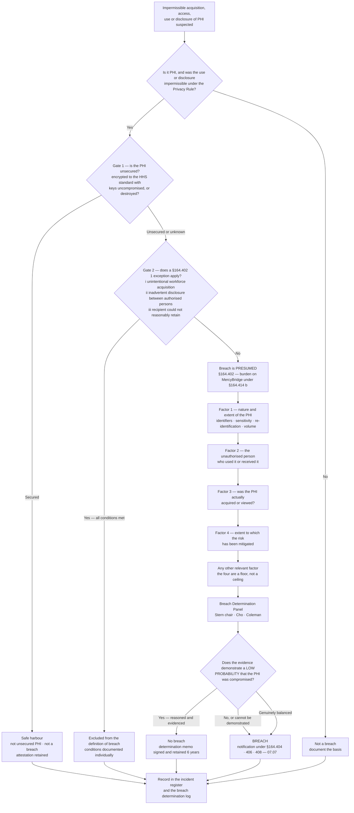

# 07.06 — Breach Risk Assessment — Four Factor

| Field | Value |
|---|---|
| Document ID | MBH-IRB-4FA-2026-706 |
| Version | 1.0 |
| Date | 2026-07-15 |
| Classification | Confidential — Electronic Protected Health Information (ePHI) // Illustrative Portfolio Sample |
| Owner | Rebecca Stern, Chief Privacy Officer (HIPAA Privacy Official) |
| Co-Owner | Daniel Cho, CISO &amp; HIPAA Security Official · Lisa Coleman, General Counsel |
| Author | Advisory Team (Healthcare GRC / HIPAA) |
| Status | Approved |

## Purpose

This is the keystone document of the phase. Everything before it finds and contains incidents; everything after it notifies. This document is where MercyBridge decides whether an impermissible acquisition, access, use or disclosure of protected health information **is a breach** — the statutory analysis required by **45 CFR §164.402(2)**.

It sets out the **presumption** and the **burden of proof**; the two questions that must be answered *before* the four factors are reached — is the PHI **unsecured**, and does a **§164.402(1) exception** apply; each of the four statutory factors with the evidence MercyBridge expects for each; the overall determination standard; the governance of the Breach Determination Panel; the documentation retained for six years; and **worked examples from the three security incidents** investigated in the review period, all three of which concluded that the presumption was rebutted — **0 reportable breaches**.

The analysis is not a scoring exercise dressed up as a legal conclusion. It is a reasoned, evidenced judgement that MercyBridge must be able to defend to OCR years later, using only the file.

## 1. The Presumption and the Burden

> **§164.402:** *Breach* means the acquisition, access, use, or disclosure of protected health information in a manner not permitted under subpart E which compromises the security or privacy of the protected health information. ... an acquisition, access, use, or disclosure of protected health information in a manner not permitted under subpart E **is presumed to be a breach unless the covered entity or business associate, as applicable, demonstrates that there is a low probability that the protected health information has been compromised** based on a risk assessment of at least the following factors [the four factors].

| Element | Consequence |
|---|---|
| **The default is "breach"** | Silence, inaction or an inconclusive investigation produces a **breach**, not a non-event. The entity must actively displace the presumption |
| **The test is "low probability of compromise"** | Not "no harm," not "no evidence of misuse," not "unlikely to cause damage." The 2013 Omnibus Rule replaced the old harm standard with this one, and it is **more objective and more demanding** |
| **The burden is on the covered entity** | **§164.414(b)** — MercyBridge bears the burden of demonstrating that all required notifications were made, **or** that the use or disclosure did not constitute a breach |
| **"Demonstrates" means evidence** | A conclusion without a documented assessment is, for regulatory purposes, no assessment at all |
| **At least these four factors** | The four are a floor, not a ceiling. Other relevant factors are considered and recorded where they bear on the probability of compromise |
| **The assessment is of the *PHI*, not the patient** | The question is the probability that the information has been compromised, not whether a particular individual suffered harm |
| **Timing** | The assessment runs **in parallel** with the response and must complete in time to notify within 60 days of discovery if the presumption stands |

**Three practical corollaries** that MercyBridge writes into every assessment:

1. **"We found no evidence of access" is not a finding of low probability.** It is an absence of evidence, and its weight depends entirely on whether MercyBridge's logging was capable of recording access had it occurred. This is why §164.312(b) audit controls are a breach-notification control.
2. **Close calls are notified.** Where the panel cannot reach a reasoned low-probability conclusion on the evidence available, MercyBridge notifies. The cost of an unnecessary notification is reputational; the cost of an indefensible non-notification is regulatory.
3. **The assessment is written before the conclusion is announced.** Panel members record their reasoning, and dissent is recorded rather than resolved by seniority.

## 2. Two Gates Before the Four Factors

The four-factor assessment is the **third** question, not the first.

### Gate 1 — Is the PHI "unsecured"?

The Breach Notification Rule applies only to **unsecured** PHI: PHI not rendered unusable, unreadable or indecipherable to unauthorised persons through a technology or methodology specified by HHS guidance — in practice, **encryption to the applicable NIST standard** or **destruction** per NIST SP 800-88.

| Situation | Position |
|---|---|
| ePHI encrypted at rest to the HHS standard, **decryption key not compromised** | **Not unsecured PHI. Not a breach. No four-factor assessment required.** Document the encryption attestation and the key position |
| ePHI encrypted, but the key or the credential protecting it was compromised in the same event | Safe harbour **unavailable**; proceed to the four factors |
| Adversary operating as an **authenticated user**, served decrypted data | Safe harbour **unavailable** — this is the R-24 case |
| Media destroyed per NIST SP 800-88 | Not unsecured PHI |
| **Paper PHI, verbal PHI, imaging film, printed reports** | **Never covered by the encryption safe harbour.** The Breach Notification Rule applies to PHI in **any** medium; the Security Rule's electronic focus does not narrow it |
| Encryption status unknown | Treat as unsecured until attested; proceed to the four factors |

**Phase 05 delivered encryption at rest across 68 of 68 ePHI systems and 100% endpoint full-disk encryption, with an HSM-backed key hierarchy.** That makes the safe harbour genuinely available across the electronic estate — a material change in MercyBridge's exposure, and the reason INC-2026-0031 disposed of the device itself in a single paragraph.

### Gate 2 — Does a §164.402(1) exception apply?

Three exclusions sit in the definition of breach itself. If one applies, the event is **not a breach** and no four-factor assessment is required — but the reasoning is still documented, because the exception has conditions and OCR reads them narrowly.

| # | Exception — §164.402(1) | Conditions, all of which must hold | MercyBridge illustration | Common failure |
|---|---|---|---|---|
| **(i)** | **Unintentional acquisition, access or use** by a workforce member or person acting under the authority of a covered entity or business associate | Made in **good faith**; within the **scope of authority**; and **not further used or disclosed** in a manner not permitted | A nurse opens the chart of the patient in bed 12 and finds it is the previous occupant's record, closes it immediately and reports it | Failing on "not further disclosed" — the finder tells a colleague what they saw |
| **(ii)** | **Inadvertent disclosure** by an authorised person to **another authorised person** at the same covered entity, business associate, or organised health care arrangement | Both persons authorised to access PHI at the **same** entity or OHCA; and the information **not further used or disclosed** impermissibly | A physician sends a consult note to the wrong physician **within** MercyBridge, who deletes it and confirms in writing | Assuming it applies to a different organisation, or to an unauthorised recipient such as a ward clerk with no access right |
| **(iii)** | **Disclosure where the covered entity or business associate has a good faith belief that the unauthorised person to whom the disclosure was made would not reasonably have been able to retain the information** | Good-faith belief, reasonably grounded in the circumstances | Discharge paperwork handed to the wrong patient in the reception queue and **immediately** taken back, unread, in view of staff | Applying it to emailed or posted documents, which are inherently retainable |

**In the review period, 11 of the 138 escalated investigations were closed under an exception** and therefore never became declared incidents requiring an assessment:

| Exception | Count | Typical facts |
|---|---|---|
| §164.402(1)(i) — unintentional workforce acquisition in good faith | 7 | Wrong-chart opening under a similar name; misrouted internal task; wrong-patient scan closed immediately |
| §164.402(1)(ii) — inadvertent disclosure between authorised persons at MercyBridge | 3 | Internal misdirected clinical email; consult note to the wrong service; shared drive placed in the wrong authorised team folder |
| §164.402(1)(iii) — recipient could not reasonably have retained | 1 | After-visit summary briefly handed to the wrong patient at a clinic desk and retrieved unread |
| **Total** | **11** | Each documented with the conditions addressed one by one |

## 3. The Four Factors

Each factor is assessed on the evidence, given a directional weight, and reasoned in narrative. **No factor is dispositive on its own and MercyBridge does not average them** — a decisive Factor 3 finding can carry a determination that an adverse Factor 1 would otherwise sink, and vice versa.

### Factor 1 — Nature and extent of the PHI involved, including the types of identifiers and the likelihood of re-identification

| Consideration | Toward **higher** probability of compromise | Toward **lower** |
|---|---|---|
| Identifiers present | Name with SSN, financial account, insurance ID, MRN, DOB, address, full-face image | Limited identifiers; internal codes only; a partial identifier |
| Clinical content | Diagnoses, medications, test results, treatment notes, genetic information | Demographic or scheduling data with no clinical content |
| **Sensitive categories** | Behavioural health, substance use disorder (42 CFR Part 2), HIV/STI, reproductive health, genetic, minors' records, VIP or employee records | None present |
| Financial exposure | SSN, payment card, bank account — enabling identity or financial fraud | No financial identifiers |
| Re-identification likelihood | Direct identifiers, or a small population making indirect identifiers effectively identifying | Robustly de-identified or a limited data set with a low re-identification path |
| Volume | Large record counts increase aggregate consequence | Single record or very small set |

**MercyBridge standing position:** the presence of any 42 CFR Part 2, behavioural health, HIV/STI or reproductive-health content raises the bar for a low-probability finding materially, and the panel records explicitly why any such finding remains defensible.

### Factor 2 — The unauthorised person who used the PHI or to whom the disclosure was made

| Recipient | Direction | Reasoning |
|---|---|---|
| Another **covered entity** or its workforce | Lower | Independently obliged under HIPAA; a written attestation of destruction is meaningful and enforceable |
| A **business associate** already bound by a BAA | Lower | Contractual and statutory duties attach; but only if the recipient was actually bound |
| A **MercyBridge workforce member** without a need to know | Mixed | Bound by policy, training and sanctions — but snooping is intentional conduct that cuts the other way |
| A **known member of the public** who returns or destroys the information | Lower | Identifiable, contactable, attestation obtainable |
| An **unknown** person | Higher | No attestation possible; no way to bound further use |
| A **financially motivated criminal actor** | Higher | Presumed intent to exploit; monetisation is the business model |
| A **data-theft or extortion group** | **Highest** | Publication is the leverage; low probability is effectively unavailable |
| A **researcher or journalist** acting responsibly | Mixed | Often willing to destroy, but publication interest may exist |

Where the recipient is a criminal actor, the panel considers what the actor was **actually doing** — a payment-fraud operation and a data-extortion operation are different threats to the same information, and the distinction is evidenced from behaviour, not assumed.

### Factor 3 — Whether the PHI was actually acquired or viewed

**This is the factor that most often decides the outcome, and it is the factor that depends entirely on the quality of MercyBridge's logging.**

| Evidence class | What it can establish | Source |
|---|---|---|
| Application access logs | Which records were opened, by which account, when | Halcyon EHR, PACS, LIS — §164.312(b) |
| Mailbox item-access records | Which individual messages were accessed during a compromise window | Tenant audit log (`MailItemsAccessed`-class) |
| File, SFTP and web-server transfer logs | Whether a file was listed, opened or downloaded, and by whom | Server and platform logs |
| Egress volume and destination telemetry | Whether data left, how much and where to | Proxy, firewall, DLP |
| EDR file and process telemetry | Staging, archiving, copying to removable media | EDR |
| Forensic host analysis | Artefacts of viewing, copying, exfiltration tooling | Disk and memory images |
| Physical facts | Whether an envelope was opened; whether a device was powered on; recovery condition | Statements, CCTV, courier records |
| Recipient attestation | What the recipient did and did not see | Signed statement |

| Finding | Direction |
|---|---|
| Logs **positively show** the accessed set, and it contains no PHI or a bounded subset | **Strongly lower** |
| Logs are complete for the window and show no access to the PHI | Lower |
| Logs exist but do not cover the relevant access path | Neutral to higher — record the limitation honestly |
| **No logs, or logs aged out** | **Higher** — the entity cannot demonstrate what it needs to demonstrate |
| Evidence of copying, archiving or exfiltration | **Strongly higher** |
| Mere opportunity to access, with no evidence either way | Higher — opportunity plus no evidence does not equal low probability |

> **The lesson MercyBridge draws from INC-2026-0044:** the difference between notifying 3,318 individuals and documenting a non-event was the availability of item-level mailbox access logs. Audit controls are not only a detective control; they are the evidentiary basis of the breach determination, and they pay for themselves the first time this question is asked.

### Factor 4 — The extent to which the risk to the PHI has been mitigated

| Mitigation | Weight |
|---|---|
| Written, signed attestation of destruction or deletion from an identified recipient | High, where the recipient is credible and enforceable against |
| Physical recovery of the media or document, with condition documented | High |
| Verified remote wipe of a lost device | High |
| Credential disabled, sessions and tokens revoked, MFA enforced | Moderate to high for identity-based events |
| Configuration corrected and independently verified, with the exposure window bounded | Moderate to high |
| Recipient is subject to enforceable obligations — BAA, covered entity, court order | Moderate |
| Restoration from backup after ransomware | Low as to **confidentiality**; high as to availability and integrity |
| Attacker's promise to delete exfiltrated data | **None — unverifiable and not treated as mitigation** |
| Credit monitoring or identity protection offered | Not mitigation of the disclosure; relevant to harm remediation only |
| Speed of containment | Moderate — narrows the window of exposure |

Mitigation is weighed for **what it actually prevents**. Recovering a laptop reduces the probability that its contents were read; paying a ransom does not.

## 4. The Determination

| Determination standard | Position |
|---|---|
| Who decides | **Breach Determination Panel**: Rebecca Stern (chair, and the accountable Privacy Official), Daniel Cho, Lisa Coleman |
| Quorum | All three, or a named delegate recorded in advance |
| Standard | A **reasoned, evidenced conclusion** that the probability of compromise is low — not a majority vote, not a scoring threshold |
| Tie-break | There is none. **A balanced case is notified** |
| Dissent | Recorded in the memo, not resolved by seniority |
| Escalation | Any determination affecting **500 or more individuals**, and any determination overturning an initial recommendation, is reported to the Chief Compliance Officer and the Board Audit &amp; Compliance Committee Chair |
| Timing | Complete in time to notify within **60 days of discovery**; target completion by **day 30** |
| Reopening | A determination is reopened on new evidence — for example, records appearing on a leak site after a no-breach finding |

## 5. Documentation and Retention

| Record | Content | Retention |
|---|---|---|
| Four-factor assessment form | Facts; Gate 1 and Gate 2 analysis; each factor with evidence, direction and reasoning; other factors; overall conclusion | **6 years** — §164.316(b)(2)(i) |
| Evidence index | Every artefact relied on, with source, date, hash where applicable | 6 years |
| Determination memo | Conclusion, reasoning, signatories, dissent, date | 6 years |
| Discovery determination | The §164.404(a)(2) date and its basis (07.03 §6) | 6 years |
| Exception closures | The conditions of the exception addressed individually | 6 years |
| Safe-harbour attestations | Encryption standard, scope, key position at the time of the event | 6 years |
| Notification record, where applicable | Individuals, HHS, media, state; dates, method, counts, returned mail | 6 years |
| Breach determination log | One line per assessment: ID, date, individuals, conclusion, notified Y/N | 6 years |

**Documentation is the deliverable.** Under §164.414(b) MercyBridge must be able to demonstrate either that notifications were made or that the event was not a breach. Years later, the only thing that will exist is the file.

## 6. Worked Examples — the Three Incidents

All three declared incidents in the review period received a full four-factor assessment. **All three concluded no breach. None required notification.**

### 6.1 INC-2026-0031 — Lost encrypted laptop with an accompanying paper clinic list

| Element | Detail |
|---|---|
| Facts | On 2026-03-11 an orthopaedic clinic manager left a laptop bag on a commuter train between the Rivermont campus and the Westbrook clinic. The bag was recovered from the transit authority's lost-property office 26 hours later, contents apparently undisturbed. The bag held an encrypted laptop **and a printed clinic schedule for one session listing 31 patients** |
| Discovery date | 2026-03-11 (actual knowledge, clinic manager, reported same day) |
| **Gate 1 — laptop** | Full-disk encryption to the applicable NIST standard, validated by the endpoint attestation; device powered off; pre-boot credential not compromised; remote wipe issued and confirmed on next network contact. **Not unsecured PHI — safe harbour applies. Not a breach. No assessment required for the device** |
| **Gate 1 — paper list** | **Paper PHI is never covered by the encryption safe harbour.** The Breach Notification Rule applies to PHI in any medium. Unsecured. Proceed |
| Gate 2 | No exception: the recipient (if any) was unknown and unauthorised; retention was possible over 26 hours |
| Factor 1 | 31 individuals. Name, appointment time, clinic name (orthopaedics) and a reason-for-visit abbreviation. **No SSN, no financial identifier, no MRN, no diagnosis beyond service line.** Direct identifiers present, so re-identification is trivial, but the clinical content is minimal and non-sensitive. *Moderately toward compromise on identifiers; toward low on content* |
| Factor 2 | Unknown. Mitigated by the recovery route: the bag passed into an institutional lost-property process rather than being taken. *Neutral to slightly toward low* |
| Factor 3 | **Cannot be affirmatively established.** No evidence of copying or photography; the schedule was present, in order and undamaged; the bag showed no sign of forced entry. Absence of evidence, honestly recorded. *Toward compromise, weakly* |
| Factor 4 | Physical recovery within 26 hours; the schedule destroyed under witness with a certificate; the clinic moved to an encrypted tablet-based session list; courier and transport policy revised; the manager retrained || **Determination** | **Low probability of compromise — no breach.** Small population, minimal and non-sensitive clinical content, physical recovery through an institutional channel within 26 hours, and the document destroyed |
| Dissent | Recorded: one panel member noted that Factor 3 could not be affirmatively established and that the finding rests on Factors 1, 2 and 4. The panel accepted the point and recorded it rather than resolving it away. **This was the closest of the three calls** |
| Signed | Stern, Cho, Coleman — 2026-03-24 |

### 6.2 INC-2026-0044 — Business email compromise of a revenue-cycle mailbox

| Element | Detail |
|---|---|
| Facts | An adversary obtained the credentials of a revenue-cycle analyst through a phishing page and authenticated via a **legacy mail connector that did not enforce MFA**. First access 2026-04-27; detected 2026-05-06 by an impossible-travel correlation and a concurrent workforce report; account disabled 41 minutes after the first alert |
| Discovery date | **2026-05-06** (see the discovery determination in 07.03 §6.1) |
| Gate 1 | Mailbox contents are unsecured PHI in the hands of an authenticated adversary; the safe harbour does **not** apply to an adversary served decrypted data |
| Gate 2 | No exception applies |
| Factor 1 | Messages and attachments containing PHI relating to **3,318 individuals**: name, DOB, MRN, account number, dates of service, payer and insurance ID; for approximately 640 individuals, procedure and diagnosis codes. **No SSN and no financial account numbers.** A small number of behavioural-health service lines present. Large volume, directly identifying. *Strongly toward compromise* |
| Factor 2 | Behaviour is characteristic of a **financially motivated business email compromise** operation: search for payment threads, attempted invoice redirection, creation of an inbox rule hiding replies from a single vendor domain. No indicators of a data-theft or extortion group; no MercyBridge data appeared on any monitored leak site. *Mixed — criminal actor, but not one whose model is PHI monetisation* |
| Factor 3 | **Decisive.** Item-level tenant audit records for the full 9-day window show **47 individual messages accessed**, all within two accounts-payable threads, none containing PHI. No mailbox search queries, no folder synchronisation, no export, no download client, no forwarding to an external address. Total session egress 3.1 MB, consistent with interactive browsing and inconsistent with bulk retrieval. Log completeness independently verified for the entire window. *Strongly toward low probability* |
| Factor 4 | Account disabled and credentials reset in 41 minutes; all sessions and refresh tokens revoked; the inbox rule removed; MFA enforced on the legacy connector and the connector retired 2026-05-19; tenant-wide rule audit; adversary infrastructure blocked; litigation hold applied; targeted phishing retraining for the department || **Determination** | **Low probability of compromise — no breach.** The determination rests on Factor 3: MercyBridge could demonstrate positively **what was accessed**, rather than merely failing to find evidence of access |
| Counterfactual recorded in the memo | Had item-level access logging been unavailable, the panel records that it **could not** have reached a low-probability finding and MercyBridge would have notified 3,318 individuals, HHS contemporaneously and the media in the affected state. The §164.312(b) investment is credited explicitly |
| Signed | Stern, Cho, Coleman — 2026-05-27 |

### 6.3 INC-2026-0058 — Business associate SFTP misconfiguration (H4 CodeBridge)

| Element | Detail |
|---|---|
| Facts | CodeBridge, a coding business associate, applied an incorrect access-control list to a client directory during a platform migration, making a MercyBridge coding worklist readable by the authenticated service accounts of three other CodeBridge clients. Exposure window 2026-06-14 to 2026-06-20 (6 days). CodeBridge discovered it on **2026-06-20** and gave initial notice to MercyBridge on **2026-06-22** |
| Discovery date | **2026-06-20 adopted.** Under the Phase 06 planning assumption that business associates holding identifiable ePHI are agents, CodeBridge's discovery is imputed to MercyBridge. The 60-day outer limit was therefore 2026-08-19, not 2026-08-21 |
| Gate 1 | The files were stored encrypted at rest, but were served in decrypted form to authenticated accounts. Safe harbour **unavailable** |
| Gate 2 | Not applicable: the other three client organisations are neither MercyBridge workforce nor authorised persons at the same entity or OHCA |
| Factor 1 | **612 individuals.** Name, MRN, DOB, dates of service, attending provider and ICD-10 diagnosis codes, including a small number of behavioural-health codes. Directly identifying with clinical content. *Strongly toward compromise* |
| Factor 2 | The directory was **not internet-exposed**. Read access was limited to the authenticated service accounts of three other CodeBridge clients — each an identifiable healthcare organisation, itself a covered entity or business associate, bound by HIPAA and by CodeBridge's contracts. *Toward low probability* |
| Factor 3 | CodeBridge's SFTP transfer logs, obtained under the BAA within the 5-day window and reviewed independently by MercyBridge, are complete for the exposure window and record **no LIST, STAT or GET operation** against the directory by any account other than MercyBridge's own. Log integrity confirmed against the platform's write-once store. *Strongly toward low probability* |
| Factor 4 | Permissions corrected within 2 hours of discovery; configuration independently verified by MercyBridge; written attestations obtained from all three client organisations confirming no access and no retention; CodeBridge's change-control process remediated with evidence; an off-cycle assessment triggered under the 06.08 monitoring triggers; the finding tracked to closure in the Phase 06 remediation tracker || **Determination** | **Low probability of compromise — no breach.** Complete transfer logs showing no retrieval, a bounded and contractually obligated recipient population, and rapid verified remediation |
| Note | Had the transfer logs been incomplete, Factor 3 would have been neutral at best and the panel records that the determination would probably have gone the other way. **Log availability at a business associate is now a Phase 06 due-diligence question, not an assumption** |
| Signed | Stern, Cho, Coleman — 2026-07-08 |

### 6.4 Summary

| Incident | Individuals | Gate 1 | Gate 2 | F1 | F2 | F3 | F4 | Determination |
|---|---|---|---|---|---|---|---|---|
| INC-2026-0031 — lost bag | 31 (paper only; device safe-harboured) | Device secured; paper unsecured | None | Toward compromise | Neutral / low | Weakly toward compromise | Strongly low | **No breach** |
| INC-2026-0044 — BEC | 3,318 | Unsecured | None | Strongly toward compromise | Mixed | **Strongly low — decisive** | Strongly low | **No breach** |
| INC-2026-0058 — BA SFTP | 612 | Unsecured | None | Strongly toward compromise | Toward low | **Strongly low** | Strongly low | **No breach** |
| **Total** | **3,961 individuals assessed** | | | | | | | **0 reportable breaches** |

**What the pattern shows.** In two of the three, the determination turned on **Factor 3** and was only available because logs existed, were complete and were retained. In the third, it turned on **Factor 4** and physical recovery. In none of the three did MercyBridge argue low probability from the absence of evidence alone — and that is the discipline the programme is trying to institutionalise before it faces an event at ransomware scale, where **R-24** would make a low-probability finding effectively unavailable.

## 7. Assessment Governance and Quality

| Control | Description | Frequency |
|---|---|---|
| Standard template | `templates/four-factor-assessment.md`, mandatory, with all gates and factors as required fields | Every assessment |
| Independent review | Karen Boyd reviews every completed assessment for completeness, not conclusion | Every assessment |
| Internal Audit sampling | Priya Anand samples assessments and exception closures against the evidence | Annually |
| Panel training | Annual refresher on §164.402, OCR guidance and recent enforcement | Annually |
| Consistency review | Retrospective review of all determinations for consistent reasoning across similar facts | Annually |
| Reopening trigger | Leak-site appearance, new forensic evidence, recipient contradiction, regulator query | Continuous |
| Metrics reported to the Board committee | Assessments performed, determinations, median days to determination, exception closures | Quarterly |

## Cross-References

| Reference | Relevance |
|---|---|
| 04.07 — Security Incident Procedures | The incident-vs-breach distinction and the documentation duty |
| 05.06 — Audit Controls | The §164.312(b) evidence base on which Factor 3 depends |
| 05.10 — Encryption &amp; Key Management | Gate 1 and the safe harbour across 68 of 68 systems |
| 06.05 — Due Diligence &amp; Assessment | Business associate log availability as a diligence question |
| 06.09 — Business Associate Incident &amp; Breach Coordination | The agency assumption behind the INC-2026-0058 discovery date |
| 07.03 — Detection &amp; Triage | Scoping questions and the discovery determination that start the clock |
| 07.04 — Containment, Eradication &amp; Recovery | Mitigation actions that become Factor 4 evidence |
| 07.05 — Ransomware Response Playbook | The presumption MercyBridge would have to rebut at scale |
| 07.07 — Breach Notification Requirements | What follows when the presumption is not rebutted |
| 07.08 — Notification Templates &amp; Communications | The instruments used once a determination is made |

---
[⬅ Previous](07.05-ransomware-response-playbook.md) · [🏠 Phase README](07.00-README.md) · [Next ➡](07.07-breach-notification-requirements.md)
