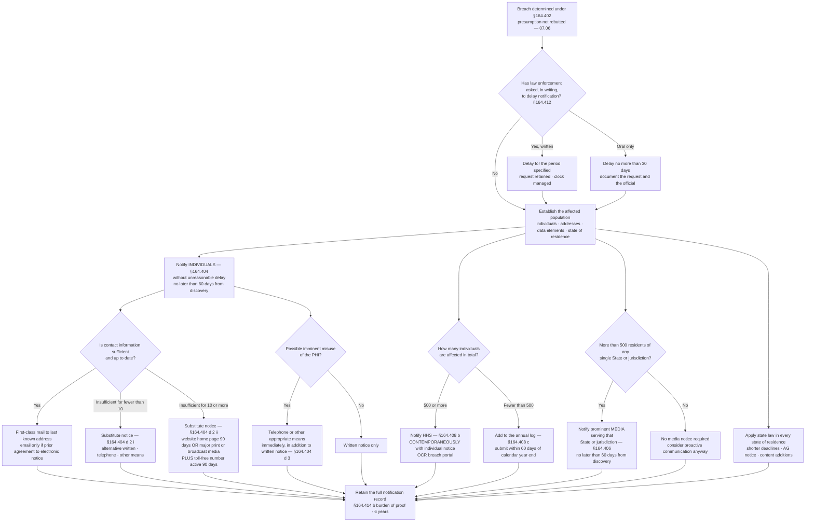

# 07.07 — Breach Notification Requirements

| Field | Value |
|---|---|
| Document ID | MBH-IRB-NOT-2026-707 |
| Version | 1.0 |
| Date | 2026-07-15 |
| Classification | Confidential — Electronic Protected Health Information (ePHI) // Illustrative Portfolio Sample |
| Owner | Rebecca Stern, Chief Privacy Officer (HIPAA Privacy Official) |
| Co-Owner | Lisa Coleman, General Counsel · Karen Boyd, Chief Compliance Officer |
| Author | Advisory Team (Healthcare GRC / HIPAA) |
| Status | Approved |

## Purpose

When the four-factor assessment in 07.06 fails to rebut the presumption, MercyBridge has a set of statutory duties that run on fixed clocks to fixed audiences. This document states them precisely: notice to **individuals** under **§164.404**, to the **media** under **§164.406**, to **HHS** under **§164.408**, from **business associates to the covered entity** under **§164.410**, the **law-enforcement delay** under **§164.412**, and the **administrative requirements and burden of proof** under **§164.414**. It covers the mandatory content of the individual notice, substitute notice where contact information is insufficient or out of date, the operational logistics of notifying at MercyBridge's scale, and the interaction with state breach and health-privacy law.

In the review period there were **0 reportable breaches**, so nothing in this document was exercised in anger. That is precisely why it is written now, and why the notification path is rehearsed in **TTX-2026-01** on 2026-08-13. A notification programme designed after the determination is a notification programme that misses the deadline.

## 1. The Obligations at a Glance

| Audience | Citation | Trigger | Deadline | Method | Owner |
|---|---|---|---|---|---|
| **Individuals** | **§164.404** | Any breach of unsecured PHI, any number of individuals | **Without unreasonable delay and in no case later than 60 calendar days after discovery** | First-class mail to the last known address; email only with prior agreement to electronic notice | Rebecca Stern |
| **Individuals — urgent** | §164.404(d)(3) | Possible **imminent misuse** of the PHI | Immediately, **in addition to** written notice | Telephone or other appropriate means | Rebecca Stern |
| **Substitute notice — fewer than 10** | §164.404(d)(2)(i) | Insufficient or out-of-date contact information for fewer than 10 individuals | Within the same 60 days | Alternative written notice, telephone, or other means | Privacy Office |
| **Substitute notice — 10 or more** | §164.404(d)(2)(ii) | Insufficient or out-of-date contact information for **10 or more** individuals | Within the same 60 days | Conspicuous posting for **90 days** on the home page of the MercyBridge website **or** conspicuous notice in major print or broadcast media in the affected geographic areas — **plus a toll-free number active for at least 90 days** | Privacy Office with Communications |
| **Media** | **§164.406** | Breach involving **more than 500 residents of a State or jurisdiction** | Without unreasonable delay, **no later than 60 days after discovery** | Press release to prominent media outlets serving that State or jurisdiction | Communications, approved by CPO and GC |
| **HHS — 500 or more** | **§164.408(b)** | Breach involving **500 or more individuals** | **Contemporaneously with individual notice**, and within the 60 days | Electronic submission via the HHS OCR breach portal | Rebecca Stern |
| **HHS — fewer than 500** | **§164.408(c)** | All other breaches | Maintain a log and submit **within 60 days after the end of the calendar year** in which the breach was **discovered** | Electronic submission via the HHS OCR breach portal, one entry per breach | Rebecca Stern |
| **Covered entity, by a BA** | **§164.410** | BA discovers a breach of unsecured PHI | Without unreasonable delay, no later than **60 days after discovery** — compressed by MercyBridge BAAs to **24-hour initial / 5-day full written notice** | Written notice identifying each individual and the §164.404(c) content | Vendor Liaison / Lisa Coleman |
| **State agencies** | State law | Varies — state AG, state health department, consumer protection | Often **shorter** than 60 days | Per statute | Lisa Coleman |
| **Delay for law enforcement** | **§164.412** | Written statement that notice would impede an investigation or damage national security | For the period specified in writing; **30 days** if the request is oral and undocumented | Documented request retained | Lisa Coleman |

**Two points that are commonly misread.**

- **"60 days" is an outer limit, not an allowance.** The operative standard is *without unreasonable delay*. An entity that takes 58 days to send a notice it could have sent on day 12 has not complied merely because it landed inside the window.
- **The counting is by *discovery*, not by occurrence, and not by determination.** The clock started on the date established in 07.03 §6, which may precede the declaration of the incident, and — where a business associate is an agent — may precede MercyBridge hearing about it at all.

## 2. The 60-Day Clock in Practice

MercyBridge runs to an internal schedule that finishes ahead of the statutory deadline, because at 2.1 million patient records the logistics of notification are not trivial.

| Day from discovery | Milestone | Owner |
|---|---|---|
| 0 | Discovery determination recorded; breach track opened | Marcus Reed / Rebecca Stern |
| 0–2 | Preliminary scope; safe-harbour position; population estimate | Marcus Reed |
| 3–10 | Evidence gathering for the four factors; forensic interim report | Forensics Lead |
| 10–20 | Individual identification: names, addresses, data elements per person | HIM with Privacy Office |
| 20–30 | **Determination made and signed** (target day 30) | Breach Determination Panel |
| 25–35 | Notice content drafted and approved; call centre scripted and staffed; website copy prepared | Privacy Office, Communications, GC |
| 30–40 | Address hygiene: national change-of-address processing; deceased-individual and minor handling | Notification vendor |
| 35–45 | **Individual notices mailed**; toll-free line live; substitute notice posted if required | Privacy Office |
| 35–45 | **Media notice issued** if more than 500 residents of a State or jurisdiction | Communications |
| 35–45 | **HHS notice submitted** contemporaneously if 500 or more individuals | Rebecca Stern |
| 35–45 | State notifications per statute, on the shortest applicable deadline | Lisa Coleman |
| 45–60 | Returned-mail handling; second attempts; substitute notice threshold re-tested | Privacy Office |
| **60** | **Statutory outer limit** | — |
| 60–150 | Call-centre operation; toll-free number live at least 90 days; portal posting maintained 90 days if used | Privacy Office |
| Year end + 60 | Annual log submission for breaches affecting fewer than 500 individuals | Rebecca Stern |

**Where the time actually goes.** Identifying *which individuals* and *which data elements per individual* is almost always the long pole — particularly for unstructured data, mailboxes and exfiltrated file shares, where the affected set must be reconstructed from content rather than read from a database. That is the operational reason DLP and data discovery sit on the improvement plan, and the reason the **R-24** double-extortion scenario is the hardest notification case MercyBridge could face.

## 3. Notification Decision Flow

## 4. Individual Notice — §164.404

### 4.1 Timing, Method and Recipient

| Element | Requirement |
|---|---|
| Timing | Without unreasonable delay, **no later than 60 calendar days after discovery** |
| Method — default | **Written notice by first-class mail** to the individual's last known address |
| Method — electronic | Email **only** where the individual has agreed to electronic notice and has not withdrawn that agreement |
| Deceased individuals | Written notice by first-class mail to the **next of kin or personal representative**, where the address is known |
| Minors and represented adults | To the **personal representative** |
| Multiple notices | A single notice may cover multiple breaches affecting the same individual only if it satisfies the content requirement for each |
| Plain language | **Required** — §164.530(c)-consistent readability; MercyBridge targets a Grade 8 reading level |
| Language access | Translation and taglines consistent with MercyBridge's language-access obligations; the top languages of the served population are pre-translated |

### 4.2 Content — §164.404(c)

The five content elements are mandatory. MercyBridge's template (07.08) carries them as fixed, non-deletable sections.

| # | Required element — §164.404(c)(1) | What MercyBridge includes |
|---|---|---|
| 1 | A brief description of **what happened**, including the **date of the breach** and the **date of discovery**, if known | A factual account in plain language; both dates stated, or an explanation if not known |
| 2 | A description of the **types of unsecured PHI** involved — e.g. full name, Social Security number, date of birth, home address, account number, diagnosis, disability code | The specific categories for **that individual's** record set, not a generic superset |
| 3 | Any **steps individuals should take** to protect themselves from potential harm | Concrete and specific: credit freeze mechanics, explanation-of-benefits review, IRS identity-protection PIN where SSN is involved, medical-identity-theft guidance |
| 4 | A brief description of **what the covered entity is doing** to investigate the breach, mitigate harm, and protect against further breaches | Investigation, containment, remediation and control changes, stated without over-claiming |
| 5 | **Contact procedures** for individuals to ask questions or learn more, including a **toll-free telephone number**, an email address, website, or postal address | Toll-free number staffed for at least 90 days, dedicated email, dedicated web page, postal address |

**What MercyBridge deliberately does not do:** minimise, speculate about attribution, describe the incident as "sophisticated" as a defensive framing, or promise outcomes it cannot deliver. Where identity-protection services are offered, the offer is specific as to duration, enrolment mechanics and deadline.

## 5. Media Notice — §164.406

| Element | Requirement |
|---|---|
| Trigger | A breach involving **more than 500 residents of a State or jurisdiction** — assessed **per State**, not in aggregate |
| Timing | Without unreasonable delay, **no later than 60 calendar days after discovery** |
| Method | Notice to **prominent media outlets** serving that State or jurisdiction — a press release, not a paid advertisement |
| Content | The **same §164.404(c) content** as the individual notice |
| Common error | Treating this as an aggregate 500 threshold. A 900-individual breach spread over three states with no state above 500 requires **HHS contemporaneous notice** but **no media notice** |
| Second common error | Confusing media notice with **substitute notice**. They are different obligations with different triggers; media notice is not satisfied by a website posting |
| MercyBridge posture | Tri-county metro region across a defined service area; a breach above 500 individuals is likely to cross the media threshold in the home State. Media lists, holding statements and spokesperson training are maintained in advance |

## 6. Substitute Notice — §164.404(d)(2)

Substitute notice applies where contact information is **insufficient or out of date**. It is not an alternative chosen for convenience, and it does not extend the deadline.

| Population with bad contact data | Requirement |
|---|---|
| **Fewer than 10 individuals** | Substitute notice by an alternative form of written notice, by telephone, or by other means |
| **10 or more individuals** | **Either** a conspicuous posting for **90 days** on the home page of the MercyBridge website, **or** conspicuous notice in major print or broadcast media in the geographic areas where the affected individuals likely reside — **and in both cases** a **toll-free number, active for at least 90 days**, that individuals can call to learn whether their information was involved |

| MercyBridge operational rules |
|---|
| Address hygiene is run **before** the substitute-notice threshold is tested: national change-of-address processing, internal address reconciliation across the EHR and revenue-cycle systems, and next-of-kin lookup for deceased individuals |
| Returned mail is worked, a second attempt made where a better address is found, and the substitute-notice population **re-tested** after returns |
| The web posting is a **conspicuous home-page link**, not a buried privacy-page entry, and the 90 days are diarised with a scheduled removal date |
| The toll-free line is staffed with a trained script, escalation to the Privacy Office, and call logging; volumes are reported daily during the first two weeks |
| Substitute notice **never replaces** the HHS or media obligations |

## 7. HHS Notice — §164.408, and State Law

### 7.1 HHS

| Population | Timing | Mechanism | MercyBridge control |
|---|---|---|---|
| **500 or more individuals** | **Contemporaneously with the individual notice**, and within 60 days of discovery | OCR breach portal submission | Submission prepared in parallel with the notice drafting; the two are released the same day; the portal receipt is retained |
| **Fewer than 500 individuals** | Logged when it occurs; **submitted within 60 days after the end of the calendar year** in which the breach was **discovered** | OCR breach portal, one entry per breach | A live log is maintained through the year; a diarised task runs in January; **submission by 1 March** each year with internal sign-off, well inside the statutory date |

Breaches affecting 500 or more individuals are published on the HHS public portal. MercyBridge plans its patient and media communications on the assumption that the filing is public from the moment it is made.

### 7.2 State Law

HIPAA sets a **floor**. State law is not preempted where it is **more stringent** or provides greater privacy protection, so MercyBridge complies with both.

| Interaction | Typical state requirement | Consequence |
|---|---|---|
| Shorter deadlines | Many states require notice in 30–45 days, some sooner for large events | The **shortest applicable deadline governs the programme schedule** — MercyBridge plans to the shortest, not to 60 days |
| State AG notification | Frequently required at a defined individual threshold, often with a copy of the notice and a specified form | Handled by Lisa Coleman with outside counsel in each affected state |
| State health department / facility licensure reporting | Care-disruption and facility reporting obligations distinct from privacy law | Karen Boyd |
| Content additions | Some states require specific content: credit-monitoring offers, credit-reporting-agency information, statutory rights language | The template carries state-specific annexes |
| Consumer-reporting-agency notice | Required in some states above a threshold | Lisa Coleman |
| Different definitions of covered data | State definitions may capture data HIPAA does not, or exempt HIPAA-covered entities in whole or part | Analysis performed per state on every event |
| Substance use disorder records | **42 CFR Part 2** carries its own restrictions and, since alignment with HIPAA, its own breach-notification interaction | Rebecca Stern with counsel |

**Operating rule:** the notification schedule is built from the **most demanding** applicable requirement across every affected jurisdiction, then applied uniformly. Running different content and different clocks per state at scale is how errors happen.

## 8. Law-Enforcement Delay — §164.412

| Situation | Permitted action | Documentation |
|---|---|---|
| A law-enforcement official provides a **written statement** that notification, notice or posting would impede a criminal investigation or cause damage to national security, specifying the time for which a delay is required | Delay for the **time period specified** in the statement | Retain the written statement; diarise the resumption date |
| A law-enforcement official makes the request **orally** | Document the statement, **including the identity of the official**, and delay **no longer than 30 days** from the oral statement, unless a written statement is provided during that time | Contemporaneous written record of the call, official's name, agency and contact details |

The delay applies to individual, media and HHS notice alike. MercyBridge treats it as a **narrow, documented exception**, obtains it in writing wherever possible, and never uses an informal law-enforcement conversation as a reason to let a deadline pass. The General Counsel owns the record.

## 9. Business Associate Notice to MercyBridge — §164.410

| Element | Statutory position | MercyBridge contractual position |
|---|---|---|
| Duty | The BA notifies the **covered entity**, not individuals | Unchanged; MercyBridge notifies individuals |
| Timing | Without unreasonable delay, no later than **60 days** after discovery | **24 hours** initial notice; **5 calendar days** full written notice — in all 24 critical/high BAAs |
| Discovery | Treated as discovered on the first day known, or by reasonable diligence would have been known, to the BA | Same |
| Content | Identification of **each individual** whose PHI was involved, plus the §164.404(c) information the BA has or later obtains | Individual-level identification at 10 calendar days for critical BAs |
| Agency | Where the BA is an **agent**, its discovery is imputed to MercyBridge | MercyBridge **plans as though every BA holding identifiable ePHI is an agent** |
| Who notifies individuals | The covered entity, unless it delegates | MercyBridge retains individual notification by default; delegation only by written agreement and with MercyBridge approval of content |
| Failure to notify | A BA compliance failure and a MercyBridge exposure simultaneously | Escalation, remediation plan, tier review, and a termination trigger for repeat failure |

**The arithmetic that makes this dangerous:** a business associate that is an agent can comply perfectly with §164.410 by notifying on day 60 and leave MercyBridge already in breach of §164.404. The contractual clocks exist to convert a 60-day exposure into a 24-hour-to-5-day exposure. This is **R-31**, carried from Phase 06 and exercised in TTX-2026-01.

## 10. Administrative Requirements and Burden of Proof — §164.414

| Requirement | Citation | MercyBridge discharge |
|---|---|---|
| Apply the administrative requirements of §164.530(b), (d), (e), (g), (h), (i) and (j) to breach notification | §164.414(a) | Workforce **training** on breach reporting; a **complaint** process; **sanctions** for failure to report; **no retaliation** and no waiver of rights as a condition of service; written **policies and procedures** and their maintenance |
| **Burden of proof** — demonstrate that all required notifications were made, **or** that the use or disclosure did not constitute a breach | §164.414(b) | The complete file: discovery determination, four-factor assessment, determination memo, evidence index, notification record — retained **six years** under §164.316(b)(2)(i) |

| Record retained | Purpose |
|---|---|
| Notification list: individual, address used, mail date, method, returned-mail status | Proof of notice to each individual |
| Copy of every notice version issued, including translations | Proof of content compliance with §164.404(c) |
| Press release, distribution list and confirmations | Proof of §164.406 compliance |
| HHS portal submission receipt and submitted content | Proof of §164.408 compliance |
| Substitute-notice evidence: screenshots with dates, media placement confirmations, toll-free line records | Proof of §164.404(d)(2) compliance |
| State filings and correspondence | Proof of state compliance |
| Law-enforcement delay statements | Justification for any delay under §164.412 |
| Call-centre logs and volumes | Evidence of the contact procedure required by §164.404(c)(1)(v) |
| Post-notification review | Improvement input and evidence of §164.308(a)(8) evaluation |

## 11. Readiness Position at 2026-07-15

| Capability | Status | Owner |
|---|---|---|
| Notification templates for individual, media, substitute, HHS and state notices | ✅ Approved — 07.08 | Rebecca Stern |
| Notification vendor retained: printing, mailing, address hygiene, call centre | ✅ Retained; capacity tested to 250,000 notices in 10 business days | Lisa Coleman |
| Toll-free number and script framework | ✅ Provisioned, dormant, activatable in 24 hours | Privacy Office |
| Website substitute-notice page | ✅ Pre-built, unpublished, 90-day removal task pre-diarised | Communications |
| HHS OCR portal access and named submitters | ✅ Two named submitters plus a deputy | Rebecca Stern |
| Annual small-breach log and submission task | ✅ Live log; January task; internal deadline 1 March | Rebecca Stern |
| State law matrix for the tri-county service area and out-of-area residents | ✅ Maintained with outside counsel; refreshed annually | Lisa Coleman |
| Pre-translated notice content for the top served languages | ✅ Complete for the top five | Privacy Office |
| Media list and trained spokespeople | ✅ CEO and CPO media-trained; holding statements drafted | Communications |
| Cyber insurance notification requirements mapped to the schedule | ✅ Mapped | Michelle Tran |
| Notification path exercised end to end | ▶ **TTX-2026-01, 2026-08-13** | Daniel Cho |
| **Breaches requiring notification in the review period** | **0** | — |
| **Annual HHS small-breach log entries for 2026 to date** | **0** | — |

## Cross-References

| Reference | Relevance |
|---|---|
| 04.07 — Security Incident Procedures | The parent policy and the incident-vs-breach distinction |
| 04.11 — Policies, Procedures &amp; Documentation | Six-year retention under §164.316(b)(2)(i) |
| 05.10 — Encryption &amp; Key Management | The safe harbour that removes the notification question entirely |
| 06.04 — Business Associate Agreements | The §164.410 terms and the 24-hour / 5-day compression |
| 06.09 — Business Associate Incident &amp; Breach Coordination | Agency, the timing trap and R-31 |
| 07.03 — Detection &amp; Triage | The §164.404(a)(2) discovery determination that starts the clock |
| 07.05 — Ransomware Response Playbook | The scenario most likely to trigger notification at scale |
| 07.06 — Breach Risk Assessment — Four Factor | The determination that triggers everything in this document |
| 07.08 — Notification Templates &amp; Communications | The instruments implementing these requirements |
| Phase 08 — HITRUST &amp; Independent Assessment | OCR Audit Protocol readiness for §164.400–414 |
| Phase 09 — Executive Reporting | Board reporting of breach metrics and notification readiness |

---
[⬅ Previous](07.06-breach-risk-assessment-four-factor.md) · [🏠 Phase README](07.00-README.md) · [Next ➡](07.08-notification-templates-and-communications.md)
