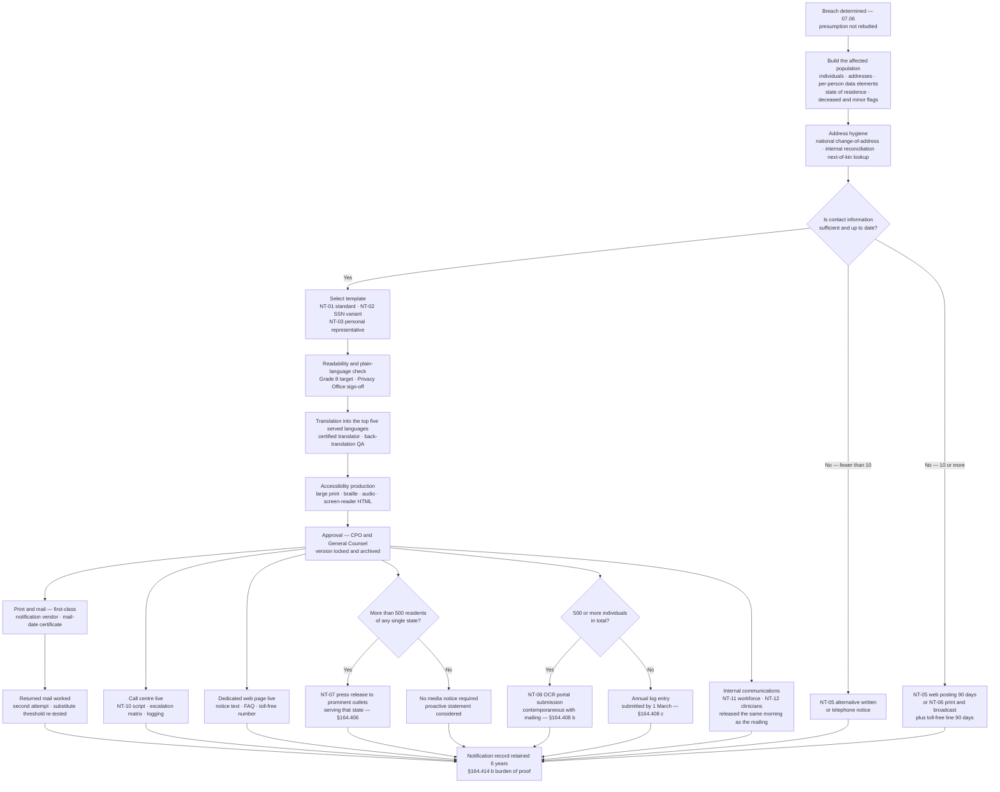

# 07.08 — Notification Templates &amp; Communications

| Field | Value |
|---|---|
| Document ID | MBH-IRB-TPL-2026-708 |
| Version | 1.0 |
| Date | 2026-07-15 |
| Classification | Confidential — Electronic Protected Health Information (ePHI) // Illustrative Portfolio Sample |
| Owner | Rebecca Stern, Chief Privacy Officer (HIPAA Privacy Official) |
| Co-Owner | Lisa Coleman, General Counsel · Corporate Communications |
| Author | Advisory Team (Healthcare GRC / HIPAA) |
| Status | Approved |

## Purpose

07.07 states what MercyBridge must do. This document is what MercyBridge actually **sends**. It converts §164.404–408 from a set of obligations into a set of instruments: a model individual notice carrying all five mandatory content elements as fixed sections, a media notice outline, an HHS submission checklist, readability and plain-language rules, translation and accessibility obligations, call-centre readiness, and the internal and clinician communications that run alongside the external ones.

The design principle is that **notification is a production process, not a drafting exercise**. At 2.1 million patient records, a breach affecting even 2% of the population is 42,000 letters, address hygiene, returned mail, a staffed telephone line and a public web page — all inside a clock that started before anybody read the first alert. Every hour spent drafting from scratch after the determination is an hour taken from printing, mailing and answering the phone.

Nothing in this document was used in anger. The review period produced **0 reportable breaches**. The templates were validated instead against a hypothetical event, **HYP-A**, which is the TTX-2026-01 scenario, and the notification path was exercised end to end on **2026-08-13** (07.09).

## 1. The Template Set

| ID | Instrument | Statutory basis | Owner of content | Approval | Currency |
|---|---|---|---|---|---|
| **NT-01** | Individual notice letter — standard | §164.404(a), (c), (d)(1) | Rebecca Stern | CPO + GC | Reviewed annually and after any use |
| **NT-02** | Individual notice letter — SSN or financial identifier involved | §164.404(c)(1)(iii) | Rebecca Stern | CPO + GC | Annual |
| **NT-03** | Individual notice — personal representative / next of kin variant | §164.404(a) | Rebecca Stern | CPO + GC | Annual |
| **NT-04** | Urgent telephone notice script — possible imminent misuse | §164.404(d)(3) | Privacy Office | CPO | Annual |
| **NT-05** | Substitute notice — web posting copy (90 days) | §164.404(d)(2)(ii) | Communications | CPO + GC | Annual |
| **NT-06** | Substitute notice — print / broadcast copy | §164.404(d)(2)(ii) | Communications | CPO + GC | Annual |
| **NT-07** | Media notice / press release | §164.406 | Communications | CPO + GC + CEO | Annual |
| **NT-08** | HHS OCR portal submission worksheet | §164.408 | Rebecca Stern | CPO | On portal change |
| **NT-09** | State AG and state health department notice shells | State law | Lisa Coleman | GC | Annually with outside counsel |
| **NT-10** | Call-centre script, FAQ and escalation matrix | §164.404(c)(1)(v) | Privacy Office | CPO | Annual |
| **NT-11** | Workforce briefing and manager talking points | §164.414(a) / §164.530(b) | Communications with Privacy | CPO | Annual |
| **NT-12** | Clinician and front-desk talking points | §164.530(b) | Dr. Samuel Ortega with Privacy | CMIO + CPO | Annual |
| **NT-13** | Business associate onward-notice instruction | §164.410 | Lisa Coleman | GC | Annual |
| **NT-14** | Holding statement — incident acknowledged, determination pending | — | Communications | CPO + GC | Annual |

**Rule of use.** Templates NT-01 to NT-03 carry the five §164.404(c) elements as **fixed, non-deletable sections**. Copy may be added; the five sections may not be removed, merged or reordered, and the template will not pass Privacy Office review if they are.

## 2. The Five Mandatory Content Elements — §164.404(c)

| # | §164.404(c)(1) element | Fixed section heading in NT-01 | What must appear | Failure mode MercyBridge guards against |
|---|---|---|---|---|
| 1 | Brief description of what happened, including the **date of the breach** and the **date of discovery**, if known | "What happened" | A factual account; both dates, or a stated reason they are not known | Vagueness that conceals the timeline; omitting the discovery date because it is unflattering |
| 2 | Description of the **types of unsecured PHI** involved | "What information was involved" | The categories present in **that individual's** record set | Listing the union of all data types across the whole population, which over-alarms most recipients and misinforms all of them |
| 3 | **Steps individuals should take** to protect themselves | "What you can do" | Concrete, actionable, specific to the data types involved | Generic "monitor your accounts" filler with no mechanics |
| 4 | Brief description of **what MercyBridge is doing** — investigate, mitigate, protect against further breaches | "What we are doing" | Investigation, containment, remediation, control changes | Over-claiming; describing the attack as "sophisticated" as a defensive framing |
| 5 | **Contact procedures** — toll-free number, email, website, or postal address | "How to contact us" | Toll-free number staffed ≥ 90 days, dedicated email, dedicated page, postal address | A main switchboard number, or a line that is unstaffed at the volume the notice generates |

## 3. Model Individual Notice — NT-01

> **Validation basis.** The letter below is completed against **HYP-A**, the hypothetical event used to validate the template and exercised in TTX-2026-01. **No such notice was issued in the review period; there were 0 reportable breaches.** Merge fields are shown in braces and are populated from the notification extract described in §4.

---

**MercyBridge Health Network** · Office of the Chief Privacy Officer
400 Rivermont Parkway · Rivermont · {STATE ZIP}

{DATE OF MAILING}

{FIRST NAME} {LAST NAME}
{ADDRESS LINE 1}
{CITY}, {STATE} {ZIP}

**Re: Notice of a data security incident involving your health information**

Dear {FIRST NAME} {LAST NAME},

I am writing to tell you about a data security incident at MercyBridge Health Network that involved some of your health information. I am sorry this happened. This letter explains what happened, what information was involved, what we are doing about it, and what you can do.

**What happened**

On **{DATE OF BREACH}**, an unauthorised person gained access to part of the MercyBridge computer network by using a MercyBridge employee's stolen password. We discovered the problem on **{DATE OF DISCOVERY}** and immediately shut off the unauthorised access. We hired outside cybersecurity investigators and we notified law enforcement. Our investigation found that the unauthorised person copied files from our network before we removed them. Your information was in those files.

**What information was involved**

The information about you in the copied files included: **{DATA ELEMENTS FOR THIS INDIVIDUAL}** — for example, your name, date of birth, medical record number, the dates you received care, the name of your treating provider, and the diagnosis or procedure recorded for those visits.

**Your Social Security number and your financial account numbers were not involved.** {SSN_VARIANT_SENTENCE}

**What you can do**

- **Read the explanation-of-benefits statements from your health plan.** If you see care listed that you did not receive, call your plan and call us on the number below. This is the most useful thing you can do.
- **Check your medical records.** You may ask us for a copy of your records and ask us to correct anything that is wrong. Call the number below and we will help you.
- **Watch for suspicious contact.** Nobody from MercyBridge will call, email or text you to ask for your Social Security number, your bank details or a payment because of this incident. If someone does, hang up and call us.
- **Place a free fraud alert or a free credit freeze** with the three national credit reporting agencies. A freeze stops new credit being opened in your name. It is free, and you can lift it whenever you need to.
- **Take up the identity-protection service we are offering.** We have arranged **{SERVICE NAME}** for **{DURATION}** at no cost to you. Your enrolment code is **{ENROLMENT CODE}** and you must enrol by **{ENROLMENT DEADLINE}**. Instructions are enclosed.

**What we are doing**

We shut off the unauthorised access, reset the affected passwords and required an extra identity check for everyone who logs in remotely. Outside cybersecurity specialists reviewed our systems and confirmed the unauthorised person no longer has access. We reported the incident to law enforcement and to the U.S. Department of Health and Human Services. We are reviewing how the password was stolen, we have strengthened our monitoring so that unusual file copying is detected faster, and we are retraining the staff involved. We will keep our findings under review and take further steps if the investigation shows they are needed.

**How to contact us**

If you have questions, please call our dedicated toll-free line on **1-800-{TOLLFREE}**, open Monday to Friday, 8:00 a.m. to 8:00 p.m., and Saturday 9:00 a.m. to 1:00 p.m. It will be open for at least 90 days. You can also email **privacy@mercybridgehealth.example** or visit **www.mercybridgehealth.example/notice**. You can write to the Office of the Chief Privacy Officer at the address at the top of this letter.

You have the right to complain to MercyBridge or to the U.S. Department of Health and Human Services Office for Civil Rights, and we will not retaliate against you for doing so.

I am sorry for the concern this will cause you. You trusted us with your care and with your information, and on this occasion we did not protect it as we should have.

Sincerely,

**Rebecca Stern**
Chief Privacy Officer, MercyBridge Health Network

*Language assistance and alternative formats are available free of charge — see the enclosed insert.*

---

| Merge field | Source system | Validated by |
|---|---|---|
| `{FIRST NAME}` … `{ZIP}` | Notification extract from the EHR and revenue-cycle master, after address hygiene | HIM with the notification vendor |
| `{DATE OF BREACH}` / `{DATE OF DISCOVERY}` | Discovery determination record (07.03 §6.1) | Marcus Reed |
| `{DATA ELEMENTS FOR THIS INDIVIDUAL}` | Per-individual data-element mapping produced during scoping | Privacy Office |
| `{SSN_VARIANT_SENTENCE}` | Present only in NT-02; adds IRS Identity Protection PIN guidance and credit-reporting-agency detail | Privacy Office with GC |
| `{SERVICE NAME}` / `{DURATION}` / `{ENROLMENT CODE}` / `{ENROLMENT DEADLINE}` | Identity-protection vendor under the retained contract | Michelle Tran |
| `{TOLLFREE}` | Provisioned dormant number, activated within 24 hours | Privacy Office |

**What the letter deliberately does not do:** minimise the event, speculate on attribution, call the attack sophisticated, promise that no harm will occur, or bury the contact details. The apology is at the top and the bottom because recipients read those two places.

## 4. Production Flow

## 5. Media Notice Outline — NT-07 (§164.406)

| Section | Content | Notes |
|---|---|---|
| Headline and dateline | "MercyBridge Health Network notifies patients of a data security incident" | Factual, not defensive |
| Opening paragraph | What happened, when it happened, when it was discovered, how many individuals | The §164.404(c)(1)(i) content, unabridged |
| Data types | The categories of unsecured PHI involved across the population | The §164.404(c)(1)(ii) content |
| Steps for individuals | The same actions as the letter, condensed | The §164.404(c)(1)(iii) content |
| MercyBridge response | Containment, investigation, law enforcement, remediation, identity protection | The §164.404(c)(1)(iv) content |
| Contact | Toll-free number, dedicated web page, email | The §164.404(c)(1)(v) content |
| Boilerplate | One paragraph describing the Network — 4 hospitals, ~30 clinics, founded 1962 | Fixed |
| Media contact | Named spokesperson and out-of-hours number | CEO and CPO are the only on-record spokespeople |

| Media rule | Position |
|---|---|
| Trigger | **More than 500 residents of a State or jurisdiction** — assessed per state, never in aggregate |
| Method | A press release to prominent outlets serving that state; **not** a paid advertisement and **not** a website posting |
| Timing | Released the **same day** as the individual mailing wherever possible; never later |
| Content parity | Identical §164.404(c) substance to the individual notice; any divergence is a compliance defect |
| Attacker claims | **Never confirmed, quoted, denied in detail or engaged with.** "We do not comment on claims made by criminals" is the standing line |
| Escalation | Any request outside the approved statement goes to Communications, then CPO and GC. No clinician, manager or board member speaks to media |

## 6. HHS Submission Checklist — NT-08 (§164.408)

| # | Item | Source | Verified by |
|---|---|---|---|
| 1 | Covered entity name, address, contact and type | Static record | Privacy Office |
| 2 | Whether the breach involved a business associate, and its name | Incident record; 06.09 | Vendor Liaison |
| 3 | **Date of breach** and **date of discovery** | Discovery determination record | Marcus Reed |
| 4 | **Approximate number of individuals affected** | Final population count, reconciled to the mailing file | HIM |
| 5 | Type of breach — hacking/IT incident, unauthorised access/disclosure, theft, loss, improper disposal | Determination memo | Rebecca Stern |
| 6 | Location of breached information — network server, email, EHR, paper, portable device, other | Scope statement | Marcus Reed |
| 7 | Type of PHI involved — demographic, financial, clinical, other | Data-element mapping | Privacy Office |
| 8 | Safeguards in place **before** the breach | Phase 04 / 05 control record | Daniel Cho |
| 9 | Date individuals were notified and the method used | Mail-date certificate | Privacy Office |
| 10 | Whether substitute notice was required and how it was given | Substitute-notice evidence pack | Privacy Office |
| 11 | Whether media notice was required and the outlets used | Distribution confirmations | Communications |
| 12 | Actions taken in response — containment, mitigation, sanctions, control changes, training | Mitigation record | Daniel Cho |
| 13 | Submission receipt captured and filed | OCR portal | Rebecca Stern |
| 14 | Internal sign-off before submission | CPO and GC | Rebecca Stern / Lisa Coleman |

| Submission control | Position |
|---|---|
| Named submitters | Two named, plus a deputy; portal credentials under MFA and reviewed quarterly |
| 500 or more | Submitted **contemporaneously** with the individual mailing — the same working day |
| Fewer than 500 | Live log through the year; diarised January task; **internal deadline 1 March**, well inside the statutory 60-days-after-year-end |
| Public visibility | Every 500+ submission is published on the HHS portal; communications planning assumes publication at the moment of filing |
| Corrections | Addenda submitted where the population count changes materially after filing; the original submission is never overwritten in the internal record |

## 7. Plain Language, Readability, Translation and Accessibility

| Requirement | MercyBridge standard | How it is verified |
|---|---|---|
| Reading level | **Grade 8 or below**, measured on the final approved English text | Automated readability score plus a manual read by a non-clinical reviewer |
| Sentence and structure | Short sentences; active voice; second person; one idea per paragraph; the five elements as headed sections | Privacy Office editorial checklist |
| Prohibited language | "Sophisticated," "unauthorised third party" without explanation, "may have been potentially," "out of an abundance of caution," "we take privacy seriously" | Banned-phrase list applied at review |
| Numbers and dates | Written in full; no reliance on the reader inferring a timeline | Editorial checklist |
| Translation | The **top five languages** of the served population are pre-translated and held current; additional languages produced on demand within 5 business days | Certified translator with independent back-translation QA |
| Taglines | Language-assistance taglines in the top 15 languages of the service area on every notice | Standard insert, version-controlled |
| Alternative formats | Large print (18pt), braille, audio, and screen-reader-conformant HTML on the web page | Produced by the notification vendor on request; requests logged and fulfilled within 5 business days |
| Web accessibility | The dedicated notice page meets the Network's WCAG 2.1 AA standard; no PDF-only publication | Communications with the digital team |
| Effective communication | TTY/relay and qualified interpreter access on the toll-free line | Call-centre contract requirement |
| Recipients needing a representative | NT-03 addressed to the personal representative; deceased individuals to next of kin at a known address | HIM and Privacy Office |

## 8. Call-Centre Readiness

| Element | Standard | Status at 2026-07-15 |
|---|---|---|
| Toll-free number | Provisioned and dormant; **activatable within 24 hours**; live for at least **90 days** from mailing | ✅ Provisioned |
| Capacity model | Sized at **8–12% of notified individuals calling** within the first 14 days, peaking on days 3–5 | ✅ Modelled with the vendor |
| Hours | Mon–Fri 08:00–20:00, Sat 09:00–13:00, local time; voicemail with next-business-day callback outside hours | ✅ Contracted |
| Service level | 80% of calls answered in 60 seconds; abandonment below 5%; reported daily for the first 14 days | ✅ Contracted |
| Script | NT-10 — approved answers only; no improvisation; "I don't know, and here is who will call you back" is an approved answer | ✅ Approved |
| Look-up capability | Agents can confirm **whether** an individual was affected and **which categories** of information; they cannot read clinical detail | ✅ Designed |
| Escalation matrix | Tier 1 vendor agent → Tier 2 MercyBridge Privacy analyst → Tier 3 Chief Privacy Officer; media, legal threats, regulator calls and clinical-safety concerns escalate immediately | ✅ Approved |
| Language and accessibility | Interpreter service on demand; TTY/relay | ✅ Contracted |
| Logging | Every call logged: caller, question type, outcome, escalation. Logs are §164.404(c)(1)(v) evidence and are retained 6 years | ✅ Designed |
| Distress handling | Agents trained to recognise acute distress and to warm-transfer to a MercyBridge clinician-support line | ✅ Trained |
| Daily reporting | Volume, top five questions, escalations, complaints — to the CPO each morning; emerging themes feed same-day FAQ updates | ✅ Designed |
| Exercised end to end | ▶ **TTX-2026-01, 2026-08-13** — see 07.09 | ▶ Scheduled at issue |

## 9. Internal, Workforce and Clinician Communications

External notification fails when the workforce learns about it from a patient. MercyBridge releases internal communications **the same morning** the letters land in the mail stream, never after.

| Audience | Instrument | Timing | Content | Owner |
|---|---|---|---|---|
| Executive team and Board Audit &amp; Compliance Chair | Briefing note | Before any external release | Full facts, determination, numbers, schedule, exposure | Daniel Cho with Rebecca Stern |
| All workforce (~6,500) | NT-11 briefing | Mailing day, 07:00 | What happened, what patients are being told, what to say, what **not** to say, where to send questions | Communications |
| People managers | NT-11 talking points and Q&amp;A | Mailing day, 06:30 | The same, plus how to support affected staff who are also patients | Communications |
| Clinicians and front-desk staff | NT-12 talking points | Mailing day, 06:30 | A three-sentence answer for the bedside and the reception desk, and the toll-free number to hand over | Dr. Samuel Ortega with Privacy |
| Affiliated and community providers | Provider bulletin | Mailing day | Impact on shared records, HIE and referrals | CMIO |
| Patient-facing digital channels | Portal message and web page | Mailing day | The notice text, the FAQ, the toll-free number | Communications |
| Business associates implicated | NT-13 instruction | On determination | Their onward obligations, evidence duties, and the prohibition on independent patient contact | Lisa Coleman |
| Workforce whose own records are affected | Personal letter plus an internal support route | Mailing day | The same notice, plus HR and employee-assistance signposting | Rebecca Stern with HR |

| Internal communications rule | Rationale |
|---|---|
| **No workforce member speaks for MercyBridge** except the CEO and the CPO | Consistency and legal exposure |
| Staff must not look up their own or colleagues' records to check whether they were affected | Doing so is itself an impermissible access and a sanctionable event under POL-12 |
| A named question route exists for every audience | Unanswered internal questions become external speculation |
| No retaliation, and no discouragement of complaints | §164.414(a) applying §164.530(g) and (h) |
| Holding statement NT-14 exists for the window between declaration and determination | The alternative is silence, which reads as concealment, or improvisation, which becomes evidence |

## 10. Readiness Position

| Capability | Status at 2026-07-15 | Owner |
|---|---|---|
| NT-01 to NT-14 drafted, legally reviewed and approved | ✅ 14 of 14 | Rebecca Stern |
| Grade 8 readability verified on NT-01, NT-02, NT-05, NT-06, NT-07 | ✅ Verified | Privacy Office |
| Pre-translation into the top five served languages | ✅ Complete | Privacy Office |
| Alternative-format production route | ✅ Contracted | Notification vendor |
| Notification vendor capacity | ✅ Tested to **250,000 notices in 10 business days** | Lisa Coleman |
| Toll-free number and call-centre script | ✅ Dormant, 24-hour activation | Privacy Office |
| Web notice page pre-built and unpublished, 90-day removal task diarised | ✅ Ready | Communications |
| HHS portal access, named submitters, NT-08 worksheet | ✅ Ready | Rebecca Stern |
| State AG and health department shells | ✅ Maintained with outside counsel | Lisa Coleman |
| Media list, holding statement, trained spokespeople | ✅ CEO and CPO media-trained | Communications |
| **Notices issued in the review period** | **0 — no reportable breach** | — |
| End-to-end exercise of the notification machinery | ▶ **TTX-2026-01, 2026-08-13** | Daniel Cho |

## Cross-References

| Reference | Relevance |
|---|---|
| 04.07 — Security Incident Procedures | POL-12 sanctions and the duty to report |
| 04.11 — Policies, Procedures &amp; Documentation | Version control and six-year retention of every issued notice |
| 05.06 — Audit Controls | The evidence that determines which individuals appear in the notification extract |
| 06.09 — Business Associate Incident &amp; Breach Coordination | NT-13 and the prohibition on independent BA patient contact |
| 07.03 — Detection &amp; Triage | The discovery determination supplying the two dates in element 1 |
| 07.06 — Breach Risk Assessment — Four Factor | The determination that authorises any of these instruments to be used |
| 07.07 — Breach Notification Requirements | The obligations these templates implement |
| 07.09 — Incident Response Tabletop Exercise | Where the notification machinery was exercised end to end |
| 07.10 — Incident Register &amp; Case Studies | The three incidents that did **not** require any of this |
| Phase 08 — HITRUST &amp; Independent Assessment | OCR Audit Protocol evidence for §164.404–408 |

---
[⬅ Previous](07.07-breach-notification-requirements.md) · [🏠 Phase README](07.00-README.md) · [Next ➡](07.09-incident-response-tabletop-exercise.md)
