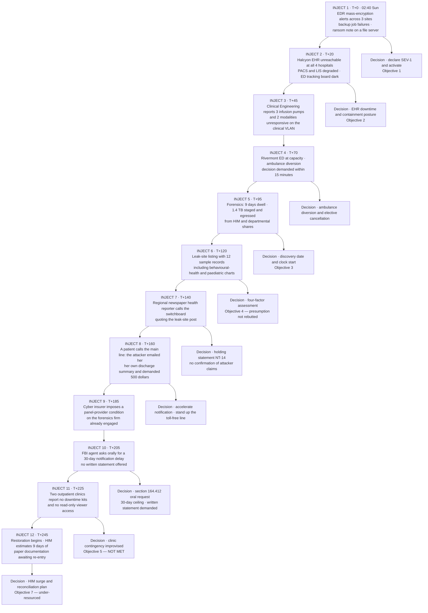

# 07.09 — Incident Response Tabletop Exercise

| Field | Value |
|---|---|
| Document ID | MBH-IRB-TTX-2026-709 |
| Version | 1.0 |
| Date | 2026-07-15 |
| Classification | Confidential — Electronic Protected Health Information (ePHI) // Illustrative Portfolio Sample |
| Owner | Daniel Cho, Chief Information Security Officer &amp; HIPAA Security Official |
| Co-Owner | Dr. Samuel Ortega, CMIO (clinical dimension) · Rebecca Stern, Chief Privacy Officer (breach track) |
| Author | Advisory Team (Healthcare GRC / HIPAA) |
| Status | Approved |

## Purpose

A plan that has never been used is a hypothesis. **TTX-2026-01**, conducted on **2026-08-13**, tested the hypothesis.

This document is the exercise record and after-action report for a four-hour, discussion-based tabletop against a **ransomware-with-double-extortion** scenario — the treatment of choice for **R-23 (Moderate 10)** and **R-24 (Moderate 12)**, and the only realistic way to reduce **R-31**, **R-37**, **R-43**, **R-47** and **R-49**, which cannot be contracted or documented down. It records the objectives, the participants, the injects and the timeline, what the organisation actually did, what worked, what failed, the findings with owners and due dates, and the plan revisions made as a result.

It is written to be uncomfortable. An after-action report in which everything went well is an after-action report that was not worth running. TTX-2026-01 produced **11 findings, 3 of them significant**, and forced **6 revisions** to documents that had been approved four weeks earlier.

The exercise also discharges the **§164.308(a)(8)** evaluation duty in respect of the incident-response capability, and supplies the NPRM-readiness evidence of "testing at defined intervals."

## 1. Exercise Design

| Element | Detail |
|---|---|
| Exercise ID | **TTX-2026-01** |
| Date and duration | **2026-08-13**, 08:30–12:45 (4 hours 15 minutes, including a 15-minute break at inject 4) |
| Location | Rivermont administrative campus, Boardroom A, with a virtual bridge for two Facility Incident Commanders and the Halcyon representative |
| Type | Discussion-based tabletop; no systems touched, no live traffic, no simulated alerts injected into production tooling |
| Scenario | **MBH-SCN-RW-01** — phishing of a revenue-cycle account without MFA → 9 days dwell → exfiltration of HIM and departmental shares → encryption of 9 of 12 Tier 1 systems at 02:40 on a Sunday, followed by a leak-site listing |
| Notional scale | 214,000 individuals in the exfiltrated set; 4 hospitals affected; ~30 clinics degraded |
| Facilitator | Advisory Team (Healthcare GRC / HIPAA), independent of the response |
| Evaluators | Priya Anand (Director of Internal Audit) and Karen Boyd (Chief Compliance Officer), scoring against the objectives |
| Scribe | CSIRT analyst, not a participant |
| Artefacts on the table | 07.02 plan, 07.03 triage, 07.04 recovery, 07.05 ransomware playbook, 07.06 four-factor template, 07.07 requirements, 07.08 templates, 04.08 contingency plan, HICS job action sheets |
| Rules | No-fault; participants respond as themselves; "I would call X" must name X; any answer of "we would find out" is recorded as a finding |
| After-action report | Issued **2026-08-27**; corrective actions tracked in `trackers/ttx-corrective-actions.xlsx` under 04.11 change control |

## 2. Objectives and Outcomes

| # | Objective | Measure of success | Risk treated | Outcome |
|---|---|---|---|---|
| 1 | Declare SEV-1, activate the plan and move to out-of-band communications | Within **30 minutes** of the first indicator | R-37 | ✅ **Met** — declaration at T+9, out-of-band at T+17 |
| 2 | Decide and record the clinical containment trade-off with the CMIO | Joint decision record produced with options and rationale | R-23 | ✅ **Met** — recorded at T+38, with dissent noted |
| 3 | Identify the correct **discovery date** and the 60-day clock start | Correct date, correct reasoning, recorded before severity finalised | R-31, §164.404(a)(2) | ⚠️ **Partially met** — correct date reached, but only after 26 minutes of debate; see F-1 |
| 4 | Execute a four-factor assessment live against the injects | Reasoned determination on the evidence presented | R-23, R-24 | ✅ **Met** — presumption **not** rebutted; notification correctly triggered |
| 5 | Exercise outpatient-site downtime procedures at two clinics | Clinic staff able to operate for 8 hours on paper | R-49 | ❌ **Not met** — see F-2, the most significant finding of the exercise |
| 6 | Exercise the business associate notification path against the 24-hour / 5-day clocks | Halcyon contacted and clocks correctly applied | R-31 | ✅ **Met** — with one contact-route defect, F-4 |
| 7 | Plan and resource documentation reconciliation after downtime | Named owner, sized workload, HIM surge plan invoked | R-43 | ⚠️ **Partially met** — plan invoked, resourcing under-estimated by a factor of roughly three; F-5 |
| 8 | Run the notification machinery end to end for a 214,000-individual population | Templates, vendor, call centre, HHS and media path all reachable within the schedule | R-24 | ✅ **Met** — with a call-centre capacity gap, F-3 |

**Overall evaluator assessment:** *Objectives substantially achieved. The response structure held under pressure; the clinical periphery and the reconciliation workload did not.*

## 3. Participants

| Role in the exercise | Participant | Function tested |
|---|---|---|
| Incident Commander | **Daniel Cho**, CISO &amp; HIPAA Security Official | Declaration, authority, battle rhythm |
| Deputy / Technical Lead | **Marcus Reed**, Information Security Manager | Scoping, containment, evidence |
| Chief Executive | **Dr. Helen Marsh**, President &amp; CEO | Payment decision framework, external posture |
| Chief Information Officer | **Anthony Ruiz** | Backup integrity, restoration sequencing |
| Chief Medical Information Officer | **Dr. Samuel Ortega** | EHR downtime declaration, clinical acceptance |
| Chief Privacy Officer | **Rebecca Stern** | Breach track, discovery date, four-factor, notification |
| General Counsel | **Lisa Coleman** | Privilege, law enforcement, §164.412, sanctions screening |
| Chief Compliance Officer | **Karen Boyd** | Evaluator; regulatory reporting |
| VP Enterprise Risk | **Michelle Tran** | Cyber insurer, cost capture, register impact |
| Director of Internal Audit | **Priya Anand** | Evaluator; evidence sufficiency |
| Facility Incident Commanders ×2 | Rivermont and Westbrook | HICS activation, diversion, cancellation |
| HIM Director | — | Documentation reconciliation, notification extract |
| Ambulatory Director | — | ~30 clinic sites, downtime kits |
| **Clinical Engineering Manager** | — | **6,120 medical devices; infusion pumps, physiologic monitors, imaging modalities under FDA change control** |
| Nursing leadership | Two Chief Nursing Officers | Paper charting, staffing surge, medication administration |
| Corporate Communications | Communications lead | Holding statement, media, portal, workforce |
| Business associate | **Halcyon Health Systems** representative | Vendor-side containment and the 24-hour clock |
| Board observer | **Robert Feldman**, Audit &amp; Compliance Committee Chair | Governance visibility, T4 escalation |

**Notable absence, recorded as a finding.** No pharmacy leadership representative attended. Medication administration under downtime was discussed by Nursing without the pharmacy owner in the room — **F-8**.

## 4. Inject Timeline

## 5. Observations by Workstream

| Workstream | What was observed |
|---|---|
| **Command and control** | Declaration was fast and unambiguous. Cho took the commander role without prompting; nobody competed for it. The war-room battle rhythm was set at T+31 and held. The scribe function worked — 148 timeline entries in 4 hours |
| **Out-of-band communications** | Moved at T+17. Two participants did not have the out-of-band application installed on their personal devices and had to be talked through it live. The printed call tree at Westbrook was 7 months out of date |
| **Clinical containment** | The trade-off between isolating the clinical VLAN and preserving physiologic monitoring was argued properly, on clinical grounds, with the CMIO holding the veto the plan gives him. The decision record was produced. **This was the strongest performance of the exercise** |
| **Clinical Engineering** | The Clinical Engineering Manager raised, correctly and early, that 3 of the affected device classes cannot be patched or re-imaged without vendor authorisation under FDA change control, and that network quarantine — not remediation — is the only available containment. The IR plan did not previously say this in terms |
| **Diversion decision** | Made in 11 minutes against a 15-minute demand, by the Facility Incident Commander with the ED medical director, through HICS and not through the security chain. Correct |
| **Breach track** | Stern opened the breach track at T+22, before being asked. The four-factor assessment was executed live and reached the right answer: with 1.4 TB evidenced as egressed and sample records on a leak site, **Factor 3 is decisive against MercyBridge** and the presumption cannot be rebutted |
| **Discovery date** | The right answer was reached — the earliest date a prudent entity with MercyBridge's monitoring should have known — but only after a 26-minute argument in which three participants advocated the date of the ransom note. That argument would have cost real days in a real event |
| **Notification** | The population was correctly sized, the vendor and call centre correctly invoked, the media threshold correctly assessed per state, and the HHS contemporaneous filing correctly identified. Template selection was immediate because the templates exist |
| **Law enforcement** | Coleman handled the oral §164.412 request exactly as written: documented the official, applied the 30-day ceiling, demanded a written statement, and refused to treat the conversation as an open-ended extension |
| **Insurer** | The panel-provider condition at inject 9 created 12 minutes of genuine confusion about whether work already done would be covered. Resolved, but the pre-approval sequence was not known to the people who needed it |
| **Outpatient sites** | **The failure of the exercise.** Two clinics had neither downtime kits nor viewer access. The improvised answer — run paper from hospital-supplied forms couriered out — was untested and would not have worked at 30 sites simultaneously |
| **Documentation reconciliation** | HIM invoked the surge plan and then discovered it was sized for a 48-hour outage, not a 9-day one. The estimate of re-entry effort was revised upward roughly threefold during the discussion |
| **Patient-directed extortion** | Inject 8 was the inject nobody had rehearsed. The response — accelerate notification, stand up the line early, do not engage the attacker — was correct but took 14 minutes to arrive at, and no script existed for the patient on the phone |

## 6. What Worked and What Failed

| ✅ What worked | Why it worked |
|---|---|
| SEV-1 declaration in 9 minutes with no hesitation | The severity model has explicit clinical criteria; nobody had to interpret |
| The CMIO's containment veto was respected without friction | 07.02 §4 names the CMIO as un-bypassable, and it held under pressure |
| The breach track opened at T+22, in parallel, not after recovery | The plan says it opens at declaration, and the Privacy Officer was in the room from the start |
| The four-factor assessment reached the defensible answer, against MercyBridge's own interest | The 07.06 discipline — evidence, not silence — was internalised |
| Notification templates were selected, not drafted | 07.08 existed. This is the single largest time saving the phase produced |
| The §164.412 oral-request handling was textbook | The requirement is written down with the 30-day ceiling attached |
| Halcyon's representative engaged substantively on the 24-hour clock | The contractual obligation to participate (06.03 §5 measure 8) delivered |
| The diversion decision ran through HICS, not through security | Dual activation is designed correctly and behaved correctly |

| ❌ What failed | Consequence if real |
|---|---|
| **Two outpatient clinics had no downtime kits and no viewer access** | ~30 sites operating blind; unsafe care or closure within hours |
| **HIM reconciliation surge plan sized for 48 hours, not 9 days** | Months of documentation backlog; the R-43 integrity exposure realised |
| **Call-centre capacity modelled on 8–12% of individuals; at 214,000 that is 17,000–26,000 calls and exceeds the contracted ramp** | Unanswered statutory contact procedure under §164.404(c)(1)(v) |
| 26 minutes lost arguing the discovery date | Days lost in a real event, against a 60-day clock |
| Westbrook printed call tree 7 months out of date | Out-of-band communications degraded at the moment they matter most |
| Two participants without the out-of-band app installed | Command fragmentation in the first hour |
| Insurer panel-provider sequence not known to the engaging parties | Coverage dispute over forensics costs already incurred |
| No pharmacy leadership present | Medication-administration downtime decided without the accountable owner |
| No script for a patient contacted directly by the attacker | Improvised answers to the most distressed callers |
| Device containment under FDA change control not documented in the plan | Clinical Engineering improvising containment on 6,120 devices |
| No pre-agreed position on whether to publish a leak-site acknowledgement | 14 minutes of executive debate under media pressure |

## 7. Findings, Owners and Due Dates

| ID | Finding | Severity | Owner | Due | Status at 2026-08-27 |
|---|---|---|---|---|---|
| **F-1** | Discovery-date determination is not decidable quickly enough under pressure; the reasoning exists in 07.03 but not as a usable decision aid | **Significant** | Marcus Reed | 2026-09-30 | Open — one-page decision card drafted |
| **F-2** | Downtime kits and read-only viewer access absent at outpatient sites; ~30 sites unprepared (**R-49**) | **Significant** | Ambulatory Director with Dr. Samuel Ortega | **2026-10-31** | Open — rollout funded; interim kits distributed to all sites 2026-08-22 |
| **F-3** | HIM documentation-reconciliation surge plan sized for a 48-hour outage, not a multi-day one (**R-43**) | **Significant** | HIM Director | 2026-11-30 | Open — re-modelled to a 10-day outage; agency contract being scoped |
| F-4 | Call-centre contracted ramp insufficient for a 200,000+ notification population | Moderate | Rebecca Stern with Lisa Coleman | 2026-10-31 | Open — vendor amendment in negotiation |
| F-5 | Printed call tree out of date at one hospital; no verification cycle | Moderate | Marcus Reed | 2026-09-15 | **Closed** — quarterly verification added to the call-tree test |
| F-6 | Out-of-band application not installed on all responder personal devices | Moderate | Marcus Reed | 2026-09-15 | **Closed** — installation verified for 100% of the CSIRT and executive tree |
| F-7 | Cyber-insurer panel-provider and pre-approval sequence not documented in the playbook | Moderate | Michelle Tran | 2026-09-30 | Open — one-page insurer annex drafted |
| F-8 | Pharmacy leadership not in the exercise participant set | Moderate | Daniel Cho | 2026-09-30 | **Closed** — participant roster amended; pharmacy added to the SEV-1 notification tree |
| F-9 | Medical-device containment under FDA change control not stated in the IR plan or the ransomware playbook | Moderate | Clinical Engineering Manager with Marcus Reed | 2026-10-15 | Open — text drafted for 07.04 and 07.05 |
| F-10 | No script or route for an individual contacted directly by the attacker | Moderate | Rebecca Stern | 2026-09-30 | Open — NT-15 drafted for the 07.08 set |
| F-11 | No pre-agreed executive position on responding to a leak-site publication | Low | Communications with Lisa Coleman | 2026-10-31 | Open — added to the NT-14 holding-statement family |

| Finding severity | Count | Definition |
|---|---|---|
| Significant | **3** | Would materially degrade patient care or statutory compliance in a real event |
| Moderate | 7 | Would cause delay, confusion or cost, but not failure |
| Low | 1 | Improvement opportunity |
| **Total** | **11** | All assigned an owner and a date at the after-action review on 2026-08-27 |

## 8. Plan Revisions Made

| # | Document | Revision | Change control | Effective |
|---|---|---|---|---|
| 1 | **07.02 — Incident Response Plan** | Pharmacy leadership added to the SEV-1 notification tree and the war-room roster; quarterly printed call-tree verification added to §8 | 04.11 CR-2026-0114 | 2026-09-15 |
| 2 | **07.03 — Detection &amp; Triage** | Discovery-date decision card added as an annex; the determination record becomes a **required field before severity is finalised**, not after | CR-2026-0115 | 2026-09-30 |
| 3 | **07.04 — Containment, Eradication &amp; Recovery** | New subsection: medical-device containment under FDA change control — quarantine as the primary control where patch or re-image requires vendor authorisation | CR-2026-0117 | 2026-10-15 |
| 4 | **07.05 — Ransomware Response Playbook** | Cyber-insurer panel-provider and pre-approval annex; leak-site publication response position; device-containment cross-reference | CR-2026-0118 | 2026-09-30 |
| 5 | **07.08 — Notification Templates &amp; Communications** | **NT-15** added — script and escalation route for an individual contacted directly by the attacker; call-centre capacity model re-based on a 200,000+ population | CR-2026-0119 | 2026-10-31 |
| 6 | **04.08 — Contingency Plan** | Outpatient-site downtime annex: kit contents, viewer access, courier plan for ~30 sites; HIM reconciliation surge re-modelled to a 10-day outage | CR-2026-0121 | 2026-11-30 |

**Two revisions were considered and rejected.** A proposal to lower the SEV-1 declaration threshold was rejected — the threshold performed correctly and lowering it would produce activation fatigue. A proposal to pre-authorise ambulance diversion by the security chain was rejected — diversion is a clinical decision, it belongs to the Facility Incident Commander, and the exercise demonstrated that the existing route is fast enough.

## 9. Exercise Programme Forward

| Exercise | Type | Scenario | Scheduled | Owner |
|---|---|---|---|---|
| **TTX-2026-01** | Tabletop, 4 hours | Ransomware with double extortion (MBH-SCN-RW-01) | **Conducted 2026-08-13** | Daniel Cho |
| FTX-2026-01 | Functional | Restoration of one Tier 1 system from an immutable backup into the clean room | 2026-09 | Anthony Ruiz |
| Joint restoration test | Functional, with Halcyon | Full-scale EHR restoration with MercyBridge observers | 2026-09 | Anthony Ruiz |
| CT-2026-02 | Call-tree and out-of-band test, unannounced, out of hours | — | Q4 2026 | Marcus Reed |
| CLIN-2026-01 | Clinic downtime drill at 6 outpatient sites | EHR unavailable, 8-hour paper operation | Q4 2026, after F-2 closes | Ambulatory Director |
| TTX-2027-01 | Tabletop | Business associate breach with a fourth-party hop and a 500+ population | Q2 2027 | Daniel Cho |
| Purple-team validation | Technical, quarterly | Ransomware and exfiltration detection use cases | From Q4 2026 | Daniel Cho with Ironwood Security Labs |

| Exercise governance | Position |
|---|---|
| Frequency | At least annually, and after any SEV-1 — §164.308(a)(7)(ii)(D) testing and NPRM readiness |
| Independence | Facilitated and evaluated by parties outside the response chain |
| Reporting | After-action report to the executive team and the Board Audit &amp; Compliance Committee within 14 days |
| Closure discipline | Findings are tracked to closure in `trackers/ttx-corrective-actions.xlsx`; open findings are reported at every quarterly Board pack until closed |
| Evidence | Exercise record, inject deck, scribe log, evaluator scoring and after-action report retained **6 years** under §164.316(b)(2)(i) |

## Cross-References

| Reference | Relevance |
|---|---|
| 03.06 — Ransomware &amp; Healthcare Threat Profile | Scenario MBH-SCN-RW-01 as exercised |
| 04.08 — Contingency Plan | Emergency mode operation, downtime kits and the F-2 / F-3 revisions |
| 05.11 — Medical Device Security Controls | The FDA change-control constraint raised by Clinical Engineering (F-9) |
| 06.09 — Business Associate Incident &amp; Breach Coordination | The Halcyon 24-hour / 5-day clock exercised under objective 6 |
| 07.02 — Incident Response Plan | The plan under test; revised under CR-2026-0114 |
| 07.03 — Detection &amp; Triage | The discovery determination behind finding F-1 |
| 07.05 — Ransomware Response Playbook | The playbook under test; revised under CR-2026-0118 |
| 07.06 — Breach Risk Assessment — Four Factor | The live assessment executed under objective 4 |
| 07.08 — Notification Templates &amp; Communications | The machinery exercised under objective 8; NT-15 added |
| 07.11 — Control-to-Risk Traceability | Where the exercise evidence is credited against R-23, R-24, R-31, R-37, R-43, R-47 and R-49 |

---
[⬅ Previous](07.08-notification-templates-and-communications.md) · [🏠 Phase README](07.00-README.md) · [Next ➡](07.10-incident-register-and-case-studies.md)
