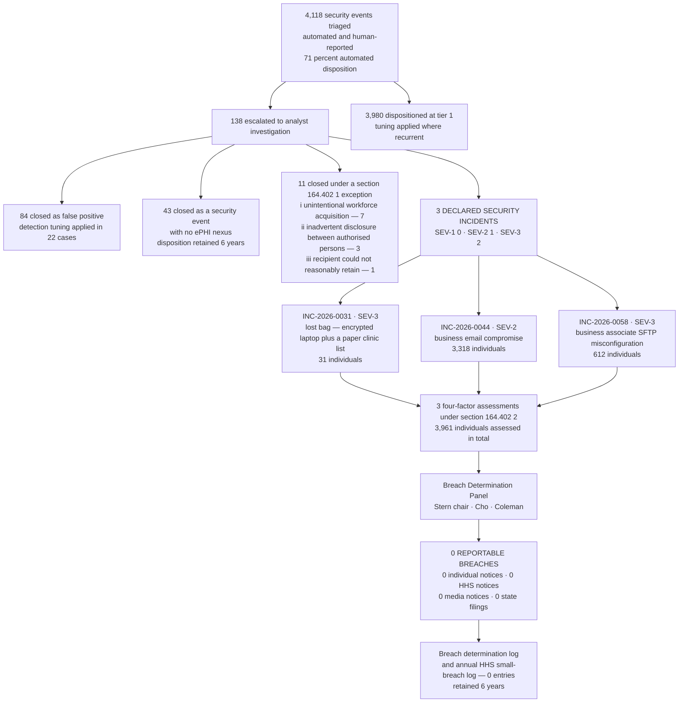

# 07.10 — Incident Register &amp; Case Studies

| Field | Value |
|---|---|
| Document ID | MBH-IRB-REG-2026-710 |
| Version | 1.0 |
| Date | 2026-07-15 |
| Classification | Confidential — Electronic Protected Health Information (ePHI) // Illustrative Portfolio Sample |
| Owner | Marcus Reed, Information Security Manager |
| Co-Owner | Rebecca Stern, Chief Privacy Officer (determinations) · Daniel Cho, CISO (register custody) |
| Author | Advisory Team (Healthcare GRC / HIPAA) |
| Status | Approved |

## Purpose

**§164.308(a)(6)(ii)** requires MercyBridge to *document* security incidents and their outcomes. **§164.414(b)** requires it to be able to demonstrate, years later, either that notification was made or that the event was not a breach. This document is where both duties are discharged in a single artefact: the incident register for the review period, and the three case studies behind it.

It records the **funnel** — **4,118 security events triaged → 138 escalated to analyst investigation → 3 declared security incidents → 0 reportable breaches** — and then does the thing a funnel diagram cannot do, which is show the reasoning. Each of the three incidents received a full four-factor assessment under §164.402(2). Each concluded that the presumption of breach was rebutted. **3,961 individuals' information was assessed and none of them received a notice**, and the file has to be good enough to explain why.

The register is the operational record; 07.06 holds the statutory analysis. This document is written so that the two read together and neither contradicts the other.

## 1. The Funnel

| Stage | Count | What it means |
|---|---|---|
| Security **events** triaged | **4,118** | Everything that reached the intake, from SIEM correlation to a nurse's phone call |
| Dispositioned at tier 1 without escalation | 3,980 | 71% of the total handled by automated disposition |
| **Escalated to analyst investigation** | **138** | A human read the evidence and formed a view |
| — closed as false positive | 84 | Detection tuning applied in 22 cases |
| — closed as an event with no ePHI nexus | 43 | Real, but no protected information involved |
| — closed under a §164.402(1) exception | 11 | Impermissible, but excluded from the definition of breach; conditions documented individually |
| **Declared security incidents** | **3** | SEV-1: 0 · SEV-2: 1 · SEV-3: 2 · SEV-4: 0 |
| Four-factor assessments performed | **3** | One per declared incident, including where safe harbour was available |
| Individuals whose PHI was assessed | **3,961** | 31 + 3,318 + 612 |
| **Reportable breaches** | **0** | No individual, HHS, media or state notification triggered |

**Two things worth reading off the funnel.** First, the ratio 4,118:3 is not a claim that MercyBridge is quiet — it is a claim that the triage function makes decisions and records them, which is what §164.308(a)(1)(ii)(D) asks for. Second, **11 exception closures is a number that only exists because someone applied the §164.402(1) conditions one at a time.** An organisation without that discipline records those 11 as either "not incidents" (undocumented, indefensible) or as breaches (over-notification).

## 2. The Incident Register

| ID | Discovered | Declared | SEV | Category | Detection source | Systems / media | Individuals | Containment | PIR | Determination |
|---|---|---|---|---|---|---|---|---|---|---|
| **INC-2026-0031** | 2026-03-11 | 2026-03-11 | SEV-3 | Loss of device and paper record | Workforce report (clinic manager) | Encrypted laptop (safe-harboured) + printed clinic session list | **31** | Recovered 2026-03-12, 26h | 2026-03-27 | **No breach** — 2026-03-24 |
| **INC-2026-0044** | **2026-05-06** | 2026-05-06 | SEV-2 | Business email compromise | SIEM impossible-travel + workforce report | Revenue-cycle mailbox via a legacy connector without MFA | **3,318** | Account disabled at +41 min | 2026-05-29 | **No breach** — 2026-05-27 |
| **INC-2026-0058** | **2026-06-20** (BA discovery imputed) | 2026-06-22 | SEV-3 | Business associate misconfiguration | BA notification (H4 CodeBridge) | Vendor SFTP directory, coding worklist | **612** | Permissions corrected in 2h | 2026-07-10 | **No breach** — 2026-07-08 |

| Register field | Discipline applied |
|---|---|
| Discovery date | The §164.404(a)(2) determination, adopted at triage, **before** severity is finalised (07.03 §6.1) |
| 60-day outer limit | Calculated and diarised on every incident **whether or not** a breach is expected — 2026-05-10, 2026-07-05 and 2026-08-19 respectively |
| Individuals | The assessed population, not the notified population; recorded even where the determination is no breach |
| Determination date | Target day 30 from discovery; actual 13, 21 and 18 days |
| Retention | Register entry, evidence index, assessment, determination memo and PIR retained **6 years** — §164.316(b)(2)(i) |
| Reopening | Every entry carries a reopening trigger; leak-site monitoring runs against all three populations |

## 3. Case Study — INC-2026-0031 · The Bag on the Train

| Element | Record |
|---|---|
| What happened | On **2026-03-11** an orthopaedic clinic manager left a laptop bag on a commuter train between the Rivermont campus and the Westbrook clinic. The bag was recovered from the transit authority's lost-property office **26 hours later**, contents apparently undisturbed. It held a MercyBridge encrypted laptop **and a printed clinic schedule for one session listing 31 patients** |
| Discovery | 2026-03-11 — actual knowledge; the manager reported within 90 minutes of realising, through the workforce reporting line |
| Severity | SEV-3 — no clinical system affected, fewer than 500 individuals plausible |
| Containment | Remote wipe issued and confirmed on the device's next network contact; the account's sessions revoked as a precaution; the transit authority's lost-property process tracked and the bag collected in person by MercyBridge security |
| Individuals | **31** — from the paper list only |

### 3.1 The Nuance That Decided It

**The device was never the issue. The paper was.**

| Item | Gate 1 analysis | Consequence |
|---|---|---|
| **Encrypted laptop** | Full-disk encryption to the applicable NIST standard, validated by the endpoint attestation; device powered off; pre-boot credential not compromised; remote wipe confirmed | **Not unsecured PHI. Safe harbour applies. Not a breach. No four-factor assessment required for the device** — disposed of in a single paragraph |
| **Printed clinic session list** | **Paper PHI is never covered by the encryption safe harbour.** The Breach Notification Rule applies to PHI in **any** medium; the Security Rule's electronic focus does not narrow §164.402 | **Unsecured PHI. Proceed to Gate 2 and the four factors** |

This is the lesson MercyBridge extracted from the incident and now teaches in workforce training: **an encryption programme that reaches 68 of 68 systems and 100% of endpoints does nothing at all for the sheet of paper in the same bag.** Phase 05's encryption achievement made the electronic half of this incident a non-event in a single sentence — and left the entire determination resting on a printed schedule that cost nothing to produce and was not tracked anywhere.

### 3.2 Four-Factor Assessment — the Paper List

| Factor | Evidence | Direction |
|---|---|---|
| **1 — Nature and extent** | 31 individuals. Name, appointment time, clinic name (orthopaedics), reason-for-visit abbreviation. **No SSN, no financial identifier, no MRN, no diagnosis beyond service line.** Direct identifiers make re-identification trivial; clinical content minimal and non-sensitive; no 42 CFR Part 2, behavioural-health, HIV/STI or reproductive-health content | Moderately toward compromise on identifiers; toward low on content |
| **2 — The unauthorised person** | Unknown. Mitigated by the recovery route: the bag entered an institutional lost-property process rather than being taken. Transit authority handling records reviewed | Neutral to slightly toward low |
| **3 — Actually acquired or viewed** | **Cannot be affirmatively established.** No evidence of copying or photography; the schedule was present, in order, undamaged; no sign of forced entry. Absence of evidence, honestly recorded as such | Toward compromise, weakly |
| **4 — Mitigation** | Physical recovery within 26 hours; the schedule destroyed under witness with a certificate; the clinic moved to an encrypted tablet-based session list; courier and transport policy revised; the manager retrained | Strongly toward low |
| **Determination** | **Low probability of compromise — no breach.** Small population, minimal non-sensitive clinical content, physical recovery through an institutional channel inside 26 hours, and the document destroyed | Signed Stern, Cho, Coleman — **2026-03-24** |
| Dissent | **Recorded.** One panel member noted that Factor 3 could not be affirmatively established and that the finding rests on Factors 1, 2 and 4. The panel accepted the point and recorded it rather than resolving it away. **This was the closest of the three calls** | — |

### 3.3 Corrective Actions

| Action | Owner | Status |
|---|---|---|
| Printed clinic session lists eliminated at all sites; encrypted tablet-based lists deployed | Ambulatory Director | Complete 2026-05-31 |
| Paper-PHI transport rule: no printed PHI leaves a site except in a tracked, sealed transfer under the courier procedure | Rebecca Stern | Complete |
| Print-to-PHI reporting added to the printer estate; high-volume clinical printing reviewed monthly | Marcus Reed | Complete Q2 2026 |
| Workforce training module: "the safe harbour does not print" | Rebecca Stern | Deployed 2026-06 |
| Lost-and-found escalation route agreed with the regional transit authority | Facilities | Complete |

## 4. Case Study — INC-2026-0044 · Business Email Compromise

| Element | Record |
|---|---|
| What happened | An adversary obtained the credentials of a revenue-cycle analyst through a phishing page and authenticated via a **legacy mail connector that did not enforce MFA**. First access **2026-04-27**; detected **2026-05-06** by an impossible-travel correlation supported by a concurrent workforce report; account disabled **41 minutes** after the first alert. Dwell time 9 days |
| Discovery | **2026-05-06** — the earlier of actual knowledge (07:41, duty analyst) and the reasonable-diligence date. The connector produced no earlier ingestible signal; that is documented as a detection gap, not excused |
| Severity | SEV-2 — confirmed unauthorised access to ePHI, no clinical system affected, no patient-safety dimension |
| Individuals | **3,318** — name, DOB, MRN, account number, dates of service, payer and insurance ID; for ~640 individuals, procedure and diagnosis codes; a small number of behavioural-health service lines. **No SSN, no financial account numbers** |
| Gate 1 | Safe harbour **unavailable** — an adversary operating as an authenticated user is served decrypted data |

### 4.1 The Factor That Decided It

| Factor | Evidence | Direction |
|---|---|---|
| 1 — Nature and extent | 3,318 individuals; directly identifying; clinical content for a subset; behavioural-health lines present | **Strongly toward compromise** |
| 2 — The unauthorised person | Behaviour characteristic of a **financially motivated business email compromise** operation: search for payment threads, attempted invoice redirection, an inbox rule hiding replies from one vendor domain. No indicators of a data-theft or extortion group; no MercyBridge data on any monitored leak site | Mixed — a criminal actor, but not one whose business model is PHI monetisation |
| **3 — Actually acquired or viewed** | **Decisive.** Item-level tenant audit records for the full 9-day window show **47 individual messages accessed**, all within two accounts-payable threads, **none containing PHI**. No mailbox search queries, no folder synchronisation, no export, no download client, no external forwarding. Total session egress **3.1 MB**, consistent with interactive browsing and inconsistent with bulk retrieval. Log completeness independently verified for the entire window | **Strongly toward low probability** |
| 4 — Mitigation | Account disabled and credentials reset in 41 minutes; all sessions and refresh tokens revoked; the inbox rule removed; MFA enforced on the legacy connector and the connector **retired 2026-05-19**; tenant-wide rule audit; adversary infrastructure blocked; litigation hold applied; targeted phishing retraining | Strongly toward low |
| **Determination** | **Low probability of compromise — no breach.** The determination rests on Factor 3: MercyBridge could demonstrate positively **what was accessed**, not merely fail to find evidence of access | Signed Stern, Cho, Coleman — **2026-05-27** |

### 4.2 The Counterfactual, Recorded in the Memo

> Had item-level access logging been unavailable, the panel records that it **could not** have reached a low-probability finding. MercyBridge would have notified **3,318 individuals**, filed with HHS contemporaneously, and issued a media notice in the affected state. The §164.312(b) audit-controls investment is credited explicitly in the determination memo.

This is the single most useful sentence in the review period's incident file, because it converts an abstract control into a measured avoided cost — and because an assessor reading it can see that the panel understood the difference between *evidence of no access* and *no evidence of access*.

| Corrective action | Owner | Status |
|---|---|---|
| Legacy mail connector retired enterprise-wide | Marcus Reed | Complete 2026-05-19 |
| MFA enforcement gap review across all authentication paths to ePHI systems | Daniel Cho | Complete Q2 2026 |
| Tenant-wide inbox-rule anomaly detection | Marcus Reed | Complete |
| Item-level mailbox audit logging confirmed enabled and retained for all ePHI-adjacent mailboxes | Marcus Reed | Complete |
| Revenue-cycle department phishing retraining and simulation | Rebecca Stern | Complete |
| Mailbox PHI-minimisation review: why 3,318 individuals' data sat in a mailbox at all | Rebecca Stern | **Open — 2026-12-31** |

## 5. Case Study — INC-2026-0058 · Business Associate SFTP Misconfiguration

| Element | Record |
|---|---|
| What happened | **H4 CodeBridge**, a coding business associate, applied an incorrect access-control list to a client directory during a platform migration, making a MercyBridge coding worklist readable by the authenticated service accounts of **three other CodeBridge clients**. Exposure window **2026-06-14 to 2026-06-20** (6 days) |
| Discovery | CodeBridge discovered it **2026-06-20** and gave initial notice to MercyBridge **2026-06-22**, inside the 24-hour clock from its own internal escalation. **MercyBridge adopted 2026-06-20** as the discovery date under the Phase 06 agency assumption — the 60-day outer limit was therefore **2026-08-19**, not 2026-08-21 |
| Severity | SEV-3 |
| Individuals | **612** — name, MRN, DOB, dates of service, attending provider, ICD-10 diagnosis codes including a small number of behavioural-health codes |
| Gate 1 | Files were encrypted at rest but served decrypted to authenticated accounts. Safe harbour **unavailable** |
| Gate 2 | No exception — the three client organisations are neither MercyBridge workforce nor authorised persons at the same entity or OHCA |

| Factor | Evidence | Direction |
|---|---|---|
| 1 — Nature and extent | 612 individuals; directly identifying with clinical content; behavioural-health codes present | Strongly toward compromise |
| 2 — The unauthorised person | The directory was **not internet-exposed**. Read access was limited to the authenticated service accounts of three other CodeBridge clients — each an identifiable healthcare organisation, itself a covered entity or business associate, bound by HIPAA and by CodeBridge's contracts | Toward low probability |
| **3 — Actually acquired or viewed** | CodeBridge's SFTP transfer logs, obtained under the BAA **within the 5-day window** and reviewed independently by MercyBridge, are complete for the exposure window and record **no LIST, STAT or GET operation** against the directory by any account other than MercyBridge's own. Log integrity confirmed against the platform's write-once store | Strongly toward low probability |
| 4 — Mitigation | Permissions corrected within **2 hours** of discovery; configuration independently verified by MercyBridge; **written attestations obtained from all three client organisations** confirming no access and no retention; CodeBridge's change-control process remediated with evidence; an off-cycle assessment triggered under the 06.08 monitoring triggers | Strongly toward low |
| **Determination** | **Low probability of compromise — no breach.** Complete transfer logs showing no retrieval, a bounded and contractually obligated recipient population, and rapid verified remediation | Signed Stern, Cho, Coleman — **2026-07-08** |

> **Recorded in the memo:** had the transfer logs been incomplete, Factor 3 would have been neutral at best and the panel records that the determination would probably have gone the other way. **Log availability at a business associate is now a Phase 06 due-diligence question, not an assumption.**

| Corrective action | Owner | Status |
|---|---|---|
| CodeBridge change-control remediation verified with evidence; off-cycle assessment closed | Karen Boyd | Complete 2026-07-31 |
| BA due-diligence instrument amended: log availability, retention and integrity now scored questions | Daniel Cho | Complete |
| Access-control review requirement added to BA migration and platform-change notices | Lisa Coleman | Complete |
| Second BA notice in the period (H3 Verbatim, transcription) investigated and closed — the affected records contained no MercyBridge ePHI | Marcus Reed | Complete |

## 6. Lessons Learned

| # | Lesson | Where it came from | What changed |
|---|---|---|---|
| 1 | **The encryption safe harbour stops at the printer.** Estate-wide encryption made the laptop a non-event and did nothing for the paper in the same bag | INC-2026-0031 | Printed clinic lists eliminated; paper-PHI transport rule; training module |
| 2 | **Audit controls are a breach-notification control.** Factor 3 decided two of three determinations, and it is only answerable where logs exist, are complete and are retained | INC-2026-0044, INC-2026-0058 | Item-level mailbox logging verified; SIEM ingestion to 68 of 68 by 2027-01-31 |
| 3 | **Absence of evidence is not evidence of absence, and the file must say which one it has** | All three | The four-factor template forces the distinction as a required field |
| 4 | **A business associate's logging is MercyBridge's evidence base.** A vendor without logs makes a low-probability finding unavailable to the covered entity | INC-2026-0058 | Log availability scored in due diligence; contractual retention minimums at renewal |
| 5 | **The discovery date is a determination, not an observation** — and adopting the earlier date costs almost nothing | INC-2026-0058, INC-2026-0044 | Discovery determination required before severity is finalised (07.09 F-1) |
| 6 | **Dissent recorded is stronger than dissent resolved.** The 0031 memo is more defensible because it says what it could not prove | INC-2026-0031 | Dissent is a required field, never edited out |
| 7 | **Data minimisation is the cheapest breach control there is.** 3,318 individuals' data was in a mailbox because nobody had asked why | INC-2026-0044 | Mailbox PHI-minimisation review open to 2026-12-31 |
| 8 | **Speed of containment is Factor 4 evidence.** 41 minutes and 2 hours both appear in determinations as mitigation | INC-2026-0044, INC-2026-0058 | Containment timers reported as a standing metric |
| 9 | **Every declared incident gets an assessment, even where safe harbour applies.** The device in 0031 needed one paragraph — but the paragraph exists | INC-2026-0031 | Assessment is mandatory on declaration, not on judgement |
| 10 | **None of these was ransomware.** The three incidents were handled with time to think. **R-23 and R-24 would not offer that**, which is why TTX-2026-01 exists | All three | Tabletop conducted 2026-08-13 (07.09) |

## 7. Register Metrics and Governance

| Metric | Value | Target |
|---|---|---|
| Events triaged | 4,118 | — |
| Escalation rate | 3.4% (138 of 4,118) | 2–6% band |
| Declared-incident rate | 2.2% of escalations (3 of 138) | — |
| Median detection → containment (SEV-2/3) | **2.6 hours** | ≤ 4 hours |
| Median workforce phishing report time | 7 minutes | ≤ 15 minutes |
| Median discovery → determination | **17 days** | ≤ 30 days |
| Four-factor assessments completed on declared incidents | **3 of 3 (100%)** | 100% |
| Post-incident reviews within 15 business days | **3 of 3 (100%)** | 100% |
| Determinations reviewed by the Chief Compliance Officer for completeness | 3 of 3 | 100% |
| Corrective actions from incidents closed on time | 14 of 15 | ≥ 90% |
| **Reportable breaches** | **0** | — |
| Annual HHS small-breach log entries for 2026 to date | **0** | — |
| Register entries reopened on new evidence | 0 | — |

| Governance control | Frequency | Owner |
|---|---|---|
| Register completeness reconciliation against the SIEM case queue and the reporting line | Monthly | Marcus Reed |
| Independent review of every determination for completeness, not conclusion | Per assessment | Karen Boyd |
| Internal Audit sampling of register entries, exception closures and evidence indices | Annually | Priya Anand |
| Leak-site monitoring against all assessed populations, as a reopening trigger | Continuous | Marcus Reed |
| Quarterly metrics pack to the Board Audit &amp; Compliance Committee | Quarterly | Daniel Cho |
| Six-year retention of the full incident file | Continuous | Marcus Reed |

## Cross-References

| Reference | Relevance |
|---|---|
| 04.02 — Security Management Process | §164.308(a)(1)(ii)(D) activity review feeding the 4,118 |
| 04.07 — Security Incident Procedures | POL-12, the documentation duty this register discharges |
| 05.06 — Audit Controls | The §164.312(b) evidence base behind Factor 3 in two of three cases |
| 05.10 — Encryption &amp; Key Management | The safe harbour that resolved the laptop in INC-2026-0031 |
| 06.05 — Due Diligence &amp; Assessment | Log availability as a scored diligence question after INC-2026-0058 |
| 06.09 — Business Associate Incident &amp; Breach Coordination | The agency assumption behind the 2026-06-20 discovery date |
| 07.03 — Detection &amp; Triage | The funnel and the discovery determinations |
| 07.06 — Breach Risk Assessment — Four Factor | The statutory analysis these case studies apply |
| 07.07 — Breach Notification Requirements | What would have followed had any determination gone the other way |
| 07.09 — Incident Response Tabletop Exercise | The scenario these three incidents deliberately were not |
| 07.11 — Control-to-Risk Traceability | Where this evidence is credited against R-23, R-24, R-31 and R-34 |

---
[⬅ Previous](07.09-incident-response-tabletop-exercise.md) · [🏠 Phase README](07.00-README.md) · [Next ➡](07.11-control-to-risk-traceability.md)
