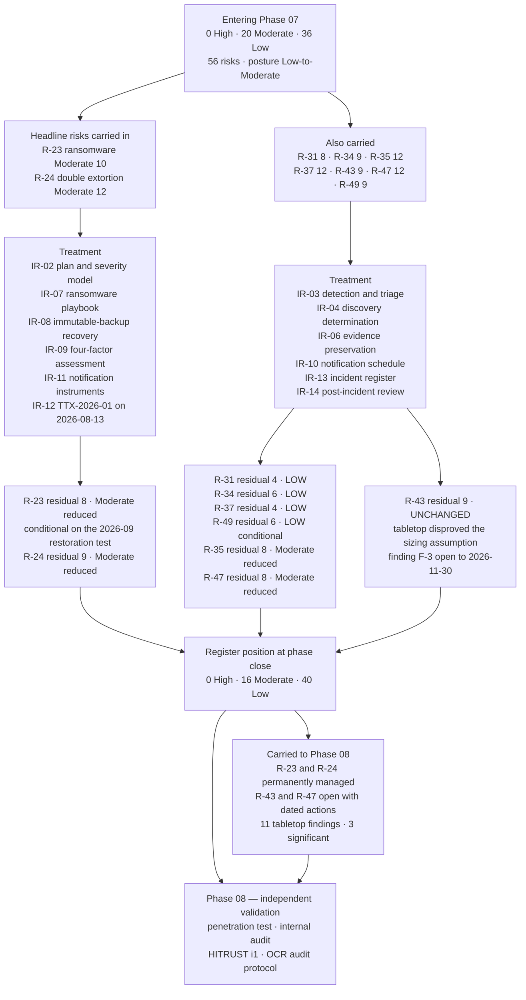

# 07.11 — Control-to-Risk Traceability

| Field | Value |
|---|---|
| Document ID | MBH-IRB-TRC-2026-711 |
| Version | 1.0 |
| Date | 2026-07-15 |
| Classification | Confidential — Electronic Protected Health Information (ePHI) // Illustrative Portfolio Sample |
| Owner | Daniel Cho, Chief Information Security Officer &amp; HIPAA Security Official |
| Co-Owner | Michelle Tran, VP Enterprise Risk (register custodian) · Rebecca Stern, Chief Privacy Officer · Karen Boyd, Chief Compliance Officer |
| Author | Advisory Team (Healthcare GRC / HIPAA) |
| Status | Approved |

## Purpose

Phase 07 produced a plan, five procedures, a set of templates, an exercise and three closed investigations. This is the document that says what any of it was **for**.

It traces every incident-response control back to the risks it was built to treat, states the evidence that the control actually operates, and records the resulting movement in the **56-risk register** established in Phase 03. Phase 07 opened at the position Phase 06 handed over — **0 High / 20 Moderate / 36 Low** — and closes at **0 High / 16 Moderate / 40 Low**, with **four risks moving Moderate → Low** and three reduced within band.

Two things make this matrix different from its predecessors. First, **the two headline risks — R-23 and R-24 — are not closed and will never be closed.** Ransomware is a permanent feature of the sector; what changes is how much of MercyBridge it reaches. Second, **one risk is deliberately not reduced.** TTX-2026-01 disproved the assumption behind the R-43 target, so R-43 stays where it was. A traceability matrix that only moves in one direction is a marketing document.

## 1. Method

Scoring is unchanged from **03.05**: **likelihood × impact on a 5×5 scale**, rating bands **High 15–25 · Moderate 8–12 · Low 1–6**, with the **ESC-2 patient-safety escalation** that floors impact at 5 where the longitudinal clinical record is **lost**.

| Rule | Statement |
|---|---|
| Attribution | A risk is attributed to Phase 07 only where the **determinative** treatment is a detection, response, assessment or notification control. Contributory effects are recorded separately in §4 |
| Evidence | Every residual claim cites an artefact an assessor can pull — a signed determination memo, a scribe log, a tracker entry, a metric with a date |
| Likelihood vs impact | Detection and response controls reduce **likelihood** and **duration**. They reduce impact only where they change whether the ePHI or the clinical record is **recoverable** |
| ESC-2 | Impact is floored at 5 where the clinical record is irrecoverably lost. Where an independently keyed, restore-verified replica exists, the modelled outcome is a **bounded outage**, not loss, and the floor does not engage |
| Honesty rule | A treatment that is designed but not proven in operation is not claimed, unless an **interim compensating control** is operating and evidenced. Where an exercise **disproved** an assumption, the score does not move |
| Exercise evidence | Tabletop performance is credited only against objectives the evaluators marked **Met**. Objectives marked *Partially met* or *Not met* produce findings, not reductions |
| Reversion | Any residual claimed on a conditional basis names the test that confirms it and the score it reverts to on failure |

## 2. The Phase 07 Control Set

| Control | Name | Where defined | Security Rule anchor | Risks treated |
|---|---|---|---|---|
| **IR-01** | Incident response programme, roles and the incident-vs-breach distinction | 07.01 | §164.308(a)(6)(i) | R-37 |
| **IR-02** | Incident Response Plan — six-phase lifecycle, SEV-1 to SEV-4 clinical severity model, activation authority, war room, HICS dual activation | 07.02 | §164.308(a)(6)(ii) | **R-37**, R-23, R-35 |
| **IR-03** | Detection and triage — 15 scoping questions, SIEM coverage of 62 of 68 ePHI systems, workforce reporting line | 07.03 | §164.312(b); §164.308(a)(1)(ii)(D) | **R-35**, R-23, R-24, R-34 |
| **IR-04** | **Discovery determination** — the §164.404(a)(2) clock-start record, adopted at triage, earlier-date rule, agency assumption | 07.03 §6 | §164.404(a)(2) | **R-31**, R-24 |
| **IR-05** | Containment, eradication and recovery, with the clinical trade-off as a joint CMIO decision record | 07.04 | §164.308(a)(6)(ii); §164.308(a)(7) | R-23, R-43, R-47 |
| **IR-06** | Evidence preservation, chain of custody and log-integrity verification | 07.04 | §164.312(b); §164.414(b) | **R-24**, R-34 |
| **IR-07** | Ransomware playbook — OCR presumptive-breach position, first hour, payment decision framework, clinical continuity | 07.05 | §164.308(a)(6); §164.308(a)(7) | **R-23**, R-24, R-49 |
| **IR-08** | Immutable-backup recovery path with validation gates G1–G8 and clinical acceptance | 07.05 §8; 07.04 | §164.308(a)(7)(ii)(A)–(D) | **R-23**, R-47 |
| **IR-09** | Four-factor breach risk assessment — two gates, four factors, Breach Determination Panel, dissent recorded, 6-year file | 07.06 | §164.402(2); §164.414(b) | **R-24**, R-34, R-31 |
| **IR-10** | Notification requirements and the 60-day schedule built to the shortest applicable deadline | 07.07 | §164.404–414 | **R-31**, R-24 |
| **IR-11** | Notification instruments NT-01 to NT-14, vendor at 250,000 notices in 10 business days, dormant toll-free line, pre-translation | 07.08 | §164.404(c), (d); §164.406; §164.408 | **R-24**, R-31 |
| **IR-12** | **Exercise programme** — TTX-2026-01 conducted 2026-08-13, functional restoration test, call-tree tests, clinic drills, purple-team validation | 07.09 | §164.308(a)(7)(ii)(D); §164.308(a)(8) | **R-37**, R-23, R-24, R-31, R-43, R-47, **R-49** |
| **IR-13** | Incident register, case-study file and the 4,118 → 138 → 3 → 0 funnel | 07.10 | §164.308(a)(6)(ii); §164.316(b) | R-34, R-35, R-37 |
| **IR-14** | Post-incident review within 15 business days and the §164.308(a)(8) register-update trigger | 07.02 §7; 07.10 | §164.308(a)(8) | R-35, R-37, R-43 |

## 3. Keystone Traceability Matrix

| Risk | Description | Entering (L × I) | Band | Controls applied | Evidence | Residual (L × I) | **Band movement** | Onward owner |
|---|---|---|---|---|---|---|---|---|
| **R-23** | Enterprise ransomware disabling Tier 1 clinical systems across 4 hospitals and ~30 clinics (ESC-2 considered) | **2 × 5 = 10** | **Moderate** | IR-02, IR-05, IR-07, IR-08, IR-12 | SEV-1 declared in 9 minutes at TTX-2026-01; CMIO containment veto exercised and recorded; immutable copies in place for Tier 1 with restore verified quarterly; independently keyed replica of the clinical archive (BA-09) operating; downtime and reconciliation exercised at all 4 hospitals; HICS dual activation performed | **2 × 4 = 8** | **Moderate → Moderate (reduced)** | Daniel Cho |
| **R-24** | Double-extortion exfiltration of ePHI before encryption, foreclosing a low-probability finding | **4 × 3 = 12** | **Moderate** | IR-03, IR-06, IR-07, IR-09, IR-10, IR-11, IR-12 | Exfiltration use cases and egress baselining committed with dates; leak-site and credential-broker monitoring live from Q3 2026; evidence-preservation standard applied in 2 of 3 live incidents; four-factor path executed live at TTX-2026-01 and correctly **failed** to rebut the presumption; NT-01 to NT-14 approved; vendor tested to 250,000 notices in 10 business days | **3 × 3 = 9** | **Moderate → Moderate (reduced)** | Daniel Cho / Rebecca Stern |
| **R-31** | Business associate breach notice arrives too late for the §164.404 60-day duty | **2 × 4 = 8** | **Moderate** | IR-04, IR-09, IR-10, IR-12 | 24h/5-day clocks in 24 of 24 critical/high BAAs; agency assumption applied **in a live incident** — INC-2026-0058 discovery adopted as 2026-06-20, two days earlier than notification; CodeBridge logs obtained inside the 5-day window; Halcyon exercised the path at TTX-2026-01, objective 6 **Met**; 4 of 4 BA notices received on time | **1 × 4 = 4** | **Moderate → Low** | Lisa Coleman |
| **R-34** | Clinician or staff mailbox compromise exposing ePHI | **3 × 3 = 9** | **Moderate** | IR-03, IR-06, IR-09, IR-13 | INC-2026-0044 contained in **41 minutes**; legacy non-MFA connector retired 2026-05-19; MFA gap review across all authentication paths to ePHI systems complete; item-level mailbox audit logging verified and retained; tenant-wide inbox-rule anomaly detection live; determination reached on positive access evidence | **2 × 3 = 6** | **Moderate → Low** | Marcus Reed |
| **R-35** | Extended adversary dwell time — an incident detected late, or not at all, because telemetry does not reach the SIEM | **3 × 4 = 12** | **Moderate** | IR-02, IR-03, IR-13, IR-14 | Median detection → containment **2.6 hours** against a 4-hour target; median workforce phishing report 7 minutes; 138 escalations investigated and dispositioned with reasons; 8 detection improvements committed with owners and dates. **6 of 68 ePHI systems still not forwarding to the SIEM** | **2 × 4 = 8** | **Moderate → Moderate (reduced)** | Marcus Reed |
| **R-37** | Incident response capability undocumented, unexercised and dependent on named individuals | **3 × 4 = 12** | **Moderate** | IR-01, IR-02, IR-12, IR-13, IR-14 | Plan and 6 procedures approved; severity model with clinical criteria; activation authority named with deputies; retainers executed for counsel, forensics, notification and crisis communications; **TTX-2026-01 conducted 2026-08-13** with 11 findings and 6 plan revisions; 3 live incidents run end to end; 3 of 3 PIRs inside 15 business days | **1 × 4 = 4** | **Moderate → Low** | Daniel Cho |
| **R-43** | Integrity loss on post-downtime documentation reconciliation | **3 × 3 = 9** | **Moderate** | IR-05, IR-12, IR-14 | Reconciliation built into the recovery procedure and invoked at TTX-2026-01 — **and found to be sized for a 48-hour outage against a 9-day scenario.** Objective 7 marked *Partially met*; finding **F-3** open to 2026-11-30 with no interim compensating control operating | **3 × 3 = 9** | **Unchanged — deliberately not reduced** | HIM Director with Dr. Samuel Ortega |
| **R-47** | Tier 1 restoration time unvalidated at enterprise scale | **3 × 4 = 12** | **Moderate** | IR-05, IR-08, IR-12 | Validation gates G1–G8 defined with clinical acceptance as gate 9; **24-hour restoration procedures documented for 12 of 12 Tier 1 systems and validated for 7**; restoration sequencing exercised at TTX-2026-01; functional restoration test and the joint Halcyon test both scheduled 2026-09 | **2 × 4 = 8** | **Moderate → Moderate (reduced)** | Anthony Ruiz |
| **R-49** | Downtime procedures untested at the ~30 outpatient sites | **3 × 3 = 9** | **Moderate** | IR-07, IR-12 | Clinic module exercised at two sites at TTX-2026-01 — objective 5 marked **Not met**, finding **F-2**. Residual claimed on the **interim compensating control**: downtime kits distributed to **all ~30 sites on 2026-08-22**, hospital-based courier and runner plan extended, printed call trees issued and verified | **2 × 3 = 6** | **Moderate → Low (conditional)** | Ambulatory Director |

### 3.1 The Two Judgement Calls in the Matrix

**R-23 — the one impact reduction claimed in this phase.** ESC-2 floors impact at 5 where the longitudinal clinical record is *lost*. MercyBridge holds an independently keyed, restore-verified immutable replica of the full clinical archive (BA-09, operating, verified quarterly), so the modelled outcome of an enterprise ransomware event is a **bounded outage with the record recoverable** — not loss. On that basis impact is scored **4**, and the residual is Moderate (8). The claim is conditional and the condition is named: **if the joint full-scale restoration test with Halcyon in 2026-09 does not demonstrate recoverability, R-23 reverts to 2 × 5 = 10.** How *long* the outage lasts is not part of this claim; that uncertainty is carried separately and openly as **R-47**.

**R-43 — the risk the exercise refused to reduce.** 07.01 §8 anticipated a residual of "Moderate (6)" for R-43. Two things are wrong with that target and both are corrected here. First, under the 03.05 bands a score of 6 sits in the **Low** band, not Moderate; the label was inconsistent. Second, and decisively, TTX-2026-01 established that the HIM reconciliation surge plan was sized for a 48-hour outage against a 9-day scenario, and the effort estimate was revised upward roughly threefold during the exercise. **R-43 therefore stays at Moderate (9).** The honest reading is that the exercise did not treat this risk; it measured it, and the measurement was worse than the assumption.

## 4. Contributory Effects — Risks Phase 07 Supports but Does Not Own

| Risk | Owned by | Phase 07 contribution | Effect |
|---|---|---|---|
| R-28 — hosted-EHR concentration (Halcyon, 2.1M records) | Phase 06 | Halcyon exercised the 24-hour clock and vendor-side containment at TTX-2026-01; joint restoration test scheduled | Supports the Moderate (10) residual; measure 8 of the nine-measure plan discharged |
| R-01 — incomplete MFA on remote and privileged access | Phase 05 | INC-2026-0044 surfaced a legacy connector without MFA; the connector was retired and an enterprise authentication-path gap review completed | One live exploitation path closed and evidenced |
| R-10 — unprofiled portable medical devices | Phase 05 | Clinical Engineering's TTX finding (F-9) that FDA change control makes quarantine, not remediation, the containment of record | Device containment now stated in 07.04 and 07.05 |
| R-40 / R-11 — ePHI at rest unencrypted; media disposal | Phase 05 | INC-2026-0031 confirmed the safe harbour operating on a real lost endpoint, and confirmed its boundary at paper | Validates the Phase 05 claim in live conditions |
| R-41 — unstructured ePHI sprawl | Phase 05 | INC-2026-0044 asked why 3,318 individuals' data was in a mailbox; a PHI-minimisation review is open to 2026-12-31 | Converts a control gap into a scoped action |
| R-30 — subcontractor chain visibility | Phase 06 | INC-2026-0058 tested the BA evidence-production obligation through one hop under live conditions | Confirms the flow-down obligations are enforceable in practice |

## 5. Register Position After Phase 07

| Band | Entering Phase 07 | Movements in Phase 07 | **At phase close** |
|---|---|---|---|
| **High** (15–25) | 0 | None | **0** |
| **Moderate** (8–12) | 20 | R-31, R-34, R-37 and R-49 leave to Low (−4); R-23, R-24, R-35 and R-47 reduced within band; R-43 unchanged | **16** |
| **Low** (1–6) | 36 | R-31, R-34, R-37 and R-49 enter (+4) | **40** |
| **Total** | **56** | — | **56** |

| Statement | Position |
|---|---|
| Risks whose determinative treatment sits in Phase 07 | **9** — R-23, R-24, R-31, R-34, R-35, R-37, R-43, R-47, R-49 |
| Risks reduced in score | **8 of 9** |
| Risks changing band | **4** — R-31, R-34, R-37, R-49, all Moderate → Low |
| Risks deliberately **not** reduced | **1** — R-43, on tabletop evidence |
| Residuals claimed conditionally, with a named reverting test | **2** — R-23 (joint restoration test, 2026-09) and R-49 (clinic drill CLIN-2026-01, Q4 2026) |
| High risks remaining in the register | **0** — sustained for a second consecutive phase |
| Overall posture | **Low-to-Moderate**, with the Moderate population now concentrated in availability and recovery rather than in confidentiality |
| Convergence with the 03.08 target profile of 0 / 23 / 33 | The High count matches and the Low count now **exceeds** the target; the split reconciles at the annual re-analysis under 03.10 |

**What the composition change means.** Entering the phase, the Moderate band was a mix of confidentiality, third-party and response-capability risks. Leaving it, the response-capability risks (R-31, R-37) and the identity-based confidentiality risk (R-34) have moved to Low, and what remains at Moderate is dominated by **availability and recovery** — R-23, R-43, R-47 — plus the two detection-dependent risks R-24 and R-35. That is the correct shape for a health system: the residual sits where the patient-safety consequence sits, it is visible, and it is owned by name.

## 6. Residual Ownership and Onward Testing

| Residual | Score | Owner | How it is kept honest | Next test |
|---|---|---|---|---|
| R-23 — enterprise ransomware | Moderate (8), conditional | Daniel Cho | Quarterly verified restore; purple-team validation of ransomware use cases; named in the quarterly Board pack | **Joint restoration test 2026-09**; penetration test 2026-09; reverts to 10 on failure |
| R-24 — double-extortion exfiltration | Moderate (9) | Daniel Cho / Rebecca Stern | Leak-site monitoring; egress baselining; DLP rollout to Q4 2026 and the 2027 capital cycle | Purple-team exfiltration validation Q4 2026; HITRUST i1 |
| R-31 — BA notification timing | **Low (4)** | Lisa Coleman | K-06 / K-07 KRIs; every BA notice timed against the contractual clock | TTX-2027-01 fourth-party scenario, Q2 2027 |
| R-34 — mailbox compromise | **Low (6)** | Marcus Reed | Phishing simulation programme; inbox-rule anomaly alerting; mailbox PHI-minimisation review | Minimisation review 2026-12-31 |
| R-35 — dwell time and telemetry gaps | Moderate (8) | Marcus Reed | Detection-coverage metric reported monthly | **SIEM ingestion for the remaining 6 ePHI systems by 2027-01-31** |
| R-37 — IR capability | **Low (4)** | Daniel Cho | Annual tabletop; annual functional test; twice-yearly call-tree test; findings tracked to closure | FTX-2026-01, 2026-09; TTX-2027-01 |
| R-43 — reconciliation integrity | Moderate (9) | HIM Director | F-3 tracked in the Board pack until closed; surge model re-based on a 10-day outage | **F-3 closure 2026-11-30**, then re-scored |
| R-47 — Tier 1 restoration time | Moderate (8) | Anthony Ruiz | 12 of 12 documented, 7 of 12 validated; validation count reported quarterly | Remaining 5 validations to Q1 2027 |
| R-49 — outpatient downtime | **Low (6)**, conditional | Ambulatory Director | Interim kits verified at all ~30 sites; viewer extension to clinics Q4 2026 | **CLIN-2026-01 drill at 6 sites, Q4 2026**; reverts to 9 on failure |

## Cross-References

| Reference | Relevance |
|---|---|
| 03.05 — Risk Assessment Methodology | The 5×5 model, the bands and the ESC-2 escalation applied here |
| 03.07 — Risk Register | R-23, R-24, R-31, R-34, R-35, R-37, R-43, R-47, R-49 as originally scored |
| 03.08 — Risk Treatment Plan | The 0 / 23 / 33 target profile this position is measured against |
| 05.12 — Control-to-Risk Traceability | The Phase 05 method this matrix continues |
| 06.11 — Control-to-Risk Traceability | The 0 High / 20 Moderate / 36 Low position handed into this phase |
| 07.02 — Incident Response Plan | Control IR-02 |
| 07.06 — Breach Risk Assessment — Four Factor | Control IR-09 and the determinations behind R-24 and R-34 |
| 07.09 — Incident Response Tabletop Exercise | Control IR-12 and the evidence behind R-37, R-43 and R-49 |
| 07.10 — Incident Register &amp; Case Studies | Control IR-13 and the live evidence behind R-31 and R-34 |
| 07.12 — Phase Summary &amp; Transition | Where this position is confirmed as the Phase 07 baseline |
| Phase 08 — HITRUST &amp; Independent Assessment | Independent validation of every residual claimed here |

---
[⬅ Previous](07.10-incident-register-and-case-studies.md) · [🏠 Phase README](07.00-README.md) · [Next ➡](07.12-phase-summary-and-transition.md)
