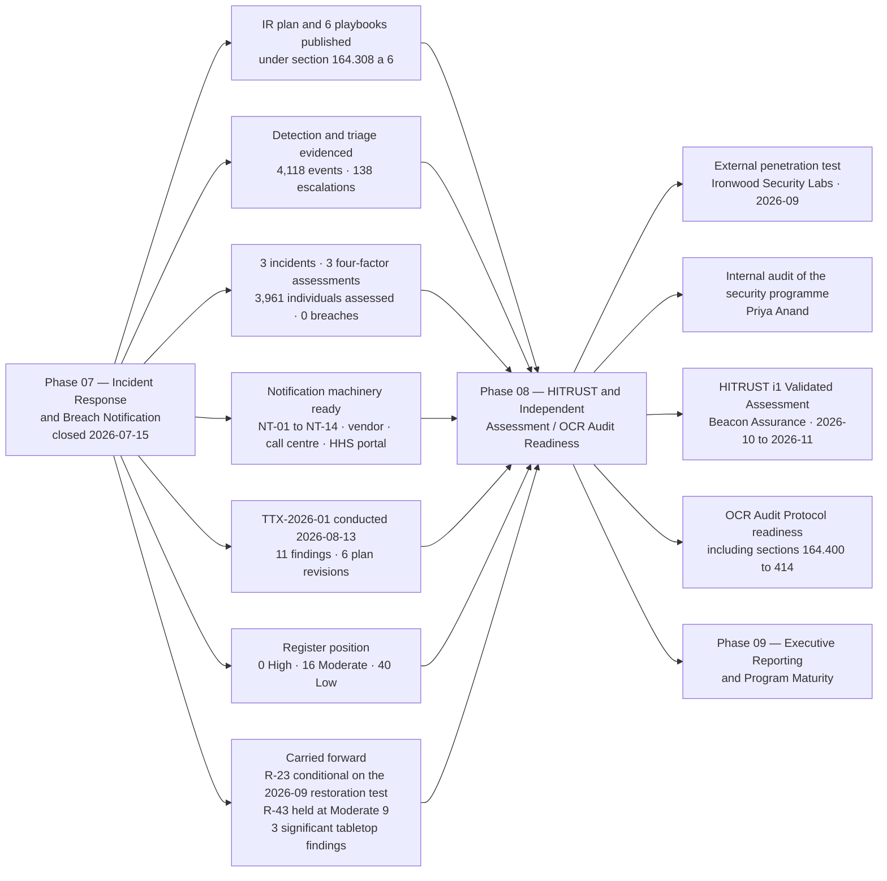

# 07.12 — Phase Summary &amp; Transition

| Field | Value |
|---|---|
| Document ID | MBH-IRB-SUM-2026-712 |
| Version | 1.0 |
| Date | 2026-07-15 |
| Classification | Confidential — Electronic Protected Health Information (ePHI) // Illustrative Portfolio Sample |
| Owner | Daniel Cho, Chief Information Security Officer &amp; HIPAA Security Official |
| Co-Owner | Rebecca Stern, Chief Privacy Officer · Karen Boyd, Chief Compliance Officer |
| Author | Advisory Team (Healthcare GRC / HIPAA) |
| Status | Approved |

## Purpose

Phase 07 began from an awkward position. MercyBridge had a risk analysis, 24 policies, administrative, physical and technical safeguards, and a governed business associate estate — and no tested answer to the question *what happens on the day one of them fails*. §164.308(a)(6) requires the covered entity to **identify and respond** to security incidents, **mitigate** their harmful effects, and **document** them and their outcomes. In February 2026 MercyBridge could not have evidenced any of the three to an assessor.

This document closes the phase. It records what was committed and what was delivered, confirms the incident-response and breach-notification baseline, states the risk outcome, lists the open items that travel forward, and hands over to **Phase 08 — HITRUST &amp; Independent Assessment / OCR Audit Readiness**, where every claim made in this phase stops being self-asserted and starts being tested by somebody else.

The headline is unglamorous and worth stating plainly: **3 security incidents investigated, 3 four-factor assessments completed, 3,961 individuals' information assessed, 0 reportable breaches** — and a tabletop that produced 11 findings and forced 6 revisions to documents approved four weeks earlier.

## 1. What the Phase Committed To, and What It Delivered

| Commitment made at phase opening (07.01) | Delivered | Evidence |
|---|---|---|
| Establish an incident response programme with named roles and the incident-vs-breach distinction | Programme established; CSIRT rota staffed 24×7; retainers executed for counsel, forensics, notification and crisis communications | 07.01 |
| Publish an incident response plan under §164.308(a)(6) | Six-phase lifecycle; **SEV-1 to SEV-4 clinically weighted severity model**; activation authority with named deputies; war room; **HICS dual activation** | 07.02 |
| Make detection and triage evidenced rather than intuitive, including the clock-start determination | 15 scoping questions; **discovery determination record** adopted at triage; 8 detection improvements committed with owners and dates | 07.03 |
| Define containment, eradication and recovery with the clinical trade-off explicit | Joint CMIO containment decision record; validation gates G1–G8 with clinical acceptance | 07.04 |
| Produce a ransomware playbook | OCR presumptive-breach position; first-hour actions; payment decision framework with OFAC and insurer dimensions; clinical continuity across 4 hospitals and ~30 clinics; **double-extortion (R-24) layers 1–6**; immutable-backup recovery | 07.05 |
| Operationalise the §164.402(2) four-factor assessment | Two gates before the four factors; Breach Determination Panel; dissent recorded; **3 worked examples**; six-year file | 07.06 |
| Document the full §164.404–414 notification apparatus | Every audience, clock and method; the 60-day schedule built to the **shortest applicable deadline**; §164.412 delay handled as a narrow documented exception | 07.07 |
| Provide ready-to-use notification templates and communications | **NT-01 to NT-14** approved; model individual notice carrying the five §164.404(c) elements as fixed sections; media outline; HHS checklist; call-centre readiness; workforce and clinician communications | 07.08 |
| Exercise the plan against a ransomware / ePHI exposure scenario | **TTX-2026-01 conducted 2026-08-13** — 4 hours, 12 injects, 18 participant roles including Clinical Engineering and Halcyon; after-action report 2026-08-27; **11 findings, 6 plan revisions** | 07.09 |
| Investigate and document the review period's incidents | **4,118 events → 138 escalations → 3 incidents → 0 breaches**; 3 assessments, 3 PIRs inside 15 business days | 07.10 |
| Move the risk register | **4 risks Moderate → Low**; 3 reduced within band; 1 deliberately held; **0 High sustained** | 07.11 |

## 2. Deliverables Register

| # | Document | Owner | Status |
|---|---|---|---|
| 07.01 | Incident Response Program Overview | Daniel Cho | Approved |
| 07.02 | Incident Response Plan | Daniel Cho | Approved |
| 07.03 | Detection &amp; Triage | Marcus Reed | Approved |
| 07.04 | Containment, Eradication &amp; Recovery | Daniel Cho | Approved |
| 07.05 | Ransomware Response Playbook | Daniel Cho | Approved |
| 07.06 | Breach Risk Assessment — Four Factor | Rebecca Stern | Approved |
| 07.07 | Breach Notification Requirements | Rebecca Stern | Approved |
| 07.08 | Notification Templates &amp; Communications | Rebecca Stern | Approved |
| 07.09 | Incident Response Tabletop Exercise | Daniel Cho | Approved |
| 07.10 | Incident Register &amp; Case Studies | Marcus Reed | Approved |
| 07.11 | Control-to-Risk Traceability | Daniel Cho | Approved |
| 07.12 | Phase Summary &amp; Transition | Daniel Cho | Approved |

| Supporting artefact | Location |
|---|---|
| Incident register (all events, escalations and declared incidents) | `trackers/incident-register.xlsx` |
| Breach determination log — one line per assessment | `logs/breach-determination-log.md` |
| Four-factor assessment template | `templates/four-factor-assessment.md` |
| Notification instruments NT-01 to NT-14 | `templates/notification/` |
| TTX-2026-01 inject deck, scribe log, evaluator scoring, after-action report | `governance/ttx-2026-01/` |
| Tabletop corrective-action tracker | `trackers/ttx-corrective-actions.xlsx` |
| Discovery determination records | `logs/discovery-determinations/` |
| Post-incident review reports (3) | `governance/pir/` |
| Escalation ladder, call tree and out-of-band contact roster | `governance/` |

## 3. Quantified Outcomes

| Measure | Baseline (phase opening) | **At phase close** |
|---|---|---|
| Documented incident response plan under §164.308(a)(6) | None | **Published and exercised** |
| Playbooks maintained | 0 | **6** — ransomware, BEC, medical device, business associate, insider, lost device |
| Security events triaged and dispositioned | Not measured | **4,118** |
| Escalations investigated with a recorded disposition | Not measured | **138** |
| Declared security incidents | Not formally declared | **3** (SEV-1: 0 · SEV-2: 1 · SEV-3: 2) |
| Four-factor assessments completed on declared incidents | 0 | **3 of 3 (100%)** |
| Individuals whose PHI was assessed | — | **3,961** |
| **Reportable breaches** | Unknown — no determination process existed | **0** |
| Individual, HHS, media and state notices issued | — | **0 / 0 / 0 / 0** |
| §164.402(1) exception closures documented condition by condition | 0 | **11** |
| Median detection → containment (SEV-2/3) | Not measured | **2.6 hours** (target ≤ 4) |
| Median discovery → determination | Not measured | **17 days** (target ≤ 30) |
| Post-incident reviews within 15 business days | Not measured | **3 of 3 (100%)** |
| Tabletop exercises conducted | 0 | **1 — TTX-2026-01, 2026-08-13** |
| Tabletop findings raised / owners assigned | — | **11 / 11** |
| Plan revisions made under 04.11 change control | — | **6** |
| Notification instruments approved | 0 | **14** |
| Notification vendor capacity tested | None | **250,000 notices in 10 business days** |
| ePHI systems forwarding to the SIEM | 54 of 68 | **62 of 68** (68 of 68 by 2027-01-31) |
| ePHI systems encrypted at rest | 51 of 68 (Phase 05 entry) | **68 of 68** — safe harbour available estate-wide |
| Risks moving Moderate → Low | — | **4** |
| **High risks in the 56-risk register** | **0** | **0** |

## 4. Risk Outcome

| Risk | Entering | **Residual** | Band movement | Disposition |
|---|---|---|---|---|
| **R-23** — enterprise ransomware disabling Tier 1 clinical systems | Moderate (10) | **Moderate (8)** | Reduced within band | Conditional on the 2026-09 joint restoration test; permanently managed and named in the Board pack |
| **R-24** — double-extortion exfiltration of ePHI | Moderate (12) | **Moderate (9)** | Reduced within band | Permanently managed; detection and DLP work continues into 2027 |
| **R-31** — BA breach notice too late for the 60-day duty | Moderate (8) | **Low (4)** | **Moderate → Low** | Closed by exercise, not by contract — the only way it could close |
| **R-34** — clinician or staff mailbox compromise | Moderate (9) | **Low (6)** | **Moderate → Low** | Sustained by phishing simulation and rule-anomaly alerting |
| **R-35** — dwell time from incomplete telemetry | Moderate (12) | **Moderate (8)** | Reduced within band | Closes further on SIEM completion, 2027-01-31 |
| **R-37** — IR capability undocumented and unexercised | Moderate (12) | **Low (4)** | **Moderate → Low** | Sustained by the annual exercise programme |
| **R-43** — integrity loss on post-downtime reconciliation | Moderate (9) | **Moderate (9)** | **Unchanged — deliberately** | The tabletop disproved the sizing assumption; F-3 open to 2026-11-30 |
| **R-47** — Tier 1 restoration time unvalidated at scale | Moderate (12) | **Moderate (8)** | Reduced within band | 12 of 12 documented, 7 of 12 validated; remaining 5 to Q1 2027 |
| **R-49** — downtime procedures untested at outpatient sites | Moderate (9) | **Low (6)** | **Moderate → Low (conditional)** | Interim kits at all ~30 sites; confirmed or reverted at CLIN-2026-01, Q4 2026 |

| Register position | High | Moderate | Low | Total |
|---|---|---|---|---|
| Entering Phase 07 | 0 | 20 | 36 | 56 |
| **At Phase 07 close** | **0** | **16** | **40** | **56** |

**Zero High is now sustained across two consecutive phases**, and the composition of the Moderate band has changed in the right direction: what remains is concentrated in **availability and recovery** — where the patient-safety consequence lives, where it is visible, and where it is owned by name — rather than in confidentiality and response capability.

## 5. Baseline Confirmation

The Incident Response and Breach Notification baseline is **confirmed as of 2026-07-15**, with the exercise evidence appended on 2026-08-27. These are the fixed reference points against which future change is measured; any variance is a finding, not a drift.

| Baseline element | Confirmed position | Custodian | Re-baselined |
|---|---|---|---|
| Incident response plan | Six-phase lifecycle; SEV-1 to SEV-4 with clinical criteria; HICS dual activation | Daniel Cho | Annually, and after any SEV-1 |
| Playbook set | 6 playbooks, reviewed semi-annually | Marcus Reed | Semi-annually |
| Severity and activation authority | As tabulated in 07.02 §3 and §4; CMIO veto on clinical containment un-bypassable | Daniel Cho | On any change to the executive roster |
| Discovery determination standard | §164.404(a)(2); earlier of actual and constructive knowledge; agency assumption for BAs | Marcus Reed | On regulatory change |
| Breach determination governance | Panel of Stern (chair), Cho, Coleman; balanced cases are notified; dissent recorded | Rebecca Stern | Annually |
| Notification apparatus | NT-01 to NT-14; vendor at 250,000/10 business days; dormant toll-free line, 24-hour activation; two named HHS submitters | Rebecca Stern | Annually and after any use |
| Exercise programme | Annual tabletop, annual functional restoration test, twice-yearly call-tree test, quarterly purple-team validation | Daniel Cho | Annually |
| Documentation and retention | Full incident file retained **6 years** under §164.316(b)(2)(i) | Marcus Reed | Continuous |
| Risk position | **0 High / 16 Moderate / 40 Low** | Michelle Tran | Annual re-analysis under 03.10 |

## 6. Open Items Carried Forward

| # | Open item | Why it remains open | Owner | Due |
|---|---|---|---|---|
| **F-2** | Outpatient downtime kits and read-only viewer access across ~30 sites (**R-49**) | Interim kits distributed 2026-08-22; the viewer extension and the six-site drill complete the treatment | Ambulatory Director | 2026-10-31 |
| **F-3** | HIM documentation-reconciliation surge capacity re-modelled to a 10-day outage (**R-43**) | The only Phase 07 risk not reduced; agency surge contract being scoped | HIM Director | 2026-11-30 |
| **F-4** | Call-centre ramp insufficient for a 200,000+ notification population | Vendor amendment in negotiation | Rebecca Stern | 2026-10-31 |
| F-1 | Discovery-date decision card and the required-field change in the register | Drafted; deploys with the register enhancement | Marcus Reed | 2026-09-30 |
| F-7 / F-9 / F-10 / F-11 | Insurer pre-approval annex; medical-device containment under FDA change control; NT-15 attacker-contacted-patient script; leak-site response position | All drafted and in change control | Various — see 07.09 §7 | 2026-09-30 → 2026-10-31 |
| D-3 | SIEM ingestion for the remaining **6 of 68** ePHI systems (**R-35**) | Compensating controls operating in the interim | Marcus Reed | 2027-01-31 |
| V-24 | Immutable or offline copies for the 9 remaining Tier 2–3 systems | Capital and platform sequencing | Anthony Ruiz | Q4 2026 |
| M-2 | Joint full-scale restoration test with Halcyon (**R-23** condition, **R-47**) | Scheduled; the R-23 residual reverts to 10 if it fails | Anthony Ruiz | 2026-09 |
| R-47a | Validated 24-hour restoration procedures for the remaining **5 of 12** Tier 1 systems | Sequenced behind M-2 | Anthony Ruiz | Q1 2027 |
| MIN-1 | Mailbox PHI-minimisation review arising from INC-2026-0044 | Scoped; addresses R-41 as well as R-34 | Rebecca Stern | 2026-12-31 |
| O-6 | Customer-managed encryption keys at Halcyon (inherited from Phase 06) | The ceiling on R-28 and on the safe harbour in a vendor-side event | Lisa Coleman / Daniel Cho | 2027-03-31 |

## 7. Transition to Phase 08

| What Phase 08 inherits | From | Why it matters to independent assessment |
|---|---|---|
| A **documented, exercised** incident response plan | 07.02, 07.09 | The OCR Audit Protocol asks for the procedure **and** evidence it operates. Both exist |
| The **discovery determination** records | 07.03 §6 | The §164.404(a)(2) analysis is the first thing an assessor tests on any incident file |
| Three complete four-factor assessment files with dissent recorded | 07.06, 07.10 | The §164.414(b) burden of proof, discharged in writing, three times |
| The **0 reportable breaches** position and its reasoning | 07.10 | An assessor will not accept the conclusion; it will read the file. The file is built to be read |
| Notification instruments and vendor capacity | 07.08 | §164.404(c) content compliance is verifiable from the templates alone |
| The tabletop record, including **11 findings and 3 marked significant** | 07.09 | A tabletop with no findings is a credibility problem. This one has evidence of learning |
| The 6 plan revisions under 04.11 change control | 07.09 §8 | Demonstrates §164.308(a)(8) evaluation operating as a loop, not a checkbox |
| **62 of 68** ePHI systems in the SIEM, with the gap documented and dated | 07.03, 07.11 | Assessors reward a known, dated gap over an undocumented one |
| Register position **0 High / 16 Moderate / 40 Low** with two conditional residuals named | 07.11 | The conditional claims tell the assessor exactly where to look |
| Retainers, out-of-band channel, escalation ladder, call tree | 07.02 | Preparedness evidence for §164.308(a)(6)(i) and (a)(7) |

| Phase 08 scope, as handed over | Owner |
|---|---|
| External penetration test and vulnerability assessment — Ironwood Security Labs, **2026-09** | Daniel Cho |
| Remediation of penetration-test findings to closure | Marcus Reed |
| Internal audit of the HIPAA security programme against the risk analysis and safeguards | Priya Anand |
| **HITRUST i1 Validated Assessment** — Beacon Assurance, **2026-10 → 2026-11** | Daniel Cho |
| OCR Audit Protocol readiness across §164.308, §164.310, §164.312, §164.314, §164.316 and **§164.400–414** | Karen Boyd |
| Evidence pack assembly and control-operation sampling | Marcus Reed with Priya Anand |
| Independent validation of the R-23, R-24, R-35 and R-47 residuals claimed in 07.11 | Michelle Tran |
| Closure of F-2, F-3 and F-4 before the HITRUST fieldwork window | Daniel Cho |

## 8. Assurance Statement

The Incident Response and Breach Notification programme is **established, documented, exercised and operating** at 2026-07-15, with the exercise evidence appended on 2026-08-27.

MercyBridge can now identify a security incident, assign it a severity that reflects clinical consequence rather than technical novelty, contain it without an argument about who decides, determine whether it is a breach against the statutory standard rather than an intuition, and notify individuals, HHS, the media and state regulators inside the shortest applicable deadline using instruments that already exist. In the review period it did the first four, three times, and correctly concluded that the fifth was not required — **0 reportable breaches out of 3,961 individuals assessed**, each conclusion evidenced, signed and retained for six years.

Three things are deliberately not claimed. **First**, the programme has never been tested by a real SEV-1; the three incidents were handled with time to think and TTX-2026-01 was a discussion, not an outage. **Second**, the R-23 residual is conditional on a restoration test that has not yet happened, and it reverts if the test fails. **Third**, the reconciliation capability behind **R-43** is worse than the programme assumed, the tabletop proved it, and the score was not moved to hide it.

What has changed is that MercyBridge's answer to *what happens on the day one of them fails* is now written down, rehearsed, measured, and honest about where it is weak. That is the position Phase 08 will test — and the only useful position to be in when somebody else is holding the checklist.

## Cross-References

| Reference | Relevance |
|---|---|
| 01.03 — Roles &amp; Responsibilities | The accountability model this phase operates under |
| 03.06 — Ransomware &amp; Healthcare Threat Profile | The R-23 / R-24 threat model the phase answers |
| 03.10 — Risk Analysis Maintenance | The §164.308(a)(8) annual re-analysis that reconciles this position |
| 04.07 — Security Incident Procedures | POL-12, the parent policy operationalised across the phase |
| 04.08 — Contingency Plan | Emergency mode operation, revised under CR-2026-0121 |
| 05.06 — Audit Controls | The §164.312(b) evidence base that decided two of three determinations |
| 06.12 — Phase Summary &amp; Transition | The 0 High / 20 Moderate / 36 Low position received |
| 07.01 — Incident Response Program Overview | The commitments assessed in §1 |
| 07.09 — Incident Response Tabletop Exercise | The exercise evidence behind §3 and §6 |
| 07.10 — Incident Register &amp; Case Studies | The 4,118 → 138 → 3 → 0 funnel and the three case files |
| 07.11 — Control-to-Risk Traceability | The keystone matrix behind §4 |
| Phase 08 — HITRUST &amp; Independent Assessment / OCR Audit Readiness | The receiving phase |
| Phase 09 — Executive Reporting, Program Maturity &amp; Continuous Compliance | Board reporting of breach and incident metrics |

---
[⬅ Previous](07.11-control-to-risk-traceability.md) · [🏠 Phase README](07.00-README.md) · [Next ➡](../08-hitrust-independent-assessment-audit-readiness/08.00-README.md)
