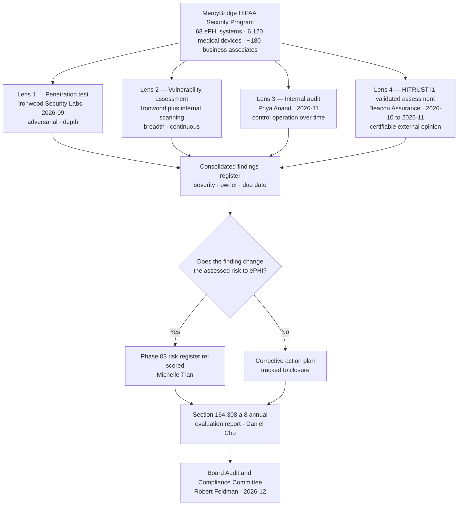

# 08.01 — Independent Assessment Strategy

| Field | Value |
|---|---|
| Document ID | MBH-IAA-STR-2026-801 |
| Version | 1.0 |
| Date | 2026-07-15 |
| Classification | Confidential — Electronic Protected Health Information (ePHI) // Illustrative Portfolio Sample |
| Owner | Daniel Cho, Chief Information Security Officer &amp; HIPAA Security Official |
| Co-Owner | Karen Boyd, Chief Compliance Officer |
| Author | Advisory Team (Healthcare GRC / HIPAA) |
| Status | Approved |

## Purpose

Phases 01 through 07 built the MercyBridge HIPAA Security Program and asserted that it works. Every one of those assertions was made by the people who built it. **Phase 08 exists to have somebody else check.**

This document sets the strategy for independent assessment of the security program: why independent validation is a regulatory obligation rather than a maturity nicety, what the four assessment lenses are and how they differ, what "independent" has to mean before the word carries any weight, and the cadence on which each lens repeats. It governs four workstreams that run between **2026-09** and **2026-11**:

| Workstream | Performed by | Window | Result recorded in |
|---|---|---|---|
| External penetration test | **Ironwood Security Labs, LLC** | 2026-09 | 08.02, 08.03 |
| Vulnerability assessment &amp; remediation | Ironwood Security Labs with Marcus Reed | 2026-09 → 2026-10 | 08.04 |
| Internal audit of the security program | **Priya Anand**, Director of Internal Audit | 2026-11 | 08.05 |
| HITRUST i1 Validated Assessment | **Beacon Assurance, LLC** (Authorized External Assessor) | 2026-10 → 2026-11 | 08.06, 08.07 |

## 1. Why Independent Validation Is Required, Not Optional

Three separate forces converge on the same answer.

**First, the Security Rule itself.** §164.308(a)(8) requires a *"periodic technical and nontechnical evaluation … that establishes the extent to which a covered entity's … security policies and procedures meet the requirements of this subpart."* The standard is **required**, carries no implementation specifications, and — critically — demands a **technical** component. A policy review is not an evaluation. Neither is a self-completed questionnaire. Something has to actually test the configured state of the estate. 04.09 established the evaluation program; Phase 08 supplies the technical half with evidence a third party generated.

**Second, OCR's stated expectation.** OCR's enforcement record and its Audit Protocol both treat *"we assessed ourselves and found ourselves compliant"* as a weak position. The Protocol asks for the evaluation report, the scope, the method, and the corrective actions — and resolution agreements repeatedly cite entities that documented an evaluation with no testing behind it. Independent testing is how MercyBridge answers the question *how do you know?* with something other than an opinion.

**Third, counterparty demand.** Payers, health information exchanges, clinically integrated networks and large employer groups increasingly require **HITRUST certification** as a condition of contract. Unlike a SOC 2 report, HITRUST produces a *certifiable, prescriptive* result against a healthcare-specific control set — and unlike a self-assessment, it is validated by an Authorized External Assessor and reviewed by HITRUST itself.

**Fourth — forward-looking.** The **2025 HIPAA Security Rule NPRM** would remove the addressable/required distinction and **mandate annual penetration testing and annual vulnerability scanning** as express requirements. MercyBridge is building to the in-force rule and layering the proposed requirements as readiness. The cadence in §5 is already built to the proposed standard; if the rule finalises, MercyBridge changes a citation, not a calendar.

## 2. Self-Assertion Versus Independent Evidence

| Claim made in Phases 01–07 | How it was evidenced then | How Phase 08 tests it |
|---|---|---|
| 68 ePHI systems are inventoried and scoped | Inventory maintained by the security team | HITRUST scoping validation; audit sample against procurement and network data |
| MFA and encryption are deployed estate-wide | Configuration extracts self-collected | Pen test attempts authentication bypass; assessor inspects configuration directly |
| Network segmentation separates clinical, device and corporate zones | Firewall rule review | **Internal pen test attempts lateral movement across the boundary** |
| ~180 BAAs contain the §164.314(a) clauses | Contract register self-maintained | Internal Audit samples executed agreements against the register |
| Audit logging is complete across 62 of 68 systems | SIEM onboarding tracker | Assessor tests log generation, review and retention on a sample |
| The incident response plan operates | 3 incidents, 1 tabletop | Internal Audit reads the incident files; HITRUST tests the requirement statements |
| Residual risk is 0 High / 16 Moderate / 40 Low | Internal risk register | Findings from all four lenses are re-scored into the register |

## 3. The Four Lenses

The four assessments are not redundant. Each answers a question the others cannot, and each has a characteristic blind spot the others cover.

| Lens | Question answered | Method | Blind spot | Owner |
|---|---|---|---|---|
| **Penetration test** | *Can an adversary actually reach ePHI?* | Adversarial, goal-oriented, time-boxed exploitation | Only proves what was tested in the window; says nothing about policy, training or contracts | Marcus Reed |
| **Vulnerability assessment** | *What known weaknesses exist across the estate, at breadth?* | Authenticated and unauthenticated scanning of 68 ePHI systems and the device estate | Volume without context; no proof of exploitability or business impact | Marcus Reed |
| **Internal audit** | *Do the controls operate as documented, consistently, over time?* | Sampling, walkthrough, re-performance, inspection of evidence | Not adversarial; will not find an unknown attack path | Priya Anand |
| **HITRUST external assessment** | *Does the program meet a prescriptive, certifiable standard, as judged by an accredited outsider?* | Requirement-by-requirement validation against the i1 control set by an Authorized External Assessor, then HITRUST quality review | Point-in-time; certifies against the HITRUST CSF, **not** against OCR's view of HIPAA | Daniel Cho |

## 4. What Independence Actually Requires

"Independent" is a claim an assessor makes and a covered entity has to be able to defend. MercyBridge applies four tests.

| Independence test | Requirement | How it is met — Ironwood | How it is met — Beacon | How it is met — Internal Audit |
|---|---|---|---|---|
| **Organisational** | The assessor does not report to the assessed function | Third-party firm; contracted through Legal, not Security | HITRUST Authorized External Assessor firm; independent of MercyBridge | Priya Anand reports to the **Audit &amp; Compliance Committee**, not to the CISO or CIO |
| **Self-review** | The assessor did not design, build or operate the controls it assesses | Ironwood has never implemented MercyBridge controls | Beacon performed **no** remediation or implementation work | Internal Audit did not author the 24 policies |
| **Financial / contingent** | No fee arrangement contingent on a favourable outcome | Fixed fee; scope-based; no bonus for a clean report | Fixed fee; HITRUST prohibits contingent arrangements | Salaried; audit committee sets objectives |
| **Reporting line** | Results reach governance without passing through the assessed party's editorial control | Report delivered simultaneously to CISO, Compliance and Internal Audit | Validated results submitted directly to HITRUST | Report issued to the committee; management response appended, not merged |

**The advisory conflict, stated plainly.** The Advisory Team that authored Phases 01–07 is a delivery partner, not an assessor. It performs **no** assessment role in Phase 08, and it does not review, edit or receive advance sight of the Beacon or Internal Audit findings. Where an assessor identifies a defect in work the Advisory Team produced, that finding is recorded verbatim.

## 5. Cadence

| Activity | Frequency | Driver | Next after 2026 |
|---|---|---|---|
| External penetration test (full scope) | **Annual** | §164.308(a)(8) technical evaluation; **2025 NPRM proposed mandate**; HITRUST i1 requirement | 2027-09 |
| Targeted / re-test penetration testing | On material change and after remediation | T-E4 trigger (04.09); remediation verification | Continuous |
| Authenticated vulnerability scanning — ePHI systems | **Monthly**; weekly for internet-facing | **2025 NPRM proposed mandate** (annual minimum; MercyBridge exceeds) | Continuous |
| Passive medical device discovery and vulnerability inference | Continuous | 6,120 device estate; devices cannot tolerate active scanning | Continuous |
| Internal audit of the security program | **Annual** | Audit &amp; Compliance Committee plan | 2027-11 |
| HITRUST i1 Validated Assessment | **Annual** (i1 certification period is **one year**) | Certification maintenance; counterparty requirement | 2027-10 |
| OCR Audit Protocol readiness self-review | Annual, plus on regulatory change | Karen Boyd; T-E6 trigger | 2027 Q3 |
| §164.308(a)(8) consolidated evaluation report | Annual (Q4) | The standard itself | 2027-12 |

**Sequencing matters.** The penetration test runs **first** (2026-09) so that findings can be remediated and re-tested **before** HITRUST fieldwork opens in 2026-10 — an open High-severity finding is an avoidable HITRUST corrective action plan. Internal Audit runs **last** (2026-11) so it can independently examine how the organisation *responded* to the two external assessments, which is a better test of the program than examining the controls in isolation.

## 6. Scope Boundaries

| In scope | Out of scope | Rationale |
|---|---|---|
| All **68 ePHI systems** | The 142 non-ePHI systems, except where they provide a network path to ePHI | Security Rule scope is ePHI; adjacency is tested, not the system itself |
| The **6,120 networked medical devices**, tested **passively only** | Active exploitation or fuzzing of any device in clinical use | Patient safety — see 08.02 §5 |
| Patient portal, HIE interfaces, external perimeter | Third-party-hosted infrastructure operated by business associates | Governed by BAA and vendor assurance (Phase 06); Halcyon SOC 2 Type II relied upon |
| Social engineering against the workforce (~6,500) | Any pretext invoking a clinical emergency, patient harm or a code call | Prohibited pretext class — 08.02 §5 |
| Wireless across 4 hospitals and a sample of ~30 clinics | Denial-of-service, load or stress testing | Availability of clinical systems is a patient-safety control |
| Administrative, physical and technical safeguard operation | Privacy Rule (Subpart E) compliance beyond ePHI security | Rebecca Stern owns; assessed on a separate cycle |

## 7. Governance and Escalation

| Event during any assessment | Action | Authority |
|---|---|---|
| Assessor discovers evidence of an **actual or suspected compromise** | Testing stops; the finding is handed to the CSIRT and enters the 07.02 incident lifecycle immediately | Daniel Cho |
| Assessor discovers ePHI exposed to an unauthorised party | Immediate notification within **1 hour**; four-factor assessment under 07.06 opens | Rebecca Stern |
| Testing causes or risks clinical impact | Immediate stop condition; see 08.02 §6 | Any party — no approval needed to stop |
| A finding is disputed by management | Recorded as disputed with both positions stated; escalated to the Audit &amp; Compliance Committee | Robert Feldman |
| A High finding cannot be remediated before HITRUST fieldwork | Documented compensating control and dated plan submitted into the assessment | Daniel Cho |

## 8. Success Criteria for Phase 08

| Criterion | Target | Actual (recorded in) |
|---|---|---|
| Penetration test completed with a written report | Yes | **16 findings** — 08.03 |
| High-severity penetration findings remediated and re-tested | 100% | **3 of 3 remediated and re-tested** — 08.04 |
| All penetration findings closed | 100% | **16 of 16 remediated** — 08.04 |
| Vulnerability scanning coverage of ePHI systems | ≥ 95% authenticated | 08.04 |
| Internal audit opinion | No worse than Satisfactory | **Satisfactory** — 08.05 |
| HITRUST i1 outcome | Certified | **i1 Validated Assessment achieved** — 08.07 |
| Findings fed into the risk register | 100% | 08.09 / Phase 09 |
| OCR Audit Protocol readiness | Complete | 08.08 |

## Cross-References

| Reference | Relevance |
|---|---|
| 01.04 — HIPAA Security Rule Overview | The 18 standards the assessments baseline against |
| 02.02 — ePHI System Inventory | The 68 systems and 6,120 devices defining assessment scope |
| 03.07 — Risk Register | Where every Phase 08 finding is re-scored |
| 04.09 — Evaluation | §164.308(a)(8); this phase supplies its technical half |
| 04.11 — Policies, Procedures &amp; Documentation | Change control for remediation-driven policy updates |
| 06.04 — Vendor Security Assessment | Why BA-hosted infrastructure sits outside pen test scope |
| 07.02 — Incident Response Plan | The lifecycle an assessment discovery escalates into |
| 07.12 — Phase Summary &amp; Transition | The claims handed over for independent testing |
| 08.02 — Penetration Test Scope &amp; Rules of Engagement | Lens 1 scope and safety constraints |
| 08.05 — Internal Audit of the Security Program | Lens 3 |
| 08.06 — HITRUST CSF Assessment Approach | Lens 4 method |
| 08.08 — OCR Audit Protocol Readiness | The regulator-facing consolidation of all four lenses |

---
[⬅ Previous](08.00-README.md) · [🏠 Phase README](08.00-README.md) · [Next ➡](08.02-penetration-test-scope-and-rules.md)
