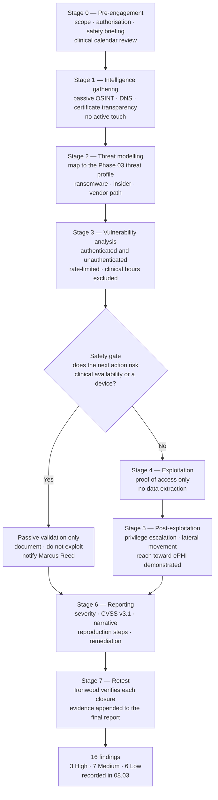

# 08.02 — Penetration Test Scope &amp; Rules of Engagement

| Field | Value |
|---|---|
| Document ID | MBH-IAA-PTS-2026-802 |
| Version | 1.0 |
| Date | 2026-07-15 |
| Classification | Confidential — Electronic Protected Health Information (ePHI) // Illustrative Portfolio Sample |
| Owner | Marcus Reed, Information Security Manager |
| Co-Owner | Daniel Cho, Chief Information Security Officer &amp; HIPAA Security Official |
| Author | Advisory Team (Healthcare GRC / HIPAA) |
| Status | Approved |

## Purpose

This document is the **scope statement and rules of engagement** for the independent penetration test performed against MercyBridge Health Network by **Ironwood Security Labs, LLC** in **2026-09**. It defines what Ironwood is authorised to test, what it is forbidden to test, the methodology it must follow, the authorisation under which it operates, and — the section that matters most in a hospital — **the safety constraints that keep an offensive security engagement from becoming a patient-safety event.**

A penetration test in a health system is not the same exercise as a penetration test in a bank. A bank's worst case is a frozen transaction. MercyBridge's worst case is an infusion pump that stops responding, a PACS study that fails to load during a stroke workup, or a nurse who follows a social-engineering pretext because it invoked a code call. **The rules of engagement in §5 and §6 are therefore not administrative boilerplate; they are the controlling document, and they override scope in every case of conflict.**

## 1. Engagement Summary

| Attribute | Value |
|---|---|
| Assessor | Ironwood Security Labs, LLC — independent, no prior implementation role at MercyBridge |
| Engagement reference | IWSL-MBH-2026-PT01 |
| Test window | **2026-09-07 → 2026-09-25** (15 business days), plus a re-test window in 2026-10 |
| Test type | **Grey-box** — network diagrams and an ePHI system list provided; no credentials except where explicitly issued for authenticated testing |
| Methodology | **PTES**, **OWASP WSTG / ASVS**, **NIST SP 800-115** |
| Reporting | Draft report 2026-09-30; final report with retest evidence 2026-10-16 |
| Authorising officer | Daniel Cho, CISO &amp; HIPAA Security Official |
| MercyBridge technical point of contact | Marcus Reed, Information Security Manager |
| Clinical safety point of contact | Dr. Samuel Ortega, CMIO (with Clinical Engineering duty lead) |
| Data handling | No ePHI extracted; proof of access recorded as record counts and redacted field names only |

## 2. Scope — Six Test Domains

| # | Domain | What is in scope | Depth | Constraint |
|---|---|---|---|---|
| **D1** | **External perimeter** | All internet-facing IP ranges, VPN concentrators, remote-access gateways, MFT endpoints, MX and DNS estate | Full exploitation permitted | No DoS; no destructive payloads |
| **D2** | **Internal network** | Assumed-breach position on a standard clinical workstation VLAN; Active Directory; lateral movement toward the 68 ePHI systems | Full exploitation; **privilege escalation permitted** | Segmentation boundaries may be *probed*; devices behind them are passive-only |
| **D3** | **Web applications &amp; patient portal** | Patient portal, provider portal, scheduling, bill-pay, public web estate, HIE-facing APIs | Full OWASP WSTG; authenticated with **synthetic test patient accounts only** | **No real patient accounts**; no mass enumeration |
| **D4** | **Wireless** | Corporate, guest, clinical and biomedical SSIDs across 4 hospitals and 6 sampled clinic sites | Rogue AP detection, PSK/802.1X attack, VLAN escape attempts | No deauthentication attacks in clinical areas |
| **D5** | **Social engineering** | Phishing and vishing against a sampled population of the ~6,500 workforce; physical tailgating at 2 sites | Credential capture; payload simulation | **Prohibited pretext classes — §5.3** |
| **D6** | **Medical device segment** | The IoMT / biomedical VLANs supporting the **6,120 networked medical devices** | **PASSIVE ONLY** — see §5.1 | No active scanning, no exploitation, no traffic injection |

### 2.1 Explicitly Out of Scope

| Excluded | Reason |
|---|---|
| Any denial-of-service, load, stress or resource-exhaustion test | Availability of clinical systems is itself a patient-safety control |
| Exploitation of any device with a patient physically connected to it | Absolute prohibition |
| Halcyon EHR vendor-hosted infrastructure | Business associate estate; governed by BAA and SOC 2 Type II (Phase 06) |
| Third-party hosted payment processing | PCI scope; assessed separately by the acquirer's programme |
| Ransomware simulation, encryption of any data, or destructive payloads | Prohibited outright |
| Physical intrusion into secure clinical areas (OR, NICU, ED resus, pharmacy vault, imaging suites) | Physical safeguard testing performed by walkthrough (Phase 05) |
| Any test against a system during a declared clinical downtime or HICS activation | Stop condition — §6 |

## 3. Methodology

Ironwood executes a seven-stage methodology aligned to **PTES** with technique selection from **NIST SP 800-115** and web coverage from the **OWASP Web Security Testing Guide**.

| Stage | NIST SP 800-115 phase | Clinical adaptation at MercyBridge |
|---|---|---|
| 0–1 | Planning / Discovery | Test calendar cross-checked against OR schedules, go-lives and month-end billing close |
| 2–3 | Discovery | Scan rate limits set below thresholds known to destabilise legacy HL7 interfaces |
| 4–5 | Attack | Exploitation of clinical systems only in **non-production replicas** or approved maintenance windows |
| 6 | Reporting | Severity weighted by **clinical consequence**, not only CVSS base score |
| 7 | Retest | Required for every finding before closure; High findings retested first |

## 4. Authorisation

| Element | Detail |
|---|---|
| Written authorisation | Signed engagement letter and "letter of authorisation to test" issued **2026-08-28** by Daniel Cho as HIPAA Security Official |
| Legal review | Lisa Coleman, General Counsel — Computer Fraud and Abuse Act and state computer-crime safe harbour language included |
| Contract instrument | Master services agreement plus **executed Business Associate Agreement** — Ironwood may incidentally encounter ePHI and is therefore a business associate under §160.103 |
| Insurance | Professional liability and cyber liability certificates on file with Legal |
| Testing personnel | 5 named testers, each background-checked, each individually named in the authorisation letter; substitutions require written approval |
| Source IP registration | All Ironwood source addresses registered with the SOC and with the ISP; carried in the "get out of jail" letter each tester holds |
| Approvals recorded | Daniel Cho (CISO), Anthony Ruiz (CIO), Dr. Samuel Ortega (CMIO — clinical safety), Lisa Coleman (General Counsel), Robert Feldman (noted at committee) |
| Notified but not detailed | SOC leadership notified of the window only; **detection efficacy is itself under test**, so tier-1 analysts were not informed |

## 5. Healthcare Safety Constraints — The Controlling Section

### 5.1 Medical devices — passive only

The **6,120 networked medical devices** include infusion pumps, ventilators, physiologic monitors, imaging modalities, anaesthesia machines, dialysis units and laboratory analysers. Many run unsupported embedded operating systems that cannot be patched without vendor and, in some cases, **FDA change-control** involvement. A substantial minority will fault, reboot or drop network state in response to an ordinary TCP port scan.

| Permitted against the device estate | Forbidden against the device estate |
|---|---|
| Passive network traffic capture and protocol analysis (SPAN/TAP) | Active port scanning, service fingerprinting or version probing |
| Passive asset identification from broadcast and DICOM/HL7 traffic | Credential attacks against device management interfaces |
| Review of device VLAN ACLs and routing configuration from network device configs | Any exploitation, fuzzing or traffic injection |
| Attempts to **reach** the device VLAN from elsewhere, stopping at first successful reachability proof | Interaction with any reached device beyond an ICMP/TCP reachability proof |
| Review of device vendor remote-access paths | Use of a device vendor remote-access path to touch a device |

**The reachability rule.** Where Ironwood demonstrates that a device segment is reachable from a network it should not be reachable from, the finding is *the reachability itself*. Testing stops at the boundary. Finding **PT-01** in 08.03 was recorded under exactly this rule.

### 5.2 Clinical systems — non-production or maintenance windows

| System class | Where tested | Window |
|---|---|---|
| Halcyon EHR interfaces (MercyBridge-side) | **Non-production replica** with synthetic data | Any time |
| PACS / imaging | Non-production replica; production **read-only reconnaissance** only | Any time (replica) |
| LIS, pharmacy, blood bank | Non-production replica only | Any time |
| Patient portal | Production, **synthetic test patients only** | 22:00–05:00 local |
| Clinical messaging | Non-production replica | Any time |
| Corporate / infrastructure / AD | Production | Business hours permitted |
| External perimeter | Production | 20:00–06:00 local for anything intrusive |

### 5.3 Social engineering — prohibited pretexts

Phishing and vishing are in scope because credential compromise is the dominant real-world entry vector (07.10 recorded a mailbox compromise incident). But a pretext that manipulates clinical urgency can cause a clinician to divert attention from a patient. The following are **forbidden**:

| Prohibited pretext class | Example |
|---|---|
| Clinical emergency | Code blue, rapid response, mass-casualty, trauma activation |
| Patient harm or safety | "A patient has been given the wrong medication, confirm now" |
| Regulatory or licensure threat | Impersonating a state board, OCR, or a licensure body |
| Individual employment threat | Termination, disciplinary action, payroll suspension |
| Impersonation of a named clinician in a care context | Any pretext that could alter a clinical decision |
| Physical safety | Fire, evacuation, active threat |
| Family or personal emergency | Any pretext referencing a tester's target's family |

**Permitted pretexts** are administrative and non-urgent: IT password expiry, benefits enrolment, an expense system migration, a parking or badge notice, a training deadline. All phishing infrastructure uses Ironwood-controlled domains, captures **no** credentials in plaintext (submission is intercepted and discarded), and immediately redirects to a MercyBridge awareness page.

## 6. Stop Conditions

**Any person may invoke a stop. No approval is required to stop. Restart requires written approval from Daniel Cho and, where clinical systems are involved, Dr. Samuel Ortega.**

| # | Stop condition | Immediate action | Notification |
|---|---|---|---|
| SC-1 | Any clinical system becomes slow, unstable or unavailable | All testing halts network-wide | Marcus Reed + CMIO within 15 minutes |
| SC-2 | Any medical device faults, alarms, reboots or drops from the network | Halt; Clinical Engineering paged | Within 15 minutes; device quarantined for review |
| SC-3 | A clinical downtime or HICS activation is declared for any reason | Halt for the duration | Automatic |
| SC-4 | Ironwood encounters evidence of a **pre-existing compromise** | Halt; preserve; hand to CSIRT under 07.02 | Within **1 hour** — Daniel Cho |
| SC-5 | Ironwood inadvertently accesses real ePHI | Halt on that path; record counts only; no copy retained | Within **1 hour** — Rebecca Stern; 07.06 assessment opens |
| SC-6 | Testing triggers a page to on-call clinical or IT staff | Pause; confirm cause; resume only after confirmation | Marcus Reed |
| SC-7 | A finding is critical enough that delay is unreasonable | Out-of-band **immediate disclosure** ahead of the report | Within **4 hours** — Daniel Cho |
| SC-8 | An unplanned mass-casualty or surge event affects any facility | Halt for the duration | Automatic |

**SC-2 was invoked once** during the engagement, on 2026-09-16, when a legacy telemetry gateway on a sampled clinic wireless segment dropped its association during 802.1X testing. Testing halted for 4 hours; Clinical Engineering confirmed no patient-connected device was affected; the gateway behaviour became finding **PT-13**.

## 7. Deconfliction and Detection Testing

| Aspect | Approach |
|---|---|
| SOC awareness | Leadership aware of the window; **analysts not informed** — detection and response is under test |
| Deconfliction protocol | Marcus Reed holds the tester IP list; on any SOC escalation he confirms "test traffic" within 30 minutes without disclosing the technique |
| Blue-team scoring | Detection, escalation and containment times for each Ironwood action are recorded and reported alongside the findings |
| Purple-team session | Held 2026-10-02 — Ironwood walks the SOC through every action, detected and undetected |
| Detection outcome | 11 of 23 significant tester actions detected; 6 escalated; **median detect-to-escalate 41 minutes** — carried as a detection improvement item into 08.04 |

## 8. Deliverables

| Deliverable | Due | Recipient |
|---|---|---|
| Signed rules of engagement and authorisation letter | 2026-08-28 | Legal, CISO, Ironwood |
| Daily status note during the window | Daily 17:00 | Marcus Reed |
| Out-of-band critical disclosure (if any) | Within 4 hours of discovery | Daniel Cho |
| Draft findings report | 2026-09-30 | Daniel Cho, Karen Boyd, Priya Anand |
| Management response and remediation plan | 2026-10-07 | Marcus Reed |
| Final report with retest evidence | 2026-10-16 | CISO, Compliance, Internal Audit, Beacon Assurance |
| Purple-team detection debrief | 2026-10-02 | SOC, Marcus Reed |
| Attestation letter for HITRUST and payer due diligence | 2026-10-16 | Daniel Cho |

**Retention.** The rules of engagement, authorisation letter, full technical report, retest evidence and management response are retained for **six years** under §164.316(b)(2)(i).

## Cross-References

| Reference | Relevance |
|---|---|
| 02.02 — ePHI System Inventory | The 68 systems and 6,120 devices defining D1–D6 |
| 02.06 — Medical Device &amp; IoMT Inventory | The device estate governed by the passive-only rule |
| 03.06 — Ransomware &amp; Healthcare Threat Profile | The threat model Stage 2 maps against |
| 04.09 — Evaluation | §164.308(a)(8) technical evaluation this test satisfies |
| 05.04 — Transmission Security | Segmentation assumptions tested in D2 and D6 |
| 06.03 — Business Associate Agreements | Ironwood's own BAA; vendor remote-access paths tested |
| 07.02 — Incident Response Plan | The lifecycle SC-4 and SC-5 escalate into |
| 08.01 — Independent Assessment Strategy | Lens 1 of four; independence basis |
| 08.03 — Penetration Test Results | The 16 findings produced under this scope |
| 08.04 — Vulnerability Assessment &amp; Remediation | Retest and closure of every finding |
| 08.06 — HITRUST CSF Assessment Approach | Why the test precedes HITRUST fieldwork |

---
[⬅ Previous](08.01-independent-assessment-strategy.md) · [🏠 Phase README](08.00-README.md) · [Next ➡](08.03-penetration-test-results.md)
