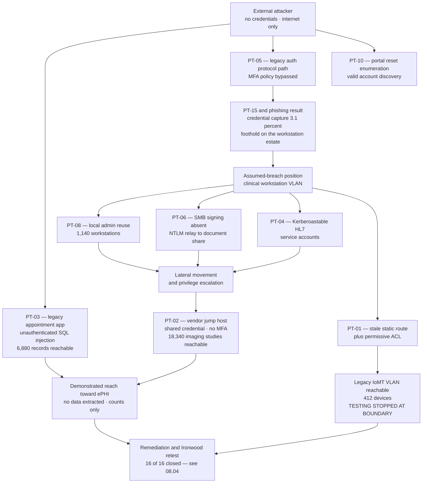

# 08.03 — Penetration Test Results

| Field | Value |
|---|---|
| Document ID | MBH-IAA-PTR-2026-803 |
| Version | 1.0 |
| Date | 2026-07-15 |
| Classification | Confidential — Electronic Protected Health Information (ePHI) // Illustrative Portfolio Sample |
| Owner | Marcus Reed, Information Security Manager |
| Co-Owner | Daniel Cho, Chief Information Security Officer &amp; HIPAA Security Official |
| Author | Advisory Team (Healthcare GRC / HIPAA) |
| Status | Approved |

## Purpose

This document records the results of the independent penetration test performed against MercyBridge Health Network by **Ironwood Security Labs, LLC** between **2026-09-07 and 2026-09-25** under the scope and rules of engagement set in 08.02.

The headline result:

> **16 findings — 3 High, 7 Medium, 6 Low. All 16 remediated and re-tested by Ironwood. Zero Critical findings. No real ePHI was extracted at any point in the engagement.**

Three things are worth saying before the table. **First**, the test found real problems. A grey-box adversarial test against 68 ePHI systems, 6,120 medical devices and a 4-hospital estate that produced no High findings would be a test scoped to succeed, not a test. **Second**, none of the three High findings was a novel technique; each was a **configuration or lifecycle failure** — a route that should not exist, a shared credential that should have been retired, an application that should have been decommissioned in 2023. That is the ordinary shape of healthcare compromise. **Third**, the most important sentence in the report is not a finding at all: Ironwood demonstrated that the **segmentation between the clinical workstation estate and the legacy medical device VLAN was not the boundary MercyBridge believed it to be** — and the belief, not the route, was the underlying defect.

## 1. Results Summary

| Severity | Count | Definition applied | Remediation SLA | Status |
|---|---|---|---|---|
| Critical | **0** | Direct unauthenticated access to ePHI at scale, or capability to disrupt patient care | 24 hours | — |
| **High** | **3** | Realistic path to ePHI or to a clinically significant system, requiring limited preconditions | **30 days** | **3 of 3 remediated and re-tested** |
| **Medium** | **7** | Meaningful weakening of a safeguard; exploitation requires chaining or privileged position | **90 days** | **7 of 7 remediated and re-tested** |
| **Low** | **6** | Hygiene, information disclosure, or defence-in-depth gap | **180 days** | **6 of 6 remediated and re-tested** |
| **Total** | **16** | — | — | **16 of 16 closed** |

| Domain (08.02) | High | Medium | Low | Total |
|---|---|---|---|---|
| D1 — External perimeter | 1 | 2 | 1 | 4 |
| D2 — Internal network | 1 | 3 | 2 | 6 |
| D3 — Web applications &amp; patient portal | 1 | 1 | 1 | 3 |
| D4 — Wireless | 0 | 1 | 1 | 2 |
| D5 — Social engineering | 0 | 0 | 1 | 1 |
| D6 — Medical device segment (passive) | 0 | 0 | 0 | 0 |
| **Total** | **3** | **7** | **6** | **16** |

**D6 produced no findings of its own** because it was tested passively. The device-segment exposure surfaced as **PT-01**, which is a *network* finding about reachability, not a *device* finding. This is the correct place for it to sit.

## 2. The Findings Register

| ID | Title | Severity | Affected area | CVSS v3.1 | Status |
|---|---|---|---|---|---|
| **PT-01** | Legacy medical device VLAN reachable from the clinical workstation subnet via a misconfigured static route and permissive inter-VLAN ACL | **High** | D2 — Internal network / IoMT boundary | **8.6** | **Remediated — retested 2026-10-09** |
| **PT-02** | Imaging-modality vendor remote-support path using a shared local credential without MFA or session recording | **High** | D2 — Internal network / vendor access | **8.8** | **Remediated — retested 2026-10-13** |
| **PT-03** | Internet-facing legacy appointment-request web application on the patient-facing perimeter with unauthenticated SQL injection | **High** | D1 / D3 — Perimeter web | **8.2** | **Remediated (decommissioned) — retested 2026-10-06** |
| PT-04 | Kerberoastable service accounts supporting HL7 interface engines with passwords below policy length | Medium | D2 — Active Directory | 6.5 | Remediated — retested 2026-11-04 |
| PT-05 | Legacy authentication protocol permitted on one mail access path, bypassing the enforced MFA policy | Medium | D1 — Perimeter / identity | 6.8 | Remediated — retested 2026-10-21 |
| PT-06 | SMB signing not enforced on 340 internal hosts, enabling NTLM relay to a file service holding scanned clinical documents | Medium | D2 — Internal network | 6.5 | Remediated — retested 2026-11-11 |
| PT-07 | Deprecated TLS ciphers and missing certificate pinning on two externally reachable HL7/MFT endpoints | Medium | D1 — Perimeter | 5.9 | Remediated — retested 2026-10-21 |
| PT-08 | Local administrator credential reuse across 1,140 clinical workstations built from a legacy image | Medium | D2 — Endpoint estate | 6.7 | Remediated — retested 2026-11-18 |
| PT-09 | Biomedical wireless SSID using a static WPA2 pre-shared key with no rotation since 2021 and no client isolation | Medium | D4 — Wireless | 6.1 | Remediated — retested 2026-11-18 |
| PT-10 | Patient portal password-reset flow permits account enumeration and lacks progressive lockout | Medium | D3 — Patient portal | 5.3 | Remediated — retested 2026-10-28 |
| PT-11 | Verbose application error messages disclosing framework version and internal hostnames on the provider portal | Low | D3 — Web | 4.3 | Remediated — retested 2026-11-25 |
| PT-12 | Missing HSTS, CSP and X-Content-Type-Options headers across nine public web properties | Low | D1 — Perimeter web | 3.7 | Remediated — retested 2026-11-25 |
| PT-13 | Legacy telemetry gateway on a clinic segment exposes an unauthenticated HTTP management interface and drops 802.1X association under re-authentication | Low | D4 — Wireless / clinic edge | 4.6 | Remediated — retested 2026-12-02 |
| PT-14 | Internal DNS permits zone transfer from the clinical workstation subnet, disclosing the ePHI system naming scheme | Low | D2 — Internal network | 4.3 | Remediated — retested 2026-11-25 |
| PT-15 | Physical tailgating successful at one of two sampled administrative entrances; two unattended unlocked workstations observed | Low | D5 — Social engineering / physical | 4.0 | Remediated — retested 2026-12-02 |
| PT-16 | Multifunction devices in three clinical departments retain default SNMP community strings and expose a scanned-document job list | Low | D2 — Peripheral estate | 4.1 | Remediated — retested 2026-12-02 |

## 3. High Finding Narratives

### PT-01 — The device VLAN was not behind the boundary

**What Ironwood did.** From the assumed-breach position on a standard clinical workstation VLAN (D2), Ironwood enumerated the routing table advertised to the local gateway and found a **static route left in place from a 2019 biomedical monitoring rollout**, pointing at the legacy IoMT VLAN. The inter-VLAN ACL intended to block that path contained a permissive `any/any` rule at position 4, above the deny, added during a 2024 change to troubleshoot a telemetry outage and never removed.

**What that meant.** A workstation in a general medical-surgical unit — reachable by any user who could authenticate to that VLAN, and by any malware landing on any of ~1,140 endpoints — had **unfiltered layer-3 reachability to 412 legacy networked devices**, including patient monitors and infusion pump gateways.

**Where testing stopped.** Under the passive-only rule (08.02 §5.1), Ironwood proved reachability with ICMP and a single TCP connect to one non-patient-connected device in a biomedical staging rack, then **stopped**. No device in clinical use was contacted. No exploitation was attempted. The finding is the reachability.

**Why it rated High and not Critical.** No ePHI was directly obtainable from the reached segment, and no patient-connected device was touched. Ironwood and MercyBridge jointly rated it High with the note that **the clinical-consequence rating exceeds the ePHI-confidentiality rating** — this is a patient-safety exposure first and a HIPAA exposure second, which is exactly why the Security Rule's availability and integrity objectives matter as much as confidentiality.

**Root cause.** Change-management failure. Neither the 2019 route nor the 2024 ACL rule had an expiry, an owner or a review. Segmentation was assumed to be a state; it is a process.

### PT-02 — One password, eleven modalities, no record of who used it

**What Ironwood did.** From the same internal position, Ironwood identified a vendor support jump host serving the imaging modality fleet. The host authenticated **eleven** modality service consoles using a **single shared local account** (`svc-modality-support`) whose password was stored in a plaintext connection profile on the jump host itself and had not changed since **2022-03**. The account was excluded from the enterprise MFA policy under a documented 2022 exception granted "pending vendor support for federated authentication" — the exception had no expiry and had never been reviewed.

**What Ironwood could reach.** Using the recovered credential, Ironwood authenticated to the modality management plane and reached a DICOM query/retrieve interface. Ironwood **enumerated study counts only** — 18,340 studies visible — and **retrieved nothing**. Per the rules of engagement, proof of access was recorded as a redacted screenshot of a study-count field with all patient identifiers masked at capture.

**Why this is the classic healthcare finding.** Vendor remote access is the least-governed privileged path in most health systems. It is granted for uptime, exempted from identity controls "because the vendor cannot support them", shared across engineers, and never recorded. The 2025 NPRM's proposed **mandatory MFA** requirement would eliminate the exception route that made this possible.

**Breach analysis.** Ironwood is a **business associate** under an executed BAA (08.02 §4). Access to ePHI-adjacent systems by a BA acting within the scope of its agreement is a **permitted disclosure**, not an impermissible one. Rebecca Stern nonetheless opened a §164.402 screening record on 2026-09-18; it concluded at Gate 1 that no impermissible use or disclosure occurred and therefore **no four-factor assessment was required**. The record is retained.

### PT-03 — An application nobody owned, on the internet, since 2018

**What Ironwood did.** External reconnaissance (D1) identified `appointments-legacy.mercybridge.example` — a **2018-era appointment-request form** superseded by the patient portal in 2023 but never decommissioned. The DNS record, the load-balancer VIP and the web server all survived the migration. The application ran an unsupported framework and contained an **unauthenticated, error-based SQL injection** in the referring-provider lookup parameter.

**What Ironwood could reach.** The injection yielded read access to the application's own database, which contained **6,880 historical appointment-request records** with name, date of birth, contact details, referring provider and free-text reason-for-visit — **unambiguously ePHI**. Ironwood extracted **no records**, evidenced the finding with a `COUNT(*)` result and a single fully redacted column-name listing, and invoked **stop condition SC-7**: out-of-band disclosure to Daniel Cho within **2 hours 40 minutes** of discovery on **2026-09-11**.

**Immediate action.** The hostname was null-routed the same evening. The application was formally decommissioned, the database exported to encrypted archival storage under legal hold, and the source host wiped under NIST SP 800-88 procedures on 2026-09-19.

**Root cause.** Asset-inventory failure. The application appeared in **no** ePHI inventory, had no system owner, no BAA dependency, no patching path and no logging. The 68-system ePHI inventory was correct about the systems it contained; it was incomplete. The **2025 NPRM's proposed mandatory asset inventory** requirement addresses precisely this class of failure, and the inventory process was amended in 08.04 §7 to reconcile against DNS, certificate transparency and external attack-surface data quarterly.

**Why not Critical.** The exposed population (6,880 records) is a small fraction of the 2.1 million patient records, the data was historical, and there was no evidence of prior exploitation — Ironwood and the SOC jointly reviewed 14 months of retained web and WAF logs and found no indicator of prior access. Had prior access been evidenced, this becomes an incident and a probable reportable breach, not a finding.

## 4. Attack Chain

## 5. What the Test Could **Not** Reach

An honest results document states the negative findings as clearly as the positive ones.

| Target | Outcome | Why it held |
|---|---|---|
| **Halcyon EHR** production application | **Not compromised** | MFA enforced without exception; no session-handling or authorisation defects found; vendor-hosted tier out of scope but MercyBridge-side interfaces tested clean |
| ePHI **encryption at rest** | **Not defeated** | 68 of 68 systems encrypted; no plaintext ePHI recovered from any reached storage |
| Domain Administrator | **Not obtained** | Tiered administration model held; no path from workstation tier to tier-0 identified in the window |
| Backup and immutable copies | **Not reached or altered** | Backup network isolated; immutable copies not writable from any position achieved |
| Any **patient-connected medical device** | **Not contacted** | Passive-only rule held; SC-2 invoked once and honoured |
| Physical intrusion into clinical areas | **Not achieved** | Badge and escort controls held at both sampled sites; the one success was an administrative corridor |
| Ransomware-equivalent impact | **Not simulated** | Out of scope by design; assessed by tabletop instead (07.09) |

## 6. Detection Performance

| Measure | Result | Target | Assessment |
|---|---|---|---|
| Significant tester actions performed | 23 | — | — |
| Actions detected by tooling | **11 (48%)** | ≥ 70% | Below target — improvement item D-11 |
| Detections escalated by the SOC | 6 of 11 | 100% of true positives | Below target — triage tuning required |
| Median detect → escalate | **41 minutes** | ≤ 30 minutes | Below target |
| PT-03 external exploitation detected | **No** | Yes | WAF in monitor-only mode on the orphaned host |
| PT-02 vendor credential use detected | **No** | Yes | Jump host not forwarding to the SIEM — one of the 6 of 68 gaps (D-3) |
| PT-01 cross-VLAN traffic detected | **Yes**, 12 minutes | ≤ 15 minutes | Met |
| Phishing reported by workforce | 22.4% report rate | ≥ 20% | Met |

Detection performance is a finding in its own right and is carried into 08.04 as improvement items **D-11 through D-14**. The 48% detection rate is consistent with the known **6 of 68** SIEM ingestion gap carried forward from 07.12 (item D-3).

## 7. Regulatory Mapping

| Finding | Security Rule provision engaged | 2025 NPRM proposed provision |
|---|---|---|
| PT-01 | §164.312(a)(1) access control; §164.308(a)(1)(ii)(B) risk management | **Mandatory network segmentation** |
| PT-02 | §164.312(d) person or entity authentication; §164.308(a)(4) access management; §164.314(a) BA controls | **Mandatory MFA** |
| PT-03 | §164.308(a)(1)(ii)(A) risk analysis (asset scope); §164.312(a)(1) | **Mandatory asset inventory**; **annual vulnerability scanning** |
| PT-04, PT-08 | §164.308(a)(5)(ii)(D) password management; §164.312(d) | Removal of addressable/required distinction |
| PT-05, PT-07 | §164.312(e)(1) transmission security; §164.312(d) | **Mandatory MFA and encryption in transit** |
| PT-06, PT-14, PT-16 | §164.312(a)(1); §164.308(a)(1)(ii)(B) | Segmentation; asset inventory |
| PT-09, PT-13 | §164.312(e)(1); §164.310(d)(1) | Encryption in transit |
| PT-10, PT-11, PT-12 | §164.312(a)(1); §164.308(a)(1)(ii)(B) | Annual penetration testing |
| PT-15 | §164.310(a)(1) facility access; §164.310(b)/(c) workstation controls | — |
| Detection gaps | §164.312(b) audit controls; §164.308(a)(1)(ii)(D) information system activity review | Annual penetration testing and scanning |

## 8. Conclusions Drawn

1. **The perimeter held; the inventory did not.** Every High finding traces to something the organisation did not know it still had, or did not know was still reachable. Controls were not absent — they were applied to an incomplete picture of the estate.
2. **Exceptions outlive their justification.** PT-02's MFA exemption, PT-01's ACL rule and PT-03's DNS record all had a legitimate origin and no expiry date. All three remediations include a **mandatory expiry and review** on the exception class, not just the instance.
3. **Vendor access is the weakest privileged path.** This finding is consistent with the Phase 06 conclusion about the ~180 business associate estate, and it now has adversarial evidence behind it.
4. **Segmentation must be tested, not asserted.** MercyBridge had segmentation documentation, firewall rules and a design. It did not have proof. It does now, and quarterly purple-team validation of the device boundary is added to the assurance calendar.
5. **Detection is the weakest capability.** 48% detection is a worse result than 16 findings, because findings are fixed once and detection is needed every day.

## Cross-References

| Reference | Relevance |
|---|---|
| 02.02 — ePHI System Inventory | The inventory gap PT-03 exposed |
| 02.06 — Medical Device &amp; IoMT Inventory | The 412 devices behind the PT-01 boundary |
| 03.07 — Risk Register | Where PT-01, PT-02 and PT-03 are re-scored |
| 05.02 — Access Control | §164.312(a)(1) provisions engaged by PT-01 and PT-06 |
| 05.06 — Audit Controls | The §164.312(b) basis for the detection findings |
| 06.05 — Vendor Remote Access | The control PT-02 disproved |
| 07.06 — Breach Risk Assessment — Four Factor | The Gate 1 screening record opened for PT-02 |
| 08.02 — Penetration Test Scope &amp; Rules of Engagement | The scope and safety rules this test ran under |
| 08.04 — Vulnerability Assessment &amp; Remediation | Remediation and Ironwood retest of all 16 findings |
| 08.05 — Internal Audit of the Security Program | Independent review of the response to these findings |
| 08.07 — HITRUST i1 Assessment Results | How closure evidence supported the i1 result |

---
[⬅ Previous](08.02-penetration-test-scope-and-rules.md) · [🏠 Phase README](08.00-README.md) · [Next ➡](08.04-vulnerability-assessment-and-remediation.md)
