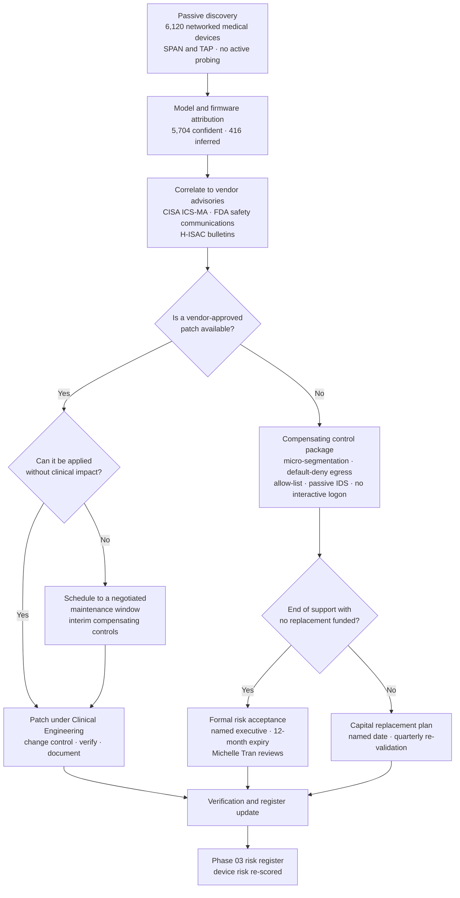

# 08.04 — Vulnerability Assessment &amp; Remediation

| Field | Value |
|---|---|
| Document ID | MBH-IAA-VUL-2026-804 |
| Version | 1.0 |
| Date | 2026-07-15 |
| Classification | Confidential — Electronic Protected Health Information (ePHI) // Illustrative Portfolio Sample |
| Owner | Marcus Reed, Information Security Manager |
| Co-Owner | Anthony Ruiz, Chief Information Officer |
| Author | Advisory Team (Healthcare GRC / HIPAA) |
| Status | Approved |

## Purpose

A penetration test proves *depth* — that one path exists. A vulnerability assessment proves *breadth* — what is wrong across the whole estate, everywhere, repeatedly. §164.308(a)(1)(ii)(B) requires MercyBridge to *"implement security measures sufficient to reduce risks and vulnerabilities to a reasonable and appropriate level"*, and §164.308(a)(5)(ii)(B) requires **protection from malicious software**. Neither is satisfiable without knowing what is unpatched.

This document records the **vulnerability assessment programme** operated across the **68 ePHI systems** and the **6,120 networked medical devices**, the **remediation and Ironwood re-test of all 16 penetration test findings** from 08.03, the remediation SLA model, and the compensating-control discipline that healthcare requires because **a large part of a hospital's attack surface cannot be patched on the security team's timetable — or at all.**

**2025 NPRM.** The proposed rule would make **vulnerability scanning at least every six months and penetration testing at least annually** express, non-addressable requirements. MercyBridge already scans monthly (weekly for internet-facing) and tests annually, so finalisation changes the citation and not the operation. That margin is deliberate.

## 1. Scanning Coverage

| Asset class | Population | Scan type | Frequency | Coverage achieved |
|---|---|---|---|---|
| ePHI systems — servers | 68 systems / 1,914 hosts | **Authenticated** credentialed scan | Monthly | **1,842 of 1,914 (96.2%)** |
| ePHI systems — internet-facing | 22 external services | Authenticated + unauthenticated + external ASM | **Weekly** | 22 of 22 (100%) |
| Web applications (portal, provider, HIE APIs) | 14 applications | DAST authenticated crawl; annual manual test | Monthly / annual | 14 of 14 (100%) |
| Clinical workstations and endpoints | 9,480 endpoints | Agent-based continuous assessment | Continuous | 9,213 of 9,480 (97.2%) |
| Databases holding ePHI | 41 instances | Authenticated configuration and CIS benchmark scan | Quarterly | 41 of 41 (100%) |
| **Networked medical devices / IoMT** | **6,120 devices** | **Passive discovery + vendor advisory correlation — no active scanning** | Continuous | **6,120 of 6,120 identified; 5,704 (93.2%) with confident model/firmware attribution** |
| Network infrastructure | 1,206 devices | Configuration compliance and CVE correlation | Monthly | 1,206 of 1,206 (100%) |
| Cloud / SaaS ePHI tenancies | 9 tenancies | CSPM continuous posture | Continuous | 9 of 9 (100%) |
| BA-hosted (Halcyon and others) | ~180 BAs, 24 critical | **Not scanned** — contractual assurance | Annual attestation | Per Phase 06 |

**The 72 unscanned ePHI hosts (3.8%)** are legacy appliances where credentialed scanning is contractually prohibited by the vendor or has previously destabilised the service. Each is individually documented, risk-accepted with an expiry, and covered by the compensating controls in §4.

## 2. Findings by Severity — Baseline to Current

Counts are of **distinct vulnerability instances** (asset × CVE) at the point of measurement.

| Severity | Baseline 2026-03 | At pen test 2026-09 | **At 2026-12-15** | Reduction | SLA |
|---|---|---|---|---|---|
| Critical (CVSS 9.0–10.0) | 412 | 96 | **11** | 97.3% | **7 days** |
| High (7.0–8.9) | 3,847 | 1,204 | **218** | 94.3% | **30 days** |
| Medium (4.0–6.9) | 14,220 | 8,916 | **3,470** | 75.6% | **90 days** |
| Low (0.1–3.9) | 21,640 | 18,302 | **12,884** | 40.5% | **180 days / risk-accept** |
| **Total** | **40,119** | **28,518** | **16,583** | **58.7%** | — |
| Of which on medical devices | 18,904 | 15,220 | **11,946** | 36.8% | Compensating controls |
| Of which **KEV-listed** (CISA Known Exploited) | 148 | 37 | **0** | **100%** | **7 days, no exception** |

| SLA performance | Target | Achieved |
|---|---|---|
| Critical remediated within 7 days | 95% | **98.1%** |
| High remediated within 30 days | 90% | **93.4%** |
| Medium remediated within 90 days | 85% | **87.9%** |
| KEV-listed remediated within 7 days | 100% | **100%** |
| Internet-facing High/Critical within 72 hours | 100% | **100%** |
| Formally risk-accepted with named owner and expiry | 100% of exceptions | **100% (1,284 exceptions)** |

## 3. The Medical Device Problem

The **6,120 networked medical devices** account for **72% of all open vulnerability instances** and **less than 4% of all remediations by patching**. This is not a failure of the programme; it is the operating reality of a regulated device estate.

| Constraint | Why it exists | Consequence |
|---|---|---|
| Firmware is vendor-controlled | Devices are FDA-cleared as a system; MercyBridge cannot lawfully patch unilaterally where the change affects the cleared configuration | Patch timing is the vendor's, not MercyBridge's |
| Change may require regulatory review | Certain modifications trigger vendor change control and, in some cases, a new clearance pathway | Multi-month lead times are normal |
| Unsupported operating systems remain in clinical use | A 12-year-old imaging modality with a 15-year service life will outlive its OS support by years | Permanent unpatchable population |
| Active scanning can fault a device | Legacy TCP stacks fail on ordinary probes | Discovery must be passive (08.02 §5.1) |
| Downtime has a clinical cost | A CT scanner offline for patching is a delayed stroke workup | Maintenance windows are scarce and negotiated |

**Therefore: compensating controls, not patches.**

| Device population | Count | Primary control | Compensating controls applied |
|---|---|---|---|
| Patchable within vendor cycle | 2,388 | Vendor patch on release | Standard SLA tracking; Clinical Engineering change record |
| Patchable only in scheduled downtime | 1,516 | Patch in negotiated window | Interim: segmentation, egress restriction, enhanced monitoring |
| **Vendor patch unavailable** | 1,704 | **None** | **Micro-segmentation to a device-specific VLAN; default-deny egress; allow-list to named vendor endpoints; passive IDS signatures; no user interactive logon; physical control** |
| **End-of-support, replacement scheduled** | 402 | Capital replacement plan | As above plus **quarterly reachability re-validation** and named replacement date |
| End-of-support, no replacement funded | 110 | Formal risk acceptance | As above plus **executive risk acceptance with 12-month expiry**, reviewed by Michelle Tran |

## 4. Compensating Controls for Unscannable and Unpatchable Assets

| Control | Applies to | Evidence |
|---|---|---|
| Device-class micro-segmentation with default-deny inter-VLAN policy | 2,216 unpatchable/EOS devices; 72 unscannable ePHI hosts | Firewall policy export; quarterly purple-team validation |
| Egress allow-listing to named vendor endpoints only | All remote-serviceable devices | Proxy and firewall rule review |
| Passive intrusion detection with device-protocol signatures (DICOM, HL7, Modbus-class) | Whole device estate | IDS sensor coverage map |
| Removal of interactive logon and disabling of unused services where vendor-permitted | 1,704 unpatchable devices | Clinical Engineering configuration records |
| Enhanced logging of any access to the device management plane | All device VLANs | SIEM ingestion evidence |
| Physical access control to device closets and biomedical staging | 4 hospitals, ~30 clinics | Phase 05 §164.310(a) evidence |
| Quarterly reachability re-validation from the clinical workstation estate | Device boundary | **Introduced as a direct consequence of PT-01** |
| Vendor advisory monitoring and 48-hour triage commitment | Whole device estate | Advisory log |
| Contractual patch commitment in new device procurement | All purchases from 2026-08 | Procurement clause; Lisa Coleman |

## 5. Remediation of the 16 Penetration Test Findings

Every finding in 08.03 was remediated and **independently re-tested by Ironwood**. Closure required Ironwood's written verification; management assertion alone was not accepted.

| ID | Severity | Remediation performed | Owner | Closed | Ironwood retest |
|---|---|---|---|---|---|
| **PT-01** | High | Stale 2019 static route removed; permissive ACL rule deleted; device VLANs rebuilt on default-deny with explicit allow-lists; **all inter-VLAN exceptions given a mandatory 90-day expiry**; quarterly reachability validation added | Anthony Ruiz | 2026-10-07 | **Pass — 2026-10-09** |
| **PT-02** | High | Shared `svc-modality-support` account disabled; per-engineer named accounts issued via the vendor privileged-access broker; **MFA enforced**; session recording enabled; plaintext connection profiles purged; the 2022 MFA exception revoked and **all 14 remaining MFA exceptions reviewed — 11 revoked, 3 re-issued with 6-month expiry** | Marcus Reed | 2026-10-10 | **Pass — 2026-10-13** |
| **PT-03** | High | Host null-routed 2026-09-11; application decommissioned; DNS record removed; database exported to encrypted archive under legal hold; media sanitised per NIST SP 800-88; **external attack-surface monitoring implemented with quarterly reconciliation against the ePHI inventory** | Anthony Ruiz | 2026-10-02 | **Pass — 2026-10-06** |
| PT-04 | Medium | HL7 service accounts migrated to group managed service accounts; 30-character passwords where gMSA unsupported; SPN inventory reviewed | Marcus Reed | 2026-11-02 | Pass — 2026-11-04 |
| PT-05 | Medium | Legacy authentication protocols disabled tenant-wide; conditional access policy closes the path; 6 dependent integrations migrated to modern auth | Marcus Reed | 2026-10-19 | Pass — 2026-10-21 |
| PT-06 | Medium | SMB signing enforced by GPO across all 340 hosts and the enterprise baseline; NTLM relay protections enabled; document share hardened | Anthony Ruiz | 2026-11-09 | Pass — 2026-11-11 |
| PT-07 | Medium | TLS 1.2+ enforced with modern cipher suites on both endpoints; certificate management centralised; deprecated protocols disabled estate-wide | Marcus Reed | 2026-10-19 | Pass — 2026-10-21 |
| PT-08 | Medium | LAPS deployed across all 1,140 legacy-image workstations plus the full 9,480 endpoint estate; the legacy image retired | Anthony Ruiz | 2026-11-16 | Pass — 2026-11-18 |
| PT-09 | Medium | Biomedical SSID migrated to 802.1X with per-device certificates where supported; client isolation enabled; PSK rotated and scoped to a 214-device legacy remnant with a 2027-Q2 retirement date | Anthony Ruiz | 2026-11-16 | Pass — 2026-11-18 |
| PT-10 | Medium | Password-reset flow returns a uniform response; progressive lockout and rate limiting added; bot protection enabled on the portal | Marcus Reed | 2026-10-26 | Pass — 2026-10-28 |
| PT-11 | Low | Custom error handling deployed; debug mode disabled; framework version suppressed | Marcus Reed | 2026-11-23 | Pass — 2026-11-25 |
| PT-12 | Low | HSTS, CSP, X-Content-Type-Options and frame-ancestors deployed across all 9 properties via the edge tier | Marcus Reed | 2026-11-23 | Pass — 2026-11-25 |
| PT-13 | Low | Telemetry gateway management interface bound to the management VLAN and authenticated; 802.1X re-auth interval adjusted after vendor consultation; gateway added to the 2027 replacement plan | Clinical Engineering | 2026-11-30 | Pass — 2026-12-02 |
| PT-14 | Low | Zone transfers restricted to authorised secondaries; internal DNS split-horizon reviewed | Anthony Ruiz | 2026-11-23 | Pass — 2026-11-25 |
| PT-15 | Low | Entrance re-badged with anti-tailgate signage and a staffed reception change; workstation auto-lock reduced to 5 minutes clinically / 10 minutes administratively; targeted awareness at the site | Facilities / Marcus Reed | 2026-11-30 | Pass — 2026-12-02 |
| PT-16 | Low | SNMP v3 with authentication deployed to all MFDs; default community strings removed; job-list exposure disabled; MFD hardening baseline published | Anthony Ruiz | 2026-11-30 | Pass — 2026-12-02 |

**16 of 16 closed. 16 of 16 independently re-tested. Zero findings carried into 2027.**

## 6. Detection Improvement Items

Arising from 08.03 §6 rather than from a vulnerability, but remediated on the same tracker.

| # | Item | Action | Owner | Due | Status |
|---|---|---|---|---|---|
| D-11 | 48% detection rate against tester actions | Detection engineering sprint; 34 new analytics mapped to MITRE ATT&amp;CK techniques used by Ironwood | Marcus Reed | 2026-12-31 | Complete — re-measured at **74%** in the 2026-12 purple-team run |
| D-12 | WAF in monitor-only mode on the orphaned host | WAF blocking enforced by default on all externally published hosts; monitor-only requires documented exception with expiry | Marcus Reed | 2026-11-15 | Complete |
| D-13 | Vendor jump host not forwarding to the SIEM | Host onboarded; all privileged-access broker sessions now logged | Marcus Reed | 2026-11-30 | Complete |
| D-3 | 6 of 68 ePHI systems not forwarding to the SIEM (carried from 07.12) | Remaining systems onboarded on the published schedule | Marcus Reed | 2027-01-31 | In progress — **65 of 68** at 2026-12-15 |
| D-14 | Median detect → escalate of 41 minutes | Triage runbook revision and tier-1 playbook automation | Marcus Reed | 2027-02-28 | In progress |

## 7. Programme Changes Made

| Change | Trigger | Effect |
|---|---|---|
| Quarterly reconciliation of the ePHI inventory against **DNS, certificate transparency and external attack-surface data** | PT-03 | An orphaned internet-facing asset can survive at most one quarter |
| **Mandatory expiry on every firewall, ACL and MFA exception** | PT-01, PT-02 | Exceptions become decisions that must be re-made, not defaults that persist |
| Quarterly **purple-team validation of the medical device boundary** | PT-01 | Segmentation is proved, not asserted |
| Vendor privileged-access broker mandated for **all** third-party remote support | PT-02 | Removes shared-credential access as a category, across ~180 BAs |
| Contractual patch-commitment and SBOM clause in medical device procurement | Device estate analysis | Reduces the unpatchable population over the replacement cycle |
| Scanning cadence formally raised to monthly / weekly in POL-14 | 2025 NPRM readiness | Exceeds the proposed minimum before it is in force |

## Cross-References

| Reference | Relevance |
|---|---|
| 02.02 — ePHI System Inventory | The 68 systems and the reconciliation change made after PT-03 |
| 02.06 — Medical Device &amp; IoMT Inventory | The 6,120-device population and its constraints |
| 03.07 — Risk Register | Where residual device risk and accepted exceptions are held |
| 04.02 — Security Management Process | §164.308(a)(1)(ii)(B) risk management this programme operates under |
| 04.09 — Evaluation | The scanning cadence recorded in POL-14 |
| 05.02 — Access Control | Controls hardened by PT-02, PT-04, PT-08 |
| 05.06 — Audit Controls | The SIEM coverage behind D-3 and D-13 |
| 06.05 — Vendor Remote Access | The privileged-access broker mandate |
| 08.03 — Penetration Test Results | The 16 findings remediated here |
| 08.05 — Internal Audit of the Security Program | Independent verification of remediation evidence |
| 08.07 — HITRUST i1 Assessment Results | Closure evidence relied on during the i1 validation |

---
[⬅ Previous](08.03-penetration-test-results.md) · [🏠 Phase README](08.00-README.md) · [Next ➡](08.05-internal-audit-of-the-security-program.md)
