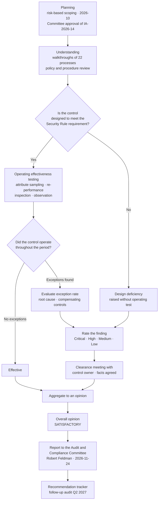

# 08.05 — Internal Audit of the Security Program

| Field | Value |
|---|---|
| Document ID | MBH-IAA-AUD-2026-805 |
| Version | 1.0 |
| Date | 2026-07-15 |
| Classification | Confidential — Electronic Protected Health Information (ePHI) // Illustrative Portfolio Sample |
| Owner | Priya Anand, Director of Internal Audit |
| Co-Owner | Robert Feldman, Board Audit &amp; Compliance Committee Chair |
| Author | Advisory Team (Healthcare GRC / HIPAA) |
| Status | Approved |

## Purpose

This document records the **internal audit of the MercyBridge HIPAA Security Program** performed by **Priya Anand, Director of Internal Audit**, in **2026-11** under audit reference **IA-2026-14**, approved in the annual audit plan by the Board **Audit &amp; Compliance Committee**.

Internal Audit is the third of the four independent lenses in 08.01. It answers a question neither the penetration test nor HITRUST answers well: **do the controls operate as documented, consistently, across the whole organisation, over a period of time — and is the documentation itself honest?** A pen test looks for one path on one day. HITRUST tests a requirement statement against evidence at a point in time. Internal Audit samples the *operation* of a control over eleven months and asks whether what the program says about itself is true.

> **Overall audit opinion: SATISFACTORY.**
>
> The HIPAA Security Program is designed appropriately and, in the areas tested, operating effectively. **Nine recommendations** are raised. **None is rated Critical or High.** Management has accepted all nine with named owners and dates.

## 1. Independence and Reporting

| Independence attribute | Position |
|---|---|
| Functional reporting line | **Priya Anand reports functionally to the Board Audit &amp; Compliance Committee (Robert Feldman)**, administratively to the CEO. She does **not** report to the CISO, CIO or Chief Compliance Officer |
| Role in the audited program | **None.** Internal Audit did not author any of the 24 policies, did not design any control, and performed no remediation |
| Advisory involvement | Internal Audit observed the 04.09 evaluation for completeness and challenge. That observation role is disclosed here and was excluded from the scope of testing in §3 to avoid self-review |
| Scope-setting authority | Set by Internal Audit, approved by the Committee. Management was consulted, not deferred to |
| Right of access | Unrestricted access to systems, records, personnel and third-party reports, per the Internal Audit Charter |
| Report distribution | Issued **directly** to the Audit &amp; Compliance Committee. Management response is **appended**, not merged; management cannot edit the findings |
| Standards | Conducted in conformance with the IIA International Standards for the Professional Practice of Internal Auditing |
| Fee / incentive | Salaried; no element of compensation contingent on the audit outcome |
| Escalation right | Direct private session with the Committee Chair, held **2026-11-24**, without management present |

## 2. Objectives and Scope

**Audit objective.** To provide the Audit &amp; Compliance Committee with independent assurance over the design and operating effectiveness of MercyBridge's controls for the confidentiality, integrity and availability of ePHI, measured against **45 CFR Part 164 Subpart C**, the Breach Notification Rule at **§164.400–414**, and MercyBridge's own 24-policy suite.

| In scope | Period covered | Out of scope | Why |
|---|---|---|---|
| §164.308 administrative safeguards — all 9 standards | 2026-02-02 → 2026-11-14 | Privacy Rule (Subpart E) beyond ePHI security | Separate audit IA-2026-09, Rebecca Stern's function |
| §164.310 physical safeguards | Same | Clinical quality and patient-safety controls | Outside the Security Rule |
| §164.312 technical safeguards | Same | Financial controls over the revenue cycle | Separate audit IA-2026-11 |
| §164.314 organisational requirements (~180 BAs) | Same | Halcyon's internal control environment | Relied on SOC 2 Type II; BA oversight audited instead |
| §164.316 policies, procedures and documentation | Same | Internal Audit's own 04.09 observation role | Self-review threat |
| §164.400–414 breach notification apparatus | Same | The Ironwood test methodology | Assessed for reliance, not re-performed |
| Governance, risk analysis and the risk register | Same | — | — |
| Management's response to the Ironwood and Beacon assessments | 2026-09 → 2026-11 | — | Deliberately included — see §7 |

**Sites visited.** 3 of 4 hospitals; 7 of ~30 outpatient/clinic sites; the primary and secondary data centres; the biomedical staging facility.

## 3. Methodology

| Technique | Applied to | Volume |
|---|---|---|
| Process walkthrough | 22 control processes | 22 |
| Attribute sampling | Access provisioning, terminations, training, BAAs, incidents, change records | 11 populations |
| Re-performance | Access recertification, four-factor assessment logic, backup restore verification, risk scoring | 4 |
| Inspection of evidence | Policies, committee minutes, logs, contracts, configuration extracts | ~340 artefacts |
| Observation | Physical walkthroughs, workstation practice, badge and escort controls | 12 locations |
| Data analytics | 100% population testing of privileged accounts, dormant accounts and terminated-user access | 3 full-population tests |
| Reliance on third-party work | Ironwood report (08.03/08.04) and Halcyon SOC 2 Type II — reviewed for scope, competence and independence before reliance | 2 |

**Sample sizing.** Attribute samples were sized at 25 items for monthly-or-more-frequent controls and 100% for quarterly-or-less-frequent controls, with an expected deviation rate of zero and a tolerable deviation rate of 5%.

## 4. Testing Results by Safeguard

| Area | Standard | Sample | Exceptions | Rating |
|---|---|---|---|---|
| Security management process — risk analysis | §164.308(a)(1)(ii)(A) | Full 56-risk register; 15 risks traced to evidence | 0 | **Effective** |
| Risk management plan execution | §164.308(a)(1)(ii)(B) | 25 treatment actions | 1 (date slippage, documented) | **Effective** |
| Information system activity review | §164.308(a)(1)(ii)(D) | 25 monthly reviews across 12 systems | 3 (reviews performed, evidence of review not retained for 3) | **Partially Effective** → **IA-F-02** |
| Assigned security responsibility | §164.308(a)(2) | Designation record | 0 | **Effective** |
| Workforce security — authorisation, clearance, termination | §164.308(a)(3) | 100% of 412 terminations in period | 6 (access removed 2–4 business days late; none with ePHI access retained beyond 4 days; 0 accesses used post-termination) | **Partially Effective** → **IA-F-01** |
| Information access management | §164.308(a)(4) | 25 provisioning requests; 100% of 1,182 privileged accounts | 2 provisioning approvals not retained | **Effective with exception** |
| Security awareness and training | §164.308(a)(5) | 100% of 6,512 workforce members | 97.8% completion; 143 outstanding, all within grace | **Effective** |
| Security incident procedures | §164.308(a)(6) | 3 of 3 incident files; 25 of 138 escalations | 0 | **Effective** |
| Contingency plan | §164.308(a)(7) | 12 Tier 1 systems; 8 restore tests | 5 of 12 restoration procedures not yet validated (known, dated) | **Effective with exception** — carried item R-47a |
| Evaluation | §164.308(a)(8) | Evaluation charter, calendar, workbook | 0 | **Effective** |
| Business associate contracts | §164.308(b)(1) / §164.314(a) | 40 of ~180 BAAs, including 24 of 24 critical | 3 (missing subcontractor flow-down language in 3 non-critical BAAs) | **Partially Effective** → **IA-F-03** |
| Facility access controls | §164.310(a) | 12 locations | 2 (door-prop alarm disabled at 1 clinic; visitor log gaps at 1 site) | **Partially Effective** → **IA-F-04** |
| Workstation use and security | §164.310(b)/(c) | 60 workstations observed | 4 unattended unlocked (consistent with PT-15) | **Effective with exception** |
| Device and media controls | §164.310(d) | 25 disposal records; 15 media movements | 1 (sanitisation certificate not filed) | **Effective with exception** |
| Access control — unique ID, emergency access, logoff, encryption | §164.312(a) | 68 of 68 systems for encryption; 25 break-glass uses | 0 on encryption; 2 break-glass reviews late | **Effective** |
| Audit controls | §164.312(b) | 68 systems for log generation; 25 review records | 6 systems not forwarding to the SIEM (known, dated D-3) | **Partially Effective** → **IA-F-05** |
| Integrity | §164.312(c) | 10 interface reconciliations | 0 | **Effective** |
| Person or entity authentication | §164.312(d) | 100% MFA coverage test across 68 systems | 1 (the exception population found by PT-02, remediated pre-audit) | **Effective** |
| Transmission security | §164.312(e) | 22 external services; 14 interfaces | 0 post-remediation | **Effective** |
| Policies, procedures, documentation | §164.316 | 24 of 24 policies | 2 (two procedures not updated to reflect approved plan revisions) | **Partially Effective** → **IA-F-06** |
| Breach notification apparatus | §164.400–414 | 3 of 3 four-factor assessments re-performed | 0 — Internal Audit reached the same conclusion on all three | **Effective** |

## 5. Recommendations

Nine recommendations. **None Critical. None High.** Six Medium, three Low.

| # | Rating | Finding | Recommendation | Management response | Owner | Due |
|---|---|---|---|---|---|---|
| **IA-F-01** | Medium | 6 of 412 terminations had ePHI access removed 2–4 business days after the effective date; the policy requires same-day for involuntary and 1 business day otherwise | Automate the HR-to-IAM trigger for all termination types, including per-diem and affiliated-provider populations, and report exceptions weekly | **Accepted.** The gap is concentrated in per-diem staff whose HR record closes on a different cycle. Automation in flight | Marcus Reed / HR Director | 2027-03-31 |
| **IA-F-02** | Medium | Activity review was performed but the reviewer attestation was not retained for 3 of 25 sampled months | Make retention of the reviewer attestation a system-enforced step rather than a manual filing action | **Accepted.** Workflow change deployed in the GRC platform | Marcus Reed | 2027-01-31 |
| **IA-F-03** | Medium | 3 of 40 sampled BAAs lacked explicit §164.314(a)(2)(iii) subcontractor flow-down language; all 3 are non-critical vendors | Complete the flow-down sweep across the full ~180 BA population, not only the 24 critical | **Accepted.** Sweep scoped; amendment templates already exist from Phase 06 | Lisa Coleman | 2027-04-30 |
| **IA-F-04** | Medium | Door-prop alarm disabled at one clinic; visitor log incomplete at one hospital entrance | Re-enable and alarm-test on a quarterly cycle; move visitor logging to the electronic badge system at the two remaining paper sites | **Accepted.** Alarm re-enabled during the audit visit | Facilities Director | 2027-02-28 |
| **IA-F-05** | Medium | 6 of 68 ePHI systems are not forwarding audit logs to the SIEM | Complete onboarding on the published schedule and report monthly to the Security Steering Committee until closed | **Accepted.** Known item D-3; 65 of 68 at report date; compensating local review documented | Marcus Reed | 2027-01-31 |
| **IA-F-06** | Medium | Two operating procedures were not updated to reflect plan revisions approved after the 2026-08 tabletop | Add a procedural-dependency field to the change-control record so downstream procedures are identified at approval, not afterwards | **Accepted.** 04.11 change-control form amended | Karen Boyd | 2027-01-31 |
| **IA-F-07** | Low | 2 of 25 access provisioning approvals could not be evidenced, though the access granted was appropriate in both cases | Enforce approval capture in the workflow; disable the manual bypass route | **Accepted** | Marcus Reed | 2027-02-28 |
| **IA-F-08** | Low | One media sanitisation certificate was not filed, though the sanitisation was performed and witnessed | Make certificate upload a mandatory closure step on the disposal ticket | **Accepted** | Anthony Ruiz | 2027-01-31 |
| **IA-F-09** | Low | Break-glass access reviews were completed late in 2 of 25 sampled cases (7 and 9 days against a 5-day standard) | Automate the review-due alert to the CMIO office | **Accepted** | Dr. Samuel Ortega | 2027-02-28 |

## 6. What Internal Audit Specifically Confirmed

| Assertion made by management | Audit conclusion |
|---|---|
| The §164.308(a)(1)(ii)(A) risk analysis is complete, current and covers all 68 ePHI systems | **Confirmed.** Traced 15 of 56 risks to source evidence; scoping reconciled to the asset inventory. Note: the PT-03 orphaned asset was **not** in the inventory at the time of the analysis — recorded as context to IA-F-05, not as a separate finding, because the reconciliation control was implemented before fieldwork |
| The 24-policy suite is approved, current and retained for six years | **Confirmed**, subject to IA-F-06 |
| ePHI is encrypted at rest on all 68 systems and in transit externally | **Confirmed.** 68 of 68 tested |
| MFA is enforced for remote and privileged access | **Confirmed post-remediation.** The pre-remediation exception population (PT-02) was verified as revoked |
| 3 incidents were assessed under §164.402(2) and none was a reportable breach | **Confirmed.** Internal Audit independently re-performed all three four-factor assessments and reached the same conclusion on each |
| All 16 Ironwood findings are remediated | **Confirmed.** Ironwood retest evidence inspected for all 16 |
| Residual risk is 0 High / 16 Moderate / 40 Low | **Confirmed as reasonable**, with the observation that two Moderate residuals (R-23, R-49) are stated as conditional and the conditions were not all met at report date |

## 7. Audit of the Response to External Assessment

Internal Audit deliberately examined **how management responded** to Ironwood and Beacon, because response quality predicts program durability better than control counts.

| Test | Result |
|---|---|
| Were High findings remediated within the 30-day SLA? | **Yes — 3 of 3.** PT-03 closed in 21 days, PT-02 in 29, PT-01 in 26 |
| Was closure evidenced independently, or asserted by management? | **Independently.** Ironwood retest required for all 16; no self-certified closures accepted |
| Did remediation address the root cause or only the instance? | **Root cause in all three High findings.** Each produced a systemic change (exception expiry, broker mandate, inventory reconciliation) beyond the specific fix |
| Was any finding downgraded, disputed or quietly closed? | **No.** No severity was changed after issue; no finding was closed without retest |
| Were findings reported upward accurately? | **Yes.** The Committee pack matched the Ironwood report; no softening observed |
| Was the 48% detection rate reported, or omitted? | **Reported.** It appears in the Committee pack and drove items D-11 to D-14 |

**This section is the strongest evidence in the audit.** A program that fixes what it is told about, at root cause, with independent verification, and reports its own worst number upward, is a program that will keep working when the assessors leave.

## 8. Opinion

**Overall opinion: SATISFACTORY.**

| Rating scale | Definition | This audit |
|---|---|---|
| Strong | Controls designed and operating effectively; no more than minor observations | |
| **Satisfactory** | Controls designed appropriately and operating effectively in the areas tested; some improvements required, none threatening the control objective | **✓** |
| Needs Improvement | Significant weaknesses in design or operation; control objective at risk | |
| Unsatisfactory | Pervasive failure; control objective not met | |

The nine recommendations are improvements to consistency, evidence retention and automation. None indicates an absent control, a misstated position, or a program that does not function. The two areas closest to a higher rating — termination timeliness (IA-F-01) and SIEM completeness (IA-F-05) — were **already known, already dated, and already being managed** before Internal Audit arrived, which is itself a finding in management's favour.

Presented to the Audit &amp; Compliance Committee **2026-11-24**, with a private session held without management present. Follow-up audit of recommendation closure scheduled **Q2 2027**.

## Cross-References

| Reference | Relevance |
|---|---|
| 01.03 — Roles &amp; Responsibilities | The reporting lines underpinning independence |
| 03.07 — Risk Register | The 56 risks traced during testing |
| 04.03 — Workforce Security | The termination control behind IA-F-01 |
| 04.09 — Evaluation | The §164.308(a)(8) programme this audit independently reviews |
| 05.06 — Audit Controls | The §164.312(b) position behind IA-F-05 |
| 06.03 — Business Associate Agreements | The BAA population behind IA-F-03 |
| 07.06 — Breach Risk Assessment — Four Factor | The three assessments re-performed |
| 08.01 — Independent Assessment Strategy | Lens 3 of four; why audit runs last |
| 08.03 — Penetration Test Results | The findings whose remediation was verified |
| 08.04 — Vulnerability Assessment &amp; Remediation | The closure evidence inspected |
| 08.07 — HITRUST i1 Assessment Results | The parallel external opinion |
| Phase 09 — Executive Reporting | Where the recommendation tracker is reported |

---
[⬅ Previous](08.04-vulnerability-assessment-and-remediation.md) · [🏠 Phase README](08.00-README.md) · [Next ➡](08.06-hitrust-csf-assessment-approach.md)
