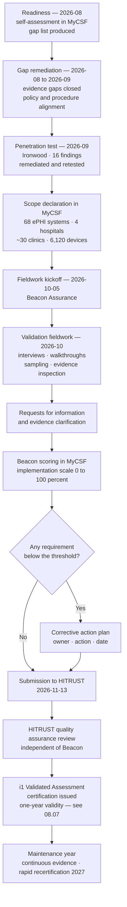

# 08.06 — HITRUST CSF Assessment Approach

| Field | Value |
|---|---|
| Document ID | MBH-IAA-HTA-2026-806 |
| Version | 1.0 |
| Date | 2026-07-15 |
| Classification | Confidential — Electronic Protected Health Information (ePHI) // Illustrative Portfolio Sample |
| Owner | Daniel Cho, Chief Information Security Officer &amp; HIPAA Security Official |
| Co-Owner | Karen Boyd, Chief Compliance Officer |
| Author | Advisory Team (Healthcare GRC / HIPAA) |
| Status | Approved |

## Purpose

This document sets out **what HITRUST is, why MercyBridge is pursuing it, which assessment type was selected and why, and how the assessment is executed** with **Beacon Assurance, LLC** as the HITRUST **Authorized External Assessor**. It is the method document; the outcome is recorded in 08.07.

The Security Rule tells a covered entity *what* to achieve and deliberately declines to say *how*. That flexibility is a genuine strength — a 4-hospital network and a two-physician practice cannot reasonably be held to identical implementations — and it is also the source of the single most common failure in HIPAA programs: **"reasonable and appropriate" is unfalsifiable until somebody external puts a number on it.** HITRUST exists to put a number on it.

## 1. What HITRUST Is

The **HITRUST CSF** (Common Security Framework) is a **prescriptive, certifiable control framework** built for regulated industries and originating in healthcare. It differs from HIPAA in three ways that matter operationally.

| Dimension | HIPAA Security Rule | HITRUST CSF |
|---|---|---|
| Nature | Regulation — legally binding | Framework — voluntary, contractually adopted |
| Specificity | Outcome-based; "reasonable and appropriate"; addressable specifications | **Prescriptive** — requirement statements with defined implementation expectations |
| Scalability | Flexibility clause at §164.306(b) | **Risk factors** that tailor the requirement set to organisation size, system type and regulatory exposure |
| Result | No certification exists; OCR does not certify anyone | **Certification** with a defined validity period |
| Assurance | Self-attested unless audited | Validated by an **Authorized External Assessor** and quality-reviewed by HITRUST itself |
| Coverage | ePHI security only | Harmonises **HIPAA, NIST SP 800-53, NIST CSF, ISO/IEC 27001/27002, PCI DSS, CIS, SOC 2 (TSC), GDPR, state law** and more |
| Refresh | Rule text stable since 2013 (NPRM pending) | Regular CSF releases; requirement sets updated for the current threat landscape |

**Why healthcare in particular uses it.** Health systems sit at the intersection of many overlapping regimes and are asked to prove compliance to many different counterparties. HITRUST answers a set of questionnaires once: a payer asking about NIST alignment, an HIE asking about ISO, a research partner asking about SOC 2 and a state regulator asking about HIPAA can all be answered from the same validated assessment. Increasingly, they do not merely accept it — **they require it**. Three of MercyBridge's payer contracts and two clinically integrated network agreements name HITRUST certification (or an accepted equivalent) as a condition of renewal from 2027.

**What HITRUST is not.** It is not a HIPAA compliance determination. This point is important enough that it is stated in the results document as well — see 08.07 §6.

## 2. Assessment Types and the Selection Decision

HITRUST offers a graded portfolio. Choosing correctly is a governance decision, not a procurement one.

| Type | Full name | Requirements | Assurance level | Validity | Suited to |
|---|---|---|---|---|---|
| **e1** | Essentials, 1-year | **44** | Foundational cybersecurity hygiene | 1 year | Low-risk entities; a first step; small vendors |
| **i1** | **Implemented, 1-year** | **~182** (current release) | **Leading practices, implementation-focused** | **1 year** | Organisations with a functioning program needing credible, certifiable third-party assurance |
| **r2** | Risk-based, 2-year | **Tailored — typically 300–2,000+** | Comprehensive, risk-tailored, maturity-scored | 2 years (with interim assessment at 1 year) | Large or high-risk entities; those with regulatory scrutiny or contractual demand for the highest assurance |

### 2.1 Why i1 is right-sized for MercyBridge in 2026

| Consideration | e1 | **i1** | r2 |
|---|---|---|---|
| Credible to payers and clinically integrated networks | Marginal | **Yes** | Yes |
| Matches program maturity at end of a first-year build | Below | **At level** | Above — would evidence maturity the program has not yet accumulated |
| Evidence burden achievable in the 2026-10 → 2026-11 window | Trivial | **Achievable** | Not achievable without extending the engagement into 2027 |
| Scored on **implementation** rather than full maturity | Yes | **Yes — implementation only** | No — five PRISMA maturity levels per requirement |
| Forces the program to demonstrate operating controls, not intentions | Weakly | **Yes** | Yes |
| Provides a defined path to the next level | To i1 | **To r2** | — |
| Cost and effort proportionate to current risk position (0 High) | Under-invests | **Proportionate** | Over-invests for year one |

**Decision.** MercyBridge pursues the **i1 Validated Assessment** in 2026, recorded as **ADR-0021**, with an explicit intention to evaluate **r2** for the 2028 cycle once two full years of operating evidence exist. Attempting r2 in the first year would have produced either a poor result or a rushed evidence base — and a weak r2 is worse than a strong i1, both commercially and internally.

**A note on i1's design.** The i1 requirement set is **not tailored** by risk factors in the way r2 is; it is a fixed, threat-adaptive set that HITRUST curates against current attack patterns. That is a feature: it removes the temptation to scope the assessment away from difficult controls. Every i1 assessment answers the same questions.

## 3. The i1 Requirement Set

| Domain (illustrative of the 19 CSF domains) | Example requirement themes | MercyBridge evidence source |
|---|---|---|
| Information Protection Program | Governance, program documentation, roles | Phase 01; POL-01 |
| Endpoint Protection | Malware defence, endpoint hardening, EDR | Phase 05; 08.04 |
| Portable Media Security | Media control, encryption, sanitisation | 05.05; NIST SP 800-88 |
| Mobile Device Security | MDM, containerisation, remote wipe | 05.05 |
| Wireless Security | 802.1X, segregation, rogue detection | 05.04; PT-09 remediation |
| Configuration Management | Baselines, change control, hardening | 04.11; Phase 05 |
| **Vulnerability Management** | Scanning cadence, remediation SLA, **penetration testing** | **08.03, 08.04** |
| Network Protection | Segmentation, boundary control, egress | 05.04; PT-01 remediation |
| Transmission Protection | Encryption in transit, TLS standards | 05.04; §164.312(e) |
| Password Management | Complexity, rotation, storage, **MFA** | 05.02; PT-02 remediation |
| **Access Control** | Least privilege, provisioning, recertification, emergency access | 04.04, 05.02 |
| Audit Logging &amp; Monitoring | Log generation, retention, review, SIEM | 05.06; §164.312(b) |
| Education, Training &amp; Awareness | Role-based training, phishing, sanctions | 04.05 |
| Third Party Assurance | BA due diligence, contracts, monitoring | Phase 06; ~180 BAs |
| **Incident Management** | Detection, response, notification, lessons learned | Phase 07 |
| Business Continuity &amp; Disaster Recovery | Contingency plan, backup, testing | 04.08 |
| Risk Management | Risk analysis, treatment, register | Phase 03; 56 risks |
| Physical &amp; Environmental Security | Facility access, environmental controls | Phase 05; §164.310 |
| Data Protection &amp; Privacy | Minimum necessary, retention, disposal | Phases 02, 05 |

**Scope declaration.** The assessment scope is the systems, facilities and processes supporting ePHI: **68 ePHI systems**, **4 hospitals and ~30 outpatient sites**, the **6,120-device IoMT estate** as an in-scope asset class, the workforce of ~6,500, and the **~180 business associates** as a third-party assurance population. Scope was declared in MyCSF, reviewed by Beacon and accepted by HITRUST.

## 4. MyCSF and the Assessment Mechanics

**MyCSF** is HITRUST's assessment platform. It holds the scoped requirement set, the illustrative procedures, MercyBridge's responses, the uploaded evidence, Beacon's validation testing, the scoring engine and the submission to HITRUST. Nothing counts unless it is in MyCSF.

| Mechanic | How it works |
|---|---|
| Requirement statement | Each carries illustrative procedures describing what an assessor expects to see |
| **Scoring — i1** | Each requirement scored on **implementation only** on a 5-point scale: Non-Compliant (0%), Somewhat Compliant (25%), Partially Compliant (50%), Mostly Compliant (75%), Fully Compliant (100%) |
| Passing threshold | A requirement scores **≥ 3 (Mostly Compliant, 75%)** to be considered met without a corrective action plan |
| **Corrective Action Plan (CAP)** | A requirement scoring below the threshold requires a CAP with owner, action and date. A limited number of CAPs is tolerated; too many, or CAPs on foundational requirements, prevents certification |
| Evidence | Policy, procedure **and** implementation evidence for each requirement — a policy alone never scores Fully Compliant |
| Sampling | Beacon selects samples; MercyBridge does not choose which items are tested |
| **HITRUST QA** | After Beacon submits, **HITRUST performs its own quality assurance review** of the assessor's work. HITRUST — not Beacon — issues the certification |
| Rapid Recertification | Available for i1 in the following year where change is limited, reducing effort at renewal |

## 5. The Role of the Authorized External Assessor

**Beacon Assurance, LLC** is an Authorized External Assessor firm, authorised by HITRUST and subject to HITRUST's own oversight of assessor quality.

| Beacon does | Beacon does **not** |
|---|---|
| Independently validate each requirement against evidence | Implement, configure or remediate any control |
| Select samples and perform testing | Write MercyBridge's policies or procedures |
| Score requirements in MyCSF | Decide the certification outcome — HITRUST does |
| Challenge self-scores and require additional evidence | Accept management assertion in place of evidence |
| Perform interviews, walkthroughs and inspection | Advise on how to score more favourably |
| Submit the validated assessment to HITRUST | Guarantee an outcome |

**Independence.** Beacon performed no advisory, remediation or implementation work for MercyBridge, and holds no contingent fee arrangement. The Advisory Team (Healthcare GRC / HIPAA) that delivered Phases 01–07 has **no role** in the validated assessment and does not review Beacon's findings before submission. This separation is a HITRUST requirement, not a MercyBridge preference.

## 6. Assessment Timeline

| Milestone | Date | Owner |
|---|---|---|
| Assessment type decision (ADR-0021) | 2026-07-20 | Daniel Cho |
| Beacon engaged; MyCSF subscription active | 2026-08-03 | Daniel Cho |
| Readiness self-assessment complete | 2026-08-28 | Marcus Reed |
| Readiness gap remediation | 2026-08 → 2026-09 | Marcus Reed |
| Penetration test complete and findings remediated | 2026-09 → 2026-10 | Marcus Reed |
| Scope declared and accepted | 2026-09-30 | Daniel Cho |
| **Fieldwork kickoff** | **2026-10-05** | Beacon Assurance |
| Fieldwork and evidence validation | 2026-10-05 → 2026-11-06 | Beacon Assurance |
| Scoring and CAP agreement | 2026-11-07 → 2026-11-12 | Daniel Cho / Beacon |
| **Submission to HITRUST** | **2026-11-13** | Beacon Assurance |
| HITRUST QA and certification | 2026-11 | HITRUST |
| Board reporting | 2026-12 | Daniel Cho |

## 7. Readiness Activities

The readiness self-assessment in 2026-08 produced a gap list. Closing it before fieldwork is what turns a validated assessment into a certification rather than a list of CAPs.

| Readiness activity | Gap found | Action taken |
|---|---|---|
| Requirement-by-requirement self-scoring in MyCSF | 31 requirements below the threshold | 27 closed before fieldwork; 4 entered fieldwork with dated plans |
| Evidence mapping — policy, procedure and implementation for each requirement | 19 requirements had policy but no implementation evidence | Evidence collection standardised; screenshots dated and system-attributed |
| Policy alignment to CSF language | 6 policies used HIPAA terminology only | Cross-reference appendix added, mapping each policy to CSF requirement IDs |
| Sample availability | Several controls had no retained artefact for older months | Retention automated in the GRC platform |
| Third-party assurance evidence | BA monitoring evidence thin for non-critical vendors | Phase 06 monitoring cadence extended below the critical tier |
| Penetration test currency | i1 expects a current test | **Ironwood test scheduled deliberately ahead of fieldwork** |
| Scope reconciliation | The orphaned asset behind PT-03 was outside the declared inventory | Inventory reconciliation control implemented before scope declaration |

## 8. HIPAA-to-HITRUST Relationship

| MercyBridge concern | Answered by HIPAA | Answered by HITRUST |
|---|---|---|
| Is it legally required? | **Yes** | No |
| Does it tell us the specific control to implement? | No | **Yes** |
| Can we be certified against it? | **No — OCR certifies nobody** | **Yes** |
| Does it satisfy payer and partner due diligence? | Partly | **Yes** |
| Does it satisfy §164.308(a)(8) evaluation on its own? | — | **No** — it contributes the technical and external validation component; the evaluation obligation remains MercyBridge's |
| Does certification prevent an OCR investigation or penalty? | — | **No** — see 08.07 §6 |

## Cross-References

| Reference | Relevance |
|---|---|
| 01.05 — Framework Selection &amp; Crosswalk | Why HITRUST was chosen alongside NIST SP 800-66 Rev. 2 |
| 02.02 — ePHI System Inventory | The 68 systems in the declared scope |
| 03.02 — Risk Analysis Methodology | The risk basis Beacon tested against |
| 04.09 — Evaluation | The §164.308(a)(8) obligation HITRUST supports but does not discharge |
| 06.04 — Vendor Security Assessment | The third-party assurance domain evidence |
| 08.01 — Independent Assessment Strategy | Lens 4 of four; sequencing behind the pen test |
| 08.03 — Penetration Test Results | The current test i1 expects |
| 08.04 — Vulnerability Assessment &amp; Remediation | The vulnerability management domain evidence |
| 08.05 — Internal Audit of the Security Program | The parallel internal opinion |
| 08.07 — HITRUST i1 Assessment Results | The outcome of this approach |
| 08.08 — OCR Audit Protocol Readiness | Where HITRUST evidence is re-used for regulator-facing readiness |
| ADR-0021 | The recorded decision to pursue i1 rather than e1 or r2 |

---
[⬅ Previous](08.05-internal-audit-of-the-security-program.md) · [🏠 Phase README](08.00-README.md) · [Next ➡](08.07-hitrust-i1-assessment-results.md)
