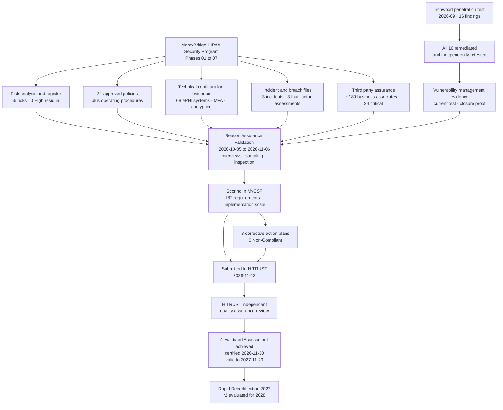

# 08.07 — HITRUST i1 Assessment Results

| Field | Value |
|---|---|
| Document ID | MBH-IAA-HTR-2026-807 |
| Version | 1.0 |
| Date | 2026-07-15 |
| Classification | Confidential — Electronic Protected Health Information (ePHI) // Illustrative Portfolio Sample |
| Owner | Daniel Cho, Chief Information Security Officer &amp; HIPAA Security Official |
| Co-Owner | Karen Boyd, Chief Compliance Officer |
| Author | Advisory Team (Healthcare GRC / HIPAA) |
| Status | Approved |

## Purpose

This document records the outcome of the **HITRUST i1 Validated Assessment** of MercyBridge Health Network, performed by **Beacon Assurance, LLC** as HITRUST **Authorized External Assessor** between **2026-10-05** and **2026-11-13**, and certified by HITRUST following its independent quality assurance review.

> **Result: HITRUST i1 Validated Assessment — ACHIEVED. Certification issued.**
>
> **182 requirement statements assessed · overall implementation score 93.1% · 174 of 182 requirements met at or above the threshold · 8 corrective action plans · 0 requirements scored Non-Compliant · certification valid for one year.**

It also records, in §6, what this certification does **not** mean — a section written deliberately and at length, because a HITRUST certificate is the single most over-claimed artefact in healthcare security, and a portfolio that misrepresents it is less credible than one that has none.

## 1. Certification Detail

| Attribute | Value |
|---|---|
| Assessment type | **HITRUST CSF i1 Validated Assessment** (Implemented, 1-year) |
| Authorized External Assessor | **Beacon Assurance, LLC** |
| Certifying body | **HITRUST** — following independent quality assurance of Beacon's work |
| Assessed entity | MercyBridge Health Network |
| Fieldwork period | 2026-10-05 → 2026-11-06 |
| Submission to HITRUST | 2026-11-13 |
| **Certification issued** | **2026-11-30** |
| **Certification period** | **2026-11-30 → 2027-11-29 (one year)** |
| Requirement statements assessed | **182** |
| Scope | 68 ePHI systems; 4 hospitals; ~30 outpatient sites; 6,120 networked medical devices as an in-scope asset class; ~6,500 workforce; ~180 business associates as a third-party assurance population |
| Interim assessment required | **No** — i1 has no interim; r2 does |
| Renewal path | Rapid Recertification for the 2027 cycle where change remains limited |

## 2. Scored Results

Scoring at i1 is on **implementation only** — a single dimension, unlike r2's five PRISMA maturity levels. Each requirement is scored 0%, 25%, 50%, 75% or 100%, and a requirement must reach **75% (Mostly Compliant)** to be met without a corrective action plan.

| Score band | Meaning | Requirements | % of set |
|---|---|---|---|
| **100% — Fully Compliant** | Implemented consistently across the full scope, evidenced | **141** | 77.5% |
| **75% — Mostly Compliant** | Implemented with minor gaps in consistency or coverage | **33** | 18.1% |
| 50% — Partially Compliant | Implemented in part of the scope, or partly evidenced | **7** | 3.8% |
| 25% — Somewhat Compliant | Early implementation; material gaps | **1** | 0.6% |
| 0% — Non-Compliant | Not implemented | **0** | 0.0% |
| **Total** | | **182** | 100% |
| **Requirements at or above the 75% threshold** | | **174 (95.6%)** | |
| **Overall weighted implementation score** | | **93.1%** | |

### 2.1 Score by Domain

| CSF domain | Requirements | Domain score | Comment |
|---|---|---|---|
| Information Protection Program | 8 | 100% | Governance, charter and roles fully evidenced from Phase 01 |
| Risk Management | 9 | 100% | 56-risk analysis, treatment plan and register; strongest domain |
| Access Control | 21 | 96% | MFA universal post-PT-02 remediation; two provisioning-evidence gaps |
| Password Management | 7 | 100% | Post-remediation; no exceptions remaining |
| Audit Logging &amp; Monitoring | 14 | **82%** | **6 of 68 systems not yet forwarding to the SIEM — CAP-03** |
| Network Protection | 13 | 93% | PT-01 remediated; device-boundary validation now quarterly |
| Transmission Protection | 8 | 100% | Encryption in transit universal externally |
| Configuration Management | 11 | 91% | Baselines strong; device estate drives the residual |
| **Vulnerability Management** | 12 | 96% | Monthly authenticated scanning, annual pen test, SLA evidence |
| Endpoint Protection | 10 | 95% | EDR at 97.2% coverage |
| Portable Media Security | 5 | 100% | NIST SP 800-88 procedures evidenced |
| Mobile Device Security | 6 | 92% | Two BYOD policy exceptions with dated closure |
| Wireless Security | 6 | 88% | 214-device legacy PSK remnant — **CAP-05** |
| Physical &amp; Environmental Security | 12 | 92% | Clinic-site consistency; aligns with IA-F-04 |
| Third Party Assurance | 14 | **86%** | ~180-BA population; monitoring below the critical tier — **CAP-02** |
| Incident Management | 13 | 100% | Phase 07 plan, playbooks, 3 incident files, tabletop |
| Business Continuity &amp; Disaster Recovery | 7 | **79%** | **5 of 12 Tier 1 restoration procedures unvalidated — CAP-01** |
| Education, Training &amp; Awareness | 6 | 100% | 97.8% completion; role-based; phishing programme |

## 3. Corrective Action Plans

Eight requirements scored below the threshold. **None was scored Non-Compliant**, and none sits in a foundational domain in a way that threatens certification. Each CAP carries an owner, an action and a date, and each will be verified at recertification.

| CAP | Requirement theme | Score | Root cause | Corrective action | Owner | Due |
|---|---|---|---|---|---|---|
| **CAP-01** | Business continuity — validated restoration procedures for critical systems | **25%** | 5 of 12 Tier 1 systems have documented but **unvalidated** 24-hour restoration procedures; the joint Halcyon restoration test sequencing pushed validation into 2027 | Complete validated restoration testing for the remaining 5 Tier 1 systems; append evidence to the contingency plan | Anthony Ruiz | 2027-03-31 |
| **CAP-02** | Third-party assurance — ongoing monitoring below the critical tier | 50% | Monitoring evidence robust for the 24 critical BAs, thin across the remaining ~156 | Extend risk-tiered monitoring cadence to all tiers; annual attestation with evidence sampling | Lisa Coleman | 2027-04-30 |
| **CAP-03** | Audit logging — centralised collection across all in-scope systems | 50% | 6 of 68 ePHI systems not yet forwarding to the SIEM (known item D-3); compensating local review documented and accepted as partial credit | Complete SIEM onboarding for the remaining systems | Marcus Reed | 2027-01-31 |
| **CAP-04** | Access provisioning — retained approval evidence | 50% | Approval workflow permitted a manual bypass that did not capture the approver record | Disable the bypass; enforce workflow capture (aligns with IA-F-07) | Marcus Reed | 2027-02-28 |
| **CAP-05** | Wireless — enterprise authentication across all clinical SSIDs | 50% | 214 legacy devices unable to support 802.1X remain on a scoped, rotated PSK segment | Retire or replace the 214-device remnant; interim segmentation and client isolation evidenced | Anthony Ruiz | 2027-06-30 |
| **CAP-06** | Configuration management — baseline coverage of legacy appliances | 50% | 72 ePHI hosts cannot accept credentialed configuration assessment | Vendor-supported assessment path or platform replacement; compensating controls documented | Anthony Ruiz | 2027-06-30 |
| **CAP-07** | Timely deprovisioning of workforce access | 50% | 6 of 412 terminations exceeded the policy window for per-diem staff (aligns with IA-F-01) | Automate the HR-to-IAM trigger across all worker types | Marcus Reed | 2027-03-31 |
| **CAP-08** | Physical security consistency across ambulatory sites | 50% | Door-prop alarm and visitor-log inconsistencies at two sites (aligns with IA-F-04) | Quarterly alarm testing; electronic visitor logging at remaining paper sites | Facilities Director | 2027-02-28 |

**Convergence is the point.** Five of the eight CAPs (**CAP-01, CAP-03, CAP-04, CAP-07, CAP-08**) match findings raised independently by Internal Audit (08.05) and, in CAP-01 and CAP-03's case, items already carried forward from Phase 07 with dates attached before either assessor arrived. **Three independent lenses converging on the same short list is strong evidence that the program's self-knowledge is accurate** — the organisation was not surprised by what the assessors found, which is a materially different position from being told about problems it did not know it had.

## 4. What the Assessment Relied On

| Evidence class | Volume inspected by Beacon | Notes |
|---|---|---|
| Policies and procedures | 24 policies, 61 procedures | Cross-referenced to CSF requirement IDs |
| Configuration and system evidence | 412 artefacts across 68 systems | Dated and system-attributed screenshots and extracts |
| Populations sampled | 19 populations | Beacon selected samples; MercyBridge did not choose |
| Interviews | 31 personnel across 14 functions | Including Clinical Engineering and ambulatory operations |
| Site walkthroughs | 2 hospitals, 3 clinic sites, 2 data centres | Physical domain evidence |
| Third-party reports relied upon | Ironwood report and retest; Halcyon SOC 2 Type II | Reviewed for scope and competence before reliance |
| Requests for information issued | 47 | 47 of 47 answered within the fieldwork window |

## 5. Mapping Back to the HIPAA Security Rule

HITRUST's value to a HIPAA program is that the validated evidence is directly re-usable against the Rule. The mapping below is the one carried into 08.08 for OCR Audit Protocol readiness.

| Security Rule provision | HITRUST domains providing validated evidence | i1 result |
|---|---|---|
| §164.308(a)(1) — Security management process | Risk Management; Vulnerability Management; Audit Logging | Risk Management 100%; Vulnerability Management 96% |
| §164.308(a)(2) — Assigned security responsibility | Information Protection Program | 100% |
| §164.308(a)(3) — Workforce security | Access Control; Education &amp; Awareness | 96% / 100%, CAP-07 open |
| §164.308(a)(4) — Information access management | Access Control | 96%, CAP-04 open |
| §164.308(a)(5) — Security awareness and training | Education, Training &amp; Awareness; Endpoint Protection | 100% / 95% |
| §164.308(a)(6) — Security incident procedures | Incident Management | **100%** |
| §164.308(a)(7) — Contingency plan | Business Continuity &amp; Disaster Recovery | **79%, CAP-01 open** |
| §164.308(a)(8) — Evaluation | Information Protection Program; Vulnerability Management | Contributes; does not discharge — see §6 |
| §164.308(b) / §164.314(a) — BA contracts and organisational requirements | Third Party Assurance | **86%, CAP-02 open** |
| §164.310 — Physical safeguards | Physical &amp; Environmental Security; Portable Media | 92% / 100%, CAP-08 open |
| §164.312(a) — Access control | Access Control; Password Management | 96% / 100% |
| §164.312(b) — Audit controls | Audit Logging &amp; Monitoring | **82%, CAP-03 open** |
| §164.312(c) — Integrity | Configuration Management; Audit Logging | 91% |
| §164.312(d) — Authentication | Password Management; Access Control | 100% |
| §164.312(e) — Transmission security | Transmission Protection; Wireless Security | 100% / 88%, CAP-05 open |
| §164.316 — Policies, procedures and documentation | Information Protection Program | 100% |

## 6. What This Certification Does **Not** Mean

This section is written to be quoted, because the claim is routinely overstated.

| Common claim | Accurate position |
|---|---|
| "We are HIPAA compliant — we are HITRUST certified." | **False.** HITRUST is a private framework. **OCR does not certify, endorse or recognise any certification as a determination of HIPAA compliance.** HHS has said so explicitly and repeatedly. Certification is evidence of a diligent security programme; it is not a legal conclusion |
| "Certification protects us from OCR enforcement." | **False.** It does not prevent an investigation, a compliance review, a civil money penalty or a resolution agreement. It may be relevant context in demonstrating good-faith diligence, and nothing more |
| "Certification means we have no security gaps." | **False.** MercyBridge certified with **8 open corrective action plans**, one requirement at 25%, and a Business Continuity domain score of 79% |
| "Certification covers everything we do." | **False.** It covers **the declared scope only** — 68 ePHI systems and the associated facilities and processes. The 142 non-ePHI systems are outside it |
| "Certification discharges §164.308(a)(8)." | **False.** It provides a strong external, technical component. The evaluation obligation — periodic, technical **and non-technical**, triggered by change — remains MercyBridge's own and is discharged by the 04.09 programme |
| "Certification lasts until we renew." | **False.** i1 validity is **one year**, and it can be **revoked** if a material breach or control failure is not reported to HITRUST under the certification terms |
| "The assessor certified us." | **Imprecise.** Beacon **validated**; **HITRUST certified**, after its own quality assurance review of Beacon's work |
| "It proves our business associates are secure." | **False.** It validates MercyBridge's **oversight** of business associates. Each BA's own posture is its own responsibility — and CAP-02 records that MercyBridge's oversight below the critical tier is not yet where it should be |

**Why pursue it anyway.** Because a prescriptive, externally validated, quality-reviewed assessment against 182 requirement statements is the strongest available answer to *how do you know your controls work?* — stronger than a self-assessment, broader than a penetration test, and more specific than the Security Rule itself. It is a **means of demonstrating diligence**, not a substitute for it.

## 7. Maintenance Obligations

| Obligation | Detail | Owner |
|---|---|---|
| Maintain the certified control set | Controls must remain operating throughout the certification period, not merely at assessment | Daniel Cho |
| Report material changes to HITRUST | Breach, significant control failure or material scope change must be reported under the certification terms | Daniel Cho |
| Close all 8 CAPs | Verified at recertification; overdue CAPs jeopardise renewal | Named CAP owners |
| Annual penetration test | Required to remain current for the vulnerability management domain; **and proposed to become mandatory under the 2025 NPRM** | Marcus Reed |
| Continuous evidence collection | Evidence gathered as controls operate, not reconstructed at fieldwork | Marcus Reed |
| Rapid Recertification readiness | 2027 cycle; effort reduced where change is limited | Daniel Cho |
| r2 evaluation | Assess in 2027 whether r2 is proportionate for the 2028 cycle | Daniel Cho |

## 8. Conclusion

MercyBridge holds a **HITRUST i1 Validated Assessment certification, valid 2026-11-30 to 2027-11-29**, with an overall implementation score of **93.1%**, **174 of 182 requirements met at or above the threshold**, **zero requirements scored Non-Compliant**, and **8 corrective action plans** with named owners and dates in the first half of 2027.

Taken with the Ironwood result (**16 findings, all remediated and independently re-tested**) and the Internal Audit opinion (**Satisfactory, nine recommendations, none critical**), the three independent lenses agree — with each other and with what MercyBridge already believed about itself. The remaining weaknesses are **the same ones the organisation had already named, dated and assigned**: restoration validation, SIEM completeness, business associate monitoring below the critical tier, and consistency at ambulatory sites.

That agreement is the real result. A certificate proves a point in time. **Three independent assessors arriving at the same short list proves the program can see itself accurately** — which is the only property that keeps a security program working in the years when nobody is assessing it.

## Cross-References

| Reference | Relevance |
|---|---|
| 01.04 — HIPAA Security Rule Overview | The provisions mapped in §5 |
| 03.07 — Risk Register | Where CAP-linked residual risks are held |
| 04.08 — Contingency Plan | The domain behind CAP-01 |
| 04.09 — Evaluation | Why certification supports but does not discharge §164.308(a)(8) |
| 05.06 — Audit Controls | The §164.312(b) position behind CAP-03 |
| 06.06 — Ongoing Business Associate Monitoring | The programme extended under CAP-02 |
| 07.12 — Phase Summary &amp; Transition | The carried-forward items that became CAP-01 and CAP-03 |
| 08.03 — Penetration Test Results | The current test relied on in the vulnerability management domain |
| 08.04 — Vulnerability Assessment &amp; Remediation | The remediation evidence Beacon inspected |
| 08.05 — Internal Audit of the Security Program | The parallel opinion converging on five of eight CAPs |
| 08.06 — HITRUST CSF Assessment Approach | The method that produced this result |
| 08.08 — OCR Audit Protocol Readiness | Where this evidence is re-used for the regulator-facing view |

---
[⬅ Previous](08.06-hitrust-csf-assessment-approach.md) · [🏠 Phase README](08.00-README.md) · [Next ➡](08.08-ocr-audit-protocol-readiness.md)
