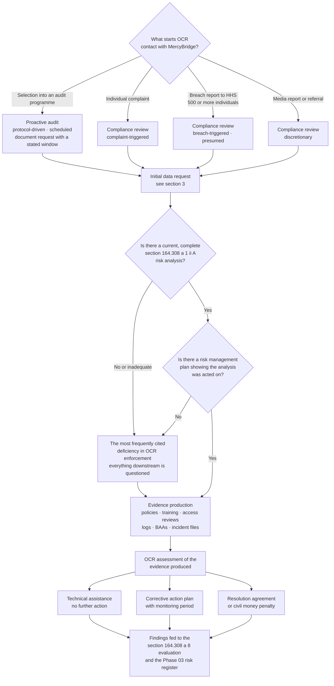

# 08.08 — OCR Audit Protocol Readiness

| Field | Value |
|---|---|
| Document ID | MBH-IAA-OCR-2026-808 |
| Version | 1.0 |
| Date | 2026-07-15 |
| Classification | Confidential — Electronic Protected Health Information (ePHI) // Illustrative Portfolio Sample |
| Owner | Karen Boyd, Chief Compliance Officer |
| Co-Owner | Rebecca Stern, Chief Privacy Officer · Daniel Cho, Chief Information Security Officer &amp; HIPAA Security Official |
| Author | Advisory Team (Healthcare GRC / HIPAA) |
| Status | Approved |

## Purpose

Ironwood tested whether an adversary could reach ePHI. Internal Audit tested whether the controls operate. Beacon tested MercyBridge against a private framework. **None of the three tested what the regulator would actually ask.**

This document does. It maps the MercyBridge security programme to the **HHS Office for Civil Rights (OCR) Audit Protocol**, states what OCR asks for first and whether MercyBridge can produce it, records a **simulated data-request drill** run against the mapping, and lists — without softening — the places where the answer to a protocol inquiry would today be *"we do not have that."*

> **Readiness position: 91 Security Rule and Breach Notification audit inquiries in scope. 78 fully evidenced · 10 evidenced with a documented, dated gap · 3 not evidenced. Simulated data request produced 38 of 42 requested items inside a 10-business-day window.**

The single most important sentence in this document is in §7: **the finding OCR raises more often than any other is a missing or inadequate risk analysis.** MercyBridge's answer to that inquiry is the strongest artefact in the portfolio, and it is the one that was built first, for exactly this reason.

## 1. What the OCR Audit Protocol Is

The Audit Protocol is OCR's published, structured statement of *how it evaluates a covered entity or business associate*. It is not a regulation and it is not a certification scheme. It is the question set.

| Attribute | Detail |
|---|---|
| Scope | **Privacy Rule, Security Rule and Breach Notification Rule** — all three, in one instrument |
| Structure | Approximately **180 audit inquiries**, grouped by rule and by standard |
| Split | ~**89 Privacy** · ~**72 Security** · ~**19 Breach Notification** |
| Anatomy of an inquiry | Each states the **key activity**, the **established performance criterion** (the regulatory text), the **audit inquiry** itself, and the **documents and evidence required** |
| Character of the inquiry | Almost every inquiry is two-part: *does the policy exist* **and** *obtain and review evidence that the process operates* |
| What it is not | Not a safe harbour, not a scoring model, not a pass/fail scheme, and **not a control framework** — it does not tell an entity what to build |
| Why it still matters | It is the closest available approximation of the questions asked in a real investigation, and it is public |

**The structural point.** The protocol is deliberately evidence-led rather than design-led. An entity with excellent policies and no operating evidence fails the protocol. That is why 08.09 exists, and why the readiness position in this document is expressed in *evidence produced*, not in *policies written*.

## 2. Compliance Review Versus Audit — Two Very Different Days

These are routinely conflated. They differ in trigger, posture, scope and consequence, and the difference determines how MercyBridge prepares.

| Dimension | **Proactive audit** | **Compliance review / investigation** |
|---|---|---|
| Trigger | Selection into an OCR audit programme; no allegation of wrongdoing | A **complaint**, a **breach report** (particularly 500+ individuals), media reporting, or a referral |
| Posture | Assessment of compliance posture | Examination of a **specific event** and everything around it |
| Scope | Defined by the protocol; usually a subset of inquiries | Defined by OCR; **starts at the event and expands wherever the facts lead** |
| Typical opening | Notification letter with a document request and a stated window | Notification of the complaint or breach, with a data request often narrower but deeper |
| Timeframe | Structured, scheduled | Open-ended; can run for years |
| Documentation window | Commonly **10 business days**, occasionally shorter | Often **10–30 days**, with follow-up requests |
| Likely outcome | Findings letter; technical assistance; corrective action | Technical assistance, **corrective action plan with monitoring**, resolution agreement, or **civil money penalty** |
| The uncomfortable asymmetry | An audit assesses the programme you have | A review assesses the programme **you had on the day of the incident** — reconstructed from documents you cannot create afterwards |

**What MercyBridge concluded from the asymmetry.** Readiness cannot be a project. Evidence produced after a request is worth very little; evidence dated before the event and retained under §164.316(b) is worth everything. This is the reasoning behind the continuous-capture model in 08.09 §4 rather than a periodic "audit prep" exercise.

## 3. What OCR Asks For First

Across published enforcement actions and the protocol's own document lists, the opening request is remarkably consistent. MercyBridge maintains these nine items in a **standing production set** that is refreshed as the underlying artefact changes, not when a letter arrives.

| # | What is requested | MercyBridge artefact | Where held | Produce in |
|---|---|---|---|---|
| 1 | **The risk analysis** — §164.308(a)(1)(ii)(A), current, covering all ePHI | 56-risk analysis and register across **68 ePHI systems**; methodology; scoping reconciliation | 03.01 / 03.05 / 03.07 / 03.09 | **Same day** |
| 2 | **The risk management plan** — §164.308(a)(1)(ii)(B), showing the analysis was acted on | Treatment plan with waves, owners, dates; residual position 0 High / 16 Moderate / 40 Low | 03.08 / 08.11 | **Same day** |
| 3 | **Policies and procedures** — current and dated | **24 approved policies**, 61 operating procedures, version history, approval records | 04.x / 05.x; repository index EV-01 | **Same day** |
| 4 | **Workforce training records** | 97.8% completion across **6,512** workforce members; role-based modules; phishing programme results | 04.05; repository EV-04 | **1 business day** |
| 5 | **Business associate agreements** | **~180 BAAs**, 24 critical; register; executed originals; subcontractor flow-down | 06.03; repository EV-07 | **2 business days** |
| 6 | **Evidence of the §164.308(a)(8) evaluation** | Evaluation charter and calendar; **this phase** — pen test, internal audit, HITRUST i1 | 04.09 / 08.01–08.07 | **1 business day** |
| 7 | **Information system activity review** — §164.308(a)(1)(ii)(D) | Monthly review records across 12 system groups; reviewer attestations | 05.06; repository EV-05 | **2 business days** — *see the gap in §6* |
| 8 | **Incident and breach documentation** | 3 incident files; 3 four-factor assessments; 0 reportable breaches; breach log | 07.06 / 07.10; repository EV-08 | **1 business day** |
| 9 | **Designation of the Security Official** — §164.308(a)(2) | Daniel Cho, dated designation record with the delegation of authority | 01.03 | **Same day** |

**Item 1 is not first by accident.** It is first because it is the item on which the rest of the request is calibrated. An entity that cannot produce a credible risk analysis has, in OCR's framing, no defensible basis for any of the choices it made about safeguards — and the request that follows is materially more adversarial.

## 4. Mapping to the Security Rule Sections of the Protocol

The **72 Security Rule inquiries** were mapped to MercyBridge evidence in 2026-12 by Karen Boyd's team with Marcus Reed as evidence custodian, and independently sampled by Priya Anand.

| Protocol area | Standards covered | Inquiries | Primary evidence | Fully evidenced | Gap | Not evidenced |
|---|---|---|---|---|---|---|
| Security management process | §164.308(a)(1)(i)–(ii)(D) | 12 | Risk analysis, register, treatment plan, sanction records, activity review | 10 | 2 | 0 |
| Assigned security responsibility | §164.308(a)(2) | 2 | Designation record; role description; committee minutes | 2 | 0 | 0 |
| Workforce security | §164.308(a)(3) | 5 | Authorisation, clearance, **412 termination records** | 4 | 1 | 0 |
| Information access management | §164.308(a)(4) | 5 | Provisioning, recertification, **1,182 privileged accounts** | 4 | 1 | 0 |
| Security awareness and training | §164.308(a)(5) | 6 | Completion data, role-based content, reminders, phishing programme | 6 | 0 | 0 |
| Security incident procedures | §164.308(a)(6) | 4 | Plan, playbooks, 3 incident files, post-incident reviews | 4 | 0 | 0 |
| Contingency plan | §164.308(a)(7) | 8 | Backup, DR plan, emergency mode, **testing and revision** | 6 | 1 | **1** |
| Evaluation | §164.308(a)(8) | 3 | Evaluation programme plus Phase 08 in its entirety | 3 | 0 | 0 |
| Business associate contracts | §164.308(b) / §164.314(a) | 6 | BAA register, executed agreements, flow-down, monitoring | 4 | 2 | 0 |
| Facility access controls | §164.310(a) | 5 | Access plans, visitor logs, maintenance records, contingency access | 4 | 1 | 0 |
| Workstation use and security | §164.310(b)–(c) | 3 | Standards, observation records, auto-lock configuration | 3 | 0 | 0 |
| Device and media controls | §164.310(d) | 4 | Disposal certificates, media movement log, NIST SP 800-88 procedure | 3 | 0 | **1** |
| Access control | §164.312(a) | 5 | Unique ID, emergency access, automatic logoff, **encryption 68 of 68** | 5 | 0 | 0 |
| Audit controls | §164.312(b) | 2 | Log generation across 68 systems; review evidence | 1 | 1 | 0 |
| Integrity | §164.312(c) | 1 | Interface reconciliation; hash verification | 1 | 0 | 0 |
| Authentication | §164.312(d) | 1 | MFA coverage evidence post-remediation | 1 | 0 | 0 |
| Transmission security | §164.312(e) | 2 | TLS inventory across 22 external services and 14 interfaces | 2 | 0 | 0 |
| Policies, procedures, documentation | §164.316 | 8 | 24 policies, retention model, availability, review cycle | 7 | 1 | 0 |
| **Security Rule total** | — | **72** | — | **70 combined ready** | **10** | **2** |

## 5. Mapping to the Breach Notification Sections

| Protocol area | Provision | Inquiries | MercyBridge evidence | Status |
|---|---|---|---|---|
| Breach definition and risk assessment | §164.402 | 4 | **3 of 3** four-factor assessments completed on declared incidents; 3,961 individuals assessed; exception closures documented condition by condition | **Ready** |
| Notification to individuals — timing, content, method | §164.404 | 6 | NT-01 to NT-14; model notice carrying the five §164.404(c) elements as fixed sections; 60-day schedule built to the shortest applicable deadline | **Ready** |
| Notification to the media | §164.406 | 2 | Media outline and holding statement; 500-individual trigger logic documented | **Ready** |
| Notification to the Secretary | §164.408 | 3 | Two named HHS portal submitters; annual small-breach log; submission rehearsal record | **Ready** |
| Notification by a business associate | §164.410 | 2 | 24h/5-day contractual clocks in 24 of 24 critical BAAs; agency-assumption position; 4 of 4 BA notices timed | **Ready** |
| Law enforcement delay | §164.412 | 1 | Narrow documented exception procedure with written-statement handling | **Ready** |
| Administrative requirements and **burden of proof** | §164.414 | 1 | Determination files retained six years, dissent recorded, signed | **Ready** |
| **Breach Notification total** | — | **19** | — | **19 of 19 ready** |

**The nuance an assessor will probe.** MercyBridge has issued **zero** notifications, because it had zero reportable breaches. An entity cannot evidence a notification it never sent. What it can evidence — and what §164.414(b) actually requires — is the **determination that notification was not required**, in writing, for each incident. Three complete determination files, with the reasoning, the dissent and the signatures, are a stronger answer than three notification letters would have been.

## 6. Readiness Gaps — Stated Plainly

| # | Protocol inquiry affected | The gap | Why it is not yet closed | Tracker ID | Owner | Due |
|---|---|---|---|---|---|---|
| **G-1** | §164.308(a)(7)(ii)(D) — testing and revision of contingency procedures | **Validated 24-hour restoration procedures exist for 7 of 12 Tier 1 systems. Five do not.** This is the one inquiry where the honest answer is *the evidence does not exist* | Joint restoration-test sequencing with Halcyon slipped into 2027 | **CAP-01** / R-47a | Anthony Ruiz | 2027-03-31 |
| **G-2** | §164.310(d)(2)(i) — disposal accountability | One media sanitisation certificate not filed, though sanitisation was performed and witnessed | Manual filing step; now enforced at ticket closure | **IA-F-08** | Anthony Ruiz | 2027-01-31 |
| **G-3** | §164.308(a)(1)(ii)(D) — activity review | Reviews performed; **reviewer attestation not retained for 3 of 25 sampled months** | Attestation retention was a manual action, not a system step | **IA-F-02** | Marcus Reed | 2027-01-31 |
| **G-4** | §164.312(b) — audit controls | **6 of 68** ePHI systems not yet forwarding to the SIEM (65 of 68 at 2026-12-15) | Platform onboarding sequence; compensating local review documented | **CAP-03 / IA-F-05 / D-3** | Marcus Reed | 2027-01-31 |
| **G-5** | §164.308(a)(4)(ii)(B) — access authorisation | 2 of 25 provisioning approvals could not be evidenced; access granted was appropriate in both | Manual workflow bypass now disabled | **CAP-04 / IA-F-07** | Marcus Reed | 2027-02-28 |
| **G-6** | §164.314(a)(2)(iii) — subcontractor flow-down | 3 of 40 sampled BAAs lacked explicit flow-down language; all non-critical | Sweep across the full ~180-BA population in progress | **IA-F-03** | Lisa Coleman | 2027-04-30 |
| **G-7** | §164.308(b)(1) — BA oversight | Ongoing monitoring evidence thin below the 24 critical BAs | Risk-tiered monitoring being extended to all tiers | **CAP-02** | Lisa Coleman | 2027-04-30 |
| **G-8** | §164.308(a)(3)(ii)(C) — termination procedures | 6 of 412 terminations removed 2–4 business days late; **0 accesses used post-termination** | HR-to-IAM automation for per-diem populations in flight | **CAP-07 / IA-F-01** | Marcus Reed | 2027-03-31 |
| **G-9** | §164.310(a)(2)(ii) — facility security plan | Door-prop alarm disabled at one clinic; visitor log gaps at one hospital entrance | Alarm re-enabled during the audit visit; electronic logging rollout | **CAP-08 / IA-F-04** | Facilities Director | 2027-02-28 |
| **G-10** | §164.316(b)(1) — documentation currency | Two operating procedures not updated to reflect approved plan revisions | Procedural-dependency field added to change control | **IA-F-06** | Karen Boyd | 2027-01-31 |

**Every gap on this list was found by MercyBridge's own assurance apparatus before any regulator asked.** Each has a tracker ID, a named owner and a date inside the first half of 2027. That is a materially different position from a gap discovered in a data request — but it is not the same as having no gap, and this document does not pretend otherwise.

## 7. The Finding OCR Makes Most Often

| The recurring OCR finding | What it looks like in practice | MercyBridge position |
|---|---|---|
| **No risk analysis, or one that is not an analysis** | A vendor gap assessment, a security questionnaire, or a checklist against the Rule — none of which analyses *risk to ePHI* | A **§164.308(a)(1)(ii)(A)** analysis built on NIST SP 800-30 methodology: threats, vulnerabilities, likelihood, impact, **56 scored risks** |
| **Analysis does not cover all ePHI** | The EHR is analysed; imaging, lab, devices, mailboxes and shadow systems are not | **68 of 68** ePHI systems in scope, plus **6,120** networked medical devices as an asset class — *with PT-03's orphaned application recorded as proof the inventory was incomplete* |
| **Analysis is stale** | Dated three or five years before the incident | Completed **2026-04**; maintenance and re-analysis triggers defined; updated within this phase on independent findings |
| **No risk management plan** | The analysis exists; nothing shows it was acted on | Treatment plan with waves, owners and dates; register movement traced phase by phase; residual **0 High** sustained |
| **Encryption decision undocumented** | Encryption treated as optional and simply not done | **68 of 68** systems encrypted at rest; transmission security evidenced; no unaddressed addressable specification |
| **No evidence the policies operate** | Policies produced; no logs, no records, no reviews | Evidence repository indexed to the standards; **independent** verification from three lenses |
| **Business associate agreements missing or stale** | Vendors with ePHI and no executed BAA | ~180 BAAs, 24 critical remediated; **flow-down sweep open at G-6** |
| **Audit controls not implemented or not reviewed** | Logging enabled; nobody looks | Activity review operating monthly; **6 of 68 SIEM gap open at G-4** |

**Why this table is the point of the document.** Two of the eight recurring findings map to open MercyBridge gaps, and both are dated. The remaining six map to artefacts MercyBridge built first and can produce the same day. A programme is judged on the first item OCR opens; the risk analysis is the first item, and it is the strongest thing MercyBridge has.

## 8. The Data-Request Drill

Karen Boyd ran an unannounced simulated OCR initial data request — **RFI-DRILL-2026-01, issued 2026-12-10** — against the standing production set. Priya Anand acted as the requesting party and scored the responses. **42 items requested; 10-business-day window.**

| Measure | Result |
|---|---|
| Items produced complete and within window | **38 of 42 (90.5%)** |
| Items produced same day | 21 |
| Median production time | **1.5 business days** |
| Items requiring an extension | 3 — G-3 attestations, G-5 approval records, G-6 flow-down evidence |
| Items **that could not be produced at all** | **1 — G-1, validated restoration evidence for 5 Tier 1 systems** |
| Items produced containing avoidable ePHI | **0** — the redaction standard in 08.09 §6 held on all 42 |
| Items produced with a broken evidence trail (undated, unattributed) | 2 — both re-produced correctly within the window |

**The lesson from the one item that could not be produced.** No amount of repository design produces evidence of a control that does not operate. G-1 is not a documentation problem; it is a **contingency-testing problem wearing a documentation costume**, and it closes when the restoration tests run — not when the folder is tidied.

## 9. Standing Readiness Obligations

| Obligation | Cadence | Owner |
|---|---|---|
| Refresh the standing production set as underlying artefacts change | Continuous | Marcus Reed |
| Re-map the protocol inquiry set on any OCR protocol revision or rule finalisation | On change | Karen Boyd |
| Unannounced data-request drill | **Twice yearly** | Karen Boyd with Priya Anand |
| Named response team and single point of contact for regulator correspondence | Standing | Karen Boyd; Lisa Coleman for privilege |
| Legal-hold discipline on any incident file touching a potential breach | Per event | Lisa Coleman |
| Board Audit &amp; Compliance Committee report on readiness position | Quarterly | Karen Boyd |
| Reconcile every open gap in §6 to the consolidated tracker | Monthly | Priya Anand |

## Cross-References

| Reference | Relevance |
|---|---|
| 01.04 — HIPAA Security Rule Overview | The provisions the protocol inquiries are built on |
| 03.09 — Risk Analysis Report | The first item in every OCR data request |
| 03.08 — Risk Management Plan | The second item, and the one entities most often lack |
| 04.05 — Security Awareness &amp; Training | Training completion evidence for item 4 |
| 04.09 — Evaluation | The §164.308(a)(8) obligation the protocol tests |
| 05.06 — Audit Controls | The §164.312(b) position behind G-4 |
| 06.03 — Business Associate Agreements | The BAA population behind G-6 and G-7 |
| 07.06 — Breach Risk Assessment — Four Factor | The determination files behind the §164.402 inquiries |
| 07.07 — Breach Notification Requirements | The §164.404–414 apparatus mapped in §5 |
| 08.05 — Internal Audit of the Security Program | The independent sampling of this mapping |
| 08.07 — HITRUST i1 Assessment Results | The validated evidence re-used against the protocol |
| 08.09 — Evidence Repository &amp; Documentation | Where every artefact cited here is held and how it is produced |
| 08.10 — Findings Remediation Tracker | Where G-1 to G-10 are tracked to closure |

---
[⬅ Previous](08.07-hitrust-i1-assessment-results.md) · [🏠 Phase README](08.00-README.md) · [Next ➡](08.09-evidence-repository-and-documentation.md)
