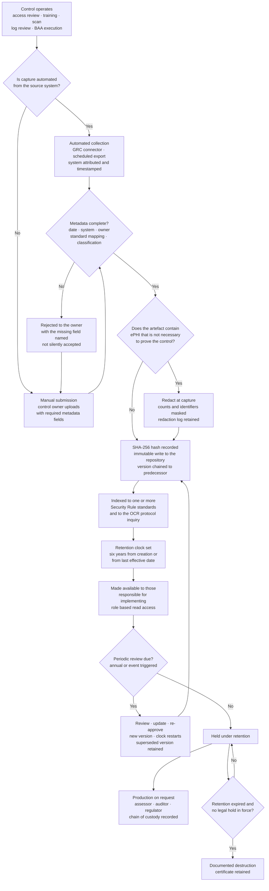

# 08.09 — Evidence Repository &amp; Documentation

| Field | Value |
|---|---|
| Document ID | MBH-IAA-EVD-2026-809 |
| Version | 1.0 |
| Date | 2026-07-15 |
| Classification | Confidential — Electronic Protected Health Information (ePHI) // Illustrative Portfolio Sample |
| Owner | Karen Boyd, Chief Compliance Officer |
| Co-Owner | Marcus Reed, Information Security Manager (evidence custodian) · Priya Anand, Director of Internal Audit (independent sampling) |
| Author | Advisory Team (Healthcare GRC / HIPAA) |
| Status | Approved |

## Purpose

Three independent assessors spent eleven weeks inside MercyBridge in 2026. Between them, Ironwood, Priya Anand and Beacon Assurance inspected roughly **1,100 artefacts**. Not one of the four lenses asked *"do you have a policy?"* without immediately asking *"and show me it operates."*

This document defines the **evidence repository** that answers the second question: what §164.316(b) actually requires, how the repository is indexed to the Security Rule standards rather than to the org chart, what counts as evidence and what does not, how chain of custody and integrity are maintained, and how a complete production is assembled inside an OCR data-request window.

> **Position at 2026-12-31: 8,412 controlled evidence artefacts across 18 index nodes · 100% indexed to at least one Security Rule standard · median production time 1.5 business days · retention model applied to 100% of the population · 0 artefacts containing avoidable ePHI.**

The design principle is one sentence, and it comes from watching what fails in real investigations: **evidence is captured as the control operates, not reconstructed when it is requested.** Reconstruction produces documents dated after the request, and a document dated after the request proves the request, not the control.

## 1. What §164.316(b) Requires

§164.316 is the standard most often treated as administrative housekeeping and most often decisive in an enforcement action. It has four operative obligations and MercyBridge treats each as a control with an owner.

| Obligation | Regulatory text, in substance | What it means in practice | MercyBridge implementation |
|---|---|---|---|
| **Written form** | Maintain the policies and procedures, and any action, activity or assessment required to be documented, **in written (which may be electronic) form** | An undocumented control is, for evidentiary purposes, an absent control | All 24 policies, 61 procedures and every required record held electronically under version control |
| **Retention — §164.316(b)(2)(i)** | Retain for **six years from the date of creation or the date it was last in effect, whichever is later** | The clock does **not** start at creation for a document still in force; a policy in force for four years is retained for ten | Retention calculated per artefact by the rule in §5; enforced by the platform, not by memory |
| **Availability — §164.316(b)(2)(ii)** | Make documentation **available to those persons responsible for implementing** the procedures | Evidence locked away from the people who operate the control fails the standard | Role-based read access for every control operator; 100% of policies published to the workforce portal |
| **Review and update — §164.316(b)(2)(iii)** | Review **periodically** and update as needed in response to environmental or operational changes affecting ePHI security | A policy suite that never changes is a policy suite nobody reads | Annual review minimum; event-driven review on the T-E1 to T-E5 triggers in 04.09 |

**Two things §164.316(b) does not say, which matter.** It does not specify a format, and it does not specify a system. An entity may satisfy it with a well-run document library. What it will not tolerate is an entity that cannot say, artefact by artefact, **when the retention clock started, when it ends, and who can reach the document in between.**

## 2. Repository Structure — Indexed to the Rule, Not the Org Chart

The repository is organised by **Security Rule standard**, because that is how every assessor, auditor and regulator navigates. Departmental structure is a metadata attribute, not the hierarchy.

| Node | Index | Standards covered | Principal contents | Artefacts | Custodian |
|---|---|---|---|---|---|
| EV-01 | Governance &amp; policy | §164.316(a); §164.308(a)(2) | 24 policies, 61 procedures, approval records, version history, Security Official designation | 412 | Karen Boyd |
| EV-02 | Risk analysis &amp; management | §164.308(a)(1)(ii)(A)–(B) | Risk analysis, methodology, 56-risk register, treatment plan, register movement by phase | 186 | Michelle Tran |
| EV-03 | Workforce security | §164.308(a)(3) | Authorisation and clearance records, **412 termination records**, sanction records | 731 | Marcus Reed / HR |
| EV-04 | Training &amp; awareness | §164.308(a)(5) | Completion data for **6,512** workforce members, role-based content, phishing campaign results | 528 | Karen Boyd |
| EV-05 | Access management | §164.308(a)(4); §164.312(a); §164.312(d) | Provisioning requests, recertification cycles, **1,182 privileged accounts**, MFA coverage, break-glass reviews | 1,246 | Marcus Reed |
| EV-06 | Activity review &amp; audit controls | §164.308(a)(1)(ii)(D); §164.312(b) | Monthly review records, reviewer attestations, SIEM onboarding evidence, log retention proof | 604 | Marcus Reed |
| EV-07 | Business associates | §164.308(b); §164.314(a) | **~180 BAAs**, 24 critical, register, due diligence, monitoring, subcontractor flow-down | 894 | Lisa Coleman |
| EV-08 | Incidents &amp; breach | §164.308(a)(6); §164.400–414 | Incident register, 3 incident files, 3 four-factor determinations, discovery-determination records, breach log | 317 | Rebecca Stern |
| EV-09 | Contingency &amp; recovery | §164.308(a)(7) | Backup evidence, restore verifications, DR plan, emergency mode, **restoration validation 7 of 12** | 288 | Anthony Ruiz |
| EV-10 | Physical safeguards | §164.310(a)–(c) | Facility access plans, visitor logs, badge records, workstation standards and observations | 466 | Facilities Director |
| EV-11 | Device &amp; media | §164.310(d) | Disposal certificates, media movement log, NIST SP 800-88 sanitisation records | 203 | Anthony Ruiz |
| EV-12 | Encryption &amp; transmission | §164.312(a)(2)(iv); §164.312(e) | Encryption-at-rest evidence for **68 of 68** systems; TLS inventory; certificate management | 341 | Marcus Reed |
| EV-13 | Integrity | §164.312(c) | Interface reconciliation records, hash verification, change-control records | 158 | Anthony Ruiz |
| EV-14 | Vulnerability &amp; patch | §164.308(a)(1)(ii)(B); §164.308(a)(5)(ii)(B) | Scan results, SLA performance, exception register with expiries, KEV closure | 1,104 | Marcus Reed |
| EV-15 | Medical devices &amp; IoMT | §164.310; §164.312 | **6,120-device** inventory, MDS2 records, compensating-control packages, vendor advisories | 622 | Clinical Engineering |
| EV-16 | Independent assessment | §164.308(a)(8) | Ironwood reports and retests, internal audit file IA-2026-14, Beacon workpaper references, HITRUST certificate | 197 | Daniel Cho |
| EV-17 | Evaluation &amp; continuous compliance | §164.308(a)(8) | Evaluation charter, calendar, workbooks, KRI packs, committee minutes | 84 | Daniel Cho |
| EV-18 | Regulator readiness | §164.316(b) | OCR protocol mapping, standing production set, drill records, prior correspondence | 31 | Karen Boyd |
| — | **Total** | — | — | **8,412** | — |

## 3. Evidence Types and What Each Proves

An assessor does not accept all evidence equally. The repository classifies every artefact by **evidential strength**, because a screenshot and a system-generated population export do not carry the same weight.

| Evidence type | Proves | Strength | Refresh cadence | Retention start |
|---|---|---|---|---|
| **Policy or procedure** | Design intent and management authorisation | Weakest alone — proves nothing about operation | Annual + event-driven | **Date last in effect** |
| **Risk analysis and register** | The §164.308(a)(1)(ii)(A) obligation; the basis for every safeguard decision | Foundational | Annual + trigger-driven | Date of creation of each version |
| **Training completion record** | Workforce received and completed required content | Strong (system-generated) | Continuous | Date of completion |
| **Access review / recertification record** | The control operated on a named date with a named reviewer | Strong when attested | Quarterly / semi-annual | Date of review |
| **System configuration extract** | The configured state at a point in time | Strong when dated and system-attributed | Monthly to quarterly | Date of extract |
| **Audit log and log-review record** | Activity occurred; someone reviewed it | Strong for the log, **only as strong as the attestation** for the review | Continuous / monthly | Date generated |
| **Business associate agreement** | The §164.314(a) contractual position | Strong; binary | On execution and amendment | **Date last in effect** |
| **Incident and determination file** | §164.414(b) burden of proof discharged | Strongest single artefact class | Per event | Date of determination |
| **Independent assessment report** | An outsider tested it | Strongest for §164.308(a)(8) | Annual | Date of issue |
| **Committee minutes and decision records** | Governance operated; decisions were made by authorised people | Strong for oversight inquiries | Per meeting | Date of meeting |
| **Screenshot** | Something appeared on a screen once | **Weak** unless dated, system-attributed and reproducible | As needed | Date of capture |

**The rule applied to screenshots.** A screenshot is accepted into the repository only with the system name, the capturing user, the UTC timestamp and the query or navigation path that reproduces it. Beacon inspected 412 configuration artefacts across 68 systems and rejected none on attribution grounds — a direct result of enforcing this rule from Phase 04, not from Phase 08.

## 4. Continuous Capture — the Evidence Lifecycle

| Capture mode | Share of the population | Examples |
|---|---|---|
| **Automated from source system** | **64%** | Training completions, scan results, MFA coverage, log-retention proof, endpoint coverage, BAA register extracts |
| **Workflow-enforced at the point of action** | 21% | Provisioning approvals, disposal certificates, change records, incident files |
| **Manual submission with metadata validation** | 15% | Committee minutes, walkthrough notes, physical observation records, vendor correspondence |

**The direction of travel matters more than the current split.** Every finding in this phase that concerned *missing evidence rather than a missing control* — IA-F-02, IA-F-07, IA-F-08, CAP-04 — was a manual-capture failure. All four remediations convert a manual filing step into a workflow-enforced one. The target is 80% automated capture by the 2027 recertification.

## 5. Retention — Worked Correctly

The six-year clock is misapplied more often than any other Security Rule provision. These are the four cases MercyBridge encounters and how each is calculated.

| Case | Artefact | Created | Last in effect | **Retain until** | Why |
|---|---|---|---|---|---|
| Superseded policy | POL-07 v1.0, replaced by v2.0 on 2026-05-18 | 2021-03-02 | **2026-05-18** | **2032-05-18** | Later of the two dates; the clock runs from when it ceased to be in force |
| Policy currently in force | POL-12 Security Incident Procedures v2.0 | 2026-05-18 | **Still in effect** | **Clock has not started** — six years from the day it is superseded | A live policy has no expiry; retention begins when it stops applying |
| Point-in-time record | Four-factor determination for INC-2026-0044 | 2026-05-29 | n/a — a record, not a policy | **2032-05-29** | Six years from creation; §164.414(b) burden of proof |
| Recurring operational record | 2026-09 information system activity review | 2026-10-04 | n/a | **2032-10-04** | Six years from creation of that instance |

| Retention control | Implementation |
|---|---|
| Clock calculation | Set automatically at ingestion from the artefact class and the effective-date field; no manual entry of a destruction date |
| Legal hold | Overrides destruction entirely; applied by Lisa Coleman; currently in force on the PT-03 archived database and all three incident files |
| Destruction | Only on expiry, only with no hold, and only with a retained destruction certificate; media sanitised under NIST SP 800-88 |
| State law | Where a state health-records requirement exceeds six years, the **longer** period governs; the repository applies the maximum applicable |
| Audit of the model | Priya Anand sampled 40 artefacts across the four cases in IA-2026-14; **0 exceptions on the retention calculation** |

## 6. Chain of Custody and Integrity

| Control | How it works | Why an assessor cares |
|---|---|---|
| Immutable write | Artefacts are written once; a change creates a new version chained to its predecessor. No in-place edit exists for any user role | An editable evidence store proves nothing about the past |
| Cryptographic hash | **SHA-256** recorded at ingestion and re-verified on every production | Detects silent alteration; supports a §164.312(c)(1) integrity claim about the evidence itself |
| Attribution | Every artefact carries capturing identity, source system and UTC timestamp | An unattributed document is an assertion, not evidence |
| Access control and logging | Role-based read; write restricted to the custodian role; **every read of an incident or determination file is logged** | Demonstrates §164.312(a) and (b) applied to the compliance function itself |
| Production log | Every external production records requester, date, artefact list, hash at production, and delivery method | Reconstructs exactly what was given to whom — indispensable in a multi-year investigation |
| Segregation | The evidence custodian (Marcus Reed) cannot approve his own control-operation evidence; Internal Audit samples independently | Removes the self-attestation problem |
| **ePHI minimisation** | Evidence proves a control, not a patient. Identifiers are masked at capture; counts replace records; **no artefact contains ePHI unless the ePHI is the evidence** | Producing unnecessary ePHI to a third party is itself a disclosure to be justified |

**The redaction standard, stated concretely.** Ironwood evidenced PT-02 with a study-count field and PT-03 with a `COUNT(*)` result, both masked at capture. The repository applies the same rule internally: an access-review artefact shows the account and the reviewer, not the patient records the account touched.

## 7. Producing Evidence Inside a Data-Request Window

| Tier | Definition | Target | Achieved in RFI-DRILL-2026-01 |
|---|---|---|---|
| **T1 — Standing production set** | The nine items OCR asks for first (08.08 §3); pre-assembled, refreshed on change | **Same day** | 21 of 42 items, same day |
| **T2 — Indexed and current** | Held in the repository, indexed, needs only extraction and a production log entry | **≤ 2 business days** | 17 of 42 |
| **T3 — Requires assembly** | Population extracts, sampling, cross-system reconciliation | **≤ 10 business days** | 3 of 42, all produced |
| **T4 — Gap** | The evidence does not exist because the control did not operate | **Cannot be produced — escalate** | **1 of 42 — CAP-01 restoration validation** |

| Production discipline | Rule |
|---|---|
| Single point of contact | Karen Boyd; all correspondence routed through Compliance with Legal (Lisa Coleman) for privilege review |
| Nothing created after the request | Any artefact generated post-request is **labelled as such** and produced separately from contemporaneous evidence |
| Completeness over speed | A partial population is disclosed as partial; an incomplete extract presented as complete is the single fastest way to lose credibility |
| Say "we do not have that" | Where evidence does not exist, the response says so and states the remediation, owner and date. G-1 was answered this way in the drill |
| Hash verification | Every produced artefact is hash-checked against ingestion; mismatches block production |
| Retain the production | The production set itself is retained for six years as part of EV-18 |

## 8. Repository Metrics

| Measure | 2026-02 baseline | **2026-12-31** | Target |
|---|---|---|---|
| Controlled evidence artefacts | ~900 (uncontrolled shares) | **8,412** | — |
| Artefacts indexed to a Security Rule standard | Not measured | **100%** | 100% |
| Artefacts indexed to an OCR protocol inquiry | 0 | **91 inquiries covered** | 91 |
| Automated capture share | ~12% | **64%** | 80% by 2027-11 |
| Median production time | Not measured | **1.5 business days** | ≤ 2 |
| Retention clock correctly set | Not measured | **100%** (40-item audit sample, 0 exceptions) | 100% |
| Artefacts rejected at ingestion for missing metadata | — | 214 (2.4% of submissions) | Trend down |
| Artefacts containing avoidable ePHI | Unknown | **0** | 0 |
| Assessor requests for information answered in window | — | **47 of 47** (Beacon fieldwork) | 100% |
| Evidence disputes raised by any assessor | — | **0** | 0 |

## Cross-References

| Reference | Relevance |
|---|---|
| 01.05 — Documentation &amp; Records Management | The §164.316 policy this repository implements |
| 03.07 — Risk Register | Held in node EV-02 as the foundational artefact |
| 04.09 — Evaluation | The review triggers T-E1 to T-E5 that drive periodic update |
| 04.11 — Change Control | The mechanism that creates new versions and restarts the retention clock |
| 05.06 — Audit Controls | The §164.312(b) records held in EV-06 |
| 06.03 — Business Associate Agreements | The ~180-BAA population held in EV-07 |
| 07.06 — Breach Risk Assessment — Four Factor | The determination files held in EV-08 under legal hold |
| 07.10 — Incident Register &amp; Case Studies | The six-year incident file requirement |
| 08.05 — Internal Audit of the Security Program | The ~340 artefacts inspected and the retention sample |
| 08.07 — HITRUST i1 Assessment Results | The 412 configuration artefacts Beacon inspected from this repository |
| 08.08 — OCR Audit Protocol Readiness | The standing production set and the RFI-DRILL-2026-01 result |
| 08.10 — Findings Remediation Tracker | Where the four manual-capture findings are tracked |

---
[⬅ Previous](08.08-ocr-audit-protocol-readiness.md) · [🏠 Phase README](08.00-README.md) · [Next ➡](08.10-findings-remediation-tracker.md)
