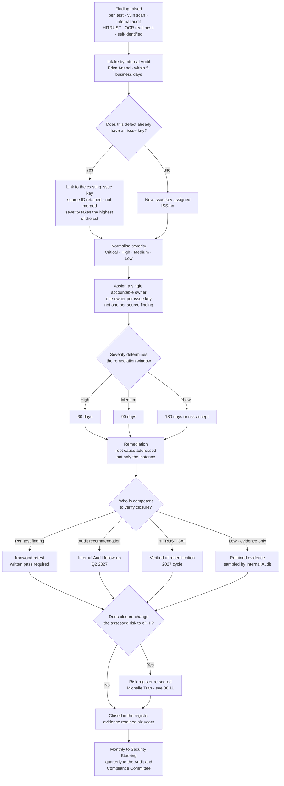

# 08.10 — Findings Remediation Tracker

| Field | Value |
|---|---|
| Document ID | MBH-IAA-TRK-2026-810 |
| Version | 1.0 |
| Date | 2026-07-15 |
| Classification | Confidential — Electronic Protected Health Information (ePHI) // Illustrative Portfolio Sample |
| Owner | Priya Anand, Director of Internal Audit |
| Co-Owner | Daniel Cho, Chief Information Security Officer &amp; HIPAA Security Official · Karen Boyd, Chief Compliance Officer |
| Author | Advisory Team (Healthcare GRC / HIPAA) |
| Status | Approved |

## Purpose

Four independent lenses produced findings in 2026. If each keeps its own list, MercyBridge ends the year with four trackers, four sets of dates, four owners for the same defect, and no single answer to the only question governance actually asks: **what is open, who owns it, and when does it close?**

This is that single answer. It consolidates the **16 Ironwood penetration test findings**, the **9 Internal Audit recommendations** and the **8 HITRUST corrective action plans** into one register with one status model, adds the detection and carried-forward items that travel alongside them, and — most importantly — **maps the convergence**, because several findings are the same defect seen from three directions.

> **Consolidated position at 2026-12-31: 45 tracked items · 22 closed · 23 open · 1 overdue and re-baselined · 0 items closed on management assertion where independent verification was required.**
>
> **Of the 33 findings raised by the three independent lenses: 16 closed, 17 open, all with a named owner and a date inside the first half of 2027. The 33 findings resolve to 26 distinct underlying issues.**

Convergence is not duplication. When a pen tester, an auditor and an external assessor independently arrive at the same defect, that defect is **more real, not more numerous** — and this tracker is built to make that visible rather than to inflate the count.

## 1. Tracker Governance

| Attribute | Position |
|---|---|
| Register of record | `trackers/consolidated-findings-register.xlsx`; this document is the point-in-time statement of it |
| Custodian | **Priya Anand** — deliberately Internal Audit, not the CISO, so that closure is not attested by the function being assessed |
| Intake | Any finding from any lens, plus regulator correspondence and self-identified defects |
| De-duplication | Findings are **linked, never merged**. Each source ID survives; a shared **issue key** groups them |
| Severity model | Normalised across lenses to Critical / High / Medium / Low using the 08.02 definitions |
| Date discipline | A due date may be re-baselined **once**, with a documented reason and Committee visibility. A second slip escalates to the Board Audit &amp; Compliance Committee |
| Closure evidence | Stated per item in §6. Management assertion alone closes nothing above Low |
| Reporting | Monthly to the Security Steering Committee; quarterly to the Audit &amp; Compliance Committee (Robert Feldman); annually to the Board |
| Verification of closure | Ironwood retest for pen test findings; Internal Audit follow-up (Q2 2027) for recommendations; HITRUST recertification for CAPs |

| Status | Meaning |
|---|---|
| **Closed — verified** | Remediated and independently verified by the party competent to verify it |
| **Closed — evidenced** | Remediated with retained evidence; independent verification not required at this severity |
| **In progress** | Work under way, on schedule, evidence accruing |
| **Open — scheduled** | Owner and date assigned; work not yet started or dependent on a sequenced predecessor |
| **Overdue** | Past the original date; re-baselined once with a reason; escalated |

## 2. Lens 1 — Ironwood Penetration Test Findings (16)

**All 16 remediated and independently re-tested by Ironwood. No finding was closed on MercyBridge's word.**

| ID | Severity | Issue key | Owner | Closed | Verification | Status |
|---|---|---|---|---|---|---|
| **PT-01** | **High** | ISS-01 segmentation boundary | Anthony Ruiz | 2026-10-07 | Ironwood retest **pass 2026-10-09** | **Closed — verified** |
| **PT-02** | **High** | ISS-02 vendor privileged access | Marcus Reed | 2026-10-10 | Ironwood retest **pass 2026-10-13** | **Closed — verified** |
| **PT-03** | **High** | ISS-03 asset inventory completeness | Anthony Ruiz | 2026-10-02 | Ironwood retest **pass 2026-10-06** | **Closed — verified** |
| PT-04 | Medium | ISS-04 service account hygiene | Marcus Reed | 2026-11-02 | Retest pass 2026-11-04 | Closed — verified |
| PT-05 | Medium | ISS-05 authentication path coverage | Marcus Reed | 2026-10-19 | Retest pass 2026-10-21 | Closed — verified |
| PT-06 | Medium | ISS-06 protocol hardening | Anthony Ruiz | 2026-11-09 | Retest pass 2026-11-11 | Closed — verified |
| PT-07 | Medium | ISS-07 transmission security | Marcus Reed | 2026-10-19 | Retest pass 2026-10-21 | Closed — verified |
| PT-08 | Medium | ISS-08 local credential reuse | Anthony Ruiz | 2026-11-16 | Retest pass 2026-11-18 | Closed — verified |
| PT-09 | Medium | **ISS-09 wireless authentication** | Anthony Ruiz | 2026-11-16 | Retest pass 2026-11-18 | Closed — verified · **214-device remnant continues as CAP-05** |
| PT-10 | Medium | ISS-10 portal account enumeration | Marcus Reed | 2026-10-26 | Retest pass 2026-10-28 | Closed — verified |
| PT-11 | Low | ISS-11 application information disclosure | Marcus Reed | 2026-11-23 | Retest pass 2026-11-25 | Closed — verified |
| PT-12 | Low | ISS-11 application information disclosure | Marcus Reed | 2026-11-23 | Retest pass 2026-11-25 | Closed — verified |
| PT-13 | Low | ISS-12 clinic edge devices | Clinical Engineering | 2026-11-30 | Retest pass 2026-12-02 | Closed — verified |
| PT-14 | Low | ISS-13 internal name disclosure | Anthony Ruiz | 2026-11-23 | Retest pass 2026-11-25 | Closed — verified |
| PT-15 | Low | **ISS-14 physical consistency** | Facilities / Marcus Reed | 2026-11-30 | Retest pass 2026-12-02 | Closed — verified · **converges with IA-F-04 and CAP-08** |
| PT-16 | Low | ISS-15 peripheral estate hardening | Anthony Ruiz | 2026-11-30 | Retest pass 2026-12-02 | Closed — verified |

## 3. Lens 3 — Internal Audit Recommendations (9)

Raised in **IA-2026-14**, reported to the Audit &amp; Compliance Committee **2026-11-24**. **None Critical, none High.** All nine accepted by management with named owners.

| ID | Rating | Issue key | Recommendation, in brief | Owner | Due | Status at 2026-12-31 |
|---|---|---|---|---|---|---|
| **IA-F-01** | Medium | **ISS-16 termination timeliness** | Automate the HR-to-IAM trigger for all worker types, including per-diem; report exceptions weekly | Marcus Reed / HR Director | 2027-03-31 | **In progress** — per-diem feed in build; weekly exception report live from 2026-12-01 |
| **IA-F-02** | Medium | **ISS-17 activity-review attestation** | Make retention of the reviewer attestation a system-enforced step | Marcus Reed | 2027-01-31 | **In progress** — GRC workflow deployed 2026-12-14; two review cycles required to evidence |
| **IA-F-03** | Medium | **ISS-18 BA flow-down and oversight** | Complete the §164.314(a)(2)(iii) flow-down sweep across all ~180 BAs | Lisa Coleman | 2027-04-30 | **In progress** — 62 of ~180 reviewed; 3 amendments issued |
| **IA-F-04** | Medium | **ISS-14 physical consistency** | Quarterly alarm testing; electronic visitor logging at the two paper sites | Facilities Director | 2027-02-28 | **In progress** — alarm re-enabled during fieldwork; logging procurement complete |
| **IA-F-05** | Medium | **ISS-19 centralised audit logging** | Complete SIEM onboarding for the remaining ePHI systems; report monthly | Marcus Reed | 2027-01-31 | **In progress** — **65 of 68** at 2026-12-15 |
| **IA-F-06** | Medium | **ISS-20 procedure currency** | Add a procedural-dependency field to change control | Karen Boyd | 2027-01-31 | **In progress** — form amended; both lagging procedures re-issued 2026-12-09 |
| **IA-F-07** | Low | **ISS-21 provisioning approval evidence** | Enforce approval capture; disable the manual bypass | Marcus Reed | 2027-02-28 | **In progress** — bypass disabled 2026-12-11; evidence period running |
| **IA-F-08** | Low | ISS-22 disposal certificate filing | Make certificate upload a mandatory closure step | Anthony Ruiz | 2027-01-31 | **In progress** — ticket workflow change in test |
| **IA-F-09** | Low | ISS-23 break-glass review timeliness | Automate the review-due alert to the CMIO office | Dr. Samuel Ortega | 2027-02-28 | **Open — scheduled** |

## 4. Lens 4 — HITRUST i1 Corrective Action Plans (8)

Attached to the certification issued **2026-11-30**, valid to **2027-11-29**. Each is verified at recertification; an overdue CAP jeopardises renewal.

| ID | Score | Issue key | Corrective action, in brief | Owner | Due | Status at 2026-12-31 |
|---|---|---|---|---|---|---|
| **CAP-01** | **25%** | **ISS-24 restoration validation** | Complete validated 24-hour restoration testing for the remaining **5 of 12** Tier 1 systems | Anthony Ruiz | 2027-03-31 | **Open — scheduled** · dependent on M-2, which has slipped. **The highest-attention item in this register** |
| **CAP-02** | 50% | **ISS-18 BA flow-down and oversight** | Extend risk-tiered monitoring below the 24 critical BAs; annual attestation with evidence sampling | Lisa Coleman | 2027-04-30 | In progress — tiering model approved 2026-12-05 |
| **CAP-03** | 50% | **ISS-19 centralised audit logging** | Complete SIEM onboarding for the remaining ePHI systems | Marcus Reed | 2027-01-31 | In progress — 65 of 68 |
| **CAP-04** | 50% | **ISS-21 provisioning approval evidence** | Disable the workflow bypass; enforce approval capture | Marcus Reed | 2027-02-28 | In progress — bypass disabled 2026-12-11 |
| **CAP-05** | 50% | **ISS-09 wireless authentication** | Retire or replace the **214-device** legacy PSK remnant; evidence interim segmentation and client isolation | Anthony Ruiz | 2027-06-30 | In progress — 41 of 214 replaced; isolation evidenced |
| **CAP-06** | 50% | ISS-25 baseline coverage of legacy appliances | Vendor-supported assessment path or replacement for **72** hosts that cannot accept credentialed assessment | Anthony Ruiz | 2027-06-30 | In progress — 18 of 72 have a vendor path agreed |
| **CAP-07** | 50% | **ISS-16 termination timeliness** | Automate the HR-to-IAM trigger across all worker types | Marcus Reed | 2027-03-31 | In progress — same workstream as IA-F-01 |
| **CAP-08** | 50% | **ISS-14 physical consistency** | Quarterly alarm testing; electronic visitor logging at remaining paper sites | Facilities Director | 2027-02-28 | In progress — same workstream as IA-F-04 |

## 5. Convergence Map — Where the Lenses Agree

**33 findings from three independent lenses resolve to 26 distinct underlying issues.** Seven findings are second or third sightings of a defect another lens already found.

| Issue key | The underlying defect | Pen test | Internal audit | HITRUST | Lenses | What the convergence tells us |
|---|---|---|---|---|---|---|
| **ISS-09** | Legacy wireless devices cannot do enterprise authentication | **PT-09** | — | **CAP-05** | 2 | The remediation closed the finding; the 214-device population is a **structural** constraint, not a configuration miss |
| **ISS-14** | Physical security is inconsistent across sites, not absent | **PT-15** | **IA-F-04** | **CAP-08** | **3** | Adversarial, sampled and prescriptive testing all found the same thing. This is a **consistency** problem — the hardest kind to fix and the easiest to under-rate |
| **ISS-16** | Termination access removal lags for non-standard worker types | — | **IA-F-01** | **CAP-07** | 2 | 100%-population analytics and prescriptive requirement testing agree. **0 accesses were used post-termination** — the control failed on timeliness, not on outcome |
| **ISS-18** | BA governance is strong at the critical tier, thin below it | — | **IA-F-03** | **CAP-02** | 2 | Contract language and ongoing monitoring are separate defects in the same population; both point below the 24 critical BAs |
| **ISS-19** | 6 of 68 ePHI systems do not forward audit logs centrally | — | **IA-F-05** | **CAP-03** | 2 | Also visible as detection item **D-3** and in the 48% pen test detection rate. **Four sightings of one gap** |
| **ISS-21** | Provisioning approvals not always captured | — | **IA-F-07** | **CAP-04** | 2 | Both lenses found the same manual bypass; the access granted was appropriate in every case examined |
| **ISS-24** | Tier 1 restoration procedures documented but not validated | — | Noted as a carried exception (R-47a) | **CAP-01** | 2 | The lowest score in the entire i1 assessment, and the only OCR protocol inquiry MercyBridge **cannot** answer |

| Convergence statistic | Value |
|---|---|
| Findings raised by the three lenses | **33** |
| Distinct underlying issues | **26** |
| Issues seen by two lenses | **6** |
| Issues seen by **three** lenses | **1** — ISS-14 |
| CAPs matching an independently raised audit finding or carried item | **5 of 8** (CAP-01, CAP-03, CAP-04, CAP-07, CAP-08) |
| Issues MercyBridge had **already named and dated** before any assessor arrived | **4** — ISS-19, ISS-24, plus the wireless and legacy-appliance constraints |
| **Findings raised by the OCR Audit Protocol readiness review (08.08) that were new** | **0** — all ten readiness gaps map to an existing ID |

**The last row is the strongest evidence in this document.** A fourth lens, applied last, using the regulator's own question set, found nothing the first three had missed.

## 6. Verification and Closure Discipline

## 7. Supplementary Items Travelling on the Same Tracker

Not findings from the three lenses, but managed on the same register because they compete for the same owners and the same 2027 calendar.

| ID | Item | Source | Owner | Due | Status at 2026-12-31 |
|---|---|---|---|---|---|
| D-11 | 48% detection rate against tester actions | 08.03 §6 | Marcus Reed | 2026-12-31 | **Closed — evidenced.** Re-measured at **74%** in the 2026-12 purple-team run |
| D-12 | WAF in monitor-only mode on an externally published host | 08.03 §6 | Marcus Reed | 2026-11-15 | **Closed — evidenced** |
| D-13 | Vendor jump host not forwarding to the SIEM | 08.03 §6 | Marcus Reed | 2026-11-30 | **Closed — evidenced** |
| D-14 | Median detect → escalate of 41 minutes against a 30-minute target | 08.03 §6 | Marcus Reed | 2027-02-28 | In progress |
| **D-3** | 6 of 68 ePHI systems not forwarding to the SIEM | 07.12 carried | Marcus Reed | 2027-01-31 | In progress — **duplicate reference to ISS-19 / CAP-03 / IA-F-05; not counted twice** |
| F-2 | Outpatient downtime kits and drill across ~30 sites | 07.09 | Ambulatory Director | 2026-10-31 | **Closed 2026-12-08** — kits at all sites; **CLIN-2026-01 drill conducted at 6 sites** |
| F-2a | Read-only clinical viewer at the remaining 4 outpatient sites | Successor to F-2 | Ambulatory Director | 2027-03-31 | Open — scheduled |
| F-3 | HIM reconciliation surge capacity re-based to a 10-day outage | 07.09 | HIM Director | 2026-11-30 | **Closed 2026-11-20** — agency surge contract executed; model re-based; **verified by Internal Audit** |
| F-4 | Call-centre ramp for a 200,000+ notification population | 07.09 | Rebecca Stern | 2026-10-31 | **Closed 2026-10-24** — vendor amendment executed |
| **M-2** | Joint full-scale restoration test with Halcyon | 07.12 | Anthony Ruiz | ~~2026-09~~ → **2027-02-28** | **OVERDUE — re-baselined once.** Vendor sequencing; escalated to the Committee 2026-11-24. **Blocks CAP-01 and reverts the R-23 residual** |
| R-47a | Validated restoration for the remaining 5 of 12 Tier 1 systems | 07.12 | Anthony Ruiz | 2027-03-31 | Open — **duplicate reference to ISS-24 / CAP-01; not counted twice** |
| V-24 | Immutable or offline copies for 9 remaining Tier 2–3 systems | 07.12 | Anthony Ruiz | Q4 2026 → Q1 2027 | In progress — **6 of 9 complete** |
| MIN-1 | Mailbox PHI-minimisation review from INC-2026-0044 | 07.12 | Rebecca Stern | 2026-12-31 | In progress — scoping complete; remediation into Q1 2027 |
| O-6 | Customer-managed encryption keys at Halcyon | 06.x / 07.12 | Lisa Coleman / Daniel Cho | 2027-03-31 | Open — scheduled |

## 8. Totals, Ageing and Escalation

| Register segment | Items | Closed | Open | Overdue |
|---|---|---|---|---|
| Ironwood penetration test findings | **16** | **16** | 0 | 0 |
| Internal Audit recommendations | **9** | 0 | **9** | 0 |
| HITRUST corrective action plans | **8** | 0 | **8** | 0 |
| Detection improvement items | 4 | 3 | 1 | 0 |
| Phase 07 carried items and successors | 8 | 3 | 5 | **1** |
| Duplicate references (D-3, R-47a) | — | — | — | not counted |
| **Total tracked** | **45** | **22** | **23** | **1** |

| Ageing of the 23 open items | Count |
|---|---|
| Due 2027-01-31 | 5 |
| Due 2027-02-28 | 6 |
| Due 2027-03-31 | 5 |
| Due 2027-04-30 | 2 |
| Due 2027-06-30 | 2 |
| Q1 2027, no fixed date | 2 |
| **Overdue at 2026-12-31** | **1 — M-2** |
| Open beyond the HITRUST recertification window (2027-11-29) | **0** |

| Escalation and attention | Position |
|---|---|
| Items requiring Board Audit &amp; Compliance Committee attention | **2 — M-2 and CAP-01**, which are the same dependency chain |
| Why M-2 matters beyond its own closure | It is the **condition** on the R-23 residual (08.11 §4). Its slip does not merely delay a test; it **lapses a risk claim** |
| Second re-baseline permitted | **No.** A further slip on M-2 goes to Robert Feldman with a recovery plan, not a new date |
| Items at risk of missing their date | **3** — CAP-01 (dependency), CAP-05 (device replacement lead time), CAP-06 (vendor dependency). All flagged in the 2026-12 Committee pack |
| Items closed without the required verification | **0** |
| Findings downgraded, disputed or quietly withdrawn | **0** — confirmed independently by Internal Audit (08.05 §7) |

**What the totals actually say.** Every finding capable of being closed inside 2026 was closed and independently verified. Everything still open is open for one of two honest reasons: it needs an **operating period** before evidence exists (IA-F-02, IA-F-07, CAP-04), or it depends on something outside MercyBridge's unilateral control — a vendor test window, a device replacement cycle, a capital sequence. Neither reason is an excuse, and both are dated.

## Cross-References

| Reference | Relevance |
|---|---|
| 03.07 — Risk Register | Where closures that change assessed risk are re-scored |
| 04.11 — Change Control | The mechanism through which remediations are implemented |
| 06.06 — Ongoing Business Associate Monitoring | The programme extended under ISS-18 |
| 07.09 — Incident Response Tabletop Exercise | Origin of F-2, F-3 and F-4 |
| 07.12 — Phase Summary &amp; Transition | The carried items listed in §7 |
| 08.03 — Penetration Test Results | The 16 findings in §2 and the detection items in §7 |
| 08.04 — Vulnerability Assessment &amp; Remediation | The remediation detail and Ironwood retest evidence |
| 08.05 — Internal Audit of the Security Program | The 9 recommendations in §3 and the closure-discipline audit |
| 08.07 — HITRUST i1 Assessment Results | The 8 CAPs in §4 and their recertification dependency |
| 08.08 — OCR Audit Protocol Readiness | The ten readiness gaps, all of which map to IDs in this register |
| 08.11 — Control-to-Risk Traceability | Where closure and non-closure move the risk register |
| 08.12 — Phase Summary &amp; Transition | Where this position is confirmed as the Phase 08 baseline |

---
[⬅ Previous](08.09-evidence-repository-and-documentation.md) · [🏠 Phase README](08.00-README.md) · [Next ➡](08.11-control-to-risk-traceability.md)
