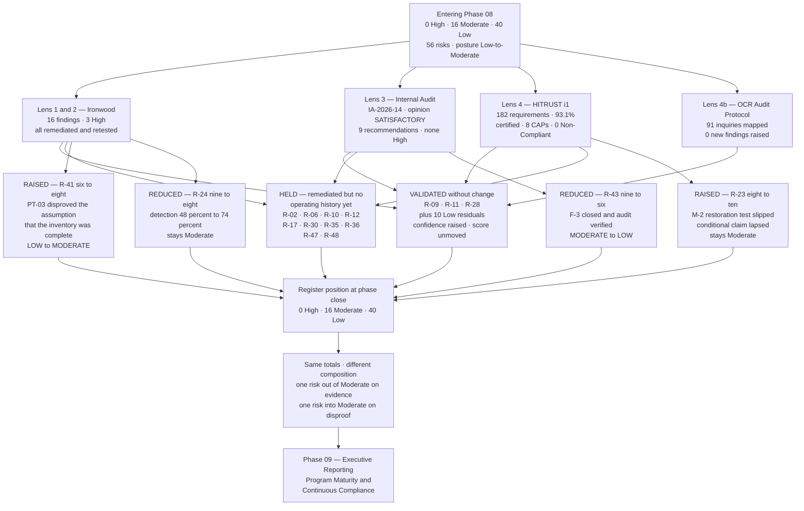

# 08.11 — Control-to-Risk Traceability

| Field | Value |
|---|---|
| Document ID | MBH-IAA-TRC-2026-811 |
| Version | 1.0 |
| Date | 2026-07-15 |
| Classification | Confidential — Electronic Protected Health Information (ePHI) // Illustrative Portfolio Sample |
| Owner | Daniel Cho, Chief Information Security Officer &amp; HIPAA Security Official |
| Co-Owner | Michelle Tran, VP Enterprise Risk (register custodian) · Priya Anand, Director of Internal Audit |
| Author | Advisory Team (Healthcare GRC / HIPAA) |
| Status | Approved |

## Purpose

Every previous phase of this programme moved the risk register by **building something**. Phase 08 mostly did not. It hired three parties to find out whether what had already been built was real.

That makes this traceability document different from its five predecessors, and the difference has to be stated before the tables start:

> **An independent assessment phase does not primarily reduce risk. It reduces *uncertainty about* risk. Those are not the same thing, and a register that treats them as the same is not a register — it is a marketing document.**

So this matrix reports four kinds of movement, and only one of them is a reduction:

1. **Validated** — the residual claimed in an earlier phase was tested by an outsider and survived. The score does not change; its **confidence** does.
2. **Held** — a control was remediated, but the remediation has no operating history yet, so the score does not move.
3. **Raised** — testing disproved an assumption the residual depended on, or a conditional claim lapsed.
4. **Reduced** — independent evidence supports a genuinely lower score.

Phase 08 opened at **0 High / 16 Moderate / 40 Low** and closes at **0 High / 16 Moderate / 40 Low**. That identity is **not** evidence that nothing happened. It is the arithmetic coincidence of two opposite band movements — one risk left the Moderate band on closed evidence, one entered it because a penetration test proved an assumption false — plus one within-band increase and one within-band reduction. §5 shows the working.

## 1. Method

Scoring is unchanged from **03.05**: **likelihood × impact on a 5×5 scale**, bands **High 15–25 · Moderate 8–12 · Low 1–6**, with the **ESC-1/ESC-2 patient-safety escalations**.

| Rule | Statement |
|---|---|
| **Validation is not treatment** | Independent confirmation of a residual does not lower it. It raises confidence in it. Confidence is recorded in a separate column and never converted into score |
| **Remediation without operating history holds** | A finding closed and retested proves the fix exists on a date. It does not prove the control operates. Scores move on operating evidence, not on closure evidence |
| **Disproof moves the score up** | Where a test shows a residual rested on an assumption that is false, the score is **raised** to what the evidence supports, at the date of discovery |
| **Conditional claims lapse, they do not persist** | A residual claimed conditionally on a named future test reverts if the test does not happen, exactly as it would if the test failed. A slipped test is an unproven claim |
| **One lens is not evidence; three lenses are** | Where the pen test, Internal Audit and HITRUST agree on a control's effectiveness, the residual is marked **Validated — high confidence**. A single lens gives **Validated — moderate confidence** |
| **Negative results count** | What the test could **not** reach (08.03 §5) is evidence for the register, not an absence of evidence |
| **No new risk IDs without a re-analysis** | Findings are mapped to existing register entries or re-score them. New IDs are created only at the annual re-analysis under 03.10, so the register does not drift between analyses |

## 2. The Phase 08 Control Set

Thirteen controls. **Five are genuinely new safeguards**, produced as consequences of testing. **Eight are assurance mechanisms** — they do not protect ePHI directly; they establish whether the things that do are working.

| Control | Name | Type | Where defined | Security Rule anchor | Risks engaged |
|---|---|---|---|---|---|
| **IV-01** | Annual independent penetration test with mandatory retest of every finding | Assurance | 08.01–08.03 | §164.308(a)(8) | All technical residuals |
| **IV-02** | Closure discipline — no finding closes on management assertion where independent verification is competent | Assurance | 08.04 §5 | §164.308(a)(1)(ii)(B) | R-17, R-06, R-02 |
| **IV-03** | Continuous vulnerability management — monthly authenticated, weekly internet-facing, KEV at 7 days with no exception | Safeguard | 08.04 §1–2 | §164.308(a)(1)(ii)(B); §164.308(a)(5)(ii)(B) | R-09, R-25, R-42 |
| **IV-04** | Compensating-control package for unpatchable and unscannable assets, with expiry-bound risk acceptance | Safeguard | 08.04 §3–4 | §164.308(a)(1)(ii)(B); §164.312(a)(1) | **R-09, R-10, R-11, R-12** |
| **IV-05** | **Quarterly ePHI inventory reconciliation** against DNS, certificate transparency and external attack-surface data | **New safeguard** | 08.04 §7 | §164.308(a)(1)(ii)(A) | **R-41**, R-17 |
| **IV-06** | **Mandatory expiry on every firewall, ACL and MFA exception**, with named re-approval | **New safeguard** | 08.04 §7 | §164.312(a)(1); §164.312(d) | **R-01, R-06, R-17, R-19** |
| **IV-07** | **Quarterly purple-team validation of the medical device boundary** | **New safeguard** | 08.04 §7 | §164.312(a)(1) | **R-10, R-17** |
| **IV-08** | **Vendor privileged-access broker mandated for all third-party remote support**, with MFA and session recording | **New safeguard** | 08.04 §7 | §164.312(d); §164.314(a) | **R-02, R-06, R-13** |
| **IV-09** | **Detection engineering programme** — 34 new analytics mapped to techniques Ironwood actually used | **New safeguard** | 08.04 §6 | §164.312(b); §164.308(a)(1)(ii)(D) | **R-24, R-35** |
| **IV-10** | Internal audit of the security programme, annually, reporting to the Audit &amp; Compliance Committee | Assurance | 08.05 | §164.308(a)(8) | All |
| **IV-11** | HITRUST i1 validated assessment and the CAP regime attached to it | Assurance | 08.06–08.07 | §164.308(a)(8) | All |
| **IV-12** | OCR Audit Protocol mapping with twice-yearly unannounced data-request drills | Assurance | 08.08 | §164.316(b) | **R-54** |
| **IV-13** | Evidence repository under §164.316(b) with continuous capture and chain of custody | Assurance | 08.09 | §164.316(b) | **R-54, R-55** |

**The honest accounting.** Of the 13, only IV-03 to IV-09 touch ePHI protection at all, and four of those five *new* safeguards exist because a penetration tester found something. Phase 08's contribution to risk reduction is small; its contribution to **knowing whether the previous six phases worked** is the whole point of the phase.

## 3. Keystone Traceability Matrix — the 16 Moderate Residuals

| Risk | Description | Entering (L × I) | Lenses applied | Independent evidence | Residual | **Outcome** | Confidence |
|---|---|---|---|---|---|---|---|
| **R-02** | Shared and generic logins defeat unique identification and destroy audit attribution | **2 × 4 = 8** | Pen test · Audit | **PT-02 found a shared vendor service credential in use across 11 imaging modalities since 2022.** Remediated, per-engineer accounts issued, broker mandated (IV-08); Ironwood retest pass | **2 × 4 = 8** | **HELD** — the class was proven to still exist; one retest is not an operating history | Moderate |
| **R-06** | Vendor remote-support entitlements across the device estate are under-reviewed | **2 × 4 = 8** | Pen test · Audit · HITRUST | PT-02 root cause; broker mandate now covers **all** third-party remote support across ~180 BAs; session recording live; HITRUST Third Party Assurance 86% with CAP-02 open | **2 × 4 = 8** | **HELD** — CAP-02 shows oversight below the critical tier is still thin | Moderate |
| **R-09** | Known exploited vulnerabilities on unsupported-OS devices cannot be patched | **2 × 4 = 8** | Vuln · HITRUST | **KEV-listed instances reduced 148 → 0 (100%)**; monthly authenticated scanning at 96.2%; compensating packages evidenced (IV-04) | **2 × 4 = 8** | **VALIDATED** — the residual is structural, not remediable; the score was already honest | **High** |
| **R-10** | Malware propagation into device VLANs halts clinical device availability (ESC-1) | **2 × 4 = 8** | Pen test · HITRUST | **PT-01 proved the boundary was not what MercyBridge believed** — 412 legacy devices reachable from the workstation VLAN via a 2019 static route and a 2024 ACL rule. Remediated; default-deny rebuilt; IV-07 quarterly validation introduced | **2 × 4 = 8** | **HELD** — the fix is verified; the *process* that let the boundary rot needs two clean quarterly validations before the score moves | Moderate |
| **R-11** | ePHI at rest on device platforms that cannot encrypt; loss forfeits safe harbour (ESC-1) | **2 × 5 = 10** | Pen test · Audit · HITRUST | Ironwood recovered **no plaintext ePHI** from any reached storage; 68 of 68 systems encrypted; the device population remains structurally unencryptable | **2 × 5 = 10** | **VALIDATED** — unchanged and correctly stated | **High** |
| **R-12** | Devices without an MDS2 on file cannot be assessed to a consistent standard | **2 × 4 = 8** | Vuln · HITRUST | Passive attribution at 5,704 of 6,120 (93.2%); procurement clause added; **CAP-06 open on 72 hosts that cannot accept credentialed assessment** | **2 × 4 = 8** | **HELD** — CAP-06 dated 2027-06-30 | Moderate |
| **R-17** | Incomplete micro-segmentation permits lateral movement into Tier 1 clinical systems | **2 × 4 = 8** | **Pen test** · Audit · HITRUST | **The definitive test of this risk.** PT-01 crossed a boundary that was documented as closed; PT-06 and PT-08 showed lateral paths on the workstation tier. **All remediated and retested**; Domain Administrator **not obtained**; tiered administration held; Network Protection domain 93% | **2 × 4 = 8** | **HELD** — segmentation is now proven in one direction and disproven in another. IV-06 and IV-07 are the treatment; their evidence is quarterly | Moderate |
| **R-23** | Enterprise ransomware disabling Tier 1 clinical systems across 4 hospitals and ~30 clinics (ESC-2) | **2 × 4 = 8** *(conditional)* | Pen test · Audit · HITRUST | Immutable copies verified; **but the joint Halcyon restoration test (M-2) slipped from 2026-09 into 2027-02**, so recoverability at enterprise scale is **unproven**. HITRUST BC/DR domain **79%**, the lowest in the assessment, with **CAP-01 at 25%** | **2 × 5 = 10** | **RAISED** — the conditional claim lapsed exactly as 07.11 said it would | **High** |
| **R-24** | Double-extortion exfiltration of ePHI before encryption | **3 × 3 = 9** | Pen test · Audit · HITRUST | Detection rate against tester actions **48% → 74%** after IV-09; D-12 and D-13 closed; egress baselining and leak-site monitoring operating; Incident Management domain **100%**; Ironwood **extracted no data** at any point | **3 × 3 → 2 × 4 = 8** | **REDUCED** within band — likelihood down on measured detection, impact held | **High** |
| **R-28** | Compromise or extended outage of the vendor-hosted Halcyon EHR holding 2.1M records (ESC-2) | **2 × 5 = 10** | Audit · HITRUST | SOC 2 Type II relied upon after scope and competence review; MercyBridge-side interfaces tested clean; **O-6 customer-managed keys still open**; the joint restoration test is also the Halcyon dependency | **2 × 5 = 10** | **VALIDATED** — and explicitly not reduced while O-6 and M-2 are open | Moderate |
| **R-30** | Subcontractor (BA-of-BA) chain is not visible for hosted services | **2 × 4 = 8** | Audit · HITRUST | **IA-F-03**: 3 of 40 sampled BAAs lacked §164.314(a)(2)(iii) flow-down language; **CAP-02** on monitoring below the critical tier | **2 × 4 = 8** | **HELD** — two independent lenses found the same thin layer | **High** |
| **R-35** | Extended adversary dwell time because telemetry does not reach the SIEM | **2 × 4 = 8** | **Pen test** · Audit · HITRUST | The pen test measured what the register had estimated: **48% detection, 41-minute median escalation, PT-02 and PT-03 undetected**. Improvements landed (74% re-measure) but **6 of 68 systems still do not forward logs**; Audit Logging domain **82%** | **2 × 4 = 8** | **HELD** — improved but not closed; moves on SIEM completion, not on one purple-team run | **High** |
| **R-36** | Workforce browses records without a treatment, payment or operations purpose | **2 × 4 = 8** | Audit | **IA-F-02**: activity review performed but the reviewer attestation was not retained for 3 of 25 sampled months. The control operates; the evidence of it does not always survive | **2 × 4 = 8** | **HELD** — a detective control you cannot evidence is not a detective control an assessor will credit | Moderate |
| **R-43** | Integrity loss on post-downtime documentation reconciliation (ESC-3) | **3 × 3 = 9** | Audit | **F-3 closed 2026-11-20**: HIM surge model re-based on a 10-day outage, agency surge contract executed, and **Internal Audit verified the closure**. This is the assumption TTX-2026-01 disproved in Phase 07, now corrected with evidence | **2 × 3 = 6** | **REDUCED — Moderate → LOW** | Moderate |
| **R-47** | Tier 1 restoration time has never been validated at full scale | **2 × 4 = 8** | Audit · HITRUST | **The validation count did not move: 12 of 12 documented, 7 of 12 validated.** CAP-01 scored **25%**, the lowest single requirement score in the i1 assessment | **2 × 4 = 8** | **HELD** — and it is the register's most exposed position | **High** |
| **R-48** | Backup immutability and offline copies incomplete for Tier 2–3 systems | **2 × 4 = 8** | Audit · HITRUST | V-24: **6 of 9** remaining systems complete; backup network isolated and **not reachable or alterable** from any position Ironwood achieved | **2 × 4 = 8** | **HELD** — closes on the remaining 3 in Q1 2027 | Moderate |

### 3.1 The One Risk That Entered the Moderate Band

| Risk | Description | Entering | What disproved the assumption | Residual | **Outcome** |
|---|---|---|---|---|---|
| **R-41** | Unstructured and unaccounted ePHI outside the governed inventory | **2 × 3 = 6 (Low)** | **PT-03.** An internet-facing appointment application, live since 2018, superseded in 2023, never decommissioned, holding **6,880 records** of name, date of birth, contact details and free-text reason-for-visit. It appeared in **no** ePHI inventory, had no owner, no BAA dependency, no patching path and no logging. The Low residual rested on the assumption that discovery scanning had bounded the sprawl. **It had not** | **2 × 4 = 8** | **RAISED — Low → MODERATE** |

**Why it was raised and not simply remediated.** The application is gone, the database is under legal hold, the host was sanitised, and IV-05 now reconciles the inventory against DNS, certificate transparency and external attack-surface data every quarter — so an orphan can survive at most one quarter. All of that is true and none of it justifies keeping the old score. The score expressed a **belief about completeness**, and the test proved the belief wrong. The residual returns to Low when **two consecutive quarterly reconciliations** complete with no unaccounted ePHI-bearing asset — the first is due 2027-03-31.

## 4. The Risk That Was Raised

**R-23 — the conditional claim that lapsed.**

07.11 stated the condition in writing: *"if the joint full-scale restoration test with Halcyon in 2026-09 does not demonstrate recoverability, R-23 reverts to 2 × 5 = 10."* The test did not fail. **It did not happen** — vendor sequencing pushed it to 2027-02-28, and CAP-01 records the consequence at the requirement level: 5 of 12 Tier 1 systems have documented but unvalidated 24-hour restoration procedures, scored **25%**.

| Question | Answer |
|---|---|
| Is a slipped test the same as a failed test? | **For the register, yes.** The impact reduction from 5 to 4 rested on demonstrated recoverability. Nothing demonstrates it. The claim is unproven, so it is withdrawn |
| Does that mean the immutable replica is worthless? | No. It exists, it is independently keyed, and quarterly restore verification passes. What is unproven is **recovery of the enterprise at clinical scale** — a different assertion |
| Was this discovered by an assessor or self-reported? | **Self-reported**, then independently confirmed by both Internal Audit (08.05 §6) and Beacon (CAP-01) |
| What restores the reduction? | M-2 completing successfully by 2027-02-28, then CAP-01 closing by 2027-03-31. R-23 returns to 8 on evidence, not on schedule |
| Board visibility | M-2 escalated to the Audit &amp; Compliance Committee on 2026-11-24. **A second re-baseline is not authorised** |

## 5. Register Movement

| Band | Entering Phase 08 | Movements in Phase 08 | **At phase close** |
|---|---|---|---|
| **High** (15–25) | 0 | None | **0** |
| **Moderate** (8–12) | 16 | R-43 leaves to Low (−1); **R-41 enters from Low (+1)**; R-23 raised 8 → 10 within band; R-24 reduced 9 → 8 within band | **16** |
| **Low** (1–6) | 40 | R-43 enters (+1); **R-41 leaves (−1)** | **40** |
| **Total** | **56** | — | **56** |

| Statement | Position |
|---|---|
| Risks examined by at least one independent lens and re-stated here | **27 of 56** |
| Residuals **validated** by independent evidence without change | **13** |
| Residuals **held** — remediated, but without operating history | **10** |
| Residuals **reduced** | **2** — R-24 (within band), R-43 (Moderate → Low) |
| Residuals **raised** | **2** — R-23 (within band, conditional claim lapsed), R-41 (Low → Moderate, assumption disproved) |
| Risks whose determinative treatment sits in Phase 08 | **2** — R-41 (IV-05) and, partially, R-24 (IV-09) |
| **High risks in the register** | **0** — sustained for a **third** consecutive phase, now under external test |
| Overall posture | **Low-to-Moderate**, with the Moderate band still concentrated in **availability, recovery and third-party assurance** |
| Reconciliation to the 03.08 target profile of 0 / 23 / 33 | High matches; Low exceeds target by 7; reconciled at the annual re-analysis under 03.10 |

## 6. Low Residuals Validated by Independent Testing

These did not move. What changed is that an outsider now stands behind them.

| Risk | Residual | Independent evidence | Confidence |
|---|---|---|---|
| **R-01** — MFA incomplete on remote and privileged access | Low (4) | PT-05 found one legacy authentication path and it was closed; **IA 100% MFA coverage test across 68 systems**; HITRUST Password Management **100%**; all 14 MFA exceptions reviewed, 11 revoked | **High** |
| **R-31** — BA breach notice too late for the 60-day duty | Low (4) | Audit sampled 40 BAAs including 24 of 24 critical; contractual clocks present; Incident Management domain 100% | **High** |
| **R-34** — clinician or staff mailbox compromise | Low (6) | Phishing report rate **22.4%** against a 20% target in the live social-engineering test; item-level mailbox auditing verified | **High** |
| **R-37** — IR capability undocumented and unexercised | Low (4) | Audit re-performed **3 of 3** four-factor assessments and reached the same conclusions; HITRUST Incident Management **100%** | **High** |
| **R-40** — ePHI at rest unencrypted | Low (4) | **Ironwood defeated no encryption and recovered no plaintext ePHI**; 68 of 68 verified by Internal Audit; Transmission Protection 100% | **High** |
| **R-49** — outpatient downtime procedures untested | Low (6) | **CLIN-2026-01 drill conducted 2026-12-08 at 6 sites**; kits verified at all ~30; conditional flag removed. Viewer access at 4 remaining sites tracked as F-2a | Moderate |
| **R-51** — unattended logged-in workstations | Low (6) | **PT-15 observed 2; Internal Audit observed 4 of 60.** Auto-lock reduced to 5 minutes clinically. **Not reduced** — two lenses found it independently | Moderate |
| **R-52** — tailgating and badge-sharing | Low (6) | **PT-15 succeeded at 1 of 2 sampled administrative entrances.** Badge and escort controls held at both clinical sites. **Not reduced** — tracked under ISS-14 with CAP-08 | Moderate |
| **R-54** — documentation currency and §164.316(b) retention | Low (6) | **IA-F-06** on two lagging procedures; retention model sampled at 40 artefacts with **0 exceptions**; HITRUST §164.316 mapping **100%**; evidence repository established (IV-13) | **High** |
| **R-55** — activity review not evidenced | Low (6) | **IA-F-02**; 65 of 68 systems in the SIEM at 2026-12-15; Audit Logging domain 82% with CAP-03 dated | **High** |

## 7. Residual Ownership and the Next Test

| Residual | Score | Owner | Next test that can move it | Date |
|---|---|---|---|---|
| **R-23** — enterprise ransomware | **Moderate (10) — raised** | Daniel Cho | **M-2 joint restoration test**, then CAP-01 closure. Returns to 8 on demonstrated recoverability | 2027-02-28 → 2027-03-31 |
| **R-47** — Tier 1 restoration validation | Moderate (8) | Anthony Ruiz | Validation count moving beyond 7 of 12 | Q1 2027 |
| **R-41** — unaccounted ePHI outside the inventory | **Moderate (8) — raised** | Marcus Reed | **Two consecutive clean quarterly reconciliations** under IV-05 | 2027-03-31 and 2027-06-30 |
| **R-35** — dwell time and telemetry gaps | Moderate (8) | Marcus Reed | SIEM onboarding of the final 3 systems; detection re-measure in the 2027 pen test | 2027-01-31 |
| **R-17 / R-10** — segmentation and device boundary | Moderate (8) each | Anthony Ruiz | **Two clean quarterly purple-team validations** under IV-07 | Q1 and Q2 2027 |
| **R-02 / R-06** — shared credentials and vendor access | Moderate (8) each | Marcus Reed | Broker adoption across the full third-party population; CAP-02 closure | 2027-04-30 |
| **R-30** — subcontractor chain | Moderate (8) | Lisa Coleman | Flow-down sweep completion (IA-F-03) and tiered monitoring (CAP-02) | 2027-04-30 |
| **R-12 / R-09 / R-11** — device estate | Moderate (8 / 8 / 10) | Anthony Ruiz | CAP-06 assessment path; replacement cycle. **Structurally durable** | 2027-06-30 |
| **R-24** — double-extortion exfiltration | Moderate (8) | Daniel Cho / Rebecca Stern | Purple-team exfiltration validation; DLP rollout | Q1–Q2 2027 |
| **R-28** — Halcyon concentration | Moderate (10) | Daniel Cho | O-6 customer-managed keys; joint restoration test | 2027-03-31 |
| **R-36 / R-48** — activity review evidence; Tier 2–3 immutability | Moderate (8) each | Marcus Reed / Anthony Ruiz | IA-F-02 evidence period; final 3 of 9 systems | 2027-01-31 / Q1 2027 |
| **R-43** — reconciliation integrity | **Low (6) — reduced** | HIM Director | Re-exercised at TTX-2027-01 against a 10-day scenario | Q2 2027 |

## 8. What Independent Assessment Did **Not** Validate

| Not validated | Why | Where it is carried |
|---|---|---|
| Enterprise-scale recoverability | The test that would prove it did not run | R-23, R-47, CAP-01, M-2 |
| Halcyon's internal control environment | Reliance placed on SOC 2 Type II; not independently tested by MercyBridge's assessors | R-28; Phase 06 |
| The security of the ~180 business associates themselves | HITRUST validated MercyBridge's **oversight**, not the BAs' posture | R-30, CAP-02 |
| Ransomware impact in live conditions | Deliberately out of pen test scope; assessed by tabletop only | R-23, R-24 |
| Any control on the 142 **non-ePHI** systems | Outside the declared scope of every lens | Enterprise risk register, not this one |
| Sustained operation of the 2026 remediations | Every fix is younger than three months. **Time is the only test for this one** | The 10 residuals marked HELD |

## Cross-References

| Reference | Relevance |
|---|---|
| 03.05 — Risk Assessment Methodology | The 5×5 model, bands and ESC escalations applied here |
| 03.07 — Risk Register | The 56 risks as originally scored |
| 03.08 — Risk Treatment Plan | The 0 / 23 / 33 target profile this position is measured against |
| 03.10 — Risk Analysis Maintenance | Where new risk IDs may be created; why none were created here |
| 07.11 — Control-to-Risk Traceability | The 0 High / 16 Moderate / 40 Low position handed in, and the R-23 reversion rule invoked in §4 |
| 08.03 — Penetration Test Results | The evidence behind R-10, R-17, R-41 and the detection position on R-35 |
| 08.04 — Vulnerability Assessment &amp; Remediation | Controls IV-03 to IV-09 |
| 08.05 — Internal Audit of the Security Program | The independent confirmation of residuals in §6 |
| 08.07 — HITRUST i1 Assessment Results | The domain scores and CAPs cited throughout |
| 08.10 — Findings Remediation Tracker | The closure and non-closure evidence behind every movement |
| 08.12 — Phase Summary &amp; Transition | Where this position is confirmed as the Phase 08 baseline |
| Phase 09 — Executive Reporting &amp; Program Maturity | Where the residual position is reported to the Board |

---
[⬅ Previous](08.10-findings-remediation-tracker.md) · [🏠 Phase README](08.00-README.md) · [Next ➡](08.12-phase-summary-and-transition.md)
